# TensorRT-LLM Architecture & Codebase Learning Overview

**Scope:** Deep-dive learning guide covering TensorRT-LLM's architecture, key features, end-to-end user journey, competitive landscape, and future development opportunities. Includes code references, design rationale, framework comparisons, and Mermaid diagrams.

**Last updated:** April 2026 — reflects TensorRT-LLM v1.3.0 (main branch), vLLM v0.19.0, SGLang v0.5.10, LMCache v0.4.2.

---

## Table of Contents

1. [High-Level Architecture](#1-high-level-architecture)
2. [Key Features Deep-Dive](#2-key-features-deep-dive)
   - [In-Flight Batching](#21-in-flight-batching-ifb)
   - [Overlap Scheduler](#22-overlap-scheduler)
   - [KV Cache Manager V1 & V2](#23-kv-cache-manager-v1--v2)
   - [Block Reuse (Prefix Caching)](#24-block-reuse-prefix-caching)
   - [Disaggregated Serving](#25-disaggregated-serving)
   - [Speculative Decoding](#26-speculative-decoding)
   - [Parallelism Strategies](#27-parallelism-strategies)
   - [Other Notable Features](#28-other-notable-features)
3. [End-to-End User Journey (PyTorch Backend)](#3-end-to-end-user-journey-pytorch-backend)
   - [Launch & Initialization](#31-launch--initialization)
   - [Model Loading & Weight Loading](#32-model-loading--weight-loading)
   - [Request Handling & Response](#33-request-handling--response)
   - [Failover & Fault Tolerance](#34-failover--fault-tolerance)
   - [Auto-Scaling](#35-auto-scaling)
4. [Framework Comparison](#4-framework-comparison)
5. [Future Development Opportunities](#5-future-development-opportunities)
   - [Category 1: Critical Feature Gaps vs. Mainstream Frameworks](#51-category-1-critical-feature-gaps-vs-mainstream-frameworks)
   - [Category 2: Critical Bugs and Architectural Issues](#52-category-2-critical-bugs-and-architectural-issues)
   - [Category 3: Innovative and Futuristic Features](#53-category-3-innovative-and-futuristic-features)
6. [Strategic Prioritization](#6-strategic-prioritization)

---

## 1. High-Level Architecture

TensorRT-LLM is NVIDIA's open-source library for optimized LLM inference on NVIDIA GPUs. It provides a Python + C++ stack bridging user-facing APIs with high-performance GPU execution, supporting three backends that share a common C++ core.

### 1.1 Backend Overview

| Backend | Status | Entry Point | Description |
|:--------|:-------|:------------|:------------|
| **PyTorch** | Default & active development | `TorchLlmArgs` -> `PyExecutor` | Native PyTorch with custom CUDA kernels via CuTE DSL |
| **AutoDeploy** | Beta (maturing rapidly) | `_torch/auto_deploy/` shim | `torch.export` + graph transforms + MLIR elementwise fusion |
| **TensorRT** | Legacy (maintenance mode) | `TrtLlmArgs` -> `trtllm.Executor` | TensorRT engine compilation |

**What's changed (v1.2-v1.3):**
- PyTorch backend is now stable and default since v1.0; actively developed with CuTE DSL-based custom kernels.
- AutoDeploy is maturing rapidly — now supports DeepSeek-R1 and Qwen3.5, with MLIR-based auto-generated elementwise fusion (e.g., `SiLU+Mul` transform) and custom attention mask support.
- C++ sampler (`TLLM Sampler`) is now default (breaking change in v1.1), replacing TorchSampler for most paths. TorchSampler still required for beam search.

### 1.2 Architecture Diagram

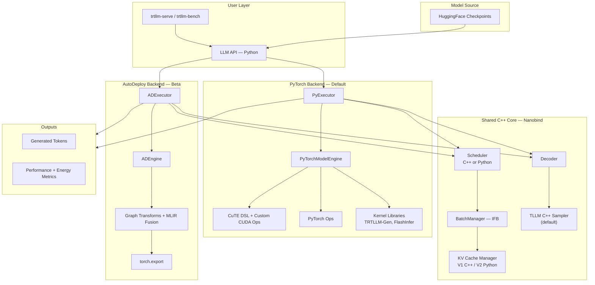

### 1.3 Request Flow

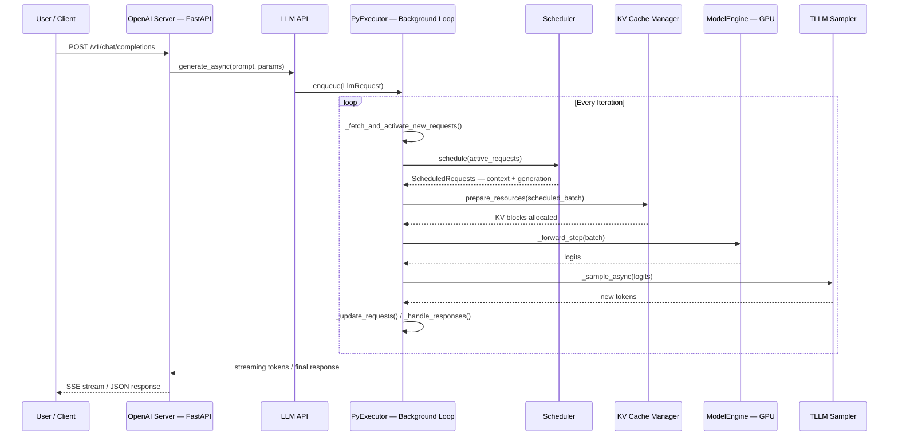

### 1.4 Key Files Reference

| File | Role |
|:-----|:-----|
| `tensorrt_llm/llmapi/llm.py` | Main API entry point (`LLM` class) |
| `tensorrt_llm/llmapi/llm_args.py` | Configuration schema (Pydantic): `BaseLlmArgs`, `TorchLlmArgs` |
| `tensorrt_llm/_torch/pyexecutor/py_executor.py` | Core execution loop (~3750 lines, the heart of the system) |
| `tensorrt_llm/_torch/pyexecutor/model_engine.py` | Model loading and forward pass |
| `tensorrt_llm/_torch/pyexecutor/resource_manager.py` | KV cache and resource management |
| `tensorrt_llm/_torch/pyexecutor/scheduler/` | Scheduler implementations (V1 bound C++, unified Python, V2) |
| `tensorrt_llm/executor/executor.py` | Execution abstraction (`GenerationExecutor`) |
| `tensorrt_llm/mapping.py` | Parallelism topology (`Mapping`, process groups) |
| `tensorrt_llm/serve/openai_server.py` | OpenAI-compatible HTTP server |
| `tensorrt_llm/_torch/speculative/` | All speculative decoding algorithms |
| `tensorrt_llm/_torch/auto_deploy/` | AutoDeploy backend with MLIR fusion |
| `docs/source/features/feature-combination-matrix.md` | Feature compatibility matrix |

---

## 2. Key Features Deep-Dive

### 2.1 In-Flight Batching (IFB)

#### What It Is

In-flight batching (also called *continuous batching* or *iteration-level batching*) allows the scheduler to insert new prefill requests into an already-running decode batch **on every iteration**, rather than waiting for the entire batch to complete.

#### Why It Exists

Static batching forces all requests to finish before new work is admitted. Since sequences complete at different times, GPUs sit idle waiting for the longest sequence. IFB fills these gaps continuously, improving GPU utilization by 2-10x.

#### Design

TRT-LLM's scheduler operates in **two phases** each iteration:

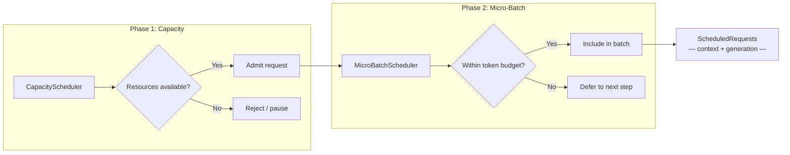

This two-phase design cleanly separates *resource availability* from *batch construction*. The C++ implementations (`BindCapacityScheduler`, `BindMicroBatchScheduler` in `scheduler/scheduler.py`) keep scheduling overhead minimal, while Python interfaces (`PyCapacityScheduler`, `PyMicroBatchScheduler`) allow custom policies.

**What's new (v1.2-v1.3):**
- The micro-batch scheduler now accounts for **reusable KV cache blocks** in capacity scheduling, improving admission decisions when prefix caching is active.
- A **Python scheduler** is now exposed via `use_python_scheduler` in `SchedulerConfig`, enabling custom scheduling policies without C++ changes.
- Request priority support in LLM API enables priority-based scheduling.

**Code path:** Every iteration, `_fetch_and_activate_new_requests()` polls the request queue, `_schedule()` calls `scheduler.schedule_request(active_requests, inflight_req_ids)`, and the result mixes continuing generation with new context work under `max_batch_size` and `max_num_tokens` constraints.

#### Framework Comparison

| Framework | Approach | Differentiation |
|:----------|:---------|:----------------|
| **TensorRT-LLM** | Two-phase scheduler (capacity + micro-batch) | Configurable C++ or Python schedulers; chunked prefill; cache-aware capacity |
| **vLLM** | Continuous batching in V1 with unified scheduler | Token-uniform scheduling via `{request_id: num_tokens}` dict; zero-bubble async scheduling |
| **SGLang** | Continuous batching + cache-aware scheduling | Considers prefix cache hit rates for routing decisions |

---

### 2.2 Overlap Scheduler

#### What It Is

The overlap scheduler is a pipeline optimization that **hides CPU latency behind GPU computation**. Instead of serializing GPU forward passes and CPU bookkeeping, it launches the GPU forward for step N+1 while processing CPU-side results from step N in parallel.

#### Why It Exists

Without overlap, the CPU must finish all result processing (stop-criteria checks, token appending, response updates, KV cache bookkeeping) before launching the next GPU forward. This creates GPU idle bubbles, especially at large batch sizes.

```mermaid
gantt
    title Non-Overlap — Sequential Execution
    dateFormat X
    axisFormat %s

    section GPU
    Forward N    :a1, 0, 3
    Idle         :crit, a2, 3, 5
    Forward N+1  :a3, 5, 8

    section CPU
    Idle         :crit, b1, 0, 3
    Process N    :b2, 3, 5
    Idle         :crit, b3, 5, 8
```

```mermaid
gantt
    title Overlap — Pipelined Execution
    dateFormat X
    axisFormat %s

    section GPU
    Forward N    :a1, 0, 3
    Forward N+1  :a3, 3, 6
    Forward N+2  :a4, 6, 9

    section CPU
    Idle         :crit, b1, 0, 3
    Process N    :b2, 3, 5
    Process N+1  :b3, 6, 8
```

#### Design

The implementation uses a `previous_batch` staging pattern in `py_executor.py` (`_executor_loop_overlap`):

1. **Schedule batch N** (`_prepare_and_schedule_batch`)
2. **Launch GPU forward for batch N** (`_forward_step`)
3. **While GPU works on N**, process CPU results from batch N-1 (`_update_requests` on `previous_batch.sample_state`, then `_process_previous_batch`)
4. **Sample batch N async** (`_sample_async`)
5. **Store batch N as `previous_batch`** for next iteration

**What's new (v1.2-v1.3):**
- Overlap scheduler now supports **early exit** — removing redundant D2H synchronization for improved latency.
- Now compatible with **guided decoding** and **speculative decoding** combinations.
- PDL (Programmatic Dependent Launch) enabled by default for further kernel launch overhead reduction.

**Trade-off:** One extra decoding step is introduced (the last batch's results are processed one iteration late). This is a minor cost for the 10-22% measured throughput improvement.

#### Framework Comparison

| Framework | Overlap Strategy |
|:----------|:----------------|
| **TensorRT-LLM** | CPU/GPU overlap via `previous_batch` staging; default on; early-exit optimization |
| **SGLang** | Zero-overhead batch scheduler — similar overlap design (cited as inspiration) |
| **vLLM V1** | DBO (Dual-Batch Overlap) generalized for all models; `EngineCore` multiprocessing isolates API server from scheduler+executor |

---

### 2.3 KV Cache Manager V1 & V2

#### What It Is

The KV cache stores previously computed key-value attention pairs to avoid redundant computation during autoregressive generation. The KV Cache Manager handles block allocation, eviction, cross-request reuse (prefix caching), and multi-tier storage (GPU to host offloading).

#### Why Two Versions Exist

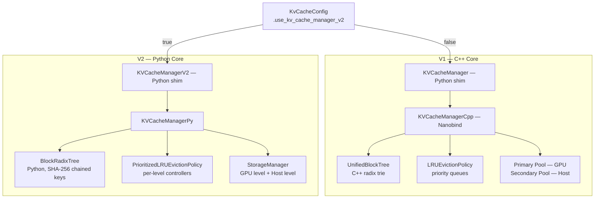

| Dimension | V1 (C++) | V2 (Python) |
|:----------|:---------|:------------|
| **Core language** | C++ with nanobind | Python |
| **Block lookup** | `UnifiedBlockTree` — radix trie keyed by block hashes | `BlockRadixTree` — radix tree with SHA-256 chained block keys |
| **Memory tiers** | Primary (GPU) + Secondary (host) as a pool-pair | Explicit multi-tier with constraint-based memory partitioning |
| **Eviction** | Priority-tiered LRU free-lists per retention priority | `PrioritizedLRUEvictionPolicy` with per-level eviction controllers |
| **Unique features (V1)** | Beam search, KV events, KV connector, star attention | — |
| **Unique features (V2)** | — | Scheduler-driven suspend/resume, SSM cache reuse, batched migration, heterogeneous `tokens_per_block` |
| **Selection** | Default | `kv_cache_config.use_kv_cache_manager_v2 = True` |

**What's new in V2 (v1.2-v1.3):**
- **Constraint-based memory partitioning** — smarter allocation policies.
- **SSM (State Space Model) cache support** — prefix caching for Mamba hybrid models (Qwen3.5, Nemotron Super V3).
- **`max_gpu_total_bytes` control** — explicit memory budget capping.
- **Heterogeneous `tokens_per_block`** — different block sizes for different use cases.
- **KV cache statistics monitoring** for observability.

#### How Eviction Works

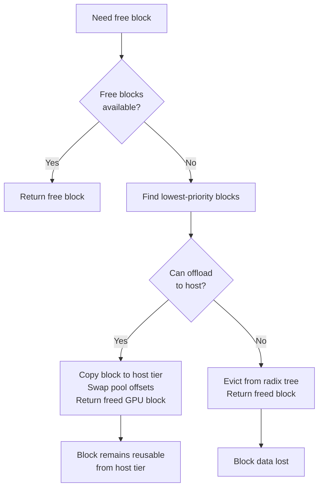

Both V1 and V2 use **prioritized LRU** eviction:

- Blocks have priorities 0-100 (higher = more important)
- Lowest-priority blocks are evicted first; within the same priority, LRU ordering applies
- Users control priorities via `KvCacheRetentionConfig` with optional time-based expiration

**Key files:** `resource_manager.py` (V1 shim + V2 shim), `cpp/tensorrt_llm/batch_manager/kvCacheManager.cpp`, `tensorrt_llm/runtime/kv_cache_manager_v2/`.

#### Framework Comparison

| Framework | KV Cache Design | Distinctive Capability |
|:----------|:---------------|:-----------------------|
| **TensorRT-LLM** | Block-based, radix tree, prioritized LRU, GPU-to-host offloading | Priority-based retention with time expiry; V2 suspend/resume; SSM cache reuse |
| **vLLM** | PagedAttention — virtual memory metaphor with fixed-size pages | General CPU KV cache offloading with pluggable CachePolicy; zero-overhead prefix caching |
| **SGLang** | RadixAttention — radix tree for automatic prefix discovery | Cache-aware scheduling; hierarchical caching (GPU L1 + host L2) |
| **LMCache** | External KV cache layer with multi-tier storage (GPU/CPU/disk/S3/Redis/NIXL) | Cross-engine, cross-instance KV cache sharing; GDS integration; k8s operator |

---

### 2.4 Block Reuse (Prefix Caching)

#### What It Is

Block reuse enables multiple requests sharing the same prompt prefix to **reuse pre-computed KV cache blocks** instead of recomputing them. This saves both GPU compute and memory.

#### Why It Exists

Many production workloads share common prefixes: system prompts, few-shot examples, multi-turn conversation history, RAG retrieved contexts. Without prefix caching, identical attention computation is repeated for every request.

#### How It Works

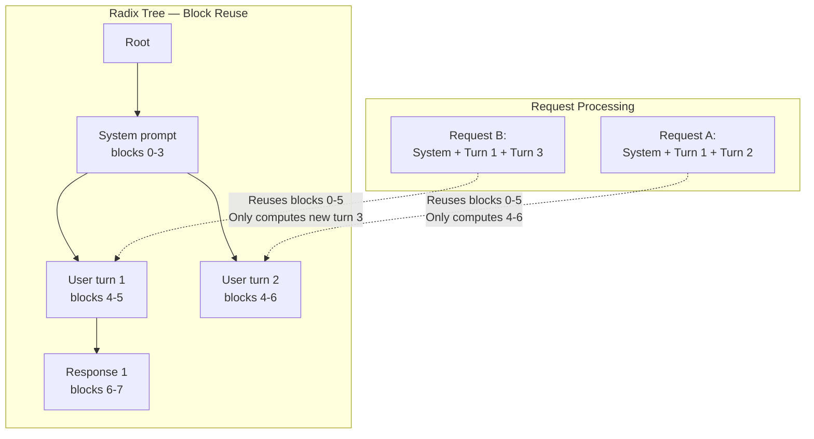

**V1 (C++):** Blocks are stored in `UnifiedBlockTree` as they are filled. When a new request arrives, the tree is searched for matching block keys. Matched blocks are shared via reference counting. Partial reuse is supported: if some but not all tokens in a block match, the matched portion can be copied to a new block (`copy_on_partial_reuse`).

**V2 (Python):** The `BlockRadixTree` uses chained SHA-256 hashing: `SHA256(previous_block_key || token_ids)`. The `match()` method walks the tree for exact prefix matches. `find_best_partial_match_in_next_nodes` handles partial matches among sibling branches.

**What's new (v1.2-v1.3):**
- **Prefix caching for hybrid models** — Mamba + attention hybrids (Qwen3.5, Nemotron Super V3) can now reuse SSM state cache.
- **KV cache-aware ADP router** with prefix-affinity request routing — routes requests to the GPU that already has their prefix cached.
- **Multimodal KV cache block reuse** improvements (bugfix in #12472).
- **Reusable KV cache blocks** now accounted in micro-batch scheduler capacity decisions.

**Security — cache salting:** `cache_salt` ensures only requests with matching salt values share cached blocks, preventing prompt theft in multi-tenant deployments.

#### Framework Comparison

| Framework | Prefix Caching | Key Differentiator |
|:----------|:--------------|:-------------------|
| **TensorRT-LLM** | Radix tree with prioritized eviction, partial reuse, salting, host offloading | Priority-based retention; cache-aware ADP routing; SSM cache reuse |
| **vLLM V1** | Hash-based prefix caching; zero-overhead (enabled by default) | Simple, automatic, minimal overhead |
| **SGLang** | RadixAttention — automatic prefix discovery via radix tree with cache-aware scheduling | Scheduling considers cache hits; most seamless UX |
| **LMCache** | External KV cache layer with cross-instance sharing | Shared cache across multiple serving instances via NIXL/Redis/S3 |

---

### 2.5 Disaggregated Serving

#### What It Is

Disaggregated serving separates the **prefill (context)** and **decode (generation)** phases of LLM inference onto **different GPU pools**, with KV cache transferred between them via high-speed interconnects.

#### Why It Exists

The two LLM inference phases have fundamentally different compute profiles — a consequence of the **Roofline Model** and the **Von Neumann Bottleneck**:

| Dimension | Prefill (Context) | Decode (Generation) |
|:----------|:------------------|:--------------------|
| **Bound by** | Compute (large GEMM over many tokens) | Memory bandwidth (weight loads per token) |
| **Key metric** | TTFT (time-to-first-token) | TPOT (time-per-output-token) |
| **Optimal batch** | Fewer, larger batches | Many concurrent sequences |
| **GPU preference** | High FLOPS | High memory bandwidth |

#### Architecture

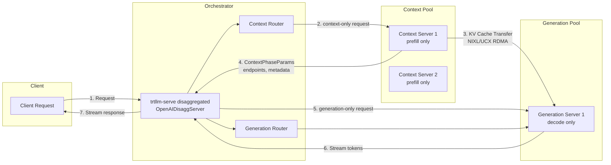

#### KV Cache Transfer

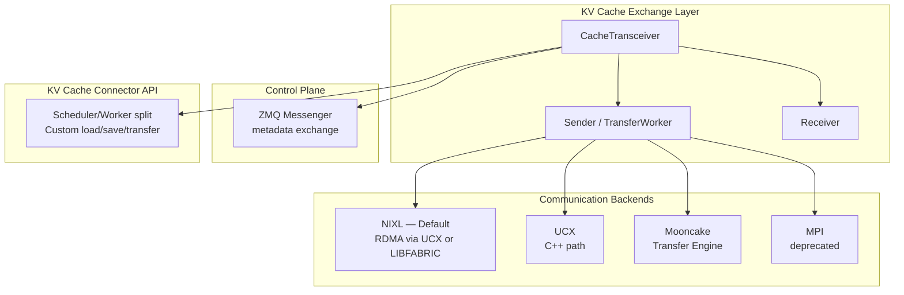

**What's new (v1.2-v1.3):**
- **KV Cache Connector API** (`docs/source/features/kv-cache-connector.md`): Plugin architecture for custom KV cache load/save/transfer logic with Scheduler/Worker split. Enables custom disaggregation implementations.
- **Mooncake transfer engine** as a cache transceiver backend.
- **NIXL-LibFabric support** — broader RDMA fabric compatibility.
- **Service discovery** for dynamic scaling (nodes joining/leaving).
- **Request cancellation** in disaggregated mode.
- **Python cache transceiver** for gen-first workflow, extended to Nemotron models.
- **Default KV cache transfer timeout** set to 60 seconds (breaking change in v1.3rc9).
- **Dynamo integration** for orchestration.
- **Unique global request ID** for end-to-end tracking.
- Fix for disagg gen-only hang where 10s sleep blocked KV transfers and overflowed CTX memory.

**Overlap optimization:** While one request's KV cache is being transferred, other requests continue forward passes. This is default (`TRTLLM_DISABLE_KV_CACHE_TRANSFER_OVERLAP=0`).

**Heterogeneous parallelism:** Context and generation instances can use different TP/PP configurations (e.g., context with TP2, generation with PP2). TRT-LLM handles KV cache layout transformation between configurations automatically.

**Key files:** `serve/openai_disagg_server.py`, `serve/openai_disagg_service.py`, `_torch/pyexecutor/kv_cache_transceiver.py`, `_torch/disaggregation/native/transfer.py`, `docs/source/features/kv-cache-connector.md`.

#### Framework Comparison

| Framework | Disaggregated Serving | Distinctive Capability |
|:----------|:---------------------|:-----------------------|
| **TensorRT-LLM** | Full: NIXL/UCX/Mooncake backends, KV Connector API, heterogeneous parallelism, Dynamo integration | KV cache layout transformation for different TP/PP configs; plugin architecture |
| **vLLM** | Disaggregated P/D in V1; elastic EP with NIXL | Growing feature; elastic expert parallelism for dynamic scaling |
| **SGLang** | PD disaggregation with mooncake/NIXL/InfiniBand; EPD for VLMs | GPU staging buffer (1000x fewer RDMA requests, 5x TPS/GPU); EPD disagg for vision-language models |
| **LMCache** | External KV cache sharing across instances via NIXL/Redis/S3/GDS | Cross-engine P2P cache sharing; MP mode with auto-discovery |

---

### 2.6 Speculative Decoding

#### What It Is

Speculative decoding accelerates autoregressive generation by proposing multiple candidate tokens via a lightweight draft mechanism, then verifying them in parallel via a single target model forward pass. Matched tokens are accepted, reducing sequential forward passes.

#### Supported Algorithms

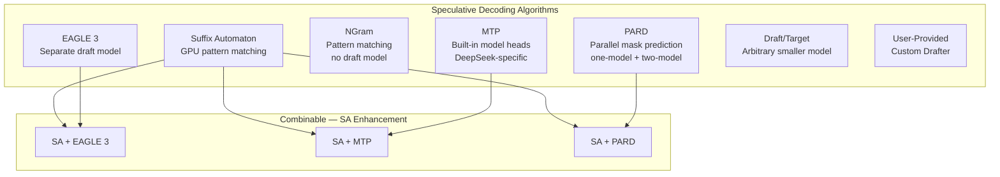

| Algorithm | Draft Source | Draft Model Required? | Key Characteristics |
|:----------|:-----------|:---------------------|:--------------------|
| **EAGLE 3** | Lightweight trained model | Yes | Two-model or one-model; best with SA combination; MLA target + GQA draft support |
| **MTP** | Built-in prediction heads | No (embedded) | DeepSeek-specific; relaxed acceptance for reasoning; MTP>1 for DeepSeek v3.2 |
| **NGram** | Prompt/generation history | No | Prompt lookup decoding; zero extra model overhead |
| **PARD** | Parallel mask-token prediction | Yes | All K drafts in one forward; one-model + two-model paths; target-independent |
| **SA** | GPU suffix automaton | No | Model-free; very accurate on repetitive content; on-device processing |
| **Draft/Target** | Arbitrary smaller model | Yes | Simplest form; requires same tokenizer |

**What's new (v1.2-v1.3):**
- **PARD one-model path** — single-model speculative decoding without a separate draft model.
- **Dynamic draft length** across all spec decode algorithms (expanding from one-model path).
- **MTP>1** for DeepSeek v3.2 — multiple prediction heads for higher acceptance.
- **Guided decoding + speculative decoding** combination now works.
- **Suffix automaton on device** — GPU-side SA processing for lower latency.
- **Eagle MLA target with GQA draft** support for mixed-architecture speculation.
- **Speculation gate** (`speculation_gate.py`): Dynamically disables speculation when acceptance rates drop below threshold, preventing throughput regression at high batch sizes.

**Key files:** `_torch/speculative/` directory — `model_drafter.py`, `eagle3.py`, `mtp.py`, `ngram.py`, `pard.py`, `suffix_automaton.py`, `speculation_gate.py`.

#### Framework Comparison

| Framework | Support | Distinctive Feature |
|:----------|:--------|:-------------------|
| **TensorRT-LLM** | EAGLE3, MTP, NGram, PARD, SA, Draft/Target, user-provided; SA+neural combos | Richest algorithm set; dynamic draft length; SA hybrid approach; guided decoding combo |
| **vLLM** | EAGLE, draft models, NGram (GPU), rejection sampler with greedy/logprobs | Zero-bubble async scheduling + spec decode; multimodal embeddings for spec decode |
| **SGLang** | EAGLE, spec-dec with FlashAttention 4 | FA4 integration for spec decode verification |

---

### 2.7 Parallelism Strategies

#### Overview and Decision Tree

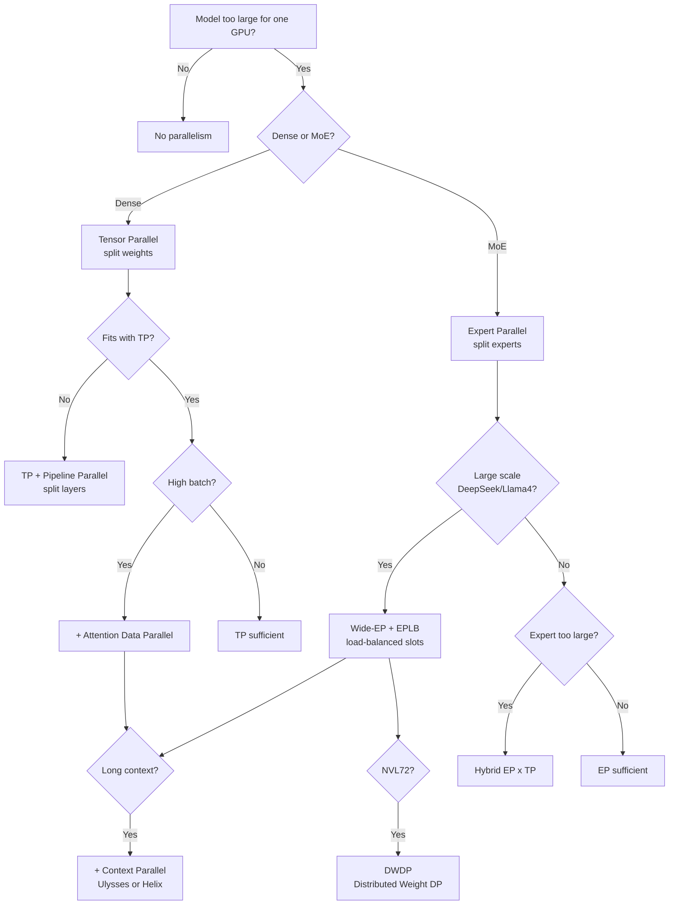

#### Strategy Details

| Strategy | Abbrev | What It Splits | Communication | Best For |
|:---------|:-------|:--------------|:--------------|:---------|
| **Tensor Parallel** | TP | Weight matrices across GPUs | AllReduce / AllGather | Small batch; memory-constrained |
| **Pipeline Parallel** | PP | Layers across GPUs | P2P send/recv of activations | Very large models; limited bandwidth |
| **Data Parallel** | DP / ADP | Requests across replicas | None (independent); KV cache partitioned | Large batch; high throughput |
| **Expert Parallel** | EP | MoE experts across GPUs | All-to-all token dispatch/combine | MoE with many experts |
| **Context Parallel** | CP | Long sequences across GPUs | All-to-all (Ulysses) or AllGather/ReduceScatter (Helix) | 100K+ token contexts |
| **Wide-EP** | Wide-EP | Experts with load-balanced replication | Custom NVLink all-to-all; one-sided AlltoAll | Large MoE (DeepSeek-V3/R1, Llama4) |
| **Distributed Weight DP** | DWDP | Weights + data across NVL72 | NVLink all-reduce + custom scheduling | NVL72 rack-scale deployments |

**What's new (v1.2-v1.3):**
- **DWDP (Distributed Weight Data Parallelism)** — new strategy for NVL72 rack-scale deployments. Distributes both model weights and data across all 72 GPUs for maximum throughput. Documented in blog19 (April 2026).
- **One-sided AlltoAll over NVLink** for MoE expert dispatch — eliminates synchronization overhead in EP communication (blog18).
- **KV cache-aware ADP router** with prefix-affinity request routing — routes requests to GPUs holding their prefix cache.
- **Helix CP for DeepSeek v3.2 with GQA** — context parallelism for MoE models with grouped-query attention.
- **EPLB for TRTLLM-Gen** — expert load balancing integrated with the TRTLLM-Gen attention backend.
- **CUDA graph support for DeepEP** — reduced kernel launch overhead for expert-parallel communication.
- **Dynamic SMEM block routing in MoE** — smarter shared memory management for expert dispatch.
- **LM Head Sharding** — distributes the language model head across GPUs.

#### Framework Comparison

| Framework | Parallelism Support |
|:----------|:-------------------|
| **TensorRT-LLM** | TP, PP, EP, ADP, CP (Ulysses/Helix), Wide-EP + EPLB, DWDP — most comprehensive |
| **vLLM** | TP, PP, EP; elastic EP with NIXL for dynamic scaling |
| **SGLang** | TP, PP, EP, DP; elastic EP for partial failure tolerance |

TRT-LLM's **DWDP**, **Wide-EP with EPLB**, **Helix CP**, and **one-sided AlltoAll** are distinctive capabilities not matched by other frameworks.

---

### 2.8 Other Notable Features

| Feature | Description | Impact | What's New (v1.2-v1.3) |
|:--------|:-----------|:-------|:------------------------|
| **CUDA Graph** | Captures kernel sequences as replayable graphs; padding to nearest captured size | Up to 22% throughput improvement | PDL (Programmatic Dependent Launch) now default |
| **Chunked Prefill** | Splits long prompts across iterations, interleaving with decode | Reduces TPOT variance | Chunked Pipeline Parallelism for million-token context (SGLang) |
| **Guided Decoding** | Grammar/schema-constrained generation (JSON mode) | Structural output guarantees | Now works with all spec decode methods and disagg serving |
| **LoRA** | Runtime adapter loading without restart; per-request adapter selection | Multi-task serving efficiency | Still untested with EP, Helix, ADP, Disagg |
| **Multimodal** | Vision-language models + audio + visual generation (LTX-2, WAN, FLUX) | Multi-modal inference | FA4 attention for diffusion; audio support; dynamic resolution |
| **KV Cache Salting** | Security isolation for multi-tenant prefix caching | Prevents prompt theft attacks | — |
| **FlexKV** | Flexible KV cache backend | Configurable cache strategies | New in v1.3 |
| **Quantization** | FP8, NVFP4, MXFP8, 2FP4/Arcquant | Memory/compute efficiency | Mixed quant for shared/routed MoE experts |
| **Visual Generation** | Diffusion model support (LTX-2, WAN, FLUX) | Image/video generation | Fused DiT QK Norm + RoPE kernel; two-stage pipeline |
| **Agentic Support** | Tool parsers (GLM-4), interleaved thinking, Harmony parser | Agentic workflows | Auto option for tool/reasoning parsers |
| **Energy Metrics** | Power consumption monitoring via `trtllm-serve` | Cost tracking | New in v1.2 |

---

## 3. End-to-End User Journey (PyTorch Backend)

### 3.1 Launch & Initialization

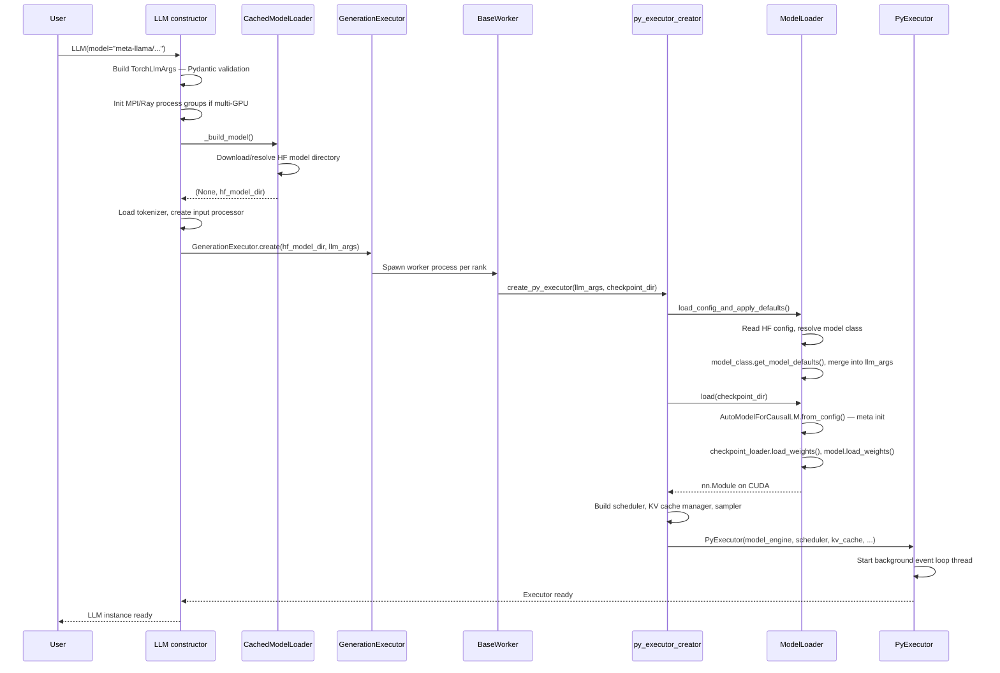

**Key files:**

- `llm.py`: `_TorchLLM.__init__`, `_build_model`
- `llm_utils.py`: `CachedModelLoader.__call__`
- `executor.py`: `GenerationExecutor.create`
- `py_executor_creator.py`: `create_py_executor`
- `model_loader.py`: `ModelLoader.load`

For **`trtllm-serve`**, the CLI (`tensorrt_llm/commands/serve.py`) builds `llm_args` from CLI + YAML, constructs the same `LLM` instance, then wraps it in `OpenAIServer` (FastAPI).

### 3.2 Model Loading & Weight Loading

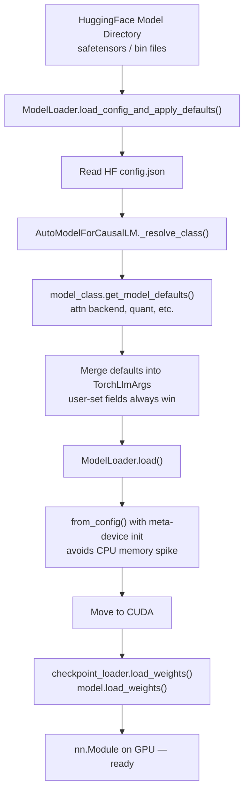

The `get_model_defaults()` pattern is important: each model class (e.g., `modeling_llama.py`, `modeling_qwen3_next.py`) defines its own preferred defaults for attention kernel, quantization, speculative decoding, etc. These are merged into `TorchLlmArgs` but **never override user-explicit settings**.

### 3.3 Request Handling & Response

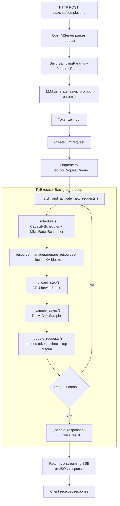

### 3.4 Failover & Fault Tolerance

**Current state: Limited.** The system relies on external orchestration for production resilience.

| Mechanism | What It Does | Limitation |
|:----------|:------------|:-----------|
| `LLM._check_health()` | Verifies executor not shutdown | No automatic recovery |
| Disagg router health check | Pings `/health`, prunes dead backends | Reactive, not preventive |
| `DisaggClusterWorker` heartbeat | Registration + heartbeat for membership | Re-registration only, no request retry |
| `CppExecutorError` handler | Logs error, raises `SIGINT` | Clean shutdown, not failover |
| Service discovery (new) | Dynamic node join/leave for disagg | Membership only, no fault recovery |

**What's missing:** Automatic request retry, hot-standby replicas, checkpoint/restore for in-flight requests, graceful degradation under partial failures, circuit breakers, elastic expert redistribution on GPU failure.

**Contrast:** SGLang now has **elastic EP for partial failure tolerance** — when a GPU fails, experts are redistributed to surviving GPUs without restart. TRT-LLM has no equivalent.

### 3.5 Auto-Scaling

**Current state: Elastic membership + Dynamo integration.**

The `DisaggClusterManager` (`serve/disagg_auto_scaling.py`) supports:

- **Dynamic worker join/leave**: Workers can register and deregister
- **Role switching**: Workers can transition between context and generation roles
- **Readiness tracking**: Manager exposes `is_ready` based on minimum instance counts
- **Dynamo integration**: External orchestration for production scaling

**What's missing:** HPA-style automatic replica scaling based on QPS/latency/GPU metrics, automatic GPU provisioning, queue-depth-based scaling policies. Production scaling is delegated to **Dynamo** or **Kubernetes operators**.

---

## 4. Framework Comparison

### 4.1 Architecture Comparison

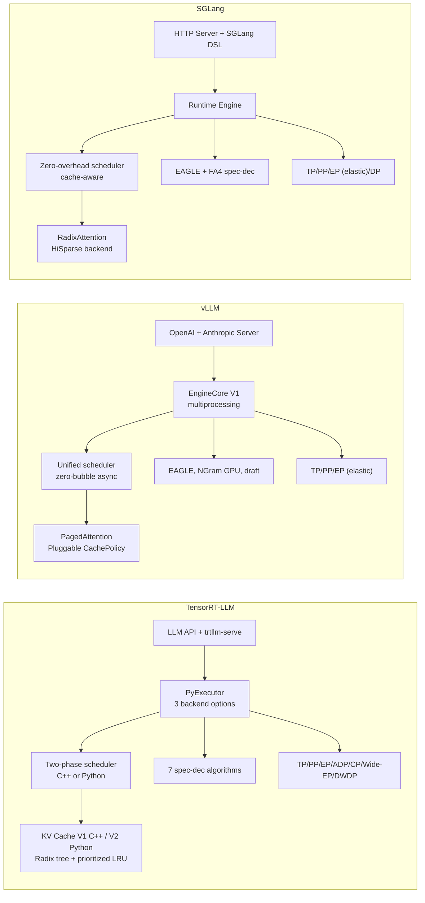

### 4.2 Feature Matrix

| Feature | TensorRT-LLM | vLLM | SGLang | LMCache |
|:--------|:------------:|:----:|:------:|:-------:|
| **Continuous batching** | Yes | Yes | Yes | N/A |
| **Prefix caching** | Yes (prioritized) | Yes (zero-overhead) | Yes (RadixAttention) | Yes (cross-instance) |
| **Disaggregated P/D** | Full (NIXL/UCX/Mooncake) | V1 feature | Yes (GPU staging buffer) | P2P via NIXL |
| **Speculative decoding** | 7 algorithms + SA hybrid | EAGLE, NGram GPU, draft | EAGLE + FA4 | N/A |
| **TP / PP** | Yes / Yes | Yes / Yes | Yes / Yes | N/A |
| **EP / Wide-EP** | Yes / Yes | Yes (elastic) / No | Yes (elastic) / No | N/A |
| **Context Parallel** | Ulysses + Helix | No | Prefill CP (MHA) | N/A |
| **Attention DP** | Yes (cache-aware) | No | No | N/A |
| **DWDP (NVL72)** | Yes | No | No | N/A |
| **CUDA Graphs** | Yes (PDL) | Yes (piecewise, torch.compile) | Yes (piecewise, default) | N/A |
| **CPU/GPU overlap** | Yes (default, early exit) | DBO (generalized) | Yes (zero-overhead) | N/A |
| **LoRA** | Yes | Yes (quantized LoRA) | Yes (MoE layers) | N/A |
| **Guided decoding** | Yes (+spec-dec combo) | Yes | Yes (optimized) | N/A |
| **Multi-vendor GPU** | NVIDIA only | CUDA, ROCm, TPU | CUDA, ROCm, TPU, MLX | Vendor-neutral |
| **Multi-model serving** | Limited | Native V1 | Limited | N/A |
| **Visual generation** | LTX-2, WAN, FLUX | No | LTX-2, Hunyuan3D-2, Helios+ | N/A |
| **Agentic / Tool Use** | GLM-4 parser, thinking | Responses API, tool calls | DSL-based | N/A |
| **Elastic fault tolerance** | No | No | Elastic EP (GPU fail-over) | N/A |
| **External KV cache** | KV Connector API | LMCache integration | LMCache integration | Core product |
| **Model catalog** | ~50+ | ~100+ | Growing | N/A |

### 4.3 Performance Positioning

| Metric | TensorRT-LLM | vLLM | SGLang |
|:-------|:------------:|:----:|:------:|
| **Peak throughput (NVIDIA H100)** | Highest | ~70% of TRT-LLM | ~85% of TRT-LLM |
| **TTFT (single GPU)** | ~194ms | ~123ms (best) | ~340ms |
| **TPOT** | Best at high batch | Good | Good |
| **MoE throughput (Wide-EP)** | Highest | Good | Good |
| **NVL72 scaling** | DWDP optimized | Not specialized | Not specialized |

*Performance gaps have narrowed significantly since 2024. The advantage is workload-dependent and diminishes as frameworks adopt similar optimizations.*

---

## 5. Future Development Opportunities

### 5.1 Category 1: Critical Feature Gaps vs. Mainstream Frameworks

These are features where competitors (vLLM, SGLang, LMCache) have working implementations that TRT-LLM lacks, creating real risk of user attrition.

---

#### 1.1 Multi-Vendor GPU Support

**Gap:** TRT-LLM only runs on NVIDIA GPUs. vLLM and SGLang both support CUDA, ROCm (AMD), and TPU (Google). SGLang additionally supports Apple Silicon via MLX.

**Impact:** Enterprise customers with multi-cloud strategies (Azure with AMD MI300X, GCP with TPUs) cannot standardize on TRT-LLM. Cloud providers building managed inference services prefer vendor-neutral engines deployable across their fleet.

**What competitors offer:**
- **vLLM:** CUDA, ROCm, TPU; B300/GB300 SM10.3 tuned allreduce
- **SGLang:** CUDA, ROCm, TPU; native MLX backend for Apple Silicon
- **Mitigation:** AutoDeploy's `torch.export` path could theoretically target non-NVIDIA backends. The pragmatic strategy is positioning TRT-LLM as the "NVIDIA-optimized backend" behind vendor-neutral frontends (Dynamo, Triton Inference Server).

---

#### 1.2 Model Catalog Breadth and Onboarding Velocity

**Gap:** vLLM supports ~2x more model architectures (~100+ vs ~50+), and new models typically get vLLM support first.

**Impact:** Every unsupported model is a potential user lost. The gap is self-reinforcing: more models attract more users, which attract more community contributors, which add more models.

**What competitors offer:**
- **vLLM:** ~100+ architectures; Transformers v5 compatibility; Gemma 4 (full MoE/multimodal/reasoning); ASR models (Cohere ASR, Granite Speech); GPU-less render serving for multimodal preprocessing
- **SGLang:** Stronger Transformers modeling backend with TP, PP, MoE, VLM, torch.compile; rapid community adoption

**Opportunity:** AutoDeploy as the primary onboarding path — automatically convert HuggingFace models without manual model class implementation. Streamlined contribution workflow with automated testing.

---

#### 1.3 Elastic Fault Tolerance

**Gap:** TRT-LLM has no mechanism for graceful GPU failure recovery. When a GPU fails, the entire serving instance crashes.

**Impact:** Production deployments at scale (hundreds of GPUs) experience regular hardware failures. Without elastic recovery, every GPU failure causes full-instance downtime and loss of all in-flight requests.

**What competitors offer:**
- **SGLang:** Elastic EP for partial failure tolerance — when a GPU fails, experts are redistributed to surviving GPUs without restart. This is a production-critical capability for large MoE deployments.
- **vLLM:** Elastic EP with NIXL for dynamic GPU scaling (add/remove GPUs without restart).

**Opportunity:** Implement elastic expert redistribution for EP workloads. Extend to TP/PP with hot-standby replicas.

---

#### 1.4 TTFT Competitiveness

**Gap:** vLLM achieves ~35% lower TTFT on single-GPU benchmarks (~123ms vs. ~194ms).

**Impact:** For interactive/chat workloads — the highest-value inference use case — TTFT is the most user-perceptible metric. A 35% deficit drives framework selection decisions regardless of throughput advantages.

**Root causes:**
- Two-phase C++ scheduler overhead vs. vLLM V1's simpler unified scheduler
- Overlap scheduler introduces one extra decoding step
- CUDA graph lookup overhead for initial prefill
- KV cache block allocation path with nanobind crossing overhead

**Opportunity areas:**
- Prefill-specific CUDA graphs
- Smarter first-request scheduling (bypass two-phase overhead)
- FlashAttention 4 integration (vLLM already integrated)
- Async tokenization (vLLM V1's approach)
- Systematic end-to-end TTFT profiling

---

#### 1.5 Quantized LoRA and LoRA Feature Completeness

**Gap:** vLLM supports quantized LoRA (QLoRA direct loading). SGLang supports LoRA for MoE layers with JIT alignment kernels. TRT-LLM's LoRA is untested with EP, Helix, ADP, disaggregated serving, and speculative decoding.

**Impact:** LoRA is the primary mechanism for multi-tenant model customization in production. Incomplete LoRA support blocks enterprise deployments that need per-customer model variants with advanced infrastructure features.

**Opportunity:** Systematic LoRA compatibility testing across all feature combinations. Prioritize LoRA + EP (MoE with per-user adaptations) and LoRA + disaggregated serving (multi-tenant disaggregated deployments).

---

#### 1.6 Structured Generation Performance

**Gap:** SGLang achieves up to 5x throughput for structured generation via its DSL and RadixAttention.

**Impact:** Agentic workflows (tool use, function calling, JSON output) are growing rapidly. Structured output is becoming a table-stakes feature for production deployments.

**Opportunity:**
- Prefix-aware scheduling for structured output prefixes
- Grammar-aware KV cache reuse
- Batched constraint checking to amortize grammar engine overhead
- Constrained draft generation in speculative decoding

---

#### 1.7 Multi-Model Serving

**Gap:** vLLM V1 has native multi-model serving. TRT-LLM requires separate instances per model.

**Impact:** Production AI platforms serve hundreds of model variants from the same GPU fleet. Single-model instances waste GPU resources on underutilized models.

**Opportunity:** Model multiplexing within a single executor, with shared GPU memory management and LoRA hot-swapping.

---

#### 1.8 API Compatibility Breadth

**Gap:** vLLM now supports both OpenAI and Anthropic API compatibility (thinking blocks, count_tokens, Responses API with streaming tool calls). TRT-LLM only supports OpenAI-compatible API.

**Impact:** Applications built against the Anthropic API cannot seamlessly switch to TRT-LLM for self-hosted inference.

**Opportunity:** Add Anthropic API compatibility endpoint alongside existing OpenAI endpoint.

---

### 5.2 Category 2: Critical Bugs and Architectural Issues

These are bugs, design debt, and inefficiencies in the current codebase that cause reliability issues, resource waste, or developer friction.

---

#### 2.1 Disaggregated Serving Reliability

**Known bugs (recent fixes indicate systemic issues):**
- **Gen-only hang** where 10s sleep blocks KV transfers and overflows CTX memory (#12640) — fixed but indicates fragile timing assumptions in the disagg pipeline.
- **Disagg hang on DGX B200 8-GPU** PyTorch path (#12656) — hardware-specific reliability issue.
- **Context pipeline parallelism + generation tensor parallelism hang** — documented known issue in release notes, not yet resolved.
- **CacheTransceiver memory leak** in disaggregated serving — fixed in v1.1 but indicates the transfer path needs memory lifecycle hardening.
- **Multimodal KV cache block reuse** broken for disaggregated serving (#12472) — fixed but shows multi-feature interaction bugs.

**Systemic concern:** Disaggregated serving is a critical differentiator, but the combination of KV transfer, multiple communication backends, heterogeneous parallelism, and overlap optimization creates a large surface area for timing-dependent bugs. Each fix often reveals new edge cases.

**Recommended action:** Comprehensive stress testing framework for disaggregated serving with failure injection (network delays, partial transfers, backend switching). Formal verification of the KV transfer state machine.

---

#### 2.2 Codebase Complexity and Monolithic Executor

**Problem:** `py_executor.py` is ~3,750 lines with three execution loops (`_executor_loop`, `_executor_loop_overlap`, `_executor_loop_pp`), extensive conditional branches for disaggregated serving, speculative decoding, attention DP, pipeline parallel, and overlap scheduling.

**Specific pain points:**
- **Three backends** (PyTorch, TRT, AutoDeploy) create confusion and triplicate maintenance
- **Two KV cache managers** (V1 C++, V2 Python) with different feature sets and different bugs
- **Feature combination matrix** has 19+ features with multiple "No", "Untested", and "Known Issues" entries
- Adding a new feature requires understanding interactions with speculative decoding, disaggregated serving, overlap scheduling, pipeline parallelism, and CUDA graphs — all interleaved in the same executor loop

**Impact on velocity:** vLLM has a significantly larger community contributor base, partly because lower complexity reduces the barrier to contribution. Model support velocity (100+ vs ~50+ architectures) is a downstream effect.

**Recommended action:**
- Refactor `py_executor.py` into composable executor stages (scheduling, resource allocation, forward, sampling, response handling)
- Converge on AutoDeploy as the primary backend to reduce backend maintenance
- Complete V2 KV cache feature parity to eliminate dual-manager confusion

---

#### 2.3 KV Cache V1/V2 Feature Divergence

**Problem:** Two KV cache managers with different feature sets create reliability risks.

**V2 gaps to close before becoming default:**
- Beam search support
- KV cache events for monitoring
- KV connector for disaggregated serving (currently limited in V2)
- Star attention / star CP support
- Performance validation vs. C++ V1 (especially block allocation hot path)

**V2 advantages over V1:**
- Constraint-based memory partitioning
- SSM cache reuse for hybrid models
- Heterogeneous `tokens_per_block`
- Scheduler-driven suspend/resume
- Python-first = faster experimentation and community contribution

**Recommended action:** Close V2 gaps systematically, then make V2 default, then deprecate V1.

---

#### 2.4 Feature Combination Matrix Gaps

**Problem:** The feature combination matrix reveals several unsupported or untested combinations that block real-world deployments.

| Combination | Status | Why It Matters |
|:------------|:-------|:---------------|
| Spec decoding (MTP, EAGLE3) + PP | **No** | Cannot use spec decoding for models requiring PP |
| Helix + ADP | **Known issues** | Limits advanced parallelism for long-context MoE |
| LoRA + EP/Helix/ADP/Disagg | **Untested** | Blocks production MoE deployments with LoRA |
| Logits Post Processor + Disagg | **No** | Cannot do custom logits processing in disaggregated mode |
| C++ Sampler + any spec decoding | **No** | Forces Python sampler (higher overhead) for spec decoding |
| Helix + Overlap Scheduler | **Untested** | Uncertainty for long-context performance |

**Deeper issue:** These gaps often reflect fundamental architectural assumptions (e.g., spec decoding + PP fails because the draft model and target model must be synchronized across PP stages). Fixing requires non-trivial executor changes.

**Recommended action:** Systematic testing campaign to resolve "Untested" entries (many may work already), then targeted engineering for "No" entries prioritized by user impact.

---

#### 2.5 CUDA Event and Metrics Crashes

**Known bug:** CUDA event crash with performance metrics (#12639) — performance instrumentation causing crashes indicates fragile resource lifecycle management in the metrics path.

**Recommended action:** Audit all CUDA event creation/destruction patterns in the metrics and profiling code. Ensure proper event lifecycle management even under error conditions.

---

#### 2.6 Weights Loading OOM

**Known bug:** H20 weights loading OOM for large models (#11321) — memory spike during weight loading on memory-constrained GPUs.

**Root cause:** The meta-device init path avoids CPU memory spikes but the CUDA allocation pattern during weight loading can still exceed GPU memory for very large models on GPUs with less VRAM.

**Recommended action:** Streaming weight loading with per-layer allocation/deallocation. Profile peak GPU memory during weight loading for all supported model sizes.

---

#### 2.7 FP8 Quantization Fragility

**Known issue:** FP8 quant fusion matching breaks after PyTorch updates (#12750) — the fusion pattern matching for FP8 quantization is tightly coupled to PyTorch internal representations.

**Recommended action:** Abstract the fusion pattern matching to be robust against PyTorch internal changes. Add PyTorch version compatibility tests for all quantization paths.

---

### 5.3 Category 3: Innovative and Futuristic Features

These are forward-looking capabilities that could establish TRT-LLM as a leader for next-generation inference workloads.

---

#### 3.1 Multi-Modal Inference Platform

**Current state:** TRT-LLM supports vision-language models (Nemotron VL with dynamic resolution, audio), and visual generation (LTX-2, WAN, FLUX diffusion models with FA4 attention and fused kernels).

**Futuristic opportunities:**
- **Unified multi-modal executor:** Single inference engine handling text, vision, audio, video, and 3D generation with shared resource management. Currently, visual generation runs as a separate pipeline. Unifying would enable compound multi-modal workflows (e.g., "describe this image, then generate a variation").
- **EPD (Encoder-Prefill-Decode) disaggregation for VLMs:** SGLang already has this — separate the encoder (vision), prefill (text), and decode stages onto different GPU pools optimized for each workload profile.
- **Streaming multi-modal input:** Process video/audio streams in real-time while generating text responses. Requires streaming prefill that incrementally extends the KV cache as new frames/audio arrive.
- **Cross-modal KV cache sharing:** Share KV cache entries across modalities when the same context is used for different modal outputs (e.g., same image processed for captioning and then for visual Q&A).

---

#### 3.2 Agentic Workflow Optimization

**Current state:** Basic tool parser support (GLM-4), interleaved thinking, Harmony parser. No deep optimization for agentic patterns.

**Futuristic opportunities:**
- **Persistent agent sessions with KV cache continuity:** Agents make multiple LLM calls in sequence (think -> tool_call -> observe -> think -> ...). Preserving KV cache across these calls eliminates re-encoding of growing conversation history. This is where TRT-LLM's prefix caching + KV cache retention priorities could create a unique advantage.
- **Speculative tool calling:** Predict likely tool calls and pre-execute them while the model is still generating. If the prediction is correct, the tool result is immediately available when the model requests it, eliminating round-trip latency.
- **Branching execution with KV cache forking:** Agents often explore multiple strategies. KV cache block sharing (via copy-on-write in the radix tree) can efficiently support branching without duplicating the shared prefix cache.
- **Adaptive context compression:** For long-running agents, compress older conversation turns' KV cache (reducing precision or applying attention head pruning) while keeping recent turns at full resolution. This extends effective context window without proportional memory growth.
- **Structured output fast-path:** Optimize the entire pipeline for the common agent pattern: structured output (JSON tool calls) -> tool execution -> new prompt. This includes grammar-aware KV cache reuse and batched constraint checking.

---

#### 3.3 Hardware Architecture Co-Design

**Current state:** TRT-LLM supports Blackwell (B200, GB200, B300, GB300, DGX Spark), Hopper, Ada Lovelace, and Ampere. DWDP is designed for NVL72 rack-scale.

**Futuristic opportunities:**

##### GPU + LPU/Custom Accelerator Hybrid Inference
- **Heterogeneous compute pooling:** Route prefill to GPUs (compute-bound) and decode to custom accelerators like Groq LPUs or Cerebras WSEs (bandwidth-bound). The disaggregated serving architecture already supports heterogeneous P/D — extending it to non-GPU decode accelerators is architecturally natural.
- **FPGA-accelerated preprocessing:** Offload tokenization, grammar checking, and output formatting to FPGAs sitting in the data path, freeing GPU cycles for attention/MLP computation.

##### Memory Pooling and CXL
- **CXL memory pooling:** CXL (Compute Express Link) enables GPU-accessible shared memory pools beyond GPU HBM. This could transform KV cache management:
  - **CXL-attached KV cache tier:** A third memory tier (GPU HBM -> CXL memory -> host DRAM -> NVMe) with ~200ns access latency — much faster than host DRAM access via PCIe, enabling larger effective KV cache without host offloading penalties.
  - **Cross-GPU KV cache sharing via CXL:** Multiple GPUs accessing a shared CXL memory pool for KV cache — enabling zero-copy prefix sharing across GPUs without AllGather communication.
  - **Elastic GPU memory:** CXL allows dynamic memory allocation to GPUs based on workload. High-context requests get more memory; low-context requests release it to a shared pool.

##### Next-Generation NVIDIA Platforms
- **Vera Rubin co-design:** NVIDIA's next-generation platform will have hardware-level P/D split capabilities. TRT-LLM's disaggregated serving investment positions it well, but deeper HW-SW co-design is needed to exploit hardware-native disaggregation features.
- **NVLink 6.0 and beyond:** Future NVLink generations will increase bandwidth, enabling wider parallelism strategies. DWDP-like approaches could scale to even larger GPU clusters.

---

#### 3.4 KV Cache as a Service (KVaaS)

**Current state:** TRT-LLM has KV Cache Connector API and disaggregated serving with NIXL/UCX/Mooncake backends. LMCache demonstrates the value of cross-instance KV cache sharing.

**Futuristic opportunities:**
- **Distributed KV cache fabric:** A cluster-wide KV cache service that all serving instances can read from and write to. When any instance computes KV cache for a prefix, all instances can immediately reuse it. This extends the current disaggregated serving KV transfer to a persistent, shared fabric.
- **Tiered KV cache with GPU Direct Storage (GDS):** Hot KV cache on GPU HBM, warm on CXL/host DRAM, cold on NVMe via GDS. LMCache already demonstrates GDS integration — TRT-LLM could build this natively into V2's multi-tier architecture.
- **KV cache compression:** Quantize stored KV cache (FP16 -> FP8 or even INT4) to reduce storage and transfer costs. Accept minor quality degradation for older context while keeping recent context at full precision.
- **Semantic KV cache eviction:** Instead of LRU/priority-based eviction, use attention pattern analysis to identify which KV cache blocks actually contribute to output quality. Evict low-attention blocks first, regardless of recency.
- **Cross-session KV cache persistence:** For chatbots and agents, persist KV cache across sessions (to NVMe or S3). When a user returns, their conversation KV cache is restored from storage instead of recomputed — providing instant context restoration.

---

#### 3.5 Sparse and Efficient Attention

**Current state:** TRT-LLM has sparse attention support (blog17). SGLang has HiSparse backend.

**Futuristic opportunities:**
- **Dynamic sparsity patterns:** Automatically learn per-layer, per-head sparsity patterns from the attention distribution. Apply different sparsity ratios to different heads based on their measured importance — some heads attend locally, some globally.
- **Native Sparse Attention (NSA) evolution:** TRT-LLM DSA kernels are already integrated into SGLang. Evolving these into first-class TRT-LLM sparse attention support with hardware-optimized sparse GEMM kernels.
- **Attention-free generation layers:** For later decoding steps where the model is highly confident, replace full attention with lightweight mechanisms (e.g., linear attention or MLP-only skip connections). Use the speculation gate pattern to dynamically switch between full and efficient attention.

---

#### 3.6 Inference-Time Compute Scaling

**Current state:** TRT-LLM has blog13 on inference-time compute implementation (best-of-N, majority voting, etc.).

**Futuristic opportunities:**
- **Adaptive compute allocation:** Dynamically allocate more inference-time compute (more samples, longer chains-of-thought, more speculative paths) for difficult queries and less for easy ones. Use early-layer confidence estimation to decide compute budget per-request.
- **Tree-of-thought serving:** Efficiently serve tree-structured generation where multiple branches are explored simultaneously. KV cache forking (copy-on-write) makes this memory-efficient. The scheduler would manage tree-width as a first-class scheduling dimension.
- **Reward-model-guided generation:** Integrate reward model inference into the serving pipeline to steer generation in real-time. Use the reward signal to prune low-quality branches early, saving compute on dead-end generations.
- **Test-time training (TTT) integration:** Apply lightweight parameter updates during inference based on the specific query context. This requires online gradient computation during serving — a fundamentally different execution pattern from pure inference.

---

#### 3.7 Federated and Privacy-Preserving Inference

**Futuristic opportunities:**
- **Split inference across trust boundaries:** Run embedding layers on-premise, attention on cloud GPUs, and output layers on-premise. The disaggregated serving architecture provides the transport layer; the gap is secure enclave support and encrypted KV cache transfer.
- **Differential privacy for KV cache:** When sharing KV cache across requests in multi-tenant deployments, add calibrated noise to prevent information leakage. Extends the current cache salting approach to formal privacy guarantees.
- **Confidential computing on GPU TEEs:** NVIDIA Confidential Computing with H100/Blackwell TEEs enables encrypted inference. TRT-LLM would need to support running within the TEE environment with encrypted model weights and KV cache.

---

#### 3.8 Self-Optimizing Inference Engine

**Futuristic opportunities:**
- **Auto-tuned scheduling policies:** Use reinforcement learning to learn optimal scheduling policies (batch sizes, prefill/decode mixing, eviction priorities) from production traffic patterns. Replace hand-tuned heuristics with learned policies that adapt to workload changes.
- **Kernel auto-selection:** Instead of static kernel selection based on problem size, dynamically profile and select the fastest kernel for each operation based on the current GPU state (thermal throttling, memory pressure, concurrent workloads).
- **Predictive resource allocation:** Use request metadata (prompt length, expected output length from historical patterns, priority) to pre-allocate KV cache blocks and schedule prefill before the request enters the queue.
- **Workload-aware quantization:** Dynamically switch quantization precision based on load. Under light load, run at FP16 for best quality. Under heavy load, switch to FP8/INT4 to serve more requests with acceptable quality trade-off.

---

## 6. Strategic Prioritization

### 6.1 Investment Priority Matrix

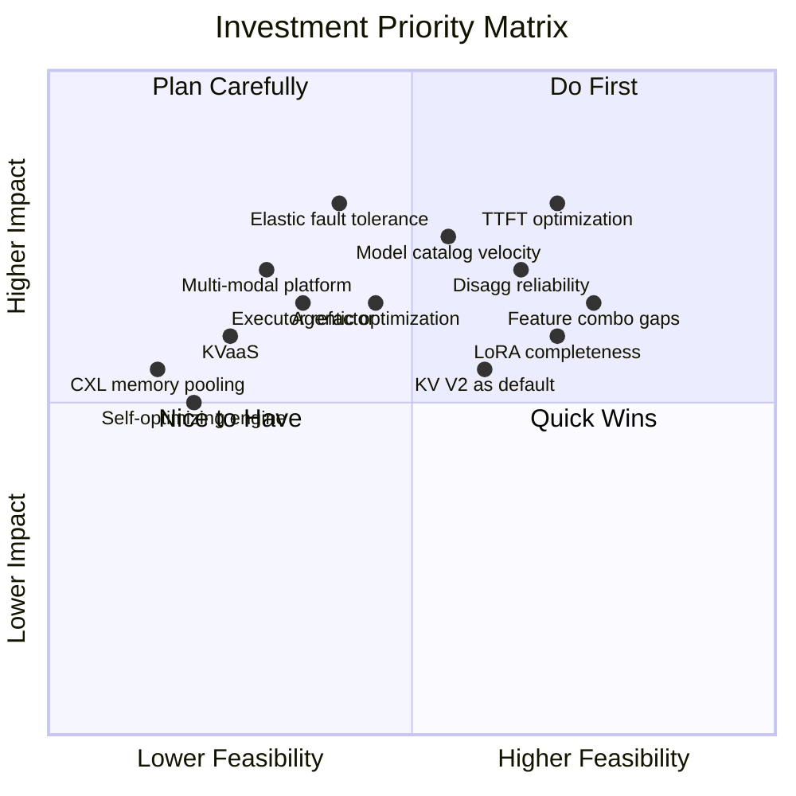

### 6.2 Prioritized Roadmap

#### Tier 1: Critical — Do Now (0-3 months)

| Priority | Item | Category | Rationale |
|:---------|:-----|:---------|:----------|
| P0 | TTFT optimization | Gap | 35% deficit on the most user-visible metric for the highest-value workload |
| P0 | Disaggregated serving reliability | Bug | Systemic timing/hang bugs in a critical differentiating feature |
| P1 | Model catalog velocity via AutoDeploy | Gap | Every unsupported model = lost users; 2x gap vs. vLLM |
| P1 | Feature combination testing campaign | Bug | Many "Untested" entries may work; low effort to validate |
| P1 | Wide-EP + EPLB hardening | Gap | MoE models are the defining workload; TRT-LLM's competitive moat |

#### Tier 2: Strategic — Plan and Execute (3-9 months)

| Priority | Item | Category | Rationale |
|:---------|:-----|:---------|:----------|
| P2 | Elastic fault tolerance | Gap | SGLang's elastic EP sets a new bar; critical for production at scale |
| P2 | LoRA + EP/disagg completeness | Gap | Blocks enterprise multi-tenant MoE deployments |
| P2 | KV Cache V2 as default | Bug/Gap | Eliminates dual-manager confusion; enables faster innovation |
| P2 | Executor refactor | Bug | Reduces complexity; accelerates all other development |
| P2 | Agentic workflow optimization | Innovation | Persistent sessions, spec tool calling, KV cache forking |

#### Tier 3: Strategic Bets — Invest Steadily (6-18 months)

| Priority | Item | Category | Rationale |
|:---------|:-----|:---------|:----------|
| P3 | Multi-modal unified platform | Innovation | Unified executor for text+vision+audio+video generation |
| P3 | KVaaS (distributed KV fabric) | Innovation | Extends disagg to cluster-wide cache sharing |
| P3 | Cache-aware disagg scheduling | Gap | Together.ai CPD shows 40% improvement for long context |
| P3 | Structured generation performance | Gap | SGLang 5x lead; growing importance for agents |
| P3 | Inference-time compute scaling | Innovation | Tree-of-thought, adaptive compute, reward-guided generation |

#### Tier 4: Long-Term Vision (12+ months)

| Priority | Item | Category | Rationale |
|:---------|:-----|:---------|:----------|
| P4 | CXL memory pooling | Innovation | Next-gen memory architecture; transforms KV cache economics |
| P4 | GPU + LPU hybrid inference | Innovation | Heterogeneous compute for optimal P/D resource allocation |
| P4 | Self-optimizing engine | Innovation | RL-learned scheduling, predictive allocation, dynamic quant |
| P4 | Federated/privacy-preserving inference | Innovation | Split inference, encrypted KV, GPU TEEs |
| P4 | Vera Rubin HW-SW co-design | Innovation | Hardware-native disaggregation; next-gen NVLink |

---

### 6.3 Where TRT-LLM Should Win

**Core identity:** Maximum inference performance on NVIDIA GPUs.

**Strengths to protect and extend:**
- Peak throughput leadership on NVIDIA hardware
- Wide-EP + EPLB + DWDP for MoE models at scale (strategic moat)
- Comprehensive parallelism strategies (TP/PP/EP/ADP/CP/Wide-EP/DWDP)
- Rich speculative decoding algorithm set (7 algorithms + SA hybrids)
- Disaggregated serving with heterogeneous parallelism and KV Connector API
- Visual generation support (unique among inference engines)

**Gaps to close urgently:**
- TTFT competitiveness (35% gap)
- Model catalog breadth (2x gap vs. vLLM)
- Elastic fault tolerance (SGLang leads)
- Developer experience (codebase complexity)

**Capabilities to build for differentiation:**
- Production resilience (fault tolerance, observability, auto-scaling)
- Agentic workflow optimization (persistent sessions, spec tool calling)
- Next-gen hardware co-design (CXL, Vera Rubin, NVL72+)
- Distributed KV cache fabric (cluster-wide cache sharing)

The frameworks are converging on core features (continuous batching, prefix caching, basic parallelism). **The next phase of differentiation will be won on three fronts: (1) production reliability at scale, (2) workload-specific optimization for agents and multi-modal, and (3) hardware co-design that exploits NVIDIA's roadmap advantages.**

---

*This document reflects the TensorRT-LLM codebase as of April 2026 (v1.3.0 main branch). The project is under active development; features and architecture evolve rapidly.*
