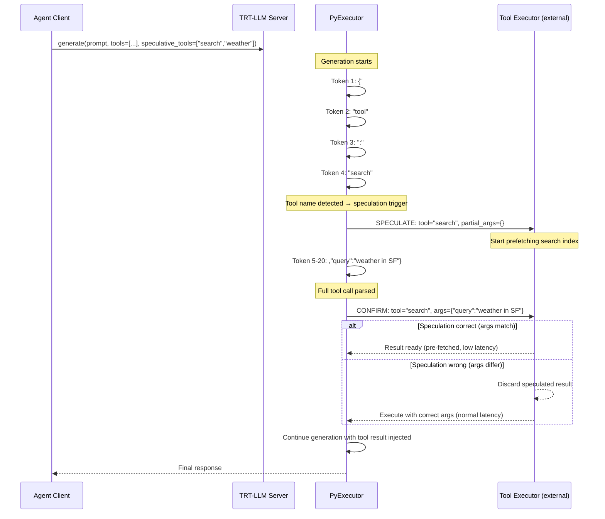

# 1. Speculative Tool Calling

[< Back to Overview](README.md)

## Problem

In an agentic loop, the LLM generates a tool call (e.g., `{"tool": "search", "query": "..."}`), then the system executes the tool, then the LLM processes the result. These steps are strictly serial:

```
LLM generation (1-5s) → tool execution (0.1-30s) → LLM generation (1-5s) → ...
```

For a 10-step agent session, this easily accumulates to 30-60+ seconds of wall-clock time even if each individual step is fast.

## Key Insight

Tool calls are often predictable *before* the model finishes generating the full response. After generating `{"tool": "search", "query": "weather in`, the tool name and partial arguments are already known. For read-only tools, we can **start executing the tool call before generation completes**, overlapping tool latency with the remaining generation.

## Prior Art

| Work | Approach | Key Result |
|:-----|:---------|:-----------|
| **Nichols et al. (2025)** "Optimizing Agentic LLM Inference via Speculative Tool Calls" | Client-side + engine-side speculation; "tool cache" API; forces sequences resident | Hundreds of tok/s throughput improvement |
| **PASTE (2026)** "Act While Thinking" | Pattern-aware speculation from execution history; predicts tool + args from recurring workflows | 48.5% latency reduction, 1.8x tool throughput |
| **Speculative Actions (ICLR 2026)** | Faster model predicts next action; parallel execution | Up to 55% prediction accuracy |
| **SpecEyes (2026)** | Speculative planner for multimodal agents; cognitive gating for self-verification | 1.1-3.35x speedup |
| **SGLang** | API speculative execution: first call generates beyond stop, subsequent calls reuse cached tokens | Up to 6.4x throughput for structured programs |
| **GetStream** | Eager execution for voice AI: start read-only tools during VAD/transcription | Eliminates voice gaps |

**Common themes:**
1. Only speculate on **read-only** (safe) tools — never pre-execute state-changing operations
2. Two patterns: (a) overlap tool exec with LLM generation, (b) use faster model to predict
3. Rollback is cheap — discard speculated result if prediction wrong

## Proposed Design for TRT-LLM

### Architecture



### Integration Points in TRT-LLM

**1. Streaming tool-call detection during generation**

The key extension is detecting partial tool calls *during* the token-by-token generation loop in `PyExecutor._update_requests()`. Currently, tool call parsing happens post-generation in the server layer (`openai_server.py`). We need earlier detection:

```python
# New component: tensorrt_llm/_torch/pyexecutor/tool_call_detector.py

class StreamingToolCallDetector:
    """Detects tool calls incrementally as tokens are generated."""

    def __init__(self, tools: List[ToolDefinition], speculative_tools: List[str]):
        self.tools = {t.name: t for t in tools}
        self.speculative_tools = set(speculative_tools)  # Only these are speculated
        self.buffer = ""
        self.state = "IDLE"  # IDLE → DETECTING → TOOL_NAME_FOUND → ARGS_PARTIAL → COMPLETE

    def feed_token(self, token_text: str) -> Optional[ToolCallEvent]:
        """Feed a generated token. Returns event if state transition occurs."""
        self.buffer += token_text

        if self.state == "IDLE" and '{"tool"' in self.buffer:
            self.state = "DETECTING"

        if self.state == "DETECTING":
            tool_name = self._try_parse_tool_name()
            if tool_name and tool_name in self.speculative_tools:
                self.state = "TOOL_NAME_FOUND"
                return ToolCallEvent("TOOL_DETECTED", tool_name, partial_args={})

        if self.state == "TOOL_NAME_FOUND":
            complete_call = self._try_parse_complete()
            if complete_call:
                self.state = "COMPLETE"
                return ToolCallEvent("TOOL_COMPLETE", complete_call.name, complete_call.args)

        return None
```

**2. Speculation lifecycle in the executor**

Hook into `PyExecutor._update_requests()` after new tokens are sampled:

```python
# In py_executor.py, after token sampling
for request in active_requests:
    if request.tool_call_detector:
        new_tokens = request.get_new_tokens()
        for token in new_tokens:
            event = request.tool_call_detector.feed_token(
                self.tokenizer.decode([token])
            )
            if event and event.type == "TOOL_DETECTED":
                self._dispatch_speculative_tool(request, event)
            elif event and event.type == "TOOL_COMPLETE":
                self._confirm_or_discard_speculation(request, event)
```

**3. Tool executor interface**

The actual tool execution is **external** to TRT-LLM. We provide a callback interface:

```python
# tensorrt_llm/serve/tool_speculation.py

class ToolSpeculationCallback(Protocol):
    """Interface for external tool executors that support speculation."""

    async def speculate(self, tool_name: str, partial_args: dict) -> str:
        """Start speculative execution with partial information.
        Called when tool name is detected but args are incomplete.
        May pre-warm caches, open connections, etc."""
        ...

    async def execute(self, tool_name: str, args: dict) -> str:
        """Execute with confirmed arguments.
        If speculate() was called earlier, may return faster."""
        ...

    async def discard(self, speculation_id: str):
        """Cancel a speculative execution that is no longer needed."""
        ...

    def is_safe_to_speculate(self, tool_name: str) -> bool:
        """Whether this tool is read-only and safe to pre-execute."""
        ...
```

### Safety Model

**Critical constraint:** Only read-only tools may be speculatively executed.

| Tool Type | Speculate? | Examples |
|:----------|:----------|:---------|
| Read-only query | Yes | search, weather, stock price, database SELECT |
| Idempotent write | Yes (with caution) | cache put, log append |
| State-changing | **Never** | send_email, create_order, database INSERT |

Safety is enforced by:
1. The `speculative_tools` list in the request (client opt-in)
2. The `is_safe_to_speculate()` callback (server-side guard)
3. Tools not in both lists are never speculated

### KV Cache Interaction

When the tool result is injected into the context:
- **Without speculation:** tool result tokens are a new prefill segment → full KV computation
- **With speculation:** if we pre-encode the speculated result as a "tentative prefill" and the speculation is correct, the KV cache is already populated → zero additional compute
- **If speculation is wrong:** discard the tentative KV blocks (they're in uncommitted radix tree nodes) and encode the correct result normally

This connects to [KV Cache Forking](02-kv-cache-forking.md) — the speculated tool result is a "branch" that is either committed or discarded.

### Phasing

| Phase | Scope | Effort |
|:------|:------|:-------|
| **Phase A** | Streaming tool-call detection + callback interface in server layer | 3-4 weeks |
| **Phase B** | Executor-level integration: detection during generation + external dispatch | 4-6 weeks |
| **Phase C** | Speculative KV cache pre-encoding of tool results | 4-6 weeks |
| **Phase D** | Pattern-aware prediction (PASTE-style recurring workflow detection) | Research |

### Expected Impact

| Metric | Without Speculation | With Phase A+B | With Phase C |
|:-------|:-------------------|:--------------|:-------------|
| Per-step latency (fast tool, 100ms) | inference + 100ms + inference | inference + max(100ms, remaining_gen) | Same, but next inference starts faster |
| Per-step latency (slow tool, 5s) | inference + 5s + inference | inference + max(5s, remaining_gen) = ~5s | ~5s (KV pre-encoded during wait) |
| 10-step agent session (1s inference, 2s tools avg) | 10 * (1+2+1) = 40s | ~10 * (max(2,1)+1) = ~30s | ~25s |

The benefit scales with tool execution latency — the slower the tool, the more overlap is possible.
