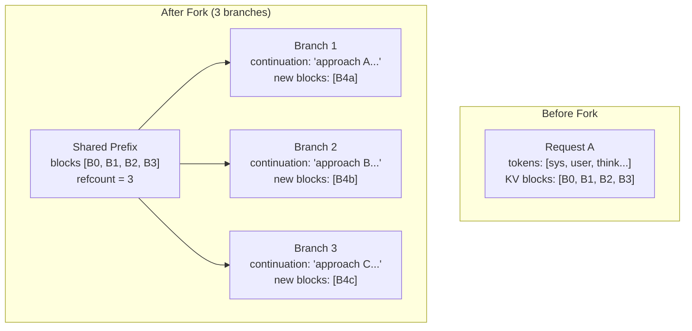

# 2. KV Cache Fork-Join for Branching Execution

[< Back to Overview](README.md)

## Problem

Agentic and reasoning workloads frequently branch:
- **Tree-of-thought:** explore 3-5 reasoning paths from the same prefix, pick the best
- **Best-of-N sampling:** generate N completions, select by reward model
- **Parallel tool calls:** invoke multiple tools from the same context, merge results
- **Speculative tool results:** tentative branch for speculated result, discard if wrong

Without KV cache forking, each branch re-encodes the entire shared prefix. For a 10K-token shared context with 5 branches, this wastes 4/5 = 80% of the prefill compute.

## Current TRT-LLM State: What Already Exists

The codebase already has **most of the primitives** for KV cache forking:

### Reference-Counted Blocks (V1 C++)
- `KVCacheBlock` has `mRefCount` (lines 96-97 of `kvCacheManager.cpp`)
- `incRefCount()` / `decRefCount()` for shared blocks (lines 215-225)
- `isShared()` returns true when `mRefCount > 1` or block is in the lookup tree (lines 238-245)

### Multi-Child Radix Tree (V2 Python)
- `BlockRadixTree` stores children as `dict[BlockKey, Child]` (line 88 of `_block_radix_tree.py`)
- A single parent block can have **multiple children** representing different token sequences branching from the same prefix
- `find_best_partial_match_in_next_nodes()` iterates over all child nodes (lines 147-166)
- Currently capped at 32 children per node (line 155) with a TODO (TRTLLM-7784) for acceleration

### Copy-on-Partial-Reuse
- `copy_on_partial_reuse` config flag (in `llm_args.py`)
- When a partially-matching block is in use, it's **copied** to a new block rather than modified in-place
- This is effectively copy-on-write semantics for partial blocks

### What's Missing

| Capability | Status | Gap |
|:----------|:-------|:----|
| Block reference counting | Exists (V1 C++) | V2 Python uses page holders, not explicit refcount |
| Multi-child radix tree | Exists (V1+V2) | Works for prefix sharing; not exposed as "fork" API |
| Beam search (branching) | V1 C++ only; V2 raises `NotImplementedError` | V2 beam search is the key gap |
| Explicit fork/join API | **Missing** | No user-facing API to fork a request's KV cache |
| Branch-aware scheduling | **Missing** | Scheduler doesn't know branches share prefix |
| Join/merge operation | **Missing** | No mechanism to select best branch and discard others |

## Proposed Design

### Fork-Join API

```python
# New API: tensorrt_llm/llmapi/llm.py

class LLM:
    async def fork(
        self,
        request_id: int,
        num_branches: int,
        branch_prompts: List[str],  # Different continuations per branch
    ) -> List[int]:
        """Fork a request's KV cache into N branches.

        The shared prefix KV cache is shared (zero-copy) across all branches.
        Each branch gets its own continuation tokens.

        Returns: list of new request_ids, one per branch.
        """
        ...

    async def join(
        self,
        branch_request_ids: List[int],
        selection: Union[int, Callable[[List[GenerationResult]], int]],
    ) -> GenerationResult:
        """Join forked branches by selecting the best one.

        Discards KV cache for non-selected branches (decrements refcount).
        The selected branch becomes the continuation.

        Args:
            branch_request_ids: IDs from fork()
            selection: index of branch to keep, or a selector function
        """
        ...
```

### Internal Implementation

#### Fork Operation



Implementation in KV Cache Manager V2:

```python
# tensorrt_llm/runtime/kv_cache_manager_v2/_core/_kv_cache.py

def fork_sequence(
    self,
    source_seq_id: int,
    num_branches: int,
) -> List[int]:
    """Fork a sequence's KV cache into N branches.

    The source sequence's committed blocks become shared (refcount += N-1).
    Each branch gets a new sequence ID pointing to the same block chain.
    New tokens generated per-branch allocate their own blocks.
    """
    source_blocks = self._get_committed_blocks(source_seq_id)
    branch_ids = []

    for i in range(num_branches):
        new_seq_id = self._allocate_sequence_id()

        # Share existing blocks (increment reference/holder count)
        for block in source_blocks:
            block.add_holder(new_seq_id)  # Zero-copy — same GPU memory

        # Register in radix tree as new child of last shared block
        self._radix_tree.add_branch(source_blocks[-1], new_seq_id)

        branch_ids.append(new_seq_id)

    return branch_ids
```

#### Join Operation

```python
def join_sequences(
    self,
    branch_seq_ids: List[int],
    keep_branch: int,  # Index of branch to keep
) -> int:
    """Join branches: keep one, discard the rest.

    Discarded branches release their unique blocks (decrement refcount).
    Shared prefix blocks remain (refcount decremented but still > 0).
    """
    kept_seq_id = branch_seq_ids[keep_branch]

    for i, seq_id in enumerate(branch_seq_ids):
        if i != keep_branch:
            self._release_sequence(seq_id)
            # Shared blocks: refcount -1 (still alive)
            # Unique blocks: refcount -> 0 → freed

    return kept_seq_id
```

### Scheduler Awareness

The scheduler must understand that forked branches share prefix blocks:

```python
# In scheduler: when admitting forked requests
def schedule_forked_requests(self, fork_group: List[LlmRequest]):
    """Schedule forked requests together.

    Key insight: shared prefix blocks should NOT be double-counted
    in the memory budget. Only unique (branch-specific) blocks
    are additional memory cost.
    """
    shared_blocks = fork_group[0].shared_prefix_blocks
    per_branch_budget = self.max_tokens - len(shared_blocks) * self.tokens_per_block

    # Admit branches that fit within remaining budget
    for req in fork_group:
        unique_tokens_needed = req.max_new_tokens
        if unique_tokens_needed <= per_branch_budget:
            self.admit(req)
            per_branch_budget -= unique_tokens_needed
```

### Use Case: Tree-of-Thought

```python
# User-facing API
llm = LLM(model="meta-llama/Llama-3.1-70B")

# Initial generation
result = await llm.generate("Solve this math problem: ...")

# Fork into 3 reasoning branches
branches = await llm.fork(
    request_id=result.request_id,
    num_branches=3,
    branch_prompts=[
        "Let me try approach A: algebraic substitution...",
        "Let me try approach B: geometric interpretation...",
        "Let me try approach C: numerical estimation...",
    ],
)

# Generate all branches (shared prefix KV cache = zero-copy)
branch_results = await asyncio.gather(*[
    llm.generate_from_fork(branch_id, max_tokens=200)
    for branch_id in branches
])

# Score with reward model and keep the best
scores = [reward_model.score(r.text) for r in branch_results]
best = await llm.join(branches, selection=scores.index(max(scores)))
```

### Use Case: Speculative Tool Result Injection

Connects to [Speculative Tool Calling](01-speculative-tool-calling.md):

```python
# When tool call is detected during generation:
# 1. Fork: one branch continues generating (finishes tool call JSON)
# 2. Fork: second branch pre-encodes speculated tool result

speculation_branch = await kv_manager.fork_sequence(
    source_seq_id=request.seq_id,
    num_branches=1,  # One speculative branch
)

# If speculation correct: join by keeping the speculation branch
# If speculation wrong: join by discarding it (blocks freed)
```

## V2 Implementation Gap: Beam Search

The biggest blocker is V2's `NotImplementedError` for beam search (line 337-338 of `_kv_cache.py`). Fork-join generalizes beam search — implementing fork-join naturally enables beam search as a special case.

**Recommended approach:**
1. Implement `fork_sequence()` / `join_sequences()` in V2
2. Implement beam search on top of fork-join
3. This resolves the V2 beam search gap AND enables agentic forking

## Phasing

| Phase | Scope | Effort | Dependency |
|:------|:------|:-------|:-----------|
| **Phase A** | `fork_sequence()` + `join_sequences()` in KV Cache Manager V2 | 4-6 weeks | None |
| **Phase B** | Scheduler awareness for shared-prefix budget accounting | 2-3 weeks | Phase A |
| **Phase C** | User-facing `LLM.fork()` / `LLM.join()` API | 2-3 weeks | Phase A+B |
| **Phase D** | Beam search via fork-join (resolves V2 gap) | 2-3 weeks | Phase A |
| **Phase E** | Integration with speculative tool calling | 2-3 weeks | Phase A + spec tool Phase B |

## Expected Impact

| Scenario | Without Forking | With Forking | Savings |
|:---------|:---------------|:-------------|:--------|
| Tree-of-thought (5 branches, 10K shared prefix) | 5 * 10K = 50K tokens prefilled | 10K + 5 * branch_tokens | ~80% prefill savings |
| Best-of-N (N=8, 2K prompt) | 8 * 2K = 16K tokens | 2K + 8 * gen_tokens | ~75% prefill savings |
| Parallel tool calls (3 tools, 5K context) | 3 * 5K = 15K tokens | 5K + 3 * tool_tokens | ~67% prefill savings |
