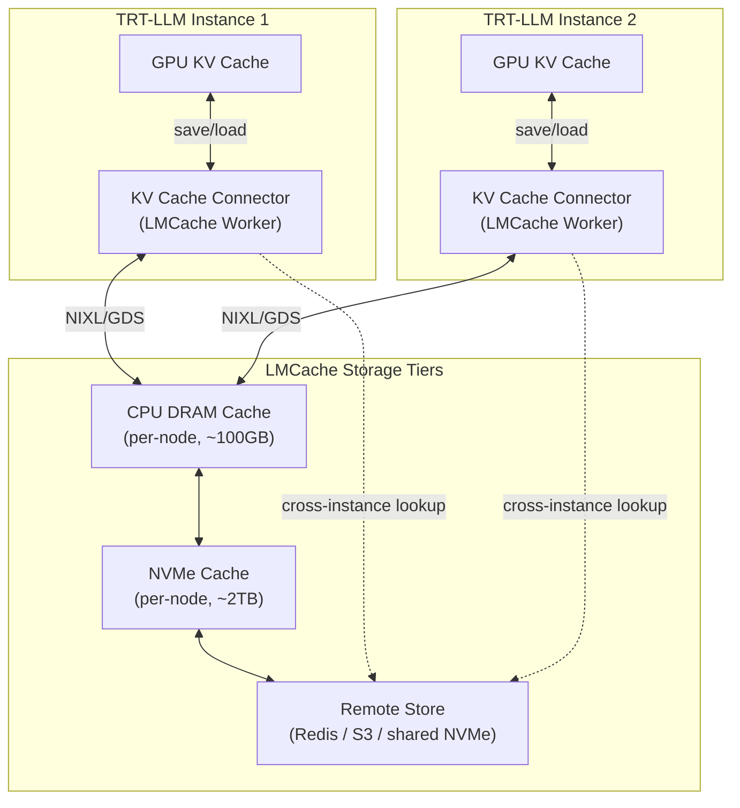
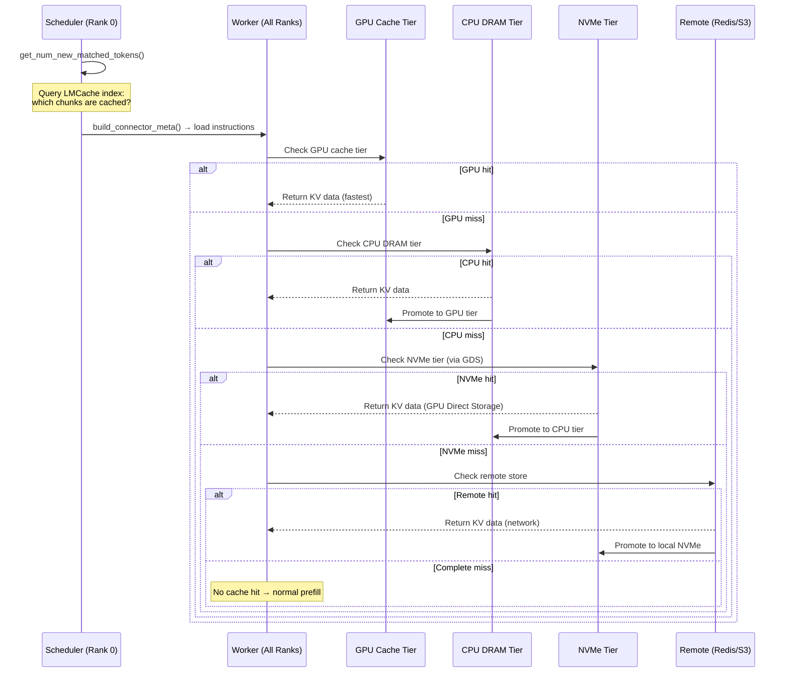

# 3. Cluster-Wide KV Cache Sharing (LMCache Integration)

[< Back to Overview](README.md)

## Problem

Each TRT-LLM instance maintains its own KV cache in GPU memory. This creates three inefficiencies:

1. **Cross-instance redundancy:** If instances A and B both serve requests with the same system prompt, each computes and stores its own KV cache for that prefix. In a 16-instance cluster with a 4K-token system prompt, this means 16x redundant prefill compute.

2. **Cross-session cold starts:** When a user returns to an agentic session after minutes/hours, their conversational KV cache is gone — evicted by LRU or lost to instance reassignment. The entire context must be re-encoded.

3. **No tiered storage:** GPU KV cache memory is the scarcest resource. There's no mechanism to spill cold KV cache entries to CPU DRAM, NVMe, or remote storage while keeping them retrievable.

## LMCache: What It Provides

[LMCache](https://github.com/LMCache/LMCache) (v0.4.2) is an external KV cache layer designed for exactly this problem:

| Capability | Details |
|:-----------|:--------|
| **Multi-tier storage** | GPU → CPU DRAM → NVMe/disk → S3/Redis |
| **Cross-instance sharing** | Shared storage backend (Redis, S3, NVMe over NIXL) allows any instance to reuse cached KV |
| **Token-level granularity** | Caches at configurable chunk sizes (default 256 tokens) |
| **Framework integrations** | vLLM (production), SGLang (production), TRT-LLM (**not yet**) |
| **Transfer backends** | NIXL (GPU-direct), GDS (GPU Direct Storage for NVMe), standard CPU memcpy |
| **Eviction policies** | LRU across tiers; priority-aware eviction |

### Architecture



## TRT-LLM Integration Point: KV Cache Connector API

TRT-LLM already provides the `KvCacheConnectorScheduler` / `KvCacheConnectorWorker` abstraction — a plugin API designed for exactly this kind of external cache integration.

### Connector API (Existing)

```python
# tensorrt_llm/_torch/pyexecutor/kv_cache_connector.py

class KvCacheConnectorScheduler(ABC):
    """Runs on rank 0. Decides what to load/save."""

    @abstractmethod
    def build_connector_meta(self, scheduler_output: SchedulerOutput) -> object:
        """Build metadata for workers based on scheduling decisions."""
        ...

    @abstractmethod
    def get_num_new_matched_tokens(
        self, request: LlmRequest, num_computed_tokens: int
    ) -> Tuple[int, bool]:
        """Check if external cache has tokens for this request.
        Returns (num_matched_tokens, is_end_of_block)."""
        ...

    @abstractmethod
    def request_finished(self, request: LlmRequest,
                        cache_block_ids: List[int]) -> bool:
        """Called when generation completes. Trigger save to external cache."""
        ...

    @abstractmethod
    def update_state_after_alloc(self, request: LlmRequest,
                                block_ids: List[int]):
        """Update internal state after KV blocks are allocated."""
        ...


class KvCacheConnectorWorker(ABC):
    """Runs on all ranks. Performs actual KV data transfer."""

    @abstractmethod
    def register_kv_caches(self, kv_cache_tensor: torch.Tensor):
        """Register GPU KV cache memory for DMA transfers."""
        ...

    @abstractmethod
    def start_load_kv(self, stream: torch.cuda.Stream):
        """Begin async load of KV data from external cache."""
        ...

    @abstractmethod
    def wait_for_layer_load(self, layer_idx: int, stream: torch.cuda.Stream):
        """Wait for a specific layer's KV data to be loaded."""
        ...

    @abstractmethod
    def save_kv_layer(self, layer_idx: int, stream: torch.cuda.Stream):
        """Save a layer's KV data to external cache."""
        ...

    @abstractmethod
    def wait_for_save(self, stream: torch.cuda.Stream):
        """Wait for all saves to complete."""
        ...

    @abstractmethod
    def get_finished(
        self, finished_gen_req_ids: List[int],
        started_loading_req_ids: List[int]
    ) -> Tuple[List[int], List[int]]:
        """Report which loads/saves completed."""
        ...
```

### Configuration (Existing)

```python
# tensorrt_llm/llmapi/llm_args.py

class KvCacheConnectorConfig(StrictBaseModel):
    connector_module: str           # e.g., "lmcache_connector"
    connector_scheduler_class: str  # e.g., "LMCacheConnectorScheduler"
    connector_worker_class: str     # e.g., "LMCacheConnectorWorker"
```

Instantiated via dynamic import in `py_executor_creator.py` — no code changes needed to register new connectors.

## Proposed Design: LMCache Connector

### LMCache Connector Scheduler

```python
# tensorrt_llm/serve/connectors/lmcache_connector.py

from lmcache import LMCacheEngine, LMCacheConfig
from tensorrt_llm._torch.pyexecutor.kv_cache_connector import (
    KvCacheConnectorScheduler, SchedulerOutput, LlmRequest
)

class LMCacheConnectorScheduler(KvCacheConnectorScheduler):
    """Scheduler-side LMCache integration (rank 0 only).

    Queries LMCache index to determine cache hits for incoming requests.
    Decides which completed requests to save to LMCache.
    """

    def __init__(self, llm_args):
        super().__init__(llm_args)
        self.lmcache_config = LMCacheConfig.from_dict(
            llm_args.kv_cache_connector_kwargs.get("lmcache", {})
        )
        # Index-only client: doesn't hold GPU memory, just queries metadata
        self.index = LMCacheEngine.create_index(self.lmcache_config)
        self.chunk_size = self.lmcache_config.chunk_size  # e.g., 256 tokens
        self.pending_saves = {}  # request_id -> block_ids

    def get_num_new_matched_tokens(
        self, request: LlmRequest, num_computed_tokens: int
    ) -> Tuple[int, bool]:
        """Query LMCache index for prefix match.

        Token hashing: LMCache uses rolling hash of token sequences
        to identify cached chunks, independent of the source instance.
        """
        token_ids = request.get_token_ids()
        # Query how many contiguous token chunks are cached
        cached_length = self.index.query_prefix_length(
            token_ids, start=num_computed_tokens
        )
        # Align to chunk boundary
        matched = (cached_length // self.chunk_size) * self.chunk_size
        is_end = (matched + num_computed_tokens) >= len(token_ids)
        return matched, is_end

    def build_connector_meta(self, scheduler_output: SchedulerOutput) -> object:
        """Build load/save instructions for workers."""
        load_list = []
        for req_data in scheduler_output.new_requests:
            token_ids = self._get_token_ids(req_data.request_id)
            cached_chunks = self.index.get_cached_chunks(token_ids)
            if cached_chunks:
                load_list.append({
                    "request_id": req_data.request_id,
                    "block_ids": req_data.new_block_ids,
                    "cached_chunks": cached_chunks,
                })

        save_list = list(self.pending_saves.values())
        self.pending_saves.clear()

        return LMCacheConnectorMeta(loads=load_list, saves=save_list)

    def request_finished(self, request: LlmRequest,
                        cache_block_ids: List[int]) -> bool:
        """Schedule KV cache save to LMCache on request completion."""
        token_ids = request.get_token_ids()
        # Only save if above minimum length (avoid polluting cache with short requests)
        if len(token_ids) >= self.chunk_size * 2:
            self.pending_saves[request.request_id] = {
                "request_id": request.request_id,
                "token_ids": token_ids,
                "block_ids": cache_block_ids,
            }
            return True
        return False

    def update_state_after_alloc(self, request: LlmRequest,
                                block_ids: List[int]):
        """Track allocated blocks for potential future save."""
        pass  # Tracking happens in request_finished
```

### LMCache Connector Worker

```python
class LMCacheConnectorWorker(KvCacheConnectorWorker):
    """Worker-side LMCache integration (all ranks).

    Handles actual GPU ↔ LMCache data transfers using NIXL or GDS.
    """

    def __init__(self, llm_args):
        super().__init__(llm_args)
        self.lmcache_config = LMCacheConfig.from_dict(
            llm_args.kv_cache_connector_kwargs.get("lmcache", {})
        )
        # Full engine: manages GPU/CPU/NVMe storage
        self.engine = LMCacheEngine(self.lmcache_config)
        self.kv_cache_tensor = None
        self.current_meta = None

    def register_kv_caches(self, kv_cache_tensor: torch.Tensor):
        """Register GPU KV cache memory with LMCache for zero-copy transfer.

        LMCache uses NIXL to register this memory for RDMA,
        or GDS for direct NVMe access.
        """
        self.kv_cache_tensor = kv_cache_tensor
        self.engine.register_gpu_memory(kv_cache_tensor)

    def bind_connector_meta(self, metadata):
        """Receive load/save instructions from scheduler."""
        self.current_meta = metadata

    def start_load_kv(self, stream: torch.cuda.Stream):
        """Begin async KV cache load from LMCache.

        For each request with cached chunks:
        1. LMCache looks up chunks in GPU → CPU → NVMe → remote (waterfall)
        2. Transfers data directly into the registered KV cache blocks
        3. Uses NIXL for GPU-to-GPU, GDS for NVMe-to-GPU
        """
        if not self.current_meta or not self.current_meta.loads:
            return

        for load_info in self.current_meta.loads:
            block_ids = load_info["block_ids"]
            cached_chunks = load_info["cached_chunks"]

            # Map TRT-LLM block IDs to GPU memory offsets
            gpu_offsets = self._block_ids_to_offsets(block_ids)

            # Initiate async transfer from LMCache → GPU KV blocks
            self.engine.load_chunks_async(
                cached_chunks, gpu_offsets, stream=stream
            )

    def wait_for_layer_load(self, layer_idx: int, stream: torch.cuda.Stream):
        """Wait for specific layer's data. Enables pipelined load+compute."""
        self.engine.wait_layer(layer_idx, stream=stream)

    def save_kv_layer(self, layer_idx: int, stream: torch.cuda.Stream):
        """Save a layer's KV data to LMCache (async)."""
        if not self.current_meta or not self.current_meta.saves:
            return

        for save_info in self.current_meta.saves:
            block_ids = save_info["block_ids"]
            token_ids = save_info["token_ids"]
            gpu_offsets = self._block_ids_to_offsets(block_ids)

            self.engine.save_layer_async(
                layer_idx=layer_idx,
                token_ids=token_ids,
                gpu_offsets=gpu_offsets,
                stream=stream,
            )

    def wait_for_save(self, stream: torch.cuda.Stream):
        """Wait for all saves to complete before blocks are reused."""
        self.engine.wait_all_saves(stream=stream)

    def get_finished(self, finished_gen_req_ids, started_loading_req_ids):
        """Report completed transfers."""
        loaded = self.engine.get_completed_loads()
        saved = self.engine.get_completed_saves()

        finished_loads = [
            rid for rid in started_loading_req_ids if rid in loaded
        ]
        finished_saves = [
            rid for rid in finished_gen_req_ids if rid in saved
        ]
        return finished_loads, finished_saves

    def _block_ids_to_offsets(self, block_ids):
        """Map logical block IDs to GPU memory byte offsets."""
        # Each block: num_layers * 2 (K+V) * num_heads * head_dim * tokens_per_block * dtype_size
        block_size = self.engine.get_block_size_bytes()
        return [(bid * block_size) for bid in block_ids]
```

### Storage Backend Configuration

```python
# Configuration passed via kv_cache_connector_kwargs

lmcache_config = {
    "chunk_size": 256,           # Tokens per cache chunk
    "local_device": "cuda",      # Primary cache tier

    # Tier 1: GPU (fastest, smallest)
    "gpu_cache_size_gb": 4,      # Dedicated GPU memory for external cache

    # Tier 2: CPU DRAM
    "cpu_cache_size_gb": 64,     # CPU DRAM cache

    # Tier 3: NVMe (via GDS for GPU-direct)
    "disk_cache_path": "/mnt/nvme/lmcache/",
    "disk_cache_size_gb": 500,
    "use_gds": True,             # GPU Direct Storage for NVMe

    # Tier 4: Remote (cross-instance sharing)
    "remote_backend": "redis",   # or "s3", "nixl"
    "remote_url": "redis://cache-cluster:6379",

    # Transfer
    "transfer_backend": "nixl",  # NIXL for GPU-GPU, GDS for NVMe-GPU
    "nixl_config": {
        "nic_name": "mlx5_0",   # RDMA NIC
    },
}
```

### Tiered Lookup Flow



## Cross-Instance Sharing Protocol

### Token-Based Cache Keys

LMCache identifies cached KV data by the **token sequence** itself, not by request ID or instance ID. This enables natural cross-instance sharing:

```
Cache Key = hash(model_id, token_ids[start:end], layer_idx, quant_config)
```

- Two instances serving the same model with the same system prompt automatically share cached KV
- No coordination protocol needed — the shared storage backend (Redis/S3) is the rendezvous point
- Quantization config is part of the key to prevent mismatched KV data

### Consistency Model

| Scenario | Behavior |
|:---------|:---------|
| Same tokens, same model | Cache hit — KV data is identical |
| Same tokens, different quant | Cache miss — quant config is in key |
| Same tokens, different TP degree | Cache miss — KV layout differs with TP |
| Stale entry (model updated) | Model version in key; old entries evict naturally |
| Concurrent writes | Last-writer-wins; KV data for same tokens is identical |

### Interaction with Existing Prefix Caching

TRT-LLM's V2 KV cache manager already has an in-process radix tree for prefix caching. LMCache adds an **external** tier:

```
Request arrives with tokens [sys, user, query...]

1. Check radix tree (in-process, GPU)     → hit? Use it (fastest)
2. Check LMCache GPU tier (in-process)    → hit? Load to KV blocks
3. Check LMCache CPU tier (local node)    → hit? Load via DMA
4. Check LMCache NVMe tier (local node)   → hit? Load via GDS
5. Check LMCache remote tier (cluster)    → hit? Load via network
6. Miss everywhere                        → normal prefill computation
```

The radix tree remains the L1 cache; LMCache is L2-L5.

## Integration with Features 1 & 2

### With Speculative Tool Calling (Feature 1)

When a speculated tool result is confirmed correct:
- The KV cache for the tool result can be **saved to LMCache**
- If the same tool is called again with similar context, the cached KV may be reusable
- Particularly valuable for recurring tool patterns (e.g., same API call in a loop)

### With KV Cache Forking (Feature 2)

When branches are explored and one is selected:
- The selected branch's KV cache can be saved to LMCache for cross-session reuse
- Discarded branches are NOT saved (waste of cache space)
- The shared prefix (pre-fork) is saved once, not per-branch

### With Disaggregated Serving

The KV Cache Connector API is also used by disaggregated serving for context/generation phase KV transfer. LMCache integration must coexist:

| Concern | Resolution |
|:--------|:-----------|
| Two connectors? | No — use a **composite connector** that delegates to both LMCache (for external caching) and the transceiver (for disagg transfer) |
| Priority | Disagg KV transfer takes priority (latency-critical); LMCache save is async background |
| Overlap | Context worker saves to LMCache after sending to gen worker; gen worker loads from LMCache on cache hit |

```python
class CompositeConnectorWorker(KvCacheConnectorWorker):
    """Combines LMCache caching with disagg KV transfer."""

    def __init__(self, llm_args):
        self.lmcache_worker = LMCacheConnectorWorker(llm_args)
        self.transceiver_worker = TransceiverConnectorWorker(llm_args)

    def start_load_kv(self, stream):
        # Try LMCache first (external cache hit avoids network transfer)
        if self.lmcache_worker.has_cached_data():
            self.lmcache_worker.start_load_kv(stream)
        else:
            self.transceiver_worker.start_load_kv(stream)

    def save_kv_layer(self, layer_idx, stream):
        # Save to both: transceiver (for disagg) and LMCache (for future reuse)
        self.transceiver_worker.save_kv_layer(layer_idx, stream)
        self.lmcache_worker.save_kv_layer(layer_idx, stream)  # async, non-blocking
```

## Phasing

| Phase | Scope | Effort | Dependency |
|:------|:------|:-------|:-----------|
| **Phase A** | LMCache connector: single-tier (CPU DRAM), single instance | 4-6 weeks | None |
| **Phase B** | Multi-tier storage: GPU + CPU + NVMe (with GDS) | 3-4 weeks | Phase A |
| **Phase C** | Cross-instance sharing via Redis/S3 backend | 3-4 weeks | Phase A |
| **Phase D** | Composite connector for disagg + LMCache coexistence | 2-3 weeks | Phase A + disagg serving |
| **Phase E** | Integration with fork-join (save selected branches) | 2-3 weeks | Phase A + KV forking Phase A |

### Phase A Detail

Phase A delivers the core value — external KV caching via the existing Connector API:

1. Implement `LMCacheConnectorScheduler` and `LMCacheConnectorWorker`
2. CPU DRAM backend only (simplest, no GDS/NIXL dependency)
3. Single-instance (no remote backend)
4. Test with: repeated system prompts, multi-turn conversations, prefix-heavy workloads
5. Benchmark: prefill latency reduction, cache hit rate, memory overhead

**Exit criteria:**
- >50% cache hit rate on multi-turn conversation benchmark
- Prefill latency reduction proportional to hit rate
- No regression in throughput for cold (uncached) requests

## Expected Impact

| Scenario | Without LMCache | With LMCache | Savings |
|:---------|:---------------|:-------------|:--------|
| System prompt (4K tokens, 16 instances) | 16 × 4K prefill | 1 × 4K prefill + 15 × cache load | ~15x prefill compute |
| Multi-turn conversation (8K context, user returns after 5min) | Full 8K re-encode | Cache load (ms-scale from CPU/NVMe) | ~100x latency for returning users |
| Agentic session (same tools called repeatedly) | Re-encode tool context each time | Cache hit on repeated tool patterns | 30-60% per-step savings |
| Cluster cold start (new instance joins) | Full prefill for all requests | Warm cache from remote tier | Faster autoscale ramp-up |

## Comparison: LMCache Integration Approaches

| Approach | How | Pros | Cons |
|:---------|:----|:-----|:-----|
| **KV Connector API (proposed)** | Implement Scheduler + Worker | Uses existing plugin API; no core changes; clean separation | Limited to Connector API capabilities |
| **KV Transceiver backend** | Add LMCache as a transceiver | Leverages NIXL integration | Transceiver is designed for point-to-point disagg, not caching |
| **Direct KV Manager integration** | Modify V2 KV cache manager | Tightest integration; best performance | Invasive; hard to maintain across versions |
| **External proxy** | LMCache sits between client and TRT-LLM | Zero TRT-LLM changes | Can't access internal KV cache blocks; limited to prompt caching |

The **KV Connector API** approach is recommended: it leverages TRT-LLM's existing extension mechanism, requires no core modifications, and can be upgraded to tighter integration later if needed.
