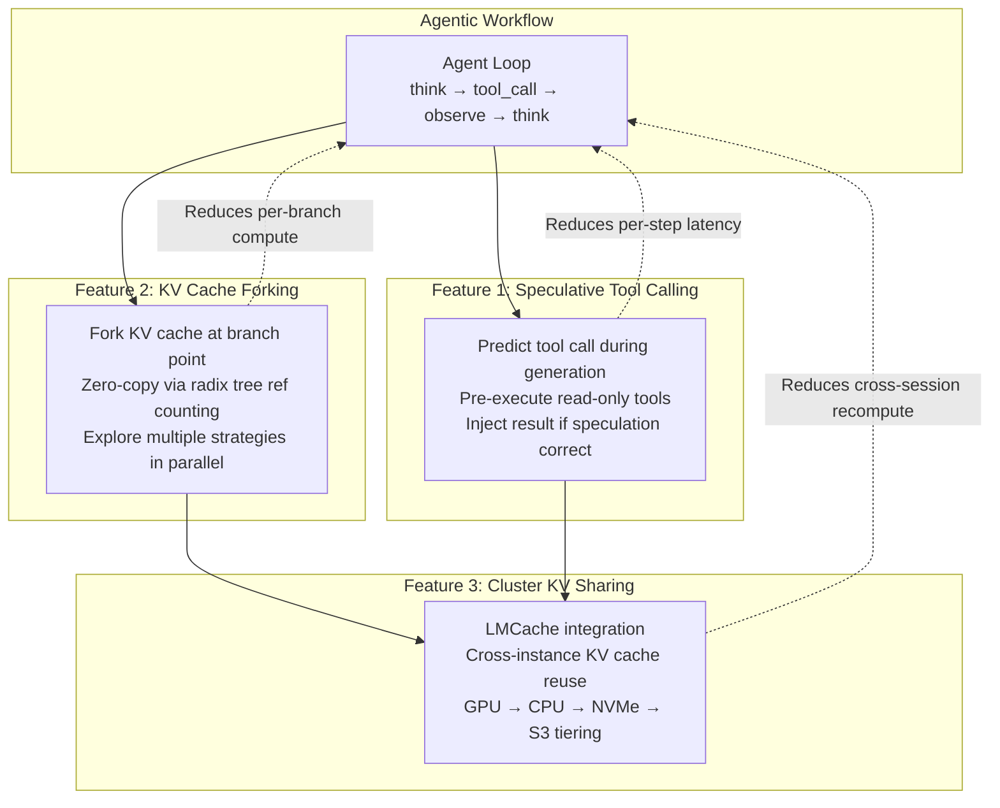

# Agentic Inference & KV Cache Innovations for TensorRT-LLM

**Status:** Exploratory Design
**Created:** 2026-04-06

---

## Motivation

Agentic LLM workloads (tool-use, multi-turn reasoning, branching exploration) are becoming the dominant production pattern. These workloads expose three performance bottlenecks that TRT-LLM's current architecture does not optimize for:

1. **Sequential tool-call latency** — agents spend most wall-clock time waiting (think -> generate tool call -> wait for tool -> encode result -> think again). Each round-trip adds inference + tool execution latency serially.
2. **Redundant KV computation in branching** — agents exploring multiple strategies (tree-of-thought, parallel tool calls, best-of-N) must recompute KV cache for shared context across branches.
3. **KV cache isolation** — each TRT-LLM instance's KV cache is invisible to others. In clustered deployments, the same prompts are re-encoded on different nodes. No external caching layer (like LMCache) is integrated.

This document proposes concrete designs for three features that address these bottlenecks, grounded in TRT-LLM's existing architecture.

---

## Table of Contents

1. [Speculative Tool Calling](01-speculative-tool-calling.md)
   Predict and pre-execute tool calls while the model is still generating, overlapping tool latency with inference latency.

2. [KV Cache Fork-Join for Branching Execution](02-kv-cache-forking.md)
   Zero-copy KV cache sharing across forked execution branches using the existing radix tree and reference-counted block infrastructure.

3. [Cluster-Wide KV Cache Sharing (LMCache Integration)](03-cluster-kv-sharing.md)
   Integrate LMCache as an external KV cache tier via the KV Cache Connector API, enabling cross-instance, cross-session cache reuse with GPU/CPU/disk/S3 storage backends.

---

## How These Features Relate

| Feature | Latency Impact | Compute Savings | Scope |
|:--------|:-------------|:---------------|:------|
| Speculative tool calling | 30-50% per agent step (overlaps tool + inference) | Minimal | Single request |
| KV cache forking | N branches, 1x prefix compute (vs Nx) | Up to (N-1)/N for shared prefix | Single instance |
| Cluster KV sharing | Eliminates re-encoding of cached prefixes across instances | Proportional to cache hit rate | Cluster-wide |
