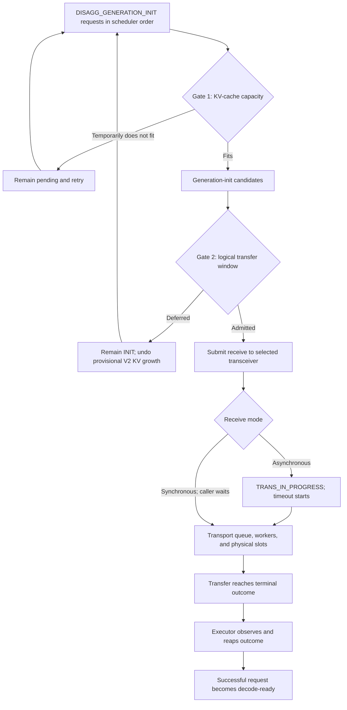
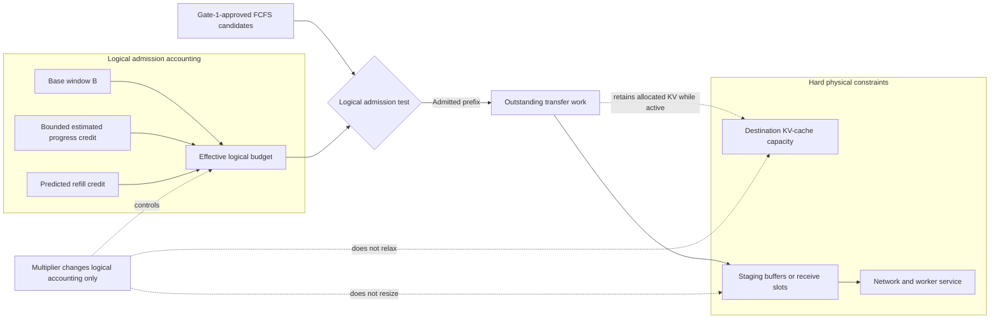
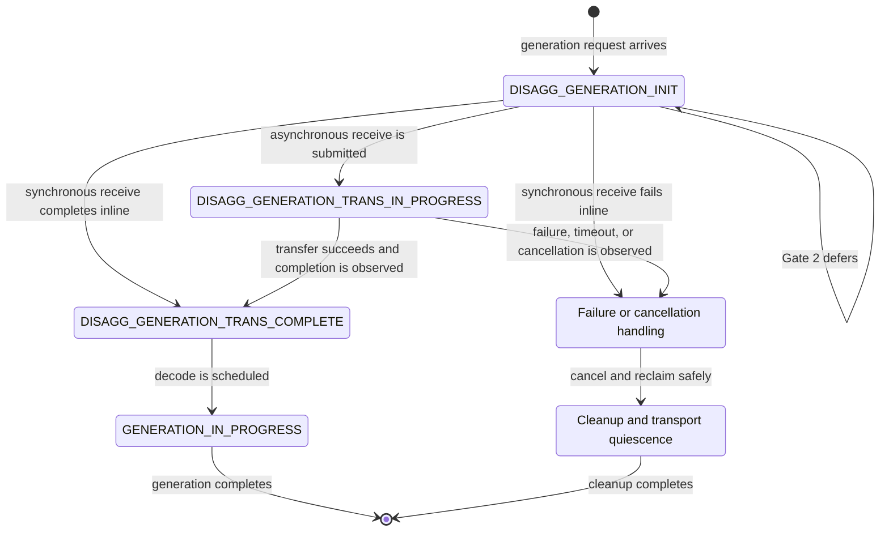
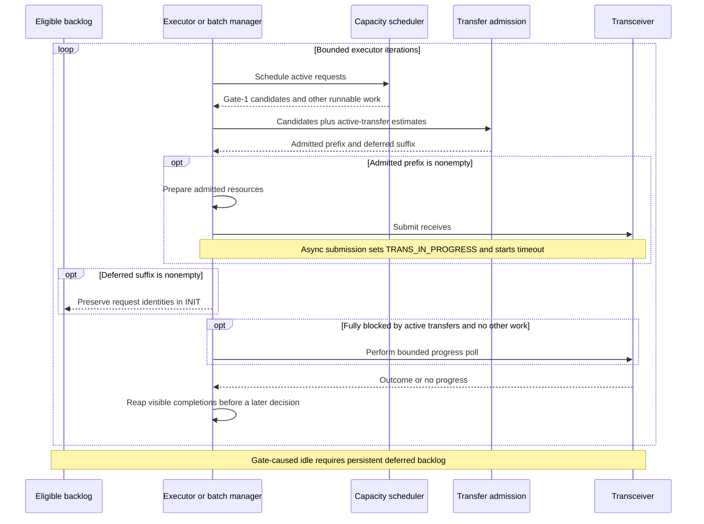
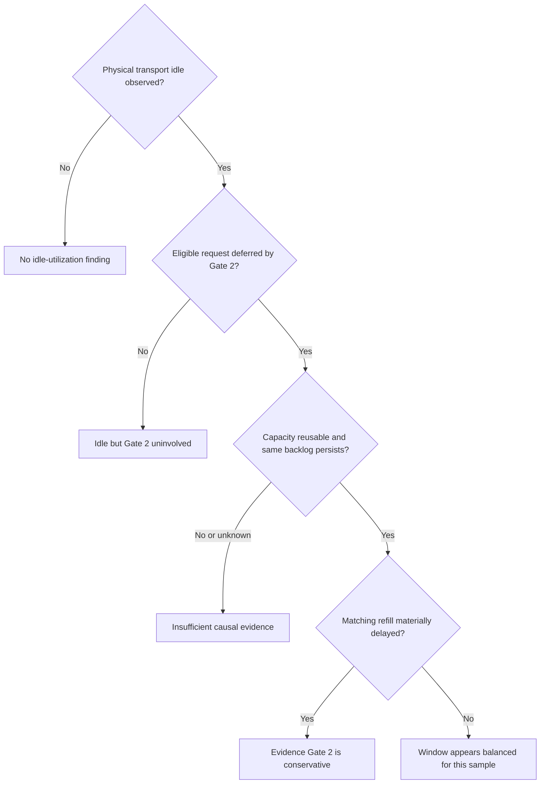
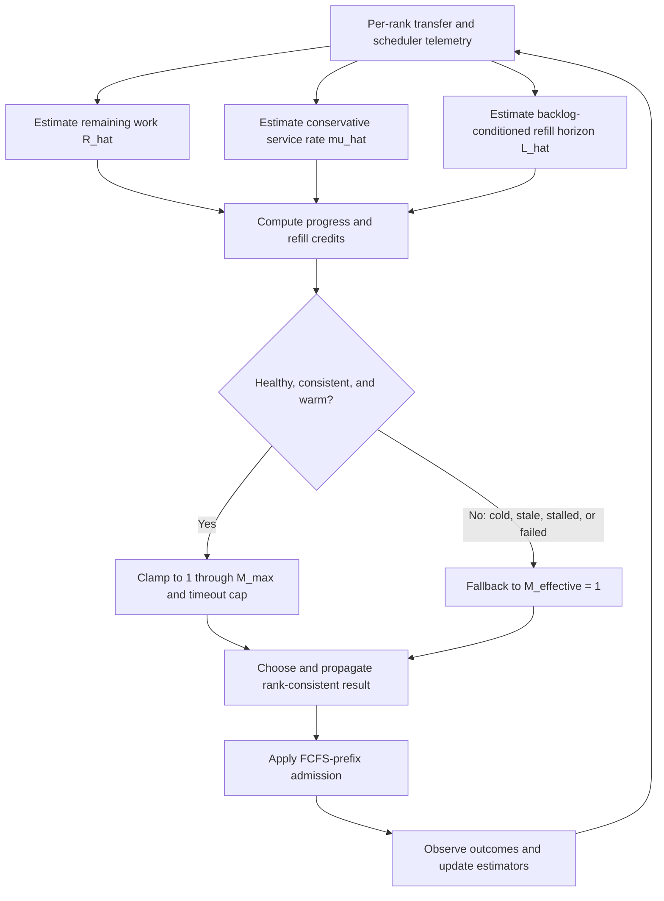

<!--
SPDX-FileCopyrightText: Copyright (c) 2026 NVIDIA CORPORATION & AFFILIATES. All rights reserved.
SPDX-License-Identifier: Apache-2.0
-->

# Disaggregated KV Transfer Admission Control

Two-stage scheduling, adaptive logical-window design, and safety model for
generation-side KV transfer.

| | |
|---|---|
| **Owner** | Chien-Chun Hung |
| **Status** | Current two-stage mechanism implemented; telemetry implemented in draft PR [#16559](https://github.com/NVIDIA/TensorRT-LLM/pull/16559); adaptive multiplier and configuration API proposed, not implemented |
| **Created** | 2026-07-20 |
| **Last updated** | 2026-07-20 |
| **Originating change** | [PR #15356](https://github.com/NVIDIA/TensorRT-LLM/pull/15356) |
| **Detailed measurements** | [Telemetry and validation](telemetry-and-validation.md) |
| **Prior design context** | [Bounded polling admission-accounting addendum](../disagg-inflight-cancel-poison/bounded-polling-admission-accounting.md) |
| **External working document** | [Architecture, mathematical model, and telemetry plan](https://docs.google.com/document/d/17CJskm_o4UiXDD4LwUqt5vr138hvP15uoxrc5vGq_8A/edit) |

## Contents

1. [Executive decision](#1-executive-decision)
2. [Scope, goals, and non-goals](#2-scope-goals-and-non-goals)
3. [Architecture and terminology](#3-architecture-and-terminology)
4. [Gate 1: physical KV-capacity scheduling](#4-gate-1-physical-kv-capacity-scheduling)
5. [Gate 2: logical transfer-window admission](#5-gate-2-logical-transfer-window-admission)
6. [Request lifecycle and scheduling cadence](#6-request-lifecycle-and-scheduling-cadence)
7. [Conservative, aggressive, and merely idle](#7-conservative-aggressive-and-merely-idle)
8. [Mathematical model](#8-mathematical-model)
9. [Programmatic estimators](#9-programmatic-estimators)
10. [Runtime-derived controller](#10-runtime-derived-controller)
11. [Configuration proposal](#11-configuration-proposal)
12. [Safety, fairness, and distributed invariants](#12-safety-fairness-and-distributed-invariants)
13. [Rollout and acceptance gates](#13-rollout-and-acceptance-gates)
14. [Alternatives and open gaps](#14-alternatives-and-open-gaps)
15. [Implementation source map](#15-implementation-source-map)
16. [Compact formula reference](#16-compact-formula-reference)

## 1. Executive decision

The two-stage architecture is sound when the responsibilities remain separate:

- **Gate 1 is a physical safety mechanism.** It prevents the scheduler from exceeding KV-cache capacity.
- **Gate 2 is logical flow control.** It limits the amount of submitted, outstanding KV-transfer work.

The current Gate-2 policy is deliberately simple and safe, but it is progress-oblivious. It charges every active
transfer at its original prompt-sized estimate until terminal completion is observed. It also cannot anticipate work
that will drain before the executor can make and submit the next admission decision.

That creates a valid mathematical rationale for a larger *logical* outstanding-work window. It does not justify
claiming that additional physical KV memory, staging memory, receive slots, or network bandwidth exists. Any adaptive
policy must remain bounded by Gate 1, transport timeout headroom, physical-slot ownership, and rank consistency.

Proceed telemetry-first:

1. Observe remaining work and backlog-conditioned release-to-refill delay while enforcing the current multiplier
   `M = 1`.
2. Replay fixed multipliers offline.
3. Add a separate logical override and adaptive cap.
4. Run a shadow controller that computes but does not enforce its decisions.
5. Enable bounded adaptive admission only after safety and estimator-quality gates pass.

The requested 128K GB300 workload validated the telemetry plumbing but never made Gate 2 binding. It therefore cannot
identify a multiplier greater than one. See [Telemetry and validation](telemetry-and-validation.md) for the complete
result and the required follow-up workload.

## 2. Scope, goals, and non-goals

### Goals

- Describe the current admission semantics precisely across the C++ batch-manager and PyExecutor paths.
- Separate physical KV capacity from logical transfer flow control.
- Define when Gate 2 is too conservative, too aggressive, or uninvolved.
- Derive an adaptive logical window from observable remaining work, transfer throughput, and refill delay.
- Define conservative behavior for warm-up, stale data, stalls, failures, cancellations, and distributed disagreement.
- Preserve FCFS ordering and the current oversized-head starvation exception in the first adaptive implementation.
- Provide a configuration shape for controlled fixed and adaptive experiments without resizing physical buffers.

### Non-goals

- Increasing KV-cache capacity or changing the Gate-1 allocator.
- Multiplying C++ staging-buffer, receive-buffer, pinned-pool, NIXL-registration, or physical-slot allocation.
- Changing transport concurrency or worker-thread counts.
- Introducing small-request bypass, deficit round robin, or another scheduling policy together with the multiplier.
- Claiming a production multiplier from a workload that produced no Gate-2 deferral.
- Treating cross-host monotonic timestamps as directly subtractable.

## 3. Architecture and terminology

### 3.1 Two-stage pipeline



The word *admission* is overloaded in conversation. This document uses:

- **Gate 1 / KV-capacity scheduling:** the scheduler decides whether the request can safely provision destination KV
  state now.
- **Gate 2 / transfer-window admission:** the executor decides whether a Gate-1 candidate may be submitted to the
  transfer machinery now.
- **Physical service admission:** the transport obtains a worker, receive slot, staging buffer, or backend resource and
  begins actual service. Gate 2 can precede this event, so `TRANS_IN_PROGRESS` may include queueing time.

### 3.2 Runtime matrix

| Scheduling path | Transceiver runtime | Gate-2 implementation | Physical transport shape |
|---|---|---|---|
| C++ batch manager | C++ cache transceiver | C++ `DisaggTransferAdmissionController` | Preallocated or dynamic staging/receive buffers and explicit slot ownership |
| PyExecutor | Bound C++ cache transceiver | Python `DisaggTransferAdmissionController` | Same C++ physical transport machinery behind the Python executor |
| PyExecutor | Python/V2 transceiver | Python `DisaggTransferAdmissionController` | Direct NIXL KV slices may avoid the same per-request bounce-buffer shape |

The logical policy is intended to have parity across these paths, but the physical meaning of “transport buffer” is
not identical. In particular, `max_tokens_in_buffer` participates in C++ physical sizing as well as Gate-2 logical
accounting. That coupling is why it must not be repurposed as a multiplier-only experiment knob.

### 3.3 Logical versus physical resources



“Logical only” means the multiplier does not resize a physical pool or relax Gate 1. Admitting more requests can still
change how many Gate-1-approved requests retain KV allocations and wait in the transfer pipeline. The controller must
therefore account for timeout, memory occupancy, and downstream contention even though it never manufactures capacity.

## 4. Gate 1: physical KV-capacity scheduling

Gate 1 protects destination KV-cache capacity. A disaggregated generation-init request needs enough KV state for the
incoming prompt plus any draft-token, beam, reuse, windowing, or implementation-specific allowance used by the active
KV manager and scheduler.

The statement “a request that does not fit available KV blocks is always rejected immediately” is too strong:

- Permanent infeasibility, such as a request that violates a configured invariant or can never fit, is an error.
- Temporary lack of free pages ordinarily causes the request to be skipped, deferred, paused, or retried according to
  scheduler policy.
- KV Cache Manager V2 can tentatively grow or restore request state while evaluating a scheduling attempt, then report
  that preparation cannot currently succeed.
- A generation-only benchmark has a special terminal no-fit path that fails requests instead of allowing an otherwise
  permanent fill-phase hang. That special case is not the general scheduler contract.
- Queue order influences priority, but it does not grant an irrevocable physical reservation to every pending request.

The invariant is:

```text
KV pages held after scheduling <= physically available KV-cache capacity
```

Gate 1 may use richer accounting than a simple block count. Gate 2 must treat its output as the only candidate set; it
must not independently infer that another request can bypass Gate 1.

## 5. Gate 2: logical transfer-window admission

### 5.1 Units and base budget

Let:

| Symbol | Meaning | Unit |
|---|---|---|
| `P` | Tokens per KV block | tokens/block |
| `T_buffer` | Configured `max_tokens_in_buffer` | tokens |
| `B` | Static Gate-2 budget | blocks |
| `k_i` | Transfer token count for request `i` | tokens |
| `w_i` | Original estimated transfer work for request `i` | blocks |

The current conversion is:

```text
B   = ceil(T_buffer / P)
w_i = ceil(k_i / P)
```

The Python controller resolves `k_i` from `total_input_len_cp`, then `py_prompt_len`, then `prompt_len`; the C++ mirror
uses `getPromptLen()`. Parity tests must keep these estimates equivalent for the active distributed configuration.

When the budget or block geometry is unavailable or disabled, the controller does not limit the candidate list.
PyExecutor normally defaults an unset `max_tokens_in_buffer` to `net_max_seq_len`, however, so `None` does not normally
disable Gate 2 in a fully created PyExecutor configuration.

### 5.2 Current FCFS-prefix algorithm

Let `U` be the sum of original estimates for requests currently in
`DISAGG_GENERATION_TRANS_IN_PROGRESS`. Starting with `used = U`, evaluate Gate-1 candidates in order:

```text
for candidate i in scheduler order:
    if used + w_i <= B:
        admit i
        used += w_i
    else if no active transfer, no candidate admitted, and w_i > B:
        admit oversized head i
    else:
        stop; defer this candidate and the remaining suffix
```

The accepted requests are an ordered prefix. A smaller request behind a non-fitting head does not bypass it. The
oversized-idle-head exception prevents permanent starvation when one request is larger than the nominal window. An
offline replay or adaptive implementation must preserve this exception explicitly.

### 5.3 Admitted versus deferred requests

An admitted request:

- is prepared for receive and submitted to the selected transceiver;
- on the asynchronous path, transitions from `DISAGG_GENERATION_INIT` to
  `DISAGG_GENERATION_TRANS_IN_PROGRESS` and starts its KV-transfer timeout at or immediately around successful
  submission;
- on the synchronous path, can complete receive inline and transition directly to
  `DISAGG_GENERATION_TRANS_COMPLETE`; Gate 2 still bounds the blocking transfers started in one iteration;
- when asynchronous, remains charged at its original `w_i` until a terminal outcome is observed by the executor.

A deferred request:

- is not submitted to the transport;
- remains in `DISAGG_GENERATION_INIT` for later reconsideration;
- does not start its transfer timeout;
- receives no immediate transfer-admission error;
- retains logical queue priority, but not guaranteed KV-page ownership;
- has provisional KV Cache Manager V2 growth from the current scheduling attempt reverted.

### 5.4 Why V2 provisional allocation is rolled back

Queue priority and physical ownership are different contracts. If a Gate-2-deferred request retained tentative KV
pages indefinitely, it would become a hidden reservation:

- inactive work could hoard KV capacity while neither transferring nor executing;
- decode-ready requests and other work capable of immediate progress could be starved;
- cancellation, eviction, resize, and failure cleanup ownership would become ambiguous;
- active-batch and physical-resource accounting would diverge;
- Gate 2 would silently become a persistent reservation system.

Reallocation on a later attempt has CPU and allocator cost, but it preserves the current ownership invariant. A
persistent reservation design is possible only with an explicit reservation state, accounting, fairness policy,
cancellation cleanup, and deadlock prevention.

### 5.5 Before and after PR #15356

| Behavior | Before PR #15356 | After PR #15356 |
|---|---|---|
| Gate-1-fitting generation-init list | Entire list prepared/submitted in the relevant paths | Filtered by a separate transfer-work window |
| Active transfer accounting | No independent original-work Gate-2 budget | Active transfer-in-progress requests consume Gate-2 budget |
| Gate-2 deferral | Not present | Remains in INIT and is reconsidered |
| Progress wait | A status/future wait could block indefinitely | Progress-required waits are bounded by `kv_transfer_poll_interval_ms` |
| Timeout start | At asynchronous transfer submission | Still at or immediately around asynchronous submission; deferred time is outside transfer timeout, while synchronous receive may complete inline |

## 6. Request lifecycle and scheduling cadence

### 6.1 Request states



`TRANS_IN_PROGRESS` means that the request has entered the transfer machinery. It does not prove that bytes are moving
at that instant; the state can include queueing behind workers or physical slots, actual service, and completion
observation/consensus delay. A timeout is not itself proof that remote access has quiesced; cancellation and cleanup
must complete before affected resources become reusable. With overlap disabled, synchronous receive may bypass
`TRANS_IN_PROGRESS` because the submission call completes the transfer inline.

### 6.2 Normal and progress-blocked polling

The executor ordinarily checks generation-transfer status nonblockingly. When all of the following hold, it can request
at least one transfer outcome:

- Gate 1 produced no immediately runnable work;
- Gate 2 admitted nothing;
- active generation transfers consumed the logical window; and
- distributed ranks agree to enter the relevant progress path.

After PR #15356, a progress-required wait is bounded by
`cache_transceiver_config.kv_transfer_poll_interval_ms`, which defaults to 5000 ms. The Python runtime checks native
sessions in short sleeps up to the deadline; the C++ runtime polls futures in bounded internal slices and returns early
when sufficient progress is observed.

The configured deadline is only one possible blocked-idle component of the end-to-end refill interval:

```text
L_refill =
    L_release_to_observation
    + L_until_next_schedule
    + L_gate1_gate2
    + L_resource_prepare
    + L_submit
```

Normal `at_least_num = 0` checks are short and nonblocking. Progress-blocked checks can approach the configured bound.
Model-forward and other executor-loop work can occur before the next schedule.
The controller needs the empirical release-to-refill distribution under known deferred backlog, not the configured
poll value and not general request-arrival cadence.

The sequence below shows the asynchronous path. A synchronous receive can complete inside the submit call and therefore
does not remain in `TRANS_IN_PROGRESS` across iterations.



## 7. Conservative, aggressive, and merely idle

These classifications require evidence; transceiver idle time alone is insufficient.



| Classification | Required observation | Interpretation |
|---|---|---|
| **Too conservative** | Eligible Gate-1 candidates are deferred by Gate 2; physical service becomes reusable; the same backlog persists; admission/submission is delayed | The logical window or refill cadence withheld work that could have been served |
| **Too aggressive** | Deep transport queueing, slot pressure, timeout-headroom loss, failures, or harmful downstream contention increase after admission | The logical window allowed more outstanding work than the service path can absorb safely |
| **Idle but uninvolved** | The transceiver is idle, but Gate 2 has no eligible deferred request | Upstream context production, request arrival, or Gate 1—not Gate 2—left no work to serve |
| **Balanced** | Backlogged service remains occupied while queue delay, timeout headroom, and downstream effects stay within limits | Window covers service without unsafe oversubscription |

The GB300 telemetry run fell into **idle but uninvolved**: every Gate-2 invocation saw an empty active set and admitted
its only candidate. A multiplier could not pull forward a request that had not yet become a Gate-1 candidate.

## 8. Mathematical model

The remaining-work and refill-credit model applies to asynchronous transfers that can stay in
`DISAGG_GENERATION_TRANS_IN_PROGRESS` across executor iterations. Synchronous receive still uses the static prefix to
bound work launched in an iteration, but normally provides no persistent active-transfer interval from which to derive
partial-progress credit.

### 8.1 Current static accounting

Let `A(t)` be the active transfer set and:

```text
U(t) = sum over i in A(t) of w_i
```

For an ordered candidate prefix `S`:

```text
W(S) = sum over j in S of w_j
```

The current ordinary admission test is:

```text
U(t) + W(S) <= B
```

The retrospective fixed multiplier needed for that prefix is:

```text
M_required(S) = max(1, [U(t) + W(S)] / B)
```

For a discrete implementation:

```text
B_logical = floor(M * B)
```

The oversized-idle-head exception is evaluated separately.

### 8.2 Progress credit

Let `r_i(t)` be true remaining work:

```text
0 <= r_i(t) <= w_i
R(t) = sum over i in A(t) of r_i(t)
```

The current controller assumes `r_i(t) = w_i` until terminal completion. Let `R_hat(t)` be a conservative estimate of
remaining work. Already-drained work becomes progress credit:

```text
C_progress(t) = U(t) - R_hat(t)
0 <= C_progress(t) <= U(t)
```

This term corrects stale accounting. It is not a prediction of future capacity.

### 8.3 Backlog-conditioned refill credit

Define same-process, monotonic lifecycle timestamps:

| Timestamp | Definition |
|---|---|
| `t_release` | Physical slot release or rank-local transfer-ready event |
| `t_decision+` | First later Gate-2 decision while the same deferred backlog persists |
| `t_admit+` | First later decision that admits a member of that backlog |
| `t_submit+` | Submission start for that admitted request |

Then:

```text
L_decision  = t_decision+ - t_release
L_admission = t_admit+    - t_release
L_refill    = t_submit+   - t_release
```

`L_refill` is the end-to-end idle-coverage quantity. `L_decision` diagnoses scheduler reaction, and `L_admission`
separates decisions that still could not admit. A later unrelated request arrival must not be treated as refill of the
earlier queue.

Let `mu_hat(t)` be a conservative aggregate drain-throughput estimate in blocks per second. The bandwidth-delay-product
credit is:

```text
C_refill(t) = mu_hat(t) * L_hat(t)
```

This predicts how much work is expected to drain before the executor can refill a known backlog.
Because larger `mu_hat` or `L_hat` grants more credit, enforcement must use a conservative lower-confidence throughput
and a conservative lower-bound or short-delay quantile for `L_hat`. Upper latency percentiles remain important for
diagnosis and timeout planning, but using them directly as future drain credit would over-admit.

### 8.4 Combined logical budget

The direct remaining-work form is:

```text
R_hat(t) + W_new <= B + C_refill(t)
```

Substituting `C_progress = U - R_hat` gives the equivalent current-accounting form:

```text
U(t) + W_new <= B + C_progress(t) + C_refill(t)
```

Therefore:

```text
B_effective(t) = B + C_progress(t) + C_refill(t)

M_raw(t) = B_effective(t) / B
         = 1 + [C_progress(t) + C_refill(t)] / B

M_effective(t) = clamp(M_raw(t), 1, M_max)
```

The credits are additive. Multiplying separate progress and refill factors would double-amplify the same capacity.

### 8.5 Timeout-derived upper bound

The transfer timeout begins after Gate-2 admission, so a larger logical queue can consume timeout headroom even when
physical memory remains safe. Require:

```text
T_queue,p99 + T_service,p99 + T_consensus,p99
    < T_transfer_timeout - epsilon
```

An equivalent conservative work cap is:

```text
Q_after_admission <= mu_low *
    [T_transfer_timeout - T_fixed,p99 - epsilon]
```

The enforced budget is the minimum of the model-derived, configured, timeout-derived, and physical-safety caps.

## 9. Programmatic estimators

### 9.1 Transfer throughput

Do not sum per-request rates when transfers overlap. For one rank and service class:

```text
mu_sample = completed work / union of successful busy intervals
```

The denominator is the interval union, not the sum of request durations. Maintain an exponentially weighted estimate:

```text
mu_EWMA,n = (1 - alpha) * mu_EWMA,n-1 + alpha * mu_sample,n
```

Admission should use a lower-confidence value such as a low percentile, confidence bound, or the slowest healthy
participating rank:

```text
mu_low <= expected sustainable service rate
```

Segment or invalidate estimates when the regime changes: C++ versus Python transport, direct versus bounce path,
payload bucket, concurrent transfer count, KV representation, model/block geometry, peer topology, or TP/PP/CP/EP/ADP
layout.

### 9.2 Remaining work

Preferred evidence, strongest first:

1. Transport-provided completed-byte counters per request or task.
2. Completed task/slice counters with known planned bytes.
3. Physical slot progress with known payload boundaries.
4. Service age plus a class-specific duration/throughput model.
5. Request-level binary completion only.

A conservative task-granularity estimator is:

```text
R_hat_i(t) = sum of planned work for unfinished tasks of request i
```

Completed tasks contribute zero; unfinished tasks retain their full planned size. If no task-level progress exists:

```text
R_hat_i(t) = w_i
C_progress(t) = 0
```

That fallback exactly preserves current behavior.

Service-age interpolation can be useful in shadow mode:

```text
f_hat_i(t) = clamp([t - service_start_i] / expected_duration_class(i), 0, 1)
R_hat_i(t) = w_i * [1 - f_hat_i(t)]
```

It should not be the first enforcement estimator because bandwidth sharing, queueing, and backend scheduling make
per-request progress nonlinear.

### 9.3 Refill delay

Measure distributions only when backlog identity is known:

1. A detailed decision defers a known request-ID set.
2. A release or ready event occurs while that backlog persists.
3. Record the first later decision, matching admission, and matching submit.
4. Exclude samples if only an unrelated later request is observed.

Maintain p50, p90/p95, p99, maximum, EWMA, cold-start versus steady-state, and progress versus no-progress poll samples.
For enforcement, select a validated lower-bound or short-delay estimate; retain upper percentiles for safety and
diagnostics. The configured 5000 ms poll interval is a control bound, not `L_hat`.

### 9.4 Clock domains

Never subtract absolute monotonic timestamps from different hosts or processes. Compute local elapsed durations first,
then aggregate durations or controller outputs. For Python direct transfer, preserve separate bounds when physical slot
release is unavailable:

```text
L_ready_refill = t_submit+ - t_local_ready
L_reap_refill  = t_submit+ - t_reap
L_ready_reap   = t_reap    - t_local_ready
```

The scheduler-visible reap bound is smaller and more conservative. A future consensus-defined global-ready event could
replace this ambiguity.

## 10. Runtime-derived controller

### 10.1 Controller loop



Maintain per service class:

- completed sample count and warm-up state;
- `mu_EWMA` and `mu_low`;
- decision, admission, and refill-delay distributions;
- task-progress availability and estimator error;
- last update time and staleness;
- recent failure, timeout, cancellation, and stall indicators;
- current multiplier and hysteresis state.

### 10.2 Policy

```text
if mode == static and no fixed override:
    M = 1
else if fixed override is present:
    M = clamp(override, 1, M_hard_max)
else if data is cold, stale, inconsistent, stalled, or unhealthy:
    M = 1
else:
    C_progress = bounded observable progress credit
    C_refill = mu_low * selected conservative backlog refill delay
    M_target = clamp(1 + [C_progress + C_refill] / B, 1, M_max)
    M = rate_limited_and_hysteretic(M_target)
```

Move upward slowly and fall back quickly. A failure, timeout, rank disagreement, or no-progress stall should immediately
remove speculative credit and drive the controller toward `M = 1`.

### 10.3 Distributed aggregation

Admission decisions that affect distributed batch composition must be rank-consistent. A conservative first policy is:

```text
M_global     = min over participating ranks of M_rank
mu_global_low = min over participating ranks of mu_rank_low
```

The minimum avoids averaging away a slow or backpressured rank. Compute rank-local durations first; never subtract
cross-host timestamps to manufacture a global duration. A minimum multiplier alone is not sufficient if ranks disagree
on active occupancy, candidate costs, or candidate order. Either one designated scheduling leader must select and
propagate the admitted request IDs, or ranks must reach consensus using worst-case occupancy and candidate costs before
applying an identical prefix.

## 11. Configuration proposal

There is no dedicated multiplier-only configuration knob today. Do not use `max_tokens_in_buffer` as that knob because
it participates in C++ physical buffer behavior.

Recommended follow-up schema:

```yaml
cache_transceiver_config:
  kv_transfer_admission_window_mode: static
  kv_transfer_admission_window_multiplier_override: null
  kv_transfer_admission_window_max_multiplier: 2.0
```

Proposed semantics:

| Configuration | Behavior |
|---|---|
| `static` with null override | `M = 1`; current behavior |
| Non-null override | Fixed logical multiplier for controlled experiments |
| `adaptive` | Runtime-derived multiplier bounded by `max_multiplier` |
| Any mode | Gate-2 accounting only; never resizes KV cache or transport pools |

Only add advanced knobs—warm-up sample count, EWMA alpha, refill percentile, staleness timeout, maximum update step, and
timeout margin—if measurements show that operators need them. Avoid exposing an unvalidated tuning surface.

## 12. Safety, fairness, and distributed invariants

### Physical safety

- Gate 1 remains authoritative for KV-cache capacity.
- C++ receive/staging slots remain authoritative for their physical ownership and reuse.
- Logical oversubscription never resizes physical pools or registrations.
- Cancellation, failure, and timeout release or quarantine resources exactly once.
- A poisoned or non-quiescent slot is never reported reusable.
- Progress and refill credits are not double-counted.

### Timeout and health

- Failed and cancelled intervals do not train successful-service throughput.
- Stalled samples invalidate rather than increase drain credit.
- Queue wait after Gate-2 admission is included in timeout-headroom analysis.
- A larger logical window is rejected if it makes the conservative p99 queue-plus-service bound exceed the timeout.

### Fairness

The first adaptive implementation retains the current FCFS prefix. A large head can block smaller candidates, but
changing ordering would confound multiplier validation and could introduce starvation. Telemetry should quantify
head-of-line duration and counterfactual smaller prefixes. Aging, bounded bypass, or deficit round robin are separate
future scheduling changes.

### Distributed consistency

- Every rank uses the same admitted request IDs for a distributed iteration.
- Completion, failure, and cancellation outcomes follow the applicable consensus contract.
- Local estimator inputs can differ, but the enforced global result is conservatively agreed before it affects batch
  composition.
- Clock-domain conversion never substitutes for explicit state consensus.

## 13. Rollout and acceptance gates

### Phase 1: telemetry at `M = 1`

Capture service intervals, queue delay, progress boundaries, slot release, scheduler reap, deferred backlog identity,
release-to-refill delay, errors, and end-to-end performance.

### Phase 2: offline replay

For each detailed decision, compute `R_hat`, `C_progress`, `C_refill`, `M_required`, and FCFS prefixes under fixed values
such as 1.25, 1.5, and 2.0. A detailed decision snapshot is sufficient for fixed FCFS-prefix replay. Persistent backlog
identity is additionally required for release-to-refill credit and adaptive-shadow samples.

### Phase 3: runtime shadow mode

Compute adaptive decisions online while enforcing `M = 1`. Compare predicted remaining work and refill with later
observed outcomes.

### Phase 4: controlled fixed override

Run diagnostics-disabled fixed multipliers with same-allocation controls. Verify that physical configurations are
unchanged and that queue delay remains inside timeout headroom.

### Phase 5: bounded adaptive enforcement

Enable only when estimator error is bounded, rank aggregation is defined, timeout headroom remains positive, physical
cleanup shows no regression, and multiplier evolution is stable.

Acceptance requires:

- no KV OOM or physical-buffer over-allocation;
- no increase in transfer timeout, failure, cancellation-cleanup, or poisoned-slot count;
- no cross-rank batch divergence or request starvation;
- reduced physical idle time specifically while eligible deferred backlog exists;
- improved or unchanged diagnostics-disabled end-to-end throughput;
- acceptable TTFT, tail latency, and queue-delay impact;
- fixed and shadow predictions that agree with controlled observations.

## 14. Alternatives and open gaps

### Alternatives considered

| Alternative | Benefit | Limitation |
|---|---|---|
| Keep `M = 1` permanently | Simplest and safest | Can waste known progress and refill opportunities under real backlog |
| Increase `max_tokens_in_buffer` | Existing configuration | Couples logical policy to C++ physical sizing and does not isolate the experiment |
| Wait for every active transfer | Strong serialization | Reintroduces bubbles and can hide timeout/cancellation checks |
| Retain deferred V2 KV allocations | Avoids reallocation | Creates hidden reservations and requires a new ownership protocol |
| Increase transport concurrency only | May improve service rate | Separate physical tuning problem; can increase memory and bandwidth contention |
| Allow small-request bypass | Can reduce head-of-line blocking | Changes fairness and scheduling semantics; should not be mixed with multiplier validation |

### Open gaps

- No uniform continuous completed-byte counter exists across transport runtimes.
- Python rank-local ready time has no universal physical-slot interpretation.
- Gate 1 and Gate 2 do not share an explicit persistent-reservation abstraction.
- `max_tokens_in_buffer` couples logical admission with C++ physical sizing.
- Timeout semantics include queue wait after Gate-2 submission.
- Workload and topology changes can stale throughput and latency models.
- INFO-level diagnostics perturb absolute performance and must remain opt-in.
- Sender-side transfer pressure may eventually require an analogous credit model.

## 15. Implementation source map

The `docs-and-plans` branch intentionally carries documentation separately from current runtime source. Use the linked
PRs or a current runtime branch when inspecting these paths.

| Concern | Source path |
|---|---|
| C++ Gate-2 controller | `cpp/include/tensorrt_llm/batch_manager/disaggTransferAdmissionController.h` |
| C++ Gate-1 scheduling | `cpp/tensorrt_llm/batch_manager/capacityScheduler.cpp` |
| C++ admission call, preparation, blocked-progress wait | `cpp/tensorrt_llm/batch_manager/trtGptModelInflightBatching.cpp` |
| C++ physical transfer and telemetry | `cpp/tensorrt_llm/batch_manager/dataTransceiver.cpp` |
| C++ preallocated-buffer sizing from `max_tokens_in_buffer` | `cpp/tensorrt_llm/batch_manager/cacheTransBuffer.cpp` |
| C++ preallocated slices and dynamic fallback | `cpp/tensorrt_llm/batch_manager/baseTransBuffer.cpp` |
| C++ asynchronous state transition and bounded status polling | `cpp/tensorrt_llm/batch_manager/cacheTransceiver.cpp` |
| PyExecutor Gate-2 controller and both executor-loop call sites | `tensorrt_llm/_torch/pyexecutor/py_executor.py` |
| Python Gate-1 schedulers | `tensorrt_llm/_torch/pyexecutor/scheduler/scheduler.py`, `scheduler_v2.py` |
| V2 provisional KV preparation | `tensorrt_llm/_torch/pyexecutor/kv_cache_manager_v2.py` |
| Python transceiver bounded polling | `tensorrt_llm/_torch/disaggregation/transceiver.py` |
| Native receive-task boundaries | `tensorrt_llm/_torch/disaggregation/native/transfer.py` |
| Offline analyzer from draft PR #16559 | `scripts/disagg_admission_telemetry.py` |
| Analyzer regression tests | `tests/unittest/tools/test_disagg_admission_telemetry.py` |

## 16. Compact formula reference

```text
B = ceil(T_buffer / P)

w_i = ceil(k_i / P)

U(t) = sum of original w_i for active transfers

R_hat(t) = estimated active remaining work

C_progress(t) = U(t) - R_hat(t)

L_decision = t_decision+ - t_release

L_refill = t_submit+ - t_release

C_refill(t) = mu_hat(t) * L_hat(t)

B_effective(t) = B + C_progress(t) + C_refill(t)

M_raw(t) = 1 + [C_progress(t) + C_refill(t)] / B

M_effective(t) = clamp(M_raw(t), 1, M_max)

Admission:
R_hat(t) + W_new <= B + C_refill(t)

Equivalent admission:
U(t) + W_new <= B + C_progress(t) + C_refill(t)

Fixed FCFS-prefix requirement:
M_required(S) = max(1, [U(t) + W(S)] / B)

Timeout work cap:
Q_after_admission <= mu_low *
    [T_transfer_timeout - T_fixed,p99 - epsilon]

Conservative distributed result:
M_global = min over participating ranks of M_rank
```
