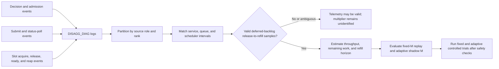

<!--
SPDX-FileCopyrightText: Copyright (c) 2026 NVIDIA CORPORATION & AFFILIATES. All rights reserved.
SPDX-License-Identifier: Apache-2.0
-->

# Admission-Control Telemetry and Validation

[< Back to admission-control design](README.md)

| | |
|---|---|
| **Owner** | Chien-Chun Hung |
| **Status** | Telemetry implemented in draft PR [#16559](https://github.com/NVIDIA/TensorRT-LLM/pull/16559); first GB300 capture complete |
| **Capture date** | 2026-07-17 through 2026-07-18 |
| **Last updated** | 2026-07-20 |
| **Telemetry capture commit** | `275646a5c1757eb3f2863525a8b5742c53296784` |
| **Latest telemetry/analyzer commit** | `b3284ab1a7f11167ea6c27cb002e03aec3007394` |
| **Empirical analysis** | [PR comment](https://github.com/NVIDIA/TensorRT-LLM/pull/16559#issuecomment-5009515607) |

## Contents

1. [Purpose](#1-purpose)
2. [Event model](#2-event-model)
3. [Offline analyzer](#3-offline-analyzer)
4. [Requested GB300 validation run](#4-requested-gb300-validation-run)
5. [What Gate 2 actually exercised](#5-what-gate-2-actually-exercised)
6. [Physical transfer measurements](#6-physical-transfer-measurements)
7. [Scheduler visibility and polling](#7-scheduler-visibility-and-polling)
8. [Clock-domain correction](#8-clock-domain-correction)
9. [Applying the model to this run](#9-applying-the-model-to-this-run)
10. [Required next experiment](#10-required-next-experiment)

## 1. Purpose

The adaptive logical-window model needs two quantities that ordinary request logs cannot distinguish:

1. **Remaining work:** how much work remains inside already-admitted transfers, rather than their original prompt-sized
   estimates.
2. **Backlog-conditioned refill delay:** how long physical capacity remains reusable before the executor admits and
   submits another request from a known deferred backlog.

Draft PR #16559 adds opt-in telemetry and a standard-library-only offline analyzer. It intentionally leaves the
enforced Gate-2 multiplier at `M = 1`. This separates measurement from policy and avoids changing KV allocation,
physical transport sizing, or admission behavior during the first data capture.

Enable worker-side diagnostics at startup:

```bash
TRTLLM_DISAGG_TRANSFER_DIAGNOSTICS=1
```

The environment value is cached. Disabled hot paths avoid repeated environment lookups and do not allocate diagnostic
timestamp or ready-set state.

## 2. Event model



### 2.1 Worker and executor events

| Event | Important fields | Question answered |
|---|---|---|
| `decision` | sequence, rank, runtime, active/candidate/admitted/deferred counts and blocks, budget | Did Gate 2 bind, and by how much? |
| `admission` | active, candidate, admitted, and deferred request IDs with block estimates | Which FCFS backlog persisted across decisions? |
| `submit` | request ID, blocks, bytes, submit start and duration, runtime, resulting state | When did timeout-bearing outstanding work enter the transport? |
| `status-poll` | requested progress, tracked count, start/end duration, completed/failed/cancelled outcomes | Was the executor nonblocking or waiting for progress? |
| `reap` | request state, terminal outcome, executor-visible time, ready-to-reap delay | When did the scheduler stop charging the request? |

Detailed admission snapshots are emitted when state changes or a request is admitted. Lightweight decision events are
kept for every Gate-2 invocation so that no-progress iterations remain visible.

### 2.2 Physical and native-transfer events

| Event | Runtime | Question answered |
|---|---|---|
| `receiver-slot` acquire/release | C++ | How long did a request wait for a physical receive slot, and when did that slot become reusable? |
| `receiver-transfer` failure | C++ | Which intervals must be excluded from successful throughput training? |
| `python-transfer` start/ready | Python | When did native receive service actually start and when were all slices locally complete? |

C++ release timestamps are sampled in causal order around slot release. Python native completion is stamped at task
state transition rather than when a later polling loop notices it.

## 3. Offline analyzer

Run against one or more worker logs:

```bash
python scripts/disagg_admission_telemetry.py worker-0.log worker-1.log > analysis.json
```

The analyzer namespaces ranks by input source so numeric CTX and GEN rank IDs cannot be accidentally merged. It reports
per-source, per-rank, and aggregate views of:

- event counts and unmatched lifecycle endpoints;
- successful service intervals and overlap-safe busy-time throughput;
- submit-to-service-start queue delay;
- physical slot wait and reuse;
- Python local-ready and scheduler-reap bounds;
- progress and no-progress polling latency;
- release-to-next decision, matching admission, and matching submit;
- retrospective remaining-work/progress credit;
- fixed multiplier required for each FCFS prefix;
- adaptive shadow samples only where backlog identity is known;
- failed and cancelled interval exclusions.

### 3.1 Overlap-safe throughput

For each source-qualified rank:

```text
mu_sample = successful completed work / union of successful busy intervals
```

Using the interval union avoids double-counting capacity when requests overlap. Cross-rank policy should use
per-rank estimators and a conservative aggregation rather than a pooled average that hides a slow rank.

### 3.2 Remaining-work replay

When only request service boundaries exist, retrospective interpolation supplies a hindsight linear reference:

```text
f_retrospective_i(t) = clamp(
    [t - service_start_i] / [service_end_i - service_start_i],
    0,
    1)

C_progress,retrospective(t) =
    sum over active i of w_i * f_retrospective_i(t)
```

This uses eventual service duration and is therefore hindsight, not an online estimator or a bound on nonlinear
progress. It is useful for evaluating whether a future service-age model explains observed progress. Enforcement must
use counters, completed tasks, or a conservatively validated online model.

### 3.3 Backlog identity

Release-to-refill is eligible for multiplier fitting only when:

- an earlier detailed decision identified deferred request IDs;
- the same backlog remained eligible at release time; and
- a later decision admitted and submitted one of those IDs.

A later unrelated candidate does not measure scheduler reaction to the earlier backlog. Raw request-arrival cadence is
reported separately and never substituted for the backlog-conditioned refill horizon.

Nine focused unit tests cover timestamp parsing, overlap-safe throughput, Python native service boundaries, C++ slot
reuse, first-decision versus later-refill separation, failed-transfer exclusion, unknown backlog identity, multi-log
source isolation, and CLI output.

## 4. Requested GB300 validation run

### 4.1 Exact workload

**Stage**

```text
GB300-12_GPUs-3_Nodes-PyTorch-Disagg-PerfSanity-CTX1-NODE1-GPU4-GEN1-NODE2-GPU8-Post-Merge-1
```

**Pytest target**

```text
disagg_upload-e2e-gb300_deepseek-r1-fp4_128k8k_con256_ctx1_pp4_gen1_dep8_eplb0_mtp1_ccb-NIXL
```

Relevant resolved workload values were:

| Setting | Value |
|---|---:|
| Input length | 131,072 tokens |
| `max_tokens_in_buffer` | 131,104 tokens |
| Tokens per KV block | 32 |
| Gate-2 base budget | 4097 blocks |
| Work per request | 4096 blocks |
| Context `max_batch_size` | 1 |
| External concurrency | 256 |

The one-request context batch contributes to serialized candidate production even though client-side concurrency is
high.

Run provenance:

- [Exact child job](https://prod.blsm.nvidia.com/sw-tensorrt-llm-github-3/job/LLM/job/main/job/L0_Test-SBSA-Multi-GPU/2446/)
- [Parent job](https://prod.blsm.nvidia.com/sw-tensorrt-top-1/job/LLM/job/main/job/L0_MergeRequest_PR/48450/)
- [Telemetry result archive](https://urm.nvidia.com/artifactory/sw-tensorrt-generic/llm-artifacts/LLM/main/L0_MergeRequest_PR/48450/test-results/results-GB300-12_GPUs-3_Nodes-PyTorch-Disagg-PerfSanity-CTX1-NODE1-GPU4-GEN1-NODE2-GPU8-Post-Merge-1.tar.gz)

The workload uses the PyTorch backend and default bound C++ transceiver. It therefore exercises PyExecutor Gate-2
logic and C++ physical receiver-slot lifecycle. Python-native transfer boundaries have focused unit coverage and need a
separate Python-transceiver integration run.

### 4.2 Functional and benchmark outcome

All 512 benchmark requests completed. No KV transfer failed or timed out. The pytest case failed only after completion,
when its performance comparator evaluated the benchmark.

| Metric | Telemetry run |
|---|---:|
| Benchmark duration | 5258.22 s |
| Output token throughput | 797.67 token/s |
| Total token throughput | 13,560.33 token/s |
| Mean TTFT | 1,922,096.76 ms |

The stored comparator expected 1562.59 output token/s, 26,563.97 total token/s, and 958,664.91 ms mean TTFT, producing
an apparent approximately 49% regression.

That stored-baseline mismatch predates this telemetry. A diagnostics-disabled historical run of the exact test and
configuration at commit `74739166` reported:

- [Historical result archive](https://urm.nvidia.com/artifactory/sw-tensorrt-generic/llm-artifacts/LLM/main/L0_PostMerge/2842/test-results/results-GB300-12_GPUs-3_Nodes-PyTorch-Disagg-PerfSanity-CTX1-NODE1-GPU4-GEN1-NODE2-GPU8-Post-Merge-1.tar.gz)
- 5234.83 s benchmark duration;
- 801.23 output token/s;
- 13,620.92 total token/s;
- 1,910,909 ms mean TTFT.

Relative to that closest exact-config control, the telemetry run was 0.45% longer, 0.44% lower in throughput, 0.59%
higher in mean TTFT, and 0.25% longer in pytest wall time. The historical output warned about essentially the same
stored-baseline mismatch, but post-merge policy did not fail the case.

This comparison is not a same-allocation A/B and does not prove zero instrumentation overhead. It bounds the observed
difference to roughly 0.5% plus normal allocation and run noise. Diagnostics remain opt-in; temporary perf-YAML
enablement was removed after capture.

## 5. What Gate 2 actually exercised

The generation log contained:

| Event | Count |
|---|---:|
| Gate-2 decisions | 512 |
| Detailed admission snapshots | 512 |
| Submissions | 512 |
| Executor reaps | 512 |
| C++ receiver-slot endpoints | 1024 |

Every decision had the same shape:

| Quantity | Observed value |
|---|---:|
| Active transfer blocks | 0 |
| Candidates | 1 |
| Candidate size | 4096 blocks |
| Static budget | 4097 blocks |
| Admitted | 1 |
| Deferred | 0 |

The workload repeatedly exercised:

```text
4096 candidate blocks <= 4097 budget blocks
```

It never exercised:

```text
active transfer work + new candidate work > static budget
```

Consequently:

- no eligible request waited behind Gate 2;
- no decision-time progress-credit sample exists;
- no backlog-conditioned release-to-decision, admission, or submit sample exists;
- fixed-multiplier replay has no deferred FCFS suffix to pull forward;
- any `M > 1` inferred from this run would be unsupported.

### 5.1 Was the transceiver idle?

The trace is consistent with the transport being unoccupied between many transfers: one 4096-block transfer usually
completed in roughly 130–150 ms after warm-up, while the next logged candidate decision on a generation rank appeared
roughly 80.5 seconds later.

That 80.5-second interval is context-production or candidate-arrival cadence, not Gate-2 reaction latency. At each
Gate-2 decision there was no active charged work and the available candidate was admitted immediately. A multiplier
cannot pull forward a request that has not yet reached Gate 2.

Therefore this run shows neither that Gate 2 is too conservative nor that it is too aggressive. It shows idle time
without eligible deferred backlog, so Gate 2 was uninvolved.

To prove conservative behavior, the trace must contain this causal chain:

```text
known eligible request deferred by Gate 2
    -> physical service capacity released
    -> same deferred backlog still exists
    -> no matching admission/submission for a measurable interval
```

To prove aggressive behavior, increasing the logical window must create excessive queueing, timeout-headroom loss,
slot pressure, failure, or harmful downstream contention. None occurred in this capture.

## 6. Physical transfer measurements

The analyzer matched all 512 receiver-slot acquisitions and releases with no unmatched endpoints. It observed 2,097,152
transferred blocks over 99.7075 raw busy rank-seconds. First-transfer warm-up outliers reached 22.23 seconds on two ranks
and 4.53 seconds on another, so cold samples must not train the steady-state controller.

After excluding the first completed interval on each generation rank:

| Metric | Result |
|---|---:|
| Intervals | 504 |
| Median service time for 4096 blocks | approximately 129.8 ms |
| P95 service time | approximately 153.9 ms |
| P99 service time | approximately 169.5 ms |
| Slowest per-rank service rate | approximately 27,572 blocks/s |
| Service time at that conservative rate | approximately 149 ms per 4096 blocks |

Use warm per-rank estimators and a conservative cross-rank minimum or lower confidence bound. A pooled mean hides
rank heterogeneity and cold-start effects.

Physical slot acquisition itself was not a bottleneck:

| Slot-wait metric | Result |
|---|---:|
| Median | 0.002 ms |
| Maximum | 0.024 ms |

## 7. Scheduler visibility and polling

The reliable same-process physical-release-to-executor-reap measurement had 512 samples:

| Metric | Delay |
|---|---:|
| Median | 11.20 ms |
| P95 | 18.32 ms |
| P99 | 19.72 ms |
| Maximum | 37.98 ms |

Other pipeline components were:

| Interval | Median | P95 |
|---|---:|---:|
| Admission decision to submit start | 4.71 ms | 6.93 ms |
| Submit start to receiver-slot acquisition | 0.341 ms | 0.816 ms |
| Generation progress poll when progress was observed | 0.051 ms | 0.070 ms |

The generation worker made 533 status-poll calls. All used `at_least_num = 0`; the workload did not exercise the
progress-blocked `at_least_num = 1` path or its configured 5000 ms deadline. Twenty-one generation-side no-progress
calls had a 3.573 ms median and 3.715 ms maximum.

Context logs contained a different role and different distributed waits: 696 no-progress calls with 4.387 s median,
13.146 s P95, and 13.219 s maximum. They must not be pooled with generation Gate-2 polling. The analyzer keeps CTX and
GEN source aggregates separate even when their numeric rank IDs overlap.

## 8. Clock-domain correction

The initial telemetry capture attempted to adjust a local C++ transfer-end timestamp with
`LlmRequest.global_steady_clock_offset` and compare it with a local executor reap timestamp. On generation ranks 4–7,
this created 254 impossible negative intervals because one timestamp had been converted toward rank 0's domain while
the other remained rank-local.

The implementation was corrected after capture to:

- compare raw local C++ steady-clock duration with local executor time;
- label the ready timestamp source explicitly; and
- avoid subtracting timestamps from different processes or adjusted domains.

The archived run remains analyzable because independent C++ slot-release and local executor-reap events provide 512
valid causal intervals.

Runtime policy must use local elapsed durations, byte/block counters, or an explicitly synchronized consensus event.
Cross-host absolute monotonic timestamps are not a valid shortcut.

## 9. Applying the model to this run

The run supports a conservative post-warm-up service estimate:

```text
mu_low ~= 27,572 blocks/s
```

The refill model still needs:

```text
C_refill = mu_low * L_backlog
```

This workload provides no `L_backlog` because no eligible request waited behind Gate 2. The 11.20 ms median
release-to-reap delay is only one component; it cannot substitute for release-to-matching-submit under backlog.

For intuition only, every 10 ms of *proven backlog-conditioned* refill delay would correspond to approximately 276
blocks at `mu_low`. That is not permission to grant 276 blocks from this run. Until the full causal interval is observed:

```text
C_refill is not identifiable
M_effective is not identifiable
enforced recommendation: M = 1
```

## 10. Required next experiment

The next workload must deliberately make Gate 2 binding without changing physical memory:

- produce more than one eligible generation-init request per rank before the prior transfer is reaped;
- use shorter input sequences and/or greater context-side concurrency so candidate production can outrun transport;
- use a separate small logical admission window without shrinking or multiplying the physical C++ buffer;
- retain detailed active, admitted, and deferred request identities;
- exercise the progress-blocked `at_least_num = 1` path;
- collect release-to-decision, release-to-matching-admission, and release-to-matching-submit distributions;
- run diagnostics-enabled `M = 1` for model fitting;
- follow with diagnostics-disabled fixed-`M` performance experiments;
- pair every treatment with a same-allocation diagnostics-disabled control.

### 10.1 Experiment order

1. Baseline telemetry at `M = 1` until enough deferred-backlog samples exist.
2. Offline FCFS replay for `M = 1.25`, `1.5`, and `2.0`.
3. Runtime shadow decisions while enforcing `M = 1`.
4. Fixed logical overrides with identical physical configuration.
5. Bounded adaptive controller only after prediction and safety criteria pass.

### 10.2 Minimum evidence before choosing `M > 1`

- Gate-2 deferral occurs frequently enough for stable distributions.
- Physical release precedes a delayed matching refill while backlog persists.
- Remaining-work estimates do not systematically understate work.
- Fixed replay predicts the controlled fixed-override outcomes.
- Queue wait plus service remains inside conservative timeout headroom.
- Configured physical pool and registration sizes remain unchanged; KV occupancy and queue depth stay bounded with no
  over-allocation or OOM.
- No rank divergence, timeout, transfer failure, or cancellation-cleanup regression occurs.
- Diagnostics-disabled throughput improves or remains unchanged with acceptable TTFT and tail latency.

Only then can the controller distinguish useful logical credit from unsafe oversubscription.
