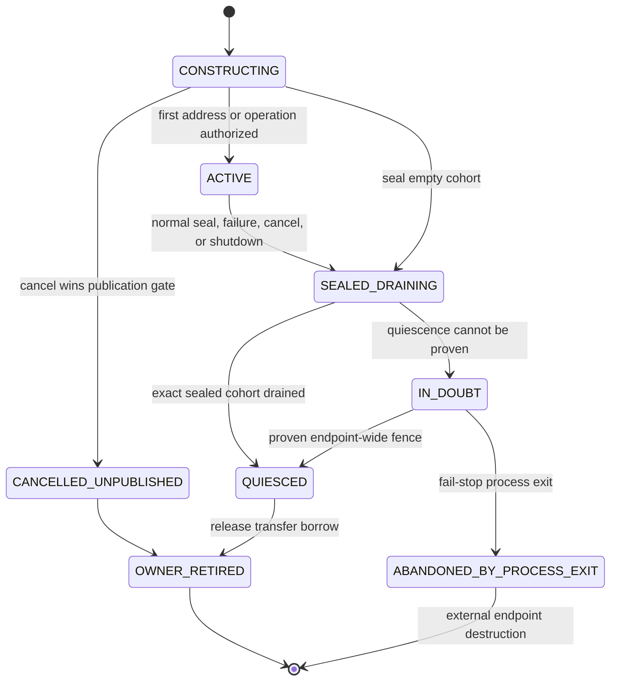
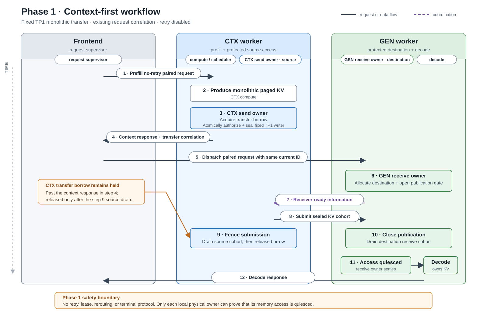

# Disaggregated Inference Transfer Lifecycle — GPT Design

| | |
|---|---|
| **Status** | Design proposal, re-baselined against `main@0946d54b8d` |
| **Last updated** | 2026-08-14 |

## Executive Summary

The urgent correctness problem is local physical operation ownership. A CTX or
GEN request can become logically terminal before every NIXL or CUDA accessor is
known to be terminal. Cancellation, consensus, timeout, session removal, or
shutdown must therefore never be treated as proof that memory is reusable.

The work is divided into three explicit phases:

| Phase | Outcome | Delivery boundary |
|---:|---|---|
| **1. Ownership MVP** | Fix local publication and exact-writer retirement; enable one narrow context-first Python/NIXL canary | PRs 1–3 |
| **2. Coordinated Python lifecycle** | Add immutable attempt-level CTX/GEN coordination and qualify the priority Python scenarios | PRs 4–9 |
| **3. Extended lifecycle and C++** | Add renewable resource obligations, rerouting, the remaining Python scenarios, and separately qualified C++ support | Explicit post-core workstreams |

The nine-PR size target applies to Phases 1–2. Phase 3 is not forced into that
limit: doing so would bundle unrelated adapters and make C++ qualification too
large to review safely. This is a focused refactoring of existing ownership
paths, not a rewrite of the Python transceiver.

Every PR or workstream targets roughly 1,500 changed lines or less. This is a
soft reviewability target: one concern per PR takes precedence over the count,
and splitting a row does not change its phase scope or exit gate.

## Problems, Goals, and Cross-Phase Rules

### Existing protections to preserve

Current `main` already reduces lifetime risk:

- `AsyncTransferManager` strongly retains CTX requests. It pins V1 blocks; V2
  remains retained through the request and `kv_cache_map`/`_KVCache` ownership.
- `KvCacheTransceiverV2` retains request/session roots and implements
  cancel-before-create tombstones.
- Generation-first waits for GEN allocation and receiver readiness before CTX
  leaves `DISAGG_CONTEXT_WAIT_SCHEDULER`.
- Rank consensus reconciles distributed logical outcomes.
- Bounce transfer has per-writer accounting, duplicate suppression, and
  drain-before-scatter behavior.
- Transfer progress can run on iterations with no model batch.

The design generalizes these protections instead of replacing them.

### Confirmed problems

#### Local physical safety

- **Publication after cancellation:** consuming a receive tombstone does not
  prevent the caller from continuing into `receive()` and publishing addresses.
- **A failed writer hides active siblings:** the first peer failure changes a
  shared task to `ERROR`; `has_transferring_tasks()` can then report false while
  another writer remains active.
- **Late results can lose their owner:** native registries use weak lookups, so
  session removal can discard later backend completion evidence.
- **Timers are used where transport proof is required:** bounce quarantine and
  bounded shutdown joins can reach reuse or deregistration without proving
  that every accessor stopped.

#### Cross-side consistency

- `_post_with_retry()` can independently remint the CTX or GEN
  `disagg_request_id`; `max_retries=0` does not bypass its hard-coded transient
  TCP retry budget.
- A cancelled CTX session can disappear without settling back into
  `AsyncTransferManager`, and there is no general attempt-scoped terminal ACK.

#### Coverage

Python bounce, generation-first auxiliary state, multi-writer topologies,
pipelining, recurrent/KDA state, PP, attention-DP, other transports, and C++ do
not yet share one qualified ownership contract.

### Goals

- Keep client-visible outcome separate from transfer release and allocation
  reuse.
- Make publication, submission, exact writer drain, late-result settlement, and
  shutdown safe for every explicitly qualified resource.
- Add immutable attempt-level CTX/GEN coordination without mirroring scheduler
  state or making a coordinator own GPU-memory truth.
- Extend coverage one adapter or topology at a time through a common
  conformance suite.
- Give Python and C++ the same semantic disposition contract while qualifying
  their implementations independently.

### Non-goals

- Fixing transport reliability or claiming that this design reduces NIXL
  errors.
- Replacing the router or replicating local scheduler state across workers.
- Treating elapsed time, HTTP completion, consensus, ACK, grant expiry, or lease
  expiry as DMA-quiescence evidence.
- Qualifying every runtime and topology in the MVP.
- Transparent post-token retry without preserving decoder and output state.

### Cross-phase invariants

1. CTX source and GEN destination use the same owner abstraction but remain
   separate local authorities; there is no shared cross-side physical owner.
2. Only the local allocator declares memory reusable. Releasing a transfer
   borrow is not the same as freeing an allocation.
3. Physical settlement is keyed by `resource × segment × writer` and requires
   a sealed cohort. Finishing all currently known writers is insufficient if a
   later writer or segment can still be authorized.
4. First failure may fix the logical result, but it never erases sibling
   writers.
5. `QUIESCED_SUCCESS`, `QUIESCED_FAILED`, and `QUIESCED_CANCELLED` permit
   transfer-borrow release. `IN_DOUBT` does not.
6. Cancellation permanently closes publication and submission gates after it
   wins.
7. Late or duplicate evidence matching the same owner generation settles that
   retained owner exactly once. Evidence from a stale generation is inert to a
   newer owner; contradictory same-generation evidence fails closed.
8. Every transfer borrow is released exactly once after a quiesced
   disposition. Duplicate completion cannot cause another release or unpin.
9. Immutable terminal facts and renewable resource obligations are different:
   Phase 2 coordinates the former, while Phase 3 introduces the latter.

### Relationship to NVBUG 6480621

NVBUG 6480621 is not the motivation for this architecture. PR #17223 fixes the
blocking precheck/harness ownership defect found during its investigation and
leaves normal `PyExecutor` polling unchanged. PR #17137 changes only the reduced
3-CTX, concurrency-180 proxy, enables the precheck, and restores both timeouts
from 600 seconds to 60 seconds. As of 2026-08-11, neither establishes closure
of the original 8-CTX, concurrency-1760 workload.

NVBUG 6519709 is only evidence that request-local Python transfer failures occur
at production scale. This design makes retirement safe after such failures; it
does not prevent the failures themselves.

## Phase 1 — MVP: Local Ownership for a Limited Context-First Cohort

### Objective and scope

Phase 1 owns the minimum production fix required by the two deterministic
regressions: cancellation must close destination publication, and one writer's
failure must not authorize reuse while a sibling writer remains active. PRs 1–2
deliver that fix. PR 3 completes the phase by qualifying the first enabled
end-to-end Python/NIXL canary. The local owner is cardinality-correct from the
start even though that canary remains deliberately narrow.

| Dimension | Phase 1 scope |
|---|---|
| Runtime | Python-native transceiver, explicitly selected on both peers |
| Transport | Direct NIXL |
| Scheduling | Context-first only |
| Resource | Paged attention KV only |
| Transfer shape | Monolithic protocol v0; `segment_id=0` |
| Topology | Enabled canary: one CTX worker and one GEN worker; TP1, PP1, CP1; attention-DP off. Owner core: sealed multi-writer cohorts in deterministic component coverage |
| Retry | Explicit disaggregated no-retry mode that also bypasses transient-TCP ID reminting |
| Retirement | Coarse whole-request and KV-mapping retention |
| Rollout | Disabled by default; private startup-validated opt-in |

Bounce, generation-first, pipeline, PP, attention-DP, recurrent/KDA,
auxiliary, draft, offload, and C++ paths are rejected before address
publication. Phase 1 production code nevertheless tracks every writer in a
sealed local cohort and makes both the 1:1 publication regression and the
multi-writer sibling-drain regression pass. Phase 2 PR 4 qualifies that same
owner in real TP2-to-TP1 traffic; it does not introduce the basic safety
mechanism.

Until PR 6 adds capability negotiation, matching Python runtime, build,
protocol, and topology configuration on both peers is an operator/deployment
precondition. Phase 1 validates its local configuration but cannot prove the
remote peer selected the same runtime.

### Design introduced in Phase 1

#### Local authorities

| Fact | Authority |
|---|---|
| CTX source submission and read access | CTX send-operation owner |
| GEN destination authorization and publication | GEN receive-operation owner |
| Raw NIXL/CUDA completion evidence | Backend evidence adapter |
| Physical disposition | Corresponding local operation owner |
| Allocation reuse | Local KV allocator |

Each operation owner strongly outlives request/session lookup and tracks a
process-local owner generation, endpoint role, resource, segment, and exact
writer cohort. The GEN owner serializes destination publication with cancel;
the CTX owner independently serializes source submission with cancel.

For protocol v0, the receiver derives and seals the complete immutable writer
set from validated rank-overlap metadata before publishing an address. The
sender fences its fixed submissions after enqueue. If both peers cannot derive
the same cohort, PR 2 must add an explicit seal and keep publication closed
until it arrives. That seal must be piggybacked on the existing
setup/receiver-ready exchange to preserve the no-extra-round-trip target; a new
handshake requires an explicit performance review and a revised acceptance
criterion.

#### Physical lifecycle



An accessor-quiesced disposition releases only the transfer borrow. On receive
success, destination KV becomes decode-owned. The allocator may free it only
after every remaining logical owner also releases it.

| Disposition | Required evidence |
|---|---|
| `QUIESCED_SUCCESS` | The writer completed and can no longer access memory |
| `QUIESCED_FAILED` | The backend proves that the failed access ended |
| `QUIESCED_CANCELLED` | Cancellation proves that the writer stopped or drained |
| `IN_DOUBT` | Future or outstanding access cannot be excluded; release is forbidden |

Shutdown returns `DRAINED` or `IN_DOUBT`. Phase 1 handles `IN_DOUBT` by stopping
admission, retaining in-process registrations, and terminating the worker.
Process exit is external containment, not an in-process transition to reusable
capacity. The orchestrator cannot advertise replacement capacity until the old
process exits and a new endpoint incarnation exists; partial in-process
recovery is forbidden.

### Figure 1 — Phase 1 context-first workflow



<details>
<summary>Figure 1 text equivalent</summary>

1. The frontend sends a no-retry prefill request to CTX.
2. CTX produces monolithic paged KV; its send owner acquires the transfer
   borrow and atomically authorizes and seals the fixed TP1 writer.
3. CTX returns the context response, but keeps the source borrow held.
4. The frontend dispatches the paired request to GEN using the same current
   request ID.
5. The GEN receive owner allocates the destination and opens publication; GEN
   then reports receiver readiness.
6. CTX submits the sealed KV cohort. Its send owner fences and drains the
   source before releasing the borrow; the GEN receive owner independently
   closes publication and drains the destination cohort.
7. Only after receive access quiesces does decode own the destination KV and
   return the response.

</details>

This flow has no retry, renewable lease, rerouting, or Phase 2 terminal
protocol. CTX and GEN correlate the existing request ID, while local owners are
the only physical-safety authority.

### Phase 1 PR plan

| PR | Scope | Expected result |
|---:|---|---|
| **1** | Add a transport-neutral operation owner, backend-evidence seam, protocol-v0 cohort seal, structured dispositions, and lower-level 1:1 and multi-writer owner-contract tests | Disabled, cardinality-correct ownership core |
| **2** | Wire separate CTX-send and GEN-receive owners into direct Python NIXL; serialize cancel with publication/submission; retain late results strongly; gate cancellation and failed-session cleanup on sealed-cohort drain | Both PR #17720 production-integration regressions pass and direct accessors cannot outlive their physical owner |
| **3** | Gate context-first executor retirement, allocator release, and shutdown on physical disposition; add true disagg no-retry mode, startup cohort validation, and fail-stop `IN_DOUBT` | First qualified opt-in MVP cohort |

If PR 2 cannot derive the same sealed cohort on both peers without protocol
change, its explicit seal is part of PR 2 rather than deferred.

### Expected Phase 1 result

A disabled-by-default TP1 context-first canary in which cancellation cannot be
followed by publication, logical retirement cannot discard completion
evidence, and paged KV cannot be reused before the exact local accessor cohort
quiesces. The owner core is safe for sealed multi-writer cohorts, but no TP2,
broader Python, or C++ runtime support is implied.

### Validation and exit criteria

- Cancel before and during publication, including a consumed tombstone followed
  by an attempted `receive()`.
- Owner-level multi-writer component test: first writer failure while a sibling
  remains blocked; the logical failure may emit once, but the transfer borrow
  remains held.
- Late, duplicate, and contradictory same-generation evidence.
- Duplicate completion causes exactly one transfer release/unpin; a stale owner
  generation cannot settle a newer owner.
- Session removal before backend completion.
- Active direct-NIXL shutdown and fail-stop `IN_DOUBT` without reuse or
  deregistration.
- No partial in-process recovery or replacement advertisement before old
  process exit and a new endpoint incarnation.
- No paged-KV release before exact sealed-cohort drain.
- No healthy-path extra network round trip, copy, or CUDA synchronization.
- Flag-off behavior unchanged and the TP1 canary passing with retry disabled.

Phase 1 exits only when both deterministic regressions pass, locally detectable
unsupported combinations are rejected before publication, and all criteria
above pass.

### Open questions and dependencies

- Which NIXL result or endpoint fence is strong enough to prove that a failed
  writer can no longer access registered memory?
- Which validated setup metadata is the source of truth for the protocol-v0
  writer cohort?

## Phase 2 — Cross-Side Attempt Coordination and Extended Python Scenarios

### Objective and scope

Phase 2 adds cross-side coordination for immutable attempt identity and
terminal convergence, then qualifies the ownership contract on priority Python
scenarios:

- direct TP2-to-TP1 multi-writer fan-in;
- existing Python bounce, including scatter/CUDA accessors;
- generation-first with its separate auxiliary accessor;
- context-first and generation-first terminal handling;
- endpoint identity, capability negotiation, autonomous progress, and phase
  diagnostics; and
- narrowly qualified same-ID retry for proven pre-connect failure.

This is attempt-level coordination, not a mirrored scheduler state machine.
Renewable queue/resource grants, artifact-obligation leases, replacement
attempts, and rerouting remain Phase 3.

### Design introduced in Phase 2

#### Immutable identity and terminal facts

Before retry or replay is enabled, the wire identity expands to an immutable
handoff attempt ID, endpoint incarnation, transfer-session ID, operation ID,
resource ID, and writer ID. Effective runtime/capability negotiation occurs
after model/backend resolution; `transceiver_runtime="auto"` is not proof that
both endpoints selected Python.

Cross-side terminal messages are idempotent, attempt-scoped facts:

```text
ABORT_REQUESTED
TRANSFER_RESULT
HANDOFF_COMMITTED
TERMINAL_ACK
```

Missing ACK retains a bounded replay/tombstone record. It neither retains
memory after the local owner proves quiescence nor releases memory while that
owner remains `IN_DOUBT`.

#### Retry and progress

Once either worker may have accepted an attempt:

- neither CTX nor GEN independently remints its identity;
- same-ID retry is allowed only for a proven pre-connect failure; and
- ambiguous post-connect retry fails and drains the old attempt.

Transfer progress, cancellation, timeout detection, and terminal replay must
continue through zero-model-batch iterations. Diagnostics distinguish frontend
queueing, worker queueing, GEN allocation/receiver setup, CTX prefill,
rendezvous, submission, first observable backend progress, and physical
completion. A deadline may emit an abort intent; only the physical owner can
emit a quiesced disposition.

#### Extended physical adapters

The direct multi-writer topology has one TP2 CTX worker and a pool of two TP1
GEN instances. Each attempt selects one GEN instance and therefore has an exact
two-writer CTX cohort. Phase 2 qualifies the cardinality-correct owner delivered
in Phase 1 under this real topology, including fault injection, rollout, and
performance validation. Python bounce adopts the same owner instead of elapsed
quarantine as a reuse condition. Generation-first assigns its auxiliary state
an independent owner rather than folding it into paged-KV completion.

Phase 2 terminal coordination applies to both scheduling modes. Figure 1 gains
immutable attempt identity and the terminal messages above; its local physical
ownership flow remains unchanged.

### Figure 2 — End-of-Phase-2 generation-first workflow


<details>
<summary>Figure 2 text equivalent</summary>

1. The frontend dispatches the same immutable attempt to GEN and CTX.
2. Independent GEN KV and auxiliary receive owners allocate their destinations
   and open separate publication gates; readiness is bound to the attempt.
3. CTX prefills only after readiness. Independent CTX KV and auxiliary send
   owners acquire their borrows and authorize sealed cohorts.
4. KV and auxiliary cohorts transfer independently. Each CTX owner fences and
   drains its cohort before releasing its borrow, while each GEN owner closes
   and drains its corresponding receive cohort.
5. An all-cohorts-settled barrier permits `TRANSFER_RESULT`; only then can
   `HANDOFF_COMMITTED` make the required destinations decode-owned.
6. Attempt-scoped terminal facts use ACK and replay for logical convergence,
   never as quiescence evidence. On cancellation or failure, all affected
   owners stop new work and drain independently.

</details>

On cancel or failure, `ABORT_REQUESTED` stops new publication/submission and
all affected source and destination owners drain independently. The terminal
protocol reports and replays the logical outcome; it does not prove or replace
local quiescence.

### Phase 2 PR plan

| PR | Scope | Expected result |
|---:|---|---|
| **4** | Qualify the Phase 1 owner in direct TP2-to-TP1 multi-writer fan-in with fault-injected sibling drain, rollout checks, and performance validation | Private TP2-to-TP1 qualification evidence without a second ownership mechanism |
| **5** | Move Python bounce accessors onto the common owner and remove timer-only reuse | Bounce retirement safety |
| **6** | Add the immutable attempt/capability envelope: attempt ID, endpoint incarnation, transfer-session and operation IDs, and effective-runtime negotiation | Stale wire work is fenced before terminal replay or retry |
| **7** | Add and qualify the generation-first auxiliary owner using the final identity envelope | Generation-first local ownership coverage |
| **8** | Add attempt-scoped abort/result/commit/ACK, idempotent replay/tombstones, and sibling cancellation | Cross-side terminal convergence |
| **9** | Add stable no-batch progress, phase diagnostics, and same-ID retry only for proven pre-connect failure | Qualified Phase 2 Python cohort |

PRs 4–5 can be developed in parallel with PR 6, but Phase 2 enablement waits
for PRs 6–9. The nine-PR core ends here.

### Expected Phase 2 result

The named Python paths use one ownership contract and one attempt-scoped
terminal vocabulary across CTX and GEN. With both endpoints available and
within replay retention, duplicate, reordered, or transiently lost messages
converge. Permanent peer loss falls back to local abort/fail-stop containment;
bounded peer-loss obligations remain Phase 3. Each local physical owner remains
the sole source of transfer-release evidence.

### Validation and exit criteria

- TP2-to-TP1 fault injection with one blocked writer and one failed sibling;
  one logical error is reported and no early release occurs.
- Remote GEN cancellation reaches CTX retirement and terminal acknowledgement
  while the peer remains reachable or delivery succeeds within replay
  retention.
- Active bounce/scatter shutdown never reuses memory early.
- Generation-first paged KV and auxiliary access settle independently.
- Stale attempt, endpoint, session, and operation messages are inert.
- Duplicate, reordered, or transiently lost terminal messages converge through
  replay and tombstones within endpoint-availability and retention assumptions.
- Progress and cleanup continue through zero-model-batch iterations.
- Capability mismatch is rejected before address publication.
- Same-ID retry succeeds only for proven pre-connect failure; ambiguous
  post-connect retry is rejected and drained in both scheduling modes.
- Every enabled Phase 2 path passes the Phase 1 ownership/shutdown conformance
  suite.

Phase 2 exits only when all named paths pass; an adapter is not implicitly
enabled because another adapter uses the same owner abstraction.

### Open questions and dependencies

- PR #16402 is a source for narrow paired-retry/deadline and sibling-cancel
  behavior; Phase 2 should extract only that behavior rather than stack the PR.
- PRs #16834 and #17482 preserve ADP-safe request-local error delivery; logical
  failure remains distinct from local physical drain.
- Which endpoint-incarnation source is stable across MPI, Ray, and torch
  process-group discovery?
- Which autonomous progress hook remains stable after the #17245/#17324 policy
  settles?
- How should attention-DP eventually elect one logical error reporter while
  every rank retains its local physical owner?

## Phase 3 — Further Scenario Coverage and C++ Qualification

### Objective and scope

Phase 3 extends the contract beyond the priority Python cohort:

- worker-backed GEN grants and renewable artifact-obligation leases;
- allocation-generation leases, pending-free detachment, replacement attempts,
  and safe immutable-artifact rerouting;
- recurrent/KDA, remaining auxiliary, draft, and offloaded resources;
- PP, attention-DP, pipelined transfer, bounce-v2, and other transports; and
- a separately implemented and qualified C++ lifecycle.

Phase 3 is a family of focused PRs, not one omnibus PR and not an implicit
extension of the nine-PR core.

### Design introduced in Phase 3

#### Renewable resource obligations

A router choice is placement and load accounting, not a hard resource grant.
A worker-backed GEN grant states exactly what it promises: scheduler/request
ownership, destination allocation and readiness, transport capacity, or a
negotiated combination.

Generation-first formalizes and extends the Phase 2 receiver-ready handshake;
it does not create a parallel readiness protocol. Grants and leases layer on
that handshake and on the same local physical owners.

After CTX produces an artifact, a renewable obligation records that GEN still
needs CTX to retain it. Reject, revoke, peer loss, or expiry requests abort and
fence processing. Lease expiry never releases memory and never substitutes for
the local physical owner.

#### Fine-grained retirement and rerouting

An allocation-generation lease lets logical request cleanup detach while only
the affected allocation remains pending-free. It prevents ABA reuse and enables
replacement attempts only after the old attempt is fenced/quiesced, or after a
separately qualified immutable-source concurrent-read guarantee.

The full artifact manifest may include paged KV, recurrent/KDA state,
auxiliary buffers, draft/offloaded resources, and ordered segments. Every
independent accessor domain has its own ownership record and participates in a
final manifest seal.

Pipelining acquires ownership before waiting on a producer CUDA event, treats
that event as an accessor, uses immutable segment IDs plus a final seal, and
then submits NIXL work. Receiver slice `0` plus `is_last_slice` is not sufficient
identity for late or duplicate settlement.

#### C++ qualification

The disposition vocabulary is shared; implementation evidence is not. C++
must independently prove submission fencing, exact completion,
deregistration, shutdown, and stale-result behavior for each enabled backend
and topology. Python qualification never implies C++ qualification.

### Phase 3 PR/workstream plan

| Workstream | Scope | Expected result |
|---|---|---|
| **P3-A** | Worker-backed GEN grant and renewable artifact-obligation protocol | Bounded peer-loss detection and obligation lifetime, with explicit cleanup initiation |
| **P3-B** | Allocation-generation lease, pending-free retirement, and reroute fencing | Fine-grained reclamation without ABA reuse |
| **P3-C** | Pipelined segment/final-seal contract and producer-CUDA-event ownership | Safe pipelined transfer lifecycle |
| **P3-D** | One focused PR per remaining Python resource, topology, or transport adapter | Explicitly qualified extended Python matrix |
| **P3-C++1** | C++ transport-neutral owner and backend-evidence core | C++ lifecycle foundation |
| **P3-C++2** | C++ direct context-first integration, allocator/shutdown gates, and first canary | First qualified C++ cohort |
| **P3-C++3+** | One C++ transport/topology adapter per PR | Incremental C++ coverage without blanket claims |

If PR #15727 lands first, Phase 3 builds the owner adapter on the current
pipeline code. If the owner contract lands first, #15727 rebases onto the
segment/final-seal contract. Pipelining remains disabled until that adapter
passes. Bounce-v2 (#15780) exposes its ACK/completion through a backend evidence
adapter instead of defining another lifecycle state machine.

P3-B reroute enablement depends on P3-A plus old-attempt fence/quiescence. P3-C
can proceed independently after the Phase 2 identity contract. Each P3-D
adapter depends on the resource/segment contract it consumes. P3-C++2 depends
on P3-C++1 and a frozen capability/version contract. PP work should reuse or
explicitly supersede the endpoint/session substrate from PR #16645.

### Expected Phase 3 result

The ownership and coordination contract covers explicitly enumerated remaining
Python scenarios and separately qualified C++ cohorts. Renewable obligations
bound responsibility and support safe policy decisions, while only physical
quiescence authorizes transfer release.

### Validation and exit criteria

- Grant reject, revoke, expiry, and peer loss produce bounded detection,
  obligation termination, and explicit abort/fence initiation without treating
  expiry as transport quiescence.
- Allocation generations block stale access and ABA reuse.
- Rerouting waits for old-attempt fencing/quiescence or a separately qualified
  immutable-source concurrent-read guarantee.
- Stale segment results cannot settle a newer pipelined operation.
- Producer CUDA events participate in cancellation and shutdown drain.
- Each remaining Python adapter independently passes ownership, shutdown,
  retry, and stale-result conformance before enablement.
- Every C++ backend/topology independently passes the same semantic suite plus
  backend-specific deregistration and fence tests.
- Runtime/capability mismatch fails before publication rather than silently
  mixing Python and C++ semantics.

Phase 3 has no blanket completion claim. Coverage is the union of adapters and
C++ cohorts that have individually passed these gates.

### Open questions and dependencies

- What exact resource does a GEN grant promise in each scheduling mode?
- Which recurrent, auxiliary, draft, and offloaded resources need independent
  manifest entries rather than one co-transferred operation?
- Which transports can prove in-process quiescence after error, and which must
  remain fail-stop?
- What compatibility/version contract permits Python and C++ peers to reject an
  unsupported lifecycle combination before publication?
