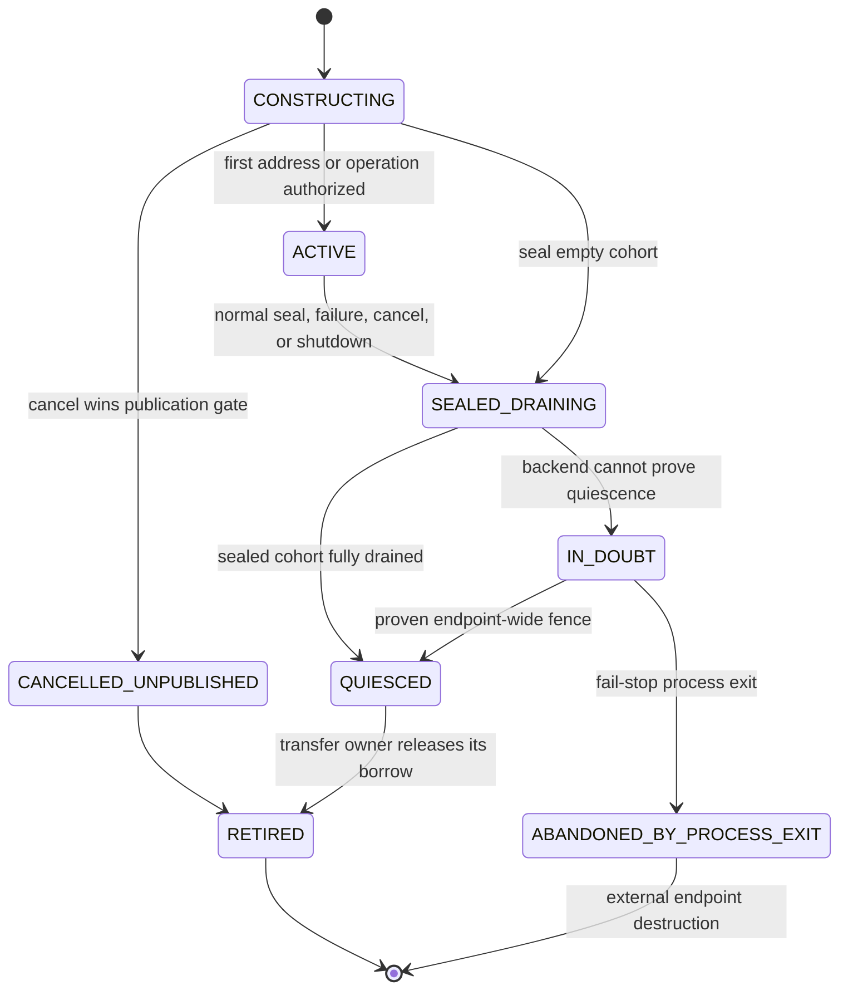

# Disaggregated Inference Transfer Lifecycle — GPT Design

| | |
|---|---|
| **Status** | Design proposal, re-baselined against `main@48df89d76` |
| **Last updated** | 2026-08-11 |
| **Urgent scope** | Python-native NIXL physical transfer ownership |
| **Later scope** | Cross-side obligations, rerouting, additional Python transports/topologies, and C++ lifecycle qualification |

## Executive Summary

The urgent correctness problem is local physical operation ownership, not the
absence of a shared CTX/GEN request state machine.

Current TensorRT-LLM already retains many requests and KV blocks while an
asynchronous transfer is active. However, request and session state can become
terminal before every physical writer is known to be terminal. Cancellation,
failure consensus, session removal, elapsed quarantine, or shutdown can
therefore get ahead of the NIXL or CUDA work that still has access to memory.

The first implementation milestone introduces one common physical-owner
abstraction, instantiated separately for each local source or destination
accessor domain. Each owner:

- serializes address publication with cancellation;
- records every authorized resource, segment, and writer;
- survives logical request and session termination;
- drains all writers after the first failure;
- supplies the physical evidence required before a transfer borrow can end or
  an allocation can be retired; and
- fails closed during shutdown when quiescence cannot be proven.

Cross-side grants and renewable obligation leases are a second layer. They are
not required to prevent premature memory reuse, so they must not block the
physical-safety MVP. They become important when the system promises bounded
peer-loss cleanup, rerouting, or explicit queue and resource accountability.
Even then, lease expiry requests cleanup; it never proves DMA quiescence.

This is a focused refactoring of current ownership paths, not a rewrite of the
Python transceiver.

## Why the Current Code Needs Refactoring

### Existing protections to preserve

Current `main` already provides useful pieces:

- `AsyncTransferManager` strongly retains CTX requests. It pins V1 blocks;
  V2 remains retained through the strong request and `kv_cache_map`/`_KVCache`
  ownership.
- `KvCacheTransceiverV2` retains request/session roots and has
  cancel-before-create tombstones.
- Generation-first waits for GEN destination allocation and receiver
  publication before CTX leaves `DISAGG_CONTEXT_WAIT_SCHEDULER`.
- Rank consensus projects distributed logical success and failure.
- Bounce transfer has per-writer accounting, duplicate suppression, and
  drain-before-scatter behavior.
- Idle iterations can progress transfers without a model batch.

These mechanisms reduce exposure, but they do not share one authoritative
physical disposition. The design should generalize them instead of recreating
them.

### Confirmed gaps

- **P0 — Publication after cancellation.** `Receiver.setup_session()` can
  consume a pre-cancel tombstone, yet the caller can continue through
  `receive()` and publish addresses. Cancellation must permanently close the
  publication gate.
- **P0 — Logical status hides local writers.** The first failed peer operation
  marks a multi-writer task `ERROR`; `has_transferring_tasks()` can then report
  false while another NIXL writer is active. Fleet consensus also selects only
  a logical outcome. Every rank must instead account for and drain its exact
  local writer cohort.
- **P0 — Results outlive logical owners.** Native registries use weak
  references, so session removal can discard a late backend completion. A
  strong operation/result owner must outlive request and session state.
- **P0 — Timed reclamation and shutdown.** Bounce quarantine and bounded joins
  can lead to reuse or deregistration without transport proof. Unresolved work
  must remain unavailable or force endpoint reset.
- **Attempt correctness — split retry identity.** `_post_with_retry()` can
  independently regenerate the CTX or GEN `disagg_request_id`. Once acceptance
  is possible, the paired identity is immutable and ambiguous retry must fail
  and drain the old attempt.
- **Liveness/accountability — incomplete terminal settlement.** The CTX status
  path can remove a cancelled session without returning that request to
  `AsyncTransferManager`, and no general attempt-scoped terminal ACK exists.
  This cannot be repaired by releasing memory before local drain.

## Relationship to NVBUG 6480621

NVBUG 6480621 is not the motivation for this architecture. PR #17223 fixes the
blocking precheck/harness ownership defect found during its investigation, and
PR #17137 changes the existing 3-CTX, concurrency-180 proxy to enable that
precheck and restore both timeouts from 600 seconds to 60 seconds. The former
leaves normal `PyExecutor` polling unchanged; the latter has only a one-YAML
unique child delta. As of 2026-08-11 both are open, and neither establishes
closure of the original 8-CTX, concurrency-1760 workload.

This document therefore makes no NVBUG 6480621 fix claim. NVBUG 6519709 is also
only evidence that request-local Python transfer failures occur at production
scale: this design makes retirement safe but does not reduce transport errors.

## Goals and Non-Goals

### Goals

- Make publication, exact writer drain, late-result ownership, and shutdown
  safe for every qualified resource.
- Keep client-visible outcome separate from transfer release and allocation
  reuse.
- Make paired retry identity and cross-side terminal facts unambiguous.
- Add later cross-side accountability without coupling memory safety to a
  coordinator or timer.
- Define a disposition vocabulary that Python and C++ qualify separately.

### Non-goals for the first safety milestone

- A mirrored scheduler state machine or router replacement.
- Cross-side leases, rerouting, or fine-grained allocation detachment.
- Fixing transport reliability.
- Qualifying C++, every Python topology, or post-token retry in the first
  safety milestone.

## Ownership Model

### Authoritative owners

| Fact or resource | Authority |
|---|---|
| Client outcome and output cursor | Frontend request supervisor |
| Paired handoff attempt identity | Frontend attempt factory |
| CTX compute state | CTX scheduler |
| GEN compute state | GEN scheduler |
| Source submission and read access | CTX send-operation owner |
| Destination authorization and publication | GEN receive-operation owner |
| Raw transport/CUDA completion evidence | Backend adapter |
| Physical disposition | Corresponding local operation owner |
| Allocation reuse | Local KV, auxiliary, or bounce allocator |
| Later queue/resource obligation | Worker-backed grant/obligation owner |

The coordinator derives a lifecycle view from these facts. It does not own GPU
memory truth.

### Physical operation identity

The source and destination use the same owner implementation but remain
independent local authorities. There is no cross-side shared owner.

For PRs 1–3, each retained owner has a process-local generation and tracks:

```text
current unique_rid
local owner generation and endpoint role
resource_id
segment_id
writer_id
```

`resource_id` identifies an independent physical accessor and reclamation
domain, not merely a semantic model field. Paged KV and recurrent/KDA ranges
coalesced into one NIXL operation may share an owner. Separate auxiliary,
bounce, producer-CUDA, or scatter accessors require independent settlement.

PR 3 adds an explicit disaggregated no-retry mode that bypasses the current
hard-coded transient-TCP retry budget and request-ID reminting; setting
`max_retries=0` alone is insufficient. Later identity hardening adds an
immutable handoff-attempt UUID, endpoint incarnation,
`transfer_session_id`, and wire-visible `operation_id` before retry, replay, or
rerouting is enabled.

The exact settlement key is:

```text
resource × segment × writer
```

For the current monolithic path, `segment_id` has one value. The model already
supports multiple segments so pipelined transfer does not require a second
ownership design.

### Artifact manifest

A handoff transfers a manifest rather than one undifferentiated KV object:

```text
ArtifactManifest
  - paged attention KV ranges
  - recurrent or KDA state
  - auxiliary metadata/buffers
  - optional draft or offloaded resources
  - zero or more ordered segments per resource
  - final manifest seal
```

Every manifest entry maps to one or more physical ownership records based on
its accessor domains. The attempt can commit only after the sealed required
set settles successfully.

## Safety Invariants

1. **Allocator authority:** only the local allocator declares memory reusable.
2. **No reuse before quiescence:** publication or submission keeps the affected
   memory unavailable until every authorized accessor settles.
3. **Cancellation closes publication and submission:** after cancel wins either
   local gate, no new address, segment, operation, or writer is authorized.
4. **Exact cohort settlement:** the first writer failure fixes the logical
   outcome but does not erase or complete sibling writers.
5. **Logical state is not physical proof:** request state, rank consensus,
   session destruction, timeout, and HTTP completion do not prove quiescence.
6. **Timers do not release memory:** timeout can request abort or endpoint
   reset; it cannot convert `IN_DOUBT` into reusable capacity.
7. **Stale work is inert:** old local owner generations cannot affect a newer
   owner. Before retry/reroute is enabled, this extends to attempt, session,
   endpoint-incarnation, operation, and segment identity on the wire.
8. **Exactly-once transfer release:** each transfer borrow is released once
   after an accessor-quiesced disposition. Allocation reuse additionally
   requires every non-transfer owner, such as decode, to release the resource.

## Physical Transfer Lifecycle

Logical outcome and physical state are orthogonal. A request may fail promptly
while cleanup continues.



### Publication and submission gates

The GEN receive owner serializes destination publication with cancellation.
The CTX send owner separately serializes source submission with cancellation
and owns source-side gather/network access. Before publication/submission,
cancellation can roll back local construction. Afterwards it closes future
authorization and drains every already-created accessor.

Normal completion also requires an explicit manifest seal and submission
fence. `QUIESCED` means both that no later resource, segment, or writer can be
authorized and that every member of the sealed cohort is terminal. Merely
settling all currently known writers is insufficient.

For the PR 1–3 monolithic protocol-v0 cohort, no new wire message is required:
the receive owner derives and seals the complete expected writer set from
validated peer/rank-overlap metadata before publishing any address
(`segment_id=0`), and the send owner fences submission after its fixed operation
set is enqueued. If both sides cannot derive the same immutable cohort, PR 2
must add an explicit wire seal and publication remains closed until it arrives.

Cancel-before-create tombstones are consumed by the receive owner; consuming a
tombstone cannot be followed by `ACTIVE` publication.

### Exact writer settlement

The first failed writer may report the request-visible failure immediately.
The operation owner nevertheless remains live until every sibling writer is in
one of these physical dispositions:

| Disposition | Transfer borrow releasable? | Meaning |
|---|---:|---|
| `QUIESCED_SUCCESS` | Yes | Writer completed and can no longer access memory |
| `QUIESCED_FAILED` | Yes | Writer failed, with backend evidence that access ended |
| `QUIESCED_CANCELLED` | Yes | Cancellation stopped or drained the writer |
| `IN_DOUBT` | No | Future or outstanding access cannot be excluded |

Late and duplicate backend results settle the retained operation owner, not a
possibly removed request/session lookup. Conflicting terminal evidence fails
the owner closed.

### Transfer release and allocation retirement

For the initial implementation, retaining the whole request and its current KV
mapping is acceptable. An accessor-quiesced disposition releases the transfer
borrow; it does not by itself free the allocation. On receive success, the
destination passes to decode ownership. On failure or request retirement, the
executor may call `free_resources()` only after the logical resource owner no
longer needs the allocation and the physical transfer owner permits release.
This reuses the existing coarse `AsyncTransferManager` containment and avoids
prematurely redesigning every KV allocator.

A later allocation-generation lease permits logical request cleanup to detach
while only the affected allocation remains pending-free. That improves bounded
reclamation, rerouting, and ABA protection; it is not required to establish the
initial safety invariant.

### Shutdown

Shutdown closes admission and publication, requests drain, and returns one of:

- `DRAINED`: all exact writers and local CUDA work are quiescent;
- `IN_DOUBT`: at least one accessor cannot be excluded.

`IN_DOUBT` vetoes allocation reuse and memory deregistration. Recovery requires
a backend-qualified endpoint fence. The PR 3 canary instead uses fail-stop
containment: stop admission, report the request/worker failure, retain all
in-process registrations, and terminate the worker. Process exit abandons the
old in-process owner and allocation; endpoint destruction provides the external
containment boundary, not a normal `IN_DOUBT`-to-`QUIESCED` transition. The
orchestrator may replace the worker only after the old process exits and the
endpoint incarnation changes. Partial in-process capacity recovery is deferred
until the backend can prove a stronger fence.

## Attempt Integrity and Cross-Side Termination

### Retry rules

Once either worker may have accepted a paired handoff:

- the attempt ID is immutable;
- neither CTX nor GEN can independently mint a replacement ID;
- retry is allowed with the same ID only for a proven pre-connect failure; and
- an ambiguous post-connect retry fails and drains the old attempt.

Creating a replacement attempt is later behavior. It requires both old
endpoints to be fenced/quiesced, or separately qualified immutable-source
concurrent-read semantics. These rules apply to both scheduling workflows.

### Terminal facts

Cross-side terminal messages are idempotent and attempt-scoped:

```text
ABORT_REQUESTED
TRANSFER_RESULT
HANDOFF_COMMITTED
TERMINAL_ACK
```

Missing acknowledgement retains a bounded tombstone/replay record. It does not
retain memory once the local physical owner independently proves quiescence,
and it does not release memory while that owner is `IN_DOUBT`.

### Progress and timer semantics

Transfer progress, cancellation, timeout detection, and retirement must run
even when the scheduler produces no model batch.

One `kv_transfer_timeout_ms` currently covers different phases on CTX and GEN.
Diagnostics should record at least:

```text
frontend routing and queue
worker queue
GEN allocation and receiver setup
CTX prefill
peer rendezvous
operation submission
first backend progress, when observable
physical completion
```

A phase deadline can produce a logical error or abort intent. Only the physical
owner can produce an accessor-quiesced disposition.

## Context-First and Generation-First Workflows

### Context-first

Context-first currently computes before a GEN worker has made a worker-backed
commitment. The physical-safety layer works without changing that policy.

```mermaid
sequenceDiagram
    participant F as Frontend
    participant C as CTX
    participant S as CTX send owner
    participant R as GEN receive owner
    participant G as GEN

    F->>C: Prefill immutable attempt
    C->>C: Build artifact manifest
    F->>G: Dispatch same immutable attempt
    G->>R: Allocate and open destination publication gate
    R-->>S: Receiver-ready information
    C->>S: Authorize source accessors
    S->>R: Transfer sealed manifest
    S->>S: Fence submission and drain source cohort
    R->>R: Close publication, drain, and validate receive cohort
    R-->>G: Transfer access quiesced
    G->>G: HANDOFF_COMMITTED; destination becomes decode-owned
    G-->>F: Decode response
```

A later worker-backed GEN grant can avoid wasted prefill and bound how long CTX
retains an artifact, but it is not the memory-safety proof.

### Generation-first

Generation-first already has a receiver-ready data-plane handshake. GEN
allocates destination resources and publishes receive information before CTX
leaves its scheduler wait state.

```mermaid
sequenceDiagram
    participant F as Frontend
    participant G as GEN
    participant R as GEN receive owner
    participant S as CTX send owner
    participant C as CTX

    F->>G: Dispatch immutable attempt
    F->>C: Dispatch same immutable attempt
    G->>R: Allocate destination and open publication gate
    R-->>C: Existing receiver-ready information
    C->>C: Begin prefill after readiness
    C->>S: Produce and authorize manifest segments
    S->>R: Transfer segments and final seal
    S->>S: Fence submission and drain source cohort
    R->>R: Close publication, drain, and validate receive cohort
    R-->>G: Transfer access quiesced
    G->>G: HANDOFF_COMMITTED; destination becomes decode-owned
    G-->>F: Decode response
```

The later lifecycle protocol should extend this handshake with attempt scope,
explicit reject/revoke, expiry, and acknowledgement. It should not add a
parallel readiness protocol.

## Cross-Side Obligations — Phase 2

Cross-side coordination is layered on top of physical ownership when the
service needs stronger liveness guarantees.

### Worker-backed GEN grant

A router selection is only placement and load accounting. A hard grant must be
issued by, or backed by, the GEN worker and state exactly what it promises:

- scheduler/request ownership;
- destination KV allocation and receiver readiness; and/or
- transport concurrency capacity, if such a capacity contract exists.

Generation-first can formalize its existing receiver-ready commitment.
Context-first requires a new worker-backed commitment if it wants to avoid
prefill without a consumer.

### Artifact obligation lease

After an artifact or manifest segment exists, a renewable obligation records
that GEN still needs CTX to retain it. Expiry lets CTX stop accepting new work
for that consumer and begin abort/fence processing.

The lease provides bounded peer-loss cleanup and resource accountability. Its
expiry never releases an allocation or substitutes for exact writer drain.

### Later capabilities

Once grants, obligations, attempt identity, and allocator-generation leases are
all available, the architecture may support safe rerouting of immutable
artifacts. Rerouting is deliberately outside the first safety milestone.

## Runtime and Integration Scope

### Initial supported cohort

The first canaryable safety milestone is deliberately narrower than the final
production topology. The owner implementation and component tests support
multiple writers, but the initial runtime qualification does not claim DSv4
attention-DP/EP64 coverage.

| Dimension | Initial scope |
|---|---|
| Runtime | Python-native transceiver |
| Transport | Direct NIXL |
| Transfer shape | Monolithic protocol v0; expected writer set sealed from setup metadata; exact cohort component-tested |
| Resources | Paged attention KV only |
| Scheduling | Context-first only |
| Topology | One CTX worker and one GEN worker; TP1, PP1, CP1, attention-DP off |
| Allocator strategy | Coarse request/mapping retention |
| Required gates | Explicit Python runtime and matching protocol/config on both peers; new disagg no-retry mode bypasses transient-TCP retry and ID reminting; bounce, pipeline, separate auxiliary/recurrent/draft/offload, generation-first, PP, and attention-DP rejected |
| Default rollout | Private, startup-validated opt-in |

### Qualification after the initial canary

- PR 4 qualifies direct multi-writer fan-in by adapting
  the existing `disagg_config_ctxtp2_gentp1.yaml` shape: one CTX TP2 worker,
  a pool of two TP1 GEN instances, context-first, explicit Python/direct NIXL,
  and bounce off. Each attempt targets one GEN instance and has an exact
  two-writer CTX cohort. Fault injection holds one CTX writer while the sibling
  fails. Until this passes, PR 3 is only a single-writer canary skeleton.
- PR 5 makes existing Python bounce adopt the common owner and removes
  timer-only reuse.
- Generation-first adds separate auxiliary ownership in PR 6.
- Recurrent/KDA, draft, offloaded, and auxiliary resources add ownership
  records according to their independent accessor domains.
- PP and attention-DP qualify the same `resource × segment × writer` contract.
- Bounce-v2 or other transports implement a backend quiescence adapter rather
  than duplicating lifecycle state.
- Pipelined transfer acquires ownership before waiting on each producer CUDA
  event, treats that event as an accessor, uses an immutable segment ID and
  final seal, and then submits the NIXL segment. Receiver slice `0` plus
  `is_last_slice` is not sufficient for late/duplicate settlement.

Landing order with PR #15727 is not a correctness dependency. If #15727 lands
first, build the owner stack on the current pipeline code; if the owner stack
lands first, rebase #15727 onto its segment contract. In either order,
pipelining stays outside the qualified cohort until its ownership adapter
passes.

### Python and C++

The disposition vocabulary can be common, but qualification is runtime- and
backend-specific.

Python currently supports the native NIXL path and is increasingly selected by
model-specific `transceiver_runtime="auto"` resolution. C++ remains required
for configurations and transports that Python does not cover. C++ lifecycle
support must therefore be a separate effort that proves its own submission
fence, exact completion, deregistration, and shutdown semantics.

Configuring `auto` does not prove that both endpoints selected Python. Effective
runtime and capabilities must be checked after model/backend resolution. Until
capability negotiation lands in PR 9, every enabled cohort explicitly sets
`transceiver_runtime=PYTHON` on both endpoints and requires matching build,
protocol, and topology configuration before address publication.

## Validation and Acceptance Criteria

### PR 1–3 evidence

- cancellation before and during publication;
- cancellation tombstone consumed before `receive()`;
- rank A fails one writer while another remains blocked and rank B completes;
  fleet error may emit once, but rank A retains its transfer borrow;
- duplicate, contradictory, and late results;
- logical session removal before backend completion;
- stale local owner-generation results;
- shutdown with active direct NIXL work;
- no paged-KV release before the exact cohort drains;
- `IN_DOUBT` stops admission and terminates the worker without in-process
  deregistration or reuse;
- healthy direct NIXL has no additional network round trip, copy, or CUDA
  synchronization;
- flag-off behavior remains unchanged; and
- the PR 3 single-writer canary passes with retry disabled.

Multi-writer component tests are mandatory in PR 3, but runtime multi-writer
qualification starts with the direct TP2-to-TP1 adapter in PR 4.

### Later attempt and adapter evidence

- remote GEN cancellation reaches CTX retirement and terminal acknowledgement;
- stale attempt, session, endpoint-incarnation, operation, and segment results
  are inert after the corresponding wire identities land;
- shutdown with active bounce, scatter, or producer-CUDA access does not reuse
  memory early;
- paired CTX/GEN retry behavior is qualified in both scheduling modes after
  immutable paired attempts land;
- progress and cleanup continue through zero-model-batch iterations; and
- each recurrent/KDA, auxiliary, pipeline, PP, attention-DP, and other
  topology adapter passes the ownership conformance suite before enablement.

## Landing Plan

Build each slice from current `main`, keep each PR at or below roughly 1,500
changed lines, and attach focused tests to the behavior it introduces.

| PR | Scope | Result |
|---:|---|---|
| 1 | Add compact local operation owner, backend-evidence adapter seam, protocol-v0 cohort seal, structured dispositions, and exact cohort tests | Disabled ownership core |
| 2 | Wire separate CTX-send and GEN-receive owners into direct NIXL; serialize cancel; retain late results | Direct accessor safety |
| 3 | Gate context-first executor retirement/shutdown on disposition; propagate cancel; add explicit disagg no-retry mode, fail-stop `IN_DOUBT`, and multi-writer component evidence | **First single-writer canary skeleton** |
| 4 | Qualify direct TP2-to-TP1 multi-writer fan-in and fault-injected sibling drain | Multi-writer runtime safety |
| 5 | Move Python bounce accessors onto the owner and remove timer-only reuse | Bounce retirement safety |
| 6 | Add and qualify the separate generation-first auxiliary accessor adapter | Generation-first ownership coverage |
| 7 | Add immutable paired attempt identity, suppress ambiguous retry, and cancel sibling work; extract the narrow #16402 behavior | Attempt-safe serving edge |
| 8 | Add idempotent terminal replay/ACK, preserve a stable no-batch progress hook, and attach phase diagnostics | Cross-side terminal convergence |
| 9 | Add endpoint/session/operation incarnation and capability negotiation | Stale wire-work fencing |

The urgent Python chain contains nine PRs total: PRs 1–3 are the minimum viable
local-safety core, and PRs 4–9 are six follow-ons. The MVP startup validator
requires the explicit no-retry mode and rejects every deferred scheduling,
resource, topology, and bounce combination. PRs 4–5 then close the known
multi-writer and bounce P0s before less urgent protocol expansion. PR 6 can
extend physical ownership to generation-first while retry remains disabled.
PR 7 can land in parallel if its serving diff remains independent, but it is
required before end-to-end lifecycle correctness is claimed.

The nine-PR table does not include cross-side obligation leases,
allocation-generation leases, or C++ transceiver lifecycle support. Those are
separate future programs: allocation leases are a retirement optimization;
cross-side grants and obligations form Phase 2; and C++ needs its own
backend-qualified chain. Recurrent or KDA, pipeline, PP, attention-DP,
bounce-v2, and other resource/topology adapters likewise remain independently
reviewable qualification follow-ups.

Rollout begins disabled, then canaries only the PR 3 context-first cohort with
retry off. Monitor live/oldest owners, writers outstanding, late results,
`IN_DOUBT`, and shutdown outcome. Expand one adapter at a time through the same
conformance suite. Cross-side policy and C++ qualification remain separately
reversible from physical ownership.

## Open Questions

1. What NIXL result or endpoint reset is strong enough to prove a failed writer
   can no longer access registered memory?
2. Which current recurrent, auxiliary, draft, and offloaded resources need
   independent manifest entries versus one co-transferred operation?
3. How should ADP elect the leader that emits one request-visible outcome while
   every rank retains its local physical owner?
4. Which endpoint-incarnation source works across MPI, Ray, and torch process
   group discovery?
5. Which #17245/#17324 progress policy will land, and what autonomous progress
   hook remains stable for ownership cleanup?
6. What exact capability does a future GEN grant promise: scheduler ownership,
   destination allocation, transport capacity, or a negotiated combination?

## Appendix: Active PR Snapshot (2026-08-11)

This implementation snapshot is dated and is not part of the safety contract.
The code audit baseline is [`main@48df89d76`](https://github.com/NVIDIA/TensorRT-LLM/commit/48df89d76d44aeb598bc7bf6f58ba445fb50cb76).

| PR | Relationship to this design |
|---|---|
| [#16396](https://github.com/NVIDIA/TensorRT-LLM/pull/16396), [#16909](https://github.com/NVIDIA/TensorRT-LLM/pull/16909) | Historical prototypes; mine focused invariants/tests, never use as branch bases |
| [#17223](https://github.com/NVIDIA/TensorRT-LLM/pull/17223), [#17137](https://github.com/NVIDIA/TensorRT-LLM/pull/17137) | Precheck/harness ownership fix found during the NVBUG 6480621 investigation, plus a reduced 60-second proxy; neither closes the original workload |
| [#16402](https://github.com/NVIDIA/TensorRT-LLM/pull/16402) | Extract paired retry/deadline and sibling-cancellation behavior; do not stack wholesale |
| [#16834](https://github.com/NVIDIA/TensorRT-LLM/pull/16834), [#17482](https://github.com/NVIDIA/TensorRT-LLM/pull/17482) | Preserve ADP-safe request-local error delivery; logical failure is not physical drain |
| [#15727](https://github.com/NVIDIA/TensorRT-LLM/pull/15727) | Rebase onto the segment-owner contract or remain disabled pending its adapter |
| [#15780](https://github.com/NVIDIA/TensorRT-LLM/pull/15780) | Expose bounce-v2 ACK/completion through a backend quiescence adapter |
| [#17245](https://github.com/NVIDIA/TensorRT-LLM/pull/17245), [#17324](https://github.com/NVIDIA/TensorRT-LLM/pull/17324) | Admission/progress policy is unsettled; physical safety is independent of the outcome |
| [#16645](https://github.com/NVIDIA/TensorRT-LLM/pull/16645) | Reuse or explicitly supersede its PP endpoint/session substrate |
