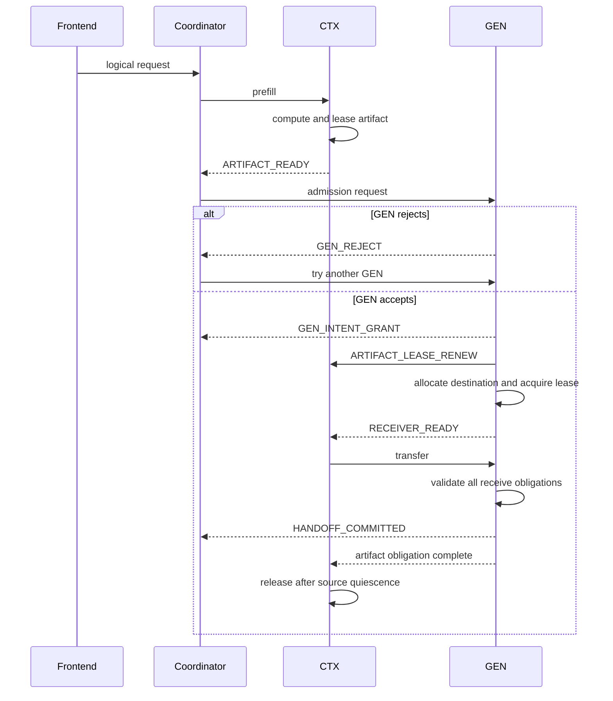
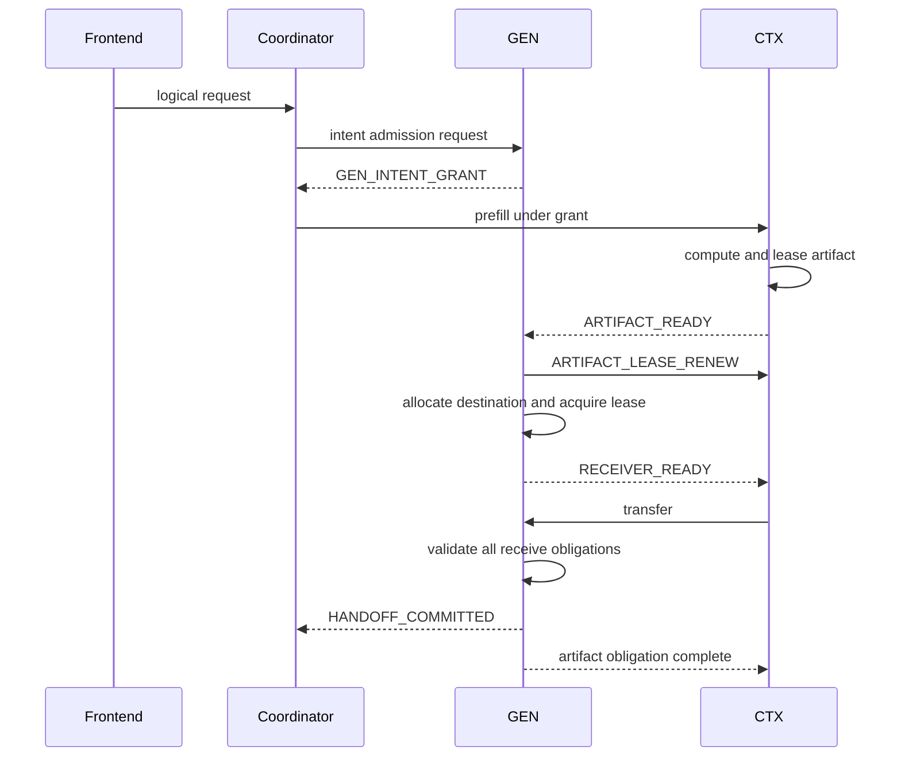

# Disaggregated Inference Request Lifecycle — GPT Design

| | |
|---|---|
| **Status** | Design proposal |
| **Created** | 2026-07-25 |
| **Scope** | TensorRT-LLM disaggregated prefill/decode serving |
| **Transceivers** | Python and C++ |
| **Related incidents** | NVBUG 6480621; NVBUG 6519709 |
| **Containment prototype** | [PR #16396](https://github.com/NVIDIA/TensorRT-LLM/pull/16396) |
| **End-to-end prototype** | [PR #16909](https://github.com/NVIDIA/TensorRT-LLM/pull/16909) |

## Executive Summary

TensorRT-LLM does not need a shared distributed request state machine between
context (CTX) and generation (GEN) workers. It does need explicit coordination
of the obligations that cross the CTX/GEN boundary:

- CTX must know whether a live GEN consumer still needs a prefetched KV artifact.
- GEN must explicitly accept, queue, reject, or revoke responsibility for a
  request.
- Both endpoints must know when address publication and transfer submission are
  closed.
- Each endpoint must retain its local allocations until its own transport and
  CUDA accessors are proven quiescent.

The design therefore coordinates obligations rather than scheduler states.
The coordinator chooses placement and derives lifecycle progress, but owns no
GPU-resource truth. CTX owns immutable prefill artifacts, GEN owns destination
grants and receive commit, each transceiver owns its local operation state, and
each KV allocator is the sole authority for memory reuse.

Three mechanisms must remain distinct:

1. A renewable cross-side obligation lease bounds how long one endpoint must
   retain an artifact for a peer.
2. A local allocation lease prevents a specific allocation generation from
   being reused while an accessor can still touch it.
3. A transfer fence proves that future submission is impossible and previously
   submitted work is quiescent.

An obligation lease expiry may abort or reroute a handoff, but it never
authorizes memory reuse by itself.

## Motivation

NVBUG 6480621 reports many CTX-side KV transfer timeouts in an 8P1D deployment
while the GEN KV cache was nearly empty and no transport, OOM, or NCCL error was
reported. Increasing the timeout from 60 seconds to 600 seconds reduces the
symptom.

One plausible causal chain is:

1. GEN admission or queueing delays when transfer work becomes runnable.
2. GEN-side flow control limits work entering its transfer queue.
3. CTX continues aging the request under a timer that includes queueing,
   rendezvous, and physical transfer.
4. CTX times out before GEN begins or completes the transfer.
5. The two sides then observe different logical outcomes and retain different
   resource obligations.

This is a hypothesis, not yet a proven root cause. Phase 0 instrumentation must
separate queueing, rendezvous, address publication, transfer submission, first
progress, and physical completion before the design is credited with fixing the
incident.

The broader architectural defect is independent of the exact incident root
cause: admission, timeout, cancellation, and retry decisions on one side affect
resources owned by the other side, but the obligations are not represented by
an explicit protocol.

## Goals

- Make GEN queue ownership and admission decisions explicit.
- Prevent queueing delay from being misclassified as active transfer time.
- Bound abandoned cross-side obligations without requiring the coordinator to
  remain alive.
- Separate request-visible logical outcomes from physical resource retirement.
- Prevent use-after-free, stale writes, and allocation ABA after cancellation,
  timeout, retry, or peer loss.
- Permit rerouting to a new GEN without recomputing an immutable CTX artifact
  when safe.
- Support both the Python and C++ transceivers through one semantic lifecycle
  contract.
- Preserve backend-specific data paths and optimizations.

## Non-Goals

- Replicating local CTX and GEN scheduler enums.
- Running distributed consensus on every request transition.
- Making the coordinator the owner of endpoint-local GPU allocations.
- Treating elapsed time as evidence that DMA is quiescent.
- Exactly-once client-visible output after frontend failure.
- Transparent post-token retry without preserving output position, sampling
  state, and decoder state.
- Requiring Python and C++ transceivers to share one implementation or wire
  protocol.
- Guaranteeing in-process reclamation when a backend cannot fence future
  submission or prove quiescence.

## Design Principles

### Coordinate obligations, not mirrored states

CTX and GEN retain their local scheduler state machines. The cross-side
protocol represents only facts that create or discharge a peer obligation:
admission, artifact readiness, receiver readiness, lease renewal, commit,
abort, submission fencing, and quiescence.

### One authoritative writer per fact

Every protocol fact has one authority. Other components consume facts and
derive views; they do not mutate another component's state.

### Logical completion and physical retirement are independent

A client request may fail or be cancelled immediately. The allocation backing
the request remains unavailable for reuse until every possible accessor is
quiescent.

### Time bounds control responsibility, not memory safety

Timers may reject admission, revoke a grant, request abort, trigger diagnostics,
or eject a worker. They do not prove that a one-sided write or local CUDA
operation has stopped.

### Admission has a soft and a hard layer

Predictive admission avoids waste and overload oscillation. A hard GEN grant
establishes responsibility before address publication. Prediction is an
optimization; the hard grant is part of the correctness protocol.

### Prefer fail-closed uncertainty

If the implementation cannot prove that memory is safe to reuse, it reports
`IN_DOUBT`, removes the affected capacity from service, and escalates endpoint
health. It never converts uncertainty into timed reuse.

## Safety and Liveness Invariants

### I1 — Allocator authority

Only the local allocator can declare an allocation generation reusable.

### I2 — No reuse before quiescence

An allocation generation cannot be reused while any published or submitted
network/CUDA accessor may still touch it.

### I3 — Publication is a one-way safety boundary

Before publication, construction failure can roll back local resources.
After publication becomes possible, release requires a terminal no-access
proof, a submission fence plus quiescence, or a stronger endpoint-wide fence.

### I4 — Logical outcomes are monotone

The frontend request supervisor records at most one client-visible terminal
outcome. Resource cleanup can continue after that outcome.

### I5 — Stale attempts are inert

Messages from an old handoff attempt, endpoint incarnation, transfer session,
or allocation generation cannot create a receiver, renew an obligation, commit
data, or release memory belonging to a newer attempt.

### I6 — Bounded logical cleanup

A client, CTX, GEN, or coordinator loss reaches a bounded logical outcome and
stops creating new obligations.

### I7 — Conditional bounded physical cleanup

Physical reclamation is bounded when the backend supports the required
submission fence and quiescence evidence. Otherwise the system must reach a
bounded `IN_DOUBT`/quarantine decision and automatically replace or reset the
affected endpoint. The design does not promise unsafe in-process reclamation.

### I8 — One queue owner

A request is either retained by the router for retry or admitted into a GEN
queue. It is never silently queued in both places.

## State and Ownership Domains

| Domain | Authoritative owner | State |
|---|---|---|
| Client session and output | Frontend request supervisor | Deadline, output cursor, terminal response |
| Attempt plan | Coordinator | Selected CTX, selected GEN, immutable attempt identity |
| Prefill artifact | CTX artifact manager | Artifact readiness, retention obligation, local source leases |
| GEN admission | GEN scheduler/admission controller | Intent grant, queue position, revocation |
| Destination allocation and commit | GEN receiver leader | Receiver readiness, receive validation, handoff commit |
| Source transfer operation | CTX transceiver | Publication, gather, network operation, source quiescence |
| Destination transfer operation | GEN transceiver | Authorized writers, receive/scatter, destination quiescence |
| Memory reuse | Local KV/bounce allocator | Allocation generation, pending-free, active allocation leases |

The coordinator's lifecycle view is a derived projection of these facts. It is
not an authoritative shared state machine.

## Identity Model

The protocol separates logical work, reusable artifacts, placement attempts,
transport sessions, and physical allocations:

| Identity | Meaning |
|---|---|
| `logical_request_id` | One client-visible request |
| `prefill_artifact_id` | Immutable KV result that may outlive one placement attempt |
| `artifact_version` | Version or segment set of the prefill artifact |
| `handoff_attempt_uuid` | Globally unique attempt to bind one artifact to one GEN |
| `consumer_grant_id` | GEN-issued admission/capacity responsibility |
| `transfer_session_id` | One source/destination transport relationship |
| `endpoint_incarnation` | One worker/process lifetime |
| `allocation_generation` | One allocator-issued incarnation of a KV or bounce allocation |
| `operation_id` | One exact gather, network, scatter, or writer operation |

An incrementing attempt counter owned only by a rebuildable coordinator is not
sufficient. Attempt UUIDs remain unique across coordinator restart. Endpoint
incarnations and allocation generations fence delayed work at the resource
owner.

A coordinator epoch is optional. It is valid only when backed by a real durable
leader lease or consensus service. It must not be used to imply ordering that
the deployment cannot guarantee.

## Lease and Fence Model

### Artifact obligation lease

`ArtifactObligationLease` is a renewable cross-side control-plane lease:

- CTX issues it for a specific artifact and GEN consumer grant.
- GEN starts renewing it as soon as the artifact is bound to a request already
  owned by the GEN scheduler, not when the request is selected for execution.
- In generation-first flow, the separate GEN intent-grant keepalive covers the
  prefill interval before an artifact obligation can exist.
- Renewal remains active while GEN is queued, preparing a receiver, or
  transferring.
- GEN stops renewing after commit, explicit abort/revocation, or request
  termination.
- Expiry lets CTX mark the consumer obligation abandoned and start fencing.

Expiry does not release an allocation lease or prove that a previously
authorized operation is quiescent.

### GEN intent grant

`GenerationIntentGrant` records that GEN has accepted queue and capacity
responsibility:

- It reserves admission/accounting credit and has a GEN-owned TTL.
- It need not reserve the full destination KV allocation throughout a long
  prefill.
- GEN may revoke it explicitly under preemption or capacity pressure.
- Revocation creates an abort intent and permits rerouting after the old
  transfer session is fenced.

Destination KV should normally be allocated just in time when both the artifact
and receiver path are ready.

### Allocation lease

`AllocationLease` is a node-local, allocator-enforced lifetime token:

- It is tied to an `allocation_generation`.
- It carries immutable address/range descriptors.
- `free_resources()` marks a leased allocation pending-free rather than
  returning it to the free pool.
- It is released exactly once after the accessor it protects is quiescent.
- It has no time-based release rule.

The common KV-manager primitive should resemble:

```text
snapshot_and_lease(request, slice_spec)
    -> AllocationLease(allocation_generation, immutable_ranges)
```

Source and destination allocations each require their own lease.

### Submission fence

A submission fence proves that a peer can no longer launch a new operation
against an advertised address or handle. It is distinct from quiescence:

1. Fence future submission.
2. Drain operations submitted before the fence.
3. Release allocation leases.

If the backend cannot provide an adequate fence, the affected registration and
allocation remain `IN_DOUBT` until an endpoint-level reset establishes a
stronger boundary.

## Protocol Facts and Messages

Every message carries the applicable request, artifact, attempt, grant,
session, endpoint-incarnation, and protocol-version fields.

| Message | Authority | Meaning |
|---|---|---|
| `GEN_INTENT_GRANT` | GEN | GEN owns the queue/capacity obligation |
| `GEN_REJECT` | GEN | GEN created no obligation |
| `GEN_GRANT_REVOKED` | GEN | Stop work and release/reroute after fencing |
| `ARTIFACT_READY` | CTX | Immutable prefill artifact is available |
| `ARTIFACT_LEASE_RENEW` | GEN | GEN still needs the artifact |
| `RECEIVER_READY` | GEN | Destination allocation and publication gate exist |
| `TRANSFER_RESULT` | Local transceiver | Exact operation result and quiescence evidence |
| `HANDOFF_COMMITTED` | GEN receiver leader | All required shards and metadata are valid |
| `ABORT_REQUESTED` | Any request participant | Stop new work; logical intent only |
| `SUBMISSION_FENCED` | Transceiver/peer | No later operation can be submitted |
| `PHYSICALLY_QUIESCED` | Local transceiver | Local resources are safe to retire |
| `ARTIFACT_RELEASED` | CTX | CTX artifact and its local leases retired |
| `GEN_GRANT_RELEASED` | GEN | GEN admission/destination obligation retired |

Messages are idempotent. Duplicate messages repeat the same fact. Conflicting
messages fail the affected attempt closed.

`HANDOFF_COMMITTED` is emitted by GEN only after all required TP/PP/ADP
participants and auxiliary metadata have been validated. A transport completion
alone cannot commit the handoff.

## Context-First Flow



CTX does not publish source information to an unknown or unadmitted GEN. If no
GEN accepts before the admission deadline, the frontend fails the request and
CTX retires the artifact through its local safety path.

## Generation-First Flow



Generation-first reduces the interval in which CTX has no known GEN consumer,
but it does not eliminate orphaned GEN state. A CTX or client failure after the
intent grant can still leave GEN holding admission credit or destination
resources. The grant TTL and explicit abort path bound that obligation.

## Queue Ownership and Renewal

The protocol uses two admission outcomes:

- `GEN_REJECT`: GEN stores no request and owns no obligation. The router may
  retry another GEN.
- `GEN_INTENT_GRANT`: GEN owns the request, whether it is immediately runnable
  or queued. It starts artifact lease renewal as soon as the artifact exists.

A noncommittal `GEN_QUEUED` state is avoided. If the router retains the request
for retry, GEN must reject it. If GEN queues it, GEN must accept the obligation.

Renewal must not depend on the request reaching model execution. Under overload,
the waiting interval can exceed the old transfer timeout. Scheduler insertion is
the first point at which GEN can reliably own the renewal responsibility.

## Timer Model

| Timer | Owner | Begins | Expiry action |
|---|---|---|---|
| Client deadline | Frontend | Request arrival | Record logical failure; fan out abort |
| Admission/rendezvous deadline | Coordinator | Placement begins | Reject, reroute, or fail |
| GEN grant TTL | GEN | Grant issuance | Revoke grant; emit abort intent |
| Artifact obligation TTL | CTX | GEN assumes artifact obligation | Stop serving the consumer; begin fence/abort |
| Transfer no-progress timer | Local transceiver | Operation submission | Diagnose/cancel; transition to quiescing or `IN_DOUBT` |
| Quiescence watchdog | Endpoint health owner | Abort/fence begins | Quarantine and automatically replace/reset endpoint |

No timer releases allocation leases.

The active-transfer timer begins only after:

```text
ARTIFACT_READY
and RECEIVER_READY
and operation submitted
```

It does not include prefill computation, GEN admission, queueing, or receiver
allocation.

## Cancellation

Any participant may create `ABORT_REQUESTED`. The frontend records the
client-visible terminal outcome immediately when required; it does not wait for
physical cleanup.

Each endpoint then:

1. Closes new local admission and publication for the attempt.
2. Records a generation-safe tombstone.
3. Sends a peer abort notification when a peer relationship exists.
4. Fences future submission.
5. Drains submitted network and CUDA work.
6. Releases allocation leases.
7. Emits `PHYSICALLY_QUIESCED`.

Abort notification is an accelerator. Obligation expiry covers loss windows in
which no peer relationship exists or the coordinator cannot fan out.

An abort/commit race is serialized by the GEN receive-commit gate:

- If required receive validation committed first, the handoff remains committed.
  A later client cancellation terminates decode but does not rewrite history.
- If abort closed the gate first, GEN cannot commit the handoff.

## Retry and Rerouting

An immutable prefill artifact may be reused across destination attempts:

```text
prefill_artifact_id = stable
handoff_attempt_uuid = new
consumer_grant_id = new
transfer_session_id = new
destination allocation generation = new
```

The old attempt's obligation lease is not reused. Before rebinding:

- the old destination session must be fenced and quiesced; or
- the source must explicitly support concurrent immutable readers with
  independent operation and allocation leases.

Late results and renewals from the old attempt are rejected by attempt, endpoint,
session, and allocation-generation validation.

Retry after output has become visible is a separate recovery problem. It
requires an output cursor plus deterministic or checkpointed sampling and
decoder state. This design does not claim transparent post-token retry.

## Coordinator Failure and Restart

The coordinator owns soft placement state, not GPU resource state.

On restart, a coordinator may query workers to rebuild a scheduling shadow:

- live artifacts;
- live GEN grants;
- transfer sessions;
- committed handoffs;
- outstanding cleanup.

This cannot reconstruct whether tokens or a terminal response were already
delivered to the client. Unless the system adds a durable output/idempotency
journal, loss of the live frontend/request supervisor fails the client
connection. Endpoint leases and local owners clean up independently.

A new coordinator does not blindly abort every prior coordinator epoch. It
operates on immutable attempt identities and endpoint-reported facts. Stale
control messages are fenced by attempt and endpoint incarnation. A deployment
with a real durable leadership service may additionally use a leader epoch.

## Admission Control

### Predictive router admission

The router should estimate CTX and GEN load at the expected prefill-completion
time. This reduces wasted prefill and the anti-phase load oscillation described
by Mooncake's early-rejection work.

This layer is soft:

- stale predictions can cause suboptimal placement;
- prediction failure does not violate memory safety;
- the hard GEN grant remains required.

### Hard GEN admission

GEN explicitly accepts or rejects responsibility. The initial intent grant
should account for:

- scheduler/request slots;
- expected destination KV demand;
- transfer/receiver credit;
- topology and auxiliary-buffer support;
- deadline feasibility.

Full physical destination allocation can be deferred until receiver readiness,
reducing the cost of long generation-first prefill.

## Backend-Neutral Transceiver Contract

The current transceiver APIs overload booleans. For example, one implementation
may return `true` when cancellation was accepted while another returns `true`
only when resources are safe to free. The common lifecycle API must separate
logical acceptance from physical disposition.

```text
LogicalDisposition:
    ACCEPTED
    ALREADY_TERMINAL
    NOT_FOUND
    REJECTED

PhysicalDisposition:
    NOT_EXPOSED
    ACTIVE
    QUIESCING
    QUIESCED_SUCCESS
    QUIESCED_FAILURE
    IN_DOUBT

CancelResult:
    logical
    physical
    retryable
    reason

ShutdownResult:
    physical
    in_doubt_context_count
    fatal
    reason
```

The adapter surface should include:

```text
capabilities()
begin_session(identity, resource_borrows)
authorize_publication(session, operation)
record_publication(session, operation)
cancel_session(session, reason) -> CancelResult
poll_session(session) -> PhysicalDisposition
fence_submission(session)
quiesce(session)
shutdown(deadline) -> ShutdownResult
```

`resource_borrows` are allocator-issued source/destination/bounce leases. The
transceiver may access memory only through those borrows.

### Capability negotiation

Capabilities are negotiated before address publication:

- attempt and endpoint-incarnation identity;
- allocation-generation leases;
- cancel-before-create tombstones;
- publication gate;
- in-flight cancellation;
- exact writer/operation tracking;
- submission fence;
- per-operation quiescence;
- endpoint-wide quiescence;
- direct and bounce transfer;
- multi-writer/fan-in;
- generation-first;
- PP/TP/ADP topology support;
- terminal-result acknowledgement and replay.

If a required capability is absent, the session is rejected or uses an
explicitly qualified legacy mode before addresses are exchanged. There is no
silent safety downgrade after publication.

## Python and C++ Transceiver Support

The lifecycle contract is common; ownership implementations remain
runtime-specific.

### Python transceiver

The Python adapter can build on PR #16396:

- registry-owned receive contexts;
- exact writer and publication tracking;
- separate logical and physical state;
- strong source/destination request ownership;
- sender operation contexts;
- bounce-slot settlement;
- cancellation tombstones;
- fail-closed shutdown vetoes.

PR #16396 is an initial containment implementation, not the complete lease
protocol. It currently retains whole requests, block pins, and mappings when
quiescence is ambiguous. The follow-up allocator lease lets logical request
cleanup detach while retaining only the affected allocation generation.

### C++ transceiver

The C++ adapter may retain its existing internals:

- RAII and `shared_ptr<LlmRequest>` lifetime;
- asynchronous futures;
- backend-specific connection managers;
- cancellation flags;
- transfer-buffer poisoning/quarantine;
- NIXL, UCX, MPI, and Mooncake data paths.

It must report those internals through the same structured physical
dispositions. An active future is `ACTIVE` or `QUIESCING`, not reusable. A
poisoned buffer is `IN_DOUBT` until a stronger fence or endpoint reset.

### Shared allocator primitive

Both adapters should use the same KV-manager allocation-lease API, implemented
in the shared allocator layer with nanobind exposure where needed. The Python
registry must not own C++ transceiver state, and the C++ implementation must not
infer Python registry state.

### Runtime selection

Python becoming preferred for more models does not make C++ support
transitional. C++ remains required for transports and configurations not
covered by Python. Runtime selection must be independent of lifecycle semantics:
both implementations either satisfy the negotiated contract or fail
conservatively.

Mixed Python/C++ peers are supported only when their wire protocol and
capability set are explicitly compatible. Runtime names alone do not establish
compatibility.

## Relationship to PR #16396

PR #16396 and this design share the same core invariant:

> Request/session destruction, timeout, cancellation, or elapsed quarantine is
> not proof that memory is safe to reuse.

The PR currently implements coarse, fail-closed ownership for the Python
transceiver:

- exact receive-writer accounting;
- publication/cancellation serialization;
- strong request and operation roots;
- V1 block-refcount pins;
- bounce-slot quarantine and settlement;
- physical-drain-gated teardown.

It intentionally does not yet implement:

- allocator-generation source/destination leases;
- transfer attempt and endpoint-incarnation protocol identity;
- bounded replay windows;
- negotiated lifecycle capabilities;
- structured quiescence/shutdown results;
- bounded reclamation after missing or ambiguous results;
- equivalent lifecycle reporting for the C++ transceiver.

PR #16909 carries these invariants forward and prototypes the Python lifecycle
protocol end to end. It is the behavioral successor to PR #16396 for the
Python-native path, but it is not a literal commit or line-by-line superset.
PR #16396 is therefore an implementation source for the early containment
slices below, while PR #16909 is a source prototype from which behavior should
be extracted. Neither prototype should land unchanged.

The common allocator lease, structured adapter, and cross-side protocol should
land as separate review units rather than expanding one PR into a dual-runtime
rewrite. Full C++ lifecycle-v1 support remains a separate qualification effort;
the chain below keeps C++ on an explicit, fail-closed legacy-v0 contract.

## Failure Handling

| Failure | Logical action | Physical action |
|---|---|---|
| Client disconnect | Frontend records cancellation | Fan out abort; leases/fences backstop notification loss |
| GEN rejects admission | Retry another GEN or fail | No GEN resource should exist |
| GEN queues for longer than old timeout | Keep attempt live under explicit grant | Renew the GEN grant before artifact binding and the artifact obligation after binding |
| GEN revokes grant | Abort or reroute | Fence old session before destination reuse |
| GEN dies before peer relationship | Obligation eventually expires | CTX releases only unexposed work; no peer message required |
| CTX dies before artifact readiness | Fail/retry prefill | GEN grant expires or is explicitly released |
| Failure after address publication | Fail attempt | Fence and quiesce; otherwise `IN_DOUBT` |
| Ambiguous one-sided DMA | Fail attempt | Never timed-reuse destination; quarantine/reset endpoint |
| Coordinator dies | Fail live client unless another supervisor owns it | Endpoint obligations expire and local owners clean up |
| Late old-attempt result | Ignore/fail old attempt idempotently | Cannot mutate new allocation generation |
| Partial TP/PP/ADP receive | Do not commit | Retain/fence all potentially accessed destination slices |
| Backend shutdown cannot prove drain | Stop teardown | Return non-drained/`IN_DOUBT`; retain managers and registrations |

## Observability

Every attempt should emit timestamps for:

- frontend arrival and deadline;
- CTX scheduler arrival/start/completion;
- artifact readiness;
- GEN admission request/decision;
- GEN scheduler insertion and queue wait;
- each obligation renewal;
- receiver allocation and readiness;
- first address publication;
- operation submission;
- first transport progress;
- transport completion;
- GEN receive validation and commit;
- abort creation and peer delivery;
- submission fence;
- source/destination quiescence;
- allocation-lease release.

Required gauges and counters include:

- live artifacts and retained bytes;
- live GEN grants and predicted destination bytes;
- queued-but-renewing requests;
- obligation renewals, expiries, and age;
- active, quiescing, and in-doubt operations;
- pending-free KV blocked by allocation leases;
- quarantined/poisoned bytes and oldest age;
- abort-to-fence and abort-to-quiescence latency;
- reroute count and reason;
- stale-attempt and stale-incarnation message rejection;
- admission rejection and revocation reason;
- per-runtime and per-backend lifecycle capability coverage.

## Validation Strategy

### Backend-neutral semantic tests

Run the same state-machine/conformance suite against Python and C++ adapters:

- abort before session creation;
- abort before publication;
- abort after publication but before submission;
- abort during active transfer;
- transport success/failure with delayed result delivery;
- duplicate and contradictory results;
- stale attempt, endpoint, session, and allocation generations;
- shutdown racing admission, publication, and completion;
- no allocator reuse before `QUIESCED`;
- `IN_DOUBT` on missing fence/quiescence capability.

### Integration matrix

At minimum:

- Python NIXL direct;
- Python NIXL bounce;
- C++ NIXL;
- C++ UCX;
- context-first and generation-first where supported;
- TP, PP, and ADP writer cohorts;
- multi-slice/chunked transfer;
- mixed auxiliary/Mamba/speculative state where supported.

### Incident-specific regression

Reproduce the NVBUG 6480621 configuration:

```text
Lyris GB300
8P1D
GEN dep32
MTP3
concurrency 1760
```

Add controlled cases where GEN queue wait exceeds the old 60-second timeout:

1. GEN remains healthy and renews from scheduler insertion; transfer later
   succeeds without CTX timeout.
2. GEN accepts and then explicitly revokes; CTX aborts/reroutes without a leak.
3. GEN dies while queued; renewals stop and CTX reaches bounded logical cleanup.
4. GEN dies after destination publication; GEN memory is not reused without
   quiescence or endpoint reset.

The tests must assert actual queueing, transport engagement, and resource
recovery rather than inferring coverage from configuration alone.

## Implementation and Landing Plan

PR #16909 is an end-to-end source prototype, not a reviewable landing unit. The
implementation should be rebuilt as a stack from current `main`; its five
prototype commits must not be cherry-picked wholesale.

### Feasibility snapshot

At PR #16909 head `0f0c748` against base `198252327` on 2026-08-04,
additions plus deletions are:

| Area | Files | Additions | Deletions | Changed lines |
|---|---:|---:|---:|---:|
| Production | 56 | 24,878 | 1,937 | 26,815 |
| Tests | 42 | 20,275 | 329 | 20,604 |
| **Total** | **98** | **45,153** | **2,266** | **47,419** |

Nine PRs at 1,500 changed lines each permit at most 13,500 changed lines. A
mechanical split would therefore exceed the budget by 33,919 lines. Meeting the
review-size goal requires removing or consolidating roughly 72% of the
prototype, principally by extracting compact owners from monolithic files and
replacing duplicated interleaving tests with table-driven cases.

The 1,500-line target counts additions plus deletions across production code,
tests, build files, and test-list mappings. Every behavioral PR carries its own
focused tests. If a slice cannot fit without weakening its safety evidence, its
optional topology or backend scope is deferred; work is not hidden in an
adjacent PR merely to satisfy the count.

### Minimum viable scope

Two PRs are insufficient. Three independently reviewable concerns must be
connected before the safety property is end to end:

1. one authoritative receiver owner must serialize publication and physical
   retirement;
2. the transfer path must retain the exact request, session, and operation
   roots until terminal evidence; and
3. the executor must consume that physical disposition and veto resource or
   manager teardown while access remains possible.

After PR 3, the containment MVP guarantees:

> Once a Python-native direct-transfer destination may have been published,
> cancellation, timeout, session destruction, or logical request completion
> cannot release or reuse its KV allocation or tear down its registration until
> a backend-qualified result proves the exact writer quiescent or
> endpoint-wide quiescence is proven.

Client-visible logical failure may still be reported immediately. Ambiguous
physical state retains the coarse request and its resources or forces endpoint
reset; the MVP does not yet provide allocator-generation leases or bounded
in-process reclamation.

The first qualified cohort is deliberately narrow:

| Dimension | Containment MVP after PR 3 |
|---|---|
| Transceiver and transport | Python-native, direct NIXL |
| Topology | One CTX and one GEN; TP1, PP1, CP1; attention-DP disabled |
| Scheduling | Existing context-first and generation-first protocol-v0 paths without auxiliary transfer |
| Transfer features | Overlap off; no bounce, connector, dynamic chunking, Mamba, or speculative auxiliary state |
| KV manager | Python `KVCacheManagerV2` implementation selected with `TLLM_KV_CACHE_MANAGER_V2_BACKEND=python` |
| Wire contract | Existing protocol v0; private containment opt-in |
| Default behavior | Unchanged; unsupported opt-in combinations fail at startup |
| C++ behavior | Explicit qualified legacy v0 only |

This MVP contains the consequences of a real transfer failure; it does not
reduce the transient IB/NIXL error rate reported by NVBUG 6519709, change the
request-ID set-union vote, raise max-LBS, or prevent the client-visible transfer
error. It also does not cover that incident's generation-first EP64/attention-DP
combination, so PR 3 must not be described as fixing or closing the bug.
Incident-topology qualification occurs only at the end of the stack.

### Dependency chain

```mermaid
flowchart LR
    P1["PR 1: receive owner"] --> P2["PR 2: direct-path ownership"]
    P2 --> P3["PR 3: executor retirement — containment MVP"]
    P3 --> P4["PR 4: bounce and writer cohorts"]
    P4 --> P5["PR 5: identity, capabilities, replay"]
    P5 --> P6["PR 6: allocation-generation leases"]
    P6 --> P7["PR 7: obligation engines"]
    P7 --> P8["PR 8: context-first coordination"]
    P8 --> P9["PR 9: generation-first and qualification"]
```



The stack is linear for review and landing even where implementation
dependencies could form a DAG. Each PR targets its predecessor, builds and
tests independently, and preserves protocol-v0 defaults until its supported
cohort is explicitly enabled.

### Proposed nine-PR stack

Budgets are targets for a fresh extraction, not estimates obtained by dividing
the existing diff. Production and test budgets are both included in the total.

| PR | Scope and authoritative owner | Depends on | Target production / tests | Runtime effect and required evidence |
|---:|---|---|---:|---|
| 1 | Add the structured logical/physical disposition vocabulary and one compact single-writer receive-ownership state machine. Publication, cancellation, terminal evidence, and backend quiescence have one local owner. | `main` | 550 / 650; **<=1,300** | Private and disabled. Table-driven tests cover cancel before/after publication, duplicate and contradictory results, shutdown admission closure, and `IN_DOUBT` retention. |
| 2 | Wire that owner into the Python direct path. Prepare it before publication, serialize publication with cancellation, route results through it before request lookup, and retain strong request/session/operation roots. | PR 1 | 650 / 650; **<=1,400** | Still not a supported enablement. Deterministic race tests prove late results settle the original owner, duplicate results do not double-release, and the healthy data path gains no RTT, copy, or CUDA synchronization. |
| 3 | Make `AsyncTransferManager`/`PyExecutor` defer physical retirement, free exactly once after drain, and veto shutdown while an owner is active or `IN_DOUBT`. Add the narrow startup-validated containment opt-in. | PR 2 | 650 / 700; **<=1,500** | First canaryable MVP. Fault-injected direct NIXL tests prove no reuse before terminal evidence, one logical error, exactly-once free, non-drained shutdown retention, later drain, and flag-off parity. Reuse existing 1P1D integration fixtures instead of adding large fixtures. |
| 4 | Add bounce settlement and a common exact-writer cohort abstraction reusable by TP/PP/ADP and auxiliary transfers. Bounce slots and any qualified auxiliary mappings remain owned until their final scatter/writer is terminal. | PR 3 | 700 / 650; **<=1,450** | Protocol v0 containment expands by qualified cohort. Use one parameterized writer-cohort suite; unsupported Mamba/speculative combinations remain startup-rejected rather than forcing model-specific code into this PR. |
| 5 | Add immutable attempt, endpoint-incarnation, session, publication, and operation identities; the Python direct-path submission-fence/quiescence adapter; capability advertisement; and bounded terminal replay/acknowledgement. Additive serialization is allowed, but negotiation remains disabled by default. | PR 4 | 700 / 650; **<=1,450** | Tests cover authorize/begin/complete/fence races, stale attempt/incarnation messages, and contradictory replay. C++ advertises only capabilities it actually proves and remains legacy v0; this PR does not claim C++ lifecycle-v1 support. |
| 6 | Add `snapshot_and_lease()` and pending-free semantics for the allocator used by the Python-v1 cohort. Bind leases to allocation generations and settle them only from reusable physical dispositions. | PR 5 | 700 / 650; **<=1,450** | Tests cover ABA, duplicate settlement, stale generation, release while leased, and shutdown with outstanding leases. Other Python/C++ allocator implementations fail v1 startup negotiation until separately qualified. |
| 7 | Add pure GEN-intent-grant, CTX-artifact-obligation, and receive-commit state machines with bounded tombstones. Keep transceiver fencing, HTTP, schedulers, and executors out of this layer. | PR 6 | 700 / 650; **<=1,450** | Fake-clock/failure-injection tests cover accept/reject, renew, revoke, expiry, abort/commit races, duplicate facts, and lost peers. No serving behavior changes. |
| 8 | Add thin, authenticated control endpoints and context-first orchestration over the PR 7 engines. Separate admission/rendezvous time from active-transfer time and enable v1 only for a qualified Python cohort. | PR 7 | 750 / 650; **<=1,500** | Context-first tests cover reject/reroute, queue wait beyond 60 seconds, renewal after artifact binding, explicit revoke, abort fan-out, commit, and safe cleanup. Existing internal HMAC protects every lifecycle mutation. |
| 9 | Add generation-first intent-grant keepalive during prefill, scheduler-insertion ownership, artifact renewal after binding, and final qualification/rollout gates. | PR 8 | 750 / 650; **<=1,500** | Exact topology tests cover writer cohorts, queue delay, peer loss, delayed/duplicate terminal delivery, shutdown, and resource recovery. The NVBUG 6480621 and NVBUG 6519709 configurations are evidence gates whenever support is claimed, not inferred coverage from configuration alone. |

The target stack is approximately 12,050 changed lines, leaving headroom below
the nine-PR maximum of 13,500. If PR 4 or PR 9 cannot include an optional
auxiliary/model combination within budget, that combination remains
unsupported and moves to a later qualification PR outside this chain. In that
case PR 9 may land the core protocol, but it cannot claim support for or close
the corresponding incident configuration.

### Scope deliberately removed from the prototype

The extraction preserves invariants and externally observable behavior, not
every helper or test from PR #16909:

- Do not copy the 8,368-line modified `native/transfer.py`, the 9,710-line
  modified `py_executor.py`, or the 2,819-line modified `transceiver.py`.
  Extract small ownership and retirement helpers and leave narrow call-site
  patches in those files.
- Do not recreate the 2,097-line serving controller. The PR 7 obligation
  engines own state; PR 8 and PR 9 add thin role-specific wiring.
- Replace one-test-per-interleaving files with table-driven transition tests,
  shared race barriers, and a small number of end-to-end fault cases.
- Do not add C++ lifecycle-v1 behavior, mixed Python/C++ v1, transparent
  post-token retry, or every model/topology combination to this stack. C++ v1
  requires backend-specific submission-fence and quiescence qualification.
- Do not enable protocol v1 merely because its fields exist. Identity,
  allocator lease, obligation, fence, and quiescence capabilities must all
  negotiate before address publication.

Before an artifact exists in generation-first flow, only the GEN intent grant
can be kept alive. After `ARTIFACT_READY` binds the artifact to the grant, GEN
also renews the separate CTX artifact obligation. These keepalives are not
interchangeable, and neither one releases an allocation lease.

### Stacking and landing discipline

- Cut PR 1 from current `main`; cut each later branch from the preceding branch.
- Keep PR #16909 open only as a reference prototype while extracting behavior.
  Do not make it the base of the landing stack.
- Run changed-line accounting before requesting review. If a PR exceeds 1,500,
  first remove optional scope and duplication; never trim safety tests merely
  to make the number green.
- Every PR must pass pre-commit, its focused CPU/unit suite, and the smallest
  applicable GPU stage. PR 3, PR 4, PR 8, and PR 9 additionally require the
  topology-specific integration evidence named above.
- Each behavioral PR adds the minimum state-transition counters needed to
  diagnose its owner. Observability is not deferred into a large final PR.
- After a parent merges, rebase the next PR onto `main`, retarget it, and rerun
  its focused and required integration coverage before merging.
- Close PR #16396 and PR #16909 only after the replacement stack preserves the
  corresponding containment and Python-v1 behavior, respectively.

## Deployment Rollout

Phase instrumentation and deployment independently from code landing:

1. Keep per-attempt phase timestamps and queue/admission diagnostics enabled in
   dedicated diagnostic runs. Prove whether NVBUG 6480621 includes GEN queue
   delay rather than inferring it from the 60-second timeout.
2. After PR 3, canary only the containment-MVP matrix with resource-age,
   non-drained-shutdown, and `IN_DOUBT` alarms.
3. After PR 8, canary context-first lifecycle v1 on its qualified Python
   backend/topology cohort.
4. After PR 9, qualify generation-first and the exact incident combinations,
   then expand Python preference one cohort at a time.
5. Retain C++ legacy-v0 fallback. Land C++ lifecycle-v1 adapters only after each
   backend can prove future-submission fencing and physical quiescence through
   the same conformance suite.

## Open Questions

1. Which NIXL, UCX, MPI, and Mooncake statuses are definitive proof that no
   later memory access can occur?
2. Can each backend fence future submission after an address or rkey has been
   published?
3. What endpoint-reset signal constitutes a valid endpoint-wide fence?
4. Should GEN queue responsibility reserve only accounting credit or a bounded
   fraction of destination KV?
5. Which component renews the GEN grant during a long prefill?
6. How are exact writer cohorts represented for generation-first ADP broadcast?
7. Which auxiliary buffers need independent allocation leases?
8. How are chunked artifacts versioned and rebound across GEN attempts?
9. Is a durable coordinator/frontend journal required for any supported HA
   mode, or is client reconnect/failure the declared baseline?
10. Which Python/C++ runtime combinations are expected to interoperate over the
    same wire protocol?
11. What automatic worker-replacement mechanism guarantees bounded cleanup for
    `IN_DOUBT` resources?

## References

- [TensorRT-LLM PR #16396: harden Python native KV transfer ownership](https://github.com/NVIDIA/TensorRT-LLM/pull/16396)
- [TensorRT-LLM PR #16909: end-to-end Python lifecycle-v1 prototype](https://github.com/NVIDIA/TensorRT-LLM/pull/16909)
- [vLLM NIXL KV cache lease renewal](https://docs.vllm.ai/en/stable/design/nixl_kv_cache_lease/)
- [Mooncake: A KVCache-centric Disaggregated Architecture for LLM Serving](https://madsys.cs.tsinghua.edu.cn/publication/mooncake-a-kvcache-centric-disaggregated-architecture-for-llm-serving/ToS2025-Qin.pdf)
- [SGLang prefill/decode disaggregation](https://docs.sglang.ai/advanced_features/pd_disaggregation.html)
- [DistServe](https://arxiv.org/abs/2401.09670)
- [Splitwise](https://www.microsoft.com/en-us/research/wp-content/uploads/2023/12/Splitwise_ISCA24.pdf)
- [P/D-Serve](https://arxiv.org/abs/2408.08147)

## Source Interpretation Notes

- vLLM's renewable lease is evidence for covering unbounded decode queue wait,
  not evidence that timer expiry is universally sufficient to make one-sided
  memory access safe.
- Mooncake's relevant admission discussion is in Sections 4.3.2 through 4.3.4.
  Its stateless Conductor keeps a scheduling shadow while allocator mutation and
  locking remain node-local.
- SGLang issue #6857 is a post-transfer decode-OOM/requeue failure and should not
  be cited as proof of the same root cause as NVBUG 6480621.
- NVBUG 6480621 currently motivates the instrumentation and lifecycle design;
  the precise queue-delay mechanism must still be demonstrated.
- NVBUG 6519709 is evidence that independent partial transfer failures require
  exact ownership and fail-closed cleanup. It is not evidence that lifecycle
  coordination fixes the underlying IB/NIXL error rate.
