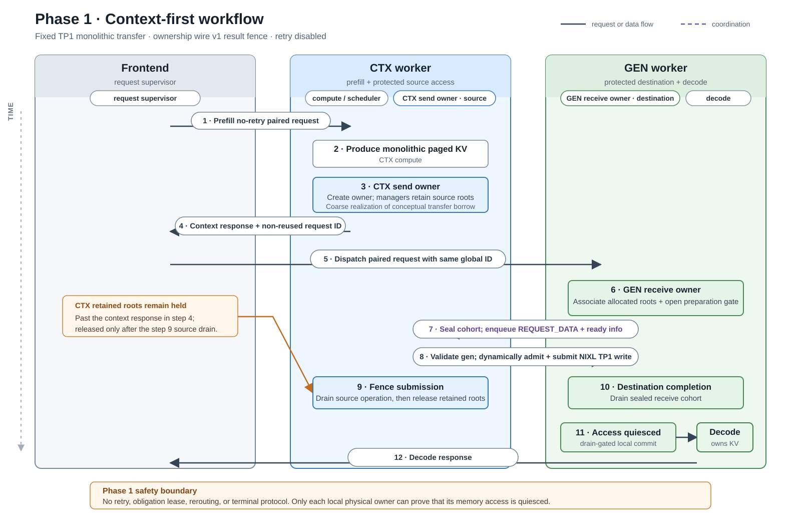
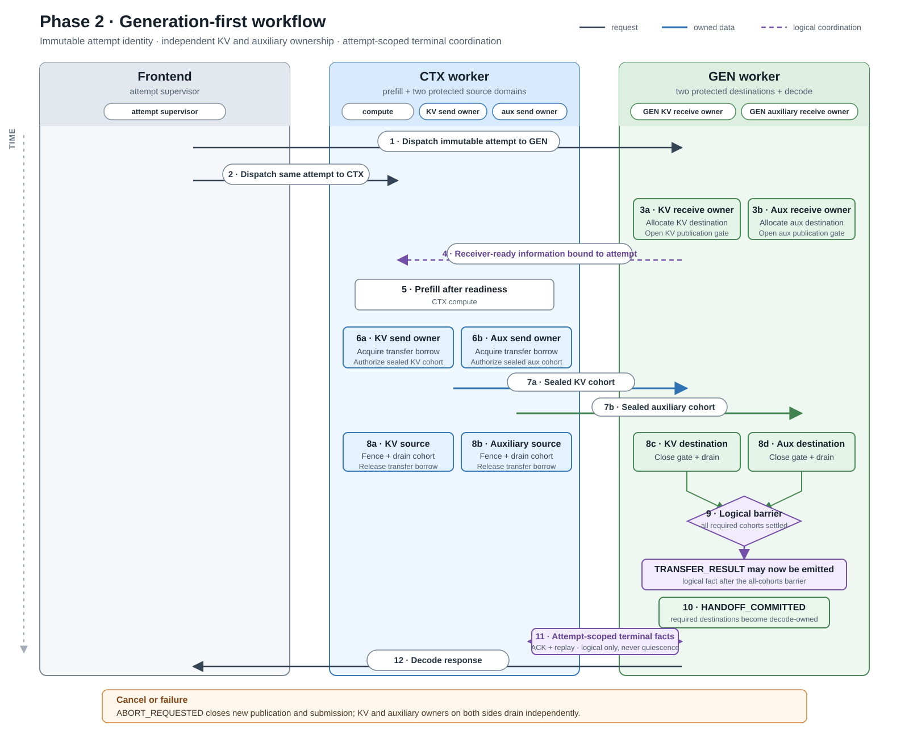

<!--
Copyright (c) 2026 NVIDIA CORPORATION & AFFILIATES. All rights reserved.
SPDX-License-Identifier: Apache-2.0
-->

# Disaggregated Inference Transfer Lifecycle

| | |
|---|---|
| **Status** | Canonical contract under qualification; Phase 1 implementation in [PR #17720](https://github.com/NVIDIA/TensorRT-LLM/pull/17720) |
| **Implementation baseline** | `main@102134fe8`; PR #17720 head `4ca6faa18` |
| **Supersedes** | The former lifecycle GPT/Fable drafts and Python-native ownership design; this file is the sole normative source |
| **Last updated** | 2026-08-18 |

## Executive Summary

The urgent correctness problem is local physical operation ownership. A CTX or
GEN request can become logically terminal before every NIXL or CUDA accessor is
known to be terminal. Cancellation, consensus, timeout, session removal, or
shutdown must therefore never be treated as proof that memory is reusable.

The work is divided into three explicit phases:

| Phase | Outcome | Delivery boundary |
|---:|---|---|
| **1. Ownership MVP** | Fix local publication and exact-writer retirement; enable one narrow context-first Python/NIXL canary | PR #17720 plus the open exit gates below |
| **2. Coordinated Python lifecycle** | Add immutable attempt-level CTX/GEN coordination and qualify the priority Python scenarios | Focused Python workstreams |
| **3. Extended lifecycle and C++** | Add renewable resource obligations, rerouting, the remaining Python scenarios, and separately qualified C++ support | Explicit post-core workstreams |

The phase boundaries are capability and qualification gates, not a fixed PR
count. PR #17720 currently bundles the three originally planned Phase 1 slices
and is larger than the preferred review unit. Follow-ups should return to one
concern per PR and roughly 1,500 changed lines or less where practical. Splitting
or combining delivery units does not weaken a phase exit gate.

## Problems, Goals, and Cross-Phase Rules

### Existing protections to preserve

Current `main` already reduces lifetime risk:

- `AsyncTransferManager` strongly retains CTX requests. The V1 reuse-store path
  can additionally pin blocks; V2 remains retained through the request and
  `kv_cache_map`/`_KVCache` ownership.
- `KvCacheTransceiverV2` retains request/session roots and implements
  cancel-before-create tombstones.
- Generation-first waits for GEN allocation and receiver readiness before CTX
  leaves `DISAGG_CONTEXT_WAIT_SCHEDULER`.
- Rank consensus reconciles distributed logical outcomes.
- Bounce transfer has per-writer accounting, duplicate suppression, and
  drain-before-scatter behavior.
- Transfer progress can run on iterations with no model batch.

The design generalizes these protections instead of replacing them.

### Confirmed problems

#### Local physical safety

- **Publication after cancellation:** consuming a receive tombstone does not
  prevent the caller from continuing into `receive()` and publishing addresses.
- **A failed writer hides active siblings:** the first peer failure changes a
  shared task to `ERROR`; `has_transferring_tasks()` can then report false while
  another writer remains active.
- **Late results can lose their owner:** native registries use weak lookups, so
  session removal can discard later backend completion evidence.
- **Timers are used where transport proof is required:** bounce quarantine and
  bounded shutdown joins can reach reuse or deregistration without proving
  that every accessor stopped.

#### Cross-side consistency

- `_post_with_retry()` can independently remint the CTX or GEN
  `disagg_request_id`; `max_retries=0` does not bypass its hard-coded transient
  TCP retry budget.
- A cancelled CTX session can disappear without settling back into
  `AsyncTransferManager`, and there is no general attempt-scoped terminal ACK.

#### Coverage

Python bounce, generation-first auxiliary state, multi-writer topologies,
pipelining, recurrent/KDA state, PP, attention-DP, other transports, and C++ do
not yet share one qualified ownership contract.

### Goals

- Keep client-visible outcome separate from transfer release and allocation
  reuse.
- Make publication, submission, exact writer drain, late-result settlement, and
  shutdown safe for every explicitly qualified resource.
- Add immutable attempt-level CTX/GEN coordination without mirroring scheduler
  state or making a coordinator own GPU-memory truth.
- Extend coverage one adapter or topology at a time through a common
  conformance suite.
- Give Python and C++ the same semantic disposition contract while qualifying
  their implementations independently.

### Non-goals

- Fixing transport reliability or claiming that this design reduces NIXL
  errors.
- Replacing the router or replicating local scheduler state across workers.
- Treating elapsed time, HTTP completion, consensus, ACK, grant expiry, or lease
  expiry as DMA-quiescence evidence.
- Qualifying every runtime and topology in the MVP.
- Transparent post-token retry without preserving decoder and output state.

### Terminology

| Term | Meaning |
|---|---|
| **Logical outcome** | Request-visible success, failure, cancellation, or deadline expiry. It controls scheduling and notification, not memory reuse. |
| **Physical disposition** | The local owner's access state: still `DRAINING`, a quiesced disposition, or `IN_DOUBT` when safe completion cannot be established. |
| **Operation owner** | An endpoint-local authority for one resource and segment. It holds the exact accessor ledger and outlives optional request/session lookup. There is no cross-process physical owner. |
| **Writer/accessor cohort** | The immutable set of remote writers and local CUDA/NIXL accessors that may touch an owned resource generation. |
| **Writer-cohort seal** | The boundary, before address exposure, after which writer membership cannot change. |
| **Authorization/manifest close** | The later boundary after which no new resource, segment, or operation can be authorized. Aggregate drain cannot complete before this close. |
| **Transfer borrow/pin** | A non-expiring local safety hold that prevents release or reuse while physical access may remain. Only quiescence releases it. |
| **Allocation-generation lease** | An allocator-enforced hold on a specific allocation generation, with pending-free and ABA protection. This is the Phase 3 fine-grained replacement for Phase 1's coarse retention. |
| **Artifact-obligation lease** | A renewable cross-node liveness record saying that a peer still needs an artifact. Expiry requests abort or fencing; it never proves physical quiescence. |
| **Publication** | Any action that can make an address, descriptor, or operation authorization observable to a writer. |
| **Terminal evidence** | Backend-defined positive evidence that a particular accessor can no longer perform later memory access. |
| **Quarantine** | Capacity withheld from reuse while quiescence is unknown. Elapsed quarantine time does not make the capacity safe. |

### Cross-phase invariants

1. CTX source and GEN destination use the same owner abstraction but remain
   separate local authorities; there is no shared cross-side physical owner.
2. Only the local allocator declares memory reusable. Releasing a transfer
   borrow is not the same as freeing an allocation.
3. Physical settlement is keyed by `resource × segment × writer` and requires
   a sealed cohort. Finishing all currently known writers is insufficient if a
   later writer or segment can still be authorized.
4. First failure may fix the logical result, but it never erases sibling
   writers.
5. `QUIESCED_SUCCESS`, `QUIESCED_FAILED`, and `QUIESCED_CANCELLED` permit
   transfer-borrow release. `IN_DOUBT` does not.
6. Cancellation permanently closes publication and submission gates after it
   wins.
7. Late or duplicate evidence matching the same owner generation settles that
   retained owner exactly once. Evidence from a stale generation is inert to a
   newer owner; contradictory same-generation evidence fails closed.
8. Every transfer borrow is released exactly once after a quiesced
   disposition. Duplicate completion cannot cause another release or unpin.
9. Immutable terminal facts and renewable resource obligations are different:
   Phase 2 coordinates the former, while Phase 3 introduces the latter.

### Normative physical ownership contract

The load-bearing rule is:

> For every asynchronous accessor and every memory range it may read or write,
> the allocation generation, registration, mapping, and required plan storage
> remain valid from before access becomes possible until positive evidence
> proves that accessor can no longer touch them.

Client cancellation, logical consensus, request/session destruction, a lost
result message, deadline expiry, elapsed quarantine, lease expiry, and a
bounded wait returning false are not terminal evidence. Local CUDA completion
is also insufficient while a remote RMA accessor may remain active.

The following rules apply to every qualified phase and adapter:

1. **Own before access.** Install the endpoint owner, required memory holds,
   complete planned writer/accessor ledger, and authorized candidate ranges
   before resolving raw pointers, constructing asynchronous plans, launching
   CUDA work, submitting NIXL work, or beginning publication.
2. **Close gates monotonically.** Cancellation, shutdown, or a sticky ownership
   fault closes new publication and submission. A closed gate never reopens for
   the same owner generation.
3. **Account by identity.** Settlement uses resource, segment, owner generation,
   exact writer/accessor identity, and operation identity where a writer may
   issue more than one operation. A count alone is not an identity contract.
4. **Separate outcome from access.** The first logical terminal result may be
   reported promptly, but it cannot erase sibling operations or release a
   physical hold.
5. **Route evidence to the owner first.** Optional request/session lookup and
   consumer callbacks happen only after the retained owner has validated and
   recorded the evidence. Removing a consumer cannot cause evidence to be
   dropped.
6. **Fail closed on uncertainty.** A generic backend failure is quiesced only
   when the backend contract says no later access is possible. Missing,
   malformed, contradictory, or ambiguous identity/quiescence evidence
   produces `IN_DOUBT`, retains the affected capacity, and forbids its reuse.
   Malformed data or scatter metadata fails the data outcome and suppresses
   unsafe consumption, but does not discard otherwise valid independent
   quiescence evidence. Phase 1 makes any `IN_DOUBT` owner a worker-wide sticky
   fault; a later adapter may continue on isolated safe capacity only after
   proving generation-level containment.
7. **Release exactly once.** Duplicate, reordered, late, or contradictory
   events cannot release a hold twice or settle a newer allocation/owner
   generation.
8. **Authorize ranges, not just lifetimes.** Every NIXL, gather, and scatter
   range must be contained in the held generation and authorized writer range,
   with device, alignment, non-negative size, overflow, aggregate-byte, and
   per-writer-boundary validation.
9. **Retain asynchronous work without blocking locks.** Every queued
   gather/scatter/completion item holds a strong operation-owner reference, not
   only raw slot IDs or detached callbacks. Network operations, CUDA waits,
   allocator callbacks, and consumer callbacks execute outside owner/session
   locks. Callback exceptions are recorded without interrupting physical
   finalization or exactly-once release. Progress and drain polling remain
   bounded and non-blocking to the executor loop.
10. **Drain before teardown.** Registrations, VMM mappings, bounce arenas,
    completion workers, and backend agents remain live until every accessor
    that depends on them is quiesced. Independent resource owners sharing a
    registration participate in the same teardown barrier. External fail-stop
    may replace per-operation drain only under a backend/platform guarantee
    that endpoint destruction revokes remote registrations and rkeys, stops
    every accessor, and completes before any underlying GPU mapping is released
    or reused. Merely removing the endpoint from advertised capacity is not
    such a guarantee.
11. **Reject incompatible peers before publication.** A required identity,
    writer, mode, or evidence field is never silently downgraded. Peers either
    agree on the required protocol/capability contract or fail before addresses
    are exposed.

A duplicate live owner identity must resolve idempotently to the same immutable
plan or fail; it must never replace the existing owner. Pruning a diagnostic or
protocol tombstone does not authorize generation reuse. If discovery cannot
identify the exact writer cohort before publication, the adapter either uses an
address-free handshake to seal it or registers every recipient as a possible
writer and obtains positive `NO_REMOTE_ACCESS` evidence from each
non-participant. Otherwise that topology remains disabled.

#### Ownership granularity and responsibilities

The hierarchy is:

```text
request / handoff attempt handle
    -> endpoint-local owner per resource and segment
        -> exact remote-writer and local-accessor records
```

The request-level handle aggregates logical progress. It does not become the
physical authority. Each endpoint independently owns its source or destination
resources; a protocol identity correlates the two endpoint owners without
creating a distributed owner object.

| Component | Ownership responsibility | Must not decide |
|---|---|---|
| `KvCacheTransceiverV2` | Strong request/session roots, owner lookup, lifecycle admission, request-retirement and shutdown gates. | Allocator reuse from logical status alone. |
| `TxSession` / `RxSession` | Request association and serialization of cancellation with local submission/publication. | Remote resource lifetime. |
| Physical operation owner | Sealed writer cohort, local backend operations, terminal evidence, and physical-drain predicate independent of task status. | Client-visible scheduling outcome. |
| `AsyncTransferManager` and KV manager | Phase-specific source/destination retention and ultimate allocation-reuse authority. | Network completion inference. |
| Bounce transport | Optional arena registrations, mappings, streams, allocators, and bounce-slot holds. | End-to-end transfer outcome. |
| NIXL/CUDA evidence adapters | Submission, progress, and documented quiescence evidence. | Request or KV-block retirement policy. |
| `PyExecutor` | Refuse request free and resource-manager teardown while the transceiver reports undrained ownership; fail-stop on a sticky ownership fault. | Reclassifying `IN_DOUBT` as safe. |

The class names above describe the Phase 1 implementation in PR #17720. Later
phases may extract a transport-neutral registry or handle, but the authority
boundaries and retirement predicate remain normative.

#### Allocation-reuse contract by phase

Phase 1 deliberately uses coarse retention for its narrow canary. The
transceiver strongly retains CTX and GEN requests and their sessions. V1 may
also use its existing reuse-store pin when configured; the V1 canary otherwise
depends on the request/resource-release gate. V2 retains the request's
`_KVCache`/mapping roots but is not runtime-qualified in Phase 1. `PyExecutor`
must route every in-scope termination and shutdown path through the transceiver
drain gate before `free_resources()` or KV-manager teardown. Owner installation
precedes pointer derivation and publication.

This is a qualified temporary mechanism, not an allocator lease. Phase 1 is
safe only if an exhaustive release-path audit and deterministic tests prove
that no enabled canary path can free, unpin, evict, rebalance, or replace those
blocks outside that gate. Adding another free path, cache manager, topology,
preemption mode, connector, offload mode, or independent resource invalidates
the qualification until it passes the same proof. If that proof cannot be made
for the canary, allocator-enforced leases move into Phase 1 rather than being
waived.

Phase 3 replaces the coarse condition with allocator-issued
`(pool, block, allocation_generation)` leases. Request cleanup atomically drops
request ownership and makes still-leased generations pending-free; reuse occurs
only after request ownership and all transfer leases are gone. Overlapping
segments hold reference-counted leases, and allocator shutdown obeys the same
predicate.

#### Resource retirement matrix

| Resource/accessor | Earliest safe release | First qualified phase |
|---|---|---:|
| Direct source KV | The reading NIXL operation is definitively quiescent. | 1, coarsely at request drain |
| Direct destination KV | Every writer targeting the blocks is definitively quiescent. Successful data is eligible for a separate winning local handoff commit; quiescence alone does not make it decode-owned. | 1, coarsely at request drain |
| Gather source KV | Gather is complete and subsequent NIXL reads only the send-bounce slot. | 2 |
| Send-bounce slot | Every NIXL reader of the slot is definitively quiescent. | 2 |
| Receive-bounce slot | Every writer that may have observed its address is quiescent, and scatter completed or was conclusively suppressed. | 2 |
| Destination KV after bounce/mixed fan-in | All direct writers and bounce writers are quiescent; successful scatter completed, or failed data was conclusively suppressed. | 2 |
| Descriptor, range, and gather/scatter plan storage | The consumer copied it synchronously, or every asynchronous consumer is quiescent. | Per adapter |
| CUDA event/job | Completion is observed and no queued worker or callback still references it. | Per adapter |
| Registration or VMM mapping | All dependent endpoint owners and local CUDA work are drained; missing per-operation evidence is replaced only by a documented endpoint-wide fence. | Per adapter |

Where a qualified phase/adapter provides an independent release primitive,
resources may retire at their earliest safe boundary. Phase 1 intentionally
over-retains its coarse request/KV roots until aggregate drain. Logical
completion and owner-registry removal still wait for their appropriate
aggregate predicates.

### Relationship to NVBUG 6480621

NVBUG 6480621 is not the motivation for this architecture. PR #17223 fixes the
blocking precheck/harness ownership defect found during its investigation and
leaves normal `PyExecutor` polling unchanged. PR #17137 changes only the reduced
3-CTX, concurrency-180 proxy, enables the precheck, and restores both timeouts
from 600 seconds to 60 seconds. As of 2026-08-11, neither establishes closure
of the original 8-CTX, concurrency-1760 workload.

NVBUG 6519709 is only evidence that request-local Python transfer failures occur
at production scale. This design makes retirement safe after such failures; it
does not prevent the failures themselves.

## Phase 1 — MVP: Local Ownership for a Limited Context-First Cohort

### Objective and scope

Phase 1 owns the minimum local-correctness MVP required by the deterministic
regressions: cancellation must close destination publication, one writer's
failure must not authorize reuse while a sibling writer remains active, and an
authorized `REQUEST_DATA` must not be overtaken by later cancellation. PR
#17720 implements the owner, Python/NIXL integration, executor gates, no-retry
mode, and a healthy-path canary in one draft. The local owner is
cardinality-correct for sealed receive cohorts from the start; sender admission
remains the deliberately narrow one-shot TP1 mechanism described below.

| Dimension | Phase 1 scope |
|---|---|
| Runtime | Python-native transceiver, explicitly selected on both peers |
| Transport | Direct NIXL |
| Scheduling | Context-first only |
| Resource | Paged attention KV only |
| KV manager | V1 only for the TinyLlama H100 canary. V2 retention plumbing is not runtime-qualified and remains a separate cell |
| Transfer shape | One existing monolithic `KVSlice` (`slice_id=0`, `is_last_slice=True`), plus the Phase 1 ownership wire extension v1 |
| Topology | Enabled canary: one CTX worker and one GEN worker; TP1, PP1, CP1; attention-DP off. Receive-owner core: sealed multi-writer cohorts in deterministic component coverage |
| Identity and retry | Coordinator-issued snowflake request IDs that are not reused, plus explicit no-retry/no-re-entry mode that bypasses transient-TCP ID reminting |
| Retirement | Coarse whole-request and KV-mapping retention |
| Rollout | Disabled by default; private opt-in with local startup checks, first-use peer checks, and deployment preflight |

Bounce, generation-first, pipeline, PP, attention-DP, recurrent/KDA,
auxiliary, draft, offload, and C++ paths are rejected before address
publication. Phase 1 seals the exact receive cohort. Its sender dynamically
enrolls the only permitted TP1 operation under one-shot, no-retry admission;
there is no explicit sender manifest close yet. The Phase 1 exit contract
requires one atomic `OPEN -> ADMIT_ONE_AND_CLOSE` transition before enqueue,
with every second admission rejected. The component owner still passes the 1:1
publication, cancellation-ordering, and multi-writer sibling-drain regressions;
G2 adds the missing close and race coverage before even the narrow canary is
promoted. Phase 2 workstream P2-A generalizes that close before qualifying real
TP2-to-TP1 traffic.

Until Phase 2 workstream P2-C adds full capability negotiation, matching
Python runtime, build, and topology configuration on both peers is an
operator/deployment precondition. Phase 1 advertises ownership wire v1 and
rejects a peer whose
ownership version does not match, but that narrow check is not a general
runtime or feature negotiation mechanism.

Phase 1 also depends on the serving coordinator issuing a fresh snowflake ID
for every request and never reusing that ID across participating or replacement
worker processes while an old message could remain reachable. Retry and
request re-entry are disabled. The process-local owner generation in wire v1
fences late terminal results at the current receiver; it does **not** prevent a
stale `REQUEST_DATA` message from binding to a deliberately reused sender
request ID, and it does not identify a receiver-process incarnation. General
replay/ABA protection requires the immutable attempt and endpoint-incarnation
identity introduced in Phase 2.

PR #17720 currently validates only the request ID's global-shape convention;
it cannot prove coordinator provenance or non-reuse. Those are deployment
preconditions until an enforceable attempt/endpoint identity replaces them.

#### Phase 1 deployment and rolling-upgrade contract

The feature is a paired-deployment canary, not an independently rolling wire
upgrade. The ownership flag must be enabled on both CTX and GEN workers. The
no-retry flag must be present wherever worker startup validates the mode and in
the frontend/client process that would otherwise retry or remint an ID.

| Deployment combination | Phase 1 behavior |
|---|---|
| New CTX + new GEN, both flags off | Legacy protocol v0 and legacy lifetime behavior; no Phase 1 safety claim. |
| New CTX + new GEN, ownership and no-retry enabled everywhere, matching qualified config | Ownership wire v1 canary permitted. |
| New peers with ownership enabled on only one side | Reject before address publication; no silent fallback. This mixed-flag matrix is a Phase 1 test gate. |
| Ownership-enabled new peer with an old binary | Prohibited by deployment preflight. The narrow wire-version check is not relied on to make an old peer fail safely in both directions. |
| In-place replacement or rolling restart of one peer | Not supported. Drain the paired deployment, stop advertisement, wait for the old endpoint/process to be destroyed, create a fresh endpoint, and preserve request-ID non-reuse. |

The required deployment behavior for an `IN_DOUBT` fault is to mark the whole
worker unhealthy: the owner retains memory and registrations, the transceiver
rejects admission, the serving layer removes the endpoint from advertised
capacity, and the orchestrator terminates the process. PR #17720 currently
implements only the retained roots, local admission fault, and `PyExecutor`
exception; capacity removal and process replacement remain a Phase 1 gate.
Replacement is permitted only after old endpoint destruction has revoked its
registrations/rkeys and stopped every accessor before the underlying GPU
mappings can be released or reused, according to the backend/platform
contract. Process disappearance or delayed replacement advertisement by itself
is not called per-operation quiescence, and no in-process cleanup path converts
retained memory into reusable capacity. If that destruction ordering cannot be
proved, the deployment must preserve the old endpoint and mappings rather than
treat process exit as safe reclamation.

### Design introduced in Phase 1

#### Local authorities

| Fact | Authority |
|---|---|
| CTX source submission and read access | CTX send-operation owner |
| GEN destination authorization and publication | GEN receive-operation owner |
| Raw NIXL/CUDA completion evidence | Backend evidence adapter |
| Physical disposition | Corresponding local operation owner |
| Allocation reuse | Local KV allocator |

Each operation owner remains strongly reachable through its transceiver
session/task registry until drain, independent of optional consumer lookup.
On GEN, the surrounding receive task supplies the process-local owner
generation and exact sealed writer cohort. On CTX, the send task supplies the
endpoint/resource context and creates its one backend-operation identity only
when validated `REQUEST_DATA` is handled. The GEN owner serializes destination
publication with cancel; the CTX owner independently serializes dynamic source
admission and submission with cancel. Phase 1 does not define a sender cohort
seal.

The KV transfer itself keeps one existing monolithic `KVSlice`. The
receiver derives and seals the complete immutable writer set from validated
rank-overlap metadata before publishing an address, and the sender fences its
single dynamically admitted TP1 submission after enqueue. Ownership wire v1
adds only a process-local owner generation, echoed in terminal results, plus a
fail-fast version check;
it is not Phase 2's distributed attempt/capability identity. If both peers
cannot derive the same cohort, the Phase 1 implementation must add an explicit
seal and keep
publication closed until it arrives. That seal must be piggybacked on the
existing setup/receiver-ready exchange to preserve the no-extra-round-trip
target; a new handshake requires an explicit performance review and a revised
acceptance criterion.

#### Physical lifecycle

```mermaid
stateDiagram-v2
    [*] --> CONSTRUCTING
    CONSTRUCTING --> CANCELLED_UNPUBLISHED: cancel wins publication gate
    CONSTRUCTING --> ACTIVE: receive cohort sealed or sender operation admitted; first access authorized
    CONSTRUCTING --> CLOSED_DRAINING: seal empty cohort and close authorization
    ACTIVE --> CLOSED_DRAINING: authorization/manifest close, failure, cancel, or shutdown
    CLOSED_DRAINING --> QUIESCED: authorized accessor ledger drained
    CLOSED_DRAINING --> IN_DOUBT: quiescence cannot be proven
    CANCELLED_UNPUBLISHED --> OWNER_RETIRED
    QUIESCED --> OWNER_RETIRED: release transfer borrow
    IN_DOUBT --> QUIESCED: late positive per-operation evidence or proven endpoint-wide fence
    IN_DOUBT --> FAIL_STOP_CONTAINMENT: withdraw capacity; retain mappings
    FAIL_STOP_CONTAINMENT --> ENDPOINT_REVOKED: stop accessors; destroy endpoint; revoke registrations and rkeys
    ENDPOINT_REVOKED --> [*]: mappings may be released or reused
    OWNER_RETIRED --> [*]
```



The diagram is an aggregate view. Implementations preserve independent state
dimensions even if Phase 1 represents them conservatively rather than with
public enums:

| Dimension | Required distinctions |
|---|---|
| Exposure | `PLANNED`, positively `NEVER_EXPOSED`, or `MAY_ACCESS`. An attempted publication remains `MAY_ACCESS` unless the messaging layer proves non-delivery. |
| Access | `NOT_STARTED`, `POSSIBLE`, or `QUIESCED`. Generic failure does not imply `QUIESCED`. |
| Target | `DIRECT`, `BOUNCE`, `NO_REMOTE_ACCESS`, or `UNKNOWN`, with candidate ranges held until the actual mode is safe to resolve. |
| Data | `UNKNOWN`, `SUCCESS`, `FAILURE`, `ABORTED`, or `INVALID`. Data invalidity can coexist with proven physical quiescence; physical quiescence can coexist with unknown data. |

For receive publication, the owner and coarse allocation root are installed
before pointer derivation. Under the session gate, cancellation either wins and
marks the operation never exposed, or publication wins by sealing the cohort
and marking each selected operation `MAY_ACCESS`/`POSSIBLE` before any
enqueue/send attempt. It then commits an ordered `REQUEST_DATA` enqueue. A later
cancel is ordered behind that enqueue. An attempted operation returns to
`NEVER_EXPOSED` only with positive non-delivery proof. Blocking socket I/O must
not remain under the lifecycle lock; PR #17720's current lock-held send is
therefore an explicit Phase 1 exit item. Only a proven non-blocking in-memory
enqueue or sequence reservation may linearize under that lock; all socket I/O
must occur after lock release. Partial publication drains every operation that
may have crossed the exposure boundary and retires positively unexposed
operations independently.

An accessor-quiesced disposition releases only the transfer borrow. On receive
success, the data becomes eligible for a separate winning local handoff commit;
only that commit makes destination KV decode-owned. The allocator may free it
only after every remaining logical owner also releases it.

In PR #17720, that Phase 1 local commit is the drain-gated
`check_gen_transfer_status()` transition to
`DISAGG_GENERATION_TRANS_COMPLETE`; it is not a separate wire message or durable
commit record. Phase 2's `HANDOFF_COMMITTED` adds the attempt-scoped fact.

| Disposition | Required evidence |
|---|---|
| `QUIESCED_SUCCESS` | The writer completed and can no longer access memory |
| `QUIESCED_FAILED` | The backend proves that the failed access ended |
| `QUIESCED_CANCELLED` | A quiescence-bearing backend abort completion or endpoint-wide fence proves that the writer stopped; cancellation intent alone is insufficient |
| `IN_DOUBT` | Future or outstanding access cannot be excluded; release is forbidden |

The target shutdown contract distinguishes `DRAINED`, retryable `DRAINING`, and
`IN_DOUBT`. PR #17720 currently returns only a Boolean drained/not-drained value
and exposes a sticky ownership fault separately; `False` may mean ordinary
active work, listener/thread/deregistration failure, or ambiguity. Until a
richer disposition lands, every `False` vetoes teardown and reuse. The current
sticky fault channel also conflates genuine completion ambiguity with malformed
owner generation, listener/protocol/unknown-message exceptions, and terminal
result publication failures. `PyExecutor` conservatively treats any such fault
as `IN_DOUBT` and requires Phase 1 fail-stop: stop admission, retain in-process
registrations, and terminate the worker under the deployment contract above.
The target adapter must classify these faults without weakening the physical
evidence rule. Process exit is external containment, not an in-process
transition to reusable capacity. The orchestrator cannot advertise replacement
capacity until the old process exits and a new endpoint incarnation exists;
partial in-process recovery is forbidden. A late positive per-operation
completion may still drain a retained owner, but it does not clear the current
worker-wide sticky fault.

### Figure 1 — Phase 1 context-first workflow



<details>
<summary>Figure 1 text equivalent</summary>

1. The frontend sends a no-retry prefill request to CTX.
2. CTX produces monolithic paged KV. Its send owner is created while the
   transceiver, `AsyncTransferManager`, and KV manager retain the coarse source
   roots; together these are Phase 1's realization of the conceptual transfer
   borrow, not a separate allocator lease API owned by the operation owner.
3. CTX returns the context response, but keeps those source roots held.
4. The frontend dispatches the paired request to GEN using the same current
   request ID.
5. GEN associates its already allocated destination roots with the receive
   owner and opens preparation. Under the `RxSession` gate it then seals and
   closes the exact receive cohort before enqueueing `REQUEST_DATA` and
   receiver-readiness information.
6. On validated `REQUEST_DATA`, PR #17720 dynamically admits and enqueues the
   topology-permitted TP1 operation. Its send owner fences and drains that
   operation before the surrounding root holders may release the source; the
   already-closed GEN receive owner independently drains its destination
   cohort. G2 adds the explicit `OPEN -> ADMIT_ONE_AND_CLOSE`
   transition that the current draft lacks.
7. Only after receive access quiesces and the separate winning local handoff
   commit succeeds does decode own the destination KV and return the response.

</details>

This flow has no retry or request re-entry, renewable lease, rerouting, or
Phase 2 terminal protocol. CTX and GEN correlate one coordinator-issued,
non-reused snowflake request ID, while local owners are the only
physical-safety authority. Wire v1 does not make that ID safe to reuse.

### Phase 1 implementation status

PR #17720 maps to all three original Phase 1 delivery slices. The table
distinguishes code present in the draft from qualification still required by
this design.

| Contract area | PR #17720 status | Remaining Phase 1 gate |
|---|---|---|
| Owner and evidence core | Implemented conservatively in native Python transfer code: exact receive peer ranks, sender backend operations, generic local-completion callback plumbing, retained NIXL evidence, and one `resources_drained` predicate. | Semantic disposition/API extraction is follow-up work; CUDA bounce/scatter remains P2-B. |
| Publication, cancellation, and result ordering | Implemented with `RxSession`/sender locking, an exact sealed receive cohort, dynamic one-shot TP1 sender admission, cached-DEALER ordering, and strong session/request roots. | **G2** |
| Wire compatibility | Implemented as flag-gated ownership protocol v1 with a receiver process-local owner generation echoed in results; flag-off preserves v0 bytes and protocol-version mismatches fail. | **G6** |
| Allocation retention | Implemented as coarse request/session and KV-map retention, plus executor request-free and resource-manager shutdown gates. | **G1** |
| Range and plan authorization | Reuses existing page-table, overlap, layout, and reservation checks; PR #17720 does not introduce a generation-bound resource manifest. | **G3** |
| Shutdown and `IN_DOUBT` containment | Implemented as a Boolean teardown veto, retained backend evidence, and a sticky worker fault that conservatively conflates ambiguous completion with several fatal identity/protocol/handler errors; it stops local admission, retains global Python roots, and makes `PyExecutor` require restart. | **G4–G5** |
| Runtime qualification | A V1 H100 TinyLlama direct TP1 healthy-path canary and deterministic CPU/component exceptional-path tests are present. V2 has no configured real-backend canary. | **G1–G7** |
| Observability | Logs exist for selected failures and stale results. | **G7** |

Phase 1 result routing is safe because the session registry is a strong owner
and session close refuses to remove an undrained owner. It does not yet have an
independent registry-first result router. That distinction is intentional: the
normative requirement is that evidence reaches a strongly retained physical
owner before optional consumer notification, not that Phase 1 must introduce a
particular class name.

The native sender already has an RID-only pre-cancel set for cancellation that
arrives before session setup. PR #17720 does not turn it into a durable,
attempt/generation-scoped, replay-safe tombstone or protect post-close stale
`REQUEST_DATA`; those capabilities belong to the Phase 2 attempt protocol.
Phase 1 additionally relies on locally ordered publication/cancellation, no
retry or re-entry, globally non-reused request IDs, and the paired-deployment
restrictions above.

Cancellation-frame send failures are currently logged without a reliable
delivery/ACK path, and a lost terminal result may leave an owner permanently
draining without setting the sticky fault. Safety remains fail-closed because
the roots are retained. Phase 1 rollout nevertheless requires metrics and a
bounded liveness escalation that may classify unresolved progress as
`IN_DOUBT` and fail-stop the endpoint, never release the memory.

### Expected Phase 1 result

A disabled-by-default TP1 context-first canary in which cancellation, once
observed and committed by the local `RxSession`, cannot be overtaken by later
publication; logical retirement cannot discard completion evidence; and paged
KV cannot be reused before the exact local accessor cohort quiesces. Remote
cancellation delivery is not reliable in Phase 1, so a lost cancellation frame
does not provide this local guarantee. The owner core is designed and
deterministically component-tested for sealed multi-writer cohorts, but no TP2,
broader Python, or C++ runtime support is implied.

### Validation and exit criteria

Phase 1 inherits every applicable row in the
[cross-cutting fault matrix](#validation-evidence-and-fault-matrix), the
[performance contract](#performance-contract), and the
[observability contract](#observability-and-capacity). Its phase-specific exit
evidence is:

- the three deterministic publication, sibling-writer, and
  `REQUEST_DATA`-before-cancel regressions pass;
- concurrent or duplicate sender admission permits exactly one
  `OPEN -> ADMIT_ONE_AND_CLOSE` transition and rejects every later operation;
- flag-off behavior remains unchanged and locally detectable unsupported cells
  fail before publication;
- the V1 TP1 H100 canary passes with coordinator-issued non-reused IDs and retry
  disabled in workers and the frontend; and
- open gates **G1–G7** are closed for the canary rather than deferred by
  configuration assumption.

### Open questions and dependencies

- Which validated setup metadata is the source of truth for the protocol-v0
  writer cohort?
- Phase 1's unresolved proofs and rollout requirements are tracked once as
  **G1–G7** in [Consolidated Open Design Gates](#consolidated-open-design-gates).

## Phase 2 — Cross-Side Attempt Coordination and Extended Python Scenarios

### Objective and scope

Phase 2 adds cross-side coordination for immutable attempt identity and
terminal convergence, then qualifies the ownership contract on priority Python
scenarios:

- direct TP2-to-TP1 multi-writer fan-in;
- existing Python bounce, including scatter/CUDA accessors;
- generation-first with its separate auxiliary accessor;
- context-first and generation-first terminal handling;
- endpoint identity, capability negotiation, autonomous progress, and phase
  diagnostics; and
- narrowly qualified same-attempt delivery replay after proven pre-connect
  non-delivery.

This is attempt-level coordination, not a mirrored scheduler state machine.
Renewable queue/resource grants, artifact-obligation leases, replacement
attempts, and rerouting remain Phase 3.

### Design introduced in Phase 2

#### Immutable identity and terminal facts

Before retry or replay is enabled, the wire identity expands to an immutable
handoff attempt ID, attempt-origin supervisor epoch, endpoint incarnation,
transfer-session ID, operation ID, resource ID, and writer ID. A separate
monotone command-authority epoch fences the supervisor currently allowed to
control that immutable attempt. Effective runtime/capability negotiation occurs
after model/backend resolution; `transceiver_runtime="auto"` is not proof that
both endpoints selected Python.

The request/attempt supervisor is the sole writer of the monotone logical
outcome. CTX, GEN, and local operation owners emit idempotent facts; they do not
independently overwrite the client-visible result. Physical disposition remains
endpoint-local and may continue draining after the supervisor records logical
failure or cancellation. Conversely, a terminal ACK proves fact delivery, not
DMA quiescence.

Cross-side terminal messages are idempotent, attempt-scoped facts:

```text
ABORT_REQUESTED
TRANSFER_RESULT
HANDOFF_COMMITTED
TERMINAL_ACK
```

Missing ACK retains a bounded replay/tombstone record. It neither retains
memory after the local owner proves quiescence nor releases memory while that
owner remains `IN_DOUBT`.

Before Phase 2 enablement, the protocol specification must assign each fact an
emitter, recipient, idempotency key, precondition, and conflict rule. In
particular, it must define the linearization between `ABORT_REQUESTED` and
`HANDOFF_COMMITTED`, and it must specify which GEN-owned transition makes
successfully received destinations decode-owned. Re-sending a message after
proven pre-connect non-delivery may retain the same attempt identity because it
is delivery replay, not a replacement attempt. Any replacement after possible
peer acceptance creates new attempt, session, operation, obligation, and
transfer-borrow identities even if a future allocator lease safely shares
immutable source blocks; only the logical request identity remains stable.

Supervisor state is soft but fenced. A restarted supervisor creates a new
command-authority epoch and rebuilds its shadow table from worker-reported live
attempts and retained terminal facts. To control an old-origin attempt, it must
complete an idempotent `SUPERVISOR_TAKEOVER` transition accepted by both workers
under a monotone compare-and-set rule; takeover changes only command authority,
never the immutable attempt identity or local physical state. Commands from an
older authority epoch are then inert. If takeover cannot be established, the
new supervisor cannot mutate that attempt and local owners remain retained or
fail-stopped. After takeover it may request abort or replay a terminal fact, but
it cannot declare local memory quiescent. Bounded reclamation after supervisor
or peer loss is a Phase 3 liveness goal backed by obligations plus transport
fencing; before then, uncertainty remains retained or fail-stopped.

#### Retry and progress

Once either worker may have accepted an attempt:

- neither CTX nor GEN independently remints its identity;
- same-attempt delivery replay is allowed only with positive pre-connect
  non-delivery proof; and
- ambiguous post-connect delivery fails and drains the old attempt before any
  replacement attempt uses a new attempt identity.

Transfer progress, cancellation, timeout detection, and terminal replay must
continue through zero-model-batch iterations. Diagnostics distinguish frontend
queueing, worker queueing, GEN allocation/receiver setup, CTX prefill,
rendezvous, submission, first observable backend progress, and physical
completion. A deadline may emit an abort intent; only the physical owner can
emit a quiesced disposition.

The clocks remain independent:

| Clock | Covers | Expiry effect |
|---|---|---|
| End-to-end deadline | Client-visible attempt budget | Ask the supervisor to record deadline failure and emit abort intent. |
| Handoff/admission deadline | Creation through accepted GEN readiness | In Phase 2, abort/fail the attempt; replacement is permitted only after Phase 3 fencing and obligation prerequisites. It is not a transfer failure. |
| Source-production deadline | CTX scheduling/prefill through source artifact readiness | Fail the attempt or choose policy-level recomputation; it is not an active-transfer stall. |
| Active-transfer deadline | Both source and receiver ready, normally first submission, through physical completion | Detect a stall and request abort/fencing; retain resources until quiescence or fail-stop containment. |
| Artifact-obligation lease (Phase 3) | How long a peer promises to retain a produced artifact | Expiry ends the cross-node obligation and initiates abort/fencing; it never releases the local transfer borrow. |

Queueing must never run under the active-transfer deadline. No clock or lease
expiry authorizes memory reuse.

#### Extended physical adapters

The direct multi-writer topology has one TP2 CTX worker and a pool of two TP1
GEN instances. Each attempt selects one GEN instance and therefore has an exact
two-writer CTX cohort. Phase 2 qualifies the cardinality-correct owner delivered
in Phase 1 under this real topology, including fault injection, rollout, and
performance validation. Python bounce adopts the same owner instead of elapsed
quarantine as a reuse condition. Generation-first assigns its auxiliary state
an independent owner rather than folding it into paged-KV completion.

Phase 2 terminal coordination applies to both scheduling modes. Figure 1 gains
immutable attempt identity and the terminal messages above; its local physical
ownership flow remains unchanged.

### Figure 2 — End-of-Phase-2 generation-first workflow



<details>
<summary>Figure 2 text equivalent</summary>

1. The frontend dispatches the same immutable attempt to GEN and CTX.
2. Independent GEN KV and auxiliary receive owners allocate their destinations
   and open separate publication gates; readiness is bound to the attempt.
3. CTX prefills only after readiness. Independent CTX KV and auxiliary send
   owners acquire their borrows and authorize sealed cohorts.
4. KV and auxiliary cohorts transfer independently. Each CTX owner fences and
   drains its cohort before releasing its borrow, while each GEN owner closes
   and drains its corresponding receive cohort.
5. On success, an all-required-cohorts-succeeded-and-settled barrier permits a
   success `TRANSFER_RESULT`; only then can `HANDOFF_COMMITTED` make the
   required destinations decode-owned.
6. On first logical failure or cancellation, the supervisor may record and
   report failure promptly while all affected owners stop new work and drain
   independently.
7. Attempt-scoped terminal facts use ACK and replay for logical convergence,
   never as quiescence evidence.

</details>

On cancel or failure, a failure `TRANSFER_RESULT` may be emitted before physical
drain, and `ABORT_REQUESTED` stops new publication/submission. All affected
source and destination owners drain independently. The terminal protocol
reports and replays the logical outcome; it does not prove or replace local
quiescence.

### Phase 2 workstream plan

| Workstream | Scope | Expected result |
|---|---|---|
| **P2-A** | Qualify the Phase 1 owner in direct TP2-to-TP1 multi-writer fan-in with fault-injected sibling drain, rollout checks, and performance validation | Private TP2-to-TP1 qualification evidence without a second ownership mechanism |
| **P2-B** | Move Python bounce accessors onto the common owner and remove timer-only reuse | Bounce retirement safety |
| **P2-C** | Add the immutable attempt/capability envelope: attempt ID, endpoint incarnation, transfer-session and operation IDs, and effective-runtime negotiation | Stale wire work is fenced before terminal replay or retry |
| **P2-D** | Add and qualify the generation-first auxiliary owner using the final identity envelope | Generation-first local ownership coverage |
| **P2-E** | Add attempt-scoped abort/result/commit/ACK, idempotent replay/tombstones, and sibling cancellation | Cross-side terminal convergence |
| **P2-F** | Add stable no-batch progress, phase diagnostics, and same-attempt delivery replay only after proven pre-connect non-delivery | Qualified Phase 2 Python cohort |

P2-A and P2-B can be developed in parallel with P2-C, but Phase 2 enablement
waits for P2-C through P2-F. Workstream labels express dependencies, not a
requirement to bundle each row into exactly one PR.

### Expected Phase 2 result

The named Python paths use one ownership contract and one attempt-scoped
terminal vocabulary across CTX and GEN. With both endpoints available and
within replay retention, duplicate, reordered, or transiently lost messages
converge. Permanent peer loss falls back to local abort/fail-stop containment;
bounded peer-loss obligations remain Phase 3. Each local physical owner remains
the sole source of transfer-release evidence.

### Validation and exit criteria

- TP2-to-TP1 fault injection with one blocked writer and one failed sibling;
  one logical error is reported and no early release occurs.
- Remote GEN cancellation reaches CTX retirement and terminal acknowledgement
  while the peer remains reachable or delivery succeeds within replay
  retention.
- Active bounce/scatter shutdown never reuses memory early.
- Generation-first paged KV and auxiliary access settle independently.
- Stale attempt, endpoint, session, and operation messages are inert.
- Supervisor restart rebuilds live attempts and retained terminal facts;
  takeover is monotone and idempotent when both workers accept it,
  stale-authority commands are inert, and partial worker availability cannot
  authorize mutation or reuse of an unclaimed old-origin attempt.
- Duplicate, reordered, or transiently lost terminal messages converge through
  replay and tombstones within endpoint-availability and retention assumptions.
- Progress and cleanup continue through zero-model-batch iterations.
- Capability mismatch is rejected before address publication.
- Same-attempt delivery replay succeeds only after proven pre-connect
  non-delivery; ambiguous post-connect delivery is rejected and drained before
  a replacement attempt in both scheduling modes.
- Every enabled Phase 2 path passes the Phase 1 ownership/shutdown conformance
  suite.

Phase 2 exits only when all named paths pass; an adapter is not implicitly
enabled because another adapter uses the same owner abstraction.

### Open questions and dependencies

- PR #16402 is a source for narrow paired-retry/deadline and sibling-cancel
  behavior; Phase 2 should extract only that behavior rather than stack the PR.
- PRs #16834 and #17482 preserve ADP-safe request-local error delivery; logical
  failure remains distinct from local physical drain.
- Which endpoint-incarnation source is stable across MPI, Ray, and torch
  process-group discovery?
- Which autonomous progress hook remains stable after the #17245/#17324 policy
  settles?
- How should attention-DP eventually elect one logical error reporter while
  every rank retains its local physical owner?

## Phase 3 — Further Scenario Coverage and C++ Qualification

### Objective and scope

Phase 3 extends the contract beyond the priority Python cohort:

- worker-backed GEN grants and renewable artifact-obligation leases;
- allocation-generation leases, pending-free detachment, replacement attempts,
  and safe immutable-artifact rerouting;
- recurrent/KDA, remaining auxiliary, draft, and offloaded resources;
- PP, attention-DP, pipelined transfer, bounce-v2, and other transports; and
- a separately implemented and qualified C++ lifecycle.

Phase 3 is a family of focused PRs, not one omnibus PR and not an implicit
extension of a completed Python core.

### Design introduced in Phase 3

#### Renewable resource obligations

A router choice is placement and load accounting, not a hard resource grant.
A worker-backed GEN grant states exactly what it promises: scheduler/request
ownership, destination allocation and readiness, transport capacity, or a
negotiated combination.

Generation-first formalizes and extends the Phase 2 receiver-ready handshake;
it does not create a parallel readiness protocol. Grants and leases layer on
that handshake and on the same local physical owners.

After CTX produces an artifact, a renewable obligation records that GEN still
needs CTX to retain it. Reject, revoke, peer loss, or expiry requests abort and
fence processing. Lease expiry never releases memory and never substitutes for
the local physical owner.

#### Fine-grained retirement and rerouting

An allocation-generation lease lets logical request cleanup detach while only
the affected allocation remains pending-free. It prevents ABA reuse and enables
replacement attempts only after the old attempt is fenced/quiesced, or after a
separately qualified immutable-source concurrent-read guarantee.

The full artifact manifest may include paged KV, recurrent/KDA state,
auxiliary buffers, draft/offloaded resources, and ordered segments. Every
independent accessor domain has its own ownership record and participates in a
final manifest seal.

Pipelining acquires ownership before waiting on a producer CUDA event, treats
that event as an accessor, uses immutable segment IDs plus a final seal, and
then submits NIXL work. Receiver slice `0` plus `is_last_slice` is not sufficient
identity for late or duplicate settlement.

#### C++ qualification

The disposition vocabulary is shared; implementation evidence is not. C++
must independently prove submission fencing, exact completion,
deregistration, shutdown, and stale-result behavior for each enabled backend
and topology. Python qualification never implies C++ qualification.

### Phase 3 PR/workstream plan

| Workstream | Scope | Expected result |
|---|---|---|
| **P3-A** | Worker-backed GEN grant and renewable artifact-obligation protocol | Bounded peer-loss detection and obligation lifetime, with explicit cleanup initiation |
| **P3-B** | Allocation-generation lease, pending-free retirement, and reroute fencing | Fine-grained reclamation without ABA reuse |
| **P3-C** | Pipelined segment/final-seal contract and producer-CUDA-event ownership | Safe pipelined transfer lifecycle |
| **P3-D** | One focused PR per remaining Python resource, topology, or transport adapter | Explicitly qualified extended Python matrix |
| **P3-C++1** | C++ transport-neutral owner and backend-evidence core | C++ lifecycle foundation |
| **P3-C++2** | C++ direct context-first integration, allocator/shutdown gates, and first canary | First qualified C++ cohort |
| **P3-C++3+** | One C++ transport/topology adapter per PR | Incremental C++ coverage without blanket claims |

If PR #15727 lands first, Phase 3 builds the owner adapter on the current
pipeline code. If the owner contract lands first, #15727 rebases onto the
segment/final-seal contract. Pipelining remains disabled until that adapter
passes. Bounce-v2 (#15780) exposes its ACK/completion through a backend evidence
adapter instead of defining another lifecycle state machine.

P3-B reroute enablement depends on P3-A plus old-attempt fence/quiescence. P3-C
can proceed independently after the Phase 2 identity contract. Each P3-D
adapter depends on the resource/segment contract it consumes. P3-C++2 depends
on P3-C++1 and a frozen capability/version contract. PP work should reuse or
explicitly supersede the endpoint/session substrate from PR #16645.

### Expected Phase 3 result

The ownership and coordination contract covers explicitly enumerated remaining
Python scenarios and separately qualified C++ cohorts. Renewable obligations
bound responsibility and support safe policy decisions, while only physical
quiescence authorizes transfer release.

### Validation and exit criteria

- Grant reject, revoke, expiry, and peer loss produce bounded detection,
  obligation termination, and explicit abort/fence initiation without treating
  expiry as transport quiescence.
- Allocation generations block stale access and ABA reuse.
- Rerouting waits for old-attempt fencing/quiescence or a separately qualified
  immutable-source concurrent-read guarantee.
- Stale segment results cannot settle a newer pipelined operation.
- Producer CUDA events participate in cancellation and shutdown drain.
- Each remaining Python adapter independently passes ownership, shutdown,
  retry, and stale-result conformance before enablement.
- Every C++ backend/topology independently passes the same semantic suite plus
  backend-specific deregistration and fence tests.
- Runtime/capability mismatch fails before publication rather than silently
  mixing Python and C++ semantics.

Phase 3 has no blanket completion claim. Coverage is the union of adapters and
C++ cohorts that have individually passed these gates.

### Open questions and dependencies

- What exact resource does a GEN grant promise in each scheduling mode?
- Which recurrent, auxiliary, draft, and offloaded resources need independent
  manifest entries rather than one co-transferred operation?
- Which transports can prove in-process quiescence after error, and which must
  remain fail-stop?
- What compatibility/version contract permits Python and C++ peers to reject an
  unsupported lifecycle combination before publication?

## Cross-Cutting Qualification Contract

Sharing an owner abstraction or passing component tests does not qualify a
runtime cell. Coverage is the union of explicitly tested cells below.

### Configuration and phase matrix

| Axis | Phase 1 canary | Phase 2 target | Phase 3 target |
|---|---|---|---|
| Transceiver | Python native on both peers | Python native | Python adapters plus independently implemented C++ cohorts |
| Backend/path | Direct asynchronous NIXL | Direct NIXL and Python bounce/fallback | One qualified backend/path adapter at a time |
| Schedule | Context-first | Context-first and generation-first | Additional policies only after conformance |
| Data resources | Monolithic paged-attention KV | Paged KV plus separately owned generation-first auxiliary state | Recurrent/KDA, draft, offload, and other manifest resources |
| Topology | TP1/PP1/CP1/DP1; attention-DP and DWDP off | Real TP2-to-TP1 fan-in first, then enumerated Python cells | PP, attention-DP, DWDP, pipelining, and other cells independently |
| Bounce | Disabled (`kv_cache_bounce_size_mb == 0`) | Existing Python gather/NIXL/scatter path | Bounce-v2 and other arena designs through adapters |
| Segmentation | One monolithic `KVSlice` with `slice_id=0` | Explicit resource/operation identity; still non-pipelined until qualified | Immutable segment IDs and final manifest seal |
| KV allocation | V1 only in the TinyLlama H100 canary; V2 is component-level plumbing, not runtime-qualified | Qualify V1 and V2 as separate cells and repeat the release audit per manager until allocator leases land | Allocator-generation leases and pending-free retirement |
| Executor | PyTorch healthy-path canary | PyTorch; AutoDeploy only after its own cell passes | Additional executors independently |
| Retry/re-entry | Forbidden; globally non-reused IDs | Same-attempt delivery replay only after proven pre-connect non-delivery; replacement gets a new attempt ID | Replacement/reroute under fenced attempts and obligations |
| Peer/process replacement | Full paired drain and fresh endpoints only | Endpoint-incarnation fencing | Qualified restart/recovery policies |
| Ambiguous completion | Sticky fault, retained roots, endpoint fail-stop | Same unless an adapter proves recovery | Per-adapter quiesce/revocation or fail-stop |

Unsupported Phase 1 cells are rejected before publication. Flag-off behavior
remains legacy behavior, not partial participation in this contract.

### Backend evidence and shutdown

The backend evidence adapter must distinguish at least:

```text
DRAINING / IN_PROGRESS
QUIESCED_SUCCESS
QUIESCED_FAILED
QUIESCED_CANCELLED
IN_DOUBT
```

Exact API names may differ. A boolean result that conflates timeout,
in-progress, and terminal failure is not sufficient to authorize reuse. A
quiesced failure can release a transfer borrow while still making the data
outcome failed; an ambiguous failure remains `IN_DOUBT`.

A clean shutdown follows this order:

1. Stop admission and close publication/submission gates.
2. Record logical cancellation/failure for remaining consumers while keeping
   listeners, transfer workers, and CUDA completion workers alive.
3. Drain all endpoint owners and continue bounded progress polling.
4. Apply a documented endpoint-wide backend fence if per-operation evidence is
   unavailable and the backend supports one.
5. Synchronize remaining gather/scatter accessors and release their holds.
6. Remove retired owners and release request/allocation roots exactly once.
7. Stop result listeners and completion workers.
8. After every independent registration owner has drained, deregister memory,
   destroy VMM mappings/arenas, and finally destroy the backend agent.

If work is still validly progressing, Phase 1 remains `DRAINING`, leaves the
dependent roots and registrations intact, vetoes allocator/resource-manager
teardown, and permits another bounded drain attempt. If identity or completion
evidence becomes ambiguous, it records sticky `IN_DOUBT` and follows the
fail-stop deployment contract. Both states forbid teardown/reuse. Destructors
must not perform fallback unmapping.

### Observability and capacity

At minimum, structured metrics or logs expose:

- active send and receive owners, including owned bytes;
- logically terminal but physically draining owners;
- `IN_DOUBT` owner count, bytes, oldest age, and reason;
- held source/destination KV roots and send/receive bounce slots;
- direct, bounce, fallback, and no-remote-access writer counts;
- duplicate, stale-generation, unexpected, and contradictory evidence;
- partial-publication failures and sticky ownership faults;
- shutdown drain duration/result and non-drained owners;
- admission loss caused by safely retained capacity; and
- phase timing from frontend queue through physical completion for later
  liveness work.

Identifiers include attempt/request, endpoint, resource, segment, generation,
writer, and operation where available. Logs never include raw KV data or raw
memory contents.

Fail-closed retention may consume KV or bounce capacity and eventually reject
admission. That is an intentional visible failure mode, not a reason to reclaim
by timer.

### Performance contract

- Direct ownership adds no data copy, healthy-path CUDA synchronization, or
  network round trip.
- Lookup and evidence processing are O(1) average per operation; metadata is
  O(number of writers/accessors) per segment.
- Lifecycle locks are per owner/session or sharded. Blocking network, CUDA,
  allocator, and callback work is not performed while holding them.
- Executor progress and drain polling remain bounded and non-blocking.
- Each adapter releases independent resources at the earliest proven-safe
  boundary; later fine-grained leases must not pin an entire request when a
  segment can safely retire.
- Bounce arena sizing remains configuration-driven and opt-in.

Before a private canary becomes a broader rollout, record direct-path
throughput, TTFT, CPU/lock overhead, shutdown drain latency, and memory
high-water baselines. The owners of the rollout must set and approve concrete
regression thresholds; this design does not invent a threshold without a
representative workload.

### Validation evidence and fault matrix

Critical race tests use barriers, hooks, or controlled futures rather than
probabilistic sleeps. Evidence is reported in three tiers: deterministic
component/unit tests, real backend/GPU integration, and rollout/performance
qualification. Passing a lower tier never implies a higher tier.

| Fault or race | Required result |
|---|---|
| Cancel wins before publication | No address or writer authorization escapes; idle roots retire exactly once. |
| Publication wins before cancel | The exact cohort is sealed; cancel closes later work and every possible writer drains. |
| One writer fails while a sibling is blocked | Logical failure may emit once; allocation reuse remains forbidden until the sibling quiesces. |
| Partial multi-writer publication | Positively unexposed writers retire; possibly exposed writers drain independently. |
| Session/request removal before result | The strong owner remains routable and settles late evidence. |
| Lost, duplicate, stale, unexpected, or contradictory result | Lost/ambiguous remains retained; valid duplicate is idempotent; stale cannot affect a new owner; contradiction fails closed. |
| Pre-submit failure versus ambiguous submit failure | Proven unsubmitted work may quiesce; ambiguous submission becomes `IN_DOUBT`. |
| Malformed or out-of-range descriptors/scatter metadata | Logical data failure, no unsafe scatter/access, and independent physical evidence still settles correctly. |
| Request cleanup races owner installation or drain | No check-then-free window; `free_resources()` cannot recycle an owned generation. |
| Shutdown with active NIXL/CUDA work | No deregistration, unmap, allocator teardown, or replacement advertisement before the shutdown contract is satisfied. |
| Mixed flag/version/runtime | Reject before address publication; never silently downgrade ownership fields. |
| Process replacement and delayed old messages | Phase 1 paired-drain policy prevents binding; Phase 2 endpoint/attempt fencing makes old messages inert. |

Phase 2 adds real multi-writer, bounce/scatter, generation-first auxiliary,
message replay/reordering/loss, and no-batch progress cases. Phase 3 adds
overlapping allocation leases, pipelined segment sealing, grant/lease expiry,
reroute fencing, and backend-specific C++ teardown cases.

## Background, Related Work, and Alternatives

### Bounce-buffer provenance

[PR #15618](https://github.com/NVIDIA/TensorRT-LLM/pull/15618) introduced an
opt-in Python/NIXL bounce path:

```text
fragmented source KV
    -> CUDA gather into a contiguous sender arena slot
    -> coalesced NIXL write into a contiguous receiver arena slot
    -> CUDA scatter into fragmented destination KV
```

This reduces transport descriptor count at the cost of configured arena memory
and gather/scatter work. Its receive-side bounce `TransferContext` owns a bounce
slot, writer results, and scatter settlement for that path. It is not the
general transfer owner: it does not own direct writers, source/destination KV
retention, sender bounce lifetime, every NIXL operation, or publication and
request identity. Phase 2 therefore adapts bounce resources into the common
ownership contract rather than expanding that class across module boundaries.

Relevant adjacent work includes the earlier ownership design and implementation
attempts in [PR #16347](https://github.com/NVIDIA/TensorRT-LLM/pull/16347) and
[PR #16396](https://github.com/NVIDIA/TensorRT-LLM/pull/16396), the current
Phase 1 draft [PR #17720](https://github.com/NVIDIA/TensorRT-LLM/pull/17720),
the [chunked KV transfer design](../chunked-kv-transfer/README.md), allocator
lease prior art in [PR #15803](https://github.com/NVIDIA/TensorRT-LLM/pull/15803),
and independent bounce work in
[PR #15780](https://github.com/NVIDIA/TensorRT-LLM/pull/15780). Cancellation
process-health policy remains in the
[in-flight cancel/poison design](../disagg-inflight-cancel-poison/README.md),
while predictive placement policy remains in the
[admission-control design](../disagg-kv-transfer-admission-control/README.md).
Those designs may initiate abort or influence placement; none can replace local
physical evidence.

### Alternatives rejected

| Alternative | Reason rejected |
|---|---|
| Make the bounce `TransferContext` the general owner | Direct transfer and source/request/KV-manager responsibilities exist when bounce is disabled; expanding a receive-arena object would invert module boundaries. |
| Make `LlmRequest` the physical owner | Its logical lifetime may end first, one request aggregates independent resources/segments, and a Python reference does not itself prevent explicit allocator release. It remains an associated consumer and Phase 1 coarse root. |
| Treat timeout, quarantine, or obligation expiry as safe reclamation | Wall-clock time does not prove one-sided RMA or queued CUDA work stopped. Expiry may trigger abort, fencing, diagnostics, or fail-stop only. |
| Fix only the bounce path | Direct and mixed writers can outlive logical failure and touch destination KV. Ownership must sit above path selection. |
| Build one cross-process owner | Physical truth and allocator authority are endpoint-local. Protocol facts correlate owners without distributed memory ownership. |
| Force Python and C++ into one implementation now | They have different transport and flow-control mechanisms. They share semantic dispositions and conformance tests but require independent implementation evidence. |
| Mirror scheduler state across CTX and GEN | Scheduler state remains local. Only immutable attempt facts, resource obligations, and terminal outcomes cross the boundary. |

### Primary engineering risks

| Risk | Required mitigation |
|---|---|
| Lock-order deadlock or cancellation stall | Per-owner serialization, a documented lock order, no blocking work under lifecycle locks, and deterministic race tests. |
| Over-pinning or leaked roots | Exactly-once release, held-byte/oldest-owner metrics, and fault injection for every exit path. |
| Capacity exhaustion after ambiguous completion | Visible admission failure and endpoint fail-stop; later ACK/query/revocation may improve liveness but cannot weaken safety. |
| Backend failure misclassified as quiescence | Separate access evidence from data/logical outcome and keep an explicit `IN_DOUBT` disposition. |
| Direct/bounce/fallback accounting divergence | One exact writer/accessor manifest with path-specific retirement adapters and shared conformance tests. |
| Stale work settles a new allocation | Non-reused IDs in Phase 1; immutable attempt, endpoint, session, operation, and allocation generations before replay/retry. |
| Main-loop or healthy-path latency regression | Bounded polling, no extra round trip/copy/sync, lock-contention measurements, and rollout performance gates. |
| Unsafe shutdown fallback | Drain-before-teardown ordering, teardown veto on `IN_DOUBT`, no destructor unmap, and an orchestrator-tested fail-stop path. |
| Python/C++ or mixed-version semantic drift | Effective-runtime negotiation, pre-publication rejection, and per-runtime/per-backend qualification rather than interface-level assumptions. |

## Consolidated Open Design Gates

The following stable gate IDs are unresolved decisions or proofs, not
permission to weaken the safety invariant:

1. **G1 — Allocation reuse.** Prove the complete Phase 1 coarse-retention path, including every enabled
   `free_resources()`, unpin, eviction, rebalance, cancellation, error, and
   shutdown gateway, or move allocator-generation leases into Phase 1.
2. **G2 — Ordered publication and sender close.** Replace PR #17720's network
   send while holding the session lock while preserving
   `REQUEST_DATA`-before-cancel ordering: only a proven non-blocking in-memory
   enqueue or sequence reservation may occur under the lock, and socket I/O
   must occur outside it. Make the pre-send `MAY_ACCESS`/`POSSIBLE` transition
   explicit. Implement and race-test sender admission as an atomic
   `OPEN -> ADMIT_ONE_AND_CLOSE` transition before enqueue; reject every second
   operation and generalize the close before broader writer or replay support.
3. **G3 — Range authorization.** Bind each direct descriptor and later
   gather/scatter plan to an authorized live allocation generation and writer
   range, with malformed, overflow, alignment, and boundary tests.
4. **G4 — Backend evidence.** Define the backend evidence that makes each NIXL success, failure, abort,
   peer loss, and endpoint destruction physically quiescent.
   Define how lost cancellation/results escalate from `DRAINING` to
   `IN_DOUBT` without authorizing release. Specify and test the fail-stop
   ordering guarantee that endpoint destruction revokes registrations/rkeys
   and stops all accessors before any underlying GPU mapping is released or
   reused; capacity withdrawal or delayed replacement alone is insufficient.
5. **G5 — Fail-stop operation.** Implement and test the Phase 1 process-health
   path from sticky ownership fault through capacity removal and ordered
   fail-stop: all accessors stop and endpoint registrations/rkeys are revoked
   before GPU mappings can be released or reused, process exit completes, and
   only then may safe replacement be advertised.
6. **G6 — Rollout compatibility and identity premise.** Complete the ownership-v0/v1, flag, binary,
   runtime, and topology rollout matrix before any address publication is
   possible. Preflight and test coordinator provenance, request-ID non-reuse
   across worker replacement and the stale-message horizon, frontend
   retry/remint bypass, and the paired-drain replacement restrictions on which
   the Phase 1 identity model depends.
7. **G7 — Canary evidence.** Establish the minimum ownership/capacity metrics and representative
   performance thresholds required to promote the private canary.
8. **G8 — Coordinated Python protocol.** In Phase 2, define the attempt
   supervisor's conflict/commit rules, monotone takeover protocol, and complete
   message schema before enabling replay or retry.
9. **G9 — Extended lifecycle.** In Phase 3, define the allocator lease API, endpoint revocation guarantees,
   grant semantics, and immutable-source sharing rules before enabling reroute.
