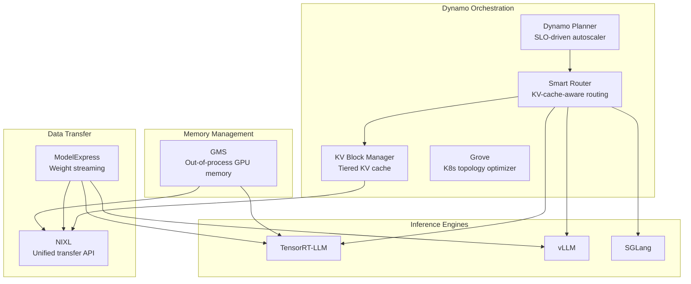

# 1. Background and Motivation

[< Back to Overview](README.md)

> **Lifecycle note:** [§18](18-gms-integration-gaps-and-pr-plan.md) is the current source of truth. Promotion keeps
> immutable weights RO, uses existing sleep/wake, and does not claim the <5-second SLO until M3. Conflicting lifecycle
> or timing statements below are historical context.

## ModelExpress (MX)

ModelExpress is a Rust-based service from the Dynamo ecosystem that coordinates GPU-to-GPU model weight transfers across a cluster:

- **Single-source download**: Only one pod downloads from HuggingFace; others receive via P2P
- **RDMA transfers**: Uses NIXL/UCX for high-speed GPU-to-GPU transfer (~15s for 681GB DeepSeek-V3)
- **Content-addressed coordination**: SHA256-based source identity ensures compatible transfers
- **Three-tier fallback**: RDMA -> GPUDirect Storage -> Disk
- **Metadata backends**: Redis or Kubernetes CRD

**Architecture — Three components:**
- `modelexpress_server` — gRPC service with pluggable metadata backends
- `modelexpress_client` — CLI and Python SDK for cache operations
- `modelexpress_common` — Protobuf definitions and shared configuration

**Integration status across frameworks:**
| Framework | MX Status | Load Format |
|:----------|:----------|:------------|
| **vLLM** | **Shipped** | `--load-format mx` |
| **SGLang** | Roadmap | — |
| **TensorRT-LLM** | Proto declared, not implemented | `BACKEND_FRAMEWORK_TRT_LLM = 3` in proto |

**Repository:** https://github.com/ai-dynamo/modelexpress

## GPU Memory Service (GMS)

GMS is an out-of-process GPU memory manager that decouples GPU memory lifecycle from process lifecycle:

- **Crash resilience** (primary value): Memory persists when worker crashes; new worker imports existing memory in ~100ms instead of reloading from storage (minutes)
- **Shadow failover**: Shadow workers pre-import weights via RO zero-copy; on primary failure, activate in <5s (lock upgrade + KV cache alloc + executor start)
- **Zero-copy sharing**: Active and shadow workers share the same GPU memory for model weights on the same GPU (per-GPU, not cross-GPU — CUDA VMM constraint)
- **Socket-based locking**: Connection IS the lock; automatic release on crash
- **CUDA VMM integration**: Uses `cuMemExportToShareableHandle` / `cuMemImportFromShareableHandle` for FD-based memory sharing
- **Per-GPU, per-tag deployment**: Each GMS server manages exactly one GPU. On an 8-GPU node, 16 independent GMS processes run (one `weights` + one `kv_cache` per GPU). Socket paths use GPU UUID for stability across `CUDA_VISIBLE_DEVICES` configs.

> **Scope of sharing:** GMS sharing is between multiple **processes** on the **same GPU** (e.g., active worker + shadow standby), not between GPUs. For large models (70B+), the realistic multi-process scenario is active + shadow for failover, not multiple active serving instances (which wouldn't fit in GPU memory). For smaller models or multi-LoRA setups, multiple active instances sharing a base model is possible but niche.

> **Terminology note:** "GPU Memory Service" (GMS) is the name used by the Dynamo team for the out-of-process GPU memory management component. The [prototype integration with TRT-LLM](https://github.com/ai-dynamo/dynamo/pull/7053) (PR #7053) demonstrates RW/RO weight loading, sleep/wake KV cache release, and shadow failover using the GMS client API. That PR also surfaced a concrete `post_load_weights()` / module-path-resolution bug when importing weights for models with aliased layers (e.g., `LlamaForCausalLM.next_attn`) — see [Challenges](05-challenges.md) section 7. This proposal uses "GMS" consistently to refer to this GPU Memory Service component. **API stability remains a key risk — see [Risk Assessment](12-risks.md).**

**Repository:** GMS lives within the Dynamo monorepo at [`lib/gpu_memory_service/`](https://github.com/ai-dynamo/dynamo/tree/main/lib/gpu_memory_service)

**Prototype:** https://github.com/ai-dynamo/dynamo/pull/7053 — demonstrates:
- GMS-backed weight loading for TRT-LLM (`_load_read_mode` with `materialize_module_from_gms`)
- Sleep/wake with `release_with_tag("kv_cache")` / `materialize_with_tag("kv_cache")` for KV cache release without affecting GMS-managed weights
- Shadow failover e2e test (`test_gms_shadow_failover_trtllm.py`)
- Local sleep/wake fallback for non-Ray executors when collective RPC is unavailable

## Dynamo Ecosystem Context

MX and GMS are components of NVIDIA Dynamo, a datacenter-scale distributed inference framework.

**Repositories:**
| Component | Repository |
|:----------|:-----------|
| **Dynamo** (orchestration, GMS, routing) | https://github.com/ai-dynamo/dynamo |
| **ModelExpress** (weight streaming) | https://github.com/ai-dynamo/modelexpress |
| **GMS** (GPU memory service) | [`lib/gpu_memory_service/`](https://github.com/ai-dynamo/dynamo/tree/main/lib/gpu_memory_service) within Dynamo monorepo |
| **NIXL** (transfer API) | https://github.com/ai-dynamo/nixl |

## TensorRT-LLM Current Architecture (Relevant Extension Points)

TRT-LLM's `ModelLoader.load()` has two independent axes that MX and GMS map onto naturally (see [Implementation & API Design](04-implementation-plan.md#design-principle-two-orthogonal-axes) for full rationale):

| Axis | Controlled by | Current values | MX/GMS maps to |
|:-----|:-------------|:---------------|:----------------|
| **Weight source** | `checkpoint_format` → `@register_checkpoint_loader` | `"HF"`, `"mistral"` | MX: new `"MX"` checkpoint format |
| **Loading mode** | `LoadFormat` enum → branches in `ModelLoader.load()` | `AUTO`, `DUMMY`, `VISION_ONLY` | GMS: new `LoadFormat.GMS` branch |

Additional existing hooks:

| Extension Point | Location | Used by |
|:---------------|:---------|:--------|
| `virtual_memory_scope(tag)` | Memory management | GMS sleep/wake tag mapping |
| `release_with_tag()` / `materialize_with_tag()` | Memory management | VMM-level KV cache release during sleep/wake (allocator lifecycle, not KV cache storage — see [§09](09-kv-cache-extension.md)) |
| KV Cache Connector API | `kv-cache-connector.md` | Future KV cache persistence via KVBM (out of scope for this proposal — see [§09](09-kv-cache-extension.md)) |

**Extension points to be added in TRT-LLM:**
- `@register_checkpoint_loader("MX")` — new MX checkpoint loader (weight source axis)
- `LoadFormat.GMS` branch in `ModelLoader.load()` — GMS memory management (loading mode axis)
- Post-load callback for MX source registration (between `model.load_weights()` and `post_load_weights()`)

> **Note:** Several capabilities that might appear to require new TRT-LLM code are actually already provided by the MX and GMS client libraries:
> - **GPU memory allocator**: GMS provides a `CUDAPluggableAllocator` + `MemPool` via `torch.cuda.use_mem_pool()`; TRT-LLM only needs to wrap the model loading call inside this context manager.
> - **Tensor enumeration for P2P**: GMS's `register_module_tensors()` already walks model parameters/buffers and records metadata during its write-path commit. For MX, the MX client SDK handles NIXL registration given tensor pointers.
> - **CUDA VMM FD import/export**: GMS's `cuda_utils.py` already implements `cuMemImportFromShareableHandle` / `cuMemExportToShareableHandle`. TRT-LLM should not reimplement these.
