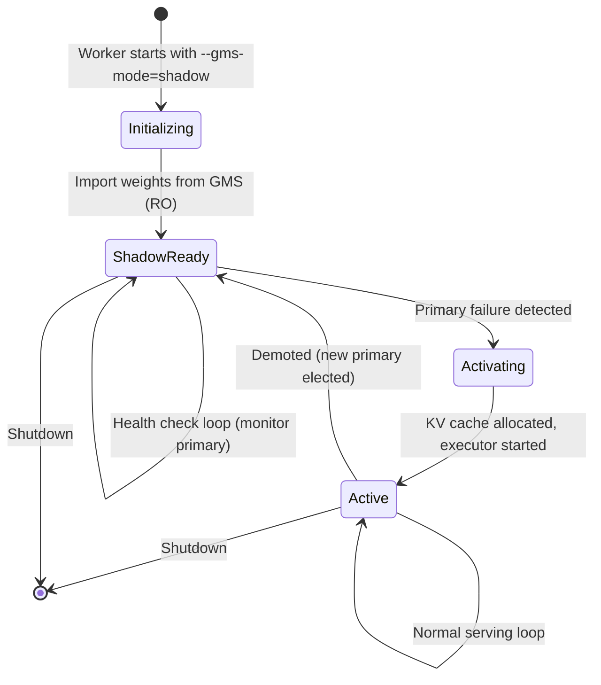
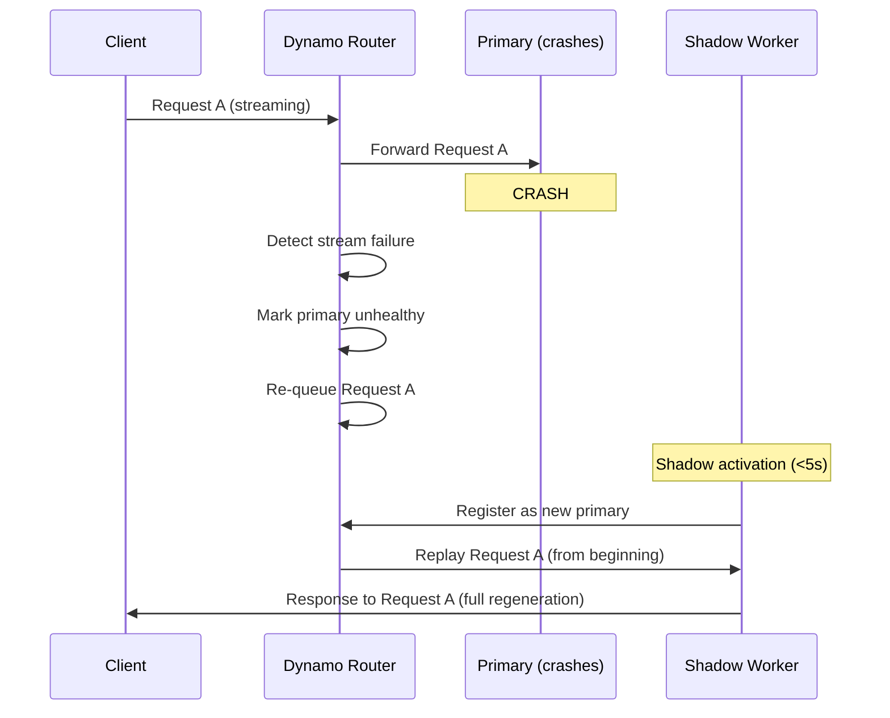

# 6. Executor Integration and Failover

[< Back to Overview](README.md)

> **Superseded design:** Use [§18](18-gms-integration-gaps-and-pr-plan.md) for implementation. Do not implement the
> public `SHADOW`/`ACTIVATING` state machine or an RO-to-RW weight upgrade described below. TensorRT-LLM extends its
> existing sleep/wake and admission control; Dynamo or a launcher owns `flock`, discovery, and supervision.

> **This section is new** — the original proposal underspecified how shadow failover interacts with TRT-LLM's executor loop. This is the hardest part of the integration and requires careful design. Unlike the weight loading integration where much of the functionality is provided by MX/GMS libraries, **the executor integration is almost entirely new TRT-LLM code** — the GMS library only provides the lock primitives (`GMSClientMemoryManager.connect(lock_type=...)` to acquire RO/RW; `mgr.unmap_all_vas()` + `mgr.abort()` + reconnect-RW + `remap_all_vas()` to upgrade RO→RW); all shadow lifecycle management, health checking, and executor state transitions are TRT-LLM responsibilities.

## The Challenge

TRT-LLM's `PyExecutor` (`py_executor.py`, ~3,750 lines) has three execution loops:
- `_executor_loop` — standard
- `_executor_loop_overlap` — CPU/GPU overlap (default)
- `_executor_loop_pp` — pipeline parallel

A shadow worker must maintain model weights in GPU memory (via GMS RO import) but NOT actively run the executor loop or allocate KV cache. On primary failure, it must:
1. Detect the failure
2. Upgrade GMS lock (RO -> RW)
3. Allocate KV cache
4. Start the executor loop
5. Register with the router
6. Begin serving — all in <5s

## Shadow Worker Lifecycle



## Shadow Mode Implementation

### New PyExecutor State: `SHADOW`

```python
# Addition to py_executor.py

class ExecutorState(Enum):
    INITIALIZING = "initializing"
    ACTIVE = "active"
    SHADOW = "shadow"         # New: weights loaded, no KV cache, no serving
    ACTIVATING = "activating"  # New: transitioning shadow -> active
    SHUTTING_DOWN = "shutting_down"

class PyExecutor:
    def __init__(self, ..., shadow_mode: bool = False):
        self._state = ExecutorState.SHADOW if shadow_mode else ExecutorState.INITIALIZING
        self._gms_backend = None  # Set if load_format involves GMS

    def _shadow_loop(self):
        """Background loop for shadow workers. Lightweight — no GPU work."""
        while self._state == ExecutorState.SHADOW:
            # 1. Monitor primary health
            if not self._check_primary_health():
                self._activate_from_shadow()
                return

            # 2. (No explicit GMS heartbeat needed — the unix socket
            #     connection is the lock; OS-level keepalives suffice.
            #     Tracked as GMS-3 in §15: optional peek RPC could give us
            #     a cheaper health signal here.)

            time.sleep(0.5)  # 500ms health check interval

    def _activate_from_shadow(self):
        """Transition from shadow to active. Target: <5s total."""
        self._state = ExecutorState.ACTIVATING
        t0 = time.perf_counter()

        # Step 1: Upgrade GMS lock (RO -> RW) — ~10-50ms
        # The current GMS API doesn't expose a single upgrade_lock() call;
        # instead: unmap_all_vas() + abort() + connect(RW) + remap_all_vas().
        # Wrap this in GMSBackend.upgrade_to_rw() once the protocol grows
        # the method.
        if self._gms_backend:
            self._gms_backend.upgrade_to_rw()  # see GMSBackend extension

        # Step 2: Allocate KV cache — ~1-3s (depends on cache size)
        self._resource_manager.allocate_kv_cache()

        # Step 3: Cache-warm warmup — ~0.5-2s (see [§07 Tiered Compile Cache](07-compile-cache.md))
        # Loads compiled kernels from GMS compile_cache tag or disk cache,
        # then recaptures CUDA graphs with the new KV cache addresses.
        self._cache_warm_warmup()

        # Step 4: Initialize scheduler state — ~10ms
        self._scheduler.reset()

        # Step 5: Start executor loop — ~100ms
        self._state = ExecutorState.ACTIVE
        self._start_executor_loop()

        # Step 6: Register with router — ~100ms
        self._register_with_router()

        elapsed = time.perf_counter() - t0
        logger.info(f"Shadow activation completed in {elapsed:.2f}s")
```

### Mapping to Existing Sleep/Wake

TRT-LLM already has `release_with_tag()` / `materialize_with_tag()` for memory lifecycle. The [GMS prototype PR #7053](https://github.com/ai-dynamo/dynamo/pull/7053) validates this mapping: sleep releases the `kv_cache` tag via virtual-memory tagged operations while keeping GMS-managed weights untouched, and wake re-materializes the KV cache. The PR also adds a local fallback path for non-Ray executors when collective RPC is unavailable. GMS maps onto this:

```python
# Shadow worker initialization (Phase 2 startup)
def _init_shadow_with_gms(self):
    """Initialize shadow worker using GMS RO import."""

    # Import model weights from GMS — zero-copy.
    # The GMSBackend adapter wraps the upstream
    # materialize_module_from_gms(mgr, model, device_index=N) call.
    self._model_engine.model = self._gms_loader.import_model(
        gms_backend=self._gms_backend,
        model_class=self._model_class,
        config=self._config,
    )

    # Do NOT allocate KV cache — shadow doesn't serve
    # The KV cache tag is "released" by not being allocated
    # On activation, materialize_with_tag("kv_cache") equivalent = allocate fresh

    # Model weights are "materialized" via GMS import
    # On deactivation, release_with_tag("weights") = release GMS RW lock
```

The GMS library convention uses `tag="weights"` for model weights and `tag="kv_cache"` for the KV cache (see [`gpu_memory_service.integrations.common.utils.GMS_TAGS`](https://github.com/ai-dynamo/dynamo/blob/main/lib/gpu_memory_service/integrations/common/utils.py#L20)).

| TRT-LLM Sleep/Wake | GMS Library Call | TRT-LLM Code | When |
|:-------------------|:----------------|:-------------|:-----|
| `materialize_with_tag("weights")` | `materialize_module_from_gms(mgr, model, device_index=N)` | Orchestration only (delegates to library) | Shadow init, activation |
| `release_with_tag("weights")` | `mgr.unmap_all_vas()` + `mgr.abort()` | Orchestration only | Demotion, shutdown |
| `materialize_with_tag("kv_cache")` | None (pure TRT-LLM) | `resource_manager.allocate_kv_cache()` | Activation only |
| `release_with_tag("kv_cache")` | None (pure TRT-LLM) | `resource_manager.release_kv_cache()` | Demotion, shutdown |
| `materialize_with_tag("compile_cache")` | `materialize_module_from_gms(mgr, ..., tag="compile_cache")` (when supported) | Deserialize artifacts | Shadow activation |
| `release_with_tag("compile_cache")` | `mgr.unmap_all_vas()` + `mgr.abort()` | Orchestration only | Demotion, shutdown |

## Shadow Activation Budget

| Step | Time |
|:-----|:-----|
| GMS lock upgrade (RO → RW) | ~10ms |
| KV cache allocation | ~1-3s |
| Cache-warm warmup (see [§07 Tiered Compile Cache](07-compile-cache.md)) | ~0.5-2s |
| Scheduler reset | ~10ms |
| Executor start | ~100ms |
| Router registration | ~100ms |
| **Total** | **~2-5.5s** |

The <5s target requires a warm compile cache. Without it, activation warmup adds ~16s (autotuner + CUDA graph capture) on v3 code — see [§07 Tiered Compile Cache](07-compile-cache.md) for the tiered cache design and [§11 Results & Analysis](11-results-analysis.md) for measured warmup numbers.

## In-Flight Request Handling During Failover

When the primary crashes, in-flight requests are lost on that worker. The system handles this at the router level:



**Key design decisions:**
1. **No partial state recovery for in-flight requests.** Recovering mid-generation state would require checkpointing the KV cache and generation position for every request — excessive overhead for the common case. Instead, re-queue and regenerate.
2. **KV cache is reconstructed via prefix caching.** If the shadow has the same prefix cache (e.g., system prompts), re-queued requests hit the prefix cache and skip re-encoding the common prefix. This makes regeneration much faster than cold-start.
3. **Clients see a brief interruption.** Streaming responses pause during the ~5s failover window. Non-streaming requests may time out and need client-side retry.

## Future Enhancement: KV Cache Checkpoint via KVBM

For workloads where in-flight request recovery matters (e.g., long-running agentic sessions), a future enhancement could checkpoint KV cache state — but via **KVBM, not GMS**. KV cache is out of GMS's scope (see [§09 KV Cache Extension Path](09-kv-cache-extension.md) for the division of labor):

```
Primary Worker:
  - KV Cache Manager V2 pushes blocks to KVBM via the KV Cache Connector API
  - KVBM tiers them across HBM / DRAM / NVMe with per-request metadata

Shadow Activation:
  - New primary pulls warm blocks from KVBM via the Connector API
  - Resume generation from the last persisted block
  - Client sees minimal interruption
```

This is Phase 4+ work and tracks the Dynamo KVBM roadmap, not the MX/GMS schedule. See [§09 KV Cache Extension Path](09-kv-cache-extension.md).

## Health Check Protocol

```python
class ShadowHealthChecker:
    """Monitors primary worker health for shadow takeover decision."""

    def __init__(self, primary_endpoint: str, check_interval: float = 0.5):
        self.primary_endpoint = primary_endpoint
        self.check_interval = check_interval
        self.consecutive_failures = 0
        self.failure_threshold = 3  # 3 consecutive failures = takeover

    def check_primary_health(self) -> bool:
        """Returns True if primary is healthy."""
        try:
            response = requests.get(
                f"{self.primary_endpoint}/health",
                timeout=1.0,
            )
            if response.status_code == 200:
                self.consecutive_failures = 0
                return True
        except (requests.Timeout, requests.ConnectionError):
            pass

        self.consecutive_failures += 1
        if self.consecutive_failures >= self.failure_threshold:
            logger.warning(
                f"Primary unhealthy: {self.consecutive_failures} consecutive failures"
            )
            return False
        return True  # Not yet past threshold
```

## Interaction with Overlap Scheduler

The overlap scheduler (`_executor_loop_overlap`) uses a `previous_batch` staging pattern. Shadow activation must handle this correctly:

1. Shadow starts with **no** `previous_batch` (fresh state)
2. First iteration after activation runs `_executor_loop_overlap` from clean state
3. The overlap scheduler naturally handles the cold-start case (no previous batch to process)
4. No special handling needed — this is the same as a fresh executor start

For pipeline parallel (`_executor_loop_pp`), the shadow must coordinate across PP ranks during activation. All shadow workers for a PP group must activate simultaneously — the health check should be coordinated via the existing process group.

---

## Restart-After-Death Failover (Cold Standby)

Everything above describes **shadow failover** — a *pre-warmed standby process* that holds weights via GMS-RO and is promoted to RW on primary death. That model targets sub-5-second activation but requires:

- A second worker process running idle alongside the primary
- The §07 tiered compile cache to stay inside the activation budget
- Substantial new executor-layer state machinery (the diagram and code earlier in this section)

There is a **simpler failover model** that PR #13926's `LoadFormat.GMS` already enables end-to-end with **no new TRT-LLM code**: rather than keeping a hot standby running, accept that the worker dies and let an external supervisor restart it. The replacement worker is a *fresh process* that connects to the *surviving GMS daemon* and zero-copy materializes the already-committed weights. No prior worker state survives — only the daemon's pool does.

This pattern is operationally what most TRT-LLM users will reach for first because it composes with the same supervisor primitives they already use (systemd, K8s Deployments, Dynamo replica scheduling). It does not require sleep/wake, does not require the shadow lifecycle state machine, and works on `main` today.

### Failover Modes Compared

| Property | Shadow failover (§06 above) | Restart-after-death (this section) | Cold from scratch |
|----------|------------------------------|------------------------------------|-------------------|
| **Standby cost** | One running process per shadow, ~0 GPU bytes for weights (mapped RO), full host RAM footprint | Zero processes between failures | Zero |
| **Activation latency target** | <5 s (with tiered compile cache) | ~5–45 s (depends on warmup cache state) | Full S2 cold-start: 75–390 s |
| **What survives across failure** | Weights in GMS pool; shadow process itself (alive, idle) | Weights in GMS pool only | Nothing |
| **Per-failure recovery work** | RO→RW upgrade + KV alloc + warmup-from-cache | Fresh process boot + GMS RO connect + KV alloc + warmup | Full disk load + KV alloc + warmup |
| **Needs sleep/wake** | Yes (for KV cache on standby) | No | No |
| **Needs §07 compile cache** | Required to hit <5 s | Optional (just reduces post-restart warmup) | Same as today |
| **Needs new executor state machine** | Yes — see "Shadow Worker Lifecycle" above | No | No |
| **Status of code** | Designed only, not built | **Working in PR #13926 today, given daemon orchestration** | Always available |

For most production deployments, **restart-after-death is the right starting point.** Shadow failover is a latency optimization on top — useful when the 5–45 s restart gap is intolerable (e.g., per-request SLO-bound chat workloads), unnecessary otherwise.

### Mechanics

What happens when the primary dies, step by step:

```
t0   Primary worker A is serving traffic.
     A holds an RW session against the GMS daemon (per-GPU, per-tag).
     Daemon has committed weights in its pool.
     RO peers (if any) hold mappings into that pool.

t1   Primary A dies (segfault, OOM-kill, scheduler eviction, …).
     A's process terminates. Its CUDA context is reclaimed by the driver.
     A's KV cache (if it was using virtual_memory_scope) is gone with the process.
     The GMS daemon, being a separate process, is unaffected.

t2   GMS daemon observes the writer socket close.
     ⚠️ The daemon's behavior here is load-bearing for this pattern:
        (a) commit-survives-writer: pool stays committed for new RO clients.   ← we need this
        (b) commit-tied-to-writer:  daemon revokes commit on writer disconnect. ← breaks failover
     This is the single most important upstream question to confirm.

t3   External supervisor (systemd, K8s, Dynamo, …) observes A is gone
     and starts replacement worker B with the same model, same socket path,
     and same tag. B is configured with --load-format=gms --gms-mode=auto.

t4   B's GMSBackend.connect() opens the socket, requests RW_OR_RO.
     Daemon sees the existing commit, grants RO.
     B's model_loader.py takes the RO branch (model_loader.py:543–553):
       - post_load_weights() wires aliases
       - materialize_module_from_gms() zero-copy maps weights from the
         daemon's pool into B's parameter buffers.
     Weight materialize cost: ~100 ms (no disk I/O, no per-instance copy).

t5   B allocates its own KV cache (per-process), runs warmup, registers
     with the router, begins serving.
```

The total budget for `t1`→`t5` is:

| Phase | Cost |
|-------|------|
| Supervisor detects death and restarts | 1–5 s (orchestrator-dependent) |
| Process boot (Python init, MPI, CUDA context) | 1–3 s |
| GMS connect + RO materialize | ~0.1–0.5 s |
| KV cache allocation | ~1–3 s |
| Warmup (cold compile cache) | ~16–43 s (v3 baseline) |
| Warmup (warm compile cache via §07) | ~0.5–2 s |
| **Total without §07** | ~20–55 s |
| **Total with §07** | ~5–10 s |

So restart-after-death plus the §07 tiered compile cache gives a ~5–10 s failover budget without ever running a shadow worker. That is the **realistic near-term target** for self-managed TRT-LLM+GMS deployments.

### Gaps Today

Sorting by who owns the fix:

#### Owned by TRT-LLM

| Gap | Severity | Where |
|-----|----------|-------|
| `GMSBackend.connect()` returns False on socket failure but does not retry. A fast supervisor restart can race the daemon's socket reset. | Medium | `_torch/memory/gpu_memory_backend.py`: add bounded retry with exponential backoff (~15 LOC). |
| `connect()` collapses "daemon down" and "daemon up but no commit" into one boolean. Replacement workers can't distinguish "I should wait" from "I should give up and reload." | Low–medium | Surface granted lock type / error code distinctly. |
| Destructor ordering in `PyTorchModelEngine.__del__` (review issue #1 on PR #13926) becomes more important: a crashed worker that doesn't fully evict can leave stale per-tag registry entries that confuse the next worker. | Medium | Reverse destructor order; expose deterministic shutdown. |
| No daemon-liveness watchdog inside the worker. If the daemon dies while RO workers are mapped, the workers hold dangling pointers with no clean error. | Medium–low | Background liveness probe; SIGTERM the worker on daemon loss. Out of scope for #13926. |
| No integration with `LLM.sleep/wake` (#14052). See "Composition with sleep/wake" below. | None for this pattern | n/a |

#### Owned by `gpu_memory_service` upstream (ai-dynamo/dynamo)

| Gap | Severity |
|-----|----------|
| Daemon must retain commit when the RW writer's socket disconnects (no explicit `evict` call). **Load-bearing assumption — confirm before claiming failover works.** | Critical |
| Orphan-rescue: if the writer dies between allocation and `finalize_write`, a replacement should be able to either complete the orphan commit or reclaim the reservation cleanly. | Medium |
| Configurable TTL/eviction for committed pools with no RO peers, to bound the "writer died, nobody noticed" case. | Low |

#### Owned by orchestration

| Gap | Severity |
|-----|----------|
| **Daemon must be a node-level service, not a worker subprocess.** Otherwise it dies with the worker and the whole pattern collapses. | Critical |
| Worker restart must use the **same** socket path and tag. A fresh path means a fresh pool (full reload). | Critical |
| Supervisor must distinguish "worker died, daemon healthy" from "daemon died, all workers need restart." Otherwise cascade-restart. | Medium |
| Compile cache persistence across worker restarts (disk-backed today). | Medium (gates the <10 s target) |

### Composition with Sleep/Wake (#13918, #14052)

`LLM.sleep([tags])` from PR #14052 operates on TRT-LLM's `_torch.virtual_memory` tag manager. It releases physical CUDA pages via `cuMemUnmap` for any allocations registered with the given tag inside a `virtual_memory_scope` block.

`LoadFormat.GMS` weights are **not** registered with the `virtual_memory` tag manager. They live in the GMS daemon's pool, mapped into the worker process via `gms_use_mem_pool(tag, device)`. As a result, `LLM.sleep(["weights"])` on a GMS-RO worker is a silent no-op — the tag manager finds nothing to release.

This **does not affect** restart-after-death failover, which doesn't involve sleep/wake at any step. It **does affect** the shadow failover design (§06 above), where the shadow worker would ideally sleep its KV cache between failures while keeping weights mapped. The KV-cache half works today; the weight half does not need to.

Three implementation tiers for closing the weight-side composition (only relevant for shadow failover, online weight update, and similar advanced flows — not needed for restart-after-death):

| Tier | Approach | Effort | Value |
|------|----------|--------|-------|
| **A. Block and document** | `validate_gms_sleep_compat`: reject `sleep_config.restore_modes` keys that map to `MODEL_WEIGHTS_*` when `load_format == GMS`. Surfaces the silent-no-op as a loud `ValueError`. | ~20 LOC in `llm_args.py` | Eliminates the footgun. No actual sleep capability for GMS weights. |
| **B. Heavy reconnect bridge** | `GMSBackend.release/materialize` does full session evict + reconnect + re-materialize. Slow (~1 s round-trip) and racy under concurrent peers. | ~150 LOC | Works but rarely worth using. |
| **C. True bridge** | Upstream GMS adds `park()`/`unpark()` primitives. TRT-LLM's `virtual_memory` tag manager grows a delegate so `release_with_tag` routes through the backend. | ~50 LOC TRT-LLM + upstream feature | Real cheap sleep/wake on GMS weights. Long pole is upstream. |

**Recommendation for PR #13926:** add Tier A. Defer B/C until shadow failover work is staffed. Track as a §14 open question.

### Self-Managed Deployment Recipe (No Dynamo)

Concrete steps for a TRT-LLM user who wants `LoadFormat.GMS` + restart-after-death failover without running Dynamo.

#### Prerequisites

- `gpu_memory_service` installed (from source — no PyPI yet; tracked as GMS-6 in §14).
  ```bash
  git clone https://github.com/ai-dynamo/dynamo
  pip install ./dynamo/lib/gpu_memory_service
  ```
- TRT-LLM built with PR #13926's `LoadFormat.GMS` support.
- A model checkpoint accessible to at least the first worker.
- Local filesystem (tmpfs, ext4) for the GMS Unix sockets — **not NFS**.

#### Step 1: Run the GMS daemon as a node-level service

Pick a socket path convention. One daemon per GPU is the simplest model. For 8 GPUs you'd run 8 daemons; for a single GPU one daemon.

**systemd unit example** (`/etc/systemd/system/gms-daemon@.service`):

```ini
[Unit]
Description=GPU Memory Service daemon for GPU %i
After=network.target

[Service]
Type=simple
User=trtllm
Environment="CUDA_VISIBLE_DEVICES=%i"
ExecStart=/usr/local/bin/gpu-memory-service-daemon \
    --socket /var/run/gms/gms-%i.sock \
    --device 0
Restart=on-failure
RestartSec=2s

[Install]
WantedBy=multi-user.target
```

Enable per-GPU instances:

```bash
sudo mkdir -p /var/run/gms
sudo chown trtllm:trtllm /var/run/gms
sudo systemctl enable --now gms-daemon@0.service gms-daemon@1.service  # etc.
```

**Kubernetes alternative:** run the daemon as a sidecar container in the same pod as `trtllm-serve`, OR as a DaemonSet that runs once per node. Sidecar is simpler (no cross-pod socket mounting); DaemonSet is more efficient when many workers share one daemon.

#### Step 2: Start the first worker (the writer)

```bash
trtllm-serve <model_repo> \
    --backend pytorch \
    --load-format gms \
    --gms-socket-path /var/run/gms/gms-0.sock \
    --gms-mode rw \
    --gms-tag weights \
    --port 8000
```

Or equivalently via `--config` YAML:

```yaml
load_format: GMS
gms_config:
  socket_path: /var/run/gms/gms-0.sock
  mode: rw
  tag: weights
```

This worker loads from disk and commits to the GMS pool. Expect normal cold-start latency (~75–306 s depending on storage tier) for this *first* boot. The cost is paid once per daemon lifetime, not per worker death.

#### Step 3: Configure the supervisor for restart

For systemd, wrap `trtllm-serve` in its own unit with `Restart=on-failure`:

```ini
[Service]
ExecStart=/usr/local/bin/trtllm-serve <model> \
    --load-format gms \
    --gms-socket-path /var/run/gms/gms-0.sock \
    --gms-mode auto \
    --gms-tag weights \
    --port 8000
Restart=on-failure
RestartSec=5s
# Don't restart trtllm-serve if the GMS daemon is down — handle that explicitly
ConditionPathExists=/var/run/gms/gms-0.sock
```

Note `--gms-mode=auto` on this unit, not `rw`. After the first boot has committed, every subsequent boot (failover restart) goes through the RO branch and zero-copy maps from the surviving daemon.

For Kubernetes, the equivalent is a `Deployment` with `restartPolicy: Always` and a liveness probe against `/health`. Use a `readinessProbe` to keep the worker out of the service load-balancer until it has finished GMS materialize + KV alloc + warmup.

#### Step 4: Verify the failover path

```bash
# 1. Confirm initial RW commit happened
curl -fsS http://localhost:8000/health

# 2. Kill the worker (simulating death)
sudo systemctl kill trtllm-serve.service --signal=SIGKILL

# 3. systemd restarts it within RestartSec. Wait for ready:
until curl -fsS http://localhost:8000/health; do sleep 1; done

# 4. Check the worker's log for "LoadFormat.GMS (RO): materialized weights"
journalctl -u trtllm-serve.service | grep -E "GMS (RW|RO)"
```

The second-boot log should show `LoadFormat.GMS (RO): materialized weights` rather than the cold-load checkpoint-read banner. If you instead see another RW commit, the daemon did not retain commit across the writer's death — that's the load-bearing upstream issue from "Gaps Today" above.

#### Step 5: Multi-model and multi-tag deployments

A single GMS daemon supports multiple tags. To run two different models on the same GPU:

```bash
# Model A's worker
trtllm-serve <model-a> ... --gms-tag model-a-weights

# Model B's worker
trtllm-serve <model-b> ... --gms-tag model-b-weights
```

Tag uniqueness is the user's responsibility — there is no daemon-side content fingerprint. Reusing the same tag for two different model weights will produce undefined behavior; the second worker will RO-map whatever bytes the first committed, regardless of model identity.

#### Caveats and known limits

- **Single-rank only today.** Multi-rank GMS (TP > 1, PP > 1) requires per-rank daemons and coordinated commit across ranks. Not in PR #13926.
- **Daemon survival is the user's job.** Never auto-restart the daemon with the worker (e.g., do not use a `Restart=always` policy that bounces both together). The daemon's lifetime must be a strict superset of the worker's.
- **No automatic daemon health watchdog in the worker.** If the daemon dies while a worker is RO-mapped, the worker holds dangling GPU pointers. The recommended response is to SIGTERM the worker so the supervisor restarts it (it will block at `GMSBackend.connect()` until the daemon comes back).
- **Compile cache is separate from GMS.** Disk-backed compile cache works as it does today, but a fresh worker process re-pays the cold compile cost unless §07's tiered compile cache lands. Plan for ~16–43 s of warmup per restart until then.
- **No sleep/wake support for weights.** See "Composition with Sleep/Wake" above. The validator from Tier A will reject the combination at config-load time.

### Open Questions

Tracked as candidate items for §14:

- **GMS-7 (upstream):** Confirm and document daemon commit semantics on writer disconnect (`commit-survives-writer` vs `commit-tied-to-writer`).
- **GMS-8 (upstream):** Orphan-commit rescue API (writer died mid-commit).
- **GMS-9 (upstream):** Configurable commit TTL with no RO peers.
- **TRTLLM-T1 (TRT-LLM):** Bounded retry in `GMSBackend.connect()` for fast restart cycles.
- **TRTLLM-T2 (TRT-LLM):** Tier-A validator: reject `sleep_config` restore modes targeting MX/GMS-managed weight tags.
- **TRTLLM-T3 (TRT-LLM):** Background daemon liveness watchdog.
- **DEPLOY-1 (documentation):** Promote the recipe above into a TRT-LLM deployment guide once §07 lands.
