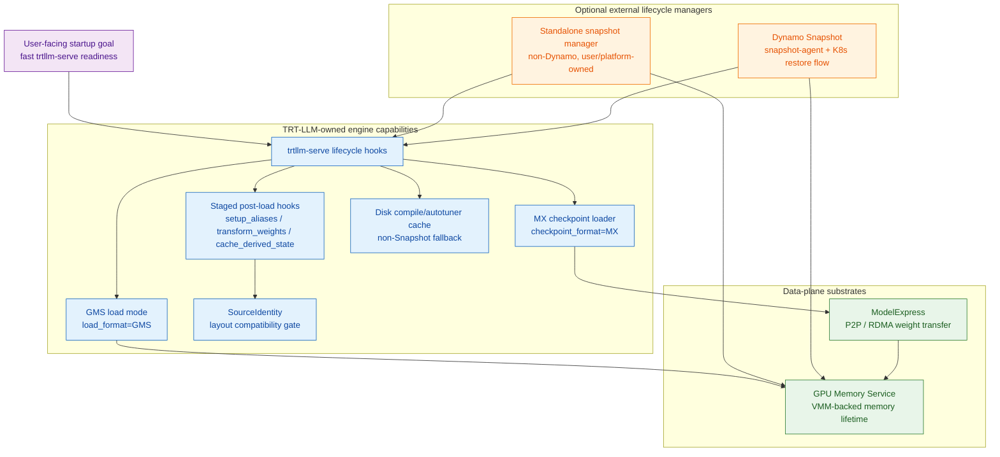
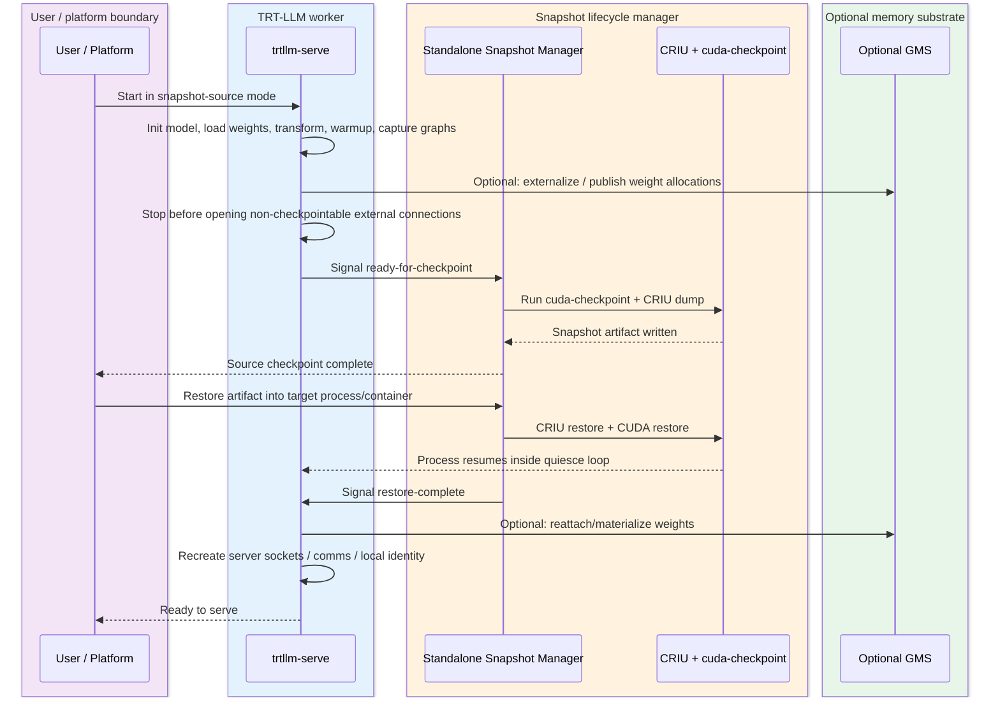
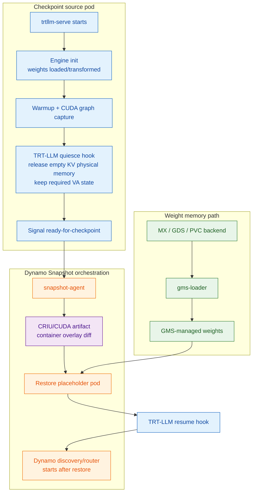

# 17. Snapshot Integration Assessment

[< Back to Overview](README.md)

**Status:** Draft
**Created:** 2026-06-09
**Last updated:** 2026-06-30

> **GMS readiness note:** The native loading structure from PR #13926 is merged, but real RW/RO reuse remains blocked
> on the exact API and SourceIdentity issues in [§18](18-gms-integration-gaps-and-pr-plan.md). Dynamo #7575 provides
> wrapper-level pause/resume evidence, not a complete native failover path.

## TL;DR

Snapshot should be treated as a higher-level fast-start mechanism than MX or GMS, not as a direct replacement for
them.

- **MX** is a weight-transfer mechanism: "How do I get model weights onto this node/GPU without each replica
  hammering storage?"
- **GMS** is a GPU-memory lifetime and virtual-memory mechanism: "How do I keep or materialize weight memory outside
  the worker process, at addresses the engine can safely use?"
- **Snapshot** is a process/container checkpoint-restore mechanism: "How do I resume a fully initialized, warmed
  inference worker instead of replaying initialization?"

For large TRT-LLM deployments, these components are complementary:

```text
Snapshot restores the warm process.
GMS externalizes and reattaches large GPU weight allocations.
MX can populate GMS-managed weight memory across nodes.
TRT-LLM staged post-load hooks and SourceIdentity make transformed-weight reuse safe.
```

The ownership boundary should be:

```text
TRT-LLM owns engine-level fast-start capabilities and standalone trtllm-serve wiring.
Dynamo owns cluster-level Snapshot orchestration when users deploy through Dynamo.
```

This means TRT-LLM should continue building an out-of-the-box non-Dynamo fast-start path for `trtllm-serve`, while
also exposing hooks that Dynamo Snapshot can call without special-case engine hacks.

## Context and Goal

The existing MX/GMS design targets two audiences:

1. **Non-Dynamo TRT-LLM users** running `trtllm-serve` or the PyTorch executor directly. They need startup-speed
   improvements without adopting the Dynamo control plane, router, Kubernetes agents, or Snapshot workflow.
2. **Dynamo TRT-LLM users** who want TRT-LLM to participate cleanly in Dynamo's orchestration stack. TRT-LLM
   features should not block Dynamo integration; ideally they should become the reusable engine hooks that Dynamo
   consumes.

The question this note answers is:

> Should TRT-LLM keep pursuing MX/GMS integration if Dynamo Snapshot can accelerate startup, and can Snapshot itself
> be integrated with TRT-LLM without depending on Dynamo?

The answer is yes to both, with careful layering. Snapshot can technically be integrated with TRT-LLM without the
Dynamo control plane, but it still requires an external privileged checkpoint/restore manager. MX and GMS remain
valuable as standalone TRT-LLM capabilities and as the data-plane substrate for Snapshot.

## Related PRs and References

This note sits on top of the existing MX/GMS PR sequence. The table records why each item matters to the Snapshot
positioning question; it is not intended to replace the detailed status tracking in [§15](15-prototype-validation-plan.md)
or [§16](16-staged-post-load-hooks.md).

| Reference | Area | Why it matters here |
|:--|:--|:--|
| [TRTLLM-11851 / PR #13531](https://github.com/NVIDIA/TensorRT-LLM/pull/13531) | MX-only TRT-LLM support | Adds `checkpoint_format="MX"` and the MX checkpoint loader for `trtllm-serve`; this is the standalone cross-node weight-transfer path Snapshot should not replace. |
| [TRTLLM-12440 / PR #13926](https://github.com/NVIDIA/TensorRT-LLM/pull/13926) | GMS-only TRT-LLM support | Adds `LoadFormat.GMS` / GMS RW-RO weight sharing; this is the standalone same-GPU reuse path and the memory substrate Snapshot can consume. |
| [PR #13045](https://github.com/NVIDIA/TensorRT-LLM/pull/13045) | MX + GMS prototype | Original integrated prototype and validation vehicle; useful for understanding the intended combined mode and why MX cannot yet write directly into GMS-managed buffers. |
| [PR #12898](https://github.com/NVIDIA/TensorRT-LLM/pull/12898) | MX-team presharded prototype | Earlier MX proposal using `LoadFormat.PRESHARDED`; motivates keeping "weight source" and "memory mode" as separate axes. |
| [PR #12407](https://github.com/NVIDIA/TensorRT-LLM/pull/12407) | Warmup orchestration | Introduced the v3 warmup floor discussed in [§07](07-compile-cache.md); explains why non-Snapshot MX/GMS still need compile-cache mitigation. |
| [TRTLLM-13077](16-staged-post-load-hooks.md#prep-pr--trtllm-13077-awaiting-review) | Staged post-load hooks | Decomposes `post_load_weights()` into alias setup, weight transform, and derived-state caching so MX/GMS/Snapshot can reuse transformed weights safely. |
| [TRTLLM-13141](16-staged-post-load-hooks.md#status-assessment-2026-06-03) | SourceIdentity gate | Adds the compatibility check needed before any receiver accepts post-transform weight bytes from MX, GMS, or Snapshot-adjacent artifacts. |
| [PR #14151 discussion](05-challenges.md#7-module-path-resolution-gms-specific) | MX publish-pre vs publish-post | Surfaced the same double-transform hazard from the MX side that staged hooks solve. |
| [ai-dynamo/dynamo PR #7053](https://github.com/ai-dynamo/dynamo/pull/7053) | GMS TRT-LLM prototype | Demonstrates GMS-backed TRT-LLM loading, sleep/wake, and the alias-resolution issue that led to staged hooks. |
| [ai-dynamo/dynamo PR #7575](https://github.com/ai-dynamo/dynamo/pull/7575) | GMS API stabilization | Establishes the merged GMS API shape that TRT-LLM integration should call rather than monkey-patching `ModelLoader`. |
| [Dynamo Snapshot blog](https://github.com/ai-dynamo/dynamo/blob/3ed7ef1f2f6237f50bb035c7859e8b315459dc36/docs/blogs/dynamo-snapshot/dynamo-snapshot.md) | Snapshot design | Defines the CRIU + CUDA checkpoint + GMS Snapshot approach this assessment compares against MX/GMS. |

## Terminology

### ModelExpress (MX)

MX is the cross-node weight distribution path. It can move model weights from a warm source to a new replica via
P2P/RDMA instead of requiring every replica to load independently from shared storage.

In TRT-LLM terms, MX maps naturally to the **weight source** axis:

```text
checkpoint_format="MX"
```

MX primarily reduces:

- shared-storage pressure
- external model download duplication
- cold-start time for the Nth replica when a warm source exists

MX does not by itself skip model construction, `post_load_weights()`, warmup, autotuning, or CUDA graph capture.

### GPU Memory Service (GMS)

GMS is the GPU memory lifetime and sharing substrate. It moves ownership of selected GPU allocations outside the
worker process and exposes those allocations through CUDA virtual-memory mechanisms.

In TRT-LLM terms, GMS maps naturally to the **memory management / load mode** axis:

```text
load_format="GMS"
```

GMS primarily enables:

- same-GPU zero-copy weight import for shadow or restarted workers
- crash-resilient weight memory
- sleep/wake-style release and re-materialization of tagged memory
- Snapshot-friendly externalization of weights from the process checkpoint

GMS does not by itself distribute weights across nodes. It also does not skip engine warmup unless paired with a
compile cache or Snapshot.

### Snapshot

Snapshot is a process/container checkpoint-restore workflow. In the Dynamo design, it uses CRIU, CUDA checkpointing,
Kubernetes placeholder pods, a host-level `snapshot-agent`, and workload quiesce/resume hooks.

**CRIU** means **Checkpoint/Restore In Userspace**. It is the Linux userspace tool that captures and restores the
host-side process tree state: CPU memory mappings, threads, file descriptors, namespaces, and other kernel-visible
state. CRIU does not understand CUDA device state by itself. In Snapshot, CRIU is paired with CUDA checkpointing
(`cuda-checkpoint` / CUDA driver support), which handles GPU-side state such as CUDA contexts, streams, device memory,
and virtual address mappings. A useful mental model is:

```text
CRIU = host/Linux process checkpoint.
cuda-checkpoint = CUDA device-state checkpoint.
Snapshot = orchestration that makes the two safe and useful for inference workers.
```

Snapshot primarily reduces:

- Python process initialization
- model construction
- weight binding and post-load transformation replay, when weights are handled correctly
- warmup/autotuning replay
- CUDA graph capture replay
- other engine setup that happened before the checkpoint point

Snapshot is not simply "MX + GMS." It is a higher-level lifecycle mechanism. For large models, however, it needs a
GMS-like mechanism to keep huge weight allocations out of the CRIU image and to restore GPU memory at compatible
virtual addresses. MX can then be the transfer backend that populates the GMS-managed weights on a target node.

## Startup Cost Coverage

The table below shows which component attacks which part of TRT-LLM startup.

| Startup phase | MX | GMS | Compile cache | Snapshot |
|:--|:--:|:--:|:--:|:--:|
| Container/process start | No | No | No | Yes |
| MPI / worker pool initialization | No | No | No | Mostly yes, subject to restore-safe comms |
| Model/config construction | No | No | No | Yes |
| Weight download / storage read | Yes, when a warm source exists | No | No | Yes, if weights are externalized or embedded |
| Weight transfer into GPU memory | Yes | Yes, for local attach/materialize | No | Yes, through embedded CUDA state or GMS |
| `post_load_weights()` transforms | No, unless publishing post-transform | Yes, only by reusing transformed storage | No | Yes, if checkpointed after transforms |
| Warmup / autotuning / compile | No | No | Yes | Yes, if checkpointed after warmup |
| CUDA graph capture | No | No | No, but can make recapture cheaper | Yes, if graph state is restore-safe |
| KV cache allocation | No | Tag/lifecycle support only | No | Can checkpoint after VA reservation and physical release |
| HTTP/gRPC/discovery registration | No | No | No | Must happen after restore or be recreated |

The important implication is:

> Snapshot is the only mechanism that can skip the whole initialized-engine path, but MX and GMS are still needed to
> make Snapshot practical for large models and useful outside Dynamo.

## Component Layering



The diagram intentionally separates **TRT-LLM-owned engine capabilities** from **external lifecycle managers**. TRT-LLM
should not need Dynamo to expose MX, GMS, staged post-load hooks, or cache controls. Dynamo should consume those same
hooks when it runs Snapshot.

## Non-Dynamo TRT-LLM Fast-Startup Path

For standalone `trtllm-serve`, the default product path should remain MX/GMS/compile-cache based:

```mermaid
flowchart LR
    Start["trtllm-serve starts"] --> Init["Construct model<br/>and executor workers"]
    Init --> Source{"Warm weight source?"}
    Source -->|"Yes, cross-node"| MXLoad["MX P2P receive<br/>into TRT-LLM weights"]
    Source -->|"No"| DiskLoad["Disk / HF / PVC load"]
    MXLoad --> PostLoad["Staged post-load<br/>safe transform or skip"]
    DiskLoad --> PostLoad
    PostLoad --> Publish["Optional publish<br/>MX source and/or GMS writer"]
    Publish --> Cache["Load or populate<br/>compile/autotuner cache"]
    Cache --> Graphs["Warmup + CUDA graph capture"]
    Graphs --> Serve["Ready to serve"]

    Publish -.-> Shadow["Same-GPU shadow / restart<br/>GMS RO attach"]
    Shadow -.-> Cache

    classDef trt fill:#e3f2fd,stroke:#1565c0,color:#0d47a1;
    classDef data fill:#e8f5e9,stroke:#2e7d32,color:#1b5e20;
    classDef decision fill:#fffde7,stroke:#f9a825,color:#5f4300;
    classDef ready fill:#ede7f6,stroke:#5e35b1,color:#311b92;
    class Start,Init,PostLoad,Publish,Cache,Graphs trt;
    class MXLoad,DiskLoad,Shadow data;
    class Source decision;
    class Serve ready;
```



This path is valuable because it does not require:

- Kubernetes placeholder pods
- CRIU
- `cuda-checkpoint`
- privileged host agents
- Dynamo router/discovery
- Dynamo control plane

It also gives TRT-LLM users incremental benefits even when a full Snapshot workflow is unavailable:

- MX improves cross-node replica startup when a warm source exists.
- GMS improves same-GPU restart, shadow attach, and sleep/wake behavior.
- Compile/autotuner caches reduce warmup cost when Snapshot is not available.
- Staged post-load hooks unlock transformed-weight reuse for both MX and GMS.

## Can Snapshot Be Integrated Without Dynamo?

Yes, technically. The Dynamo control plane is not required by the concept of process-level checkpoint/restore.
However, a complete Snapshot workflow cannot be purely in-process inside TRT-LLM. Something outside the worker must
coordinate CRIU, CUDA checkpointing, artifact storage, restore placement, and privileged host/container operations.

A non-Dynamo TRT-LLM Snapshot path would need at least two pieces:

1. **TRT-LLM engine hooks**, owned by TRT-LLM.
2. **A standalone snapshot manager**, owned either by TRT-LLM, a deployment platform, or the user.



This is possible without Dynamo, but it is a different kind of deliverable than MX/GMS:

| Integration | TRT-LLM can own directly? | Needs external lifecycle manager? | Suitable as normal `trtllm-serve` feature? |
|:--|:--:|:--:|:--:|
| MX checkpoint loader | Yes | No | Yes |
| GMS load mode | Yes, with GMS runtime present | No, aside from GMS daemon | Yes |
| Compile cache | Yes | No | Yes |
| Snapshot hooks | Yes | Yes | Yes, as experimental hooks |
| Full standalone Snapshot restore | Partially | Yes | Possibly, via a separate wrapper/tool |
| Dynamo Snapshot | No, Dynamo owns orchestration | Yes, Dynamo | Yes, through shared hooks |

The practical conclusion:

> TRT-LLM can expose Snapshot-compatible hooks without depending on Dynamo. Shipping a full non-Dynamo Snapshot
> product would require TRT-LLM to also ship or bless a standalone snapshot manager.

## Dynamo-Compatible Snapshot Path

For Dynamo users, TRT-LLM should not implement a separate engine path. Dynamo Snapshot should call the same
TRT-LLM hooks that a standalone manager would call.



In this path:

- Dynamo owns the `snapshot-agent`, placeholder pod, artifact lifecycle, restore placement, and router/discovery
  integration.
- TRT-LLM owns the correctness of its quiesce/resume hooks and memory/cache state.
- GMS provides the weight-memory externalization needed to keep large models out of the CRIU image.
- MX can populate GMS from a warm cross-node source.

## Why Staged Post-Load Hooks Still Matter

Snapshot may appear to skip `post_load_weights()` entirely because the process resumes after `post_load_weights()` has
already run. That is true only for the exact restored process state. The surrounding ecosystem still needs the staged
post-load protocol:

- MX publish-after-transform needs receivers to run `setup_aliases()` and `cache_derived_state()` while skipping
  `transform_weights()`.
- GMS RO readers need alias setup before catalog materialization and derived-state recomputation after real tensors are
  bound.
- Snapshot + GMS weight externalization needs a clear contract for whether the external weight artifact contains raw or
  transformed bytes.
- SourceIdentity must guard any transformed-weight reuse across attention backend, quantization, parallel layout, dtype,
  and future layout-affecting knobs.

So Snapshot does not eliminate the need for staged post-load hooks. It makes them more important because the same
weight artifacts may be consumed by standalone `trtllm-serve`, GMS shadows, MX receivers, and Snapshot restore flows.

## Relationship to Compile Cache

Compile cache and Snapshot overlap, but they are not the same.

For non-Snapshot `trtllm-serve`, compile/autotuner cache remains the main way to reduce the warmup floor described in
[§07 Tiered Compile Cache](07-compile-cache.md). MX and GMS do not remove that floor on their own.

For Snapshot restore, a warmed process checkpoint can avoid replaying most compile and graph-capture work. However,
compile cache still matters for:

- creating the original checkpoint source faster
- fallback when Snapshot restore is unavailable or invalidated
- deployments where CUDA graph state cannot be safely restored across the target hardware or driver combination
- non-Dynamo users who have MX/GMS but no standalone snapshot manager

The implementation should therefore keep compile cache as the non-Snapshot fallback and not assume Snapshot will be
available in every environment.

## Proposed TRT-LLM Interfaces

The exact names are open, but TRT-LLM should expose a small lifecycle protocol that both standalone managers and Dynamo
Snapshot can use.

### Engine checkpoint readiness

Conceptual behavior:

```text
initialize engine
load and transform weights
warm up / autotune / capture graphs
release or unmap empty KV cache physical memory where safe
stop before non-checkpointable external registration
signal ready-for-checkpoint
block until restore-complete
```

This could be surfaced as a `trtllm-serve` experimental mode or a lower-level PyExecutor hook.

### Engine resume

Conceptual behavior:

```text
observe restore-complete
refresh process-local identity and environment
reattach or validate GMS-managed memory if configured
recreate non-checkpointable sockets / comms / discovery handles
allocate or rematerialize KV cache physical memory
start HTTP/gRPC serving
```

For non-Dynamo use, the "discovery" step may simply mean reopening local HTTP/gRPC listeners. For Dynamo use, it means
letting Dynamo register the restored worker in its graph.

### Snapshot safety policy

TRT-LLM should be explicit about unsupported modes. Early restrictions may include:

- PyTorch backend only
- single-node first; multi-node restore only after NCCL/MPI/RDMA semantics are defined
- no in-flight request state in the checkpoint
- checkpoint point must be before server discovery / external routing
- strict SourceIdentity checks for any externalized transformed weights
- hardware, driver, CUDA, and TRT-LLM version compatibility encoded in snapshot metadata

## Recommended Roadmap

### Near term: do not wait for Snapshot

Continue the current MX/GMS path because it directly serves non-Dynamo TRT-LLM users:

1. Keep MX-only support as competitive parity and as the future transport for GMS-backed weight population.
2. Keep GMS-only support for same-GPU restart, shadow attach, and sleep/wake.
3. Land staged post-load hooks and SourceIdentity because they are shared correctness infrastructure.
4. Keep disk compile/autotuner cache as the non-Snapshot warmup mitigation.

### Parallel: define Snapshot-compatible TRT-LLM hooks

Add a small, Dynamo-agnostic lifecycle contract:

1. `prepare_for_snapshot` / quiesce hook after engine warmup.
2. `resume_from_snapshot` hook before external serving/discovery.
3. metadata contract for model/config/runtime compatibility.
4. tests that verify normal `trtllm-serve` behavior is unchanged when Snapshot mode is off.

These hooks should be usable by both a standalone manager and Dynamo Snapshot.

### Later: decide whether TRT-LLM ships a standalone manager

There are three possible product levels:

| Level | Scope | Owner | User value |
|:--|:--|:--|:--|
| L0 | Engine hooks only | TRT-LLM | Enables Dynamo and custom platforms |
| L1 | Local/bare-metal snapshot wrapper | TRT-LLM or deployment team | Experimental non-Dynamo Snapshot for controlled environments |
| L2 | Kubernetes-grade Snapshot orchestration | Dynamo | Production cluster orchestration |

TRT-LLM should definitely do L0. L1 is worth prototyping if non-Dynamo users explicitly need Snapshot-level speedup and
can satisfy CRIU/CUDA checkpoint requirements. L2 should remain Dynamo-owned.

## Decision Matrix

| User environment | Recommended path |
|:--|:--|
| Plain `trtllm-serve`, no privileged checkpoint/restore support | MX + GMS + compile cache |
| Plain `trtllm-serve`, same-GPU restart/shadow target | GMS + compile cache; MX optional for first writer |
| Plain `trtllm-serve`, platform can run CRIU/cuda-checkpoint | Standalone Snapshot manager + TRT-LLM hooks; GMS strongly recommended |
| Dynamo deployment | Dynamo Snapshot + TRT-LLM hooks + GMS; MX as weight-transfer backend |
| Cross-node autoscaling with warm source but no Snapshot | MX |
| Cross-node autoscaling with Snapshot | Snapshot for process state, GMS for weights, MX/GDS/PVC for GMS population |

## Risks and Open Questions

| Risk / question | Why it matters | Default stance |
|:--|:--|:--|
| CRIU / CUDA checkpoint availability | Snapshot requires host/runtime support that normal TRT-LLM does not require | Keep Snapshot optional |
| Privileged host operations | A pure in-process TRT-LLM implementation is not enough | External manager required |
| Multi-GPU and distributed comms | NCCL/MPI/RDMA state may not be restore-safe | Start single-node/single-replica, pre-discovery |
| CUDA graph address stability | Captured graphs depend on memory addresses | Use GMS/VA-preserving allocation contracts |
| Weight artifact format | Raw vs transformed bytes must be explicit | Use staged hooks + SourceIdentity |
| Snapshot invalidation | Runtime/config/hardware mismatch can corrupt restore | Store strict metadata and fail closed |
| Non-Dynamo product scope | Shipping a manager expands TRT-LLM operational surface | Do hooks first; manager later |
| Dynamo compatibility | Standalone hooks must not force Dynamo-specific assumptions | Keep lifecycle API orchestration-neutral |

## Recommendation

Do not replace the MX/GMS plan with Snapshot. Instead:

1. Position **Snapshot** as the top-level process-restore mechanism for environments that can support checkpoint/restore.
2. Position **GMS** as both a standalone TRT-LLM memory-reuse feature and the weight-memory substrate Snapshot needs.
3. Position **MX** as both standalone cross-node weight distribution and the likely production transfer backend for
   GMS population.
4. Make **staged post-load hooks** and **SourceIdentity** the common correctness layer for all transformed-weight reuse.
5. Keep TRT-LLM's non-Dynamo fast-start path first-class. Dynamo should consume TRT-LLM hooks, not be required for
   TRT-LLM users to see startup improvements.

One-line framing:

```text
TRT-LLM owns engine-level fast-start capabilities; Dynamo owns cluster-level Snapshot orchestration.
```

## References

- [01 Background and Motivation](01-background.md)
- [02 Problem Statement and Goals](02-problem-and-goals.md)
- [03 Proposed Architecture](03-architecture.md)
- [07 Tiered Compile Cache](07-compile-cache.md)
- [16 Staged Post-Load Hooks](16-staged-post-load-hooks.md)
- [Dynamo Snapshot blog](https://github.com/ai-dynamo/dynamo/blob/3ed7ef1f2f6237f50bb035c7859e8b315459dc36/docs/blogs/dynamo-snapshot/dynamo-snapshot.md)
