<!--
SPDX-FileCopyrightText: Copyright (c) 2026 NVIDIA CORPORATION & AFFILIATES. All rights reserved.
SPDX-License-Identifier: Apache-2.0
-->

# Native Hybrid Weight Loader

**Status:** Draft design; host-staging prototype in
[TensorRT-LLM PR #16562](https://github.com/NVIDIA/TensorRT-LLM/pull/16562)

**Created:** 2026-07-19

**Last Updated:** 2026-07-19

See the [benchmark and qualification plan](benchmark-plan.md) for the four-treatment experiment, metrics, model matrix,
and acceptance gates.

## Executive Decision

TensorRT-LLM should keep weight source selection separate from the policy used to stage and materialize those weights.
The native loader should provide a deterministic, observable policy plan:

```text
WeightLoadPlan
    +-- direct_rank_read       # primary native host policy
    +-- shared_host_producer   # single-producer host policy
    +-- gpu_broadcast          # future topology-aware GPU fan-out
    +-- legacy_fallback        # compatibility path
```

The current prototype implements the two host policies and the legacy fallback. `gpu_broadcast` is a recognized but
unavailable policy. The default plan is an ordered eligibility fallback, not a runtime performance tuner: on every
currently eligible checkpoint it selects `direct_rank_read` because the direct and shared policies have the same
qualification rules.

The recommended rollout is therefore:

1. Benchmark `legacy_fallback`, `direct_rank_read`, and `shared_host_producer` as three distinct paths.
2. Preserve the ordered plan for capability fallback and explicit failure behavior.
3. Add a performance-adaptive selector only after storage-specific measurements identify stable decision signals.
4. Expand from page-cache staging to rank-selective loading and GPU fan-out only after TensorRT-LLM exposes a
   rank-aware final-weight materialization contract.

This native work is complementary to ModelStreamer, ModelExpress (MX), GPU Memory Service (GMS), and process
snapshots. The broader composition is described in
[ModelStreamer and Weight-Loading Integration Assessment](../mx-gms-integration/19-model-streamer-weight-loading-assessment.md).

## Problem

Large SafeTensors checkpoints can spend a material part of cold start waiting for storage. A single or poorly balanced
reader may not saturate NVMe, Lustre, or another high-bandwidth shared filesystem. Conversely, a large number of
processes can reduce throughput on a client-limited NFS deployment.

The objective is to minimize both:

- checkpoint-loading critical path, from discovery through final CUDA completion; and
- end-to-end startup, from process launch through the first successful token.

Faster byte reads are necessary but not sufficient. Model construction, SafeTensors demand faults, mapping, CPU
transforms, host-to-device copies, post-load processing, KV-cache setup, compilation, autotuning, and CUDA graph
capture can dominate after storage is accelerated. The design must preserve those phase boundaries in its metrics.

## Goals

- Allow an explicit strict policy or an ordered fallback plan.
- Exploit multiple local CPU processes and threads without redundant physical storage reads when possible.
- Select all collective behavior before policy-specific I/O begins.
- Preserve a safe path for unsupported formats, models, and parallel layouts.
- Keep checkpoint source, host staging, GPU placement, and artifact reuse as separate concerns.
- Produce enough telemetry to explain both storage-stage and end-to-end speedup.
- Provide a migration path to ModelStreamer, MX, GMS, and topology-aware GPU distribution.

## Non-Goals of the Current Prototype

- Remote Hugging Face download acceleration or direct object-store streaming.
- Linux `O_DIRECT`, GPUDirect Storage, or direct reads into final parameter storage.
- A complete Yijin-style pinned shared-memory producer/consumer pipeline.
- TP-, PP-, CP-, or EP-selective file-range reads.
- A literal full-model broadcast to every GPU.
- Legacy TensorRT `.engine` deserialization acceleration.
- Automatic performance selection based only on the presence of an optional package.

## Layered Architecture

The word "loader" spans several independent decisions. They should not be encoded as one enum.

```mermaid
flowchart TD
    A["Startup request"] --> B{"Reusable state available?"}
    B -->|"Complete process"| C["Dynamo process snapshot"]
    B -->|"Resident compatible GPU layout"| D["GMS attach or storage snapshot"]
    B -->|"Compatible live artifact"| E["ModelExpress donor"]
    B -->|"Raw checkpoint required"| F["Raw-weight source"]

    F --> F1["Local or shared filesystem"]
    F --> F2["ModelStreamer / object store"]
    F --> F3["GDS or another source adapter"]

    F1 --> G["Policy selection"]
    F2 --> G
    F3 --> G

    G --> G1["direct_rank_read"]
    G --> G2["shared_host_producer"]
    G --> G3["gpu_broadcast"]
    G --> G4["legacy_fallback"]

    G1 --> H["Rank-aware materialization"]
    G2 --> H
    G3 --> H
    G4 --> H
    H --> I["Transform, H2D, post-load, warmup"]
```



The layers have different owners:

| Layer | Responsibility | Examples |
| --- | --- | --- |
| Process restoration | Skip startup work when a complete warmed-process image is valid. | Dynamo Snapshot |
| Artifact reuse | Reattach or transfer already materialized, identity-compatible weights. | GMS, GMS storage snapshot, MX |
| Raw source | Locate and deliver checkpoint bytes. | Native filesystem, ModelStreamer, GDS |
| Load policy | Decide which ranks or producers fetch and stage bytes. | The four policies in this document |
| Materialization | Map source tensors to rank-owned parameters and apply transformations. | TensorRT-LLM model and weight mapper |
| Placement | Allocate and populate final host or GPU storage. | CUDA allocator, future GMS-aware destination |

ModelStreamer can become a raw-source adapter without replacing the native policy and materialization contracts. MX
and GMS should remain ahead of raw loading in the source cascade because a compatible post-transform artifact can skip
more work than a faster checkpoint read.

## Terminology: Policy Plan Versus Rank Manifest

The prototype defines `WeightLoadPlan` as an ordered tuple of policy names. An earlier architecture document used the
same term for a much richer tensor/rank manifest. These are different objects and should not share a final public name.

- **Policy plan:** ordered candidate strategies and fallback behavior. This is what PR #16562 implements.
- **Rank weight manifest:** future immutable description of source extents, owning ranks, transforms, aliases,
  destinations, dependencies, and memory budgets.

The richer object should be named `RankWeightManifest` or `WeightMaterializationPlan`. The policy selector consumes
checkpoint metadata plus deployment context and chooses a policy; the chosen policy consumes the rank manifest.

## Current Data Paths

All current paths end at the existing mmap-backed SafeTensors and model-specific application logic.

```text
checkpoint files
    |
    +-- legacy_fallback
    |      whole files assigned across local ranks
    |      each owner reads assigned files with a thread pool
    |
    +-- direct_rank_read
    |      files split into 256 MiB extents
    |      extents striped across local MPI ranks
    |      bounded 8 MiB buffered pread operations
    |
    +-- shared_host_producer
           all extents assigned to node-local rank 0
           bounded producer thread pool
                    |
                    v
              Linux page cache
                    |
             node-local barrier
                    |
                    v
        every rank opens/maps all shards
                    |
        rank-specific mapping/transforms/H2D
```

### Important Baseline Correction

The legacy TensorRT-LLM SafeTensors path is not uniformly single-threaded. It already assigns whole checkpoint files
across node-local ranks and prefetches assigned files with threads before every rank maps the checkpoint. The new
`direct_rank_read` policy changes the assignment unit from a whole file to a fixed-size extent and bounds concurrency
at the node level.

This distinction predicts where speedup is most likely:

- A few large or uneven shards can leave legacy ranks idle and favor chunk striping.
- Many uniform shards already expose file-level parallelism and can make legacy competitive.
- A filesystem that rewards many outstanding reads can favor direct mode.
- A filesystem that penalizes multiple clients or processes can favor a shared producer.

Both new policies beating legacy is a benchmark hypothesis, not an architectural guarantee.

## Policy Semantics

### `direct_rank_read`

Node-local MPI ranks own disjoint 256 MiB file extents. Each rank uses bounded buffered `pread` calls to warm those
extents into the shared OS page cache. The current defaults cap workers at 16 per rank and 64 per node. After a local
barrier, every rank uses the existing SafeTensors mmap, mapping, transformation, and H2D path.

"Direct" means direct rank ownership of regular buffered reads. It does not mean `O_DIRECT`, GDS, or direct-to-GPU
placement. Each node still stages a complete logical checkpoint, and PP ownership does not yet reduce node storage
traffic.

### `shared_host_producer`

Node-local rank 0 owns all extents and uses up to 16 read workers by default. Peers issue no explicit storage prefetch,
wait at a local barrier, and then map the shared cached pages.

This v0 policy is a controlled single-producer baseline. It is not Yijin's full design: there is no bounded pinned
shared-memory ring, rank-use manifest, partial tensor stream, CUDA-event acknowledgement, NUMA-aware queue, or
crash-safe producer reclamation. If v0 wins on client-limited storage, it provides evidence for implementing that
pipeline; if it loses because one producer is the bottleneck, that is also useful evidence.

### `gpu_broadcast`

`gpu_broadcast` is shorthand for topology-aware GPU fan-out, not a broadcast of every full tensor to every rank.

```text
storage -> bounded pinned host buffer -> producer GPU
                                      +-> replicated tensor: broadcast
                                      +-> TP/EP shard: scatter or grouped send/receive
                                      +-> PP layer: send only to the owning stage
```

A producer would be selected per node or NVLink/NVSwitch island. Data would be copied to that producer GPU once and
distributed over CUDA peer-to-peer or NCCL into rank-ready destinations.

This policy is useful only when the source can produce final or near-final rank payloads. The current HF loader returns
raw CPU tensors before model-specific slicing, fusion, quantization, and placement. Implementing GPU fan-out first
would either broadcast unnecessary bytes or duplicate transformations. It therefore remains unavailable until a rank
manifest and destination-oriented materialization interface exist.

GPU fan-out is also not universally faster. Replicated tensors can avoid redundant H2D copies, but disjoint TP or EP
shards may be faster with parallel per-rank H2D than with one producer followed by a scatter. Selection must account
for replicated-byte fraction, PCIe topology, NVLink/NVSwitch bandwidth, copy-engine overlap, producer HBM pressure,
and collective startup cost.

### `legacy_fallback`

This preserves the existing loader for unsupported formats and configurations. It remains required for `.bin` and
`.pth`, the raw-weight cache, custom loaders and mappers, and any configuration outside the cooperative qualification
envelope.

## Default and Strict Selection

The default ordered plan is:

```text
direct_rank_read,shared_host_producer,gpu_broadcast,legacy_fallback
```

Qualification and selection complete before policy-specific collectives or I/O. The loader does not start one policy
and switch after partial reads. A single explicitly configured policy is strict and fails when unavailable; an ordered
sequence permits preflight fallback.

```bash
# Strict benchmark treatment.
export TRTLLM_HF_WEIGHT_LOAD_PLAN=shared_host_producer

# Ordered compatibility fallback.
export TRTLLM_HF_WEIGHT_LOAD_PLAN=direct_rank_read,shared_host_producer,gpu_broadcast,legacy_fallback
```

The current direct and shared policies have the same eligibility rules and GPU fan-out is unavailable. Consequently,
the default resolves as follows:

| Checkpoint | Current default result |
| --- | --- |
| Eligible HF SafeTensors checkpoint | `direct_rank_read` |
| Unsupported model, mapping, format, or parallel mode | `legacy_fallback` |
| Raw HF weight cache enabled without an explicit plan | `legacy_fallback` |

The current default is therefore **capability-adaptive**, not **performance-adaptive**, and is behaviorally identical to
strict direct mode on eligible benchmark cells.

## Current Qualification Envelope

The cooperative policies in PR #16562 are intentionally narrow:

| Dimension | Qualified now | Falls back or fails when strict |
| --- | --- | --- |
| Source and format | Filesystem-visible HF SafeTensors, `LoadFormat.AUTO` | `.bin`, `.pth`, direct object-store URIs, MX/GMS paths, format-specific loaders |
| Model class | Dense unquantized `LlamaForCausalLM`, `Qwen2ForCausalLM`, `Qwen3ForCausalLM` | Other classes, VLMs, custom models |
| Mapping | Loader-selected registered HF mapper | User-injected custom mapper or explicit model-specific override |
| Parallelism | TP and PP | CP, EP/MoE, attention DP, DWDP |
| Features | Base model load | Quantization, LoRA, speculative decoding, dynamic quantization |

The optimized prefetch path requires the full logical checkpoint to be smaller than 90% of node-local `MemAvailable`
and no layer-count override. If the guard rejects prefetch, the selected host policy remains in effect but ranks proceed
through the existing demand-mmap behavior. Trials must record whether prefetch actually ran; a requested policy name
alone does not prove that the optimized data path executed.

### Multi-Node Boundary

The current coordination unit is one active MPI communicator split into node-local groups. Each node independently
stages a complete logical checkpoint into its own page cache; bytes are not exchanged between node page caches, and PP
ownership does not reduce inter-node storage traffic.

Cross-node raw-byte sharing should be evaluated through distributed ModelStreamer or another source adapter.
Cross-node rank-ready GPU artifact transfer belongs with MX/NIXL and the runtime-artifact contract. Keeping those paths
outside the page-cache policies avoids duplicating transport, authentication, retry, and failure-handling logic inside
the native HF loader.

## When to Adopt Each Strategy

Use measured deployment behavior rather than model size alone.

| Situation | Preferred policy | Reason |
| --- | --- | --- |
| Few large or skewed shards; storage throughput scales with outstanding reads | `direct_rank_read` | Chunk striping balances work across ranks and exposes node-wide concurrency. |
| Local NVMe RAID or high-concurrency Lustre/parallel filesystem | Start with `direct_rank_read` | These systems commonly reward multiple disjoint reads, subject to measurement. |
| NFS or another mount where multiple client processes reduce aggregate throughput | `shared_host_producer` | One process owns storage traffic while peers reuse cached pages. |
| One local rank, warm page cache, or many evenly sized shards | Compare against `legacy_fallback` | Legacy may already expose enough concurrency; cooperative overhead may not help. |
| Unsupported model, format, mapper, or feature | `legacy_fallback` | Only correctness-qualified policy today. |
| Raw cache enabled and no plan is explicit | `legacy_fallback` | Preserves the requested cache lifecycle. An explicit direct/shared plan instead ignores the cache with a warning. |
| Insufficient host memory for full-checkpoint prefetch | No optimized host policy today | Current direct/shared remain selected but skip prefetch and use existing demand-mmap behavior; classify this as an optimized-path miss. |
| Replicated rank-ready weights, H2D is material, and fast peer links are available | Future `gpu_broadcast` | One H2D plus GPU fan-out may reduce redundant copies. |
| Mostly disjoint TP/EP payloads or weak peer topology | Direct per-rank placement | A producer and scatter can add an unnecessary hop. |
| Compatible GMS/MX/Snapshot artifact exists | Use that higher-level source before raw loading | Reusing materialized state skips more startup work than accelerating raw bytes. |

A practical decision sequence is:

1. Attempt compatible process or runtime-weight reuse through Snapshot, GMS, or MX.
2. If raw loading is required, reject policies outside the correctness envelope.
3. Check host-memory and cache constraints.
4. Use a validated storage profile to choose direct or shared.
5. Preserve legacy as an explicit compatibility and regression control.

## Performance-Adaptive Hybrid Policy

### Why the Current Ordered Plan Is Not Enough

An ordered plan answers "which policy is available?" It does not answer "which eligible policy is faster here?" Putting
direct before shared cannot adapt to a client-limited NFS mount, and putting shared first cannot adapt to a scalable
NVMe or Lustre mount.

A genuine adaptive policy must select before any checkpoint I/O or policy-specific collective. Trial-reading the real
checkpoint with both policies would warm the cache, charge extra startup time, and make distributed switching unsafe.

### Proposed Adaptive Selector

The selector consumes a synchronized `PolicyDecisionContext`:

- filesystem type, mount identity, mount options, and storage endpoint class;
- local rank count, CPU/NUMA topology, and worker budget;
- checkpoint bytes, file count, largest-shard fraction, and shard-size skew;
- available host memory and estimated page-cache headroom;
- TP/PP/CP/EP/DP projection and replicated-byte estimate;
- a versioned deployment profile measured on an independent calibration object; and
- implementation version and policy parameters such as extent and read sizes.

The deployment profile records throughput versus I/O issuer count for a mount or storage class. It must be created
outside the timed model startup, cached with an expiry, and frozen before held-out benchmark runs. A simple first rule
can choose:

```text
unsupported or memory guard failed       -> legacy_fallback (future selector choice)
best measured issuer count <= 1          -> shared_host_producer
throughput scales across local ranks      -> direct_rank_read
no trustworthy profile                   -> deterministic ordered fallback
```

All ranks must agree on the context hash, selected policy, parameters, and fallback reason. Selection telemetry is part
of the public benchmark record.

An adaptive selector can match the faster static policy in each environment; it cannot be faster than the per-cell
oracle merely by choosing between them. Its value appears across a heterogeneous deployment mix. A "hybrid is best"
claim should mean low regret versus the oracle in each cell and better aggregate startup than either fixed policy
across the predefined mix. A strictly faster per-cell result requires a new mixed data path, such as pipelined selective
reads plus direct destination placement.

## Parallelism-Aware Evolution

The current policies assign storage bytes without considering final tensor ownership. Future work should build the
rank manifest after model and mapper initialization, then schedule only required data:

- **TP:** read or decode only each rank's tensor slice when the storage format permits range selection.
- **PP:** fetch only layers owned by the local stage; avoid every rank mapping every shard.
- **CP:** identify replicated weight groups and use one producer per group when beneficial.
- **EP:** partition experts by owning ranks and avoid loading non-local experts.
- **DP:** distinguish one communicator from multiple independent replicas. Concurrent replicas require node-wide or
  service-level coordination to avoid duplicate cold-read storms.

Parallelism-aware assignment should follow tensor ownership, not merely `rank % file_count`. It also requires explicit
handling for tied weights, aliases, fused tensors, quantization scales, model-specific transforms, and uneven expert
placement.

## Failure and Fallback Rules

- Unknown or duplicate policies fail during normalization.
- A strict policy never silently runs legacy behavior.
- All participating ranks use the same policy plan, load format, discovered file kind, basename/size manifest, and
  active world size.
- Ranks sharing a node validate `(device, inode, size, modification time)` backing-file identity before cooperative
  reads. Cross-node content or revision identity remains future work.
- Errors are coordinated before node-local barriers to avoid deadlock.
- No policy switch occurs after storage I/O begins.
- The current prototype logs selection and fallback information; Phase 0 makes it structured telemetry.
- HfWeightLoader's rank-local disk-fallback branches for MX/GMS and model-specific loaders remain collective-free until
  their communicator contract is explicit.

## Rollout Plan

### Phase 0: Instrument and Establish Baselines

- Port or reimplement hierarchical startup profiling on the current branch.
- Add per-rank policy, byte, page-fault, memory, and fallback telemetry.
- Run the current-qualified four-treatment experiment in [the benchmark plan](benchmark-plan.md).
- Keep conclusions conditional on storage type and checkpoint geometry.

### Phase 1: Stabilize Native Host Policies

- Tune extent size, worker caps, CPU affinity, and NUMA behavior from evidence.
- Validate cancellation, error propagation, and repeated startup.
- Decide whether the ordered plan remains the implicit experimental default or legacy remains the production default
  until qualification is broader.

### Phase 2: Add Performance-Adaptive Selection

- Introduce a versioned storage calibration/profile cache.
- Select direct, shared, or legacy before I/O.
- Validate against held-out cells and the static-policy oracle.
- Do not enable adaptive selection by default until regret and non-regression gates pass.

### Phase 3: Expand Model and Parallelism Qualification

- Qualify dense Qwen3.5-27B first, then model-specific mappers and the Qwen3.5 MoE variants.
- Add CP, MoE/EP, attention-DP, independent-replica, quantized, and VLM cases one at a time.
- Add rank ownership to the plan before claiming selective storage reads.

### Phase 4: Stream and Place Rank-Ready Weights

- Implement bounded pinned producer/consumer buffers where shared mode warrants it.
- Add source/sink streaming so mapping and H2D overlap storage reads.
- Integrate ModelStreamer as a raw source and MX/GMS as higher-priority artifact sources.

### Phase 5: GPU Topology-Aware Fan-Out

- Build producer groups from NVLink/NVSwitch/PCIe topology.
- Separate broadcast, scatter, and point-to-point operations by tensor ownership.
- Compare redundant H2D, producer-plus-fan-out, and direct rank placement.
- Enable only when end-to-end startup, peak HBM, and failure-handling gates pass.

## Decision Gates

The native loader advances only when:

- strict policy selection is observable and fallback-free in measured cells;
- deterministic outputs and sampled parameter fingerprints match legacy;
- distributed runs complete without deadlock or rank divergence;
- storage-stage gains translate to statistically significant end-to-end gains in target deployments;
- warm-cache and steady-state performance do not materially regress; and
- the adaptive selector is evaluated on held-out cells rather than tuned and reported on the same runs.

The benchmark may show that one host policy is not useful on a particular filesystem or shard layout. That is a valid
design result. The policy should remain explicit and opt-in, be refined, or be removed rather than hiding the result by
changing the test matrix.

## References

- [Benchmark and qualification plan](benchmark-plan.md)
- [TensorRT-LLM PR #16562](https://github.com/NVIDIA/TensorRT-LLM/pull/16562)
- [ModelStreamer and Weight-Loading Integration Assessment](../mx-gms-integration/19-model-streamer-weight-loading-assessment.md)
- [Startup Methodology and Test Plan](../mx-gms-integration/10-methodology.md)
- [Prototype Validation Plan](../mx-gms-integration/15-prototype-validation-plan.md)
- [Run:ai Model Streamer](https://github.com/run-ai/runai-model-streamer)
- [TensorRT-LLM supported models](../../source/models/supported-models.md)
