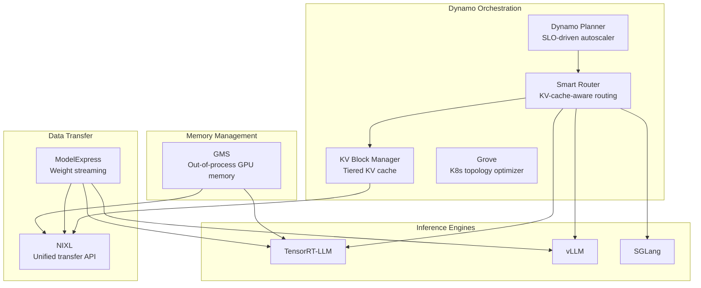

# 1. Background and Motivation

[< Back to Overview](README.md)

## ModelExpress (MX)

ModelExpress is a Rust-based service from the Dynamo ecosystem that coordinates GPU-to-GPU model weight transfers across a cluster:

- **Single-source download**: Only one pod downloads from HuggingFace; others receive via P2P
- **RDMA transfers**: Uses NIXL/UCX for high-speed GPU-to-GPU transfer (~15s for 681GB DeepSeek-V3)
- **Content-addressed coordination**: SHA256-based source identity ensures compatible transfers
- **Three-tier fallback**: RDMA -> GPUDirect Storage -> Disk
- **Metadata backends**: Redis or Kubernetes CRD

**Architecture — Three components:**
- `modelexpress_server` — gRPC service with pluggable metadata backends
- `modelexpress_client` — CLI and Python SDK for cache operations
- `modelexpress_common` — Protobuf definitions and shared configuration

**Integration status across frameworks:**
| Framework | MX Status | Load Format |
|:----------|:----------|:------------|
| **vLLM** | **Shipped** | `--load-format mx` |
| **SGLang** | Roadmap | — |
| **TensorRT-LLM** | Proto declared, not implemented | `BACKEND_FRAMEWORK_TRT_LLM = 3` in proto |

**Repository:** https://github.com/ai-dynamo/modelexpress

## GPU Memory Service (GMS)

GMS is an out-of-process GPU memory manager that decouples memory ownership from processes:

- **Zero-copy sharing**: Multiple workers share the same GPU memory for model weights
- **Crash resilience**: Memory persists when worker crashes; new worker imports existing memory
- **VA-stable failover**: Shadow engines can release/reclaim memory while keeping tensor pointers valid
- **Socket-based locking**: Connection IS the lock; automatic release on crash
- **CUDA VMM integration**: Uses `cuMemExportToShareableHandle` / `cuMemImportFromShareableHandle` for FD-based memory sharing

> **Terminology note:** "GPU Memory Service" (GMS) appears to be an internal/pre-release name. In public Dynamo documentation, the closest equivalent is the **KV Block Manager (KVBM)** memory management layer combined with NIXL's memory registration APIs. The prototype in PR #7053 uses the GMS name. This proposal uses "GMS" as the working name but the actual integration should target whatever stable API the Dynamo team publishes. **API stability is a key risk — see [Risk Assessment](12-risks.md).**

**Prototype:** https://github.com/ai-dynamo/dynamo/pull/7053

## Dynamo Ecosystem Context

MX and GMS are components of NVIDIA Dynamo, a datacenter-scale distributed inference framework:

## TensorRT-LLM Current Architecture (Relevant Extension Points)

TRT-LLM's PyTorch backend provides several hooks that MX/GMS can leverage:

| Extension Point | Location | What It Does |
|:---------------|:---------|:-------------|
| `@register_checkpoint_loader(format)` | `model_loader.py` | Custom checkpoint format registration |
| `virtual_memory_scope(tag)` | Memory management | Tagged memory allocation for lifecycle control |
| `release_with_tag()` / `materialize_with_tag()` | Memory management | Sleep/wake memory release and restoration |
| `ModelLoader` with configurable weight loading | `model_loader.py` | Pluggable weight loading pipeline |
| KV Cache Connector API | `kv-cache-connector.md` | Custom KV cache load/save/transfer |

**Missing extension points (to be added):**
- Pluggable GPU memory allocator
- Tensor enumeration API for P2P registration
- Post-load callback for external registration
- External memory import (CUDA VMM FD import)
