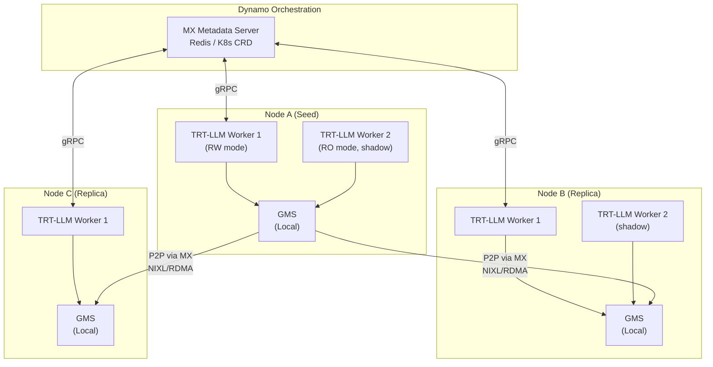
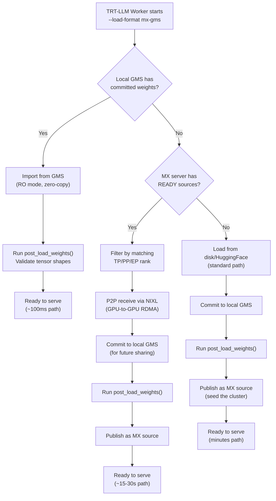
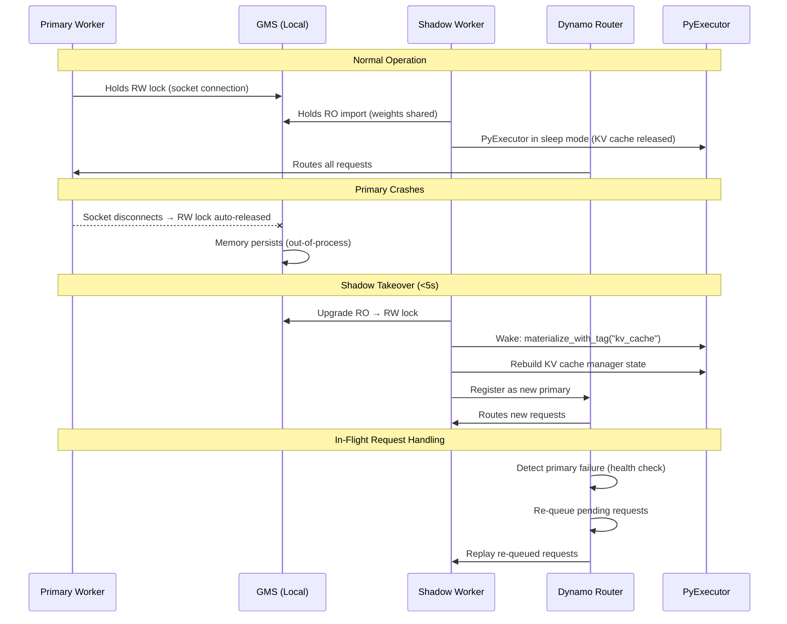
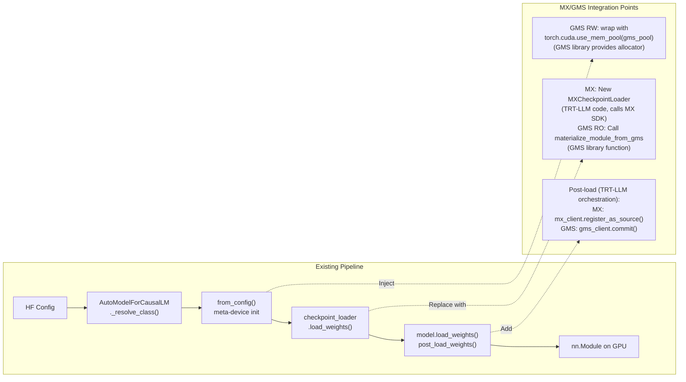

# 3. Proposed Architecture

[< Back to Overview](README.md)

## High-Level Architecture

## Component Responsibilities

| Component | Responsibility | Owner |
|:----------|:--------------|:------|
| **MX Server** | Coordinate P2P transfers across nodes; track source availability | Dynamo/MX team |
| **GMS (per node)** | Manage GPU memory; enable zero-copy sharing within node | Dynamo team |
| **TRT-LLM Weight Loaders** | Integrate with MX/GMS via clean APIs | TRT-LLM team (this proposal) |
| **NIXL/UCX** | Execute actual GPU-to-GPU RDMA transfers | NVIDIA |
| **TRT-LLM Executor** | Shadow failover, sleep/wake lifecycle | TRT-LLM team (this proposal) |

## Data Flow: New Replica Startup

## Data Flow: Shadow Failover

## Integration with TRT-LLM Model Loading Pipeline

