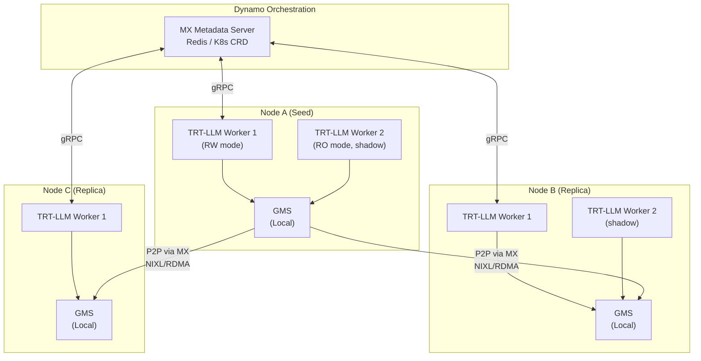
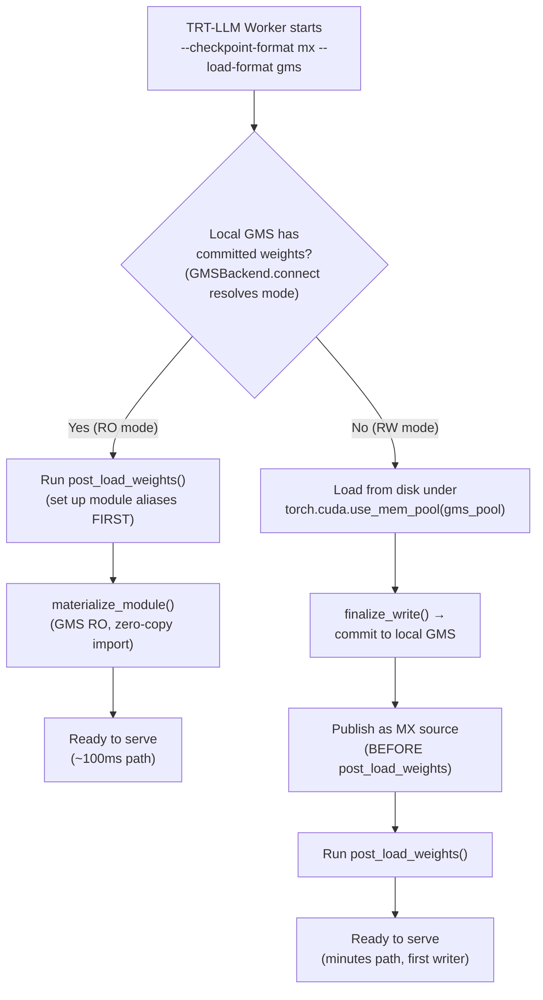
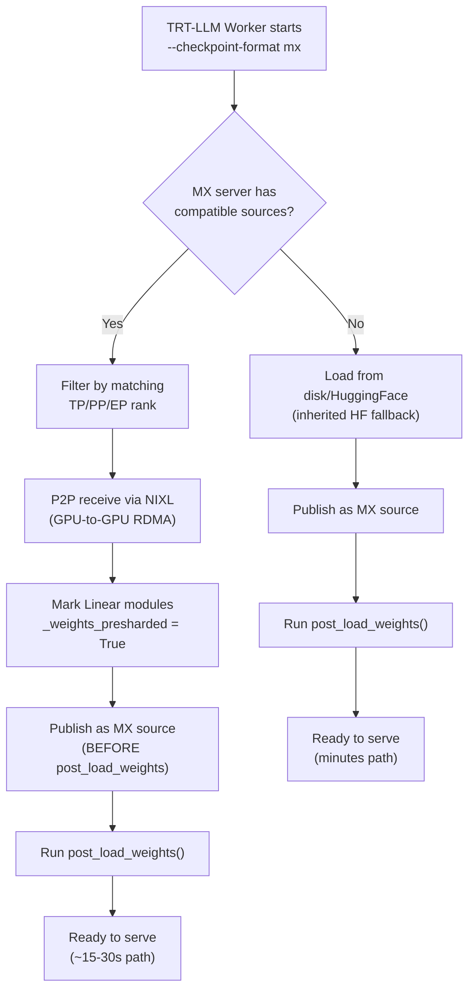
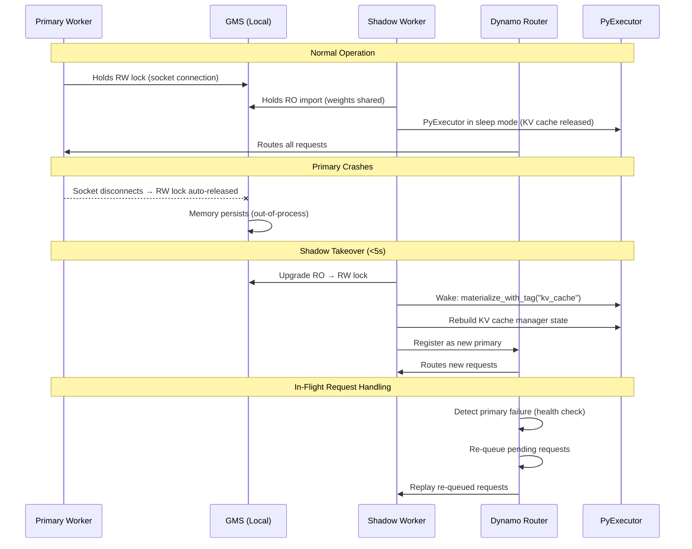
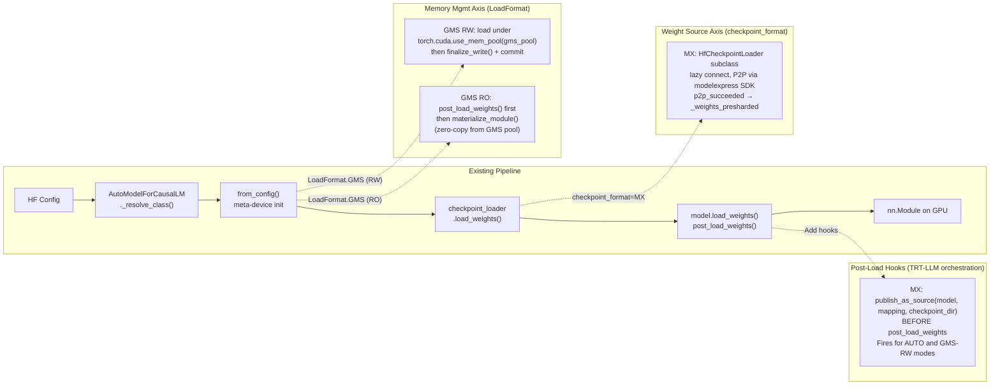

# 3. Proposed Architecture

[< Back to Overview](README.md)

## High-Level Architecture

## Component Responsibilities

| Component | Responsibility | Owner |
|:----------|:--------------|:------|
| **MX Server** | Coordinate P2P transfers across nodes; track source availability | Dynamo/MX team |
| **GMS (per node)** | Manage GPU memory; enable zero-copy sharing within node | Dynamo team |
| **TRT-LLM Weight Loaders** | Integrate with MX/GMS via clean APIs | TRT-LLM team (this proposal) |
| **NIXL/UCX** | Execute actual GPU-to-GPU RDMA transfers | NVIDIA |
| **TRT-LLM Executor** | Shadow failover, sleep/wake lifecycle | TRT-LLM team (this proposal) |

## Data Flow: New Replica Startup

> **Prototype note (MX+GMS combined):** In the current prototype, the GMS RW path always loads from disk — MX P2P is **not** used in GMS RW mode because model parameters are meta tensors at that point (no CUDA buffers for P2P to write into). The priority cascade works through GMS RO: the first worker loads from disk into GMS (RW), subsequent workers import from GMS (RO, ~100ms). Cross-node replication happens via MX in `LoadFormat.AUTO` mode (without GMS). A future optimization could allocate CUDA buffers under the GMS pool first, then attempt MX P2P into those buffers.

For **MX-only mode** (`--checkpoint-format mx`, no GMS):

## Data Flow: Shadow Failover

## Integration with TRT-LLM Model Loading Pipeline

> **Prototype reference:** See the [`dynamo-integration-prototype`](https://github.com/chienchunhung/TensorRT-LLM/tree/dynamo-integration-prototype) branch for the full working implementation.
