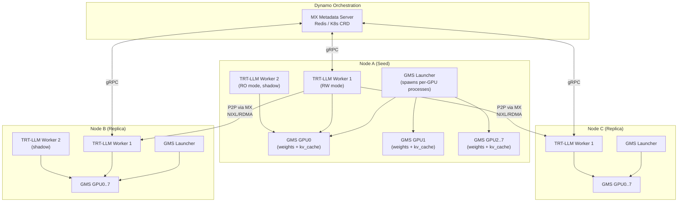
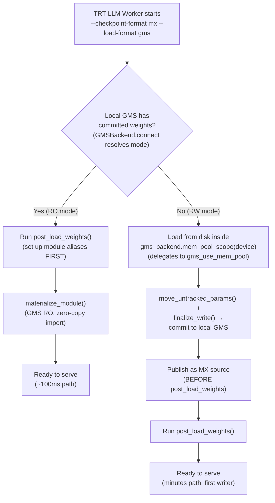
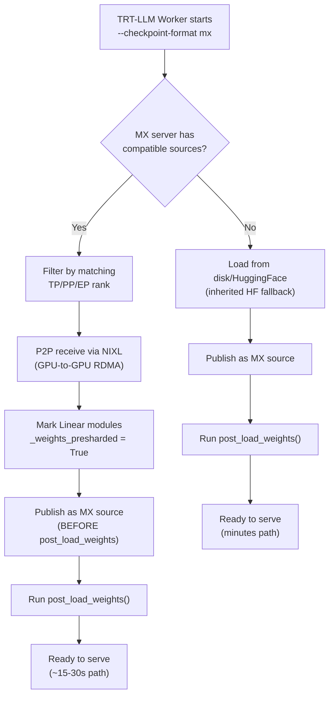
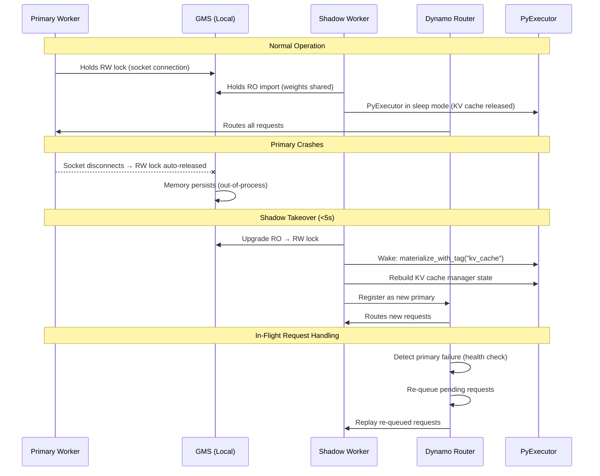
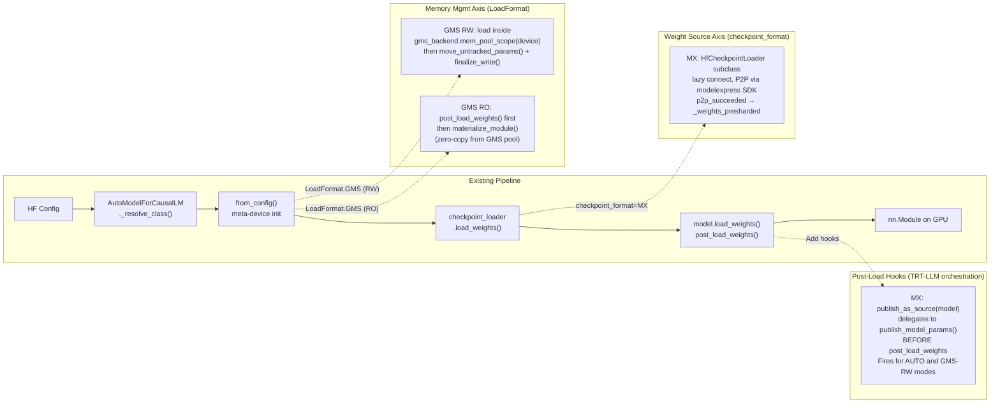

# 3. Proposed Architecture

[< Back to Overview](README.md)

## High-Level Architecture

## Component Responsibilities

| Component | Responsibility | Owner |
|:----------|:--------------|:------|
| **MX Server** | Coordinate P2P transfers across nodes; track source availability | Dynamo/MX team |
| **GMS (per GPU, per tag)** | Manage GPU memory; enable zero-copy sharing within node. Runs as one independent process per GPU per tag (e.g., 16 processes on an 8-GPU node: 8 for `weights` + 8 for `kv_cache`). A per-node launcher spawns all processes. Socket paths use GPU UUID for stability: `{GMS_SOCKET_DIR}/gms_{GPU_UUID}_{tag}.sock`. Sharing is strictly per-GPU (CUDA VMM constraint). | Dynamo team |
| **TRT-LLM Weight Loaders** | Integrate with MX/GMS via clean APIs | TRT-LLM team (this proposal) |
| **NIXL/UCX** | Execute actual GPU-to-GPU RDMA transfers | NVIDIA |
| **TRT-LLM Executor** | Shadow failover, sleep/wake lifecycle | TRT-LLM team (this proposal) |

## Data Flow: New Replica Startup

> **Critical design constraint — MX+GMS combined mode:**
>
> In the current prototype, `checkpoint_format="MX"` + `load_format=GMS` behaves **identically** to `checkpoint_format="HF"` + `load_format=GMS` (GMS-only). The MX checkpoint format provides no additional benefit when GMS is active. Here is why:
>
> **The root cause: CUDA memory pool isolation.** In GMS RW mode, all weight memory must live in the GMS-managed memory pool so that RO readers can later zero-copy import it. The loading path wraps weight loading in `gms_backend.mem_pool_scope(device)` (a context manager that delegates to upstream `gms_use_mem_pool(tag, device)`), ensuring all CUDA allocations land in GMS memory. However, when MX receives weights via P2P RDMA, the MX/NIXL layer allocates CUDA buffers **inside the MX SDK** — outside the pool-scope context. Those received weights land in regular CUDA memory, not the GMS pool, so GMS cannot track, manage, or share them with RO readers — defeating the entire purpose of GMS RW mode. Aligning MX-NIXL to write into pre-allocated GMS-pool buffers is tracked as MX-5 in [§15 Upstream Alignment Requests](15-prototype-validation-plan.md#-api-alignment--prototype--current-gms--mx-done); until that lands, MX P2P is intentionally bypassed inside GMS RW mode and the GMS RW path falls back to disk loading.
>
> **What this means in practice:**
>
> | Mode | Node B, Worker 1 (first on node) | Node B, Worker 2+ |
> |:-----|:---------------------------------|:-------------------|
> | **MX only** (`LoadFormat.AUTO`) | P2P from Node A (~15-30s), regular CUDA memory | Must load independently (no sharing) |
> | **GMS only** (`LoadFormat.GMS`) | Load from disk (minutes), commits to GMS | Shadow: zero-copy RO import (~100ms) |
> | **MX + GMS** (`checkpoint_format="MX"`, `LoadFormat.GMS`) | Load from disk (minutes), commits to GMS — **same as GMS-only** | Shadow: zero-copy RO import (~100ms) |
>
> MX and GMS currently operate as **separate modes**, not a truly composed solution. MX provides fast cross-node startup (in `LoadFormat.AUTO`); GMS provides within-node crash resilience + shadow failover (in `LoadFormat.GMS`). They do not compose because the GMS RW path cannot leverage MX P2P.
>
> **Future optimization path:** Pre-allocate empty CUDA buffers under the GMS pool, then pass those buffer pointers to the MX SDK as P2P receive targets. This would allow MX to write directly into GMS-managed memory, giving the best of both: P2P speed (~15-30s) + GMS crash resilience (~100ms shadow import). This requires MX SDK support for receiving into pre-allocated buffers rather than SDK-managed allocations.

For **MX-only mode** (`--checkpoint-format mx`, no GMS):

## Data Flow: Shadow Failover

## Integration with TRT-LLM Model Loading Pipeline

> **Prototype reference:** See the [`dynamo-integration-prototype`](https://github.com/chienchunhung/TensorRT-LLM/tree/dynamo-integration-prototype) branch for the full working implementation.
