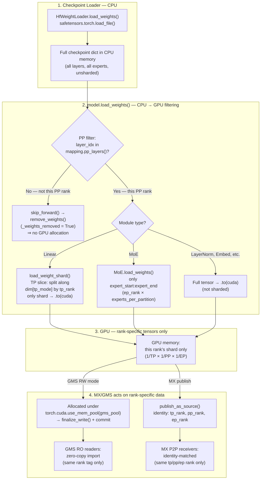

# 4. Implementation & API Design

[< Back to Overview](README.md)

**Last Updated:** 2026-04-14

---

## Overview

### Design Principle: Two Orthogonal Axes

TRT-LLM's `ModelLoader.load()` already separates two independent concerns:

| Axis | Controlled by | Current values | What it decides |
|:-----|:-------------|:---------------|:----------------|
| **Weight source** | `checkpoint_format` (string) → `@register_checkpoint_loader` | `"HF"`, `"mistral"`, `"mistral_large_3"` | *Where* weights come from (file format / transfer mechanism) |
| **Loading mode** | `LoadFormat` (enum) → `if/elif` branches in `ModelLoader.load()` | `AUTO`, `DUMMY`, `VISION_ONLY` | *How* the loading pipeline behaves (memory management, orchestration) |

These compose independently. The checkpoint loader is selected by `checkpoint_format`; the loading pipeline branch is selected by `LoadFormat`. This gives us a clean mapping for all four integration modes:

| Mode | `checkpoint_format` | `LoadFormat` | Behavior |
|:-----|:-------------------|:-------------|:---------|
| **Pure TRT-LLM** | `"HF"` (default) | `AUTO` (default) | Current behavior, unchanged |
| **MX only** | `"MX"` | `AUTO` | MX P2P source, standard CUDA allocator |
| **GMS only** | `"HF"` (default) | `GMS` | Disk source, GMS memory management |
| **MX + GMS** | `"MX"` | `GMS` | MX P2P source, GMS memory management **(see critical limitation)** |

**Why this matters:** MX is a weight *source* (it replaces where weights come from — P2P instead of disk). GMS is a memory *management mode* (it replaces how GPU memory is allocated and shared). Conflating them into a single enum (e.g., a combined `LoadFormat.MX_GMS`) creates combinatorial explosion and doesn't compose. The two-axis approach avoids this.

**Relationship to PR #12898:** [PR #12898](https://github.com/NVIDIA/TensorRT-LLM/pull/12898) from the MX team adds `LoadFormat.PRESHARDED = 3` as a prototype MX integration. That approach conflates both axes into a single `LoadFormat` value — "weights are pre-sharded" (a property of the weight source) AND "use this loading pipeline." This works for MX alone but prevents composition with GMS, because `LoadFormat` is a single enum — you can't express "MX source + GMS memory" without adding a new `PRESHARDED_GMS` variant. Key insights from PR #12898 that we adopt:
- **Pre-`post_load_weights()` publish timing**: Publishing weights before `post_load_weights()` so targets run their own transforms independently. This is correct and more robust than publishing after.
- **`_weights_presharded` flag on Linear modules**: Setting `tp_size = 1` to skip TP slicing for pre-sharded weights. This concept is valid — but should be a **context-derived flag** (set when weights arrive pre-sharded from MX P2P or GMS RO import), not tied to a specific `LoadFormat`.

### Relationship to Existing Prototypes

This plan treats MX and GMS as **library dependencies**, not things to reimplement. The existing prototypes demonstrate that the core functionality already works:

- **MX (ModelExpress)**: The [`modelexpress`](https://github.com/ai-dynamo/modelexpress) library provides a gRPC server, Python client SDK, and NIXL-based GPU-to-GPU transfer. vLLM's `--load-format mx` integration is a thin loader (~500 lines) that calls the MX client API. [PR #12898](https://github.com/NVIDIA/TensorRT-LLM/pull/12898) demonstrates a working MX prototype with TRT-LLM using `LoadFormat.PRESHARDED`.
- **GMS (GPU Memory Service)**: The [`gpu_memory_service`](https://github.com/ai-dynamo/dynamo/pull/7053) library provides the CUDA VMM allocator, RW/RO client, and socket-based locking. PR #7053 shows a working TRT-LLM integration (~300 lines of TRT-LLM-specific model loading code) that calls the GMS client.
- **Two-axis prototype**: The [`dynamo-integration-prototype`](https://github.com/chienchunhung/TensorRT-LLM/tree/dynamo-integration-prototype) branch implements the two-axis integration model described in this design doc (~830 lines changed across 15 files). It covers both the MX checkpoint loader and GMS loading mode with RW/RO dual paths, ready for benchmarking.

### What TRT-LLM Implements vs. Library-Provided

**What TRT-LLM needs to implement:**

| Area | TRT-LLM-side work | Integration axis | Dynamo-side work (external) |
|:-----|:-------------------|:----------------|:---------------------------|
| MX weight loading | `@register_checkpoint_loader("MX")` that calls MX client APIs | `checkpoint_format` (weight source) | Maintain `modelexpress` library |
| GMS weight sharing | `LoadFormat.GMS` branch in `ModelLoader.load()` calling GMS client | `LoadFormat` (memory management) | Maintain `gpu_memory_service` library |
| Pre-sharded TP skip | Set `_weights_presharded` flag when MX P2P or GMS RO produces per-rank weights | Cross-cutting (derived from context) | None |
| Configuration | `checkpoint_format`, `LoadFormat`, MX/GMS fields on `TorchLlmArgs` | Both axes | None |
| Sleep/wake | Map `release_with_tag("kv_cache")` to GMS tag operations (already demonstrated in PR #7053) | `LoadFormat.GMS` | None |
| Shadow failover | `PyExecutor` shadow mode with GMS-backed activation | `LoadFormat.GMS` | None |
| Testing | TRT-LLM CI with MX/GMS enabled | Both axes | GMS integration tests in Dynamo repo |

**What TRT-LLM does NOT need to implement** (provided by MX/GMS libraries):
- NIXL wrapper or RDMA transfer logic (use `modelexpress` client directly)
- CUDA VMM FD import/export (use `gpu_memory_service.client` directly — `cuda_utils.py`)
- GPU memory allocator (use GMS's `CUDAPluggableAllocator` + `MemPool`)
- Tensor enumeration for GMS commit (GMS's `register_module_tensors()` walks the model)
- Zero-copy tensor construction from GPU pointers (GMS's `materialize_module_from_gms()`)
- gRPC server/client for MX (use `modelexpress` SDK)
- Socket-based RW/RO locking (GMS client handles this transparently)

### Target Backend Scope

All implementation targets the **PyTorch backend** with:
- **KV Cache Manager V1** (the default `KVCacheManager`, not V2)
- **C++ transceiver** (the default NIXL/UCX-based `CacheTransceiver`)
- **`trtllm-serve`** as the primary serving surface

The TensorRT (legacy) backend is out of scope. AutoDeploy inherits PyTorch backend behavior and should work without additional changes.

### Glossary

| Term | Meaning |
|:-----|:--------|
| **MX** | ModelExpress — GPU-to-GPU model weight streaming service |
| **GMS** | GPU Memory Service — out-of-process GPU memory management for zero-copy sharing and crash resilience |
| **GDS** | GPUDirect Storage — NVIDIA technology for direct DMA between NVMe storage and GPU memory, bypassing CPU |
| **NIXL** | NVIDIA Inference eXchange Library — unified transfer API used by both MX and TRT-LLM's disaggregated serving |
| **KVBM** | KV Block Manager — tiered KV cache management in Dynamo |

---

## Weight Loading Pipeline: Parallelism and MX/GMS

A critical design property: **TP, PP, and EP sharding all happen during `model.load_weights()`, before MX or GMS acts on the GPU tensors.** By the time MX publishes weights or GMS commits them, the tensors are already rank-specific. Both MX and GMS share post-sharded data with identity-matched workers.

### Where TP/PP/EP Sharding Happens



| Parallelism | Where filtered | Mechanism | Code location |
|:------------|:---------------|:----------|:-------------|
| **TP** | `load_weight_shard()` per Linear module | Slices weight along `split_dim` using `tp_rank/tp_size`, moves only the shard to GPU | `_torch/modules/linear.py:100` |
| **PP** | Model `__init__` via `skip_forward()` | Layers not in `mapping.pp_layers()` get `remove_weights()` → `_parameters` cleared, `_weights_removed=True` → `_load_weights_impl` skips them entirely | `_torch/models/modeling_utils.py:295` |
| **EP** | `MoE.load_weights()` | Only iterates `range(expert_start, expert_end)` where `expert_start = ep_rank × expert_size_per_partition` | `_torch/modules/fused_moe/fused_moe_vanilla.py:466` |

### Design Choice: Post-Sharded Sharing

There are two possible approaches to weight sharing across MX and GMS:

| | Option A: Share unsharded (minimum) | Option B: Share post-sharded (current design) |
|:--|:--------------------------------------|:----------------------------------------------|
| **What's shared** | Raw unsharded weights from checkpoint | Rank-specific, TP/PP/EP-sharded GPU tensors |
| **Receiver work** | Must re-shard for its own TP/PP/EP rank | Zero — weights are ready to use |
| **MX matching** | Any source works for any rank | Must match TP/PP/EP rank identity exactly |
| **GMS sharing** | One GMS tag for all ranks on the node | Per-rank GMS tags |
| **Cross-config reuse** | Yes (e.g., TP=4 source → TP=8 receiver re-shards) | No — different parallelism config = incompatible |
| **Startup speed** | Slower (P2P + re-shard on receiver) | Fastest (P2P or zero-copy, immediately usable) |

**Rationale for Option B:** The primary use case for MX/GMS is **elastic scaling** — spinning up identical replicas with the same parallelism configuration. In this scenario, every new replica has the same TP/PP/EP layout, so rank-matched sharing gives maximum speed with zero receiver-side work. Option A would only be advantageous for **parallelism reconfiguration** (e.g., scaling from TP=4 to TP=8), which is a significantly harder problem involving re-sharding logic and is out of scope for this integration.

### CPU Checkpoint Loading Overhead

> **Known overhead:** The current `HfWeightLoader` loads the **full checkpoint** into CPU memory via `safetensors.torch.load_file()`, regardless of this rank's TP/PP/EP configuration. For a 671B-parameter model, this means every rank temporarily holds ~1.3 TB of CPU data even though each rank's GPU shard may be a small fraction of that.
>
> **Potential optimization:** Safetensors index files (`model.safetensors.index.json`) contain a `weight_map` that maps each tensor name to its containing shard file. A PP-aware loader could parse this index, identify which shard files contain layers assigned to this PP rank, and only load those files — potentially reducing CPU memory by `1/pp_size`. Similarly, an EP-aware loader could skip shard files that only contain experts outside this rank's `expert_start:expert_end` range. This optimization is independent of MX/GMS and benefits all loading paths.
>
> This is tracked as a potential follow-up optimization, not a blocker for the MX/GMS integration.

---

## Phased Implementation


### Phase 1: MX + TRT-LLM (Cross-Node P2P) — 3-4 Weeks

**Priority:** P1 (Tier 1) — competitive catch-up with vLLM
**Objective:** Enable P2P weight transfer across nodes via `--checkpoint-format mx`

#### Deliverables

| # | Deliverable | Description | TRT-LLM Files |
|:--|:-----------|:-----------|:------|
| 1.1 | MX checkpoint loader | `@register_checkpoint_loader("MX")` that calls MX client SDK | `_torch/models/checkpoints/mx/` |
| 1.2 | Configuration schema | `checkpoint_format: "MX"`, `mx_server_url` in `TorchLlmArgs` | `llmapi/llm_args.py` |
| 1.3 | Pre-sharded TP skip | `_weights_presharded` flag on Linear modules when P2P receive succeeds | `_torch/modules/linear.py` (adopt from [PR #12898](https://github.com/NVIDIA/TensorRT-LLM/pull/12898)) |
| 1.4 | Fallback logic | MX P2P -> GPUDirect Storage -> disk, with graceful degradation | Inside MX loader |
| 1.5 | Tests and documentation | Unit tests, 2-node integration test, user guide | `tests/`, `docs/` |

#### MX Checkpoint Loader Implementation

The MX loader **subclasses `HfCheckpointLoader`** so disk fallback is inherited automatically. MX integrates as a `checkpoint_format` (weight source axis), not a `LoadFormat` (memory management axis).

> **Prototype:** [`dynamo-integration-prototype`](https://github.com/chienchunhung/TensorRT-LLM/tree/dynamo-integration-prototype) branch, file `tensorrt_llm/_torch/models/checkpoints/mx/checkpoint_loader.py` (~230 lines).

Key design decisions:

- **Inherits `HfCheckpointLoader`** rather than `BaseCheckpointLoader`. This reuses the HF weight loader, config loader, and weight mapper registries so that MX checkpoints on disk use the same loading pipeline as HF. Fallback is simply `super().load_weights()`.
- **Lazy MX connection.** The constructor stores `mx_server_url` but does not connect eagerly. Connection and source discovery happen inside `_try_p2p_transfer()`, called from `load_weights()`. This avoids blocking init when the MX server is unavailable.
- **`p2p_succeeded` property** (not `_weights_presharded`). The loader exposes a `p2p_succeeded` boolean. `ModelLoader.load()` reads this after `load_weights()` and sets `_weights_presharded` on the model's `Linear` modules. This keeps the presharded flag on the model (where it's consumed) rather than on the loader.

```python
# tensorrt_llm/_torch/models/checkpoints/mx/checkpoint_loader.py

@register_checkpoint_loader("MX")
class MXCheckpointLoader(HfCheckpointLoader):
    """Weight source: P2P via MX, with HF disk fallback."""

    def __init__(self, *, weight_loader=None, weight_mapper=None,
                 config_loader=None, mx_server_url=None):
        super().__init__(weight_loader=weight_loader,
                         weight_mapper=weight_mapper,
                         config_loader=config_loader)
        self._checkpoint_format = "MX"
        self._mx_server_url = mx_server_url
        self._p2p_succeeded = False
        self._identity = None

    @property
    def checkpoint_format(self) -> str:
        return "MX"

    @property
    def p2p_succeeded(self) -> bool:
        return self._p2p_succeeded

    def load_weights(self, checkpoint_dir, mapping, **kwargs):
        model = kwargs.pop("model", None)
        self._p2p_succeeded = False

        if self._mx_server_url is not None and model is not None:
            if self._try_p2p_transfer(model, mapping, checkpoint_dir):
                self._p2p_succeeded = True
                return {}  # Weights already in model params

        # Fallback: load from disk via inherited HF pipeline
        return super().load_weights(checkpoint_dir, mapping=mapping, **kwargs)

    def _try_p2p_transfer(self, model, mapping, checkpoint_dir) -> bool:
        """Lazy-connect to MX, discover compatible sources, receive via P2P."""
        try:
            from modelexpress import client as mx_client

            identity = self._build_identity(mapping, checkpoint_dir)
            if identity is None:
                return False
            self._identity = identity

            connection = mx_client.connect(self._mx_server_url)
            sources = connection.list_sources(identity)
            compatible = [
                s for s in sources
                if s.worker_rank == mapping.tp_rank
                and s.extra_params.get("pp_rank") == str(mapping.pp_rank)
            ]

            if compatible:
                connection.receive(compatible[0])
                return True
            return False
        except ImportError:
            logger.warning("modelexpress library not installed")
            return False
        except Exception as e:
            logger.warning("MX P2P transfer failed: %s", e)
            return False

    def publish_as_source(self, model, mapping=None, checkpoint_dir=None):
        """Publish model weights as MX source for other replicas.
        Called BEFORE post_load_weights() so targets receive raw state."""
        if self._mx_server_url is None:
            return
        try:
            from modelexpress import client as mx_client

            identity = self._identity
            if identity is None and mapping is not None:
                identity = self._build_identity(mapping, checkpoint_dir)
            if identity is None:
                return

            connection = mx_client.connect(self._mx_server_url)
            connection.register_source(model, identity)
        except (ImportError, Exception) as e:
            logger.warning("Failed to publish MX source: %s", e)

    def _build_identity(self, mapping, checkpoint_dir):
        """Map TRT-LLM's Mapping to MX's SourceIdentity protobuf."""
        try:
            from modelexpress import proto as mx_proto
            return mx_proto.SourceIdentity(
                model_name=checkpoint_dir,
                dtype=str(mapping.dtype) if hasattr(mapping, 'dtype') else "",
                extra_params={
                    "tp_size": str(mapping.tp_size),
                    "pp_size": str(mapping.pp_size),
                    "ep_size": str(mapping.moe_ep_size),
                    "worker_rank": str(mapping.tp_rank),
                    "pp_rank": str(mapping.pp_rank),
                },
            )
        except ImportError:
            return None
```

**What TRT-LLM implements:** The loader class (~230 lines), identity mapping from `Mapping` to MX protobuf, lazy connection/fallback logic, source publish hook.

**What the MX client SDK provides:** gRPC connection, source discovery (`list_sources`), NIXL-based P2P transfer (`receive`), source registration, heartbeat.

#### Testing and Success Criteria

- Unit tests: identity matching, fallback logic
- Integration test: 2-node cluster, cold-start with MX vs baseline
- Benchmark comparison against vLLM's `--load-format mx` (vLLM uses `--load-format`; TRT-LLM uses `--checkpoint-format`)
- **Gate:** Cold-start within 20% of vLLM MX for same model

| Metric | Target |
|:-------|:-------|
| Cold-start (Llama-70B, 2nd replica) | < 30s (vs. 2-3 min baseline) |
| P2P transfer throughput | > 20 GB/s (NVLink), > 10 GB/s (InfiniBand) |
| Graceful fallback to disk | Yes, with warning log |
| vLLM parity | Within 20% of vLLM MX cold-start time |

---

### Phase 2: GMS + TRT-LLM (Within-Node Sharing) — 3-4 Weeks

**Priority:** P2 (Tier 2) — differentiation; enables fault tolerance
**Objective:** Enable zero-copy weight sharing and crash-resilient failover

#### Deliverables

| # | Deliverable | Description | TRT-LLM Files |
|:--|:-----------|:-----------|:------|
| 2.1 | GMS loading mode | `LoadFormat.GMS` branch in `ModelLoader.load()` with RW/RO paths | `_torch/pyexecutor/model_loader.py` |
| 2.2 | `GMSBackend` class | Protocol-based abstraction + concrete implementation | `_torch/memory/gpu_memory_backend.py` |
| 2.3 | Sleep/wake GMS tag mapping | Map `release_with_tag("kv_cache")` to GMS-safe operations | `_torch/pyexecutor/py_executor_creator.py` |
| 2.4 | Shadow failover integration | PyExecutor shadow mode with GMS-backed activation | `_torch/pyexecutor/py_executor.py` |
| 2.5 | Configuration schema | `LoadFormat.GMS`, `gms_socket_path`, `gms_mode`, `gms_tag` in `TorchLlmArgs` | `llmapi/llm_args.py` |
| 2.6 | Tests and documentation | Failover tests, memory sharing verification | `tests/`, `docs/` |

#### GMS Loading Mode Implementation

GMS integrates as a `LoadFormat` (memory management axis), not a `checkpoint_format` — it changes *how GPU memory is managed*, not *where weights come from*. The `LoadFormat.GMS` branch uses a `GMSBackend` class that wraps the `gpu_memory_service.client` SDK. Pattern validated in [PR #7053](https://github.com/ai-dynamo/dynamo/pull/7053).

> **Prototype:** [`dynamo-integration-prototype`](https://github.com/chienchunhung/TensorRT-LLM/tree/dynamo-integration-prototype) branch. The `GMSBackend` class lives at `tensorrt_llm/_torch/memory/gpu_memory_backend.py`; the `LoadFormat.GMS` branch is in `tensorrt_llm/_torch/pyexecutor/model_loader.py`.

Key design decisions:

- **`GMSBackend` class instead of bare `get_gms_client()`.** The prototype wraps the GMS client SDK in a `GMSBackend` class that encapsulates connection, mode resolution, and lifecycle. This is the concrete implementation of the `GPUMemoryBackend` protocol (see [GMS API Stability Abstraction](#gms-api-stability-abstraction)).
- **Mode resolved at connect time.** `GMSBackend.connect()` resolves `gms_mode="auto"` to RW or RO by checking `has_committed_weights(tag)`. The `is_rw` property is then used to branch in `ModelLoader.load()`.
- **Meta-init preserved for GMS.** The prototype skips both the `meta→CUDA` tensor init and `model.to("cuda")` for `LoadFormat.GMS`. The RW path allocates under the GMS mem pool during weight loading; the RO path replaces meta tensors via `materialize_module()`.
- **`post_load_weights()` ordering differs by path.** For GMS RO, `post_load_weights()` runs *before* `materialize_module()` so module aliases are set up correctly (see [Challenges — Module Path Resolution](09-challenges.md#7-module-path-resolution-gms-specific)). For GMS RW and all other modes, `post_load_weights()` runs after weight loading as normal. A guard prevents double-execution.

```python
# In ModelLoader.load() — tensorrt_llm/_torch/pyexecutor/model_loader.py

elif load_format == LoadFormat.GMS:
    from tensorrt_llm._torch.memory import GMSBackend

    gms_backend = GMSBackend(
        socket_path=self.llm_args.gms_socket_path,
        mapping=self.mapping,
        mode=self.llm_args.gms_mode or "auto",
        tag=self.llm_args.gms_tag or "model_weights",
    )

    if not gms_backend.connect():
        raise RuntimeError("Failed to connect to GMS")

    if gms_backend.is_rw:
        # GMS RW path: load via checkpoint_loader under GMS memory pool
        gms_pool = gms_backend.get_mem_pool()
        device = torch.device('cuda')

        with torch.cuda.use_mem_pool(gms_pool, device=device):
            weights = checkpoint_loader.load_weights(
                checkpoint_dir, mapping=self.mapping)
            if weights:
                self.weight_mapper = (
                    checkpoint_loader
                    .get_initialized_weight_mapper(model, config))
                self._call_load_weights(
                    model.load_weights, weights, self.weight_mapper)

        gms_backend.finalize_write(model)
    else:
        # GMS RO path: zero-copy import from existing GMS pool
        # post_load_weights() BEFORE materialize (sets up module aliases)
        for module in model.modules():
            if hasattr(module, 'post_load_weights') and not getattr(
                    module, '_weights_removed', False):
                module.post_load_weights()

        gms_backend.materialize_module(model)

    self._gms_backend = gms_backend

# Later: guard to skip post_load_weights() for GMS RO (already ran above)
gms_ro_done = (load_format == LoadFormat.GMS
               and self._gms_backend is not None
               and not self._gms_backend.is_rw)
if not gms_ro_done:
    for module in model.modules():
        if hasattr(module, 'post_load_weights') ...
```

**What TRT-LLM implements:** The `LoadFormat.GMS` branch in `ModelLoader.load()` (~60 lines), the `GMSBackend` class (~240 lines), meta-init skip, `post_load_weights()` ordering guard.

**What the GMS client library provides:**
- `CUDAPluggableAllocator` + `MemPool` (intercepts `torch` allocations via CUDA VMM)
- `materialize_module_from_gms()` (creates zero-copy tensors from shared GPU memory)
- `register_module_tensors()` (walks model params/buffers, records metadata in GMS)
- `commit()` (publishes memory for RO readers)
- RW/RO lock management via Unix domain socket connection

#### Testing and Success Criteria

- Shadow mode in PyExecutor: shadow starts with GMS RO import (weights only, no KV cache); on primary failure: upgrade GMS lock (RO -> RW), allocate KV cache, start serving
- Failover tests: primary crash -> shadow takeover -> continued serving
- Memory tests: N workers, 1x memory footprint
- **Gate:** Shadow takeover < 5s; memory sharing verified

| Metric | Target |
|:-------|:-------|
| Memory per worker (same GPU) | 1x weights (vs. Nx baseline) |
| Failover time (shadow takeover) | < 5s |
| GMS import latency | < 500ms |
| Inference correctness after import | Bit-exact with standard loading |

---

### Phase 3: Combined MX+GMS + Extensions — 2-3 Weeks

**Priority:** P2 (Tier 2) — full solution
**Objective:** Unified cross-node P2P + within-node sharing + extension paths

#### Deliverables

| # | Deliverable | Description | TRT-LLM Files |
|:--|:-----------|:-----------|:------|
| 3.1 | Combined mode validation | `checkpoint_format="MX"` + `LoadFormat.GMS` with priority cascade | `_torch/pyexecutor/model_loader.py` |
| 3.2 | Disagg interaction | MX/GMS behavior for context vs. generation workers | Integration code |
| 3.3 | E2E tests | Multi-node, multi-worker, failover, disagg scenarios | `tests/` |
| 3.4 | Startup benchmarks | Cold-start benchmarks using the [startup profiling framework](10-startup-profiling.md) | `tests/benchmarks/` |

#### Priority Cascade

The combined mode `checkpoint_format="MX"` + `LoadFormat.GMS` uses this priority cascade:
1. Local GMS (if committed weights exist) — fastest (~100ms, GMS RO import)
2. Remote MX source (P2P to local GPU under GMS pool, then commit to GMS) — fast (~15-30s)
3. Disk/HuggingFace (seed load under GMS pool, commit to GMS, register as MX source) — slow (minutes)

The two-axis model means this cascade requires no special combined code — `LoadFormat.GMS` naturally checks for committed weights first, then falls through to the checkpoint loader (which happens to be MX).

#### Critical Limitation: MX+GMS Combined = GMS-Only (Current Prototype)

> **This is the most important optimization item for Phase 3.**
>
> In the current prototype, `checkpoint_format="MX"` + `load_format=GMS` behaves **identically** to `checkpoint_format="HF"` + `load_format=GMS`. The combined mode provides **no benefit over GMS-only**. Step 2 of the priority cascade (MX P2P under GMS pool) does not work.
>
> **Root cause: CUDA memory pool isolation.** GMS RW mode requires all weight memory to be allocated under `torch.cuda.use_mem_pool(gms_pool)` so that RO readers can later zero-copy import it. When MX receives weights via P2P RDMA, the MX/NIXL layer allocates CUDA buffers **inside the MX SDK** — outside the `use_mem_pool` context. Those received weights land in regular CUDA memory, not the GMS pool. GMS cannot track, manage, or share them with RO readers.
>
> | Mode | Node B, Worker 1 (first on node) | Node B, Worker 2+ |
> |:-----|:---------------------------------|:-------------------|
> | **MX only** (`LoadFormat.AUTO`) | P2P from Node A (~15-30s), regular CUDA memory | Must load independently (no sharing) |
> | **GMS only** (`LoadFormat.GMS`) | Load from disk (minutes), commits to GMS | Zero-copy RO (~100ms) |
> | **MX + GMS** (current) | Load from disk (minutes), commits to GMS — **same as GMS-only** | Zero-copy RO (~100ms) |
>
> **Required optimization:** Pre-allocate empty CUDA buffers under the GMS pool, then pass those buffer pointers to the MX SDK as P2P receive targets. This would allow MX to write directly into GMS-managed memory, giving the best of both: P2P speed (~15-30s) + GMS sharing (~100ms for subsequent workers). **This requires MX SDK support for receiving into pre-allocated buffers** rather than SDK-managed allocations. This should be coordinated with the MX team as a Phase 3 dependency.
>
> See [Section 3 — Architecture](03-architecture.md) for the full architectural explanation.

#### Testing and Success Criteria

| Scenario | Config | Validation |
|:---------|:-------|:-----------|
| 3-node scale-out | MX P2P | Cold-start < 30s |
| 4-worker same-GPU | GMS sharing | Memory 1x |
| Primary crash | GMS shadow | Failover < 5s |
| Disagg P/D | MX+GMS | Context + generation workers |
| TP=8, PP=2 | MX rank-matched | Correct inference |

| Metric | Target |
|:-------|:-------|
| Cold-start (DeepSeek-V3, 681GB) | < 30s |
| Replica scale-up (Llama-70B) | < 10s |
| Memory per worker (same GPU) | 1x weights |
| Failover time | < 5s |
| Throughput regression | < 2% vs. standard loading |

---

### Total Timeline

| Phase | Duration | Cumulative |
|:------|:---------|:-----------|
| Phase 1: MX | 3-4 weeks | 3-4 weeks |
| Phase 2: GMS | 3-4 weeks | 6-8 weeks |
| Phase 3: Combined | 2-3 weeks | 8-11 weeks |

This is compressed from the original 18-22 week estimate because TRT-LLM is integrating with existing MX/GMS libraries, not building them from scratch.

---

## API Details

### Pre-Sharded Weight Handling

The `_weights_presharded` flag is a **context-derived property**, not tied to any specific `LoadFormat` or `checkpoint_format`. Multiple loading paths produce pre-sharded weights:

- **MX P2P receive** → weights arrive already sliced for this TP rank
- **GMS RO import** → weights were already sliced when the RW worker loaded them

Each loading path sets the flag independently rather than in a single combined expression. This is cleaner because each path has different timing requirements:

```python
# In LoadFormat.AUTO branch (MX P2P case):
mx_p2p_succeeded = (hasattr(checkpoint_loader, 'p2p_succeeded')
                     and checkpoint_loader.p2p_succeeded)
if mx_p2p_succeeded:
    from tensorrt_llm._torch.modules.linear import Linear
    # Exclude draft model modules — loaded separately from disk
    draft_modules = set()
    if hasattr(model, 'draft_model') and model.draft_model is not None:
        draft_modules = set(id(m) for m in model.draft_model.modules())
    for module in model.modules():
        if isinstance(module, Linear) and id(module) not in draft_modules:
            module._weights_presharded = True

# In LoadFormat.GMS RO branch (inside GMSBackend.materialize_module):
# _weights_presharded is set as part of materialization

# MX source publish hook (before post_load_weights)
# Fires for AUTO and GMS-RW (MX+GMS combo), not for GMS-RO or DUMMY
should_publish = (
    load_format == LoadFormat.AUTO
    or (load_format == LoadFormat.GMS
        and self._gms_backend is not None
        and self._gms_backend.is_rw))
if (should_publish
        and hasattr(checkpoint_loader, 'publish_as_source')):
    checkpoint_loader.publish_as_source(
        model, mapping=self.mapping, checkpoint_dir=checkpoint_dir)

# post_load_weights() — skipped for GMS RO (already ran before materialize)
gms_ro_done = (load_format == LoadFormat.GMS
               and self._gms_backend is not None
               and not self._gms_backend.is_rw)
if not gms_ro_done:
    for module in model.modules():
        if hasattr(module, 'post_load_weights') and not getattr(
                module, '_weights_removed', False):
            module.post_load_weights()
```

The `_weights_presharded` attribute is declared on `Linear.__init__` (defaulting to `False`). The Linear module changes from [PR #12898](https://github.com/NVIDIA/TensorRT-LLM/pull/12898) — using `tp_size = 1` when `_weights_presharded` — are adopted as-is. The difference is who sets the flag and when.

### Configuration Schema

The two-axis model maps cleanly to TRT-LLM's existing configuration:

```python
# Additions to tensorrt_llm/llmapi/llm_args.py

class LoadFormat(Enum):
    AUTO = 0
    DUMMY = 1
    VISION_ONLY = 2
    GMS = 3           # New: GMS memory management mode

class TorchLlmArgs(BaseLlmArgs):
    # Existing fields (checkpoint_format already exists):
    checkpoint_format: str = "HF"      # Add "MX" as a valid value
    load_format: LoadFormat = LoadFormat.AUTO

    # MX-specific (only when checkpoint_format="MX")
    mx_server_url: Optional[str] = Field(default=None, status="prototype")

    # GMS-specific (only when load_format=GMS)
    gms_socket_path: Optional[str] = Field(
        default=None, status="prototype")  # Default: /tmp/gms-{device_id}.sock
    gms_mode: Optional[str] = Field(
        default="auto", status="prototype")  # "auto", "rw", or "ro"
    gms_tag: str = Field(
        default="model_weights", status="prototype")
```

All four fields have `status="prototype"` and are registered in the API stability YAML (`tests/unittest/api_stability/references/llm.yaml`).

**Validators:**
- `validate_mx_config()`: warns if `mx_server_url` is set but `checkpoint_format != "MX"`
- `validate_gms_config()`: validates `gms_mode` is one of `"auto"`, `"rw"`, `"ro"`; warns if `gms_socket_path` is set but `load_format != GMS`

**CLI usage:**

```bash
# Mode 1: MX only (P2P across nodes)
trtllm-serve meta-llama/Llama-3.1-70B \
    --checkpoint-format mx --mx-server-url http://mx:8001

# Mode 2: GMS only (sharing within node)
trtllm-serve meta-llama/Llama-3.1-70B \
    --load-format gms --gms-socket-path /tmp/gms-0.sock

# Mode 3: MX + GMS (combined)
trtllm-serve meta-llama/Llama-3.1-70B \
    --checkpoint-format mx --mx-server-url http://mx:8001 \
    --load-format gms --gms-socket-path /tmp/gms-0.sock

# Mode 4: Pure TRT-LLM (unchanged, default)
trtllm-serve meta-llama/Llama-3.1-70B
```

Note: `--checkpoint-format` and `--load-format` are independent flags. Each is only needed when using that specific integration. The defaults (`"HF"` and `AUTO`) preserve current behavior.

### GMS API Stability Abstraction

A thin `Protocol` to insulate TRT-LLM from potential GMS API changes, plus a concrete `GMSBackend` implementation. This is the only abstraction layer TRT-LLM should own — everything below it is the GMS library's responsibility.

```python
# tensorrt_llm/_torch/memory/gpu_memory_backend.py

@runtime_checkable
class GPUMemoryBackend(Protocol):
    """Thin abstraction over GMS client for API stability."""
    def has_committed_weights(self, tag: str) -> bool: ...
    def get_mem_pool(self) -> torch.cuda.MemPool: ...
    def materialize_module(self, model: torch.nn.Module) -> None: ...
    def finalize_write(self, model: torch.nn.Module, tag: str) -> None: ...
    def release(self, tag: str) -> None: ...
    def cleanup(self) -> None: ...


class GMSBackend:
    """Concrete GPUMemoryBackend using gpu_memory_service.client."""

    def __init__(self, socket_path, mapping, mode="auto", tag="model_weights"):
        ...  # See prototype for full implementation (~240 lines)

    def connect(self) -> bool:
        """Connect to GMS. In auto mode, resolves RW vs RO."""
        ...

    @property
    def is_rw(self) -> Optional[bool]:
        """Whether this backend resolved to RW mode."""
        ...

    # Protocol methods: has_committed_weights, get_mem_pool,
    # materialize_module (also sets _weights_presharded on Linear modules),
    # finalize_write (calls register_module_tensors + commit),
    # release, cleanup
```

**Key differences from initial design:**
- `finalize_write()` takes both `model` and `tag` (tag defaults to the instance's configured tag).
- `upgrade_lock()` is **not in the base protocol** — it's specific to the shadow failover path (see [Section 5: Executor Integration](06-executor-failover.md)) and will be added when that phase is implemented.
- `cleanup()` replaces the previous `disconnect()` — it handles both unmapping and disconnection.
- `GMSBackend.connect()` resolves `mode="auto"` at connect time by querying `has_committed_weights()`, exposing the result via the `is_rw` property.

**Why this exists:** The GMS API ([PR #7053](https://github.com/ai-dynamo/dynamo/pull/7053)) is functional but not formally stabilized. If the API changes, only `GMSBackend` needs updating. If GMS proves unstable, a `CudaIpcBackend` could implement the same protocol as a fallback.

---

## Library Inventory

The following functionality is provided by the MX and GMS client libraries and should **not** be reimplemented in TRT-LLM:

### MX Client Library (`modelexpress.client`)

| Capability | MX API | TRT-LLM Calls It From |
|:-----------|:-------|:----------------------|
| gRPC connection to MX server | `modelexpress.client.connect(url)` | `MXCheckpointLoader._try_p2p_transfer` (lazy) |
| Source discovery by identity | `connection.list_sources(identity)` | `MXCheckpointLoader._try_p2p_transfer` |
| NIXL-based P2P GPU-to-GPU transfer | `connection.receive(source)` | `MXCheckpointLoader._try_p2p_transfer` |
| Source registration (make weights available) | `connection.register_source(model, identity)` | `MXCheckpointLoader.publish_as_source` |
| Identity protobuf | `modelexpress.proto.SourceIdentity` | `MXCheckpointLoader._build_identity` |
| Heartbeat and lifecycle | `client.heartbeat()` | Background thread (managed by MX SDK) |
| Three-tier fallback (RDMA -> GDS -> Disk) | Built into `connection.receive()` | Transparent to TRT-LLM |

### GMS Client Library (`gpu_memory_service.client`)

| Capability | GMS API | TRT-LLM Calls It From |
|:-----------|:--------|:----------------------|
| CUDA VMM allocation (cuMemCreate + FD export) | `memory_manager.create_mapping()` | Via `MemPool` during RW loading |
| CUDA VMM import (cuMemImportFromShareableHandle + cuMemMap) | `memory_manager.import_mapping()` | Via `materialize_module_from_gms` |
| CUDAPluggableAllocator + MemPool | `gms_client.get_mem_pool(client)` | `GMSBackend.get_mem_pool()` |
| Zero-copy tensor creation from GPU pointer | `tensor._tensor_from_pointer()` using `torch._C._construct_storage_from_data_pointer` | Via `materialize_module_from_gms` |
| Module tensor registration (walks params/buffers) | `gms_client.register_module_tensors(client, model)` | `GMSBackend.finalize_write()` |
| Module materialization (meta -> GPU tensors) | `gms_client.materialize_module_from_gms(client, model)` | `GMSBackend.materialize_module()` |
| RW/RO socket-based locking | `gms_client.connect(socket_path, mode=...)` | `GMSBackend.connect()` |
| Check for committed weights | `client.has_committed_weights(tag)` | `GMSBackend.connect()` (for auto mode resolution) |
| Tagged memory commit | `gms_client.commit(client, tag)` | `GMSBackend.finalize_write()` |
| Tagged memory release | `gms_client.release(client, tag)` | `GMSBackend.release()` |
| Lock upgrade (RO -> RW) | `client.upgrade_lock()` | Shadow activation (Phase 2) |
| Sleep/wake (unmap/remap VMM VAs) | `manager.unmap_all_vas()` / `manager.remap_all_vas()` | Executor sleep/wake (Phase 2) |

> **Key takeaway:** TRT-LLM's role is **orchestration** — calling these library APIs at the correct points in TRT-LLM's model loading and executor lifecycle. The heavy lifting (CUDA VMM, RDMA transfer, tensor construction from pointers, FD passing) is entirely in the external libraries.
