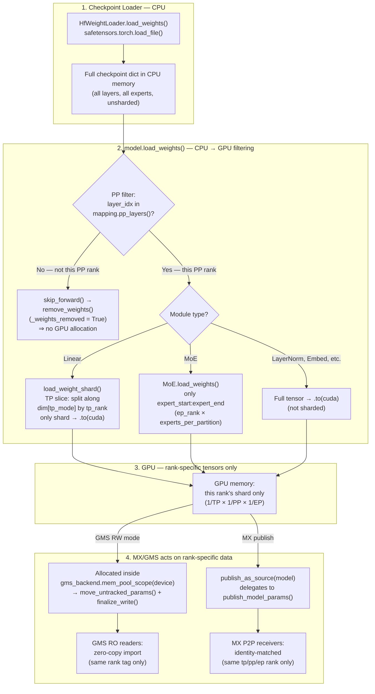
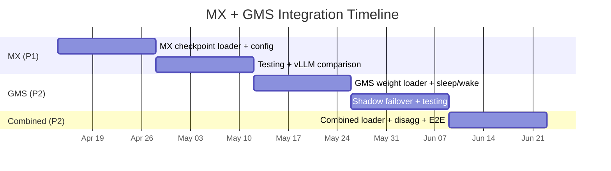

# 4. Implementation & API Design

[< Back to Overview](README.md)

**Last Updated:** 2026-04-14

---

## Overview

### Two-Axis Design Principle

TRT-LLM's `ModelLoader.load()` already separates two independent concerns:

| Axis | Controlled by | Current values | What it decides |
|:-----|:-------------|:---------------|:----------------|
| **Weight source** | `checkpoint_format` (string) → `@register_checkpoint_loader` | `"HF"`, `"mistral"`, `"mistral_large_3"` | *Where* weights come from (file format / transfer mechanism) |
| **Loading mode** | `LoadFormat` (enum) → `if/elif` branches in `ModelLoader.load()` | `AUTO`, `DUMMY`, `VISION_ONLY` | *How* the loading pipeline behaves (memory management, orchestration) |

These compose independently, giving us four integration modes:

| Mode | `checkpoint_format` | `LoadFormat` | Behavior |
|:-----|:-------------------|:-------------|:---------|
| **Pure TRT-LLM** | `"HF"` (default) | `AUTO` (default) | Current behavior, unchanged |
| **MX only** | `"MX"` | `AUTO` | MX P2P source, standard CUDA allocator |
| **GMS only** | `"HF"` (default) | `GMS` | Disk source, GMS memory management |
| **MX + GMS** | `"MX"` | `GMS` | MX P2P source, GMS memory management **(see [critical limitation](#critical-limitation-mxgms-combined--gms-only))** |

MX is a weight *source* (it replaces where weights come from — P2P instead of disk). GMS is a memory *management mode* (it replaces how GPU memory is allocated and shared). Conflating them into a single enum creates combinatorial explosion and doesn't compose. The two-axis approach avoids this.

**Relationship to PR #12898:** [PR #12898](https://github.com/NVIDIA/TensorRT-LLM/pull/12898) from the MX team adds `LoadFormat.PRESHARDED = 3`, conflating both axes into a single `LoadFormat` — "weights are pre-sharded" (a source property) AND "use this loading pipeline." This works for MX alone but prevents composition with GMS. Key insights from PR #12898 that we adopt:
- **Pre-`post_load_weights()` publish timing**: Publishing weights before `post_load_weights()` so targets run their own transforms independently.
- **`_weights_presharded` flag on Linear modules**: Setting `tp_size = 1` to skip TP slicing for pre-sharded weights — but as a **context-derived flag**, not tied to a specific `LoadFormat`.

### Existing Prototypes

This plan treats MX and GMS as **library dependencies**, not things to reimplement:

- **MX (ModelExpress)**: The [`modelexpress`](https://github.com/ai-dynamo/modelexpress) library provides a gRPC server, Python client SDK, and NIXL-based GPU-to-GPU transfer. vLLM's `--load-format mx` integration is a thin loader (~500 lines) that calls the MX client API. [PR #12898](https://github.com/NVIDIA/TensorRT-LLM/pull/12898) demonstrates a working MX prototype with TRT-LLM.
- **GMS (GPU Memory Service)**: The [`gpu_memory_service`](https://github.com/ai-dynamo/dynamo/pull/7053) library provides the CUDA VMM allocator, RW/RO client, and socket-based locking. Each GMS server manages memory for exactly one GPU — on an 8-GPU node, the GMS launcher spawns 16 independent processes (one per GPU per tag: `weights` and `kv_cache`). Socket paths use GPU hardware UUID for stability: `{GMS_SOCKET_DIR}/gms_{GPU_UUID}_{tag}.sock`. PR #7053 shows a working TRT-LLM integration (~300 lines).
- **Two-axis prototype**: The [`dynamo-integration-prototype`](https://github.com/chienchunhung/TensorRT-LLM/tree/dynamo-integration-prototype) branch implements the full two-axis integration model (~830 lines changed across 15 files).

### Scope

All implementation targets the **PyTorch backend** with KV Cache Manager V1, C++ transceiver, and `trtllm-serve`. The TensorRT (legacy) backend is out of scope. AutoDeploy inherits PyTorch backend behavior.

**Glossary:**

| Term | Meaning |
|:-----|:--------|
| **MX** | ModelExpress — GPU-to-GPU model weight streaming service |
| **GMS** | GPU Memory Service — out-of-process GPU memory management for zero-copy sharing and crash resilience |
| **NIXL** | NVIDIA Inference eXchange Library — unified transfer API used by both MX and TRT-LLM's disaggregated serving |

---

## Weight Loading Pipeline: Parallelism and MX/GMS

A critical design property: **TP, PP, and EP sharding all happen during `model.load_weights()`, before MX or GMS acts on the GPU tensors.** By the time MX publishes weights or GMS commits them, the tensors are already rank-specific.

### Where TP/PP/EP Sharding Happens



| Parallelism | Where filtered | Mechanism | Code location |
|:------------|:---------------|:----------|:-------------|
| **TP** | `load_weight_shard()` per Linear module | Slices weight along `split_dim` using `tp_rank/tp_size`, moves only the shard to GPU | `_torch/modules/linear.py:100` |
| **PP** | Model `__init__` via `skip_forward()` | Layers not in `mapping.pp_layers()` get `remove_weights()` → `_parameters` cleared, `_weights_removed=True` → `_load_weights_impl` skips them entirely | `_torch/models/modeling_utils.py:295` |
| **EP** | `MoE.load_weights()` | Only iterates `range(expert_start, expert_end)` where `expert_start = ep_rank × expert_size_per_partition` | `_torch/modules/fused_moe/fused_moe_vanilla.py:466` |

### Design Choice: Post-Sharded Sharing

| | Option A: Share unsharded (minimum) | Option B: Share post-sharded (current design) |
|:--|:--------------------------------------|:----------------------------------------------|
| **What's shared** | Raw unsharded weights from checkpoint | Rank-specific, TP/PP/EP-sharded GPU tensors |
| **Receiver work** | Must re-shard for its own TP/PP/EP rank | Zero — weights are ready to use |
| **MX matching** | Any source works for any rank | Must match TP/PP/EP rank identity exactly |
| **GMS sharing** | One GMS tag for all ranks on the node | Per-rank GMS tags |
| **Cross-config reuse** | Yes (e.g., TP=4 source → TP=8 receiver re-shards) | No — different parallelism config = incompatible |
| **Startup speed** | Slower (P2P + re-shard on receiver) | Fastest (P2P or zero-copy, immediately usable) |

**Rationale for Option B:** The primary use case is **elastic scaling** — spinning up identical replicas with the same parallelism configuration. Rank-matched sharing gives maximum speed with zero receiver-side work. Option A would only matter for parallelism reconfiguration (e.g., TP=4 → TP=8), which requires re-sharding logic and is out of scope.

### CPU Checkpoint Loading Overhead

> **Known overhead:** The current `HfWeightLoader` loads the **full checkpoint** into CPU memory via `safetensors.torch.load_file()`, regardless of this rank's TP/PP/EP configuration. For a 671B-parameter model, every rank temporarily holds ~1.3 TB of CPU data.
>
> **Potential optimization:** Safetensors index files (`model.safetensors.index.json`) contain a `weight_map` mapping tensor names to shard files. A PP-aware loader could parse this index and only load files containing this PP rank's layers — reducing CPU memory by ~`1/pp_size`. Similarly, an EP-aware loader could skip files that only contain experts outside this rank's range. This is independent of MX/GMS and benefits all loading paths.

---

## MX Integration

MX integrates on the **weight source axis** (`checkpoint_format`) — it replaces *where* weights come from (P2P instead of disk) without changing how GPU memory is managed.

### MX Checkpoint Loader

A new `MXCheckpointLoader` registered via `@register_checkpoint_loader("MX")`. It **subclasses `HfCheckpointLoader`** so disk fallback is inherited automatically. The actual NIXL/RDMA mechanics live in the upstream [`modelexpress.trtllm_live_transfer`](https://github.com/ai-dynamo/modelexpress/blob/main/modelexpress_client/python/modelexpress/trtllm_live_transfer.py) module — TRT-LLM is a thin adapter that calls `MxLiveWeightLoader` for receive and `publish_model_params` for publish.

> **Prototype:** [`dynamo-integration-prototype`](https://github.com/chienchunhung/TensorRT-LLM/tree/dynamo-integration-prototype) branch, `tensorrt_llm/_torch/models/checkpoints/mx/checkpoint_loader.py`.

Key design decisions:

- **Inherits `HfCheckpointLoader`**, reusing HF weight loader, config loader, and weight mapper registries. Fallback is simply `super().load_weights()`.
- **Delegates transport to upstream `MxLiveWeightLoader`.** TRT-LLM does not re-implement NIXL setup, source matching, dtype-cast handling, or PVC fallback — `modelexpress.trtllm_live_transfer.MxLiveWeightLoader.load_weights(checkpoint_dir, mapping=, model=)` does all of that. We only invoke it at the right point in the loading pipeline.
- **`p2p_succeeded` property.** The loader exposes a boolean. `ModelLoader.load()` reads this and sets `_weights_presharded` on the model's `Linear` modules — keeping the flag on the model (where it's consumed) rather than on the loader. Draft model modules are excluded (they load independently from disk).
- **Mixed-success conservatism.** If `MxLiveWeightLoader.load_weights()` returns a non-empty fallback dict (size-mismatched tensors that need disk loading), we treat the whole load as MX-failed and run the standard disk path, rather than mixing presharded and non-presharded weights in the same model. Per-tensor presharded marking will land when [`LoadFormat.PRESHARDED`](15-prototype-validation-plan.md#-api-alignment--prototype--current-gms--mx-done) is plumbed upstream (tracked as MX-1).

```python
@register_checkpoint_loader("MX")
class MXCheckpointLoader(HfCheckpointLoader):
    """Weight source: P2P via MX, with HF disk fallback."""

    def __init__(self, *, weight_loader=None, weight_mapper=None,
                 config_loader=None, mx_server_url=None):
        super().__init__(weight_loader=weight_loader,
                         weight_mapper=weight_mapper,
                         config_loader=config_loader)
        self._checkpoint_format = "MX"
        self._mx_server_url = mx_server_url
        self._p2p_succeeded = False

    @property
    def checkpoint_format(self) -> str:
        return "MX"

    @property
    def p2p_succeeded(self) -> bool:
        return self._p2p_succeeded

    def load_weights(self, checkpoint_dir, mapping, **kwargs):
        model = kwargs.pop("model", None)
        self._p2p_succeeded = False

        if self._mx_server_url is None or model is None:
            return self._fallback_to_disk(checkpoint_dir, mapping, **kwargs)

        try:
            from modelexpress.trtllm_live_transfer import MxLiveWeightLoader
        except ImportError:
            logger.warning(
                "modelexpress not installed; install with `pip install tensorrt_llm[mx]`")
            return self._fallback_to_disk(checkpoint_dir, mapping, **kwargs)

        try:
            mx_loader = MxLiveWeightLoader(mx_server=self._mx_server_url)
            fallback_weights = mx_loader.load_weights(
                checkpoint_dir, mapping=mapping, model=model)
        except Exception as e:
            logger.warning("MX P2P transfer failed: %s", e)
            return self._fallback_to_disk(checkpoint_dir, mapping, **kwargs)

        if fallback_weights:
            # Conservative: avoid mixing presharded and non-presharded weights.
            # See MX-1 in §15 (LoadFormat.PRESHARDED upstream alignment).
            return self._fallback_to_disk(checkpoint_dir, mapping, **kwargs)

        self._p2p_succeeded = True
        return {}  # Weights already in model params

    def _fallback_to_disk(self, checkpoint_dir, mapping, **kwargs):
        return super().load_weights(checkpoint_dir, mapping=mapping, **kwargs)

    def publish_as_source(self, model, mapping=None, checkpoint_dir=None):
        """Publish model weights as MX source for other replicas.
        Called BEFORE post_load_weights() so targets receive raw state."""
        if self._mx_server_url is None:
            return
        try:
            from modelexpress.trtllm_live_transfer import publish_model_params
        except ImportError:
            return

        # publish_model_params reads MODEL_EXPRESS_URL from env;
        # set it from our config so per-instance URLs are respected.
        # (Tracked as MX-2 in §15: promote _build_trtllm_identity to public
        # API so we can build identity directly without env-var indirection.)
        import os
        prior = os.environ.get("MODEL_EXPRESS_URL")
        os.environ["MODEL_EXPRESS_URL"] = self._mx_server_url
        try:
            publish_model_params(model)
        except Exception as e:
            logger.warning("Failed to publish MX source: %s", e)
        finally:
            if prior is None:
                os.environ.pop("MODEL_EXPRESS_URL", None)
            else:
                os.environ["MODEL_EXPRESS_URL"] = prior
```

### MX Source Publish Timing

`publish_as_source()` is called **before** `post_load_weights()` so that receivers get raw loaded state and run their own model-specific transforms independently. This avoids double-applying transforms like layer aliasing. See the [Combined MX+GMS](#combined-mxgms) section for the full orchestration.

### Identity Schema (current MX library)

Identity construction lives in the upstream `_build_trtllm_identity` helper (currently private; promotion to public is tracked as MX-2 in [§15](15-prototype-validation-plan.md#-api-alignment--prototype--current-gms--mx-done)). The current `p2p_pb2.SourceIdentity` schema uses structured fields — no more `extra_params` dict:

```python
# What MxLiveWeightLoader builds internally:
p2p_pb2.SourceIdentity(
    mx_version=...,
    mx_source_type=p2p_pb2.MX_SOURCE_TYPE_WEIGHTS,
    model_name=os.environ.get("MODEL_NAME", "unknown"),
    backend_framework=p2p_pb2.BACKEND_FRAMEWORK_TRT_LLM,
    tensor_parallel_size=tp_size,
    pipeline_parallel_size=pp_size,
    expert_parallel_size=ep_size,
    dtype="bfloat16",
)
```

Per-rank addressing currently uses `WorkerMetadata.worker_rank` (== MPI rank). Adding explicit `tp_rank` / `pp_rank` / `ep_rank` fields to the schema is tracked as MX-3 in [§15](15-prototype-validation-plan.md#-api-alignment--prototype--current-gms--mx-done) — needed for non-MPI deployments (Ray, K8s with TCP-based discovery).

### What TRT-LLM Implements vs. MX SDK

| TRT-LLM (`MXCheckpointLoader`, ~230 lines) | MX Client SDK (`modelexpress`) |
|:----------------------|:-------------------------------|
| `MXCheckpointLoader` class | gRPC connection (`MxClient`) |
| Integration policy (when in the load pipeline to invoke MX) | Source discovery (`MxClient.list_sources` + `MxClient.get_metadata`) |
| Disk-fallback orchestration | NIXL-based P2P transfer (`MxLiveWeightLoader.load_weights(model=...)`) |
| Source publish hook (`publish_as_source`) | Source registration (`publish_model_params`) |
| | Heartbeat and lifecycle |
| | Three-tier fallback (RDMA → GDS → Disk) |

---

## GMS Integration

GMS integrates on the **loading mode axis** (`LoadFormat`) — it replaces *how* GPU memory is managed (out-of-process shared pool) without changing where weights come from. The `LoadFormat.GMS` branch composes with **any** checkpoint loader (HF, Mistral, or MX).

> **GMS deployment model:** Each GMS server manages memory for exactly **one GPU**. On an 8-GPU node, the GMS launcher spawns **16 independent processes** — one `weights` service and one `kv_cache` service per GPU. The two-tag split is architecturally significant: the `kv_cache` GMS instance enables releasing KV cache memory independently of weights during shadow failover (sleep releases `kv_cache` tag; weights stay shared via `weights` tag). Each process listens on its own Unix socket: `{GMS_SOCKET_DIR}/gms_{GPU_UUID}_{tag}.sock`, where the GPU UUID is resolved via pynvml for stability across `CUDA_VISIBLE_DEVICES` configurations. Sharing is strictly per-GPU — this is a CUDA VMM hardware constraint, not a GMS design choice.

### GMS Loading Mode

> **Prototype:** [`dynamo-integration-prototype`](https://github.com/chienchunhung/TensorRT-LLM/tree/dynamo-integration-prototype) branch. `GMSBackend` at `tensorrt_llm/_torch/memory/gpu_memory_backend.py`; `LoadFormat.GMS` branch in `tensorrt_llm/_torch/pyexecutor/model_loader.py`.

Key design decisions:

- **`GMSBackend` class** wraps the GMS client SDK, encapsulating connection, mode resolution, and lifecycle. This is the concrete implementation of the `GPUMemoryBackend` protocol (see [API Stability](#gms-api-stability-abstraction) below).
- **Mode resolved at connect time.** `GMSBackend.connect()` calls upstream `get_or_create_gms_client_memory_manager(socket, device, mode=RW_OR_RO, tag=...)` and inspects the returned `granted_lock_type` (`GrantedLockType.RW` or `RO`) to set the `is_rw` property. The `is_rw` property is then used to branch.
- **Meta-init preserved.** The prototype skips `meta→CUDA` tensor init and `model.to("cuda")` for `LoadFormat.GMS`. The RW path allocates under the GMS pool via `mem_pool_scope`; the RO path replaces meta tensors via `materialize_module()`.
- **No monkey-patching.** We deliberately do NOT use the upstream `gpu_memory_service.integrations.trtllm.setup_gms()` entry point — it works by patching `tensorrt_llm._torch.pyexecutor.model_loader.ModelLoader.load` from outside, which is opaque at code-review time and conflicts with TRT-LLM's two-axis design. TRT-LLM owns the integration policy; `GMSBackend` is the explicit, reviewable boundary. See GMS-1 in [§15 Upstream Alignment Requests](15-prototype-validation-plan.md#-api-alignment--prototype--current-gms--mx-done).

```python
# In ModelLoader.load() — tensorrt_llm/_torch/pyexecutor/model_loader.py

elif load_format == LoadFormat.GMS:
    from tensorrt_llm._torch.memory import GMSBackend

    gms_backend = GMSBackend(
        socket_path=self.llm_args.gms_socket_path,
        mapping=self.mapping,
        mode=self.llm_args.gms_mode or "auto",
        tag=self.llm_args.gms_tag or GMSBackend.DEFAULT_TAG,  # "weights"
    )

    if not gms_backend.connect():
        raise RuntimeError("Failed to connect to GMS")

    if gms_backend.is_rw:
        # GMS RW path: load via checkpoint_loader inside the GMS pool scope
        # so allocations land in the shared memory region.
        device = torch.device('cuda')

        with gms_backend.mem_pool_scope(device):
            weights = checkpoint_loader.load_weights(
                checkpoint_dir, mapping=self.mapping)
            if weights:
                self.weight_mapper = (
                    checkpoint_loader
                    .get_initialized_weight_mapper(model, config))
                self._call_load_weights(
                    model.load_weights, weights, self.weight_mapper)

            # Drain the caching allocator before finalize so transient
            # buffers don't get committed as cache fragmentation.
            torch.cuda.empty_cache()

        # Move stray params allocated outside the pool scope (e.g. by
        # post_load_weights transforms) into the GMS pool, then commit.
        gms_backend.move_untracked_params(model)
        gms_backend.finalize_write(model)
        # finalize_write() delegates to upstream finalize_gms_write()
        # which handles register + commit + RO reconnect + remap in one shot.
    else:
        # GMS RO path: post_load_weights() BEFORE materialize
        # (sets up module aliases so GMS can resolve stored paths)
        for module in model.modules():
            if hasattr(module, 'post_load_weights') and not getattr(
                    module, '_weights_removed', False):
                module.post_load_weights()

        gms_backend.materialize_module(model)
        # _weights_presharded is set as part of materialization

    self._gms_backend = gms_backend
```

### GMS RO: Why `post_load_weights()` Before `materialize_module()`

`post_load_weights()` creates **module aliases** (e.g., `layer.next_attn = self.model.layers[idx+1].self_attn`). Because `self_attn` is an `nn.Module`, PyTorch's `__setattr__` registers it in `layer._modules['next_attn']`. GMS's `materialize_module_from_gms()` walks the module tree to resolve stored tensor paths — if `next_attn` doesn't exist yet, resolution fails with `AttributeError`.

This is safe because at GMS RO time the model is still on meta device — `post_load_weights()` only performs Python pointer assignments, no tensor operations. See [Challenges — Module Path Resolution](05-challenges.md#7-module-path-resolution-gms-specific) for details.

### GMS API Stability Abstraction

A thin `Protocol` to insulate TRT-LLM from upstream GMS API changes. The TRT-LLM-side adapter (`GMSBackend`) is the only place that imports `gpu_memory_service.*` symbols — all call sites in `model_loader.py` go through this protocol:

```python
@runtime_checkable
class GPUMemoryBackend(Protocol):
    """Thin abstraction over GMS client for API stability."""
    def connect(self) -> bool: ...
    @property
    def is_rw(self) -> Optional[bool]: ...
    def has_committed_weights(self) -> bool: ...
    def mem_pool_scope(
        self,
        device: Optional[torch.device] = None,
    ) -> "Iterator[None]":
        """Context manager scoping CUDA allocations to the backend pool."""
        ...
    def materialize_module(self, model: torch.nn.Module) -> None: ...
    def finalize_write(self, model: torch.nn.Module) -> int: ...
    def move_untracked_params(self, model: torch.nn.Module) -> None: ...
    def cleanup(self) -> None: ...
```

`GMSBackend` is the concrete implementation. The protocol calls map directly to upstream Layer 2 primitives:

| `GPUMemoryBackend` method | Upstream call (Layer 2) |
|:---|:---|
| `connect()` | `get_or_create_gms_client_memory_manager(socket, device, mode, tag=...)` |
| `mem_pool_scope(device)` | `gms_use_mem_pool(tag, device)` (context manager) |
| `materialize_module(model)` | `materialize_module_from_gms(mgr, model, device_index=N)` |
| `finalize_write(model) -> int` | `finalize_gms_write(mgr, model)` (handles register + sync + commit + RO reconnect + remap) |
| `move_untracked_params(model)` | re-implements upstream private `_move_untracked_params` (tracked as GMS-2 in [§15](15-prototype-validation-plan.md#-api-alignment--prototype--current-gms--mx-done)) |
| `cleanup()` | `mgr.close()` + `evict_gms_client_memory_manager(mgr)` |
| `connect()` (post) | `patch_empty_cache()` (VMM safety) |

If the GMS API drifts, only `GMSBackend` needs updating. If GMS becomes unsuitable, a `CudaIpcBackend` could implement the same protocol as a less-featured fallback.

### What TRT-LLM Implements vs. GMS Library

| TRT-LLM (`GMSBackend` adapter, ~300 lines) | GMS Client Library (`gpu_memory_service`) |
|:----------------------|:------------------------------------------|
| `LoadFormat.GMS` branch in `ModelLoader.load()` (~60 lines) | `CUDAPluggableAllocator` + `MemPool` (intercepts `torch` allocations via CUDA VMM) |
| `GMSBackend` class wrapping `GMSClientMemoryManager` | `materialize_module_from_gms()` (zero-copy tensor creation from shared GPU memory) |
| Meta-init skip for `LoadFormat.GMS` | `gms_use_mem_pool(tag, device)` (the context manager our `mem_pool_scope` delegates to) |
| `post_load_weights()` ordering guard | `finalize_gms_write()` (register + sync + commit + RO reconnect + remap, one call) |
| Two-axis composition with `checkpoint_format=MX` | RW/RO socket-based locking via `GMSClientMemoryManager.granted_lock_type` |
| Optional dep declared as `pip install tensorrt_llm[gms]` | — |
| | CUDA VMM FD import/export (`cuda_utils.py`) |
| | Lock upgrade (RO → RW) for shadow failover |
| | Sleep/wake (unmap/remap VMM virtual addresses) |

---

## Combined MX+GMS

When both axes are active (`checkpoint_format="MX"` + `LoadFormat.GMS`), the orchestration in `ModelLoader.load()` ties them together:

### Orchestration

```python
# After model.load_weights() and GMS finalize_write (if GMS RW):

# 1. MX source publish — fires for AUTO and GMS-RW, not GMS-RO or DUMMY
should_publish = (
    load_format == LoadFormat.AUTO
    or (load_format == LoadFormat.GMS
        and self._gms_backend is not None
        and self._gms_backend.is_rw))
if (should_publish
        and hasattr(checkpoint_loader, 'publish_as_source')):
    checkpoint_loader.publish_as_source(
        model, mapping=self.mapping, checkpoint_dir=checkpoint_dir)

# 2. post_load_weights() — skipped for GMS RO (already ran before materialize)
gms_ro_done = (load_format == LoadFormat.GMS
               and self._gms_backend is not None
               and not self._gms_backend.is_rw)
if not gms_ro_done:
    for module in model.modules():
        if hasattr(module, 'post_load_weights') and not getattr(
                module, '_weights_removed', False):
            module.post_load_weights()

# 3. Pre-sharded flag — set independently by each path
mx_p2p_succeeded = (hasattr(checkpoint_loader, 'p2p_succeeded')
                     and checkpoint_loader.p2p_succeeded)
if mx_p2p_succeeded:
    from tensorrt_llm._torch.modules.linear import Linear
    draft_modules = set()
    if hasattr(model, 'draft_model') and model.draft_model is not None:
        draft_modules = set(id(m) for m in model.draft_model.modules())
    for module in model.modules():
        if isinstance(module, Linear) and id(module) not in draft_modules:
            module._weights_presharded = True
# GMS RO sets _weights_presharded inside GMSBackend.materialize_module()
```

The `_weights_presharded` attribute is declared on `Linear.__init__` (defaulting to `False`). The Linear module uses `tp_size = 1` when `_weights_presharded` (adopted from [PR #12898](https://github.com/NVIDIA/TensorRT-LLM/pull/12898)).

### Priority Cascade

The combined mode uses this priority cascade:
1. **Local GMS** (if committed weights exist) — fastest (~100ms, GMS RO import)
2. **Remote MX source** (P2P to local GPU under GMS pool, then commit to GMS) — fast (~15-30s)
3. **Disk/HuggingFace** (seed load under GMS pool, commit to GMS, register as MX source) — slow (minutes)

The two-axis model means this cascade requires no special combined code — `LoadFormat.GMS` naturally checks for committed weights first, then falls through to the checkpoint loader (which happens to be MX).

### Critical Limitation: MX+GMS Combined = GMS-Only

> **This is the most important optimization item for the combined mode.**
>
> In the current prototype, `checkpoint_format="MX"` + `load_format=GMS` behaves **identically** to `checkpoint_format="HF"` + `load_format=GMS`. The combined mode provides **no benefit over GMS-only**. Step 2 of the priority cascade (MX P2P under GMS pool) does not work.
>
> **Root cause: CUDA memory pool isolation.** GMS RW mode requires all weight memory to be allocated inside `gms_backend.mem_pool_scope(device)` (which delegates to upstream `gms_use_mem_pool(tag, device)`). When MX receives weights via P2P RDMA, the MX/NIXL layer allocates CUDA buffers **inside the MX SDK** — outside the pool-scope context. Those received weights land in regular CUDA memory that GMS cannot manage or share with RO readers.
>
> | Mode | Node B, Worker 1 (first on node) | Node B, Worker 2+ |
> |:-----|:---------------------------------|:-------------------|
> | **MX only** (`LoadFormat.AUTO`) | P2P from Node A (~15-30s), regular CUDA memory | Must load independently (no sharing) |
> | **GMS only** (`LoadFormat.GMS`) | Load from disk (minutes), commits to GMS | Zero-copy RO (~100ms) |
> | **MX + GMS** (current) | Load from disk (minutes), commits to GMS — **same as GMS-only** | Zero-copy RO (~100ms) |
>
> **Required optimization:** Pre-allocate empty CUDA buffers under the GMS pool, then pass those buffer pointers to the MX SDK as P2P receive targets. This would allow MX to write directly into GMS-managed memory. **This requires MX SDK support for receiving into pre-allocated buffers** rather than SDK-managed allocations — coordinate with the MX team.
>
> See [Section 3 — Architecture](03-architecture.md) for the full architectural explanation.

---

## Configuration

The two-axis model maps cleanly to TRT-LLM's existing configuration:

```python
# Additions to tensorrt_llm/llmapi/llm_args.py

class LoadFormat(Enum):
    AUTO = 0
    DUMMY = 1
    VISION_ONLY = 2
    GMS = 3           # New: GMS memory management mode

class TorchLlmArgs(BaseLlmArgs):
    # Existing fields (checkpoint_format already exists):
    checkpoint_format: str = "HF"      # Add "MX" as a valid value
    load_format: LoadFormat = LoadFormat.AUTO

    # MX-specific (only when checkpoint_format="MX")
    mx_server_url: Optional[str] = Field(default=None, status="prototype")
    mx_preshard_strategy: str = Field(
        default="per_module", status="prototype")
        # "per_module" — set _weights_presharded=True per Linear after MX P2P
        # "global"     — would map to LoadFormat.PRESHARDED upstream;
        #                raises NotImplementedError until that lands
        #                (tracked as MX-1 in §15)

    # GMS-specific (only when load_format=GMS)
    gms_socket_path: Optional[str] = Field(
        default=None, status="prototype")  # Default: resolved via gpu_memory_service.common.utils.get_socket_path(device, tag)
        # GMS uses GPU hardware UUID, not device index, for stability
        # across CUDA_VISIBLE_DEVICES configurations.
    gms_mode: Optional[str] = Field(
        default="auto", status="prototype")  # "auto" (= RW_OR_RO), "rw", or "ro"
    gms_tag: str = Field(
        default="weights", status="prototype")
        # Matches the GMS library convention: "weights" for model weights,
        # "kv_cache" for KV cache (see GMS_TAGS in
        # gpu_memory_service.integrations.common.utils).
```

All five fields have `status="prototype"` and are registered in the API stability YAML.

**Validators:**
- `validate_mx_config()`: warns if `mx_server_url` is set but `checkpoint_format != "MX"`; rejects invalid `mx_preshard_strategy` values; warns if `mx_preshard_strategy != "per_module"` is set without `checkpoint_format == "MX"`.
- `validate_gms_config()`: validates `gms_mode` is one of `"auto"`, `"rw"`, `"ro"`; warns if `gms_socket_path` is set but `load_format != GMS`.

**CLI usage:**

```bash
# MX only (P2P across nodes)
trtllm-serve meta-llama/Llama-3.1-70B \
    --checkpoint-format mx --mx-server-url http://mx:8001

# GMS only (crash resilience + shadow failover within node)
# Socket path auto-resolved from GPU UUID if omitted; override with --gms-socket-path
trtllm-serve meta-llama/Llama-3.1-70B \
    --load-format gms

# MX + GMS (combined)
trtllm-serve meta-llama/Llama-3.1-70B \
    --checkpoint-format mx --mx-server-url http://mx:8001 \
    --load-format gms

# Pure TRT-LLM (unchanged, default)
trtllm-serve meta-llama/Llama-3.1-70B
```

---

## Implementation Roadmap



| Milestone | Duration | Cumulative | Key success criteria |
|:----------|:---------|:-----------|:---------------------|
| **MX** | 3-4 weeks | 3-4 weeks | Cold-start < 30s (Llama-70B); P2P > 20 GB/s; within 20% of vLLM MX |
| **GMS** | 3-4 weeks | 6-8 weeks | Shadow failover < 5s (requires warm compile cache on v3 code — see [§07 Tiered Compile Cache](07-compile-cache.md)); GMS RO import < 500ms; crash-resilient memory; bit-exact correctness |
| **Combined** | 2-3 weeks | 8-11 weeks | DeepSeek-V3 cold-start < 30s; < 2% throughput regression; E2E disagg validation |

Compressed from 18-22 weeks because TRT-LLM is integrating with existing libraries, not building them.
