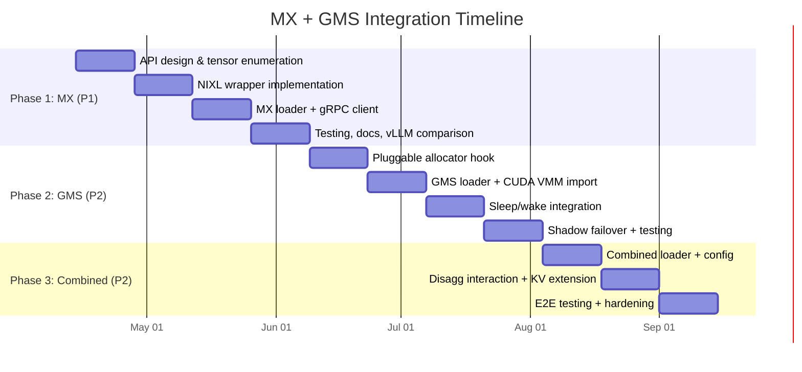

# 4. Implementation Plan

[< Back to Overview](README.md)

## Phased Approach



---

## Phase 1: MX + TRT-LLM (Cross-Node P2P) — 6-8 Weeks

**Priority:** P1 (Tier 1) — competitive catch-up with vLLM
**Objective:** Enable P2P weight transfer across nodes via `--load-format mx`

### Deliverables

| # | Deliverable | Description | Files |
|:--|:-----------|:-----------|:------|
| 1.1 | `WeightLoaderProtocol` | Base protocol for custom weight loaders | `_torch/weight_loaders/base.py` |
| 1.2 | Tensor enumeration API | Enumerate model tensors for P2P registration | `_torch/utils/tensor_utils.py` |
| 1.3 | NIXL/TransferEngine wrapper | Adapt NIXL for TRT-LLM's tensor layout | `_torch/weight_loaders/nixl_wrapper.py` |
| 1.4 | MX weight loader | `@register_weight_loader("mx")` implementation | `_torch/weight_loaders/mx_loader.py` |
| 1.5 | MX gRPC client integration | Source registration, discovery, heartbeat | `_torch/weight_loaders/mx_client.py` |
| 1.6 | Configuration schema | `load_format`, `mx_server_url`, etc. in `TorchLlmArgs` | `llmapi/llm_args.py` |
| 1.7 | Three-tier fallback | P2P -> GDS -> Disk with graceful degradation | `_torch/weight_loaders/mx_loader.py` |
| 1.8 | Tests and documentation | Unit tests, integration tests, user guide | `tests/`, `docs/` |

### Week-by-Week Plan

**Weeks 1-2: API Design & Tensor Enumeration**
- Define `WeightLoaderProtocol` (see [API Design](05-api-design.md))
- Implement `enumerate_model_tensors()` handling:
  - Parameters and buffers
  - Tied weights (deduplicated by `data_ptr`)
  - Non-contiguous views (report underlying storage)
  - Quantization scales (`weight_scale_inv`, etc.)
- Add `post_load_callback` to `ModelLoader`
- **Gate:** API spec reviewed and approved

**Weeks 3-4: NIXL Wrapper**
- Study vLLM's MX loader implementation (`vllm/model_executor/model_loader/mx_loader.py`) — learn what works, what's tricky
- Implement NIXL wrapper for TRT-LLM tensor registration
- Handle TP rank matching in source discovery
- Handle PP layer subsetting
- Handle EP expert distribution
- **Gate:** NIXL wrapper can register and transfer a single tensor P2P

**Weeks 5-6: MX Loader + gRPC Client**
- Implement `ModelExpressWeightLoader`:
  ```python
  class ModelExpressWeightLoader(BaseWeightLoader):
      def load_weights(self, model, mapping, config):
          sources = self.mx_client.list_sources(identity, status=READY)
          candidates = [s for s in sources if self._rank_matches(s)]
          if candidates:
              self._p2p_receive(candidates[0], model)
          else:
              self._load_from_disk_and_publish(model)
  ```
- Integrate with MX gRPC client (source registration, heartbeat)
- Implement `SourceIdentity` with quantization config hash
- Implement three-tier fallback (P2P -> GDS -> Disk)
- **Gate:** P2P transfer working between 2 nodes with Llama-8B

**Weeks 7-8: Testing & Documentation**
- Unit tests: tensor enumeration, rank matching, fallback logic
- Integration tests: 2-node P2P, multi-rank TP, cold-start benchmark
- Compare performance against vLLM's `--load-format mx`
- User guide: setup, configuration, troubleshooting
- **Gate:** All tests passing; cold-start benchmark within 20% of vLLM MX

### Phase 1 Success Criteria

| Metric | Target |
|:-------|:-------|
| Cold-start (Llama-70B, 2nd replica) | < 30s (vs. 2-3 min baseline) |
| P2P transfer throughput | > 20 GB/s (NVLink), > 10 GB/s (InfiniBand) |
| Graceful fallback to disk | Yes, with warning log |
| vLLM parity | Within 20% of vLLM MX cold-start time |

---

## Phase 2: GMS + TRT-LLM (Within-Node Sharing) — 6-8 Weeks

**Priority:** P2 (Tier 2) — differentiation; enables fault tolerance
**Objective:** Enable zero-copy weight sharing and crash-resilient failover

### Deliverables

| # | Deliverable | Description | Files |
|:--|:-----------|:-----------|:------|
| 2.1 | Pluggable GPU memory allocator | `CUDAPluggableAllocator` routing to GMS | `_torch/memory/gms_allocator.py` |
| 2.2 | CUDA VMM FD import/export | Import external memory via file descriptor | `_torch/memory/external_memory.py` |
| 2.3 | GMS weight loader | `@register_weight_loader("gms")` with RW/RO modes | `_torch/weight_loaders/gms_loader.py` |
| 2.4 | Sleep/wake GMS mapping | Map `release_with_tag` / `materialize_with_tag` to GMS | `_torch/weight_loaders/gms_loader.py` |
| 2.5 | Shadow failover integration | PyExecutor shadow mode with GMS-backed takeover | `_torch/pyexecutor/py_executor.py` |
| 2.6 | Configuration schema | `gms_socket_path`, `gms_mode`, etc. | `llmapi/llm_args.py` |
| 2.7 | Tests and documentation | Unit tests, failover tests, user guide | `tests/`, `docs/` |

### Week-by-Week Plan

**Weeks 1-2: Pluggable Allocator + CUDA VMM**
- Implement `GMSAllocator` using `torch.cuda.memory.CUDAPluggableAllocator`:
  ```python
  class GMSAllocator:
      def malloc(self, size, device, stream) -> int:
          ptr = self.gms_client.create_mapping(size=size)
          return ptr
      def free(self, ptr, size, device, stream):
          self.gms_client.destroy_mapping(ptr)
  ```
- Implement `import_cuda_memory(fd, size, device)` and `export_cuda_memory(tensor)`
- Handle allocation/deallocation lifecycle correctly
- **Risk mitigation:** Start with simple contiguous allocations; handle edge cases incrementally
- **Gate:** Can allocate a tensor via GMS allocator and read it from another process

**Weeks 3-4: GMS Loader + RW/RO Modes**
- Implement `GMSWeightLoader`:
  ```python
  class GMSWeightLoader(BaseWeightLoader):
      def load_weights(self, model, mapping, config):
          if self._should_use_ro_mode():
              self._import_from_gms(model)  # Zero-copy, ~100ms
          else:
              self._load_normally_and_commit(model)  # Full load, commit to GMS
  ```
- RW mode: Load weights normally, then commit tensor storage to GMS pool
- RO mode: Import GMS memory via FD, reconstruct tensors with correct shapes/dtypes
- Handle module path resolution (fix aliased layer issues from PR #7053 prototype)
- **Gate:** Two workers sharing weights on same GPU with correct inference results

**Weeks 5-6: Sleep/Wake + Shadow Failover**
- Map GMS operations to existing TRT-LLM sleep/wake:
  | TRT-LLM Operation | GMS Mapping |
  |:-------------------|:------------|
  | `release_with_tag("model_weights")` | Release RW lock, keep GMS memory |
  | `materialize_with_tag("model_weights")` | Re-import from GMS (RO or RW) |
  | `release_with_tag("kv_cache")` | Release KV cache memory (standard) |
  | `materialize_with_tag("kv_cache")` | Re-allocate KV cache (standard) |
- Implement shadow mode in PyExecutor (see [Executor Failover](06-executor-failover.md)):
  - Shadow worker starts with GMS RO import
  - Maintains model weights in memory but no KV cache allocation
  - On primary failure: upgrade to RW, allocate KV cache, register with router
- **Gate:** Shadow takeover completes in <5s on primary crash

**Weeks 7-8: Testing & Hardening**
- Unit tests: GMS allocator, import/export, RW/RO transitions
- Failover tests: primary crash -> shadow takeover -> continued serving
- Memory tests: N workers, 1x memory footprint verified
- Edge cases: multi-rank GMS sharing, GMS server crash
- **Gate:** All tests passing; failover < 5s; memory sharing verified

### Phase 2 Success Criteria

| Metric | Target |
|:-------|:-------|
| Memory per worker (same GPU) | 1x weights (vs. Nx baseline) |
| Failover time (shadow takeover) | < 5s |
| GMS import latency | < 500ms |
| Inference correctness after import | Bit-exact with standard loading |

---

## Phase 3: Combined MX+GMS + Extensions — 4-6 Weeks

**Priority:** P2 (Tier 2) — full solution
**Objective:** Unified cross-node P2P + within-node sharing + extension paths

### Deliverables

| # | Deliverable | Description | Files |
|:--|:-----------|:-----------|:------|
| 3.1 | Combined weight loader | `@register_weight_loader("mx-gms")` | `_torch/weight_loaders/mx_gms_loader.py` |
| 3.2 | Unified configuration | `enable_weight_sharing` shorthand | `llmapi/llm_args.py` |
| 3.3 | Disagg interaction | MX/GMS behavior for context vs. generation workers | Integration code |
| 3.4 | KV cache extension design | Detailed design for GMS-backed KV cache persistence | Design doc |
| 3.5 | E2E tests | Multi-node, multi-worker, failover, disagg scenarios | `tests/` |
| 3.6 | Benchmarks | Cold-start, failover, memory, throughput regression | `tests/benchmarks/` |

### Week-by-Week Plan

**Weeks 1-2: Combined Loader + Configuration**
- Implement `MXGMSWeightLoader` with priority cascade:
  1. Local GMS (if committed weights exist) — fastest
  2. Remote MX source (P2P to local GMS) — fast
  3. Disk/HuggingFace (seed, commit to GMS, publish to MX) — slow
- Unified config: `enable_weight_sharing=True` auto-configures MX+GMS
- **Gate:** Full cascade working in 3-node cluster

**Weeks 3-4: Disagg Interaction + KV Extension Design**
- Define MX/GMS behavior for disaggregated serving (see [Disagg Interaction](08-disagg-interaction.md))
- Write detailed KV cache extension design (see [KV Cache Extension](07-kv-cache-extension.md))
- Implement startup profiling framework (see [Startup Profiling](10-startup-profiling.md))
- **Gate:** Disagg scenario tests passing; KV extension design reviewed

**Weeks 5-6: E2E Testing + Hardening**
- E2E test matrix:
  | Scenario | Config | Validation |
  |:---------|:-------|:-----------|
  | 3-node scale-out | MX P2P | Cold-start < 30s |
  | 4-worker same-GPU | GMS sharing | Memory 1x |
  | Primary crash | GMS shadow | Failover < 5s |
  | Disagg P/D | MX+GMS | Context + generation workers |
  | TP=8, PP=2 | MX rank-matched | Correct inference |
  | FP8 quantized | MX identity hash | Bit-exact results |
- Performance regression baselines
- Documentation: architecture guide, user guide, troubleshooting
- **Gate:** All E2E tests passing; no throughput regression

### Phase 3 Success Criteria

| Metric | Target |
|:-------|:-------|
| Cold-start (DeepSeek-V3, 681GB) | < 30s |
| Replica scale-up (Llama-70B) | < 10s |
| Memory per worker (same GPU) | 1x weights |
| Failover time | < 5s |
| Throughput regression | < 2% vs. standard loading |
| Multi-node scale-out | Near-constant time (P2P tree) |
