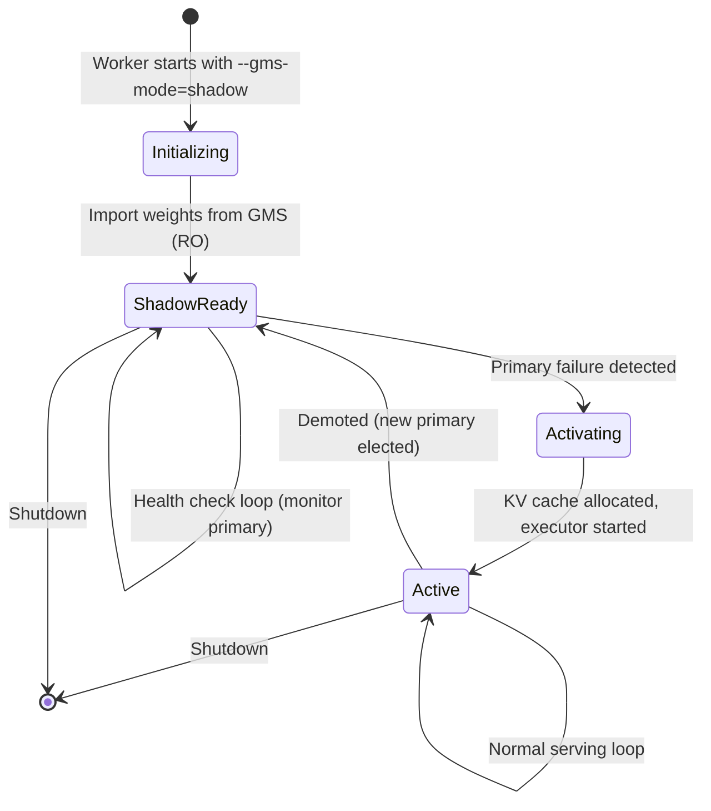
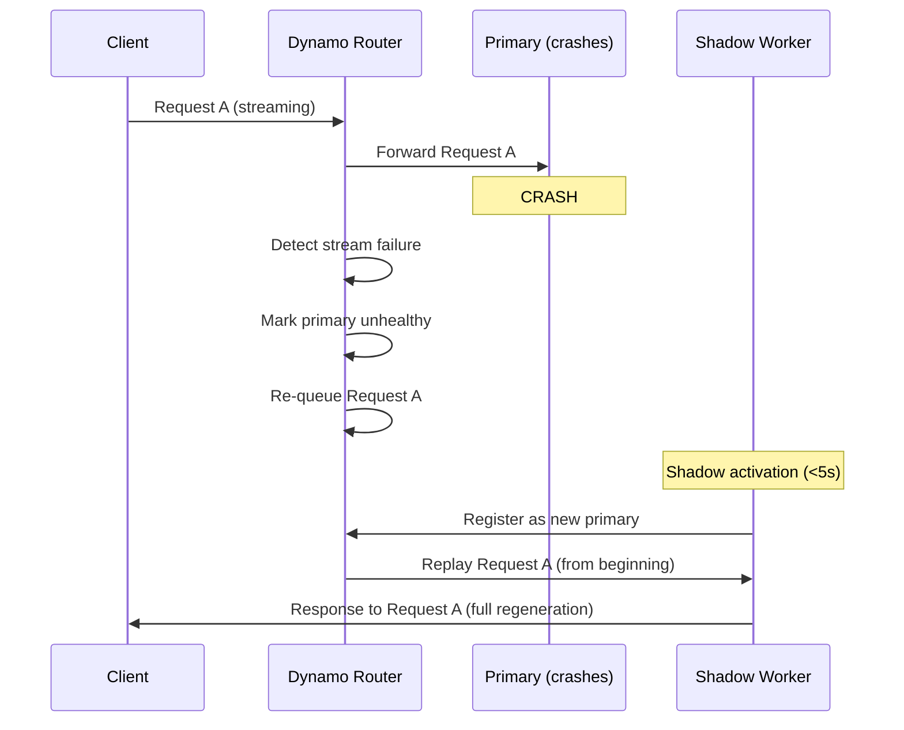

# 6. Executor Integration and Failover

[< Back to Overview](README.md)

> **This section is new** — the original proposal underspecified how shadow failover interacts with TRT-LLM's executor loop. This is the hardest part of the integration and requires careful design. Unlike the weight loading integration where much of the functionality is provided by MX/GMS libraries, **the executor integration is almost entirely new TRT-LLM code** — the GMS library only provides the lock upgrade API (`gms_client.upgrade_lock()`); all shadow lifecycle management, health checking, and executor state transitions are TRT-LLM responsibilities.

## The Challenge

TRT-LLM's `PyExecutor` (`py_executor.py`, ~3,750 lines) has three execution loops:
- `_executor_loop` — standard
- `_executor_loop_overlap` — CPU/GPU overlap (default)
- `_executor_loop_pp` — pipeline parallel

A shadow worker must maintain model weights in GPU memory (via GMS RO import) but NOT actively run the executor loop or allocate KV cache. On primary failure, it must:
1. Detect the failure
2. Upgrade GMS lock (RO -> RW)
3. Allocate KV cache
4. Start the executor loop
5. Register with the router
6. Begin serving — all in <5s

## Shadow Worker Lifecycle



## Shadow Mode Implementation

### New PyExecutor State: `SHADOW`

```python
# Addition to py_executor.py

class ExecutorState(Enum):
    INITIALIZING = "initializing"
    ACTIVE = "active"
    SHADOW = "shadow"         # New: weights loaded, no KV cache, no serving
    ACTIVATING = "activating"  # New: transitioning shadow -> active
    SHUTTING_DOWN = "shutting_down"

class PyExecutor:
    def __init__(self, ..., shadow_mode: bool = False):
        self._state = ExecutorState.SHADOW if shadow_mode else ExecutorState.INITIALIZING
        self._gms_client = None  # Set if load_format involves GMS

    def _shadow_loop(self):
        """Background loop for shadow workers. Lightweight — no GPU work."""
        while self._state == ExecutorState.SHADOW:
            # 1. Monitor primary health
            if not self._check_primary_health():
                self._activate_from_shadow()
                return

            # 2. Keep GMS connection alive
            if self._gms_client:
                self._gms_client.heartbeat()

            time.sleep(0.5)  # 500ms health check interval

    def _activate_from_shadow(self):
        """Transition from shadow to active. Target: <5s total."""
        self._state = ExecutorState.ACTIVATING
        t0 = time.perf_counter()

        # Step 1: Upgrade GMS lock (RO -> RW) — ~10ms
        # (This is the only GMS API call; rest is TRT-LLM code)
        if self._gms_client:
            self._gms_client.upgrade_lock()

        # Step 2: Allocate KV cache — ~1-3s (depends on cache size)
        self._resource_manager.allocate_kv_cache()

        # Step 3: Cache-warm warmup — ~0.5-2s (see "Compile Cache" section below)
        # Loads compiled kernels from GMS compile_cache tag or disk cache,
        # then recaptures CUDA graphs with the new KV cache addresses.
        self._cache_warm_warmup()

        # Step 4: Initialize scheduler state — ~10ms
        self._scheduler.reset()

        # Step 5: Start executor loop — ~100ms
        self._state = ExecutorState.ACTIVE
        self._start_executor_loop()

        # Step 6: Register with router — ~100ms
        self._register_with_router()

        elapsed = time.perf_counter() - t0
        logger.info(f"Shadow activation completed in {elapsed:.2f}s")
```

### Mapping to Existing Sleep/Wake

TRT-LLM already has `release_with_tag()` / `materialize_with_tag()` for memory lifecycle. The [GMS prototype PR #7053](https://github.com/ai-dynamo/dynamo/pull/7053) validates this mapping: sleep releases the `kv_cache` tag via virtual-memory tagged operations while keeping GMS-managed weights untouched, and wake re-materializes the KV cache. The PR also adds a local fallback path for non-Ray executors when collective RPC is unavailable. GMS maps onto this:

```python
# Shadow worker initialization (Phase 2 startup)
def _init_shadow_with_gms(self):
    """Initialize shadow worker using GMS RO import."""

    # Import model weights from GMS — zero-copy
    self._model_engine.model = self._gms_loader.import_model(
        gms_client=self._gms_client,
        model_class=self._model_class,
        config=self._config,
    )

    # Do NOT allocate KV cache — shadow doesn't serve
    # The KV cache tag is "released" by not being allocated
    # On activation, materialize_with_tag("kv_cache") equivalent = allocate fresh

    # Model weights are "materialized" via GMS import
    # On deactivation, release_with_tag("model_weights") = release GMS RW lock
```

| TRT-LLM Sleep/Wake | GMS Library Call | TRT-LLM Code | When |
|:-------------------|:----------------|:-------------|:-----|
| `materialize_with_tag("model_weights")` | `gms_client.import(tag=...)` | Orchestration only | Shadow init, activation |
| `release_with_tag("model_weights")` | `gms_client.release_lock()` | Orchestration only | Demotion, shutdown |
| `materialize_with_tag("kv_cache")` | None (pure TRT-LLM) | `resource_manager.allocate_kv_cache()` | Activation only |
| `release_with_tag("kv_cache")` | None (pure TRT-LLM) | `resource_manager.release_kv_cache()` | Demotion, shutdown |
| `materialize_with_tag("compile_cache")` | `gms_client.import(tag="compile_cache")` | Deserialize artifacts | Shadow activation |
| `release_with_tag("compile_cache")` | `gms_client.release_lock()` | Orchestration only | Demotion, shutdown |

## Compile Cache: Closing the Warmup Gap

### The Problem

The shadow activation budget above targets <5s, but **warmup is not accounted for**. Benchmark data (Section 10) shows warmup takes ~16s for Qwen 72B:

| Warmup Phase | Duration | What It Does |
|:-------------|:---------|:-------------|
| 1st pass (autotuner) | ~12s | `torch.compile` compilation + autotuner kernel selection |
| 2nd pass (CUDA graphs) | ~4s | CUDA graph capture for the selected kernels |
| **Total** | **~16s** | |

Without a compile cache, shadow activation would take ~17-19s — far exceeding the <5s target.

**Why the shadow can't pre-warm during shadow mode:** Warmup executes model forward passes, which require KV cache to be allocated. The shadow intentionally does NOT allocate KV cache (to minimize GPU memory footprint). No KV cache → no forward passes → no warmup.

### Solution: Tiered Compile Cache

A two-tier cache hierarchy, analogous to CPU cache (fast/volatile) backed by disk (slow/durable):

```
Shadow activation compile lookup:
  Tier 1: GMS compile_cache tag (GPU memory, ~ms import)   → fast, volatile (survives process crash, not node reboot)
  Tier 2: Disk compile cache (filesystem, ~0.5-2s load)    → slow, durable (survives node reboot)
  Tier 3: Full recompile (~16s)                             → cold start, last resort
```

The primary writes to **both tiers** during its initial warmup. The shadow reads from whichever is available, in priority order.

### GMS Tag Model (Extended)

This adds a third GMS tag per GPU, fitting naturally into the existing per-GPU per-tag architecture:

```
Per-GPU GMS tags:
  weights        → model parameters (RW/RO sharing, long-lived)
  kv_cache       → KV cache blocks (released on sleep, allocated on activation)
  compile_cache  → compiled kernels + autotuner results (written once by primary, imported by shadow)
```

On an 8-GPU node, this means 24 GMS processes (8 GPUs × 3 tags) instead of 16.

| Tag | Written by | Read by | Lifecycle | Survives |
|:----|:-----------|:--------|:----------|:---------|
| `weights` | Primary (RW) | Shadow (RO import) | Long-lived; shared continuously | Process crash ✅, node reboot ❌ |
| `kv_cache` | Active worker | Same worker only | Released on sleep/demotion; allocated on activation | Process crash ✅, node reboot ❌ |
| `compile_cache` | Primary after warmup | Shadow on activation | Written once; imported on demand | Process crash ✅, node reboot ❌ |

### What Goes in Each Tier

| Artifact | GMS Tier (Tier 1) | Disk Tier (Tier 2) | Notes |
|:---------|:-------------------|:-------------------|:------|
| `torch.compile` compiled kernels | Serialized kernel objects | `~/.cache/torch/inductor/` (automatic) | Deterministic given same model + config |
| Autotuner results (kernel configs) | Serialized config map | `TRTLLM_AUTOTUNER_CACHE_DIR` | Map from op signature → optimal kernel config |
| CUDA graph templates | **Cannot share** | **Cannot share** | Tied to specific memory addresses; must recapture on activation |

**Key insight:** CUDA graphs must always be recaptured after KV cache allocation because they encode specific GPU memory addresses. The compile cache eliminates the ~12s autotuner/compilation cost; CUDA graph recapture adds only ~0.5-1s with pre-compiled kernels.

### Activation Warmup Budget (Cache-Warm)

| Step | Without Cache | With Disk Cache (Tier 2) | With GMS Cache (Tier 1) |
|:-----|:-------------|:------------------------|:------------------------|
| Load compiled kernels | ~12s (recompile) | ~0.5-1s (disk read) | ~10ms (GMS import) |
| CUDA graph recapture | ~4s | ~0.5-1s (compiled kernels ready) | ~0.5-1s (compiled kernels ready) |
| **Warmup total** | **~16s** | **~1-2s** | **~0.5-1s** |

Updated shadow activation budget with compile cache:

| Step | Time |
|:-----|:-----|
| GMS lock upgrade (RO → RW) | ~10ms |
| KV cache allocation | ~1-3s |
| Cache-warm warmup (Tier 1 or 2) | ~0.5-2s |
| Scheduler reset | ~10ms |
| Executor start | ~100ms |
| Router registration | ~100ms |
| **Total** | **~2-5.5s** |

The <5s target is achievable with either tier of compile cache. Tier 1 (GMS) provides a tighter budget for large KV cache allocations.

### Implementation Phasing

| Phase | Scope | Compile Cache |
|:------|:------|:-------------|
| Phase 2 (GMS integration) | Shadow holds weights only | **Tier 2 (disk) only** — relies on shared filesystem between primary and shadow on same node |
| Phase 3+ (extension) | Shadow imports compile artifacts from GMS | **Tier 1 (GMS) + Tier 2 (disk)** — full hierarchy |

Tier 2 (disk cache) is sufficient for the initial implementation because primary and shadow are always co-located on the same node and share the filesystem. Tier 1 (GMS) is a performance optimization that tightens the failover budget and provides resilience against filesystem latency.

## In-Flight Request Handling During Failover

When the primary crashes, in-flight requests are lost on that worker. The system handles this at the router level:



**Key design decisions:**
1. **No partial state recovery for in-flight requests.** Recovering mid-generation state would require checkpointing the KV cache and generation position for every request — excessive overhead for the common case. Instead, re-queue and regenerate.
2. **KV cache is reconstructed via prefix caching.** If the shadow has the same prefix cache (e.g., system prompts), re-queued requests hit the prefix cache and skip re-encoding the common prefix. This makes regeneration much faster than cold-start.
3. **Clients see a brief interruption.** Streaming responses pause during the ~5s failover window. Non-streaming requests may time out and need client-side retry.

## Future Enhancement: KV Cache Checkpoint

For workloads where in-flight request recovery matters (e.g., long-running agentic sessions), a future enhancement could checkpoint KV cache state:

```
Primary Worker:
  - Periodically snapshot KV cache blocks to GMS/host memory
  - Tag snapshots with request_id + token_position

Shadow Activation:
  - Import KV cache snapshot from GMS
  - Resume generation from last checkpoint position
  - Client sees minimal interruption
```

This connects to the [KV Cache Extension Path](08-kv-cache-extension.md) and would be Phase 4+ work.

## Health Check Protocol

```python
class ShadowHealthChecker:
    """Monitors primary worker health for shadow takeover decision."""

    def __init__(self, primary_endpoint: str, check_interval: float = 0.5):
        self.primary_endpoint = primary_endpoint
        self.check_interval = check_interval
        self.consecutive_failures = 0
        self.failure_threshold = 3  # 3 consecutive failures = takeover

    def check_primary_health(self) -> bool:
        """Returns True if primary is healthy."""
        try:
            response = requests.get(
                f"{self.primary_endpoint}/health",
                timeout=1.0,
            )
            if response.status_code == 200:
                self.consecutive_failures = 0
                return True
        except (requests.Timeout, requests.ConnectionError):
            pass

        self.consecutive_failures += 1
        if self.consecutive_failures >= self.failure_threshold:
            logger.warning(
                f"Primary unhealthy: {self.consecutive_failures} consecutive failures"
            )
            return False
        return True  # Not yet past threshold
```

## Interaction with Overlap Scheduler

The overlap scheduler (`_executor_loop_overlap`) uses a `previous_batch` staging pattern. Shadow activation must handle this correctly:

1. Shadow starts with **no** `previous_batch` (fresh state)
2. First iteration after activation runs `_executor_loop_overlap` from clean state
3. The overlap scheduler naturally handles the cold-start case (no previous batch to process)
4. No special handling needed — this is the same as a fresh executor start

For pipeline parallel (`_executor_loop_pp`), the shadow must coordinate across PP ranks during activation. All shadow workers for a PP group must activate simultaneously — the health check should be coordinated via the existing process group.
