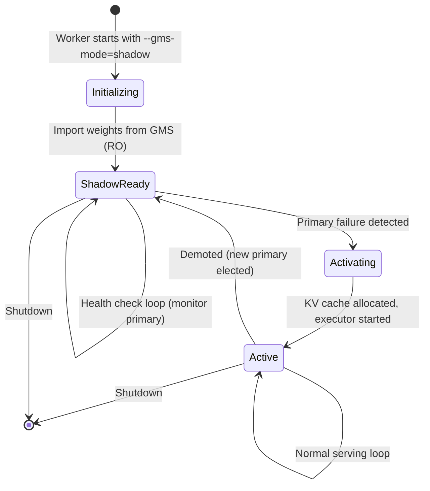
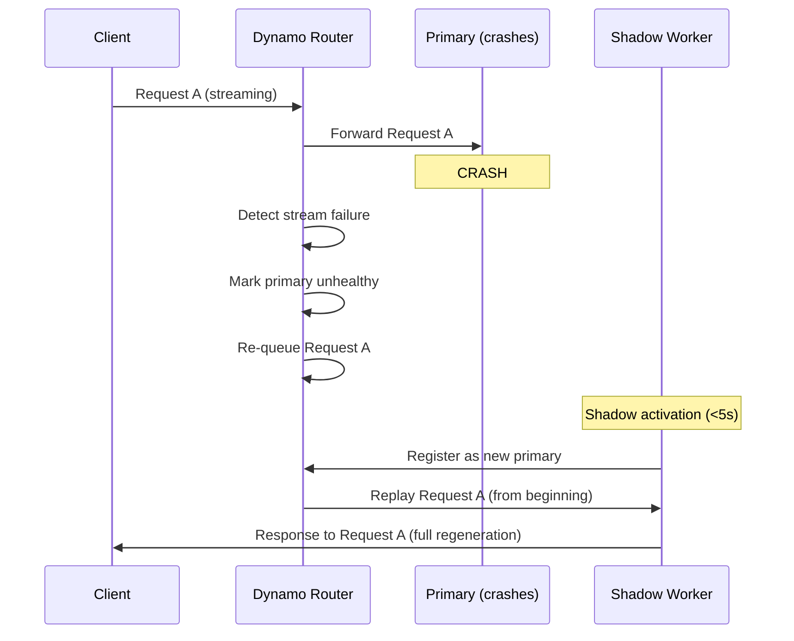

# 6. Executor Integration and Failover

[< Back to Overview](README.md)

> **This section is new** — the original proposal underspecified how shadow failover interacts with TRT-LLM's executor loop. This is the hardest part of the integration and requires careful design. Unlike the weight loading integration where much of the functionality is provided by MX/GMS libraries, **the executor integration is almost entirely new TRT-LLM code** — the GMS library only provides the lock primitives (`GMSClientMemoryManager.connect(lock_type=...)` to acquire RO/RW; `mgr.unmap_all_vas()` + `mgr.abort()` + reconnect-RW + `remap_all_vas()` to upgrade RO→RW); all shadow lifecycle management, health checking, and executor state transitions are TRT-LLM responsibilities.

## The Challenge

TRT-LLM's `PyExecutor` (`py_executor.py`, ~3,750 lines) has three execution loops:
- `_executor_loop` — standard
- `_executor_loop_overlap` — CPU/GPU overlap (default)
- `_executor_loop_pp` — pipeline parallel

A shadow worker must maintain model weights in GPU memory (via GMS RO import) but NOT actively run the executor loop or allocate KV cache. On primary failure, it must:
1. Detect the failure
2. Upgrade GMS lock (RO -> RW)
3. Allocate KV cache
4. Start the executor loop
5. Register with the router
6. Begin serving — all in <5s

## Shadow Worker Lifecycle



## Shadow Mode Implementation

### New PyExecutor State: `SHADOW`

```python
# Addition to py_executor.py

class ExecutorState(Enum):
    INITIALIZING = "initializing"
    ACTIVE = "active"
    SHADOW = "shadow"         # New: weights loaded, no KV cache, no serving
    ACTIVATING = "activating"  # New: transitioning shadow -> active
    SHUTTING_DOWN = "shutting_down"

class PyExecutor:
    def __init__(self, ..., shadow_mode: bool = False):
        self._state = ExecutorState.SHADOW if shadow_mode else ExecutorState.INITIALIZING
        self._gms_backend = None  # Set if load_format involves GMS

    def _shadow_loop(self):
        """Background loop for shadow workers. Lightweight — no GPU work."""
        while self._state == ExecutorState.SHADOW:
            # 1. Monitor primary health
            if not self._check_primary_health():
                self._activate_from_shadow()
                return

            # 2. (No explicit GMS heartbeat needed — the unix socket
            #     connection is the lock; OS-level keepalives suffice.
            #     Tracked as GMS-3 in §15: optional peek RPC could give us
            #     a cheaper health signal here.)

            time.sleep(0.5)  # 500ms health check interval

    def _activate_from_shadow(self):
        """Transition from shadow to active. Target: <5s total."""
        self._state = ExecutorState.ACTIVATING
        t0 = time.perf_counter()

        # Step 1: Upgrade GMS lock (RO -> RW) — ~10-50ms
        # The current GMS API doesn't expose a single upgrade_lock() call;
        # instead: unmap_all_vas() + abort() + connect(RW) + remap_all_vas().
        # Wrap this in GMSBackend.upgrade_to_rw() once the protocol grows
        # the method.
        if self._gms_backend:
            self._gms_backend.upgrade_to_rw()  # see GMSBackend extension

        # Step 2: Allocate KV cache — ~1-3s (depends on cache size)
        self._resource_manager.allocate_kv_cache()

        # Step 3: Cache-warm warmup — ~0.5-2s (see [§07 Tiered Compile Cache](07-compile-cache.md))
        # Loads compiled kernels from GMS compile_cache tag or disk cache,
        # then recaptures CUDA graphs with the new KV cache addresses.
        self._cache_warm_warmup()

        # Step 4: Initialize scheduler state — ~10ms
        self._scheduler.reset()

        # Step 5: Start executor loop — ~100ms
        self._state = ExecutorState.ACTIVE
        self._start_executor_loop()

        # Step 6: Register with router — ~100ms
        self._register_with_router()

        elapsed = time.perf_counter() - t0
        logger.info(f"Shadow activation completed in {elapsed:.2f}s")
```

### Mapping to Existing Sleep/Wake

TRT-LLM already has `release_with_tag()` / `materialize_with_tag()` for memory lifecycle. The [GMS prototype PR #7053](https://github.com/ai-dynamo/dynamo/pull/7053) validates this mapping: sleep releases the `kv_cache` tag via virtual-memory tagged operations while keeping GMS-managed weights untouched, and wake re-materializes the KV cache. The PR also adds a local fallback path for non-Ray executors when collective RPC is unavailable. GMS maps onto this:

```python
# Shadow worker initialization (Phase 2 startup)
def _init_shadow_with_gms(self):
    """Initialize shadow worker using GMS RO import."""

    # Import model weights from GMS — zero-copy.
    # The GMSBackend adapter wraps the upstream
    # materialize_module_from_gms(mgr, model, device_index=N) call.
    self._model_engine.model = self._gms_loader.import_model(
        gms_backend=self._gms_backend,
        model_class=self._model_class,
        config=self._config,
    )

    # Do NOT allocate KV cache — shadow doesn't serve
    # The KV cache tag is "released" by not being allocated
    # On activation, materialize_with_tag("kv_cache") equivalent = allocate fresh

    # Model weights are "materialized" via GMS import
    # On deactivation, release_with_tag("weights") = release GMS RW lock
```

The GMS library convention uses `tag="weights"` for model weights and `tag="kv_cache"` for the KV cache (see [`gpu_memory_service.integrations.common.utils.GMS_TAGS`](https://github.com/ai-dynamo/dynamo/blob/main/lib/gpu_memory_service/integrations/common/utils.py#L20)).

| TRT-LLM Sleep/Wake | GMS Library Call | TRT-LLM Code | When |
|:-------------------|:----------------|:-------------|:-----|
| `materialize_with_tag("weights")` | `materialize_module_from_gms(mgr, model, device_index=N)` | Orchestration only (delegates to library) | Shadow init, activation |
| `release_with_tag("weights")` | `mgr.unmap_all_vas()` + `mgr.abort()` | Orchestration only | Demotion, shutdown |
| `materialize_with_tag("kv_cache")` | None (pure TRT-LLM) | `resource_manager.allocate_kv_cache()` | Activation only |
| `release_with_tag("kv_cache")` | None (pure TRT-LLM) | `resource_manager.release_kv_cache()` | Demotion, shutdown |
| `materialize_with_tag("compile_cache")` | `materialize_module_from_gms(mgr, ..., tag="compile_cache")` (when supported) | Deserialize artifacts | Shadow activation |
| `release_with_tag("compile_cache")` | `mgr.unmap_all_vas()` + `mgr.abort()` | Orchestration only | Demotion, shutdown |

## Shadow Activation Budget

| Step | Time |
|:-----|:-----|
| GMS lock upgrade (RO → RW) | ~10ms |
| KV cache allocation | ~1-3s |
| Cache-warm warmup (see [§07 Tiered Compile Cache](07-compile-cache.md)) | ~0.5-2s |
| Scheduler reset | ~10ms |
| Executor start | ~100ms |
| Router registration | ~100ms |
| **Total** | **~2-5.5s** |

The <5s target requires a warm compile cache. Without it, activation warmup adds ~16s (autotuner + CUDA graph capture) on v3 code — see [§07 Tiered Compile Cache](07-compile-cache.md) for the tiered cache design and [§11 Results & Analysis](11-results-analysis.md) for measured warmup numbers.

## In-Flight Request Handling During Failover

When the primary crashes, in-flight requests are lost on that worker. The system handles this at the router level:



**Key design decisions:**
1. **No partial state recovery for in-flight requests.** Recovering mid-generation state would require checkpointing the KV cache and generation position for every request — excessive overhead for the common case. Instead, re-queue and regenerate.
2. **KV cache is reconstructed via prefix caching.** If the shadow has the same prefix cache (e.g., system prompts), re-queued requests hit the prefix cache and skip re-encoding the common prefix. This makes regeneration much faster than cold-start.
3. **Clients see a brief interruption.** Streaming responses pause during the ~5s failover window. Non-streaming requests may time out and need client-side retry.

## Future Enhancement: KV Cache Checkpoint via KVBM

For workloads where in-flight request recovery matters (e.g., long-running agentic sessions), a future enhancement could checkpoint KV cache state — but via **KVBM, not GMS**. KV cache is out of GMS's scope (see [§09 KV Cache Extension Path](09-kv-cache-extension.md) for the division of labor):

```
Primary Worker:
  - KV Cache Manager V2 pushes blocks to KVBM via the KV Cache Connector API
  - KVBM tiers them across HBM / DRAM / NVMe with per-request metadata

Shadow Activation:
  - New primary pulls warm blocks from KVBM via the Connector API
  - Resume generation from the last persisted block
  - Client sees minimal interruption
```

This is Phase 4+ work and tracks the Dynamo KVBM roadmap, not the MX/GMS schedule. See [§09 KV Cache Extension Path](09-kv-cache-extension.md).

## Health Check Protocol

```python
class ShadowHealthChecker:
    """Monitors primary worker health for shadow takeover decision."""

    def __init__(self, primary_endpoint: str, check_interval: float = 0.5):
        self.primary_endpoint = primary_endpoint
        self.check_interval = check_interval
        self.consecutive_failures = 0
        self.failure_threshold = 3  # 3 consecutive failures = takeover

    def check_primary_health(self) -> bool:
        """Returns True if primary is healthy."""
        try:
            response = requests.get(
                f"{self.primary_endpoint}/health",
                timeout=1.0,
            )
            if response.status_code == 200:
                self.consecutive_failures = 0
                return True
        except (requests.Timeout, requests.ConnectionError):
            pass

        self.consecutive_failures += 1
        if self.consecutive_failures >= self.failure_threshold:
            logger.warning(
                f"Primary unhealthy: {self.consecutive_failures} consecutive failures"
            )
            return False
        return True  # Not yet past threshold
```

## Interaction with Overlap Scheduler

The overlap scheduler (`_executor_loop_overlap`) uses a `previous_batch` staging pattern. Shadow activation must handle this correctly:

1. Shadow starts with **no** `previous_batch` (fresh state)
2. First iteration after activation runs `_executor_loop_overlap` from clean state
3. The overlap scheduler naturally handles the cold-start case (no previous batch to process)
4. No special handling needed — this is the same as a fresh executor start

For pipeline parallel (`_executor_loop_pp`), the shadow must coordinate across PP ranks during activation. All shadow workers for a PP group must activate simultaneously — the health check should be coordinated via the existing process group.
