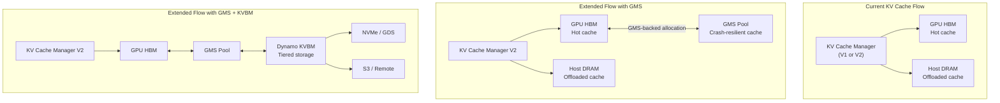

# 7. KV Cache Extension Path

[< Back to Overview](README.md)

> **This section is new** — the original proposal listed KV cache sharing as a non-goal. This section designs the extension path so Phases 1-3 don't create architectural barriers.

## Why KV Cache Matters More Than Model Weights

Model weights are **static** — they're the same for every request and can be reloaded from disk. KV cache is **dynamic** and **expensive**:

| Property | Model Weights | KV Cache |
|:---------|:-------------|:---------|
| **Cost to recreate** | Disk load (seconds with MX/GMS) | Full prefill recomputation (proportional to context length) |
| **Per-request** | Shared across all requests | Unique per request |
| **Size** | Fixed (model-dependent) | Variable (grows with context) |
| **Loss impact** | Seconds of cold-start | Minutes of recomputation for long contexts |
| **Persistence value** | Low (easily restored) | High (expensive to recreate) |

For a 100K-token context, losing the KV cache means re-encoding 100K tokens — potentially 10-30 seconds of GPU compute. For an agentic session with accumulated context, this destroys the session state entirely.

## Design Principles

1. **Model weight sharing (Phases 1-3) must not preclude KV cache sharing.** The APIs and memory management patterns should generalize.
2. **KV cache persistence should integrate with the existing KV Cache Connector API** (`docs/source/features/kv-cache-connector.md`), not bypass it.
3. **KV cache persistence is optional and gradual** — start with crash-resilient prefixes (system prompts, common prefixes), extend to per-request cache.

## Architecture: KV Cache Persistence via GMS



## Integration Points

### Option A: GMS-Backed KV Cache Allocator (Lightweight)

Route KV cache GPU allocations through GMS, making them crash-resilient:

```python
# KV Cache Manager V2 with GMS allocator
class KVCacheManagerV2:
    def __init__(self, ..., gms_allocator=None):
        if gms_allocator:
            # KV cache blocks allocated via GMS = crash-resilient
            self._block_allocator = GMSBlockAllocator(gms_allocator)
        else:
            self._block_allocator = StandardBlockAllocator()
```

**Pros:** Minimal changes — just swap the allocator. KV cache blocks survive worker crashes.
**Cons:** All KV cache on GPU must go through GMS; may add allocation latency.
**When:** Phase 3 or early Phase 4.

### Option B: KV Cache Connector + GMS (Full Integration)

Extend the existing KV Cache Connector API to use GMS as a storage backend:

```python
# New KV Cache Connector backend
class GMSKVCacheConnector(KVCacheConnector):
    """Stores KV cache blocks in GMS for crash-resilient sharing."""

    def save_blocks(self, block_ids: List[int], block_data: List[torch.Tensor]):
        """Commit KV cache blocks to GMS pool."""
        for block_id, data in zip(block_ids, block_data):
            self.gms_client.store(
                tag=f"kv_cache_block_{block_id}",
                data=data,
            )

    def load_blocks(self, block_ids: List[int]) -> List[torch.Tensor]:
        """Import KV cache blocks from GMS pool."""
        return [
            self.gms_client.import_tensor(tag=f"kv_cache_block_{block_id}")
            for block_id in block_ids
        ]
```

**Pros:** Clean integration with existing KV Cache Connector API; works with disaggregated serving.
**Cons:** More engineering effort; requires KV Cache Connector maturity in V2.
**When:** Phase 4+, after KV Cache V2 becomes default.

### Option C: KVBM Integration (Dynamo-Native)

Connect TRT-LLM's KV cache to Dynamo's KV Block Manager (KVBM) for full tiered storage:

```
TRT-LLM KV Cache Manager V2
    ↕ (KV Cache Connector API)
Dynamo KVBM
    ↕ (NIXL)
GPU HBM → Host DRAM → NVMe/GDS → S3/Remote
```

**Pros:** Full Dynamo ecosystem integration; tiered storage; cluster-wide KV sharing.
**Cons:** Highest complexity; depends on KVBM API stability.
**When:** Phase 4+, aligned with Dynamo roadmap.

## What Phases 1-3 Must Not Block

To ensure KV cache extension is possible later, Phases 1-3 must:

1. **Use tag-based memory management consistently.** All GMS allocations should use tags (`model_weights`, `kv_cache`) so they can be managed independently.

2. **Keep the GMS client API general.** Don't hardcode model-weight-specific assumptions. The `GMSAllocator` should work for any GPU memory, not just weight tensors.

3. **Don't assume all GMS memory is static.** KV cache is dynamic (allocated/freed per request). The GMS allocator must support frequent alloc/free, not just bulk commit.

4. **Maintain KV Cache Connector API compatibility.** The weight loading changes must not break or constrain the KV Cache Connector API, which is the intended integration point for KV cache persistence.

## Recommended Phasing

| Phase | KV Cache Work | Scope |
|:------|:-------------|:------|
| Phase 1 (MX) | None | Model weights only |
| Phase 2 (GMS) | Design GMS allocator to be tag-generic | Ensure allocator works for KV cache blocks |
| Phase 3 (Combined) | Write KV cache extension design doc | No implementation, but validated design |
| Phase 4 (Future) | Implement Option A (GMS-backed KV allocator) | Crash-resilient KV cache |
| Phase 5 (Future) | Implement Option B or C (Connector/KVBM) | Full tiered KV cache with Dynamo |
