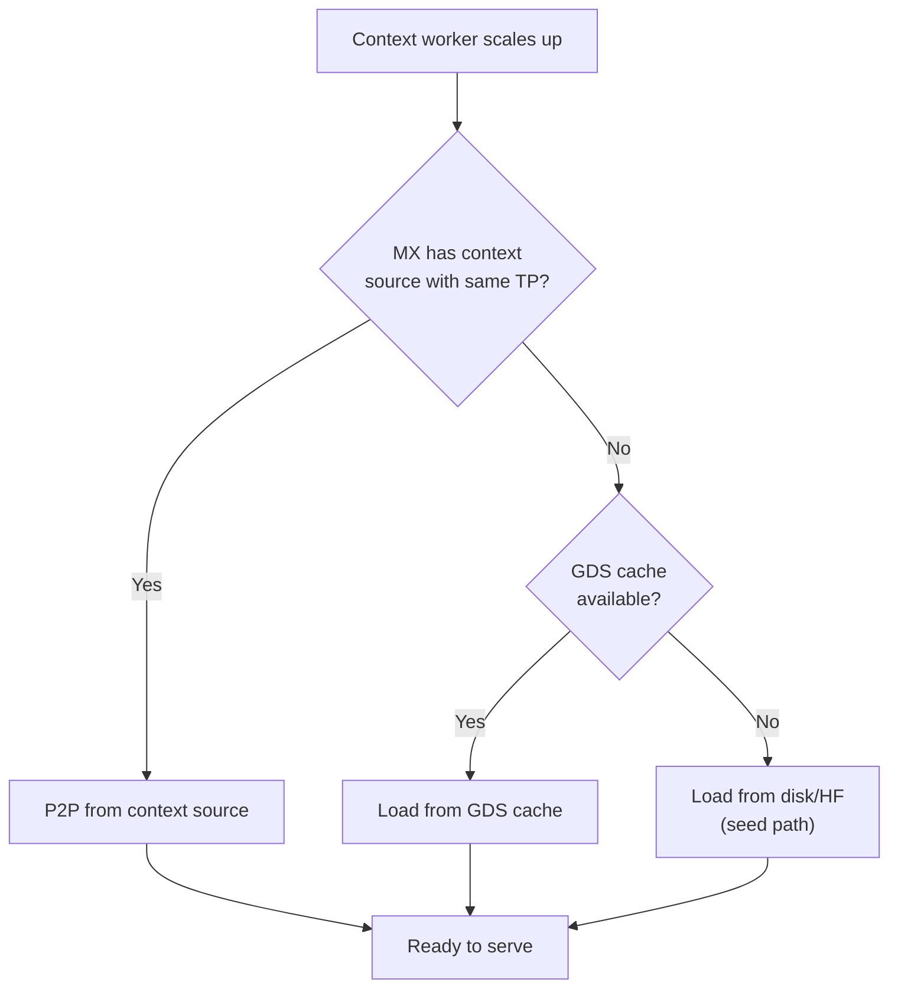
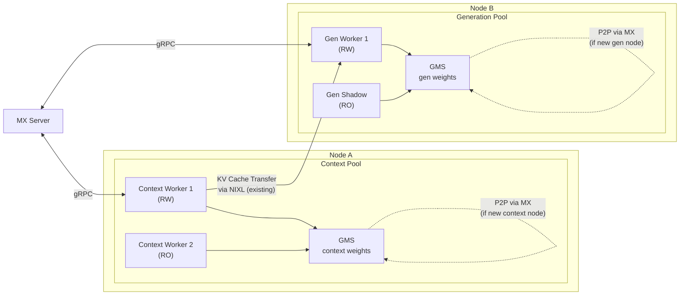

# 8. Disaggregated Serving Interaction

[< Back to Overview](README.md)

> **This section is new** — the original proposal listed disaggregated serving as a target use case but didn't detail the interaction. This is critical because disaggregated serving is TRT-LLM's key differentiator.

## The Problem

In disaggregated serving, context (prefill) and generation (decode) workers have different characteristics:

| Property | Context Worker | Generation Worker |
|:---------|:-------------|:------------------|
| **Compute profile** | Compute-bound (large GEMMs) | Memory-bandwidth-bound |
| **GPU preference** | High FLOPS | High HBM bandwidth |
| **KV cache behavior** | Produces KV cache, transfers out | Receives KV cache, consumes |
| **Lifetime** | May be short-lived (scale-to-zero) | Long-lived (steady decode) |
| **Weight sharing** | Shares with other context workers | Shares with other gen workers |
| **Parallelism** | May use different TP/PP than gen | May use different TP/PP than context |

MX and GMS must handle these differences correctly.

## MX Behavior for Disaggregated Serving

### Same Model, Different Parallelism Configs

Context workers might use TP=2, while generation workers use TP=4. MX must route transfers to rank-compatible sources:

```python
# MX source identity includes role and parallelism config
identity = MXSourceIdentity(
    model_name="meta-llama/Llama-3.1-70B",
    dtype="float16",
    quantization="fp8",
    tp_size=2,          # Context workers: TP=2
    pp_size=1,
    ep_size=1,
    worker_rank=0,
    role="context",     # New field for disagg
)
```

**Rule:** Context workers can only P2P from other context workers with the same parallelism config. Generation workers can only P2P from other generation workers. Cross-role P2P is not supported because the weight layouts differ with different TP/PP configs.

### Scale-to-Zero Context Workers

Context workers may scale to zero when there are no prefill requests. When scaling back up:

1. MX checks if any context workers with matching config are running → P2P if yes
2. If no context workers exist, MX falls back to generation workers → **not directly** (different TP), but disk/cache
3. The three-tier fallback (P2P → GDS → Disk) handles this gracefully



## GMS Behavior for Disaggregated Serving

### Within-Node Sharing Scenarios

**Scenario 1: Context + Generation on same node**
- Both share model weights via GMS (same model, different execution mode)
- If TP configs differ, they need separate GMS tags:
  - `model_weights:context:tp2:rank0`
  - `model_weights:gen:tp4:rank0`

**Scenario 2: Multiple context workers on same GPU**
- Share weights via GMS (same config)
- Each has independent KV cache (prefill-specific)
- GMS tag: `model_weights:context:tp2:rank0` (shared)

**Scenario 3: Shadow failover for generation worker**
- Shadow generation worker imports weights from GMS RO
- On primary gen worker crash, shadow activates
- KV cache for in-flight decode requests is lost (re-queued at router)
- Prefix cache (if persisted) can accelerate re-prefill

### GMS Tag Naming Convention

```
{tag_type}:{role}:{parallelism}:{rank}

Examples:
  model_weights:context:tp2pp1:rank0
  model_weights:gen:tp4pp1:rank0
  kv_cache:gen:tp4pp1:rank0  (future, Phase 4+)
```

## Combined MX+GMS for Disaggregated Serving



**Key insight:** MX/GMS handle **model weight** distribution and sharing. KV cache transfer between context and generation workers continues to use the existing `CacheTransceiver` with NIXL/UCX/Mooncake backends. These are orthogonal concerns:
- MX/GMS = model weight lifecycle (startup, scaling, failover)
- CacheTransceiver = KV cache transfer during serving (per-request)

## Configuration for Disaggregated Serving

```yaml
# Context instance config
context:
  load_format: mx-gms
  mx_server_url: http://mx-server:8001
  gms_socket_path: /tmp/gms-ctx-0.sock
  gms_tag: model_weights:context

# Generation instance config
generation:
  load_format: mx-gms
  mx_server_url: http://mx-server:8001
  gms_socket_path: /tmp/gms-gen-0.sock
  gms_tag: model_weights:gen
  gms_mode: auto  # auto-detect RW vs shadow
```
