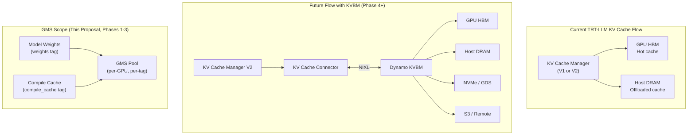

# 9. KV Cache Extension Path

[< Back to Overview](README.md)

> **Scope change (2026-04-19).** Earlier drafts explored routing KV cache through GMS directly (GMS-backed allocator, KV Cache Connector + GMS). We've since concluded that **KV cache is out of GMS's scope** — Dynamo's [KV Block Manager (KVBM)](https://github.com/ai-dynamo/dynamo) already covers tiered KV cache storage (HBM → DRAM → NVMe → object store) with NIXL-based transport and intra/inter-node coordination. GMS and KVBM have clean, non-overlapping mandates; the extension path for KV cache is **KVBM integration**, not GMS. This section documents that division of labor and the deferred integration plan.

## Division of Labor: GMS vs. KVBM

| Aspect | GMS | KVBM |
|:-------|:----|:-----|
| **What it holds** | Static weight-like artifacts (model weights, compile cache, LoRA adapters) | Dynamic per-request state (KV cache blocks) |
| **Lifetime** | Long-lived; committed once, imported many times | Short-lived; allocated/freed per request |
| **Storage tiers** | GPU HBM only (out-of-process via CUDA VMM) | HBM → DRAM → NVMe/GDS → S3/remote |
| **Transport** | Intra-node, zero-copy via VMM | Intra- and inter-node via NIXL |
| **Primary value** | Crash resilience + zero-copy sharing within a node | Tiered offload, prefix reuse, cross-node KV sharing |
| **Phase** | 1–3 (this proposal) | Future — separate integration track |

GMS's mandate is **weight-like, static, intra-node** memory that needs to survive process crashes. KVBM's mandate is **dynamic, tiered, cross-node** KV cache. Forcing KV cache through GMS would either (a) duplicate KVBM's function with a thinner feature set, or (b) create a second path that has to stay in sync with KVBM's. Neither is worthwhile.

## Why KV Cache Persistence Matters

Model weights are **static** — identical for every request, cheaply reloaded from disk or MX P2P. KV cache is **dynamic** and **expensive to recompute**:

| Property | Model Weights | KV Cache |
|:---------|:-------------|:---------|
| **Cost to recreate** | Disk/MX load (seconds) | Full prefill recomputation (proportional to context length) |
| **Per-request** | Shared across all requests | Unique per request |
| **Size** | Fixed (model-dependent) | Variable (grows with context) |
| **Loss impact** | Seconds of cold-start | Tens of seconds for long contexts; session loss for agentic workloads |

For a 100K-token context, losing the KV cache can mean 10–30s of GPU compute to re-encode. KVBM addresses this through tiered persistence; this proposal's role is to ensure Phases 1–3 don't foreclose that integration.

## Design Principles

1. **GMS stays scoped to weight-like artifacts.** Model weights (Phase 2), compile cache ([§07](07-compile-cache.md)), and future additions like LoRA adapters. KV cache is explicitly out of scope for GMS.
2. **KV cache persistence integrates via KVBM**, using the existing [KV Cache Connector API](../../source/features/kv-cache-connector.md) as the entry point.
3. **Phases 1–3 must not create architectural barriers** to a future KVBM connector — in particular, the GMS integration must not monopolize assumptions that only apply to weight-like memory.

## Architecture: KV Cache Persistence via KVBM



GMS and KVBM run **side by side** on the same node with no shared state. GMS manages VMM reservations for weight-like tags; KVBM manages KV cache blocks through the Connector API. A shadow worker imports weights from GMS and (when the KVBM connector is available) pulls relevant KV cache blocks from KVBM during activation — two independent transports, each serving the data it's designed for.

## Integration Point: KV Cache Connector + KVBM

TRT-LLM's KV Cache V2 exposes a [KV Cache Connector API](../../source/features/kv-cache-connector.md) for pluggable storage backends. The path is:

```text
TRT-LLM KV Cache Manager V2
    ↕ (KV Cache Connector API)
Dynamo KVBM
    ↕ (NIXL transport)
GPU HBM → Host DRAM → NVMe/GDS → S3/Remote
```

A KVBM connector implementation would live in TRT-LLM (or a thin Dynamo-side adapter) and plug into the Connector API — no new TRT-LLM-side KV cache machinery. Key properties:

- **Prefix caching is preserved.** Common prefixes (system prompts, multi-turn history) hit KVBM's host/remote tiers and skip re-prefill.
- **Shadow failover benefits without requiring GMS involvement.** On shadow activation, the new primary's KV Cache Manager pulls warm blocks from KVBM via the Connector API; GMS is not in the KV cache data path.
- **Disaggregated serving composes naturally.** Prefill and decode workers both sit behind the Connector API; KVBM handles the P/D cache handoff. See [§08 Disaggregated Serving Interaction](08-disagg-interaction.md).

## What Phases 1–3 Must Not Block

To keep the KVBM integration unblocked, Phases 1–3 must:

1. **Use tag-based GMS allocation consistently.** All GMS tags (`weights`, `compile_cache`) are independent of any KV cache machinery. KV cache never lives under a GMS tag.
2. **Leave KV Cache Manager internals untouched.** The weight-loading changes (§04) and the shadow executor changes (§06) must not modify the KV Cache Manager's allocator or block layout in ways that would conflict with a future Connector-based backend.
3. **Preserve the KV Cache Connector API surface.** The intended KVBM integration point is the existing Connector API — no changes in Phases 1–3 should constrain or break it.
4. **Keep the `GPUMemoryBackend` protocol general** (see [§04 Implementation & API Design](04-implementation-plan.md)). Even though KV cache won't use it, the abstraction should stay generic enough for other weight-like artifacts (e.g., LoRA) to join the GMS pool later.

## Recommended Phasing

| Phase | KV Cache Work | Scope |
|:------|:-------------|:------|
| Phase 1 (MX) | None | Model weights only |
| Phase 2 (GMS) | None | Weights + compile cache via GMS; KV cache untouched |
| Phase 3 (Combined) | None — validate non-interference | Ensure Connector API surface is unchanged |
| Phase 4+ (KVBM) | Implement KV Cache Connector → KVBM backend | Tiered KV cache via KVBM; separate integration track |

Phase 4 is **out of scope for this proposal** and is expected to align with the Dynamo KVBM roadmap rather than the MX/GMS schedule. See [§14 E1](14-open-questions.md) for the deferral status.

## Why Not Route KV Cache Through GMS? (Rationale Kept for the Record)

Earlier drafts of this section proposed two GMS-centered options:

- **Option A: GMS-Backed KV Cache Allocator** — swap the KV block allocator for one that routes through GMS, making KV blocks crash-resilient.
- **Option B: KV Cache Connector + GMS backend** — a Connector implementation that stores/loads blocks in a GMS pool.

Both are **superseded by KVBM integration** for two reasons:

1. **KVBM already solves the general problem.** Tiered offload, cross-node sharing, and NIXL transport are KVBM's design center. A GMS-backed KV path would re-implement a subset of that with no tiering beyond HBM.
2. **Scope discipline.** GMS's strength is VMM-backed, long-lived, intra-node memory for static artifacts. Overloading it with short-lived per-request blocks muddies the mental model and adds allocator-churn pressure that GMS wasn't designed for.

If KVBM's timeline slips materially or disagg-specific KV needs emerge that KVBM doesn't cover, the rationale can be revisited — GMS's VMM reservations don't preclude a future KV use — but the default path is KVBM.
