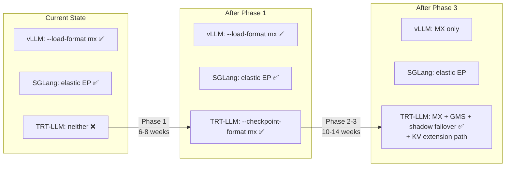
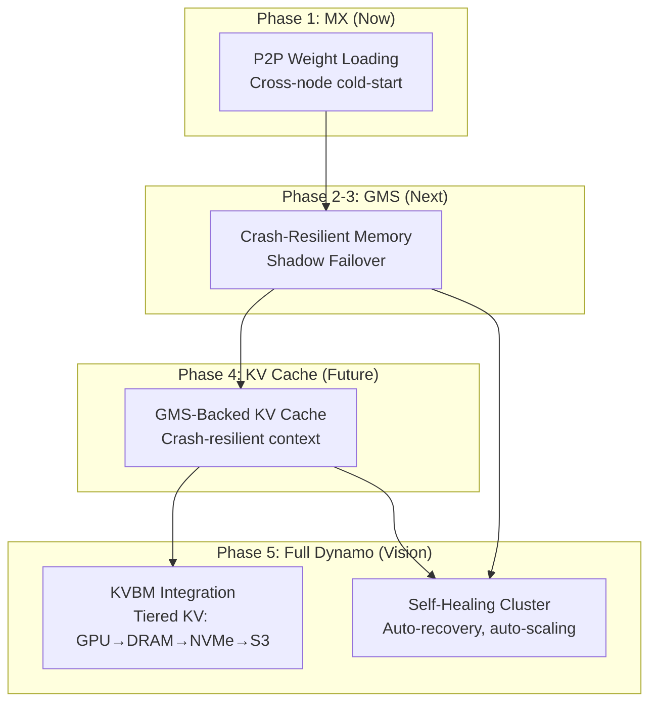

# 12. Strategic Alignment

[< Back to Overview](README.md)

## How This Proposal Fits the TRT-LLM Opportunity Roadmap

The [TRT-LLM Architecture Overview](../../overview/README.md) identifies three categories of future development opportunities. This proposal addresses items across all three categories:

### Category 1: Critical Feature Gaps

| Gap | How MX/GMS Helps | Impact |
|:----|:-----------------|:-------|
| **Elastic fault tolerance** (Section 5.1, Item 1.3) | GMS shadow failover enables <5s recovery without full reload. This is a prerequisite for elastic fault tolerance — you can't redistribute work if recovery takes minutes. | **Direct enabler** |
| **TTFT competitiveness** (Section 5.1, Item 1.4) | MX eliminates cold-start latency for new replicas. In autoscaling scenarios, TTFT = cold-start + first-request latency. MX removes the dominant term. | **Indirect improvement** |
| **Multi-model serving** (Section 5.1, Item 1.7) | GMS zero-copy sharing enables multiple model variants on the same GPU with shared base weights. Different LoRA adapters can share the base model via GMS. | **Architectural enabler** |

### Category 2: Critical Bugs and Architectural Issues

| Issue | How MX/GMS Helps | Impact |
|:------|:-----------------|:-------|
| **Disaggregated serving reliability** (Section 5.2, Item 2.1) | GMS-backed failover reduces blast radius of disagg worker crashes. Shadow gen workers can take over in <5s vs. full cold-start. | **Mitigates impact** |
| **Weights loading OOM** (Section 5.2, Item 2.6) | GMS RO mode imports existing memory — no weight loading OOM risk for subsequent workers. MX P2P avoids disk I/O entirely. | **Eliminates for N>1** |

### Category 3: Innovative and Futuristic Features

| Feature | How MX/GMS Helps | Impact |
|:--------|:-----------------|:-------|
| **KVaaS / distributed KV fabric** (Section 5.3, Item 3.4) | GMS's out-of-process memory and MX's P2P transfer are the building blocks for cluster-wide KV cache sharing. The KV Cache Extension Path (Section 8) designs this trajectory. | **Foundation** |
| **Agentic workflow optimization** (Section 5.3, Item 3.2) | Persistent agent sessions benefit from crash-resilient KV cache (future GMS+KV extension). Shadow failover preserves agent state across crashes. | **Enabler** |
| **Hardware co-design** (Section 5.3, Item 3.3) | GMS's CUDA VMM integration and MX's RDMA leverage NVIDIA-specific hardware advantages that competitors cannot match. | **Deepens moat** |

## Competitive Context



**Phase 1 is catch-up.** vLLM has MX; TRT-LLM doesn't. Every week of delay increases the risk that the Dynamo ecosystem optimizes primarily for vLLM.

**Phases 2-3 are differentiation.** GMS shadow failover + KV cache extension path gives TRT-LLM capabilities that vLLM and SGLang don't have. Combined with TRT-LLM's existing disaggregated serving, this creates a unique production resilience story.

## Recommended Priority Adjustment

The [current prioritization](../../overview/06-strategic-prioritization.md) should be updated:

### Before (Current Roadmap)

```
Tier 1 (0-3 months): TTFT, disagg reliability, model catalog, feature combos, Wide-EP
Tier 2 (3-9 months): Elastic fault tolerance, LoRA, KV V2, executor refactor, agentic
```

### After (With MX/GMS)

```
Tier 1 (0-3 months):
  P0: TTFT optimization
  P0: Disaggregated serving reliability
  P1: MX integration (Phase 1) ← NEW
  P1: Model catalog velocity via AutoDeploy
  P1: Feature combination testing
  P1: Wide-EP + EPLB hardening

Tier 2 (3-9 months):
  P2: GMS integration (Phase 2) + Combined (Phase 3) ← NEW
  P2: Elastic fault tolerance (GMS shadow failover enables this)
  P2: LoRA + EP/disagg completeness
  P2: KV Cache V2 as default
  P2: Executor refactor
```

**Rationale for P1 (Phase 1):**
- vLLM already has it — competitive catch-up
- 6-8 weeks is within Tier 1 timeline
- Unblocks the Dynamo ecosystem for TRT-LLM

**Rationale for P2 (Phases 2-3):**
- Depends on Phase 1 completion
- CUDA VMM complexity needs the Phase 1 learning
- GMS API stability must be verified
- But should be the *first* Tier 2 item because it directly enables elastic fault tolerance

## Long-Term Vision



This trajectory transforms TRT-LLM from a high-performance inference engine into a **production-resilient inference platform** — the highest-leverage evolution for enterprise adoption.

---

*This proposal should be reviewed alongside the [TRT-LLM Architecture Overview](../../overview/README.md) for full context on the competitive landscape and opportunity strategy.*
