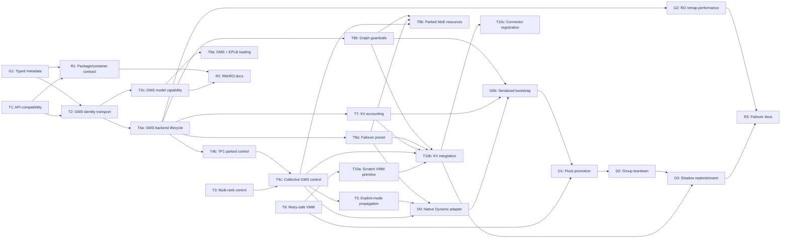

<!--
SPDX-FileCopyrightText: Copyright (c) 2026 NVIDIA CORPORATION & AFFILIATES. All rights reserved.
SPDX-License-Identifier: Apache-2.0
-->

# 18. GMS Integration Gaps and Concrete PR Plan

[< Back to Overview](README.md)

**Status:** Implementation plan
**Created:** 2026-06-26
**Last updated:** 2026-08-19
**Current source of truth for:** GMS V0/standalone loading, V0/live-owner warm-shadow details, and its detailed PR
sequence

> [§22](22-gms-snapshot-four-lane-integration-plan.md) is the current source of truth for the GMS V0/V1 boundary,
> shared Snapshot readiness, the TRT-LLM GMS V1 adapter, restored-owner infrastructure, and overall delivery priority.
> This section's stable-VA, admission, multi-rank, and resource-lifecycle requirements remain applicable where §22
> assigns them to shared Snapshot readiness or V1.

## Executive Verdict

[ai-dynamo/dynamo PR #11000](https://github.com/ai-dynamo/dynamo/pull/11000) documents the target standalone
GMS failover shape, but it does not complete the TensorRT-LLM integration. At the pinned Dynamo revision, its own
engine-support table describes TensorRT-LLM as a weight-load-only prototype with no complete sleep/wake, scratch KV,
or `flock` activation path.

TensorRT-LLM has useful merged foundations:

- native `LoadFormat.GMS` with RW publication and intended RO attachment
- a backend-neutral `SourceIdentity` data model, serialization, comparison policies, and a strict GMS reader gate
- staged post-load hooks for safe aliasing, weight transforms, and derived-state caching
- generic worker sleep/wake for TensorRT-LLM-owned virtual memory and KV cache
- single-rank MPI sleep/wake control

It does not yet have a supported GMS warm-shadow lifecycle. Against the exact GMS revision reviewed here, there are
also two blockers before failover can work:

1. the writer consumes `finalize_gms_write()` using an incompatible return-value contract; and
2. the reader's strict source-identity gate cannot succeed against the real backend because native GMS neither
   publishes the writer metadata nor retrieves it; `GMSBackend.get_source_identity()` therefore returns `None`.

The second blocker is not the absence of a `SourceIdentity` class. TensorRT-LLM already constructs and compares the
local identity. The missing work is to bind it to exact checkpoint contents and the committed post-transform GMS
layout generation, publish that metadata atomically with the writer commit, and retrieve it before RO
materialization.

The architectural recommendation is:

```text
GMS owns GMS-backed weight allocation, layout, mapping, and attachment semantics.
TensorRT-LLM owns native KV/runtime VMM, engine memory lifecycle, stable-address correctness, readiness, and the local
admission interlock.
Dynamo or a standalone launcher owns election, routing/discovery admission, and process supervision.
```

Do not add a second public `SHADOW` / `ACTIVATING` state machine to `PyExecutor` as the first step. Extend the existing
TensorRT-LLM sleep/wake path with GMS-aware backend operations, then let the orchestrator hold a parked process until
promotion.

## Scope and Reviewed Revisions

This assessment is pinned so that API observations remain reproducible.

| Source | Revision or status | Purpose |
|:--|:--|:--|
| [Dynamo standalone GMS guide](https://github.com/ai-dynamo/dynamo/blob/811972df53de8640a7f1b1fb981c88f514a689d2/lib/gpu_memory_service/docs/standalone-usage.md) | `811972df` | Required engine behavior for weight loading, sleep/wake, scratch KV, memory accounting, and promotion. |
| [Dynamo GMS README](https://github.com/ai-dynamo/dynamo/blob/811972df53de8640a7f1b1fb981c88f514a689d2/lib/gpu_memory_service/README.md) | `811972df` | GMS ownership, RW/RO sessions, and pause/resume contract. |
| [ai-dynamo/dynamo PR #11000](https://github.com/ai-dynamo/dynamo/pull/11000) | Draft when reviewed | Documentation and vLLM standalone example; no TRT-LLM runtime implementation. |
| [TensorRT-LLM `main`](https://github.com/NVIDIA/TensorRT-LLM/tree/f12c08f5508be1475e00f47b9308072d18fe6470) | `f12c08f5` | Native GMS loader, SourceIdentity gate, and current worker sleep/wake behavior. |
| [TensorRT-LLM PR #15432](https://github.com/NVIDIA/TensorRT-LLM/pull/15432) | Open, stacked PR at `c2f35a87` when reviewed | Wave 5 MX post-transform Llama receiver and MX-to-GMS double-transform prevention. |
| [TensorRT-LLM PR #13394](https://github.com/NVIDIA/TensorRT-LLM/pull/13394) | Draft proof; do not merge as-is | Large-model GMS shadow-failover proof and measured promotion breakdown. |
| [Dynamo PR #8621](https://github.com/ai-dynamo/dynamo/pull/8621) | Draft proof | Companion Dynamo orchestration experiment. |

The failure model in this plan is process death on an otherwise healthy GPU and node. It does not promise survival of
GMS daemon loss, GPU reset, node loss, in-flight requests, or the failed primary's KV state.

## Current Implementation Matrix

| Layer | Current state | Consequence |
|:--|:--|:--|
| Native GMS weight loader | Merged through [#13926](https://github.com/NVIDIA/TensorRT-LLM/pull/13926), with staged-hook follow-ups [#14770](https://github.com/NVIDIA/TensorRT-LLM/pull/14770), [#14878](https://github.com/NVIDIA/TensorRT-LLM/pull/14878), [#15014](https://github.com/NVIDIA/TensorRT-LLM/pull/15014), [#15288](https://github.com/NVIDIA/TensorRT-LLM/pull/15288), and [#15471](https://github.com/NVIDIA/TensorRT-LLM/pull/15471). | The intended loading structure exists, but real-package RW/RO compatibility is not proven. |
| Native GMS writer | Calls `finalize_gms_write()` and records committed bytes. | The pinned GMS API returns a stats dataclass, while TRT-LLM converts the whole object to `int`. |
| Source identity | [`SourceIdentity`](https://github.com/NVIDIA/TensorRT-LLM/blob/f12c08f5508be1475e00f47b9308072d18fe6470/tensorrt_llm/_torch/weight_sharing/source_identity.py#L15-L37) provides local construction, serialization, semantic fingerprints, comparison policies, and fail-closed validation. | It is not an exact checkpoint-content or committed-GMS-layout identity, and native GMS has no transport for it. |
| Native GMS reader | Performs alias setup, strict source-identity validation, materialization, and derived-state caching. | The gate is correctly fail-closed, but [`GMSBackend.get_source_identity()`](https://github.com/NVIDIA/TensorRT-LLM/blob/f12c08f5508be1475e00f47b9308072d18fe6470/tensorrt_llm/_torch/memory/gpu_memory_backend.py#L466-L480) is still a TODO that returns `None`, so a real RO attach cannot pass. |
| Staged post-transform receiver | [#15432](https://github.com/NVIDIA/TensorRT-LLM/pull/15432) publishes post-transform MX bytes with identity/layout/protocol metadata, enables the Llama receiver, and prevents an MX-seeded GMS writer from transforming those bytes again. | The PR is open and stacked. Its production receiver allowlist is Llama-only, and its metadata transport is MX-only. |
| Generic sleep/wake | `SleepConfig`, request drain/pause, tagged native VMM release/materialization, and KV sleep/wakeup exist. | GMS-backed weights are explicitly not covered by the native VMM tags and are skipped. |
| MPI control | Single-rank support merged in [#14052](https://github.com/NVIDIA/TensorRT-LLM/pull/14052); multi-rank work remains open in [#14636](https://github.com/NVIDIA/TensorRT-LLM/pull/14636). | TP greater than one cannot use the complete generic control path yet. |
| Dynamo TRT-LLM wrapper | [Dynamo #7575](https://github.com/ai-dynamo/dynamo/pull/7575) has wrapper-level pause/resume logic that combines TRT-LLM KV sleep with GMS unmap/remap. | This is useful prototype evidence, but it monkey-patches loading and is not a complete native or tested failover product. |
| End-to-end validation | Mock CPU unit coverage exists; the Dynamo TRT-LLM failover test is skipped and single-process. | API drift, real daemon behavior, TP collectives, and warm-shadow memory behavior can regress undetected. |

Open MX and staged-hook PRs such as [#15386](https://github.com/NVIDIA/TensorRT-LLM/pull/15386),
[#15387](https://github.com/NVIDIA/TensorRT-LLM/pull/15387),
[#15432](https://github.com/NVIDIA/TensorRT-LLM/pull/15432), and
[#15641](https://github.com/NVIDIA/TensorRT-LLM/pull/15641) improve ModelExpress or model-family coverage. They do not
publish native GMS metadata or implement GMS sleep/wake.

## SourceIdentity: What Exists and What GMS Still Needs

TensorRT-LLM should reuse the existing `SourceIdentity`; it should not invent a second GMS-specific compatibility
class. The existing implementation already provides the backend-neutral part of the contract:

- `ModelLoader` constructs the local identity before loading when MX or GMS is selected;
- `SourceIdentity.to_dict()` / `from_dict()` provide a versioned serialization seam;
- semantic fingerprints cover model configuration, quantization, backend, parallel mapping, and the rank-local tensor
  projection; and
- the [GMS RO path performs a strict check before materialization](https://github.com/NVIDIA/TensorRT-LLM/blob/f12c08f5508be1475e00f47b9308072d18fe6470/tensorrt_llm/_torch/pyexecutor/model_loader.py#L813-L831).

What it does **not** establish is just as important. `model_name` is a discovery descriptor and is not compared;
`_name_or_path` is deliberately excluded; and the realized tensor projection covers names, shapes, and dtypes rather
than checkpoint bytes, storage aliases/offsets/strides, a GMS layout generation, or the raw-versus-post-transform
protocol. Two fine-tunes with identical config and tensor shapes can therefore produce matching current identities.

The native GMS gap is exactly three pieces:

1. **Binding:** accompany `SourceIdentity` with an authoritative checkpoint revision/content or artifact-manifest
   digest and a committed-layout descriptor containing `weight_layout=post_transform`, transform protocol version,
   and GMS layout generation/hash.
2. **Atomic publication:** persist that envelope in a typed GMS application-metadata namespace as part of the same
   writer commit as the tensor layout. It must not be an uncommitted sidecar or a key that
   `GMSTensorSpec.load_all()` mistakes for a tensor.
3. **Pre-materialization retrieval:** reconstruct and validate the envelope after RO connect and before any GMS VA is
   bound to the model. Missing, malformed, stale, or unsupported metadata remains a hard failure.

This is why having `SourceIdentity` in the tree does not make the GMS path complete: the local data model and gate are
present, while the writer-to-reader trust boundary is not.

## Implication of the PR #15432 Migration

[PR #15432](https://github.com/NVIDIA/TensorRT-LLM/pull/15432) is an open, stacked Wave 5 PR. It is relevant to GMS,
but it is not a GMS lifecycle PR.

It establishes three useful precedents:

1. A publisher of final runtime weights must advertise `SourceIdentity`, `weight_layout=post_transform`, and a
   transform protocol version as separate facts. `SourceIdentity` alone cannot tell a receiver whether bytes still
   require one-shot transforms.
2. A compatible receiver skips `transform_weights()` and runs only structural alias setup plus derived-state caching.
   The production allowlist in this PR contains Llama; it is not a generic declaration that every model is safe.
3. An MX-to-GMS composition needs a special staged path. When a GMS RW process is seeded with already transformed MX
   bytes, it must not run the full post-load transform again before committing the GMS layout. Commit
   [`841278bc`](https://github.com/NVIDIA/TensorRT-LLM/commit/841278bcb16d64c28bbbc792f3615cc309dc3694)
   and its GMS loader test close that double-transform case.

The implications for native GMS are:

- extract or introduce a backend-neutral committed-weight-layout descriptor instead of copying MX-specific constants
  into the GMS adapter;
- add a GMS post-transform capability registry/allowlist and qualify model families incrementally. The current GMS RO
  path is generic and otherwise assumes that every model has cleanly separated `setup_aliases()`,
  `transform_weights()`, and `cache_derived_state()`;
- make Llama the first native GMS qualification target after the Wave 5 stack lands, then expand one family at a time
  with normal-load versus RW-to-RO equivalence tests; and
- add an MX post-transform donor -> GMS RW -> GMS RO composition test that asserts zero additional transforms and
  equivalent aliases, derived state, and outputs.

PR #15432 does **not** implement GMS metadata persistence/retrieval, the `finalize_gms_write()` return fix,
suspend/resume, request admission, `flock`, scratch KV, or shadow supervision. Those remain independent work. The
backend lifecycle can be developed in parallel; #15432 becomes a prerequisite only for MX-seeded GMS and its Llama
qualification. Target-plus-draft/speculative decoding remains outside the first GMS gate until mixed target/draft
layout behavior is explicitly fixed and tested.

At the reviewed #15432 head, the target and separately loaded draft model still share loader-level post-transform
state, while an earlier fail-closed target-plus-draft guard is no longer present. Before enabling that combination,
either restore the fail-closed behavior or track layout stage per submodel and add a real mixed target/draft test.

## Immediately Actionable Implementation Tranche

The following work can start without waiting for the complete failover product:

| Order | PR | Can start now? | Deliverable and merge boundary |
|:--|:--|:--|:--|
| 1 | T1 — exact GMS finalize contract | Yes | Consume `GMSCommittedMemoryStats.committed_bytes` and add real-package writer coverage. No metadata or lifecycle scope. |
| 1 | G1 — typed GMS application metadata | Yes, in parallel | Add atomically committed, layout-scoped opaque metadata that cannot be parsed as tensor specs. |
| 2 | T2 — wire the existing identity into GMS | TRT adapter work can start while G1 is reviewed | Publish/retrieve the identity plus checkpoint digest and committed-layout descriptor; merge/enable only against an approved G1 API. |
| 2 | T2c — gate model capability and qualify Llama | Gate design can start now; qualification follows the Wave 5 stack and T2 | Reject unqualified post-transform models before GMS commit/attach; prove native and MX-seeded Llama RW-to-RO equivalence. |
| 2 | T4a — reversible backend lifecycle | Yes, in parallel behind the internal backend boundary | Implement state validation, accounting, suspend/resume ordering, and mock tests. Real-daemon resume qualification requires T2 so identity/layout can be revalidated before remap. |
| 3 | T4b — TP1 parked-engine control | After the T4a interface is stable | Add persistent queue-level admission closure and shared rank-local dispatch. Do not expose GMS sleep by only inserting calls into the current `control_action()` block. |
| 3 | T3 — multi-rank control | Continue/adapt #14636 in parallel | Centralize the same rank-local operation in the MPI listener and aggregate PREPARE/COMMIT/ABORT failures. |
| 4 | T4c — collective GMS park/wake | After T3 and T4b | Apply the TP1 operation through the existing multi-rank protocol; any partial failure leaves group admission closed and is process-group fatal unless rollback is proven. |
| 5 | D0/D1 — native shadow orchestration | After T4c for TP greater than one | Use the supported collective API for parking/wake, while Dynamo retains role assignment, `flock`, discovery, and process-group supervision. |

The current `BaseWorker.sleep()` / `wakeup()` only drains while inside `control_action()`. On return, the event loop is
resumed; GMS-backed weights were skipped; and there is no persistent parked admission state. Therefore the smallest
safe serving integration is not merely two GMS calls. It must close admission under the enqueue lock before drain,
keep it closed through the entire parked and waking interval, and reopen only after collective wake, identity/layout
validation, remap, synchronization, and health checks succeed.

The Dynamo prototype already has wrapper-level paused state, pending resume tags, request rejection, drain, and
unregister/re-register ordering. Treat that as behavior to migrate behind the native TRT-LLM control surface, not as
evidence that core admission is safe today: it still reaches private collective RPC and global GMS managers, and the
TRT-LLM request queue does not enforce the parked state itself.

Use a private local lifecycle for correctness and diagnostics, without adding public `SHADOW` or `ACTIVATING` states:

```text
GMS backend:
NEW -> RW_ACTIVE --commit--> RO_ACTIVE
NEW ------------------------> RO_ACTIVE
RO_ACTIVE -> SUSPENDING -> SUSPENDED -> RESUMING -> RO_ACTIVE
any non-closed state -------------------------------> FAILED -> CLOSED

Engine-local memory control:
RUNNING -> PARKING -> PARKED -> WAKING -> RUNNING
              |           |          |
              +-----------+----------+-> FAILED (admission remains closed)

Orchestrator role lifecycle:
STARTING -> PARKED_READY -> ELECTED -> WAKING -> SERVING
```

Only `RO_ACTIVE` is suspendable. Writer commit first transitions the writer to RO. Resume reconnects explicitly RO,
retrieves and validates the same committed generation, and then remaps the preserved VA ranges. Any partial remap or
cross-rank failure marks the candidate unusable unless a verified full rollback exists. `cleanup()` remains terminal.
The orchestrator-role lifecycle belongs to Dynamo or a standalone launcher and must not be encoded in the memory
backend.

## Blocking Defects in Basic RW/RO Loading

These are P0 because failover work cannot be qualified while the underlying real-process attach path is broken.

### Writer finalization contract mismatch

TensorRT-LLM currently performs an integer conversion around `finalize_gms_write()` in
[`GMSBackend.finalize_write()`](https://github.com/NVIDIA/TensorRT-LLM/blob/f12c08f5508be1475e00f47b9308072d18fe6470/tensorrt_llm/_torch/memory/gpu_memory_backend.py#L417-L460).
At the pinned GMS revision, the function returns `GMSCommittedMemoryStats`, containing `committed_bytes` and
`pruned_bytes`, rather than an integer. The adapter must consume `.committed_bytes` and have a versioned dependency
contract.

### Source identity cannot pass strict RO validation

[`GMSBackend.get_source_identity()`](https://github.com/NVIDIA/TensorRT-LLM/blob/f12c08f5508be1475e00f47b9308072d18fe6470/tensorrt_llm/_torch/memory/gpu_memory_backend.py#L466-L480)
returns `None`. The RO loader invokes the strict source-identity gate before materialization, and strict mode correctly
rejects a missing identity.

The fix requires a cross-repository metadata contract, not an arbitrary metadata key. GMS module materialization
currently loads metadata as tensor specifications, so TensorRT-LLM identity data needs a typed namespace or filtering
rule that cannot be confused with tensor-layout metadata.

The committed metadata envelope includes the existing serialized `SourceIdentity` plus:

- an authoritative checkpoint revision/content or artifact-manifest digest; `_name_or_path` alone is not authoritative;
- `weight_layout=post_transform` and the staged-transform protocol version;
- the committed GMS layout generation/hash; and
- a metadata-envelope/TensorRT-LLM compatibility version.

Rank and TP/PP/EP mapping, dtype, quantization, and semantic model layout remain in `SourceIdentity`; they should not
be duplicated into an unrelated GMS-only identity class.

The writer must publish the identity before committing the layout. The reader may perform structural alias setup, but
must fetch and validate the identity before binding or materializing GMS memory. Production RO attach must remain
fail-closed.

### Existing tests hide both defects

The current backend tests intentionally use a fake GMS module and mocked source identity. Add a test tier that imports
the supported GMS package, starts a real daemon, publishes from one process, and attaches from another. Mock tests
should remain for fast unit coverage, but cannot be the release gate for this integration.

## Required GMS Lifecycle Contract

### Invariants

A correct parked-shadow implementation must maintain all of the following:

1. Primary and shadow use one published immutable weight layout per rank/GPU/tag.
2. Serving primaries and initializing or awake shadows attach published weights RO. A parked shadow retains its VA
   reservations and tensor pointers but has no active GMS mapping or session.
3. Sleep releases the process's imported mappings and GMS session without releasing its reserved virtual addresses.
   It does not free the daemon-owned published weight backing.
4. Wake reconnects to the same layout and remaps at the identical addresses before any captured graph executes.
5. Mutable KV and runtime backing are separate from the immutable weight session.
6. No request is admitted until every rank has restored weights, KV/runtime backing, and readiness.
7. Any rank-level wake failure fails the complete engine group; partial activation is forbidden.
8. Promotion does not reload the checkpoint and does not run model warmup, autotuning, or CUDA graph capture.

### GMS session lock and failover `flock` are different

The GMS RW/RO session controls memory-layout creation and attachment:

- one deterministic writer creates and commits a layout;
- readers attach to the committed layout RO; and
- after publication, awake active and shadow engines attach immutable weights RO, while parked shadows retain only
  their VA reservations and client bookkeeping.

The POSIX `flock` controls which engine group may become the serving replica. The kernel releases that lock when its
owning process dies.
Acquiring the failover lock does not upgrade weight memory from RO to RW. On promotion:

- weights reconnect and remap RO; and
- mutable KV obtains fresh writable backing.

This distinction replaces older design text that proposed an RO-to-RW weight-lock upgrade.

### Sleep ordering

The orchestration layer initiates admission control; TensorRT-LLM performs the memory transition:

1. stop routing new requests to the engine;
2. reject new local admission and drain in-flight work;
3. synchronize CUDA work that can reference the mappings;
4. park or release TensorRT-LLM-owned KV and runtime allocations according to their sleep tags;
5. call the GMS backend's non-terminal suspend operation:
   - unmap all imported GMS virtual-address ranges;
   - abort/release the local GMS session; and
   - retain the VA reservations and tensor pointer identities;
6. report parked readiness only after all ranks complete.

Terminal `cleanup()` is not a substitute for suspend because cleanup may discard the state needed to remap the same
addresses.

### Wake ordering

Only the engine group that wins failover election wakes:

1. the leader acquires the failover `flock` and notifies its ranks;
2. reconnect the immutable weight session RO with a bounded timeout;
3. validate the layout hash and `SourceIdentity`;
4. remap weights at their original addresses;
5. install full KV and runtime backing at the addresses used during graph capture;
6. recreate or register external memory handles only after the real backing exists;
7. execute a collective readiness barrier and a bounded health probe; and
8. register the engine for traffic last.

Layout mismatch, missing identity, remap failure, or any rank timeout is fatal to that candidate. It must release the
failover lock and exit without registering. Reusing the candidate is permitted only after a verified collective
rollback to the fully parked state; the first milestone should treat a partial wake as process-fatal.

## Why Sleep/Wake Is Required on One Node

Single node does not mean single engine or single process. A warm-failover deployment places an active engine group
and at least one shadow group on the same GPUs. TP2 or TP8 is also multi-process even when all ranks are local.

Without parking the shadow, both groups allocate:

- full KV cache backing
- runtime workspaces and reusable buffers
- graph-capture pools
- autotuning and model-family-specific scratch memory

The second group can OOM during initialization, and free-memory-based KV sizing can be distorted by allocations from
the first group. Sleep/wake is the mechanism that lets the shadow preserve virtual addresses and pre-captured graphs
while releasing most process-local physical backing.

After M0 closes the native RW/RO blockers, a fresh process that starts only after the primary dies can attach to
resident GMS weights without being parked first. That is cold restart with faster weight loading, not warm-shadow
failover, and it does not satisfy the intended promotion latency or availability target.

## Remaining Functional Gaps

### Native backend lifecycle

`GPUMemoryBackend` needs non-terminal lifecycle operations separate from terminal cleanup. The proposed semantic
surface is:

```python
class GPUMemoryBackend(Protocol):
    def suspend(self) -> MemoryLifecycleStats: ...
    def resume(self, timeout_s: float) -> MemoryLifecycleStats: ...
    def total_bytes(self) -> int: ...
    def cleanup(self) -> None: ...
```

Names may change during review, but the semantics must not: suspend preserves VA reservations; resume restores the
same mappings; cleanup permanently closes the backend.

### Worker integration

`BaseWorker` and `RayGpuWorker` currently route only TensorRT-LLM native VMM tags through
`release_with_tag()` / `materialize_with_tag()`. They must recognize GMS-owned weight tags and call the model's memory
backend lifecycle in the existing sleep/wake sequence. This path should share error reporting and timing with the
normal worker control action instead of adding a parallel executor state machine.

### Multi-rank group semantics

The final implementation requires:

- a stable engine-group ID propagated to all ranks
- deterministic writer versus reader roles that cannot deadlock during concurrent startup
- rank-qualified GMS tags and socket configuration
- leader-only failover-lock ownership with collective wake
- barriers and error aggregation for sleep, wake, and shutdown
- whole-process-group termination after a rank or leader failure

Killing only the leader is unsafe because orphan ranks can keep KV or GMS sessions alive. Multi-rank generic
sleep/wake from [#14636](https://github.com/NVIDIA/TensorRT-LLM/pull/14636) should be landed or adapted rather than
reimplemented inside the GMS integration.

### Scratch KV and stable virtual addresses

A warm shadow needs the addresses referenced by CUDA graphs without holding a second full KV allocation. The required
invariant is:

```text
graph capture: stable KV VA + scratch/minimal physical backing
parked shadow: stable KV VA + minimal or no physical backing
promoted engine: same KV VA + full writable backing
```

The selected owner for scratch and full KV backing is TensorRT-LLM's native C++ VMM/KV allocator; GMS remains the
owner of shared immutable weights. This is distinct from preserving or sharing the failed primary's KV contents,
which remains outside this scope.

The proof flow that allocates full KV, captures graphs, and then parks can initialize the first shadow serially. It
does not solve steady-state replenishment, because creating a replacement shadow beside a live primary temporarily
requires the full second KV footprint again. Scratch backing or an equivalent low-physical-backing design is needed
for replenishable redundancy.

### Co-resident memory accounting and reclamation

KV sizing based only on global free memory observes the active peer's allocations and can make different decisions on
primary and shadow. The implementation needs an explicit peer reserve or a calibrated target, plus GMS weight-byte
accounting through `total_bytes()`.

Promotion must also tolerate the short interval in which a dead primary's memory is still being reclaimed. VMM
materialization should use bounded retry/backoff for transient OOM, with clear timeout diagnostics rather than an
unbounded wait.

### CUDA graph, autotuner, and model-family resources

Promotion is not warm if it performs graph capture or expensive autotuning. The parked process must preserve the
captured graph and required process-local caches, and it must release nonessential allocations such as reusable
buffers or MoE/MNNVL workspaces that otherwise defeat the memory budget.

Disk or GMS-backed compile-cache serialization can improve cold startup and replacement-shadow creation, but it is
not the core promotion mechanism. The hard promotion invariant is that compile, autotune, and graph capture are absent
from the failover hot path.

### External memory registration

NIXL, KV connectors, or other external registrations must not advertise scratch backing as the final KV allocation.
Registration must be deferred until wake installs real backing, or explicitly torn down and recreated during wake.
T10c owns this lifecycle; connector-enabled configurations remain outside the aggregate M2 gate until T10c passes.

### Orchestration and replenishment

Neither the memory backend nor `PyExecutor` should decide which replica is active. Dynamo or a standalone launcher
must:

- create the engine groups and assign roles
- hold the failover `flock` at the group leader
- keep parked shadows out of service discovery
- wake one complete group after the primary dies
- register it only after collective readiness
- terminate and reap every rank of the failed group
- start and park a replacement shadow while the promoted primary serves

The last item is required for continued redundancy; a one-time failover demo is not a complete operational loop.

## Ownership Boundary

| Responsibility | Owner |
|:--|:--|
| GMS-backed weight VMM allocation, layout commit, RO reconnect/remap, metadata transport | GMS library/service |
| Weight-source validation, memory-backend suspend/resume, native KV/runtime VMM and backing, graph-address correctness, rank readiness, local admission interlock | TensorRT-LLM |
| Leader election, `flock`, delayed discovery and routing admission, failed-group cleanup, replacement-shadow creation | Dynamo or standalone launcher |
| Request replay and client-visible behavior for failed streams | Router/application policy; not GMS |
| Preservation or migration of live KV contents | KVBM/KV connector design; not this GMS failover milestone |

## Dependency-Ordered PR Plan

The plan deliberately separates compatibility, engine lifecycle, allocator work, and orchestration so that each PR has
one reviewable concern. `T-*` PRs target NVIDIA/TensorRT-LLM. `G-*` and `D-*` PRs target ai-dynamo/dynamo's GMS and
Dynamo integration areas respectively. Replace `TBD` in proposed titles with the assigned tracking ID.



### G1 — Add typed layout/application metadata to GMS

| Field | Plan |
|:--|:--|
| Repository | `ai-dynamo/dynamo` |
| Proposed title | `[GMS][feat] add namespaced layout application metadata` |
| Depends on | None |
| Scope | Add layout-scoped application metadata that survives commit and RO reconnect. Separate or filter tensor-spec metadata so application keys are never interpreted by `GMSTensorSpec.load_all()`. Make compatibility for existing unprefixed layouts explicit. |
| Likely touchpoints | `client/memory_manager.py`, `client/torch/tensor.py`, `client/torch/module.py`, server/protocol metadata code, GMS tests. |
| Tests | Tensor specs and opaque application bytes coexist; metadata survives RW commit and RO reconnect unchanged; application keys are filtered from tensor enumeration; existing vLLM loading remains compatible. |
| Exit criterion | A public API can atomically publish and retrieve a versioned `trtllm` application envelope containing identity, layout stage/protocol, and layout generation without changing module tensor enumeration. |
| Non-goals | Defining TensorRT-LLM's identity fields or implementing failover. |

If GMS already has an approved typed metadata facility by implementation time, this becomes a small documentation and
compatibility-test PR rather than a new API.

### T1 — Fix the exact GMS API contract and add real-package coverage

| Field | Plan |
|:--|:--|
| Repository | `NVIDIA/TensorRT-LLM` |
| Proposed title | `[TRTLLM-TBD][fix] align native GMS adapter with supported API` |
| Depends on | None |
| Scope | Adapt the native backend to the exact pinned GMS API by consuming `GMSCommittedMemoryStats.committed_bytes`; fail fast on the tested incompatible shape. Keep the GMS source/tree dependency internal to this integration test. R1 exclusively owns published version bounds, containers, and runtime capability diagnostics. |
| Likely touchpoints | `tensorrt_llm/_torch/memory/gpu_memory_backend.py`, test-only CI dependency/image definition, `tests/unittest/_torch/memory/test_gms_backend.py`, a real-daemon GPU integration test. |
| Tests | Exact installed-package writer commit; negative unsupported-API test; old/new return-shape tests only if backward compatibility is intentional. |
| Exit criterion | One RW process publishes, commits, and transitions to the expected post-commit state against the exact pinned GMS tree used by the test. |
| Non-goals | RO identity validation, sleep/wake, packaging a user-facing extra. |

### T2 — Persist and retrieve the existing identity through GMS

| Field | Plan |
|:--|:--|
| Repository | `NVIDIA/TensorRT-LLM` |
| Proposed title | `[TRTLLM-TBD][feat] persist committed weight identity through GMS` |
| Depends on | G1 and T1 |
| Scope | Reuse `SourceIdentity.to_dict()` / `from_dict()`; add the authoritative checkpoint/artifact binding and backend-neutral committed-layout descriptor; pass the envelope into writer finalization; retrieve it before RO materialization; and keep strict fail-closed validation. Do not rely on `_name_or_path` or an unvalidated display model name. Do not add a parallel GMS-specific identity class. |
| Likely touchpoints | `gpu_memory_backend.py`, `weight_sharing/source_identity.py`, a shared committed-layout metadata module, `pyexecutor/model_loader.py`, source-identity and model-loader tests. |
| Tests | Real two-process RW-to-RO attach; exact-match success; same architecture/config with different checkpoint contents or revision is rejected; rank/dtype/quant/transform/generation mismatches are rejected; missing, malformed, and unknown-version metadata is rejected. |
| Exit criterion | A second process attaches RO to the real published layout only when identity and layout match. |
| Non-goals | Relaxing strict mode or recovering from incompatible layouts. |

If review size requires a split, land the backend-neutral artifact/layout schema as T2a and the GMS publication and
retrieval adapter as T2b. T2b must not enable native RO attachment without the artifact and committed-layout binding.

### T2c — Gate post-transform capability and qualify Llama

| Field | Plan |
|:--|:--|
| Repository | `NVIDIA/TensorRT-LLM` |
| Proposed title | `[TRTLLM-TBD][feat] gate GMS post-transform model compatibility` |
| Depends on | T2; the Llama and MX-composition qualification also depends on the [#15432](https://github.com/NVIDIA/TensorRT-LLM/pull/15432) stack |
| Scope | Add a backend-neutral transform-protocol capability registry or equivalent model declaration shared by MX and GMS. Fail before writer commit or RO materialization when a model/protocol is not qualified. Enable Llama protocol v1 first. Keep target-plus-draft/speculative decoding disabled until layout state is tracked per submodel and the mixed path is tested. |
| Likely touchpoints | staged-hook capability metadata, `model_loader.py`, GMS/MX validation, feature-combination validation, Llama model-loader tests. |
| Tests | Llama HF -> GMS RW -> GMS RO equivalence; MX post-transform -> GMS RW -> GMS RO equivalence with zero extra transforms; unsupported family/protocol and target-plus-draft fail before commit/attach. |
| Exit criterion | Native GMS advertises only explicitly qualified model/protocol pairs, with Llama v1 passing real-process output and lifecycle checks. |
| Non-goals | Bulk-enabling every model family or speculative decoding. |

### T3 — Land generic multi-rank MPI sleep/wake control

| Field | Plan |
|:--|:--|
| Repository | `NVIDIA/TensorRT-LLM` |
| Proposed title | `[TRTLLM-TBD][feat] add multi-rank MPI sleep and wake control` |
| Depends on | None; rebase and adapt [#14636](https://github.com/NVIDIA/TensorRT-LLM/pull/14636), which was open with changes requested at `6ad362bf` when reviewed |
| Scope | Land the dedicated PREPARE/COMMIT/ABORT control communicator/listener, collective acknowledgement and error aggregation, and rank-zero proxy allowlist. Centralize the duplicated rank-local memory operation so native VMM and later GMS dispatch cannot diverge by rank. Do not add a second MPI control channel for GMS. |
| Likely touchpoints | `py_executor.py`, `base_worker.py`, `proxy.py`, `rpc_proxy.py`, MPI sleep/wake tests. |
| Tests | TP2 and TP8 repeated cycles; injected failure before and after one rank unmaps; collective timeout without deadlock; safe listener shutdown and join. |
| Exit criterion | The caller never receives partial success. Any rank failure is aggregated and causes either a verified collective rollback or a process-fatal, admission-closed result for the whole group. |
| Non-goals | GMS roles, GMS session handling, or active-replica election. |

### T4a — Add the reversible GMS backend lifecycle

| Field | Plan |
|:--|:--|
| Repository | `NVIDIA/TensorRT-LLM` |
| Proposed title | `[TRTLLM-TBD][feat] add reversible GMS backend lifecycle` |
| Depends on | T1 for the stable adapter contract; T2 for production enablement and real-daemon resume qualification. Implementation and mock testing can proceed in parallel with G1/T2. Independent of MPI work in T3. |
| Scope | Add private `NEW`, `RW_ACTIVE`, `RO_ACTIVE`, `SUSPENDED`, `FAILED`, and `CLOSED` transition validation, `total_bytes`, mapped-byte accounting, non-terminal `suspend`, and non-terminal `resume` to `GPUMemoryBackend`/`GMSBackend`; keep `cleanup` terminal. Add one typed RO-connect timeout used both for initial reader attachment and wake reconnect. Suspend unmaps all GMS VA ranges, aborts the local session, and preserves reservations/bookkeeping. Resume retains the original GMS manager, reconnects it directly with an explicit RO request and timeout, retrieves and revalidates identity/layout, then remaps and verifies the same addresses. It must not call the current client-manager factory with a disconnected manager that still owns preserved mappings. Expose the lifecycle through model-engine ownership, but do not dispatch it from a serving worker until T4b lands atomically with admission gating. A partial remap without verified rollback transitions to `FAILED`. |
| Likely touchpoints | `gpu_memory_backend.py`, `model_loader.py`, model engine ownership, `GmsConfig`, backend/model-engine tests. |
| Tests | `GmsConfig` validation/serialization/API stability; ten or more direct backend/model-engine cycles; reader starts before writer commit and succeeds within the bound; writer failure and timeout fail clearly; every weight pointer and output is preserved; mapped memory is released/restored; stale-layout and daemon-loss behavior; terminal cleanup from awake/suspended states; partial failure either rolls back completely or marks the process fatal. |
| Exit criterion | The backend/model engine suspends and resumes GMS weights without checkpoint reload or RO-to-RW promotion and never returns a reusable half-suspended state; no serving-worker path can invoke it yet. |
| Non-goals | Worker tag dispatch, persistent admission gating, MPI dispatch, `flock`, graph policy, or scratch KV. |

### T4b — Add TP1 parked-engine control and a persistent admission gate

| Field | Plan |
|:--|:--|
| Repository | `NVIDIA/TensorRT-LLM` |
| Proposed title | `[TRTLLM-TBD][feat] add TP1 GMS engine park and wake control` |
| Depends on | T4a |
| Scope | Expose a supported TP1 park/wake call. Centralize one rank-local memory operation: native VMM tags call `release_with_tag()` / `materialize_with_tag()`, while GMS weight tags call the retained backend lifecycle. Add a distinct persistent `can_accept_requests` admission flag checked atomically inside request enqueue; do not overload the existing lifecycle/alive predicate because shutdown still has to run while parked. Close admission before the drain sentinel and keep it closed after `control_action()` exits. Track a `pending_resume_tags` set so partial-tag sleep cannot reopen admission until every parked tag is restored. Control and shutdown sentinels bypass the user-request gate. Sleep releases native KV/runtime first and GMS weights last; wake restores GMS weights and validates their generation first, then native KV/runtime. Keep this out of a new public `PyExecutor` shadow state machine. |
| Likely touchpoints | LLM/server control surface, `ExecutorRequestQueue`, PyExecutor proxy/RPC allowlist, `BaseWorker`, `RayGpuWorker`, rank-local memory dispatch, collective-control tests. |
| Tests | A race at enqueue versus gate-close cannot admit work; direct and routed requests are rejected from pre-drain through parked and waking; shutdown still executes while parked; subset-tag sleep remains closed until all pending tags wake; wake failure keeps admission closed and terminates or fully rolls back the candidate; normal non-GMS sleep remains compatible. |
| Exit criterion | An orchestrator can park and wake a TP1 engine through a supported API, and no local request can execute against unmapped memory. |
| Non-goals | Replica election, discovery registration, or role assignment. |

### T4c — Extend GMS park/wake to a collective engine group

| Field | Plan |
|:--|:--|
| Repository | `NVIDIA/TensorRT-LLM` |
| Proposed title | `[TRTLLM-TBD][feat] add collective GMS engine park and wake control` |
| Depends on | T3 and T4b |
| Scope | Reuse T3's PREPARE/COMMIT/ABORT protocol and the exact T4b rank-local operation in rank zero, Ray workers, and the non-rank-zero MPI listener. Aggregate errors and keep admission closed for the entire group until every rank completes wake and health. Expose one supported collective API instead of requiring Dynamo to reach private `LLM._collective_rpc`. |
| Likely touchpoints | MPI control listener/proxy, `BaseWorker`, `RayGpuWorker`, rank-local memory dispatch, group admission/readiness, TP tests. |
| Tests | TP2 and TP8 repeated park/wake; failure before unmap, after one rank unmaps, and during remap; no partial success, deadlock, early admission, or orphan listener. |
| Exit criterion | A supported call parks or wakes every rank as one failure domain; any partial failure leaves group admission closed and produces rollback or process-fatal semantics. |
| Non-goals | Replica election, `flock`, discovery registration, or role assignment. |

### T5 — Propagate and validate explicit GMS mode across MPI ranks

| Field | Plan |
|:--|:--|
| Repository | `NVIDIA/TensorRT-LLM` |
| Proposed title | `[TRTLLM-TBD][feat] propagate explicit GMS mode across MPI ranks` |
| Depends on | T4c |
| Scope | Propagate a GMS socket directory/root, tag, and explicit `rw` or `ro` mode through MPI serialization/environment filtering. Each rank resolves its device-local socket. Reject one literal socket path for `world_size > 1` unless a typed per-rank mapping is provided, and reject `mode=auto` for failover when it could produce mixed roles. Engine-ID-to-mode policy and `flock` ownership remain in the launcher/Dynamo. Phase timings remain in T3/T4a. |
| Likely touchpoints | `llmapi/mpi_session.py`, `llmapi/llm_args.py`, worker/executor control, MPI config tests. |
| Tests | Every writer-group rank starts RW, commits, then reconnects RO; every shadow rank attaches RO from the start; TP2 resolves distinct device-local sockets; config survives serialization; initial reader timeout aggregates across ranks; no mixed-role startup or deadlock. |
| Exit criterion | The mode selected by the orchestrator is identical and validated on every rank, while TRT-LLM never acquires the failover `flock`. |
| Non-goals | Mapping engine IDs to roles, leader election, timing aggregation, router registration, or process supervision. |

### T6 — Make VMM materialization retry-safe under transient OOM

| Field | Plan |
|:--|:--|
| Repository | `NVIDIA/TensorRT-LLM` |
| Proposed title | `[TRTLLM-TBD][fix] make VMM materialization retry-safe after OOM` |
| Depends on | None; required before promotion E2E |
| Scope | Make failed C++ materialization rollback leave the allocation registered and retryable; add bounded and cancellable retry for transient OOM in the Python wake path. Non-OOM errors fail immediately, and normal wake never retries forever. |
| Likely touchpoints | `cpp/tensorrt_llm/runtime/virtualMemory.cpp`, its header/tests, `_torch/virtual_memory.py`, focused retry tests. |
| Tests | Inject OOM for N attempts then succeed at the same VA; deadline exhaustion; non-OOM immediate failure; verify no handle silently disappears after rollback. |
| Exit criterion | A reclaim race with the dead primary is recoverable within a configured deadline and leaves a diagnosable state on failure. |
| Non-goals | Choosing KV capacity or reaping the failed process. |

### T7 — Make KV capacity planning GMS- and peer-aware

| Field | Plan |
|:--|:--|
| Repository | `NVIDIA/TensorRT-LLM` |
| Proposed title | `[TRTLLM-TBD][feat] add GMS-aware KV capacity calibration` |
| Depends on | T4a for backend byte accounting |
| Scope | Expose logical and mapped GMS weight bytes; avoid double-counting them in free-memory estimation; honor explicit `max_gpu_total_bytes`; add a Pydantic-validated peer parked-footprint/headroom field and a structured memory ledger. Follow protected-API and serialization requirements. |
| Likely touchpoints | PyExecutor memory planning and creator utilities, KV sizing/configuration, backend accounting, `TorchLlmArgs`, tests. |
| Tests | Formula tests for writer, RO shadow, peer reserve, explicit byte budget, and draft KV; Pydantic validation, YAML/pickle round-trip, and API-stability tests; Qwen TP1/TP8 and Kimi TP8 budget comparison. |
| Exit criterion | Primary and promoted KV byte budgets differ by no more than 5% for the qualification configurations and are independent of accidental `mem_get_info()` timing. The parked footprint must remain at or below the configured peer reserve. |
| Non-goals | `/proc` or NVML heuristics, allocation retry, or resource-manager cleanup. |

### T8a — Add a typed `shadow_failover` sleep preset

| Field | Plan |
|:--|:--|
| Repository | `NVIDIA/TensorRT-LLM` |
| Proposed title | `[TRTLLM-TBD][feat] add shadow-failover sleep preset` |
| Depends on | T4a |
| Scope | Expand a Pydantic-validated `shadow_failover` `SleepConfig` preset into TRT-LLM-owned tags for KV, model/extras, sampler/drafter resources, and GMS weights. Keep tag ownership centralized and preserve existing custom-tag behavior. |
| Likely touchpoints | `llm_args.py`, sleep-tag definitions, PyExecutor preset expansion, configuration tests. |
| Tests | YAML and pickle round-trip; invalid combinations fail validation; API-stability tests; preset expansion covers the documented resources without changing normal sleep. |
| Exit criterion | One serialized preset expands deterministically on every rank into tags consumed later by the T4b/T4c control paths, without private orchestration knowledge. |
| Non-goals | Graph freezing, autotuner policy, allocation retry, or backend-specific MoE cleanup. |

### T8b — Enforce CUDA graph and autotuner hot-path guardrails

| Field | Plan |
|:--|:--|
| Repository | `NVIDIA/TensorRT-LLM` |
| Proposed title | `[TRTLLM-TBD][feat] preserve CUDA graph readiness across shadow wake` |
| Depends on | T4a; T6 is required for promotion E2E, not the graph-policy unit itself |
| Scope | Preserve pre-captured graphs; freeze graph capture after the engine reports ready; use the documented eager fallback for a missing post-promotion key; prohibit warmup and autotuning during wake; expose traceable phase markers. |
| Likely touchpoints | CUDA graph runner, model engine, PyExecutor initialization/warmup, autotuner, graph tests. |
| Tests | Captured graph replays after weight/KV restoration; missing key uses fallback; partial restore is process-fatal or fully rolled back; CUDA/NVTX trace proves zero warmup, autotune, and graph capture during promotion. |
| Exit criterion | After ready, promotion performs no compile, warmup, autotune, or graph capture and preserves all graph-referenced addresses. |
| Non-goals | Sleep-tag configuration, compile-cache serialization, or model-family resource cleanup. |

### T9a — Make GMS loading compatible with ConfigurableMoE and EPLB

| Field | Plan |
|:--|:--|
| Repository | `NVIDIA/TensorRT-LLM` |
| Proposed title | `[TRTLLM-TBD][feat] support GMS loading with MoE load balancing` |
| Depends on | T2c; qualification also depends on T8a |
| Scope | Keep `ConfigurableMoE` as lifecycle owner. Move the existing `MoeLoadBalancer.register_weight_slots_after_to_cuda()` and `finalize_model()` ordering inside the GMS RW memory-pool scope and before `finalize_write`; ensure backend/quantization-derived tensors remain registered through their existing lifecycle hooks; verify the RO reader reconstructs a correct routing state; remove `validate_gms_moe_compat` only after tests pass. Do not add scheduler or forward-policy branches. |
| Likely touchpoints | `pyexecutor/model_loader.py`, `llmapi/llm_args.py`, `fused_moe/interface.py`, `moe_load_balancer.py`, quantization lifecycle hooks, MoE/GMS tests. |
| Tests | RW and RO outputs match for a supported ConfigurableMoE backend; initial dynamic-EPLB expert movement works after RO attach; incompatible backend/quant combinations remain explicit; update shared test helpers rather than adding one-off skips. |
| Exit criterion | The supported MoE/EPLB combination attaches RO and migrates experts without missing allocations, stale derived tensors, or silent routing corruption. |
| Non-goals | Broad all-backend qualification, forward scheduler changes, or parked communication-resource cleanup. |

#### MoE design gate for T9a/T9b

- **Change area:** ConfigurableMoE lifecycle, backend/quantization weight lifecycle, EPLB, and resource ownership.
- **Owner boundary:** `ConfigurableMoE` and model loading own lifecycle ordering; backends and selected quantization
  methods own raw/transformed weight registration; `MoEScheduler` remains forward-only.
- **Main APIs:** `post_load_weights`, `process_weights_after_loading`,
  `register_all_parameter_slot_and_to_fix_weight_fns`, `register_weight_slots_after_to_cuda`, and `finalize_model`.
- **Reference pattern:** the current GMS rejection explains the required ordering in
  [`model_loader.py`](https://github.com/NVIDIA/TensorRT-LLM/blob/f12c08f5508be1475e00f47b9308072d18fe6470/tensorrt_llm/_torch/pyexecutor/model_loader.py#L792-L805),
  while the [MoE developer guide](https://github.com/NVIDIA/TensorRT-LLM/blob/f12c08f5508be1475e00f47b9308072d18fe6470/tensorrt_llm/_torch/modules/fused_moe/MOE_DEVELOPER_GUIDE.md#L34-L55)
  keeps lifecycle in `ConfigurableMoE` and computation in backends.
- **Guide update:** required if the accepted lifecycle or supported EPLB matrix changes.
- **Tests:** `test_moe_module.py`, shared MoE test helpers, focused GMS loading tests, and multi-GPU EPLB coverage.

### T9b — Release rebuildable MoE/MNNVL resources while parked

| Field | Plan |
|:--|:--|
| Repository | `NVIDIA/TensorRT-LLM` |
| Proposed title | `[TRTLLM-TBD][feat] add parked lifecycle hooks for MoE resources` |
| Depends on | T4c, T8a, and T8b; add T9a for GMS + EPLB combinations |
| Scope | Add explicit suspend/resume hooks to releasable managers instead of proof-only introspection. Release and restore MoE communication, legacy MNNVL workspaces, and safe reusable buffers while preserving graph-referenced memory. Keep orchestration out of backends and forward schedulers. |
| Likely touchpoints | Resource manager, memory-buffer utilities, MNNVL/MoE all-to-all, ConfigurableMoE lifecycle, communication backends, PyExecutor. |
| Tests | Repeated park/wake cycles, including dynamic EPLB expert movement, with no leak or use-after-free; supported MoE output matches after wake; explicit parked-footprint ledger; unsupported non-rebuildable resources fail config validation. |
| Exit criterion | A qualified large-MoE process reaches its documented parked per-rank memory bound and wakes without rebuilding weight-derived state incorrectly. |
| Non-goals | New MoE backend, quantization, routing, or scheduler behavior. |

### T10a — Add the native scratch/stable-VA VMM primitive

| Field | Plan |
|:--|:--|
| Repository | `NVIDIA/TensorRT-LLM` |
| Proposed title | `[TRTLLM-TBD][feat] add scratch-backed stable-VA VMM primitive` |
| Depends on | T6 |
| Decision | TensorRT-LLM's native C++ VMM/BufferManager owns scratch and full KV backing. GMS remains the owner of shared immutable weights. |
| Scope | Add a core allocator primitive that reserves the final VA range, aliases a small scratch physical allocation for initialization, removes that backing, and later installs full writable backing at the same addresses. Expose only the minimal nanobind/Python control needed by KV integration. |
| Likely touchpoints | `virtualMemory.h/.cpp`, BufferManager/VMM adapter, nanobind bindings, `_torch/virtual_memory.py`, C++ and binding tests. |
| Tests | Aliased scratch bytes are much smaller than logical capacity; addresses remain identical; rollback and retry are safe; non-OOM errors do not leak registrations. |
| Exit criterion | The allocator can transition `reserved -> scratch-backed -> unbacked/parked -> fully backed` repeatedly at the same VA range. |
| Non-goals | KV sizing, graph policy, request admission, connector registration, or failed-primary KV preservation. |

### T10b — Integrate scratch backing with KV initialization and graphs

| Field | Plan |
|:--|:--|
| Repository | `NVIDIA/TensorRT-LLM` |
| Proposed title | `[TRTLLM-TBD][feat] use scratch-backed KV for shadow startup` |
| Depends on | T4c, T7, T8a, T8b, and T10a |
| Scope | Use the T10a primitive in PyExecutor KV creation: capture against scratch, park, install full backing before wake health, and keep the T4b admission gate closed while scratch or no backing is installed. |
| Likely touchpoints | PyExecutor creator/KV allocation scope, KV manager integration, graph readiness, admission guard, GPU E2E tests. |
| Tests | Graph captured against scratch replays after full backing; direct/routed requests cannot run with scratch; a new shadow initializes beside a live primary; failure restores a safe parked state or terminates. |
| Exit criterion | A replacement shadow initializes and parks beside the serving primary without allocating a second full KV footprint. |
| Non-goals | Connector/NIXL registration or copying the failed primary's KV contents. |

### T10c — Rebuild external registrations after real KV backing exists

| Field | Plan |
|:--|:--|
| Repository | `NVIDIA/TensorRT-LLM` |
| Proposed title | `[TRTLLM-TBD][feat] rebuild KV connector registrations after shadow wake` |
| Depends on | T10b |
| Scope | Defer NIXL/KV-connector registration while scratch is installed, or tear it down on park and recreate it only after full backing exists. Make registration failure keep admission closed. |
| Likely touchpoints | KV connector lifecycle, NIXL memory registration, PyExecutor wake ordering, connector tests. |
| Tests | Scratch backing is never advertised; handles refer to full restored memory; repeated park/wake does not leak registrations; registration failure is safe. |
| Exit criterion | Connector-enabled aggregate serving can use the scratch-KV lifecycle without stale or invalid external handles. |
| Non-goals | Full disaggregated failover qualification, which remains a later milestone. |

### D0 — Adopt the native TRT-LLM GMS control surface

| Field | Plan |
|:--|:--|
| Repository | `ai-dynamo/dynamo` |
| Proposed title | `[trtllm][refactor] use native TRT-LLM GMS loading and park control` |
| Depends on | T4c, T5, and T8a |
| Scope | Stop calling `gpu_memory_service.integrations.trtllm.setup_gms()` and stop reaching into global GMS managers. Map the group engine ID to explicit `rw`/`ro` configuration, use native `LoadFormat.GMS`, and call the supported TRT-LLM `shadow_failover` park/wake API. Keep this PR free of election policy. |
| Likely touchpoints | `components/src/dynamo/trtllm/workers/llm_worker.py`, TRT-LLM request handlers, adapter/config tests. |
| Tests | Writer and shadow groups receive deterministic modes; no monkey-patch is installed; parked admission remains closed through the native call; TP1 and TP2 adapter smoke. |
| Exit criterion | Dynamo controls a TRT-LLM group only through supported native loading and lifecycle interfaces. |
| Non-goals | `flock`, discovery registration, process-group teardown, or replenishment. |

### D0b — Serialize the initial full-KV bootstrap for M1

| Field | Plan |
|:--|:--|
| Repository | `ai-dynamo/dynamo` |
| Proposed title | `[trtllm][feat] serialize initial GMS shadow bootstrap` |
| Depends on | D0, T7, T8a, and T8b |
| Scope | Provide the pre-scratch-KV M1 sequence: initialize/capture the writer group and park it; initialize/capture the RO shadow and park it; only then let D1 elect and wake the serving group. Never initialize one full-KV group beside another active full-KV group. |
| Likely touchpoints | TRT-LLM worker factory/startup coordinator, parked-readiness state, memory/timing instrumentation, startup E2E tests. |
| Tests | GPU memory trace proves full-KV initialization is serialized; neither group enters discovery during bootstrap; both reach parked-ready; failure leaves no half-initialized group. |
| Exit criterion | One primary candidate and one shadow candidate are prewarmed and parked without transiently requiring two full KV allocations. |
| Non-goals | Concurrent replacement-shadow creation; T10a/T10b and D3 own that M2 path. |

### D1 — Add failover election and delayed discovery

| Field | Plan |
|:--|:--|
| Repository | `ai-dynamo/dynamo` |
| Proposed title | `[trtllm][feat] add flock-gated TRT-LLM shadow promotion` |
| Depends on | D0b, T6, and T8b |
| Scope | The leader alone acquires the POSIX `flock`; followers obey the collective wake. Keep shadows out of discovery, wake one complete group, run collective health, and register last. If any rank fails after lock acquisition, terminate the candidate so process exit releases the lock; reuse is allowed only after verified rollback. |
| Likely touchpoints | TRT-LLM request handlers/coordinator, GMS failover-lock integration, discovery registration, promotion E2E tests. |
| Tests | TP1 process death or an explicit whole-PGID failure injection; exactly one contender wins; non-winning shadow stays parked; partial-rank wake never registers; failed winner exits and another candidate can proceed. |
| Exit criterion | Exactly one healthy complete group becomes discoverable after a primary failure. |
| Non-goals | Leader-only/non-leader TP failure handling, failed-primary PGID cleanup, replacement-shadow creation, or request replay. |

### D2 — Reap the complete failed process group

| Field | Plan |
|:--|:--|
| Repository | `ai-dynamo/dynamo` |
| Proposed title | `[trtllm][fix] supervise and reap complete TRT-LLM engine groups` |
| Depends on | D1 |
| Scope | Track the process-group ID, terminate/reap all failed ranks, verify no orphan retains KV or GMS client sessions, and surface bounded teardown diagnostics. Reuse the existing supervisor where it already provides these guarantees. |
| Likely touchpoints | Worker factory/supervisor, process-group state, shutdown handlers, failure-injection tests. |
| Tests | TP leader-only death, non-leader death, stuck child, and repeated teardown followed by promotion; no orphan rank or retained session; promotion can proceed while teardown completes within the configured deadline. |
| Exit criterion | A failed group reaches a terminal reaped state and cannot continue consuming memory or serving. |
| Non-goals | Starting a replacement group or changing the TRT-LLM memory lifecycle. |

### D3 — Replenish the parked shadow after promotion

| Field | Plan |
|:--|:--|
| Repository | `ai-dynamo/dynamo` |
| Proposed title | `[trtllm][feat] replenish GMS shadow after promotion` |
| Depends on | D2 and T10b; add T10c when connectors are enabled |
| Scope | Launch a replacement group with deterministic RO roles while the promoted primary serves; wait for initialize/capture/park readiness; return the deployment to one active plus at least one parked group. Apply bounded restart/backoff policy. |
| Likely touchpoints | TRT-LLM worker factory/supervisor, group-state tracking, health/readiness, failover E2E tests. |
| Tests | Repeated fail-promote-replenish cycles; replacement startup beside live primary; failed replacement never enters discovery; bounded restart storm behavior. |
| Exit criterion | The deployment restores redundancy automatically after each successful promotion. |
| Non-goals | Multi-node failover and preserving in-flight requests. |

### G2 — Optimize GMS RO remap latency

| Field | Plan |
|:--|:--|
| Repository | `ai-dynamo/dynamo` GMS |
| Proposed title | `[GMS][perf] reduce RO remap latency for large layouts` |
| Depends on | T4a provides phase timings; merge qualification requires the M1 promotion harness |
| Scope | Profile and batch export/import/map/access operations or reduce mapping count while preserving exact virtual addresses, layout hash, and failure semantics. |
| Likely touchpoints | GMS client/server remap protocol, CUDA VMM mapping loops, layout metadata, performance tests. |
| Tests | Large-layout microbenchmark; stale-layout and exact-address correctness; no vLLM/TRT-LLM regression; M1 phase-timing correlation on the qualification system. |
| Exit criterion | Before implementation, derive a p95 remap sub-budget by subtracting measured non-remap overhead and safety margin from the 5-second product target. G2 must meet that remap sub-budget; M3 exclusively owns the end-to-end kill-to-first-token criterion. |
| Non-goals | Hiding remap time with checkpoint reload or graph recapture. |

### R1 — Declare the supported package and container capability contract

| Field | Plan |
|:--|:--|
| Repository | `NVIDIA/TensorRT-LLM` |
| Proposed title | `[TRTLLM-TBD][build] declare supported GMS dependency and container capability` |
| Depends on | T1 and a published/allowlisted GMS version containing G1 |
| Scope | Add the supported package/version or capability probe, container content, and daemon/socket/API compatibility diagnostics. Keep the T1 dependency test-only until this release contract lands. Do not claim an MX or GMS extra until it is actually published and allowlisted. |
| Tests | Clean-environment install/import, supported and unsupported daemon capability checks, container smoke CI. |
| Exit criterion | A clean supported environment can detect a compatible GMS service and fail early with actionable diagnostics when incompatible. |
| Non-goals | Usage documentation, failover orchestration, or performance claims. |

### R2 — Document experimental native RW/RO weight sharing

| Field | Plan |
|:--|:--|
| Repository | `NVIDIA/TensorRT-LLM` |
| Proposed title | `[TRTLLM-TBD][docs] document native GMS RW and RO weight sharing` |
| Depends on | M0 and R1 |
| Scope | Add a `trtllm-serve --config` writer/reader example, identity mismatch behavior, daemon health checks, limitations, and expected logs. Label it experimental weight sharing rather than failover. |
| Tests | Documentation link/command checks and a runnable single-GPU recipe in the supported container. |
| Exit criterion | A user can reproduce M0 without source-tree monkey patches or undocumented environment variables. |
| Non-goals | Warm-shadow promotion, scratch KV, or the <5-second SLO. |

### R3 — Document standalone and Dynamo shadow failover

| Field | Plan |
|:--|:--|
| Repository | `NVIDIA/TensorRT-LLM` plus a focused `ai-dynamo/dynamo` companion documentation PR |
| Proposed title | `[TRTLLM-TBD][docs] document supported GMS shadow failover` |
| Depends on | M2, successful G2 performance qualification, R1, and R2 |
| Scope | Add standalone single-node TP launch, Dynamo TP recipe, admission/election ordering, whole-group failure handling, replenishment, failure semantics, timing methodology, and troubleshooting. |
| Tests | Runnable TP example, documentation link/command checks, and references to the exact qualification matrix. |
| Exit criterion | A user can reproduce promotion and replenishment with the supported packages and understand every documented non-goal. |
| Non-goals | Multi-node/disaggregated support or unqualified LoRA/speculative/hybrid-cache combinations. |

Do not combine this stack into one failover PR. The proof PRs demonstrate behavior but cross loader, allocator,
executor, model-family, and orchestration ownership boundaries that need independent review and rollback.

## Delivery Gates

| Gate | Required PRs | Demonstration |
|:--|:--|:--|
| M0 — Native weight sharing | G1, T1, T2, T2c | Real daemon, one qualified Llama writer process, one RO reader process, strict mismatch and unsupported-model rejection. |
| M1 — Functional warm promotion | M0 plus T3, T4a, T4b, T4c, T5, T6, T7, T8a, T8b, D0, D0b, D1, D2 | Serialized initial shadow bootstrap and repeated fresh-deployment trials of one TP promotion complete within a configurable functional deadline; no SLO claim yet. |
| M2 — Replenishable redundancy | M1 plus T10a, T10b, D3 | A replacement shadow initializes beside the promoted live primary and restores one-active-plus-one-parked state. |
| M2-Connector — Connector-enabled aggregate serving | M2 plus T10c | External handles are created only for full restored KV backing and survive repeated cycles without leaks. |
| M2-MoE — Large-MoE qualification | M1 or M2 as applicable, plus T9a and T9b | ConfigurableMoE/EPLB correctness and a configured parked-footprint cap under realistic TP/EP. |
| M3 — Supported SLO/product path | M2 plus G2, R1, R2, R3 | p95 kill-to-first-successful-token is below 5 seconds over at least 20 trials; install, diagnostics, docs, and examples are reproducible. |

M1 may use the proof's serialized full-KV-prewarm-then-park bootstrap, but it must not be described as automatic
redundancy restoration. R1/R2 may land after M0 to expose experimental weight sharing. Do not advertise replenishable
shadow failover before M2, connector support before M2-Connector, or the target SLO before M3.

## Validation Matrix

| Area | Required coverage | Pass condition |
|:--|:--|:--|
| API compatibility | Supported GMS package and pinned revision | Real writer commit succeeds and reports the expected byte stats. |
| RO safety | Match and mismatch matrix for checkpoint/artifact digest, rank, dtype, quantization, and transform schema | Exact matches attach; identical configs with different checkpoint contents and every other incompatible or missing identity fail before materialization. |
| Post-transform capability | Qualified Llama protocol plus an unsupported family and target-plus-draft negative case | Only declared model/protocol pairs commit or attach; unsupported combinations fail before touching shared layout. |
| Transform composition | HF -> GMS RW -> RO and post-transform MX -> GMS RW -> RO | One-shot transforms execute exactly once; aliases, derived state, and outputs match a normal load. |
| VA stability | Repeated weight and KV park/wake | Every pointer used by a captured graph remains identical. |
| Admission safety | Direct and routed requests during every lifecycle phase | Admission closes before unmap and reopens only after collective wake and health; no request can execute against scratch or unmapped memory. |
| Memory ledger | Primary active, shadow initializing, shadow parked, shadow waking | No second weight copy; parked process-local footprint is at or below the configured peer-reserve cap. |
| TP collectives | TP2 negative injection and TP8 qualification | All ranks transition together; no partial registration or orphan rank. |
| Promotion | Whole-process-group SIGKILL | M1 completes within its configured functional deadline; M3 achieves p95 below 5 seconds over at least 20 trials. |
| Hot-path work | CUDA/NVTX trace of promotion | No checkpoint I/O, compile, autotune, graph capture, or model warmup. |
| Reclamation race | Delay failed-process teardown | Bounded retry handles transient OOM; deadline failure is explicit and safe. |
| External registration | T10c connector-enabled aggregate configuration | Scratch memory is never published as final backing; registrations refer to restored memory and do not leak across cycles. |
| Replenishment | New shadow launched after promotion | Replacement reaches parked-ready while the promoted primary continues serving. |
| Failure handling | Layout mismatch, GMS timeout, daemon loss, rank failure, partial wake | Candidate never enters discovery; the full group exits unless a verified rollback restored the fully parked state. |
| MoE | Large MoE with TP/EP | Correct output, bounded parked footprint, stable repeated promotion behavior. |

The draft proof reported approximately 6.43 seconds from primary `SIGKILL` to response for Kimi K2.5/Eagle3 TP8,
with roughly five seconds dominated by weight restoration and only a small native-VMM materialization component. Treat
that result as a stress/performance baseline to improve, not proof that the production target or Eagle3 support is
met.

## Failure Semantics and Non-Goals

For the first supported milestone:

- failover starts only after process death or explicit demotion on a healthy node/GPU;
- in-flight requests on the failed engine fail according to router policy;
- the replacement engine begins with an empty KV cache;
- GMS daemon loss, GPU reset, and node loss trigger cold recovery rather than remap recovery;
- stale or incompatible layouts are never reused;
- multi-node and disaggregated failover remain gated until single-node TP is stable; and
- LoRA, speculative decoding, and hybrid-cache combinations remain unsupported until separately qualified.

## Corrections to Earlier Sections

This section supersedes the following older assumptions elsewhere in this design corpus:

| Earlier assumption | Corrected decision |
|:--|:--|
| Promotion upgrades immutable weights from RO to RW. | Weights remain RO. The independent `flock` elects the active engine group; mutable KV gets writable backing. |
| `PyExecutor` must first add public `SHADOW` and `ACTIVATING` states. | Reuse existing sleep/wake and worker control. The orchestrator owns hold, election, and routing. |
| Native GMS weight sharing is working on `main`. | The structure is merged, but real-package writer finalization and strict RO identity are currently blocked. |
| GMS weights remain mapped while the shadow is parked. | The shadow unmaps imported GMS VA ranges and releases its session while preserving VA reservations. |
| A new GMS `park()` API is required. | Existing GMS unmap, abort, reconnect, and remap primitives provide the required lifecycle. |
| KV is entirely unrelated to the GMS failover design. | KV persistence is separate, but stable-VA scratch/full backing is required for warm graph-compatible promotion. |
| Compile-cache serialization is mandatory for every promotion. | Promotion must avoid compile/capture/autotune; preserving the live process's graphs/caches is sufficient. Serialization helps cold and replacement startup. |
| TRT-LLM core owns election and request routing. | TRT-LLM owns readiness and memory correctness; Dynamo or a launcher owns election, discovery, routing, and replay policy. |

The affected older text is primarily in [§03 Architecture](03-architecture.md),
[§04 Implementation](04-implementation-plan.md), [§06 Executor Failover](06-executor-failover.md),
[§09 KV Cache Extension](09-kv-cache-extension.md), and [§14 Open Questions](14-open-questions.md). Those sections
should be reconciled in a documentation cleanup after this implementation plan is accepted.

## References

- [Pinned standalone GMS guide](https://github.com/ai-dynamo/dynamo/blob/811972df53de8640a7f1b1fb981c88f514a689d2/lib/gpu_memory_service/docs/standalone-usage.md)
- [GMS pause/resume contract](https://github.com/ai-dynamo/dynamo/blob/811972df53de8640a7f1b1fb981c88f514a689d2/lib/gpu_memory_service/README.md#pause--resume)
- [GMS memory-manager unmap/remap implementation](https://github.com/ai-dynamo/dynamo/blob/811972df53de8640a7f1b1fb981c88f514a689d2/lib/gpu_memory_service/client/memory_manager.py#L506-L665)
- [GMS failover `flock`](https://github.com/ai-dynamo/dynamo/blob/811972df53de8640a7f1b1fb981c88f514a689d2/lib/gpu_memory_service/failover_lock/flock/lock.py)
- [Dynamo vLLM sleep/wake reference](https://github.com/ai-dynamo/dynamo/blob/811972df53de8640a7f1b1fb981c88f514a689d2/lib/gpu_memory_service/integrations/vllm/worker.py#L332-L365)
- [Dynamo TRT-LLM wrapper controller](https://github.com/ai-dynamo/dynamo/blob/811972df53de8640a7f1b1fb981c88f514a689d2/components/src/dynamo/trtllm/request_handlers/handler_base.py#L67-L162)
- [Current backend-neutral `SourceIdentity`](https://github.com/NVIDIA/TensorRT-LLM/blob/f12c08f5508be1475e00f47b9308072d18fe6470/tensorrt_llm/_torch/weight_sharing/source_identity.py)
- [Current native GMS identity TODO](https://github.com/NVIDIA/TensorRT-LLM/blob/f12c08f5508be1475e00f47b9308072d18fe6470/tensorrt_llm/_torch/memory/gpu_memory_backend.py#L466-L480)
- [TensorRT-LLM PR #15432: Wave 5 MX post-transform Llama receiver](https://github.com/NVIDIA/TensorRT-LLM/pull/15432)
- [MX-to-GMS double-transform fix](https://github.com/NVIDIA/TensorRT-LLM/commit/841278bcb16d64c28bbbc792f3615cc309dc3694)
- [GMS team porting guidance on TRT-LLM #13394](https://github.com/NVIDIA/TensorRT-LLM/pull/13394#issuecomment-4425812580)
