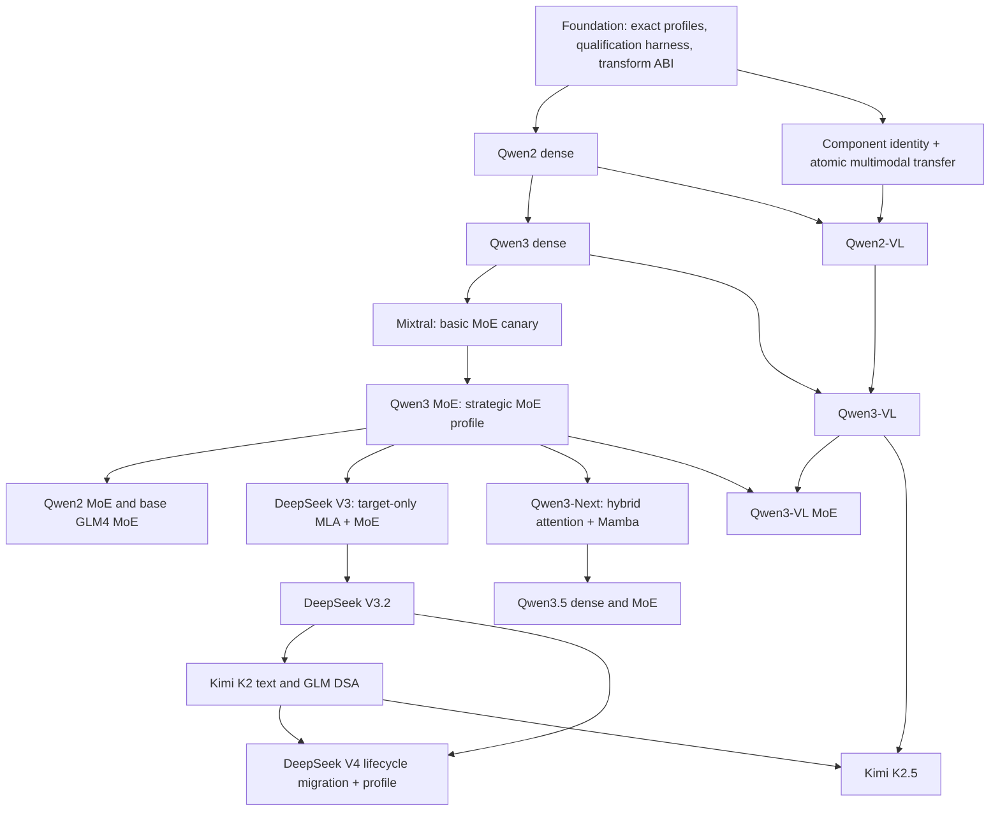

Source URL: https://raw.githubusercontent.com/chienchunhung/TensorRT-LLM/docs-and-plans/docs/design/mx-gms-integration/21-mx-readiness-gaps-and-model-family-plan.md
Title: 21. ModelExpress Readiness Gaps and Model-Family Expansion Plan

<!--
SPDX-FileCopyrightText: Copyright (c) 2026 NVIDIA CORPORATION & AFFILIATES. All rights reserved.
SPDX-License-Identifier: Apache-2.0
-->

# 21. ModelExpress Readiness Gaps and Model-Family Expansion Plan

[< Back to README](README.md)

**Status:** Proposed readiness and delivery plan

**Last Updated:** 2026-07-15

**In-flight implementations assessed:**

- [NVIDIA/TensorRT-LLM#15641](https://github.com/NVIDIA/TensorRT-LLM/pull/15641) at `dabb633dbc` (open and non-draft as
  of 2026-07-15): optional packaging and external-server ModelExpress 0.4.1 integration. The live qualification
  evidence below was collected on earlier PR head `752c05c9af` plus the explicitly recorded local MX/TRT fixes and
  must be rerun on the final PR head.
- [NVIDIA/TensorRT-LLM#16159](https://github.com/NVIDIA/TensorRT-LLM/pull/16159) at `33ee4dd604` (open draft as of
  2026-07-09): ArtifactIdentity and SourceIdentity format v2.
- The five merged staged-hook waves ending in
  [NVIDIA/TensorRT-LLM#15432](https://github.com/NVIDIA/TensorRT-LLM/pull/15432).

**Readiness accounting:** Treat behavior supplied by PRs #15641 and #16159 as pending until each merges. Because both
touch the loading/identity integration, re-run validation on a final head containing both rather than carrying forward
evidence from either isolated PR.

**Companion execution runbook:** [§20 ModelExpress End-to-End Verification Plan](20-mx-e2e-verification-plan.md)

---

## 0. Live Qualification Update (2026-07-15)

The §20 single-node Llama experiment completed on `umb-b300-dp-186` and `umb-b300-dp-184` using B300 GPUs,
TinyLlama-1.1B-Chat-v1.0 BF16, TRT-LLM head `752c05c9af`, an external native ModelExpress/Redis service, and
ModelExpress 0.4.1 with a local canonical-wire-catalog patch. The runtime used the image NIXL stack under
`/opt/nvidia/nvda_nixl` and CUDA-enabled UCX 1.21.0 with `NIXL_UCX_TLS` unset.

| Qualification | Result and retained evidence |
|:--|:--|
| TP=1 baseline, donor, and full receiver | PASS. Donor published 135 canonical tensors; the receiver fetched the same source and produced the exact baseline token IDs. |
| TP=1 no-shards receiver | PASS. The metadata-only receiver tree contained no `.safetensors`, `.bin`, `.pt`, or `.pth` weight files and still produced the exact baseline token IDs. |
| TP=2 donor/rank matching | PASS. Donor ranks 0 and 1 independently published 135 tensors with distinct source/worker IDs. |
| TP=2 full receiver | PASS. Receiver ranks 0 and 1 each resolved a matching worker, completed the MX/NIXL path, and produced the exact TP=2 baseline token IDs. |
| TP=2 no-shards receiver | PASS. Both-rank P2P reception succeeded without checkpoint weight shards and matched the TP=2 baseline. |
| Negative SourceIdentity/parallel mismatch | PASS. A TP=1 receiver did not fetch TP=2 donor metadata or initialize a target NIXL agent; it performed a complete HF disk load and matched the independent TP=1 baseline. |

The retained output hashes were identical within each expected topology:

- TP=1 baseline and mismatch-fallback receiver:
  `24f0cd36473e4b1a53156c26abdcc4a9db78f662aa51fad47373b1c8387a9b8d`.
- TP=2 baseline, donor, full receiver, and no-shards receiver:
  `45841007c85b4496a6388cbf52d433e741ffb8dfb3048ae78b1de1e14241cabc`.

The runs exposed and validated fixes for two integration defects:

1. ModelExpress's TRT-LLM publisher enumerated post-alias paths such as `next_attn` before canonical paths, causing a
   partial 71/135 transfer. A local MX patch now excludes runtime-only alias paths, publishes canonical names, and
   rejects any non-exact source/target catalog before NIXL writes.
2. TRT-LLM serialized the local checkpoint path (`SourceIdentity.model_name`) into MX's exact discovery identity even
   though that descriptor is excluded from compatibility matching. Omitting it from compatibility metadata made the
   no-shards copy path-independent while retaining the normalized outer MX model name.

This is strong isolated-head functional evidence for the bounded Llama BF16 TP=1/TP=2 profile, including no-disk and
parallel-mismatch controls. It is not yet final merge or released-package evidence. Before crediting R1:

- land and release the canonical-catalog behavior in ModelExpress, update the TRT-LLM dependency, and remove the local
  runtime patch;
- replace the test-only 1800-second server lease with publisher heartbeats (or otherwise prove production source
  liveness under the normal 90-second reaper);
- rerun the focused suites and §20 on the final #15641 head, then on the combined #15641/#16159 head with
  ArtifactIdentity controls;
- retain server-outage and mid-transfer failure-injection controls as open MX-R9/MX-R15 evidence.

## 1. Decision Summary

After PRs #15641 and #16159 merge and the combined head passes §20, TensorRT-LLM can make this bounded claim:

> **Content-bound ModelExpress Llama preview:** post-transform MX transfer is functionally qualified for the explicitly
> tested `LlamaForCausalLM` profile, immutable checkpoint artifact, ModelExpress 0.4.1, and the recorded quantization
> and parallel configuration.

That is not yet the same as saying that MX is generally ready for TensorRT-LLM. The current receiver capability gate
contains only `LlamaForCausalLM` with transform protocol version 1. Other root model classes fall back to Hugging Face
loading, even when their nested Linear, Attention, MLA, MoE, or Mamba modules already implement staged hooks.

PR #15641 is the delivery vehicle for the optional standalone MX integration baseline and a prerequisite for the
Llama preview. It packages and operationalizes the merged Wave 5 path; it does not broaden the model-family
qualification boundary.

PR #16159 is the delivery vehicle for the separate ArtifactIdentity follow-up called out by #15641. It closes the
same-config/different-content safety gap for a single checkpoint artifact, but it does not add model families,
component-scoped identities, GMS metadata transport, or a stable transform-layout ABI.

MX does not need to support every TensorRT-LLM model before it can become a supported feature. It does need:

1. An explicit, machine-readable support matrix rather than an architectural resemblance claim.
2. Safe identity for both runtime layout and immutable checkpoint contents.
3. Qualification of representative dense, MoE, MLA/DSA, and hybrid model families.
4. Permanent real-GPU tests, cross-node evidence for the cross-node claim, and visible fallback reasons.
5. A stable ModelExpress client/server API and version policy.

### Readiness levels

| Level | Claim | Minimum exit gate |
|:--|:--|:--|
| R0 - Integration baseline | PR #15641 supplies an optional, safely-falling-back standalone MX path. | The final PR head passes required CI, a production Linux wheel and `[mx]` install, focused loader/identity tests, and base-install dependency checks; unsupported models and mismatches fall back before P2P. |
| R1 - Content-bound Llama preview | MX works for one bounded Llama profile and immutable artifact. | PR #16159 is merged into the tested #15641 integration; §20 passes, including exact token equality, ArtifactIdentity matching/mismatch controls, and a receiver that cannot read weight shards. |
| R2 - Multi-family beta | MX is usable across representative TRT-LLM model categories. | Llama, Qwen dense, one Qwen MoE profile, one DeepSeek/MLA profile, and one GLM or Kimi text profile pass their declared matrices. Artifact and fallback policy are implemented. |
| R3 - Supported MX feature | MX has a maintainable production support contract. | Stable upstream API, content and transform-ABI identity, persistent GPU CI, cross-node qualification, observability, documented SLOs, and an explicit support matrix. |

Speculative decoding, multimodal wrappers, automatic Kubernetes lifecycle, and MX-to-GMS composition should each have
their own feature qualification. They should not be implied by R2 or R3 unless their rows are explicitly enabled.

## 2. Current Implementation Baseline

The following statements describe PRs #15641 and #16159 at the assessed heads and should be refreshed when either
head changes:

- The five staged-hook migration waves are merged. The loader can run `setup_aliases()`, skip
  `transform_weights()`, and run `cache_derived_state()` for a compatible post-transform receiver.
- `ModelLoader._MX_STAGED_RECEIVER_ALLOWLIST` contains only `(LlamaForCausalLM, 1)`.
- The gate uses `isinstance(model, model_type)`. It is class based, not an exact model-profile declaration.
- PR #15641's SourceIdentity covers resolved model configuration, quantization, backend choices, parallel sizes/ranks,
  and the constructed local tensor name/shape/dtype layout.
- PR #16159 proposes SourceIdentity format v2 with a required ArtifactIdentity. It uses an immutable revision for a
  recognized Hugging Face snapshot or a canonical full-content manifest for a local checkpoint.
- ModelExpress is an optional `[mx]` extra pinned to `modelexpress==0.4.1`. The integration still uses a private MX
  identity builder and temporary process-wide environment state.
- A separately loaded draft model is rejected for post-transform MX transfer. The local automatic server path is
  Docker-only and single-node.
- The current unit tests exercise the loader protocol, Llama gate, SourceIdentity, MX metadata, local Docker lifecycle,
  and fallback behavior. They are not a substitute for real donor/receiver qualification of each model family.

The important distinction is **migrated** versus **qualified**. A module can have correctly separated staged hooks and
still be unsafe to enable until the whole root model, every selected backend, and the real transfer path are tested.

### 2.1 What PR #15641 contributes

PR #15641 is an important part of the readiness plan. If it merges at the assessed behavior, it closes the standalone
installation and node-local usability gap while preserving the Wave 5 safety boundary.

| Area | In-flight change in PR #15641 | Readiness effect after merge | Remaining boundary |
|:--|:--|:--|:--|
| Packaging | Adds the optional `tensorrt_llm[mx]` extra with `modelexpress==0.4.1`; MX stays out of base requirements. | Establishes the correct opt-in installation contract for the currently qualified client/server pair. | Keep the exact pin while private MX APIs are used; a public versioned API and compatibility CI are still required before using a range. |
| Configuration | Adds `mx_config.local_server` fields for enablement, port, server image, Redis image, and startup timeout. An explicit `mx_config.server_url` or `MODEL_EXPRESS_URL` takes precedence. | Makes the MX path configurable through normal TRT-LLM APIs without affecting non-MX loads. | The fields remain prototype status and do not define managed-service ownership or authentication. |
| Node-local lifecycle | Creates/reuses a per-port Docker network, Redis container, and MX server; validates image/network/port compatibility and handles creation races. | Closes the single-node standalone-server setup gap for Docker-capable environments. | It is not a Kubernetes, multi-node service-discovery, multi-tenant, or production lifecycle manager. |
| MX 0.4.1 integration | Supports exact-identity source queries, stable model-name resolution, source metadata, and serialized use of process-wide MX environment/identity-builder state. | Makes the released 0.4.1 client/server shape usable from TRT-LLM and preserves SourceIdentity/layout/protocol checks. | It still depends on `_build_trtllm_identity` and temporary process-wide state; this is a pinned compatibility adapter, not a stable public API. |
| Fallback correctness | Falls back to a complete Hugging Face load on local-server failure, source incompatibility, transfer error, or partial post-transform transfer; avoids republishing workers that received MX weights. | Preserves correctness and avoids mixing a partial post-transform source with raw disk tensors. | Operators still need structured result/reason telemetry and a strict mode that makes unexpected fallback fail CI/startup. |
| Model support | Retains `LlamaForCausalLM` protocol v1 and rejects a separately loaded draft model from the staged receive path. | Keeps the existing narrow qualification fail-safe while making it usable as a standalone feature. | Qwen, DeepSeek, GLM, Kimi, target-plus-draft, and multimodal roots remain unqualified. |
| Tests and docs | Adds unit coverage for config, Docker lifecycle/races, source discovery, identity metadata, model-name handoff, fallback, and loader integration, plus a user guide. | Provides the R0 regression-test foundation and documents the intended support scope. | Current-head production Linux wheel validation, focused runtime tests, and the live Llama donor/receiver experiment remain merge/readiness evidence, not unit-test substitutes. |

### 2.2 What PR #16159 contributes

PR #16159 implements the ArtifactIdentity follow-up that #15641 intentionally left separate. If it merges at the
assessed behavior, it closes the base checkpoint-content binding gap for MX and for the backend-neutral identity used
by GMS.

| Area | In-flight change in PR #16159 | Readiness effect after merge | Remaining boundary |
|:--|:--|:--|:--|
| Artifact contract | Adds `ArtifactIdentity(format_version, scheme, digest)` with format version 1 and nests it in required SourceIdentity format v2 metadata. | Makes the immutable artifact part of global compatibility instead of relying on model name, config, shapes, and dtype alone. | Composite target/draft/language/vision/adapter components are not represented independently. |
| Hugging Face snapshots | Derives the digest from a recognized immutable 40- or 64-hex snapshot revision plus repository-relative subpath without rereading model shards. | Preserves a fast identity path and allows an MX receiver to validate a trusted snapshot even when weight shards are unavailable. | The path must retain the canonical `models--.../snapshots/<revision>` structure; arbitrary local copies use the manifest scheme. |
| Local checkpoints | Builds a canonical SHA-256 manifest over relative file paths, sizes, and full file contents while detecting files that change during hashing. | Gives local checkpoints content-bound, path-independent identity. | Every regular checkpoint file is read in full; large-model startup overhead and any future trusted-manifest/cache policy need explicit measurement and design. |
| Loader and policy | Passes checkpoint provenance into SourceIdentity construction. Missing, malformed, unknown-version, incomplete, or mismatched artifact metadata rejects sharing. | MX falls back before P2P; the GMS strict gate fails before materialization. | #16159 does not add real GMS metadata publication/retrieval, committed-layout metadata, or MX/GMS composition. |
| Tests | Adds focused construction, serialization, matching, MX fallback, and strict GMS-gate coverage; the PR reports 43 focused tests. | Provides direct regression coverage for the content-identity safety property. | The full MX/GMS loader suites, a combined #15641 + #16159 Linux wheel, and live donor/receiver validation remain required. |

### 2.3 Post-#15641/#16159 residual work

Read the gap register below as the state **after both PRs merge**:

- **Addressed for a single target checkpoint by #16159:** MX-R3. Component-level artifact identity remains under
  MX-R10 and MX-R11, while local full-manifest hashing cost remains under MX-R13.
- **Partially addressed by #15641:** MX-R5 (correct exact pin, but private API remains), MX-R7 (unit groundwork, but no
  permanent real-GPU gate), MX-R9 (safe fallback and diagnostics, but no structured terminal result/strict mode),
  MX-R12 (local Docker lifecycle only), MX-R15 (full fallback on partial transfer, but no explicit transactional
  commit contract), and MX-R16 (serialized compatibility shim, but no reentrant public client context).
- **Not addressed by either PR:** MX-R1, MX-R2, MX-R4, MX-R6, MX-R8, MX-R10, MX-R11, MX-R13, and MX-R14.
- **Immediate merge/readiness evidence:** resolve/rebase any overlap, build a production Linux wheel from one head
  containing both PRs, run base and `[mx]` installation checks, run the full focused MX/GMS loader and identity suites,
  and complete the updated §20 live Llama donor/receiver and artifact-mismatch controls.

PR #15641 should therefore be credited as the standalone integration baseline, and #16159 as the base ArtifactIdentity
closure. Neither should be counted as a Qwen/DeepSeek/GLM/Kimi qualification PR or as proof of cross-node and
production readiness.

## 3. Readiness Gap Register

| ID | Gap | Priority | Required closure and evidence |
|:--|:--|:--|:--|
| MX-R1 | Post-transform reception is Llama-only. | P0 for R2 | Qualify exact Qwen, DeepSeek, GLM, Kimi, and other priority profiles one at a time; never enable a family only because it looks Llama-like. |
| MX-R2 | The capability gate is too coarse. | P0 | Replace the class-only `isinstance` allowlist with a structured profile keyed by exact root class, architecture/model type, transfer scope, protocol, and feature constraints. Use the same decision for publish and receive. |
| MX-R3 | Checkpoint contents are not identified on landed `main`. | P0 until #16159 merges | PR #16159 adds ArtifactIdentity v1 and SourceIdentity v2, with immutable HF-revision or local full-manifest schemes and fail-closed MX/GMS policy. Merge it, validate it with #15641, and keep component identities tracked under MX-R10/MX-R11. |
| MX-R4 | Transform implementation compatibility is represented only by one global protocol integer. | P0 | Define and version a post-transform layout ABI. Include it in compatibility metadata, document bump rules, and test supported producer/receiver version pairs. |
| MX-R5 | ModelExpress API and package policy are not stable. | P0 for R3 | PR #15641 correctly adds the optional extra and exact 0.4.1 pin. Keep that pin while private APIs are used; add public MX identity/query/publish APIs and compatibility CI before adopting a version range. |
| MX-R6 | Quantization and parallel coverage is not declared per family. | P0 | Publish only combinations with evidence for the claimed dtype, quant algorithm, attention/MoE backend, TP/PP/EP/CP, attention DP, and rank mapping. |
| MX-R7 | There is no permanent real donor/receiver GPU gate per family. | P0 | Build on PRs #15641/#16159's unit coverage by turning the reusable parts of §20 into scheduled or pre-merge GPU jobs. Require exact outputs, artifact/layout identity evidence, transfer evidence, and no-disk receiver proof. |
| MX-R8 | Single-node transfer does not prove cross-node RDMA. | P0 for a cross-node claim | Run a two-node qualification with the production NIC/NIXL path, rank-to-rank mapping, firewall settings, timeout handling, and failure injection. |
| MX-R9 | Disk fallback is safe but too easy to miss operationally. | P0 | Preserve PR #15641's full-disk fallback semantics, then emit a structured load result and reason code, counters, and a startup summary. Add a strict `MX required` mode for CI and deployments that must not fall back. |
| MX-R10 | Separate target-plus-draft transfer is unsupported; one-engine MTP is not broadly qualified. | P1, feature-specific | Track identity/layout per submodel, make multi-component transfer atomic, and qualify each speculative mode separately. Keep it disabled otherwise. |
| MX-R11 | Multimodal transfer scope is undefined. | P1, required for Kimi K2.5/Qwen VL | Define whether MX transfers only the language model or the complete wrapper. Give each component identity and atomic fallback semantics. |
| MX-R12 | Automatic lifecycle is a local Docker convenience, not a managed deployment design. | P1 | Treat PR #15641's Docker/Redis launcher as the standalone path. Document external-service ownership and add Kubernetes/managed readiness, authentication, cleanup, and multi-tenant isolation before claiming managed lifecycle support. |
| MX-R13 | Startup performance and resource SLOs are not qualified. | P1 for R3 | Measure ArtifactIdentity construction (especially local full-manifest hashing), donor load, publication, discovery, transfer, receiver finalize, peak HBM, CPU, storage I/O, and network use against an HF baseline; define p50/p95 targets. |
| MX-R14 | MX-to-GMS composition is not an MX-only readiness gate. | P2/separate track | Qualify MX-seeded GMS only after the native GMS committed-layout contract in §18 exists. Do not block standalone MX family work on it. |
| MX-R15 | Receiver installation is not an explicit transactional contract. | P0 for R2 | Stage and validate the complete tensor set before committing receiver state. On any missing tensor, transfer error, identity change, alias failure, or derived-state failure, discard the staged result and perform one complete disk load. Add failure injection before, during, and after transfer and during `cache_derived_state()`. |
| MX-R16 | The MX 0.4.1 compatibility shim relies on serialized process-global environment and private identity-builder state. | P1 for concurrent or multi-model use | Replace the shim with an explicit per-load public client context. Until then, retain serialization and stress concurrent model/rank loads to prove there is no identity, URL, model-name, or credential cross-talk. |

## 4. Replace the Class Allowlist with Qualification Profiles

The current class gate cannot safely express the model landscape:

- `DeepseekV3ForCausalLM` is registered for multiple architecture/config paths, including DeepSeek V3, DeepSeek V3.2,
  and GLM DSA. Kimi K2 text also resolves through the DeepSeek V3-style path. One class entry would enable variants
  whose hooks and production settings have not all been tested.
- `Qwen3_5ForCausalLM` and `Qwen3_5MoeForCausalLM` subclass `Qwen3NextForCausalLM`. Because the current gate uses
  `isinstance`, enabling Qwen3-Next by base class would also enable both Qwen3.5 wrappers without separate evidence.
- Some model constructors normalize or rewrite config fields. A post-construction `model_type` alone may not preserve
  the original architecture identity needed by the support decision.
- Multimodal wrappers contain independently loaded language and vision submodels. The root class does not identify the
  transfer scope.

Introduce a backend-neutral capability profile with the equivalent of these fields:

```python
@dataclass(frozen=True)
class PostTransformProfile:
    profile_id: str
    root_model_class: type
    architecture: str
    model_type: str
    transfer_scope: str       # target, language_model, or complete_model
    transfer_protocol_version: int
    transform_abi_id: str
    supported_features: frozenset[str]
    excluded_features: frozenset[str]
```

The implementation does not have to use this exact class, but it must preserve these properties:

1. Match exact architecture profiles; do not inherit support through `isinstance` unless each subclass is covered by
   the same qualification record.
2. Evaluate the capability before source publication and before receiver P2P. Unsupported publishers should not
   advertise a usable post-transform profile.
3. Return a structured reason such as `unsupported_architecture`, `unsupported_draft_scope`, or
   `unsupported_protocol`, not only a boolean.
4. Let `SourceIdentity` decide whether two executions of a qualified profile have matching layouts. The capability
   registry says **this kind of model has been audited**; SourceIdentity says **these two concrete runs match**.
5. Generate the user-visible support table from, or validate it against, the registry so documentation cannot drift.

### 4.1 Work that can start immediately

The capability-registry and qualification-harness work can start on the merged Wave 5 baseline. It does not depend on
enabling another family, on a public MX API, or on PR #16159's final wire format. Keep Llama as the only enabled profile
while replacing the mechanism underneath it.

**Implementation status as of 2026-07-09: planned, not started.** The assessed `upstream/main` still uses
`_MX_STAGED_RECEIVER_ALLOWLIST` and its `isinstance` loop. No implementation of `PostTransformProfile`, reusable
family qualification harness, or corresponding open upstream PR was found. The existing tiny-Llama staged-equivalence
test is the seed to extract, not the completed harness.

Use three reviewable changes rather than one cross-cutting PR:

1. **Exact capability registry:** replace `_MX_STAGED_RECEIVER_ALLOWLIST` and its `isinstance` loop with a
   backend-neutral profile registry and structured decision result. Match the exact root type and canonical
   pre-normalization architecture/config identity. Apply the same decision before publication and before receiver
   P2P. Preserve existing Llama behavior and reject unregistered subclasses.
2. **Reusable qualification harness:** parameterize the existing tiny-Llama full-versus-staged equivalence test so a
   family fixture can compare tensor state, aliases, transform guards, derived state, logits/tokens, and expected
   fallback behavior. Add the registry decision tests without adding a second model profile.
3. **Transform-layout ABI:** define the backend-neutral `transform_abi_id`, bump rules, and compatibility decision now.
   Stack the MX metadata serialization and SourceIdentity integration on the final #15641/#16159 combined head to
   avoid parallel edits to the same identity fields. The first ABI value must describe the existing Llama protocol-v1
   layout; introducing it must not silently make old and new publishers compatible.

The first two changes are implementation-ready immediately. The third is design-ready immediately, but its MX wire
integration should be rebased onto the final identity branch. None of these foundation changes should broaden model
support; the first family-enablement PR remains Qwen2 dense.

### 4.2 Migration, qualification, and enablement are different

Do not describe every new model profile as another staged-hook migration:

- **Migration** moves lifecycle logic out of legacy `post_load_weights()` into `setup_aliases()`,
  `transform_weights()`, or `cache_derived_state()`.
- **Qualification** proves that the complete root model already uses those stages correctly for one exact configuration
  and that full loading and staged reception are equivalent.
- **Enablement** adds that proven configuration to the capability registry and public support matrix.

The five merged waves performed most of the shared migration for Linear, Attention, MoE, MLA, Mamba, and related
modules. The Llama-only receiver gate is a conservative qualification boundary; it is not evidence that every other
model requires a rewrite. A family PR should modify model lifecycle code only when its audit finds root-specific or
backend-specific work that the waves did not stage correctly.

After the reusable harness exists, use these expectations instead of assuming several hundred production lines for
every family:

| Work class | Likely examples, subject to audit | Expected production change | Expected tests/docs change | Typical result |
|:--|:--|:--|:--|:--|
| Qualification and enablement only | Qwen2/Qwen3 dense, Mistral, and potentially Mixtral | 0-50 lines | 50-200 lines | Add an exact profile and family fixture; no model-file migration. |
| Qualification with targeted fixes | Qwen MoE, DeepSeek V3/V3.2, Kimi K2 text, GLM, Qwen3-Next/Qwen3.5 | 20-200 lines | 100-400 lines | Correct a missed alias, derived state, mapper, or backend-specific stage, then register the profile. |
| Genuine staged-hook migration | DeepSeek V4 and any audit-discovered legacy root | 200+ lines | 200-600 lines | Move known root lifecycle logic into the proper stages before qualification. |
| New component-transfer protocol | Qwen VL, Kimi K2.5, or separate target-plus-draft transfer | Hundreds or more | Hundreds or more | Define component identity, transactional installation, and atomic fallback; this is not ordinary hook migration. |

These are sizing guides, not commitments. A profile can require substantial GPU and failure-injection evidence while
changing very little production code. Conversely, a small allowlist diff is not sufficient evidence by itself.

Multiple named models may share one qualification profile when an audit proves that they have the same exact root,
canonical configuration semantics, transform ABI, tensor layout, feature constraints, and component scope. Register
that sharing explicitly; do not infer it from `isinstance`, architectural resemblance, or a common marketing family.

## 5. Model-Family Inventory and Recommended Order

This table is based on the code present at the assessed PR head. Re-run the inventory at the start of every family PR.

| Family/profile | Relevant TRT-LLM roots | Current staged-hook state | Main work before enablement | Suggested wave |
|:--|:--|:--|:--|:--|
| Llama | `LlamaForCausalLM` | Allowlisted for protocol v1; model aliases and common transforms are staged. | Finish §20, then cover the exact production quant/TP profile and persistent CI. | Existing baseline |
| Qwen dense | `Qwen2ForCausalLM`, `Qwen3ForCausalLM` | No model-specific legacy post-load override was found; common Attention/Linear/GatedMLP stages are available. | Audit fused QKV/QK norm/RoPE, tied embeddings/lm-head, quant paths, and Qwen3 CP/attention-DP options. Qualify Qwen2 and Qwen3 separately. | A |
| Mistral dense | `MistralForCausalLM` | Uses familiar dense components but is a distinct root class and loader path. | Do not treat Llama qualification as inherited. Run the dense-family procedure and add an exact profile. | Parallel dense |
| Qwen MoE | `Qwen2MoeForCausalLM`, `Qwen3MoeForCausalLM` | MoE modules expose staged transforms; Qwen3 next-layer aliases are in `setup_aliases()`. | After the basic Mixtral canary, qualify Qwen3 MoE as the strategic shared-expert profile; then qualify Qwen2 MoE. Cover process-local MoE finalization, TP/EP, selected MoE backends, and production quantization. | B2 |
| Mixtral | `MixtralForCausalLM` | Uses MoE machinery but is not covered by Qwen MoE evidence. | Use it as the basic MoE canary because it isolates expert layout and TP/EP behavior before Qwen shared-expert and alias complexity. | B1 |
| Qwen hybrid | `Qwen3NextForCausalLM`, `Qwen3_5ForCausalLM`, `Qwen3_5MoeForCausalLM` | Qwen3-Next aliases and Mamba derived-state reconstruction are staged; Qwen3.5 wrappers have distinct config normalization and weight mappers. | Use exact profiles to avoid subclass over-enablement. Verify Mamba caches, dense versus MoE variants, quant normalization, repeated decode, and MTP separately. | D |
| DeepSeek V3/V3.2 | `DeepseekV3ForCausalLM` | Model aliases, MLA, and common MoE stages exist. | After the MoE foundation, qualify a narrow DeepSeek V3 target-only profile, then V3.2. Expand TP/EP/CP, attention DP, production quantization, and MTP as separate rows. | C1 |
| GLM DSA and GLM MoE | `DeepseekV3ForCausalLM` for GLM DSA; `Glm4MoeForCausalLM` for GLM4 MoE | GLM4 aliases and sparse-attention derived-state stages exist, but the roots/loaders differ. | Preserve canonical pre-normalization architecture identity. Qualify a base GLM4 MoE profile after Qwen3 MoE and GLM DSA after DeepSeek V3/V3.2, including custom weight mapping and sparse caches. | B2/C2 |
| Kimi K2 text | DeepSeek V3-style text path | Shares substantial MLA/MoE implementation with DeepSeek, but has a distinct config and artifact. | Add an explicit Kimi text profile after DeepSeek V3/V3.2; verify Kimi router/config/YaRN choices and real Kimi output. Do not inherit support by class alone. | C2 |
| DeepSeek V4 | `DeepseekV4ForCausalLM` | The root still has a legacy `post_load_weights()` structural override. | Move that logic into `setup_aliases()`, audit sparse indexer/engram and MLA/MoE stages, then qualify V4-specific layouts after DeepSeek V3 and sparse DSA evidence. | E |
| Kimi K2.5 multimodal | `KimiK25ForConditionalGeneration` containing `DeepseekV3ForCausalLM` | The outer wrapper is not a qualified MX receiver; text and vision have different loading scopes. | Reuse the qualified Kimi K2 text profile and the component-scoped multimodal contract; test image/video outputs and atomic fallback. | F3 |
| Qwen multimodal | Qwen2/Qwen3/Qwen3.5 VL roots | A text-family pass does not qualify the outer vision-language wrapper. | Define the component-transfer contract first, then qualify Qwen2-VL, Qwen3-VL, and Qwen3-VL MoE in that order. | F1/F2 |

The recommended first expansion is Qwen2 dense, then Qwen3 dense. They broaden coverage without introducing expert
packing, MLA, hybrid state, or multimodal ownership in the first follow-up. Mixtral is the narrow MoE canary; Qwen3
MoE is the strategic MoE profile that unlocks the later Qwen hybrid and MoE-backed multimodal branches.

## 6. Repeatable Model-Family Qualification Procedure

Every family PR should execute the same procedure. The output is one or more exact support profiles, not a family-wide
wildcard.

### Step 1: Freeze the candidate profile

Record:

- Root class, advertised architecture, model type, and checkpoint.
- TRT-LLM and ModelExpress producer/receiver commits or versions.
- Transfer scope: target only, language submodel, or complete model.
- Dtype, quantization, attention backend, MoE backend, and all layout-affecting environment/config flags.
- TP/PP/EP/CP sizes and ranks, attention DP, speculative mode, and whether weights are tied.

**Goal:** Make the claim small enough that a passing test has a precise meaning.

### Step 2: Audit the full post-load lifecycle

Starting from the constructed root, inventory every reachable override of:

- `post_load_weights()`
- `setup_aliases()`
- `transform_weights()`
- `cache_derived_state()`
- `_weights_transformed`

Classify each action as structural aliasing, one-shot tensor transformation, derived-state reconstruction, or
process-local finalization. Include modules selected only by quantization or backend configuration.

**Goal:** Prove that the staged receiver will not miss legacy root logic, rerun an irreversible transform, or skip
required process-local setup.

### Step 3: Complete or correct the staged split

- Move structural references and non-tensor runtime wiring to `setup_aliases()`.
- Put irreversible packing/fusion/requantization in `transform_weights()` with a success-only
  `_weights_transformed` guard.
- Rebuild caches, scale aliases, validation state, and non-persistent derived buffers in `cache_derived_state()`.
- Keep MoE load-balancer, communicator, stream/event, and other process-local finalization in the orchestrator.
- Retain `post_load_weights()` only as a deliberate compatibility shim that invokes the staged methods.

**Goal:** Make full disk load and post-transform receive two explicit, equivalent lifecycles.

### Step 4: Add family-level equivalence tests

Construct two identical small models with deterministic synthetic weights:

1. Run the normal raw-weight plus full-post-load path on the reference.
2. Capture the reference's post-transform parameter layout and values.
3. Bind those post-transform values into the receiver.
4. Run receiver alias setup and derived-state reconstruction without transforms.
5. Compare parameter/buffer names, shapes, dtypes, values, alias object identities, transform guards, derived state,
   and deterministic forward outputs.

Also assert that no `transform_weights()` implementation is called on the receiver.

**Goal:** Catch family-specific lifecycle mistakes before using NIXL or a full checkpoint.

### Step 5: Close identity coverage for the profile

- Mutate one layout-affecting choice at a time and verify `SourceIdentity` rejects it.
- Audit runtime environment variables and defaults that affect transformed layout or structural wiring. Move them into
  resolved/fingerprinted config or exclude the combination.
- Verify producer rank N can match only receiver rank N for the same TP/PP/EP/CP layout.
- With PR #16159 integrated, prove that two checkpoints with the same config but different tensor contents reject.
- Verify an unsupported layout-ABI version rejects before P2P.

**Goal:** Prevent a correct staged implementation from consuming the wrong transformed bytes.

### Step 6: Run the real donor/receiver experiment

Clone §20 for the candidate profile and retain all core gates:

- HF baseline, MX donor, and MX receiver use the same immutable artifact and deterministic prompts.
- Donor and receiver produce exactly the same token IDs as the baseline.
- The receiver cannot read checkpoint weight shards and still succeeds.
- Logs and structured status prove full P2P success and staged reception.
- Identity, unsupported-profile, partial-transfer, and server-failure controls take the expected fallback path.

**Goal:** Prove real publication, transfer, binding, and inference rather than only hook equivalence.

### Step 7: Expand only to the declared configuration matrix

| Category | Minimum beta matrix | Additional rows before claiming them supported |
|:--|:--|:--|
| Dense | BF16/FP16 TP=1 and TP=2; one production quant profile if the family is advertised quantized. | PP, CP, attention DP, each extra quant scheme/backend, tied/untied embeddings. |
| MoE | One production quant/dtype with TP and EP exercised; selected MoE backend; shared experts if present. | Alternate MoE backends, PP, attention DP, expert parallel reshapes, load balancer modes. |
| MLA/DSA | TP plus EP where applicable, the production quant path, and the selected attention backend. | CP/helix, attention DP, sparse indexer layouts, alternate MLA kernels, MTP. |
| Hybrid Mamba/attention | Dense or MoE base profile plus repeated decode that validates reconstructed Mamba state. | Alternate cache dtype, block reuse when supported, MTP, CUDA-graph/address-stability checks. |
| Multimodal | Declared component scope, text and media prompts, and no-disk proof for every transferred component. | Disaggregated serving, multiple media types, language-only mixed loading, complete-wrapper transfer. |

Use pairwise coverage for a large matrix, but never present an untested combination as supported. The registry and docs
should list the actual rows.

### Step 8: Enable, observe, and keep it enabled

- Add the exact profile to the capability registry only after Steps 1-7 pass.
- Add a non-profile negative test next to every positive profile test.
- Add a permanent GPU job using a small fixture and a scheduled representative-checkpoint job.
- Update the public support table, limitations, and fallback reason documentation in the same PR.

**Goal:** Make qualification durable rather than a one-time demo.

## 7. Family-Specific Closure Plans

### 7.1 Qwen

Use three independent qualification waves:

1. **Qwen2 dense and Qwen3 dense.** Audit fused QKV, Q/K normalization, RoPE/YaRN, lm-head or embedding sharing, and
   all selected Linear quant methods. Start with speculative decoding and multimodal wrappers disabled. Add separate
   exact profiles for `Qwen2ForCausalLM` and `Qwen3ForCausalLM`.
2. **Qwen2 MoE and Qwen3 MoE.** Verify expert packing, shared-expert tensors, router weights, next-layer norm aliases,
   process-local MoE finalization, and full-fallback behavior when any expert tensor fails to transfer. Exercise TP and
   EP with the actual production MoE backend and quantization.
3. **Qwen3-Next and Qwen3.5.** Validate Mamba `cache_derived_state()` reconstruction, stable derived-buffer addresses,
   dense versus MoE configs, and the Qwen3.5-specific config normalization and weight mapper. Match exact wrapper
   classes so Qwen3-Next qualification cannot automatically enable Qwen3.5 through inheritance. Add MTP only as a
   later profile.

**Qwen exit gate:** Each advertised root has full-versus-staged equivalence, exact-token GPU E2E, no-disk proof, and a
declared quant/parallel matrix. A text-only pass does not enable Qwen VL.

### 7.2 DeepSeek

For DeepSeek V3/V3.2:

1. Qualify the base target with MTP, CP, and attention DP disabled first.
2. Verify MLA fused projection/scale transforms and derived state with the production dtype/quantization.
3. Verify routed and shared expert packing, MoE backend selection, EP rank mapping, and process-local finalization.
4. Add TP/EP, then CP/attention-DP, then MTP as separate profile rows.
5. Treat DeepSeek V3 and V3.2 as distinct config profiles even though they share a root class.

For DeepSeek V4, first migrate the root's remaining structural `post_load_weights()` logic to `setup_aliases()`. Audit
V4-specific sparse indexer, engram, HC mapping, MLA, and MoE paths before applying any V3 qualification evidence.

**DeepSeek exit gate:** Real representative checkpoints pass the production MLA/MoE/quant/parallel rows, and no
architecture alias becomes enabled merely because it shares `DeepseekV3ForCausalLM`.

### 7.3 GLM

Treat at least two paths independently:

- **GLM DSA through the DeepSeek V3-style root.** Preserve a canonical architecture/profile identifier before config
  normalization. Verify sparse-attention/indexer derived state and ensure identity cannot collapse GLM DSA into a
  superficially similar DeepSeek V3.2 profile.
- **`Glm4MoeForCausalLM`.** Audit its custom weight loader, QK-normalized attention, MoE expert layout, shared heads,
  aliases, and MTP extension. Qualify the target-only profile before MTP.

Other GLM generations remain unsupported until their exact TRT-LLM root and checkpoint mapper complete the same
procedure.

**GLM exit gate:** Each enabled GLM architecture has a canonical identity, an exact capability profile, sparse/MoE
state equivalence, and real checkpoint E2E evidence.

### 7.4 Kimi

Split Kimi into text and multimodal milestones:

1. **Kimi K2 text.** Qualify it as its own DeepSeek-style config profile. Reuse DeepSeek hook tests, but add Kimi's
   checkpoint, router/config/YaRN choices, ArtifactIdentity, and exact inference outputs. Do not enable it automatically
   when DeepSeek V3 is enabled.
2. **Kimi K2.5 multimodal.** Define a component manifest for the outer wrapper. The first implementation must state
   whether it transfers only `language_model` or both the MoonViT vision encoder and language model. Give every
   transferred component SourceIdentity, ArtifactIdentity, layout ABI, and an all-or-fallback completion rule.
3. For language-only transfer, explicitly prove that the vision component is loaded by the documented non-MX path and
   cannot be confused with P2P success. For full-model transfer, block all component shards on the receiver and prove
   successful image/video inference.

**Kimi exit gate:** Text K2 has an explicit profile and real E2E evidence. K2.5 is advertised only after component
scope, atomicity, and multimodal output tests are complete.

## 8. ArtifactIdentity in PR #16159

PR #16159 keeps ArtifactIdentity separate from model-family enablement, as recommended. SourceIdentity proves runtime
layout compatibility; the nested ArtifactIdentity proves that source and receiver selected the same immutable
checkpoint artifact.

### Implemented contract

```python
@dataclass(frozen=True)
class ArtifactIdentity:
    format_version: int
    scheme: str
    digest: str
```

PR #16159 defines ArtifactIdentity format version 1 and two schemes:

- **`hf_snapshot_revision`:** hashes a recognized immutable 40- or 64-hex Hugging Face snapshot revision and its
  repository-relative subpath. It does not reread the model shards.
- **`checkpoint_manifest_sha256`:** walks a local checkpoint, hashes each retained regular file in full, and hashes the
  canonical ordered manifest of relative path, size, and SHA-256. Absolute paths are excluded, and a file changing
  during hashing is rejected.

SourceIdentity format version 2 requires this value, includes it in global matching and serialization, and rejects
unknown or old identity formats rather than silently accepting content with unknown provenance.

### What #16159 closes

1. Same-config/same-shape checkpoints with different immutable revisions or local content no longer match.
2. MX rejects missing, malformed, incomplete, unknown-version, or mismatched artifact metadata and falls back before
   transfer.
3. The GMS strict gate rejects the same conditions before materialization.
4. A trusted canonical Hugging Face snapshot receiver can validate identity without opening checkpoint weight shards.
5. Focused tests cover construction, serialization, matching, MX fallback, and strict GMS behavior.

### Remaining work after #16159

1. **Combined integration:** #16159 and #15641 are independent in-flight branches that overlap loader/identity tests.
   Rebase or merge them into one test head and run the complete loader suites plus §20 before crediting the closure.
2. **Local-checkpoint cost:** the manifest scheme reads every retained file in full. Measure this on representative
   checkpoints and decide whether a signed/trusted precomputed manifest or safe cache is needed without weakening
   content binding.
3. **Composite artifacts:** one ArtifactIdentity covers the checkpoint path passed to ModelLoader. Target, draft,
   language, vision, and adapter components still need an ordered component identity and atomic transfer contract.
4. **GMS transport:** #16159 updates the backend-neutral identity and strict gate, but intentionally does not add GMS
   metadata publication/retrieval or committed-layout metadata.
5. **Transform ABI:** ArtifactIdentity identifies input content, not the TRT-LLM transform implementation that produced
   the published runtime layout. MX-R4 remains open.
6. **Compatibility:** SourceIdentity v1 publishers are intentionally incompatible with required v2 consumers. Verify
   that mixed-version MX deployments return an explicit fallback reason and document the upgrade order.

### Required combined evidence

- Build and install a production Linux wheel from a head containing both PRs.
- Run the full focused MX/GMS loader, SourceIdentity, and ArtifactIdentity suites.
- Run §20 with a canonical HF snapshot for the no-shards receiver gate.
- Run an artifact-mismatch control that rejects before P2P and then completes the expected disk fallback.
- Record ArtifactIdentity scheme/digest and SourceIdentity format version in the evidence bundle.

## 9. ModelExpress Package and API Policy

The optional extra and exact pin are the right policy for PR #15641. The feature is not universal, and the current
integration is qualified against one client/server release and private API shape.

Keep `modelexpress==0.4.1` until all of these are true:

1. MX exports public APIs for identity construction, exact source query, publication metadata, and transfer result.
2. URL, model name, timeout, and metadata are explicit arguments rather than temporary process-global environment
   mutations.
3. Client and server expose a capability/API version that TRT-LLM can check before transfer.
4. TRT-LLM CI tests every client/server pair admitted by the proposed dependency range.
5. MX publishes a compatibility and deprecation policy.

Only then should the exact pin become a bounded compatible range. A broad lower bound is not appropriate while
TRT-LLM depends on `_build_trtllm_identity` or another private symbol.

## 10. Observability and Failure Policy

Every load should expose one terminal result:

```text
source=mx_p2p | hf_disk
result=success | fallback | required_failure
reason=source_missing | unsupported_profile | identity_mismatch |
       artifact_mismatch | protocol_mismatch | partial_transfer |
       local_server_failure | transfer_error | none
profile=<canonical profile id>
source_instance=<sanitized instance id>
bytes=<transferred bytes>
duration_ms=<transfer duration>
```

Requirements:

- Emit the result once per rank and one aggregated startup summary per model instance.
- Export counters and latency histograms without checkpoint secrets or credentials.
- Add `best_effort` and `required` policies. `best_effort` preserves disk fallback; `required` fails startup if MX is not
  used and is mandatory for positive E2E/CI tests.
- Treat a partial transfer as full fallback unless an atomic mixed-layout protocol is explicitly designed and tested.
- Include the reason in support bundles so operators can distinguish an unavailable source from an unqualified model.

## 11. Recommended PR Sequence

Introduce one new lifecycle dimension at a time. An arrow means that the downstream profile should reuse the upstream
contract and evidence; it does not mean that every optional feature of the upstream family must already be enabled.



Mistral dense can be qualified in parallel after the foundation; it is useful additional dense coverage but does not
unlock one of the complex branches above. The multimodal contract can also be designed in parallel, while its first
concrete receiver waits for the corresponding text profile.

Suggested PR stack:

1. **Foundation A - capability registry:** exact matching, canonical profile identity, symmetric publish/receive gating,
   and structured reason codes. Preserve Llama as the only enabled profile.
2. **Foundation B - qualification harness:** parameterize the full-versus-staged Llama test and add reusable state,
   output, no-disk, negative-control, and fallback assertions. Still enable no new family.
3. **Foundation C - transform ABI:** define bump rules and compatibility tests, then wire the ABI metadata on the final
   #15641/#16159 identity head. Complete the combined §8 and §20 evidence.
4. **Dense PRs:** Qwen2, then Qwen3. Mistral may run in parallel as an independent exact profile.
5. **MoE PRs:** Mixtral canary, then Qwen3 MoE, followed by Qwen2 MoE and a base GLM4 MoE profile. Expand EP,
   quantization, and alternate MoE backends as separate profile rows.
6. **MLA PRs:** narrow DeepSeek V3 target-only profile, then V3.2, followed by separate Kimi K2 text and GLM DSA
   profiles. Add CP, attention DP, production quantization, and MTP independently.
7. **Hybrid PRs:** Qwen3-Next, then exact Qwen3.5 dense and MoE profiles. Do not inherit support through subclasses.
8. **DeepSeek V4 PRs:** migrate the remaining root lifecycle and qualify V4 only after MLA/MoE and sparse-DSA evidence.
9. **Multimodal PRs:** component identity and transactional transfer first; then Qwen2-VL, Qwen3-VL, Qwen3-VL MoE,
   and Kimi K2.5 after their corresponding text profiles.
10. **Production-readiness PRs:** public MX API, structured results/strict mode, transactional failure injection,
    persistent GPU gates, scheduled representative checkpoints, concurrent-load stress, and two-node RDMA coverage.

Family PRs may proceed while the public MX API, ArtifactIdentity integration, and production validation are being
developed, but a supported R3 claim depends on all tracks. For every family, begin with one canonical dtype, TP1/TP2,
the default backend, target-only loading, and no MTP/speculative mode. Expand quantization, EP/PP/CP, alternate
backends, and speculative modes as explicit follow-up profiles rather than making a family-wide claim.

## 12. Definition of Done

### Content-bound Llama-only preview

- [ ] PR #15641 is merged with passing required CI.
- [ ] PR #16159 is merged with passing required CI and its SourceIdentity v2 contract is present in the tested wheel.
- [ ] §20 passes on an exact commit containing both PRs.
- [ ] The supported Llama checkpoint, quantization, backend, and parallel profile are published.
- [ ] Exact token equality, matching ArtifactIdentity, canonical-snapshot no-disk receiver proof, artifact mismatch, and
  negative fallback controls are archived.
- [ ] Documentation says `LlamaForCausalLM` preview, not generic Llama-style or all-model support.

### Multi-family beta

- [ ] Structured exact capability profiles replace class-only inheritance.
- [ ] ArtifactIdentity rejects same-config/different-content sources.
- [ ] Llama, Qwen dense, one Qwen MoE profile, one DeepSeek/MLA profile, and one GLM or Kimi text profile pass.
- [ ] Every enabled profile has full-versus-staged unit tests and real GPU no-disk E2E evidence.
- [ ] Receiver installation is transactional: unsupported families, protocols, artifacts, draft scopes, partial
  transfers, alias failures, and derived-state failures discard staged state and complete one full fallback load.
- [ ] Structured result/reason reporting makes every fallback visible.

### Supported MX feature

- [ ] The client/server API is public and versioned; dependency ranges are backed by compatibility CI.
- [ ] SourceIdentity includes content identity and a versioned transform-layout ABI.
- [ ] The public support matrix lists exact profiles and is kept consistent with the runtime registry.
- [ ] Single-node and two-node RDMA qualification pass on supported GPU/NIC environments.
- [ ] Permanent GPU CI protects at least one profile from each advertised model category.
- [ ] Concurrent model/rank load stress proves that per-load MX identity, endpoint, model name, and credentials cannot
  cross-talk.
- [ ] Startup performance, peak-resource, timeout, retry, and cleanup SLOs are measured and documented.
- [ ] Multimodal, speculative, managed lifecycle, and MX+GMS claims remain explicitly off unless separately qualified.

## 13. Per-Profile Evidence Record

Store this record with every qualification result:

```text
profile_id:
root_class:
architecture/model_type:
transfer_scope:
trtllm_producer_sha:
trtllm_receiver_sha:
modelexpress_client/server:
transform_layout_abi:
artifact_identity_format/scheme/digest:
checkpoint:
dtype/quantization:
attention/moe_backend:
tp/pp/ep/cp/attention_dp:
speculative_mode:
hardware/topology:
unit_equivalence:
single_node_e2e:
cross_node_e2e:
exact_output_result:
no_disk_receiver_result:
negative_controls:
performance_summary:
evidence_location:
known_exclusions:
```

A profile is supported only when this record is complete for every row claimed in the support matrix.

## 14. References

- [§16 Staged Post-Load Hooks](16-staged-post-load-hooks.md)
- [§18 GMS Integration Gaps and Concrete PR Plan](18-gms-integration-gaps-and-concrete-pr-plan.md)
- [§20 ModelExpress End-to-End Verification Plan](20-mx-e2e-verification-plan.md)
- [NVIDIA/TensorRT-LLM#15014 - Wave 1](https://github.com/NVIDIA/TensorRT-LLM/pull/15014)
- [NVIDIA/TensorRT-LLM#15288 - Wave 2](https://github.com/NVIDIA/TensorRT-LLM/pull/15288)
- [NVIDIA/TensorRT-LLM#15386 - Wave 3](https://github.com/NVIDIA/TensorRT-LLM/pull/15386)
- [NVIDIA/TensorRT-LLM#15387 - Wave 4](https://github.com/NVIDIA/TensorRT-LLM/pull/15387)
- [NVIDIA/TensorRT-LLM#15432 - Wave 5](https://github.com/NVIDIA/TensorRT-LLM/pull/15432)
- [NVIDIA/TensorRT-LLM#15641 - Optional standalone MX integration](https://github.com/NVIDIA/TensorRT-LLM/pull/15641)
- [NVIDIA/TensorRT-LLM#16159 - ArtifactIdentity and SourceIdentity v2](https://github.com/NVIDIA/TensorRT-LLM/pull/16159)
