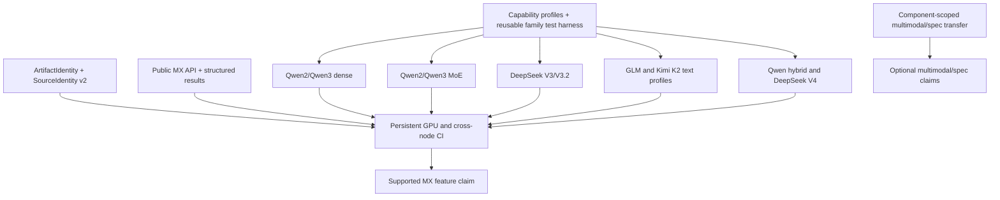

<!--
SPDX-FileCopyrightText: Copyright (c) 2026 NVIDIA CORPORATION & AFFILIATES. All rights reserved.
SPDX-License-Identifier: Apache-2.0
-->

# 21. ModelExpress Readiness Gaps and Model-Family Expansion Plan

[< Back to README](README.md)

**Status:** Proposed readiness and delivery plan

**Last Updated:** 2026-07-09

**Implementation assessed:**
[NVIDIA/TensorRT-LLM#15641](https://github.com/NVIDIA/TensorRT-LLM/pull/15641) at `fc23344fe9`, plus the five merged
staged-hook waves ending in [NVIDIA/TensorRT-LLM#15432](https://github.com/NVIDIA/TensorRT-LLM/pull/15432)

**Companion execution runbook:** [§20 ModelExpress End-to-End Verification Plan](20-mx-e2e-verification-plan.md)

---

## 1. Decision Summary

After PR #15641 and a passing §20 experiment, TensorRT-LLM can make this bounded claim:

> **ModelExpress Llama preview:** post-transform MX transfer is functionally qualified for the explicitly tested
> `LlamaForCausalLM` profile, ModelExpress 0.4.1, and the recorded quantization and parallel configuration.

That is not yet the same as saying that MX is generally ready for TensorRT-LLM. The current receiver capability gate
contains only `LlamaForCausalLM` with transform protocol version 1. Other root model classes fall back to Hugging Face
loading, even when their nested Linear, Attention, MLA, MoE, or Mamba modules already implement staged hooks.

MX does not need to support every TensorRT-LLM model before it can become a supported feature. It does need:

1. An explicit, machine-readable support matrix rather than an architectural resemblance claim.
2. Safe identity for both runtime layout and immutable checkpoint contents.
3. Qualification of representative dense, MoE, MLA/DSA, and hybrid model families.
4. Permanent real-GPU tests, cross-node evidence for the cross-node claim, and visible fallback reasons.
5. A stable ModelExpress client/server API and version policy.

### Readiness levels

| Level | Claim | Minimum exit gate |
|:--|:--|:--|
| R0 - Review ready | PR #15641 is coherent and safe to review. | Unit/CI checks pass; unsupported models and mismatches fall back before P2P; limitations are documented. |
| R1 - Llama preview | MX works for one bounded Llama profile. | §20 passes, including exact token equality and a receiver that cannot read weight shards. |
| R2 - Multi-family beta | MX is usable across representative TRT-LLM model categories. | Llama, Qwen dense, one Qwen MoE profile, one DeepSeek/MLA profile, and one GLM or Kimi text profile pass their declared matrices. Artifact and fallback policy are implemented. |
| R3 - Supported MX feature | MX has a maintainable production support contract. | Stable upstream API, content and transform-ABI identity, persistent GPU CI, cross-node qualification, observability, documented SLOs, and an explicit support matrix. |

Speculative decoding, multimodal wrappers, automatic Kubernetes lifecycle, and MX-to-GMS composition should each have
their own feature qualification. They should not be implied by R2 or R3 unless their rows are explicitly enabled.

## 2. Current Implementation Baseline

The following statements describe PR #15641 at the assessed head and should be refreshed when its head changes:

- The five staged-hook migration waves are merged. The loader can run `setup_aliases()`, skip
  `transform_weights()`, and run `cache_derived_state()` for a compatible post-transform receiver.
- `ModelLoader._MX_STAGED_RECEIVER_ALLOWLIST` contains only `(LlamaForCausalLM, 1)`.
- The gate uses `isinstance(model, model_type)`. It is class based, not an exact model-profile declaration.
- `SourceIdentity` covers resolved model configuration, quantization, backend choices, parallel sizes/ranks, and the
  constructed local tensor name/shape/dtype layout.
- `SourceIdentity` does not prove that two same-config checkpoints contain the same bytes or resolved revision.
- ModelExpress is an optional `[mx]` extra pinned to `modelexpress==0.4.1`. The integration still uses a private MX
  identity builder and temporary process-wide environment state.
- A separately loaded draft model is rejected for post-transform MX transfer. The local automatic server path is
  Docker-only and single-node.
- The current unit tests exercise the loader protocol, Llama gate, SourceIdentity, MX metadata, local Docker lifecycle,
  and fallback behavior. They are not a substitute for real donor/receiver qualification of each model family.

The important distinction is **migrated** versus **qualified**. A module can have correctly separated staged hooks and
still be unsafe to enable until the whole root model, every selected backend, and the real transfer path are tested.

## 3. Readiness Gap Register

| ID | Gap | Priority | Required closure and evidence |
|:--|:--|:--|:--|
| MX-R1 | Post-transform reception is Llama-only. | P0 for R2 | Qualify exact Qwen, DeepSeek, GLM, Kimi, and other priority profiles one at a time; never enable a family only because it looks Llama-like. |
| MX-R2 | The capability gate is too coarse. | P0 | Replace the class-only `isinstance` allowlist with a structured profile keyed by exact root class, architecture/model type, transfer scope, protocol, and feature constraints. Use the same decision for publish and receive. |
| MX-R3 | Checkpoint contents are not identified. | P0 for content-safe use | Add `ArtifactIdentity`, bind it into SourceIdentity v2 and MX discovery metadata, and reject same-config/different-revision sources before P2P. |
| MX-R4 | Transform implementation compatibility is represented only by one global protocol integer. | P0 | Define and version a post-transform layout ABI. Include it in compatibility metadata, document bump rules, and test supported producer/receiver version pairs. |
| MX-R5 | ModelExpress API and package policy are not stable. | P0 for R3 | Keep the exact 0.4.1 pin while private APIs are used. Add public MX identity/query/publish APIs and compatibility CI before adopting a version range. |
| MX-R6 | Quantization and parallel coverage is not declared per family. | P0 | Publish only combinations with evidence for the claimed dtype, quant algorithm, attention/MoE backend, TP/PP/EP/CP, attention DP, and rank mapping. |
| MX-R7 | There is no permanent real donor/receiver GPU gate per family. | P0 | Turn the reusable parts of §20 into scheduled or pre-merge GPU jobs. Require exact outputs, transfer evidence, and no-disk receiver proof. |
| MX-R8 | Single-node transfer does not prove cross-node RDMA. | P0 for a cross-node claim | Run a two-node qualification with the production NIC/NIXL path, rank-to-rank mapping, firewall settings, timeout handling, and failure injection. |
| MX-R9 | Disk fallback is safe but too easy to miss operationally. | P0 | Emit a structured load result and reason code, counters, and a startup summary. Add a strict `MX required` mode for CI and deployments that must not fall back. |
| MX-R10 | Separate target-plus-draft transfer is unsupported; one-engine MTP is not broadly qualified. | P1, feature-specific | Track identity/layout per submodel, make multi-component transfer atomic, and qualify each speculative mode separately. Keep it disabled otherwise. |
| MX-R11 | Multimodal transfer scope is undefined. | P1, required for Kimi K2.5/Qwen VL | Define whether MX transfers only the language model or the complete wrapper. Give each component identity and atomic fallback semantics. |
| MX-R12 | Automatic lifecycle is a local Docker convenience, not a managed deployment design. | P1 | Document external-service ownership and add Kubernetes/managed readiness, authentication, cleanup, and multi-tenant isolation before claiming managed lifecycle support. |
| MX-R13 | Startup performance and resource SLOs are not qualified. | P1 for R3 | Measure donor load, publication, discovery, transfer, receiver finalize, peak HBM, CPU, and network use against an HF baseline; define p50/p95 targets. |
| MX-R14 | MX-to-GMS composition is not an MX-only readiness gate. | P2/separate track | Qualify MX-seeded GMS only after the native GMS committed-layout contract in §18 exists. Do not block standalone MX family work on it. |

## 4. Replace the Class Allowlist with Qualification Profiles

The current class gate cannot safely express the model landscape:

- `DeepseekV3ForCausalLM` is registered for multiple architecture/config paths, including DeepSeek V3, DeepSeek V3.2,
  and GLM DSA. Kimi K2 text also resolves through the DeepSeek V3-style path. One class entry would enable variants
  whose hooks and production settings have not all been tested.
- `Qwen3_5ForCausalLM` and `Qwen3_5MoeForCausalLM` subclass `Qwen3NextForCausalLM`. Because the current gate uses
  `isinstance`, enabling Qwen3-Next by base class would also enable both Qwen3.5 wrappers without separate evidence.
- Some model constructors normalize or rewrite config fields. A post-construction `model_type` alone may not preserve
  the original architecture identity needed by the support decision.
- Multimodal wrappers contain independently loaded language and vision submodels. The root class does not identify the
  transfer scope.

Introduce a backend-neutral capability profile with the equivalent of these fields:

```python
@dataclass(frozen=True)
class PostTransformProfile:
    root_model_class: type
    architecture: str
    model_type: str
    transfer_scope: str       # target, language_model, or complete_model
    protocol_version: int
    supported_features: frozenset[str]
    excluded_features: frozenset[str]
```

The implementation does not have to use this exact class, but it must preserve these properties:

1. Match exact architecture profiles; do not inherit support through `isinstance` unless each subclass is covered by
   the same qualification record.
2. Evaluate the capability before source publication and before receiver P2P. Unsupported publishers should not
   advertise a usable post-transform profile.
3. Return a structured reason such as `unsupported_architecture`, `unsupported_draft_scope`, or
   `unsupported_protocol`, not only a boolean.
4. Let `SourceIdentity` decide whether two executions of a qualified profile have matching layouts. The capability
   registry says **this kind of model has been audited**; SourceIdentity says **these two concrete runs match**.
5. Generate the user-visible support table from, or validate it against, the registry so documentation cannot drift.

## 5. Model-Family Inventory and Recommended Order

This table is based on the code present at the assessed PR head. Re-run the inventory at the start of every family PR.

| Family/profile | Relevant TRT-LLM roots | Current staged-hook state | Main work before enablement | Suggested wave |
|:--|:--|:--|:--|:--|
| Llama | `LlamaForCausalLM` | Allowlisted for protocol v1; model aliases and common transforms are staged. | Finish §20, then cover the exact production quant/TP profile and persistent CI. | Existing baseline |
| Qwen dense | `Qwen2ForCausalLM`, `Qwen3ForCausalLM` | No model-specific legacy post-load override was found; common Attention/Linear/GatedMLP stages are available. | Audit fused QKV/QK norm/RoPE, tied embeddings/lm-head, quant paths, and Qwen3 CP/attention-DP options. Qualify Qwen2 and Qwen3 separately. | A |
| Mistral dense | `MistralForCausalLM` | Uses familiar dense components but is a distinct root class and loader path. | Do not treat Llama qualification as inherited. Run the dense-family procedure and add an exact profile. | A or B |
| Qwen MoE | `Qwen2MoeForCausalLM`, `Qwen3MoeForCausalLM` | MoE modules expose staged transforms; Qwen3 next-layer aliases are in `setup_aliases()`. | Qualify expert packing, shared experts, process-local MoE finalization, TP/EP, selected MoE backends, and production quantization. | B |
| Mixtral | `MixtralForCausalLM` | Uses MoE machinery but is not covered by Qwen MoE evidence. | Run a separate expert-layout and TP/EP qualification profile. | B |
| Qwen hybrid | `Qwen3NextForCausalLM`, `Qwen3_5ForCausalLM`, `Qwen3_5MoeForCausalLM` | Qwen3-Next aliases and Mamba derived-state reconstruction are staged; Qwen3.5 wrappers have distinct config normalization and weight mappers. | Use exact profiles to avoid subclass over-enablement. Verify Mamba caches, dense versus MoE variants, quant normalization, repeated decode, and MTP separately. | C |
| DeepSeek V3/V3.2 | `DeepseekV3ForCausalLM` | Model aliases, MLA, and common MoE stages exist. | Qualify each model type/config profile, MLA transforms, expert layouts, shared experts, TP/EP/CP, attention DP, production quantization, and MTP as a later profile. | C |
| GLM DSA and GLM MoE | `DeepseekV3ForCausalLM` for GLM DSA; `Glm4MoeForCausalLM` for GLM4 MoE | GLM4 aliases and sparse-attention derived-state stages exist, but the roots/loaders differ. | Preserve canonical pre-normalization architecture identity. Qualify DSA and GLM4 MoE separately, including custom weight mapping and sparse caches. | C |
| Kimi K2 text | DeepSeek V3-style text path | Shares substantial MLA/MoE implementation with DeepSeek, but has a distinct config and artifact. | Add an explicit Kimi text profile after DeepSeek V3; verify Kimi router/config/YaRN choices and real Kimi output. Do not inherit support by class alone. | C |
| DeepSeek V4 | `DeepseekV4ForCausalLM` | The root still has a legacy `post_load_weights()` structural override. | Move that logic into `setup_aliases()`, audit sparse indexer/engram and MLA/MoE stages, then qualify V4-specific layouts. | D |
| Kimi K2.5 multimodal | `KimiK25ForConditionalGeneration` containing `DeepseekV3ForCausalLM` | The outer wrapper is not a qualified MX receiver; text and vision have different loading scopes. | Implement component-scoped identity/transfer, decide language-only versus full-model support, and test image/video outputs and atomic fallback. | D |
| Qwen multimodal | Qwen2/Qwen3/Qwen3.5 VL roots | A text-family pass does not qualify the outer vision-language wrapper. | Reuse the component-transfer contract from Kimi K2.5 and qualify each advertised wrapper separately. | D |

The recommended first expansion is Qwen2 dense, then Qwen3 dense. They broaden coverage without introducing expert
packing, MLA, hybrid state, or multimodal ownership in the first follow-up.

## 6. Repeatable Model-Family Qualification Procedure

Every family PR should execute the same procedure. The output is one or more exact support profiles, not a family-wide
wildcard.

### Step 1: Freeze the candidate profile

Record:

- Root class, advertised architecture, model type, and checkpoint.
- TRT-LLM and ModelExpress producer/receiver commits or versions.
- Transfer scope: target only, language submodel, or complete model.
- Dtype, quantization, attention backend, MoE backend, and all layout-affecting environment/config flags.
- TP/PP/EP/CP sizes and ranks, attention DP, speculative mode, and whether weights are tied.

**Goal:** Make the claim small enough that a passing test has a precise meaning.

### Step 2: Audit the full post-load lifecycle

Starting from the constructed root, inventory every reachable override of:

- `post_load_weights()`
- `setup_aliases()`
- `transform_weights()`
- `cache_derived_state()`
- `_weights_transformed`

Classify each action as structural aliasing, one-shot tensor transformation, derived-state reconstruction, or
process-local finalization. Include modules selected only by quantization or backend configuration.

**Goal:** Prove that the staged receiver will not miss legacy root logic, rerun an irreversible transform, or skip
required process-local setup.

### Step 3: Complete or correct the staged split

- Move structural references and non-tensor runtime wiring to `setup_aliases()`.
- Put irreversible packing/fusion/requantization in `transform_weights()` with a success-only
  `_weights_transformed` guard.
- Rebuild caches, scale aliases, validation state, and non-persistent derived buffers in `cache_derived_state()`.
- Keep MoE load-balancer, communicator, stream/event, and other process-local finalization in the orchestrator.
- Retain `post_load_weights()` only as a deliberate compatibility shim that invokes the staged methods.

**Goal:** Make full disk load and post-transform receive two explicit, equivalent lifecycles.

### Step 4: Add family-level equivalence tests

Construct two identical small models with deterministic synthetic weights:

1. Run the normal raw-weight plus full-post-load path on the reference.
2. Capture the reference's post-transform parameter layout and values.
3. Bind those post-transform values into the receiver.
4. Run receiver alias setup and derived-state reconstruction without transforms.
5. Compare parameter/buffer names, shapes, dtypes, values, alias object identities, transform guards, derived state,
   and deterministic forward outputs.

Also assert that no `transform_weights()` implementation is called on the receiver.

**Goal:** Catch family-specific lifecycle mistakes before using NIXL or a full checkpoint.

### Step 5: Close identity coverage for the profile

- Mutate one layout-affecting choice at a time and verify `SourceIdentity` rejects it.
- Audit runtime environment variables and defaults that affect transformed layout or structural wiring. Move them into
  resolved/fingerprinted config or exclude the combination.
- Verify producer rank N can match only receiver rank N for the same TP/PP/EP/CP layout.
- After ArtifactIdentity lands, prove that two checkpoints with the same config but different tensor contents reject.
- Verify an unsupported layout-ABI version rejects before P2P.

**Goal:** Prevent a correct staged implementation from consuming the wrong transformed bytes.

### Step 6: Run the real donor/receiver experiment

Clone §20 for the candidate profile and retain all core gates:

- HF baseline, MX donor, and MX receiver use the same immutable artifact and deterministic prompts.
- Donor and receiver produce exactly the same token IDs as the baseline.
- The receiver cannot read checkpoint weight shards and still succeeds.
- Logs and structured status prove full P2P success and staged reception.
- Identity, unsupported-profile, partial-transfer, and server-failure controls take the expected fallback path.

**Goal:** Prove real publication, transfer, binding, and inference rather than only hook equivalence.

### Step 7: Expand only to the declared configuration matrix

| Category | Minimum beta matrix | Additional rows before claiming them supported |
|:--|:--|:--|
| Dense | BF16/FP16 TP=1 and TP=2; one production quant profile if the family is advertised quantized. | PP, CP, attention DP, each extra quant scheme/backend, tied/untied embeddings. |
| MoE | One production quant/dtype with TP and EP exercised; selected MoE backend; shared experts if present. | Alternate MoE backends, PP, attention DP, expert parallel reshapes, load balancer modes. |
| MLA/DSA | TP plus EP where applicable, the production quant path, and the selected attention backend. | CP/helix, attention DP, sparse indexer layouts, alternate MLA kernels, MTP. |
| Hybrid Mamba/attention | Dense or MoE base profile plus repeated decode that validates reconstructed Mamba state. | Alternate cache dtype, block reuse when supported, MTP, CUDA-graph/address-stability checks. |
| Multimodal | Declared component scope, text and media prompts, and no-disk proof for every transferred component. | Disaggregated serving, multiple media types, language-only mixed loading, complete-wrapper transfer. |

Use pairwise coverage for a large matrix, but never present an untested combination as supported. The registry and docs
should list the actual rows.

### Step 8: Enable, observe, and keep it enabled

- Add the exact profile to the capability registry only after Steps 1-7 pass.
- Add a non-profile negative test next to every positive profile test.
- Add a permanent GPU job using a small fixture and a scheduled representative-checkpoint job.
- Update the public support table, limitations, and fallback reason documentation in the same PR.

**Goal:** Make qualification durable rather than a one-time demo.

## 7. Family-Specific Closure Plans

### 7.1 Qwen

Use three independent qualification waves:

1. **Qwen2 dense and Qwen3 dense.** Audit fused QKV, Q/K normalization, RoPE/YaRN, lm-head or embedding sharing, and
   all selected Linear quant methods. Start with speculative decoding and multimodal wrappers disabled. Add separate
   exact profiles for `Qwen2ForCausalLM` and `Qwen3ForCausalLM`.
2. **Qwen2 MoE and Qwen3 MoE.** Verify expert packing, shared-expert tensors, router weights, next-layer norm aliases,
   process-local MoE finalization, and full-fallback behavior when any expert tensor fails to transfer. Exercise TP and
   EP with the actual production MoE backend and quantization.
3. **Qwen3-Next and Qwen3.5.** Validate Mamba `cache_derived_state()` reconstruction, stable derived-buffer addresses,
   dense versus MoE configs, and the Qwen3.5-specific config normalization and weight mapper. Match exact wrapper
   classes so Qwen3-Next qualification cannot automatically enable Qwen3.5 through inheritance. Add MTP only as a
   later profile.

**Qwen exit gate:** Each advertised root has full-versus-staged equivalence, exact-token GPU E2E, no-disk proof, and a
declared quant/parallel matrix. A text-only pass does not enable Qwen VL.

### 7.2 DeepSeek

For DeepSeek V3/V3.2:

1. Qualify the base target with MTP, CP, and attention DP disabled first.
2. Verify MLA fused projection/scale transforms and derived state with the production dtype/quantization.
3. Verify routed and shared expert packing, MoE backend selection, EP rank mapping, and process-local finalization.
4. Add TP/EP, then CP/attention-DP, then MTP as separate profile rows.
5. Treat DeepSeek V3 and V3.2 as distinct config profiles even though they share a root class.

For DeepSeek V4, first migrate the root's remaining structural `post_load_weights()` logic to `setup_aliases()`. Audit
V4-specific sparse indexer, engram, HC mapping, MLA, and MoE paths before applying any V3 qualification evidence.

**DeepSeek exit gate:** Real representative checkpoints pass the production MLA/MoE/quant/parallel rows, and no
architecture alias becomes enabled merely because it shares `DeepseekV3ForCausalLM`.

### 7.3 GLM

Treat at least two paths independently:

- **GLM DSA through the DeepSeek V3-style root.** Preserve a canonical architecture/profile identifier before config
  normalization. Verify sparse-attention/indexer derived state and ensure identity cannot collapse GLM DSA into a
  superficially similar DeepSeek V3.2 profile.
- **`Glm4MoeForCausalLM`.** Audit its custom weight loader, QK-normalized attention, MoE expert layout, shared heads,
  aliases, and MTP extension. Qualify the target-only profile before MTP.

Other GLM generations remain unsupported until their exact TRT-LLM root and checkpoint mapper complete the same
procedure.

**GLM exit gate:** Each enabled GLM architecture has a canonical identity, an exact capability profile, sparse/MoE
state equivalence, and real checkpoint E2E evidence.

### 7.4 Kimi

Split Kimi into text and multimodal milestones:

1. **Kimi K2 text.** Qualify it as its own DeepSeek-style config profile. Reuse DeepSeek hook tests, but add Kimi's
   checkpoint, router/config/YaRN choices, ArtifactIdentity, and exact inference outputs. Do not enable it automatically
   when DeepSeek V3 is enabled.
2. **Kimi K2.5 multimodal.** Define a component manifest for the outer wrapper. The first implementation must state
   whether it transfers only `language_model` or both the MoonViT vision encoder and language model. Give every
   transferred component SourceIdentity, ArtifactIdentity, layout ABI, and an all-or-fallback completion rule.
3. For language-only transfer, explicitly prove that the vision component is loaded by the documented non-MX path and
   cannot be confused with P2P success. For full-model transfer, block all component shards on the receiver and prove
   successful image/video inference.

**Kimi exit gate:** Text K2 has an explicit profile and real E2E evidence. K2.5 is advertised only after component
scope, atomicity, and multimodal output tests are complete.

## 8. ArtifactIdentity Follow-Up PR

ArtifactIdentity should remain a separate PR from model-family enablement. It addresses a different safety property:
SourceIdentity says the runtime layouts are compatible; ArtifactIdentity says the bytes are from the requested model
artifact.

### Proposed contract

```python
@dataclass(frozen=True)
class ArtifactIdentity:
    format_version: int
    provider: str
    resolved_revision: str
    manifest_digest: str
    components: tuple[tuple[str, str], ...]
```

- `resolved_revision` is an immutable Hub commit, trusted object-store version, or local manifest revision.
- `manifest_digest` is a canonical digest over ordered checkpoint object identifiers or shard digests, not a mutable
  model name.
- `components` identifies base, adapter, draft, language, vision, or other independently loaded artifacts.
- Discovery strings such as a Hub model name remain useful labels but are not compatibility proof.

### Resolution strategy

- **Hugging Face Hub:** use the resolved commit plus LFS object IDs or trusted immutable sibling metadata. Avoid
  rehashing a very large snapshot on every startup.
- **Local checkpoint:** require or generate a canonical shard manifest. Cache its digest only with a defensible
  invalidation key; size/mtime alone is not sufficient for a security-sensitive mode.
- **Receiver without shard access:** pass the expected immutable artifact identity from the resolver/orchestrator. The
  no-disk receiver must not need to open weight shards merely to validate a source.
- **Composite model:** hash an ordered component manifest so target, draft, language, vision, and adapters cannot be
  silently mixed.

### Integration and tests

1. Add the ArtifactIdentity fingerprint to SourceIdentity format version 2 or to an equivalent required global
   compatibility layer.
2. Include it in MX source publication and exact source discovery.
3. Reject missing or mismatched ArtifactIdentity before NIXL registration/transfer; MX falls back with an explicit
   reason.
4. Test same config/different weights, same model name/different revision, mutated local shard, missing manifest,
   component order mismatch, and a matching no-disk receiver.
5. Document the compatibility behavior for old v1 publishers. The safe default for post-transform transfer is fallback,
   not accepting an identity with unknown contents.

## 9. ModelExpress Package and API Policy

The optional extra and exact pin are the right policy for PR #15641. The feature is not universal, and the current
integration is qualified against one client/server release and private API shape.

Keep `modelexpress==0.4.1` until all of these are true:

1. MX exports public APIs for identity construction, exact source query, publication metadata, and transfer result.
2. URL, model name, timeout, and metadata are explicit arguments rather than temporary process-global environment
   mutations.
3. Client and server expose a capability/API version that TRT-LLM can check before transfer.
4. TRT-LLM CI tests every client/server pair admitted by the proposed dependency range.
5. MX publishes a compatibility and deprecation policy.

Only then should the exact pin become a bounded compatible range. A broad lower bound is not appropriate while
TRT-LLM depends on `_build_trtllm_identity` or another private symbol.

## 10. Observability and Failure Policy

Every load should expose one terminal result:

```text
source=mx_p2p | hf_disk
result=success | fallback | required_failure
reason=source_missing | unsupported_profile | identity_mismatch |
       artifact_mismatch | protocol_mismatch | partial_transfer |
       local_server_failure | transfer_error | none
profile=<canonical profile id>
source_instance=<sanitized instance id>
bytes=<transferred bytes>
duration_ms=<transfer duration>
```

Requirements:

- Emit the result once per rank and one aggregated startup summary per model instance.
- Export counters and latency histograms without checkpoint secrets or credentials.
- Add `best_effort` and `required` policies. `best_effort` preserves disk fallback; `required` fails startup if MX is not
  used and is mandatory for positive E2E/CI tests.
- Treat a partial transfer as full fallback unless an atomic mixed-layout protocol is explicitly designed and tested.
- Include the reason in support bundles so operators can distinguish an unavailable source from an unqualified model.

## 11. Recommended PR Sequence

Keep model enablement PRs small and evidence-backed:



Suggested changes:

1. **Foundation PR:** structured capability profiles, exact matching, symmetric publish/receive gating, reason codes,
   and a reusable full-versus-staged model test harness. No new family enabled.
2. **ArtifactIdentity PR:** implement §8 and version compatibility metadata. This should be independently reviewable.
3. **MX API/observability PR:** consume a public MX contract when available, add strict mode and structured results,
   and retain the exact package pin until compatibility CI exists.
4. **Qwen dense PR:** Qwen2 and Qwen3 exact profiles plus unit and E2E evidence.
5. **Qwen MoE PR:** exact Qwen2/Qwen3 MoE profiles and TP/EP/quant evidence.
6. **DeepSeek V3 PR:** base target-only MLA/MoE profile, followed by separate rows/PRs for V3.2, CP, attention DP,
   and MTP as needed.
7. **GLM and Kimi text PRs:** separate exact profiles even when they reuse the DeepSeek root.
8. **Hybrid/V4 PRs:** Qwen3-Next/Qwen3.5 and DeepSeek V4 after their lifecycle-specific audits.
9. **Multimodal/spec PRs:** generic component manifest and atomicity first; concrete Kimi/Qwen wrappers afterward.
10. **Validation PR:** persistent small-model GPU gates, scheduled representative models, and two-node RDMA coverage.

Family PRs may proceed while the public MX API is being developed, but a supported R3 claim depends on both tracks.

## 12. Definition of Done

### Llama-only preview

- [ ] PR #15641 is merged with passing required CI.
- [ ] §20 passes on the exact merged commit.
- [ ] The supported Llama checkpoint, quantization, backend, and parallel profile are published.
- [ ] Exact token equality, no-disk receiver proof, and negative fallback controls are archived.
- [ ] Documentation says `LlamaForCausalLM` preview, not generic Llama-style or all-model support.

### Multi-family beta

- [ ] Structured exact capability profiles replace class-only inheritance.
- [ ] ArtifactIdentity rejects same-config/different-content sources.
- [ ] Llama, Qwen dense, one Qwen MoE profile, one DeepSeek/MLA profile, and one GLM or Kimi text profile pass.
- [ ] Every enabled profile has full-versus-staged unit tests and real GPU no-disk E2E evidence.
- [ ] Unsupported families, protocols, artifacts, draft scopes, and partial transfers fall back before unsafe use.
- [ ] Structured result/reason reporting makes every fallback visible.

### Supported MX feature

- [ ] The client/server API is public and versioned; dependency ranges are backed by compatibility CI.
- [ ] SourceIdentity includes content identity and a versioned transform-layout ABI.
- [ ] The public support matrix lists exact profiles and is kept consistent with the runtime registry.
- [ ] Single-node and two-node RDMA qualification pass on supported GPU/NIC environments.
- [ ] Permanent GPU CI protects at least one profile from each advertised model category.
- [ ] Startup performance, peak-resource, timeout, retry, and cleanup SLOs are measured and documented.
- [ ] Multimodal, speculative, managed lifecycle, and MX+GMS claims remain explicitly off unless separately qualified.

## 13. Per-Profile Evidence Record

Store this record with every qualification result:

```text
profile_id:
root_class:
architecture/model_type:
transfer_scope:
trtllm_producer_sha:
trtllm_receiver_sha:
modelexpress_client/server:
transform_layout_abi:
artifact_identity:
checkpoint:
dtype/quantization:
attention/moe_backend:
tp/pp/ep/cp/attention_dp:
speculative_mode:
hardware/topology:
unit_equivalence:
single_node_e2e:
cross_node_e2e:
exact_output_result:
no_disk_receiver_result:
negative_controls:
performance_summary:
evidence_location:
known_exclusions:
```

A profile is supported only when this record is complete for every row claimed in the support matrix.

## 14. References

- [§16 Staged Post-Load Hooks](16-staged-post-load-hooks.md)
- [§18 GMS Integration Gaps and Concrete PR Plan](18-gms-integration-gaps-and-concrete-pr-plan.md)
- [§20 ModelExpress End-to-End Verification Plan](20-mx-e2e-verification-plan.md)
- [NVIDIA/TensorRT-LLM#15014 - Wave 1](https://github.com/NVIDIA/TensorRT-LLM/pull/15014)
- [NVIDIA/TensorRT-LLM#15288 - Wave 2](https://github.com/NVIDIA/TensorRT-LLM/pull/15288)
- [NVIDIA/TensorRT-LLM#15386 - Wave 3](https://github.com/NVIDIA/TensorRT-LLM/pull/15386)
- [NVIDIA/TensorRT-LLM#15387 - Wave 4](https://github.com/NVIDIA/TensorRT-LLM/pull/15387)
- [NVIDIA/TensorRT-LLM#15432 - Wave 5](https://github.com/NVIDIA/TensorRT-LLM/pull/15432)
- [NVIDIA/TensorRT-LLM#15641 - Optional standalone MX integration](https://github.com/NVIDIA/TensorRT-LLM/pull/15641)
