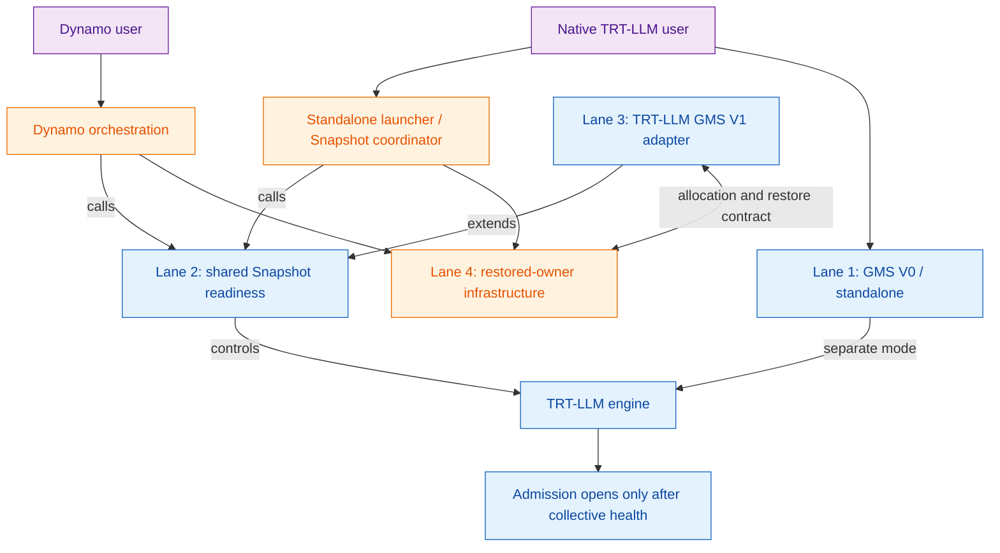

<!--
SPDX-FileCopyrightText: Copyright (c) 2026 NVIDIA CORPORATION & AFFILIATES. All rights reserved.
SPDX-License-Identifier: Apache-2.0
-->

# 22. GMS and Snapshot Integration: Four-Lane Delivery Plan

[< Back to Overview](README.md)

**Status:** Proposed integration architecture
**Created:** 2026-08-19
**Last updated:** 2026-08-19
**Current source of truth for:** GMS V0 versus V1 boundaries, shared Snapshot readiness, restored-owner ownership, and
cross-repository delivery priorities

## Executive Decision

[Dynamo DEP #12521](https://github.com/ai-dynamo/dynamo/issues/12521) proposes the long-term GMS boundary:

> Snapshot preserves the completed engine and its model/runtime semantics. GMS remains a model-blind owner of
> physical CUDA backing. TensorRT-LLM owns the safe transition between runnable and checkpointable engine states.

The DEP is open and marked `dep:draft` as of 2026-08-19. This document adopts its boundary as the planning direction,
but gates broad product investment on the contract being accepted or materially stabilized.

This creates two distinct GMS lifecycle/architecture profiles rather than one continuously evolving path:

- **GMS V0 / standalone:** a fresh process reconstructs a compatible model and attaches to resident GMS weights. It
  can operate without Snapshot and remains relevant to native `trtllm-serve` users.
- **GMS V1 / Snapshot-coupled:** Snapshot restores the already initialized process; GMS reattaches immutable weights
  and recreates empty KV backing at the saved virtual addresses. V1 does not reconstruct a fresh model.

TensorRT-LLM should support both deployment audiences through the same public engine lifecycle:

1. **Dynamo users:** Dynamo owns deployment policy, Snapshot orchestration, GMS-owner placement, restore ordering,
   discovery, and failure handling.
2. **Native TensorRT-LLM users:** `trtllm-serve` exposes the same GMS and checkpoint lifecycle without requiring the
   Dynamo control plane. V0 needs a GMS service/launcher; V1 additionally needs an external privileged Snapshot
   coordinator, such as the Kubernetes-native `ai-dynamo/snapshot` operator used independently of the Dynamo
   serving/router control plane once it exposes the required contract, or another compatible platform manager.

TensorRT-LLM must not embed Kubernetes policy, CRIU, CUDA-checkpoint artifact movement, or GMS-owner restoration in
the engine. Native support means a stable engine API and configuration that a non-Dynamo coordinator can call.

## Goals and Non-Goals

### Goals

- Make TRT-LLM a supported engine for Dynamo GMS V1 and Snapshot workflows without Dynamo monkey-patching private
  engine state.
- Make the same engine hooks usable by native `trtllm-serve` deployments without the Dynamo router/control plane.
- Preserve V0 standalone RW/RO weight reuse as a separate compatibility lane.
- Reuse one admission, quiescence, stable-address, and checkpoint-resource lifecycle across Snapshot-only and
  Snapshot-plus-GMS configurations.
- Keep model, quantization, aliasing, KV, graph, and communicator semantics inside TRT-LLM.

### Non-Goals

- Implement Snapshot storage, CRIU/CUDA checkpointing, Kubernetes orchestration, or cross-node placement in TRT-LLM.
- Make V0 model reconstruction part of the V1 restore path.
- Preserve failed-engine KV contents; V1 recreates empty KV backing on wake.
- Require MX for V1 restore. MX remains an optional source for initial construction and V0/cold-start workflows.
- Declare broad TP/EP/MoE, disaggregated, speculative-decoding, or cross-node support before separate qualification.

## Four-Lane Architecture

The lanes are delivery and ownership boundaries, not four independent implementations. Lane 2 is the common engine
foundation; Lane 3 adds V1 memory domains; Lane 4 makes restored-owner deployment durable. Lane 1 remains separate
because its fresh-process reconstruction policy is intentionally absent from V1. The lane name "standalone" refers
to that lifecycle; Dynamo may also operate a V0 deployment while it remains supported.

## Architecture and Ownership Contract

| Component | Owns | Must not own |
|:--|:--|:--|
| TensorRT-LLM engine | Allocation-domain selection, model initialization, weight finalization, alias safety, KV recreation, quiescence, checkpoint-resource lifecycle, graph-address validation, rank health, and local admission | Snapshot artifacts, GMS-owner placement, election, discovery, or routing policy |
| GMS client/core | Allocation IDs, exact client VA reservations, map/unmap/access, and leases | Model/tensor semantics or engine reconstruction |
| Rank-local GMS owner | Physical CUDA allocations, mutable epochs, transient export handles, RW admission, and immutable RO publication | Model metadata, tensors, or client VA ownership |
| Snapshot coordinator | Engine and owner process/CUDA checkpoint-restore, artifact persistence/movement, owner-before-engine ordering, and compatible-target placement | Model-specific reconstruction or engine readiness policy |
| Dynamo or standalone launcher | Configuration, supervision, election, failure policy, delayed discovery, and invoking the supported engine lifecycle | Reaching into private TRT-LLM allocators or declaring readiness before TRT-LLM collective health |

## Lane 1: GMS V0 / Standalone

### Purpose

Preserve native RW/RO GMS weight sharing for users who do not use Snapshot. A writer constructs and transforms the
model, commits a GMS layout, and a fresh reader process reconstructs a compatible engine before attaching RO.

### Current State

The native `LoadFormat.GMS` structure, staged post-load hooks, and `SourceIdentity` validation exist. The detailed V0
loading, identity, warm-shadow, and PR analysis remains in
[§18](18-gms-integration-gaps-and-concrete-pr-plan.md). The proposed
[V0 shared-core migration #12159](https://github.com/ai-dynamo/dynamo/pull/12159) closed unmerged, so V0 is not the
implementation base for V1 today.

### Remaining Gaps

- Align the real `finalize_gms_write()` API and add installed-package/real-daemon coverage.
- Atomically publish and retrieve exact artifact/layout identity before any RO materialization.
- Qualify explicit model, quantization, transform-protocol, and parallel-layout combinations; fail closed otherwise.
- Bound the maintenance surface of fresh-process reconstruction rather than adding open-ended model-specific repair.
- If live parked-shadow failover remains a product goal, finish admission safety, collective sleep/wake, election,
  process-group supervision, scratch/full KV policy, and replenishment as a V0/live-owner feature.

### Exit Gate

One supported model/protocol completes a real two-process RW-to-RO attach with strict mismatch rejection, identical
outputs, correct aliases/derived state, and a documented native `trtllm-serve` recipe. Warm-shadow failover is a later
and independent gate.

## Lane 2: Shared Snapshot Readiness

### Purpose

Make a fully initialized TRT-LLM process safe to checkpoint and restore, whether its weights are embedded in the
Snapshot or externalized through GMS V1. This lane is valuable even if the GMS V1 contract changes.

### Current State

- [TRT-LLM #14636](https://github.com/NVIDIA/TensorRT-LLM/pull/14636) landed the multi-rank sleep/wake control plane.
- [TRT-LLM #16632](https://github.com/NVIDIA/TensorRT-LLM/pull/16632) is the in-flight stable-VA lifecycle and
  admission/fail-stop work for native MoE A2A resources.
- [TRT-LLM #16635](https://github.com/NVIDIA/TensorRT-LLM/pull/16635) is the in-flight stable-VA lifecycle and
  protocol-state reconstruction for MNNVL all-reduce.
- [Dynamo #10432](https://github.com/ai-dynamo/dynamo/pull/10432) established the TRT-LLM TP1 Snapshot baseline. The
  [current adapter](https://github.com/ai-dynamo/dynamo/blob/f166f6ec0325a71f5f0fa9a3c6f18d9d1414e43b/components/src/dynamo/trtllm/snapshot.py)
  still has no complete engine pause controller or GMS V1 adapter.

### Remaining Gaps

- Replace resource-specific discovery with a checkpoint-resource registry/coordinator.
- Close request admission atomically before drain and keep it closed through checkpoint, parked, and waking states.
- Apply PREPARE/COMMIT/ABORT or fail-stop semantics across every rank; subgroup collectives must not run while peers
  are still in a different transition phase.
- Wire all graph-visible resources into the lifecycle: MoE A2A, MNNVL AR, classic CUDA-IPC custom AR or an explicit
  fail-closed strategy, peer-pointer tables, flags/counters, watchdogs, and external registrations.
- Validate exact pointer preservation and CUDA graph replay through repeated restore cycles.
- Expose one supported engine pause/resume and readiness API to both Dynamo and standalone coordinators.
- Qualify TP1 first, then same-node TP/DP/EP; retain explicit topology/feature gates.

### Exit Gate

Snapshot-only TRT-LLM passes repeated TP1 and TP2 checkpoint/restore cycles with admission races and injected rank
failures, stable graph-visible addresses, rebuilt communication state, correct output, and no leaked handles or GPU
memory.

## Lane 3: TRT-LLM GMS V1 Adapter

### Purpose

Externalize selected CUDA backing while Snapshot preserves the completed TRT-LLM process. The adapter must be a new
Snapshot-coupled memory profile, not a rename or extension of the V0 fresh-process reader.

### Required Shape

- Add an explicit experimental profile, conceptually `snapshot_gms_v1`, and reject accidental V0/V1 mixing.
- Keep the initial weight source orthogonal: HF, MX, ModelStreamer, or another loader runs once during normal engine
  construction before capture.
- Route model-weight and KV allocations into distinct V1 domains while composing safely with TRT-LLM native VMM and
  nested PyTorch allocation scopes.
- Complete load, quantization, post-load transforms, and immutable weight publication before graph capture against
  final addresses.
- Move mutable non-Parameter state outside immutable weight storage; reject unsupported mutable views into Parameter
  backing.
- On sleep, unmap RO weights and terminate the mutable KV epoch while preserving allocation identity and VA
  reservations.
- On wake, reattach the exact weight allocation generation and recreate empty KV backing with the saved IDs, sizes,
  and virtual addresses before restoring dependent resources.
- Reuse Lane 2 admission, all-rank coordination, resource reconstruction, health, and readiness.

### Identity Boundary

`SourceIdentity` and `ArtifactIdentity` remain useful for initial-load qualification, V0 trust, and diagnostics. They
are not the primary V1 reconstruction mechanism: Snapshot preserves the original process and Torch object graph. V1
must bind the restored engine to the expected Snapshot generation, rank, memory domain, and exact allocation set.

### Remaining Gaps

- No TRT-LLM GMS V1 adapter exists today.
- TRT-LLM allocation paths span PyTorch MemPools, native C++ VMM, multiple KV implementations, and allocations that
  may bypass a Torch allocator; the V1 domain router is the largest design risk.
- Decide how GMS V1 ephemeral KV composes with the TRT-native scratch/full-KV design in §18. Do not implement both as
  competing owners of the same VA range.
- Define immutable-weight compatibility for dynamic EPLB/expert movement: finish before publication, allocate mutable
  state outside the weight domain, or reject the combination.
- Rebuild NIXL/KV connector registrations only after final KV backing exists.
- Replace Dynamo's no-op TRT pause controller with the public Lane 2/3 engine API.
- Add capability/version diagnostics and a fail-closed support matrix.

### Exit Gate

A dense TP1 TRT-LLM engine completes repeated Snapshot-plus-GMS V1 cycles with exact allocation/VA checks, empty KV
after wake, CUDA graph replay, correct output, deterministic failure on generation mismatch, and no model
reconstruction. Same-node TP/EP/MoE qualification follows as a separate gate.

## Lane 4: Dynamo/GMS/Snapshot-Owned Restored-Owner Infrastructure

### Purpose

Make GMS V1 durable across owner restart and compatible-node placement. Snapshot restores the rank-local GMS owner
and its CUDA weight state before the paired engine process is allowed to reattach.

V1 also has a nearer-term live-owner mode in which the original owner survives an engine checkpoint/restore. Lane 4
tracks the restored-owner endpoint needed for durable clone, restart, and compatible-node placement.

### Current State

- [Dynamo #12011](https://github.com/ai-dynamo/dynamo/pull/12011) landed the experimental V1 core and initial vLLM
  live-owner lifecycle.
- [Dynamo #12989](https://github.com/ai-dynamo/dynamo/pull/12989) landed checkpoint lifecycle fencing.
- [Dynamo #12392](https://github.com/ai-dynamo/dynamo/pull/12392) landed exact-ID weight artifact save/load. DEP #12521
  classifies this fresh-owner hydration path as transitional.
- The intended restored-owner flow is not complete. The standalone
  [`ai-dynamo/snapshot`](https://github.com/ai-dynamo/snapshot) project describes itself as early development and not
  production-ready, while [CustomStorage #11584](https://github.com/ai-dynamo/dynamo/pull/11584) remains draft work.

### Remaining Gaps

- Snapshot the GMS owner as a first-class artifact, including committed CUDA weight state.
- Restore the owner before the engine and publish an explicit ready generation/allocation set.
- Bind the engine Snapshot to the matching owner generation without relying on stale sockets, export FDs, or GPU UUID.
- Regenerate transient CUDA handles and support compatible-target placement.
- Complete efficient PageBroker/CustomStorage transfer, artifact cleanup/GC, fallback behavior, and failure recovery.
- Supervise one owner per rank/device and surface bounded readiness, timeout, and rollback diagnostics.
- Qualify live-owner and restored-owner modes, then same-node multi-rank and cross-node restore.
- Provide a stable coordinator contract usable both by Dynamo and by native TRT-LLM deployments that do not use the
  Dynamo control plane.

### Exit Gate

The platform restores a committed GMS owner first, then a bound TRT-LLM TP1 engine, and the engine passes exact-VA,
generation, output, repeated-cycle, and leak checks. Cross-node and multi-rank support require later explicit gates.

## Common Capture and Restore Contract

Sleep/wake is required even for TP1 on one node. It prevents Snapshot from capturing an engine that can still execute
against detached memory or transient communication state.

| Phase | Ordered operation | Owner |
|:--|:--|:--|
| Capture | Close local admission atomically; drain requests; synchronize CUDA work | TRT-LLM |
| Capture | Detach graph-visible communicators, handles, pointer tables, and external registrations | TRT-LLM resources |
| Capture | Unmap GMS weights; unmap KV and terminate/discard its mutable epoch | TRT-LLM V1 adapter + GMS |
| Capture | Reach all-rank checkpoint-ready or fail the entire candidate | TRT-LLM |
| Capture | Persist engine and, for restored-owner V1, GMS-owner artifacts | Snapshot coordinator |
| Restore | Restore the matching owner, or hydrate it only in transitional #12392 mode; publish its committed generation | Snapshot/GMS |
| Restore | Restore the engine process only after the owner is ready | Snapshot coordinator |
| Wake | Recreate empty KV and reattach weights at exact saved virtual addresses | TRT-LLM V1 adapter + GMS |
| Wake | Rebuild communicators, protocol state, watchdogs, graphs' dependencies, and registrations | TRT-LLM resources |
| Wake | Validate every rank, then open admission and register/discover the engine | TRT-LLM, then orchestrator |

## User-Facing Deployment Paths

### Dynamo User

1. Dynamo selects a qualified TRT-LLM Snapshot/GMS V1 profile and provisions rank-local GMS owners.
2. TRT-LLM initializes normally once and reports checkpoint capability/readiness through a supported API.
3. Dynamo invokes collective pause, then requests Snapshot capture of the owner/engine artifacts.
4. On scale-up or recovery, Dynamo restores each owner before its matching engine.
5. TRT-LLM wakes, validates mappings/resources collectively, and reports healthy.
6. Dynamo registers the engine with discovery/routing only after that health signal.

### Native TensorRT-LLM User Without Dynamo

- **V0:** launch the supported GMS service, one TRT-LLM RW publisher, and compatible RO readers using native
  configuration. A standalone launcher owns supervision and any optional election.
- **V1:** launch `trtllm-serve` with the qualified V1 profile plus an external Snapshot coordinator. The coordinator
  invokes the same pause/resume API, restores owner before engine, and controls service registration. It may reuse the
  Kubernetes-native `ai-dynamo/snapshot` operator independently of the Dynamo serving/router control plane once that
  project exposes the required restored-owner and engine-adapter contract.

Both paths must use the same TRT-LLM engine lifecycle and support matrix. Native mode must not fork a second set of
private memory or checkpoint hooks.

## Prioritized Gap and Delivery Matrix

| Priority | Gap | Lane | Primary owner | Delivery gate |
|:--|:--|:--:|:--|:--|
| P0 | Generic checkpoint-resource registry, persistent admission, and all-rank fail-stop coordination | 2 | TRT-LLM | Snapshot-ready TP1/TP2 engine |
| P0 | Complete and wire stable-VA A2A/AR lifecycle, including an explicit classic custom-AR policy | 2 | TRT-LLM | CUDA graph replay after restore |
| P0 | TP1 dense V1 allocation-domain and weight/KV lifecycle spike | 3 | TRT-LLM with GMS | First TRT-LLM V1 E2E |
| P0 | Public engine pause/resume/readiness API; replace Dynamo no-op controller | 2/3 | TRT-LLM + Dynamo adapter | No private monkey-patching |
| P0 external | Restored-owner generation contract and owner-before-engine proof | 4 | GMS/Snapshot/Dynamo | Durable V1 architecture proof |
| P1 | V0 exact API/identity and one supported RW-to-RO model path | 1 | TRT-LLM + GMS | Supported standalone V0 |
| P1 | Same-node TP/EP/MoE, immutable EPLB policy, KV variants, and external registrations | 2/3 | TRT-LLM | Qualified distributed V1 |
| P1 external | Efficient CustomStorage/PageBroker transfer, supervision, GC, and failure recovery | 4 | Snapshot/Dynamo | Repeatable restored-owner service |
| P2 | Cross-node, disaggregated, speculative-decoding, and broad model/quantization coverage | 2/3/4 | Cross-project | Product support matrix |

## Delivery Sequence and Investment Gates

1. **Shared readiness first:** land/generalize the #16632/#16635 lifecycle, resource registry, admission, public pause
   API, and Snapshot-only TP1/TP2 tests.
2. **Narrow V1 spike:** implement one dense TP1 adapter against the current V1 core and transitional hydration path to
   expose allocator, alias, KV, and ordering problems early.
3. **Restored-owner gate:** require a working owner-before-engine restore contract before committing to broad TRT-LLM
   V1 productization.
4. **Same-node expansion:** qualify TP/EP/MoE and connectors only after TP1 repeated-cycle correctness.
5. **Cross-node productization:** fund only after Snapshot storage/movement, restored-owner orchestration, and the
   topology compatibility contract stabilize.

A reasonable initial investment is one to two TRT-LLM engineers on Lane 2 and the TP1 Lane 3 spike. Broad
multi-node/product support is a separate multi-engineer program and should remain gated by Lane 4 maturity.

## Open Decisions

1. Define the provider boundary for native V1: direct use of the Kubernetes-native Snapshot operator versus a
   pluggable coordinator interface implemented by that operator and other platforms.
2. Decide how TRT-LLM native KV VMM composes with the GMS V1 ephemeral-KV domain; there must be one owner per VA range.
3. Define which dynamic EPLB/expert-mutation modes can satisfy immutable V1 weight publication.
4. Restore classic CUDA-IPC custom all-reduce or reject it in the first V1/Snapshot capability profile.
5. Decide whether V0 parked-shadow election and replenishment remain a supported product after V1 is usable.

## Relationship to Earlier Sections

- [§17](17-snapshot-assessment.md)'s component layering remains useful, but V1 restore must not depend on MX
  repopulating a fresh GMS owner or on TRT-LLM reconstructing model semantics. Those are V0/transitional options.
- [§18](18-gms-integration-gaps-and-concrete-pr-plan.md) remains the detailed V0/standalone loading and live-shadow
  plan. Its stable-VA, admission, multi-rank, and resource-lifecycle requirements feed Lanes 2 and 3; its
  SourceIdentity transport and warm-shadow election/replenishment are not base V1 prerequisites.
- [§21](21-mx-readiness-gaps-and-model-family-plan.md) remains the MX source of truth. MX is an optional initial weight
  source and standalone cold-start mechanism, not a V1 restored-owner requirement.

Where these sections conflict on the V0/V1 boundary, restored-owner ownership, KV-domain ownership, or current
delivery priority, this section supersedes them.

## References

- [Dynamo DEP #12521: Snapshot-coupled GMS V1](https://github.com/ai-dynamo/dynamo/issues/12521)
- [Dynamo #12011: GMS V1 lifecycle](https://github.com/ai-dynamo/dynamo/pull/12011)
- [Dynamo #12392: transitional V1 weight artifact save/load](https://github.com/ai-dynamo/dynamo/pull/12392)
- [Dynamo #12989: V1 checkpoint lifecycle control](https://github.com/ai-dynamo/dynamo/pull/12989)
- [Dynamo #11584: CUDA CustomStorage checkpoints](https://github.com/ai-dynamo/dynamo/pull/11584)
- [ai-dynamo/snapshot](https://github.com/ai-dynamo/snapshot)
- [TRT-LLM #14636: multi-rank sleep/wake control](https://github.com/NVIDIA/TensorRT-LLM/pull/14636)
- [TRT-LLM #16632: native MoE A2A checkpoint lifecycle](https://github.com/NVIDIA/TensorRT-LLM/pull/16632)
- [TRT-LLM #16635: MNNVL all-reduce checkpoint lifecycle](https://github.com/NVIDIA/TensorRT-LLM/pull/16635)
