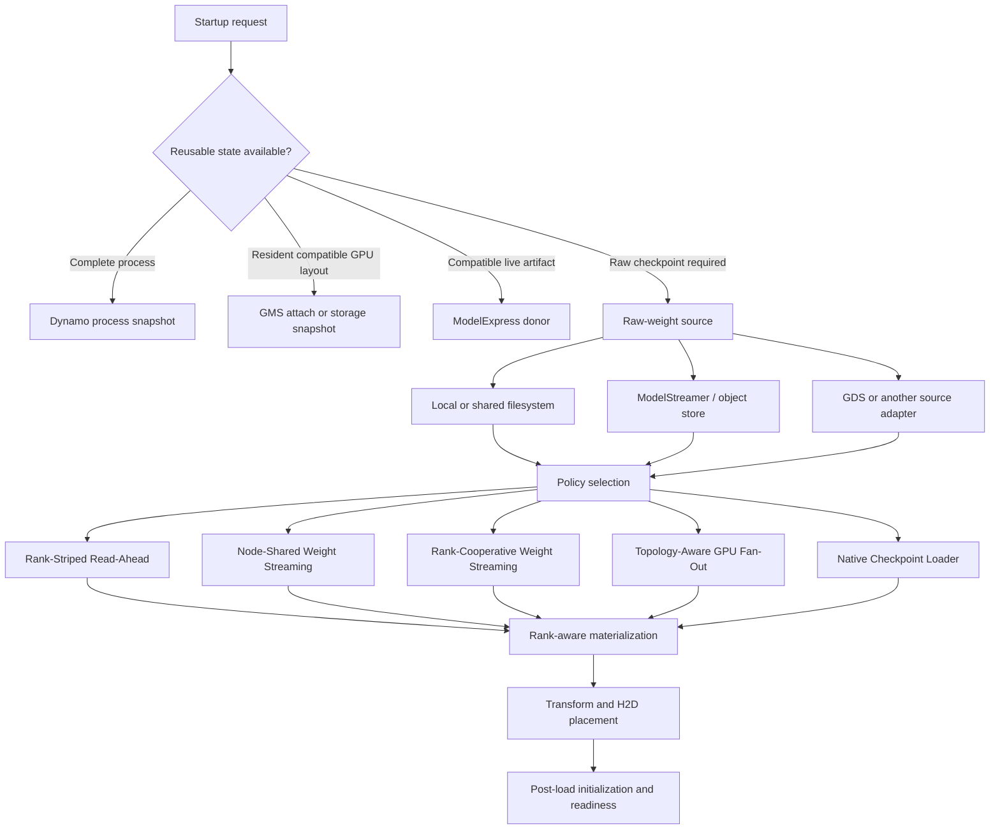
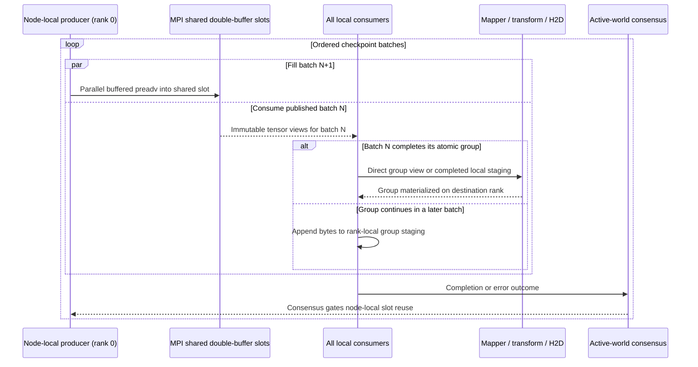
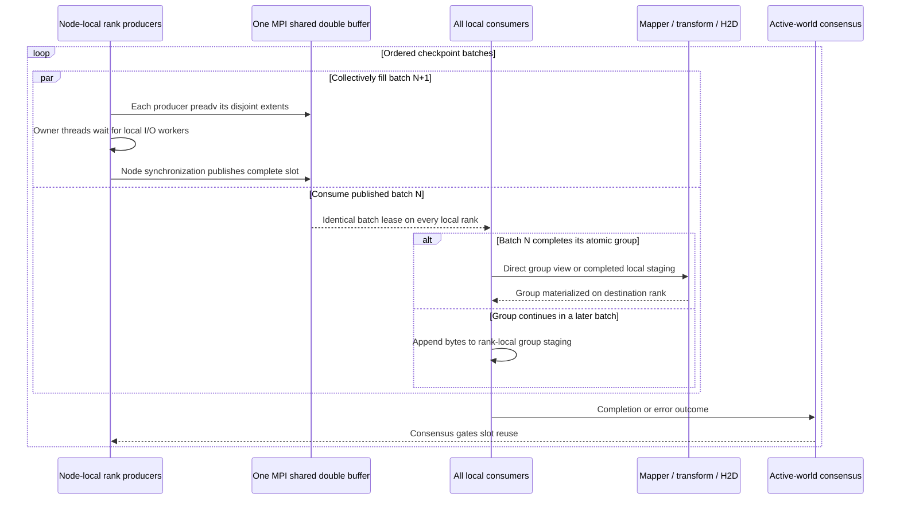
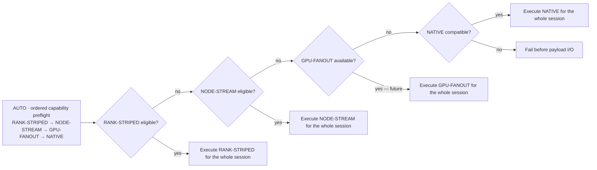

<!--
SPDX-FileCopyrightText: Copyright (c) 2026 NVIDIA CORPORATION & AFFILIATES. All rights reserved.
SPDX-License-Identifier: Apache-2.0
-->

# Rank-Cooperative Checkpoint Loading

*Parallel read-ahead and pipelined materialization for faster cold starts.*

[< Back to design package](README.md)

**Status:** Draft design; host-staging prototype in
[TensorRT-LLM PR #16562](https://github.com/NVIDIA/TensorRT-LLM/pull/16562)

**Created:** 2026-07-19

**Last Updated:** 2026-07-22

See the [benchmark and qualification plan](benchmark-plan.md) for the five-treatment experiment, metrics, model
matrix, and acceptance gates.

## Executive Decision

TensorRT-LLM should keep weight source selection separate from the policy used to stage and materialize those weights.
The TensorRT-LLM checkpoint-loading layer should provide a deterministic, observable policy plan:

```text
Automatic Capability Selection (AUTO)
    +-- Rank-Striped Read-Ahead       (RANK-STRIPED)
    +-- Node-Shared Weight Streaming  (NODE-STREAM; one producer)
    +-- Rank-Cooperative Weight Streaming (RANK-STREAM; multiple producers)
    +-- Topology-Aware GPU Fan-Out    (GPU-FANOUT; future)
    +-- Native Checkpoint Loader      (NATIVE)
```

These are the canonical design and benchmark names. PR #16562 still exposes provisional implementation tokens, so
commands in this document use the exact spellings accepted by the pinned prototype:

| Canonical name | Benchmark ID | Current PR token | Recommended public token |
| --- | --- | --- | --- |
| Native Checkpoint Loader | `NATIVE` | `legacy_fallback` | `native` |
| Rank-Striped Read-Ahead | `RANK-STRIPED` | `direct_rank_read` | `rank_striped_readahead` |
| Node-Shared Weight Streaming | `NODE-STREAM` | `shared_host_producer` | `node_shared_stream` |
| Rank-Cooperative Weight Streaming | `RANK-STREAM` | `rank_cooperative_stream` | `rank_cooperative_stream` |
| Topology-Aware GPU Fan-Out | `GPU-FANOUT` | `gpu_broadcast` | `gpu_fanout` |
| Automatic Capability Selection | `AUTO` | Environment variable unset | `auto` or environment variable unset |
| Single-Reader Cache Warmup (diagnostic) | `CACHE-WARMUP` | `single_producer_page_cache_prefetch` | `single_reader_cache_warmup` |

Before the prototype becomes a public API, the implementation should accept the recommended tokens and may preserve
the current spellings as compatibility aliases. Logs and telemetry should normalize to one canonical name.

The target prototype implements the three CPU-host mechanisms and the native loader. Topology-Aware GPU Fan-Out is
recognized but unavailable. AUTO is an ordered capability fallback, not a runtime performance tuner: for an eligible
native HF/AUTO SafeTensors checkpoint it selects RANK-STRIPED because that policy precedes both streams. NODE-STREAM
and RANK-STREAM share the stricter partial-loading, nested-module, and exact-cover mapper-manifest requirements. CUDA
registration and borrowed source lifetime do not determine stream eligibility; they determine whether an eligible
atomic group can use a direct shared-buffer view or must use rank-local staging.

The recommended rollout is therefore:

1. Benchmark NATIVE, RANK-STRIPED, NODE-STREAM, and RANK-STREAM as four distinct static paths.
2. Preserve the ordered plan for capability fallback and explicit failure behavior.
3. Add a performance-adaptive selector only after storage-specific measurements identify stable decision signals.
4. Expand from rank-cooperative staging to rank-selective loading and GPU fan-out only after TensorRT-LLM exposes a
   rank-aware final-weight materialization contract.

This rank-cooperative checkpoint work is complementary to ModelStreamer, ModelExpress (MX), GPU Memory Service (GMS),
and process snapshots. The broader composition is described in
[ModelStreamer and Weight-Loading Integration Assessment](../mx-gms-integration/19-model-streamer-weight-loading-assessment.md).

## Startup North Star and Current Scope

The product objective is fast, efficient, and predictable TensorRT-LLM startup: minimize the time from process launch
to a ready service and first successful token without trading away correctness, memory safety, failure recovery, or
steady-state performance. Checkpoint loading is one critical component of that path, not the complete startup system.

A first-principles startup model treats the work as replaceable and measurable stages:

```text
process launch
    -> runtime and distributed initialization
    -> reusable-state and artifact resolution
    -> raw checkpoint discovery and acquisition, when required
    -> staging, mapping, transformation, and H2D placement
    -> post-load initialization, KV-cache setup, compilation, and autotuning
    -> CUDA graph capture, service readiness, and first inference
```

The current implementation scope is the raw-checkpoint branch, from filesystem-visible SafeTensors through existing
materialization and final CUDA completion. It tests opportunistic page-cache overlap in RANK-STRIPED and explicit
batch N/N+1 producer-consumer overlap in both shared-buffer streams while measuring the full process-to-first-token path. A
checkpoint-stage improvement is useful only when it reduces the end-to-end startup critical path.

The architecture must remain open to complementary work that skips, replaces, or accelerates other stages:

- Dynamo process snapshots can restore a complete warmed process and bypass most of the sequence.
- MX and GMS can reuse compatible materialized weights and avoid raw checkpoint work.
- ModelStreamer, GDS, or another source can replace native filesystem byte acquisition.
- A future `RankWeightManifest` can enable TP/PP/CP/EP-selective reads, transformations, and placement.
- Bounded pinned pipelines and topology-aware GPU fan-out can optimize the materialization and placement stages.
- Compilation, autotuning, KV-cache initialization, CUDA graph capture, and readiness remain independently measurable
  optimization targets.

Consequently, this design does not make the checkpoint loader a monolithic startup orchestrator. It preserves explicit
contracts between source selection, I/O policy, materialization, placement, reusable artifacts, and hierarchical
startup telemetry so each stage can evolve independently.

## Problem

Large SafeTensors checkpoints can spend a material part of cold start waiting for storage. A single or poorly balanced
reader may not saturate NVMe, Lustre, or another high-bandwidth shared filesystem. Conversely, a large number of
processes can reduce throughput on a client-limited NFS deployment.

The objective is to minimize both:

- checkpoint-loading critical path, from discovery through final CUDA completion; and
- end-to-end startup, from process launch through the first successful token.

Faster byte reads are necessary but not sufficient. Model construction, SafeTensors demand faults, mapping, CPU
transforms, host-to-device copies, post-load processing, KV-cache setup, compilation, autotuning, and CUDA graph
capture can dominate after storage is accelerated. The design must preserve those phase boundaries in its metrics.

## Goals

- Reduce end-to-end TensorRT-LLM startup when a raw checkpoint load is required.
- Allow an explicit strict policy or an ordered fallback plan.
- Exploit multiple local CPU processes and threads without redundant physical storage reads when possible.
- Select all collective behavior before policy-specific I/O begins.
- Preserve a safe path for unsupported sources, formats, load modes, and communicator lifecycles.
- Keep checkpoint source, host staging, GPU placement, and artifact reuse as separate concerns.
- Produce enough telemetry to explain both storage-stage and end-to-end speedup.
- Preserve integration seams for ModelStreamer, MX, GMS, snapshots, and topology-aware GPU distribution.

## Non-Goals of the Current Prototype

- A single implementation that optimizes or orchestrates every TensorRT-LLM startup phase.
- Implementing MX, GMS, process snapshots, ModelStreamer, compilation, or warmup optimizations in this prototype.
- Remote Hugging Face download acceleration or direct object-store streaming.
- Linux `O_DIRECT`, GPUDirect Storage, or direct reads into final parameter storage.
- NUMA-aware producer placement, transformed-weight caching, or restart reuse.
- TP-, PP-, CP-, or EP-selective file-range reads.
- A literal full-model broadcast to every GPU.
- Legacy TensorRT `.engine` deserialization acceleration.
- Automatic performance selection based only on the presence of an optional package.

## Composable Startup Architecture

The word "loader" spans several independent decisions. They should not be encoded as one enum.



The layers have different owners:

| Layer | Responsibility | Examples |
| --- | --- | --- |
| Process restoration | Skip startup work when a complete warmed-process image is valid. | Dynamo Snapshot |
| Artifact reuse | Reattach or transfer already materialized, identity-compatible weights. | GMS, GMS storage snapshot, MX |
| Raw source | Locate and deliver checkpoint bytes. | Native filesystem, ModelStreamer, GDS |
| Load policy | Decide which ranks or producers fetch and stage bytes. | The policies in this document |
| Materialization | Map source tensors to rank-owned parameters and apply transformations. | TensorRT-LLM model and weight mapper |
| Placement | Allocate and populate final host or GPU storage. | CUDA allocator, future GMS-aware destination |
| Post-load readiness | Prepare runtime state after weights are usable. | KV cache, compilation, autotuning, CUDA graphs, warmup |

ModelStreamer can become a raw-source adapter without replacing the checkpoint policy and materialization contracts.
MX and GMS should remain ahead of raw loading in the source cascade because a compatible post-transform artifact can
skip more work than a faster checkpoint read. Every layer should emit compatible phase boundaries so improvements can
be attributed locally and validated against the shared end-to-end startup metric.

## Terminology: Policy Plan Versus Rank Manifest

The prototype defines `WeightLoadPlan` as an ordered tuple of policy names. An earlier architecture document used the
same term for a much richer tensor/rank manifest. These are different objects and should not share a final public name.

- **Policy plan:** ordered candidate strategies and fallback behavior. This is what PR #16562 implements.
- **Rank weight manifest:** future immutable description of source extents, owning ranks, transforms, aliases,
  destinations, dependencies, and memory budgets.

The richer object should be named `RankWeightManifest` or `WeightMaterializationPlan`. The policy selector consumes
checkpoint metadata plus deployment context and chooses a policy; the chosen policy consumes the rank manifest.

## Policy Workflows at a Glance

NATIVE, RANK-STRIPED, NODE-STREAM, and RANK-STREAM are distinct execution paths. AUTO selects exactly one path before
payload I/O; it is not another transport and does not mix policies during a load. GPU-FANOUT is a future path. The
historical single-reader page-cache policy is diagnostic only and must not be reported as either shared-buffer stream.

```mermaid
flowchart TB
    subgraph NATIVE["NATIVE · Native Checkpoint Loader"]
        direction LR
        L1["Ranks divide whole checkpoint files"]
        L2["Per-rank threaded prefetch when enabled<br/>into the node OS page cache"]
        L3["Node barrier"]
        L4["Every rank mmap → map/transform → H2D"]
        L1 --> L2 --> L3 --> L4
    end

    subgraph RANK_STRIPED["RANK-STRIPED · Rank-Striped Read-Ahead"]
        direction LR
        D1["Ranks divide fixed-size file extents"]
        D2["Background pread<br/>into the node OS page cache"]
        D3["Every rank mmap → map/transform → H2D"]
        D4["Active-world materialization-error consensus<br/>cancel remaining reads on failure"]
        D5["Join background readers"]
        D6["Active-world read-error consensus"]
        D7["Success-only node barrier"]
        D1 --> D2
        D1 --> D3
        D2 -. "overlaps" .-> D3
        D3 --> D4
        D2 --> D5
        D4 --> D5 --> D6 --> D7
    end

    subgraph NODE_STREAM["NODE-STREAM · Node-Shared Weight Streaming"]
        direction LR
        S0["Steady state: batches N and N+1"]
        S1["Node rank 0: parallel preadv of batch N+1<br/>through page cache into inactive shared slot"]
        S2["All local ranks: consume batch N<br/>direct view or append to rank-local group staging"]
        S4{"Batch N completes<br/>its atomic weight group?"}
        S5["Yes: map/transform → H2D"]
        S6["No: await the group's next batch"]
        S3["Active-world completion consensus<br/>node-local slot N becomes reusable"]
        S0 --> S1
        S0 --> S2 --> S4
        S4 -->|"yes"| S5 --> S3
        S4 -->|"no"| S6 --> S3
        S1 -. "overlaps" .-> S2
    end

    subgraph RANK_STREAM["RANK-STREAM · Rank-Cooperative Weight Streaming"]
        direction LR
        R0["Steady state: batches N and N+1"]
        R1["Multiple local ranks: parallel preadv of disjoint extents<br/>into one inactive shared slot for batch N+1"]
        R2["All local ranks: consume batch N<br/>direct view or append to rank-local group staging"]
        R4{"Batch N completes<br/>its atomic weight group?"}
        R5["Yes: map/transform → H2D"]
        R6["No: await the group's next batch"]
        R3["Active-world completion consensus<br/>node-local slot N becomes reusable"]
        R0 --> R1
        R0 --> R2 --> R4
        R4 -->|"yes"| R5 --> R3
        R4 -->|"no"| R6 --> R3
        R1 -. "overlaps" .-> R2
    end

    subgraph GPU_FANOUT["GPU-FANOUT · Topology-Aware GPU Fan-Out — future"]
        direction LR
        G1["Storage producer → bounded host staging"]
        G2["One producer GPU per topology domain"]
        G3["Broadcast replicated tensors<br/>scatter/send rank-owned shards"]
        G4["Owning GPU destinations"]
        G1 --> G2 --> G3 --> G4
    end

    subgraph CACHE_WARMUP["Diagnostic only · Single-Reader Cache Warmup"]
        direction LR
        P1["Rank 0 reads the full checkpoint"]
        P2["Warm node OS page cache"]
        P3["Node barrier"]
        P4["Every rank mmap → map/transform → H2D"]
        P1 --> P2 --> P3 --> P4
    end
```



Solid arrows are ordered stages. A dashed arrow is intentional I/O/materialization overlap. Storage assignment, shared
arenas, and node barriers are node-local; "rank 0" in a storage lane means node-local rank 0. Policy selection and
error/protocol consensus span the active world so every node follows the same collective sequence.

| Path | Storage readers per node | Intermediate bytes | I/O/materialization overlap | Completion boundary |
| --- | --- | --- | --- | --- |
| NATIVE | Ranks with assigned whole files; up to 16 prefetch workers per reading rank when enabled | Linux page cache, then mmap | No intentional overlap: prefetch completes before the barrier and materialization | Node barrier before mmap/materialization |
| RANK-STRIPED | Every rank with assigned fixed-size extents | Linux page cache, then mmap | Yes: background read-ahead runs beside mmap, transformation, and H2D | Active-world materialization-error consensus/cancel, join readers, active-world read-error consensus, then success-only node barrier |
| NODE-STREAM | One producer process with a default 64-worker I/O pool | Linux page cache, bounded MPI shared-memory double buffer, and optional rank-local group staging | Yes: producer fills batch N+1 while consumers process batch N; transform/H2D begins only when N completes its atomic group | Active-world consensus before a node-local consumed slot is reused |
| RANK-STREAM | Multiple node-local producer processes sharing one node-level worker budget | Linux page cache, the same bounded MPI shared-memory double buffer, and optional rank-local group staging | Yes: rank producers collectively fill disjoint regions of batch N+1 while consumers process batch N; transform/H2D follows the same atomic-group boundary as NODE-STREAM | Producer-owner threads synchronize their completed writes; active-world consensus gates slot reuse |
| GPU-FANOUT | Future producer per node or NVLink/NVSwitch domain | Bounded host staging followed by a producer GPU | Intended: source, H2D, and GPU fan-out pipeline | Topology-aware transfer completion; not implemented |
| CACHE-WARMUP diagnostic | Node rank 0 with up to 16 prefetch workers by default | Linux page cache, then mmap | No | Node barrier before mmap/materialization |

RANK-STRIPED background reads and demand faults both populate the node's Linux page cache, so filesystem I/O can
overlap mmap setup, CPU mapping and transformations, and the existing H2D copies. It has no batch-ready handoff,
backpressure, or page-residency lifetime guarantee: foreground demand faults may race ahead of background reads.
NODE-STREAM and RANK-STREAM instead publish raw checkpoint batches through the same optionally CUDA-registered shared
arena. They pipeline producer I/O with consumer batch assembly and, for a group-completing batch,
transformation/H2D. Neither stream uses `O_DIRECT`, GDS, or final-parameter destination reads.

### Important Baseline Correction

The NATIVE TensorRT-LLM SafeTensors path is not uniformly single-threaded. It already assigns whole checkpoint files
across node-local ranks and prefetches assigned files with threads before every rank maps the checkpoint. The new
Rank-Striped Read-Ahead policy changes the assignment unit from a whole file to a fixed-size extent and targets a
bounded node-level read-ahead budget through equal per-rank quotas.

This distinction predicts where speedup is most likely:

- A few large or uneven shards can leave NATIVE reader ranks idle and favor chunk striping.
- Many uniform shards already expose file-level parallelism and can make NATIVE competitive.
- A filesystem that rewards many outstanding reads can favor RANK-STRIPED.
- A filesystem that penalizes multiple clients or processes can favor a shared producer.

All three optimized policies beating NATIVE is a benchmark hypothesis, not an architectural guarantee.

## Policy Semantics

### Rank-Striped Read-Ahead (`direct_rank_read`)

Node-local MPI ranks own disjoint 256 MiB file extents. Each rank with assigned extents starts bounded buffered `pread`
calls that warm those extents into the shared OS page cache, then immediately enters the existing SafeTensors mmap,
mapping, transformation, and H2D path. At weight-session exit the caller coordinates materialization errors across the
active world, cancels peer work when needed, joins the reader, coordinates read errors across the active world,
performs a node barrier only after success, and releases the node communicator.

The background reader is launched before foreground SafeTensors mapping and model materialization, but there is no
"first extent ready" barrier or producer/consumer handoff. Foreground mmap demand faults begin immediately and can
overtake the background `pread` calls. RANK-STRIPED is therefore an overlapped page-cache read-ahead policy, not a
bounded weight stream. Its strength is broad compatibility with the unchanged full-checkpoint loader; its weakness is
that overlap depth, cache-hit timing, and useful read ordering are opportunistic.

With the default settings, a rank's read-ahead worker count is:

```text
min(assigned_extents_on_rank, 16, max(1, floor(64 / local_rank_count)))
```

Extents are round-robin striped across local ranks, so assigned extent counts differ by at most one. The default quota
is therefore already divided equally across ranks that have read-ahead work:

| Local ranks | Maximum workers per reading rank | Aggregate when every rank has enough extents |
| ---: | ---: | ---: |
| 4 | 16 | 64 |
| 8 | 8 | 64 |
| 16 | 4 | 64 |
| 32 | 2 | 64 |
| 64 | 1 | 64 |
| 65 | 1 | 65 |

A rank receives zero workers only when it owns zero extents, which can happen when there are fewer extents than ranks;
that rank has no read-ahead assignment and is not starved. This is a per-rank quota, not a node-global worker pool:
unused quota is not rebalanced, and an explicit per-rank override bypasses the 64-worker target. For more than 64 local
ranks, preserving at least one worker per reading rank necessarily exceeds 64, so 64 is a target rather than a strict
node cap. A future strict-budget scheduler would need to elect at most 64 reader ranks and redistribute extents among
them, because it cannot both enforce a 64-worker cap and give more than 64 ranks at least one worker. The later
SafeTensors mapping thread pools are separate from this read-ahead budget.

This overlapped session is used through `ModelLoader`. A direct call to `HfWeightLoader.load_weights()` remains
synchronous, so it is not a valid benchmark entry point for the pipelined behavior.

The proposed RANK-STRIPED name removes the provisional token's ambiguous word "direct." This path uses ordinary
buffered reads; it does not use `O_DIRECT`, GDS, or direct-to-GPU placement. Each node still stages a complete logical
checkpoint, and PP ownership does not yet reduce node storage traffic.

### Node-Shared Weight Streaming (`shared_host_producer`)

Each node elects local rank 0 as its sole storage producer. The producer issues parallel 8 MiB buffered `preadv`
operations directly into the inactive slot of an MPI shared-memory double buffer while every local rank consumes the
previously published batch. SafeTensors headers and the initialized mapper's exact-cover atomic-group manifest are
validated before payload I/O.

The pipeline schedules **batches**, not necessarily complete groups. The configured 256 MiB slot is a baseline: the
planner grows it to the largest atomic weight group that fits within half of the configured two-slot arena budget,
which defaults to 64 GiB total. A larger group is split across ordered batches. Consumers append nonterminal batches
to rank-local group staging and do not invoke model mapping, transformation, or H2D until the group-completing batch
arrives.



The production path gives the one producer a 64-worker I/O pool by default. Consumer ranks intentionally have no
storage-read workers: they consume the producer's shared stream and perform their own mapping, transformation, and H2D
work. This is producer/consumer division of labor, not rank starvation. An explicit worker setting applies to the
producer pool in NODE-STREAM, despite the current configuration field retaining a per-rank-oriented name.

These are ordinary buffered filesystem reads: NFS or local-storage data still passes through the node's Linux page
cache before the kernel copies it into the shared arena. Unlike RANK-STRIPED, the shared-buffer streams do not require warming and
mmap-reading a full logical checkpoint before consumers can use it; the arena remains bounded to the active
double-buffer slots.

Every rank attempts to CUDA-register the shared arena. When registration succeeds on every rank sharing one node's
arena, a complete group fits in one batch, and the mapper qualifies the runtime profile's source lifetime, mapper and
model code borrow immutable tensors directly from the shared bytes. Current-stream synchronization and active-world
completion consensus gate reuse of every node-local slot. Registration fallback is node-local, so one node does not
disable direct views elsewhere.
If registration is unavailable or a group cannot use a direct lease, the correctness path stages it in rank-local
pinned memory, with a logged pageable fallback. Quantized profiles currently stage because some Linear and MoE methods
retain source-backed temporaries until end-of-checkpoint processing; integrated-GPU profiles stage to keep shared
transport pages outside pre-existing mmap-eviction hooks. Unquantized static Qwen 3.5 and Llama 4 profiles on discrete
GPUs may use direct views. Incremental module dispatch visits only destination subtrees needed by that group. Telemetry
reports configured/effective slot size, largest group, single-slot coverage, node-local registration consensus, direct
and staged groups/bytes, and producer progress.

After mapper coverage is complete, the loader runs each eligible module's deferred
`process_weights_after_loading` hook exactly once before the last batch consensus; wrapper-owned MoE backends are
de-duplicated. Deferred quantization/fusion and CUDA-sync failures therefore become collective stream failures before
the final slot is reused. The common `post_load_weights` lifecycle still runs afterward.

CUDA registration and the borrowed-source lifetime contract qualify this direct-view fast path; they are not
shared-buffer-stream eligibility requirements. An eligible run that fails either condition remains on its selected stream but uses
rank-local staging.

The configured arena budget caps only the two MPI shared slots. It does not cap rank-local fallback staging, which can
hold one complete atomic group per local rank and has no separate implementation-enforced budget. Peak node host memory
can therefore approach the shared arena plus `local_rank_count × staged_group_bytes`, in addition to normal model
construction. Qualification and benchmarks must measure this explicitly rather than infer peak memory from the arena
budget.

This is the bounded producer/consumer mechanism needed for a fair comparison with Yijin's proposal. It is not a
transformed-weight cache: the producer does not retain a full model, and the arena is reclaimed after the session.
The older synchronous one-producer page-cache experiment remains separately selectable as Single-Reader Cache Warmup
(`single_producer_page_cache_prefetch`) and is neither NODE-STREAM nor RANK-STREAM.

The initial transport preserves at most one atomic dependency group per published batch; a group may span several
batches when it exceeds a slot. It does not yet pack multiple small independent groups into one publication. This
keeps mapper and failure boundaries simple, but can expose per-batch MPI coordination and reduce producer I/O width
for tiny groups.
Benchmarks must retain group/batch counts, payload-size distribution, and publish/acknowledgement time. Multi-group
packing is a follow-up if those measurements show material overhead.

### Rank-Cooperative Weight Streaming (`rank_cooperative_stream`)

RANK-STREAM reuses NODE-STREAM's SafeTensors metadata, atomic-group manifest, batch plan, MPI shared-memory slots,
consumer materialization, CUDA-registration decision, staging fallback, completion consensus, and cleanup lifecycle.
It changes only the storage producer executor. Instead of electing only node-local rank 0, a bounded set of local ranks
collectively fills disjoint extents of the same inactive slot.



The configured worker count is a **node-level budget**, not a multiplier applied independently to every rank. If the
budget is smaller than the number of local ranks, only that many ranks become producers. Otherwise the budget is
divided as evenly as possible across the active producers; batch extents are round-robin striped across those
producers and each extent has exactly one writer. This prevents an eight-rank node configured for 64 workers from
accidentally creating 512 storage workers.

All MPI and shared-window synchronization remains on each rank's owner thread. Background worker threads execute only
precomputed `preadv` operations into nonoverlapping byte ranges, so the mode does not require
`MPI_THREAD_MULTIPLE`. A batch is published only after every producer's local writes are complete and visible. The
consumer protocol is deliberately identical to NODE-STREAM, making a benchmark between the two streams isolate the
effect of one process versus multiple rank processes issuing storage I/O.
The production shared-window factory requires the MPI unified memory model and rejects a separate-model window before
payload I/O, because producers and consumers directly load and store the shared slot bytes.

RANK-STREAM is still not rank-selective loading. Every node collectively reads one complete logical checkpoint, and
all consumers still apply their existing TP/PP/CP/EP mapping. A future `RankWeightManifest` can restrict producers to
bytes actually needed by local destinations. Until then, the likely benefit is higher aggregate issue bandwidth on
storage that scales across processes, NIC queues, or NUMA domains—not reduced logical checkpoint bytes.

Multiple producers are not inherently faster. If NODE-STREAM's single process and thread pool already saturate the
mount, RANK-STREAM adds synchronization and filesystem-client contention without increasing bandwidth. It must remain
explicitly selectable and opt-in until storage-specific measurements justify an automatic choice.

### Topology-Aware GPU Fan-Out (`gpu_broadcast`)

`gpu_broadcast` is shorthand for topology-aware GPU fan-out, not a broadcast of every full tensor to every rank.

```text
storage -> bounded pinned host buffer -> producer GPU
                                      +-> replicated tensor: broadcast
                                      +-> TP/EP shard: scatter or grouped send/receive
                                      +-> PP layer: send only to the owning stage
```

A producer would be selected per node or NVLink/NVSwitch island. Data would be copied to that producer GPU once and
distributed over CUDA peer-to-peer or NCCL into rank-ready destinations.

This policy is useful only when the source can produce final or near-final rank payloads. The current HF loader returns
raw CPU tensors before model-specific slicing, fusion, quantization, and placement. Implementing GPU fan-out first
would either broadcast unnecessary bytes or duplicate transformations. It therefore remains unavailable until a rank
manifest and destination-oriented materialization interface exist.

GPU fan-out is also not universally faster. Replicated tensors can avoid redundant H2D copies, but disjoint TP or EP
shards may be faster with parallel per-rank H2D than with one producer followed by a scatter. Selection must account
for replicated-byte fraction, PCIe topology, NVLink/NVSwitch bandwidth, copy-engine overlap, producer HBM pressure,
and collective startup cost.

### Native Checkpoint Loader (`legacy_fallback`)

This preserves the existing native disk loader for local `.bin`/`.pth`, the implicit raw-weight cache path, and other
compatible configurations that do not use cooperative staging. MX, GMS, format-specific loaders, and object-store
sources must route to their own source-specific implementation when configured; `legacy_fallback` does not make an
unsupported URI loadable. Without such an implementation, selection fails. A model-specific or custom mapper alone
does not make the raw-byte policies ineligible.

## Automatic and Strict Selection

AUTO currently expands to the following provisional implementation tokens:

```text
direct_rank_read,shared_host_producer,gpu_broadcast,legacy_fallback
```

RANK-STREAM is intentionally not inserted into the implicit order before comparative qualification. It is available
as a strict policy or in an explicitly configured ordered plan. This keeps the existing default stable while making
all three mechanisms independently benchmarkable from one binary.

Qualification and selection complete before policy-specific collectives or I/O. The loader does not start one policy
and switch after partial reads. A single explicitly configured policy is strict and fails when unavailable; an ordered
sequence permits preflight fallback.



For currently eligible native HF/AUTO SafeTensors checkpoints, AUTO selects RANK-STRIPED. It neither measures competing
policies nor switches after loading begins, so AUTO should match strict RANK-STRIPED within experimental noise.

```bash
# Strict NODE-STREAM benchmark treatment; current PR token.
export TRTLLM_HF_WEIGHT_LOAD_PLAN=shared_host_producer

# Strict RANK-STREAM benchmark treatment.
export TRTLLM_HF_WEIGHT_LOAD_PLAN=rank_cooperative_stream

# AUTO expressed explicitly with current PR tokens.
export TRTLLM_HF_WEIGHT_LOAD_PLAN=direct_rank_read,shared_host_producer,gpu_broadcast,legacy_fallback

# Explicit experimental stream fallback order.
export TRTLLM_HF_WEIGHT_LOAD_PLAN=rank_cooperative_stream,shared_host_producer,legacy_fallback
```

GPU-FANOUT is unavailable and RANK-STRIPED precedes the more narrowly qualified NODE-STREAM. Consequently, AUTO
resolves as follows:

| Checkpoint | Current default result |
| --- | --- |
| Eligible HF SafeTensors checkpoint | RANK-STRIPED (`direct_rank_read`) |
| Unsupported native-disk format or communicator | NATIVE (`legacy_fallback`) when compatible, otherwise strict failure |
| Source-specific MX/GMS/object-store path | Existing source adapter when configured, otherwise failure |
| Raw HF weight cache enabled without an explicit plan | NATIVE (`legacy_fallback`) |

The current default is therefore **capability-adaptive**, not **performance-adaptive**, and is behaviorally identical to
strict RANK-STRIPED on eligible benchmark cells.

## Current Eligibility and Qualification

Eligibility and production qualification are deliberately separate:

| Dimension | Eligible for the raw-byte policy | Not handled by the policy |
| --- | --- | --- |
| Source and format | Filesystem-visible native HF SafeTensors with `LoadFormat.AUTO` | `.bin`, `.pth`, direct object-store URIs, MX/GMS paths, Mistral or other format-specific loaders |
| Model and mapper | RANK-STRIPED is model-neutral. NODE-STREAM and RANK-STREAM require partial model loading, nested Linear/MoE backend capability, and a mapper-owned exact-cover atomic dependency manifest. Borrowed-source lifetime safety is required only for their direct-view fast path. | An overridden checkpoint-loader lifecycle that does not enter the native HF/AUTO session; a mapper or nested backend without the bounded-stream contracts |
| Parallelism and features | RANK-STRIPED byte staging is independent of TP/PP/CP/EP/attention-DP/DWDP. Both shared-buffer streams remain valid only for qualified combinations covered by their common mapper manifest. | Distributed cooperative loading without MPI-launched ranks or with a mismatched active communicator; separately opened speculative draft checkpoints in either shared-buffer stream |

Qwen 3.5 text/VLM and Llama 4 have initial bounded-stream manifests shared by NODE-STREAM and RANK-STREAM. After an
end-to-end audit, a model class using the exact unmodified generic HF mapper may declare a class-local stream opt-in;
without that marker it is ineligible.
Custom mappers and derived model classes must qualify and opt in independently rather than inheriting safety. DeepSeek
V4 remains deliberately unsupported in both strict shared-buffer streams because its bespoke whole-checkpoint loader
has no safe partial-load transaction. DeepSeek V4 remains eligible for RANK-STRIPED. None of these statements is a blanket
production-support claim: every exact revision, quantization, mapper, topology, speculative mode, and text or
multimodal construction must pass correctness, memory, lifecycle, and cold-start qualification.

Shared-buffer-stream preflight walks nested Linear and MoE modules before header parsing or shared-window allocation. A backend
or quant method that cannot consume `allow_partial_loading=True` makes either strict shared-buffer stream fail and makes an ordered
plan advance before parameter mutation. Dynamic EPLB is currently ineligible because it deliberately retains complete
raw expert tensors past a bounded batch; static EPLB remains eligible when its backend passes the nested capability
check.
Llama 4 min-latency mode is also ineligible because it eagerly derives FP8 layouts before deferred partial-load
finalization.

RANK-STRIPED retains the full-checkpoint host-memory guard. NODE-STREAM and RANK-STREAM instead require enough host memory for two
effective shared slots, normal model construction, and any rank-local staging. The arena budget does not constrain
staging: in the conservative path, each local rank may hold one complete atomic group. Trials must report effective
slot allocation, largest group, direct/staged byte coverage, rank-local staging, and measured peak host memory; a
requested policy name alone does not prove that the intended direct-borrowed path executed.

### Multi-Node Boundary

The current coordination unit is one active MPI communicator split into node-local groups. RANK-STRIPED independently
stages a complete logical checkpoint into each node's page cache. NODE-STREAM creates one producer and one shared arena
per node; RANK-STREAM creates multiple local producers writing the same one arena per node. Bytes are not exchanged
between nodes, and PP ownership does not yet reduce inter-node storage traffic.

Cross-node raw-byte sharing should be evaluated through distributed ModelStreamer or another source adapter.
Cross-node rank-ready GPU artifact transfer belongs with MX/NIXL and the runtime-artifact contract. Keeping those paths
outside these host policies avoids duplicating transport, authentication, retry, and failure-handling logic inside
the native HF loader.

## When to Adopt Each Strategy

Use measured deployment behavior rather than model size alone.

| Situation | Preferred policy | Reason |
| --- | --- | --- |
| Few large or skewed shards; storage throughput scales with outstanding reads | RANK-STRIPED | Chunk striping balances work across ranks and exposes node-wide concurrency. |
| Broad model coverage is required and bounded-stream mapper contracts are unavailable | RANK-STRIPED | It leaves the existing full-checkpoint mmap/materialization path unchanged, at the cost of opportunistic rather than readiness-gated overlap. |
| Local NVMe RAID, multi-queue storage, or a Lustre/parallel filesystem whose throughput scales across rank processes | RANK-STREAM | Multiple rank producers fill one bounded shared batch without duplicating logical checkpoint bytes. Compare against RANK-STRIPED because shared-buffer coordination may outweigh its benefits. |
| NFS or another mount where multiple client processes reduce aggregate throughput | NODE-STREAM | One process owns storage I/O while all ranks consume a bounded shared stream and overlap the next batch read with current batch assembly or group materialization/H2D. |
| One local rank, warm page cache, or many evenly sized shards | Compare against NATIVE | The native loader may already expose enough concurrency; cooperative overhead may not help. |
| Unsupported native-disk format or communicator | NATIVE when compatible | Preserves the existing native disk lifecycle. |
| MX/GMS/object-store or format-specific source | Its source-specific loader, otherwise failure | NATIVE cannot create support for an unavailable source. |
| Raw cache enabled and no plan is explicit | NATIVE | Preserves the requested cache lifecycle. An explicit RANK-STRIPED, NODE-STREAM, or RANK-STREAM plan instead ignores the cache with a warning. |
| Full-checkpoint page-cache headroom is limited but the shared arena and worst-case per-rank group staging fit | Compare NODE-STREAM and RANK-STREAM | Both use the same bounded two-slot arena; the storage issuer scaling determines which producer mode is preferable. |
| Replicated rank-ready weights, H2D is material, and fast peer links are available | Future GPU-FANOUT | One H2D plus GPU fan-out may reduce redundant copies. |
| Mostly disjoint TP/EP payloads or weak peer topology | Direct per-rank placement | A producer and scatter can add an unnecessary hop. |
| Compatible GMS/MX/Snapshot artifact exists | Use that higher-level source before raw loading | Reusing materialized state skips more startup work than accelerating raw bytes. |

A practical decision sequence is:

1. Attempt compatible process or runtime-weight reuse through Snapshot, GMS, or MX.
2. If raw loading is required, reject policies outside the correctness envelope.
3. Check host-memory and cache constraints.
4. Use a validated storage profile to choose RANK-STRIPED, NODE-STREAM, or RANK-STREAM.
5. Preserve NATIVE as an explicit compatibility and regression control.

## Performance-Adaptive Selection

### Why the Current Ordered Plan Is Not Enough

An ordered plan answers "which policy is available?" It does not answer "which eligible policy is faster here?" Putting
RANK-STRIPED before the streams cannot adapt to a client-limited NFS mount, and putting NODE-STREAM first cannot adapt
to a mount that needs multiple rank processes to reach peak throughput. RANK-STREAM also needlessly adds producer
coordination when one process already saturates storage.

A genuine adaptive policy must select before any checkpoint I/O or policy-specific collective. Trial-reading the real
checkpoint with competing policies would warm the cache, charge extra startup time, and make distributed switching unsafe.

### Proposed Adaptive Selector

The selector consumes a synchronized `PolicyDecisionContext`:

- filesystem type, mount identity, mount options, and storage endpoint class;
- local rank count, CPU/NUMA topology, and worker budget;
- checkpoint bytes, file count, largest-shard fraction, and shard-size skew;
- available host memory and estimated page-cache headroom;
- TP/PP/CP/EP/DP projection and replicated-byte estimate;
- a versioned deployment profile measured on an independent calibration object; and
- implementation version and policy parameters such as extent and read sizes.

The deployment profile records throughput versus I/O issuer count for a mount or storage class. It must be created
outside the timed model startup, cached with an expiry, and frozen before held-out benchmark runs. A simple first rule
can choose:

```text
unsupported or memory guard failed       -> NATIVE (future selector choice)
best measured issuer count <= 1          -> NODE-STREAM
bounded stream eligible and throughput
scales across rank processes              -> RANK-STREAM
stream ineligible but read-ahead helps    -> RANK-STRIPED
no trustworthy profile                   -> deterministic ordered fallback
```

All ranks must agree on the context hash, selected policy, parameters, and fallback reason. Selection telemetry is part
of the public benchmark record.

An adaptive selector can match the faster static policy in each environment; it cannot be faster than the per-cell
oracle merely by choosing among them. Its value appears across a heterogeneous deployment mix. A "hybrid is best"
claim should mean low regret versus the oracle in each cell and better aggregate startup than any single fixed policy
across the predefined mix. A strictly faster per-cell result requires a new mixed data path, such as pipelined selective
reads plus direct destination placement.

## Parallelism-Aware Evolution

The current policies assign storage bytes without considering final tensor ownership. Future work should build the
rank manifest after model and mapper initialization, then schedule only required data:

- **TP:** read or decode only each rank's tensor slice when the storage format permits range selection.
- **PP:** fetch only layers owned by the local stage; avoid every rank mapping every shard.
- **CP:** identify replicated weight groups and use one producer per group when beneficial.
- **EP:** partition experts by owning ranks and avoid loading non-local experts.
- **DP:** distinguish one communicator from multiple independent replicas. Concurrent replicas require node-wide or
  service-level coordination to avoid duplicate cold-read storms.

Parallelism-aware assignment should follow tensor ownership, not merely `rank % file_count`. It also requires explicit
handling for tied weights, aliases, fused tensors, quantization scales, model-specific transforms, and uneven expert
placement.

## Failure and Fallback Rules

- Unknown or duplicate policies fail during normalization.
- A strict policy never silently runs NATIVE behavior.
- All participating ranks use the same policy plan, load format, discovered file kind, basename/size manifest, and
  active world size.
- Ranks sharing a node validate `(device, inode, size, modification time)` backing-file identity before cooperative
  reads. Cross-node content or revision identity remains future work.
- RANK-STRIPED body errors are coordinated before readers are joined; peer reads are cancelled, read errors are then
  coordinated, and the node barrier is entered only on success.
- NODE-STREAM and RANK-STREAM publication and completion use active-world consensus; a node-local slot is never reused
  until every consumer has completed or the coordinated error path has cancelled and finalized the stream.
- RANK-STREAM assigns every batch extent to exactly one active node-local producer. Producer workers perform no MPI;
  creator threads synchronize local writes before publication.
- Borrowed shared tensor views are immutable and may not be retained beyond their lease. Runtime profiles that do not
  qualify for that direct-view contract use the rank-local staging path instead.
- Nested Linear/MoE backends that do not advertise partial-load support, dynamic EPLB, and Llama 4 min-latency mode
  fail shared-buffer-stream preflight before header parsing, window allocation, or model mutation.
- All MPI operations remain on the caller thread; background workers execute only precomputed host reads.
- No policy switch occurs after storage I/O begins.
- The current prototype logs selection and fallback information; Phase 0 makes it structured telemetry.
- HfWeightLoader's rank-local disk-fallback branches for MX/GMS and model-specific loaders remain collective-free until
  their communicator contract is explicit.

## Rollout Plan

### Phase 0: Instrument and Establish Baselines

- Port or reimplement hierarchical startup profiling on the current branch.
- Add per-rank policy, byte, page-fault, memory, and fallback telemetry.
- Run the five-treatment experiment and exact-profile qualification in
  [the benchmark plan](benchmark-plan.md).
- Keep conclusions conditional on storage type and checkpoint geometry.

### Phase 1: Stabilize Rank-Cooperative Host Policies

- Tune extent size, worker caps, CPU affinity, and NUMA behavior from evidence.
- Validate cancellation, error propagation, and repeated startup.
- Decide whether the ordered plan remains the implicit experimental default or NATIVE remains the production default
  until qualification is broader.

### Phase 2: Add Performance-Adaptive Selection

- Introduce a versioned storage calibration/profile cache.
- Select RANK-STRIPED, NODE-STREAM, RANK-STREAM, or NATIVE before I/O.
- Validate against held-out cells and the static-policy oracle.
- Do not enable adaptive selection by default until regret and non-regression gates pass.

### Phase 3: Expand Model and Parallelism Qualification

- Qualify Qwen 3.5 and Llama 4 bounded-stream manifests and RANK-STRIPED across flagship configurations; keep DeepSeek
  V4 strict NODE-STREAM and RANK-STREAM explicitly unsupported until its loader gains a partial-load contract.
- Cover MoE/EP, attention-DP, MTP, PP, independent replicas, quantized formats, and VLM construction with targeted
  cases rather than a full Cartesian product.
- Add rank ownership to the plan before claiming selective storage reads; current eligibility still stages raw bytes
  without interpreting final ownership.

### Phase 4: Stream and Place Rank-Ready Weights

- Tune both producer executors of the bounded shared-memory pipeline, CUDA registration, group sizing, and staging
  fallback from measured direct/staged coverage and peak host memory.
- Add destination-oriented rank selection where measured storage amplification warrants it. RANK-STRIPED still uses
  page-cache read-ahead; NODE-STREAM and RANK-STREAM currently stream raw dependency groups rather than final
  parameter destinations.
- Integrate ModelStreamer as a raw source and MX/GMS as higher-priority artifact sources.

### Phase 5: GPU Topology-Aware Fan-Out

- Build producer groups from NVLink/NVSwitch/PCIe topology.
- Separate broadcast, scatter, and point-to-point operations by tensor ownership.
- Compare redundant H2D, producer-plus-fan-out, and parallel rank-local placement.
- Enable only when end-to-end startup, peak HBM, and failure-handling gates pass.

## Decision Gates

The rank-cooperative checkpoint-loading design advances only when:

- strict policy selection is observable and fallback-free in measured cells;
- both strict shared-buffer streams report producer mode/count, node and local worker budgets, node-local CUDA
  registration, direct/staged coverage, effective slot sizing, per-rank staging, and peak host memory;
- deterministic outputs match NATIVE, with sampled parameter fingerprints when the worker-rank hook is enabled;
- distributed runs complete without deadlock or rank divergence;
- storage-stage gains translate to statistically significant end-to-end gains in target deployments;
- warm-cache and steady-state performance do not materially regress; and
- once implemented, the adaptive selector is evaluated on held-out cells rather than tuned and reported on the same
  runs.

The benchmark may show that one host policy is not useful on a particular filesystem or shard layout. That is a valid
design result. The policy should remain explicit and opt-in, be refined, or be removed rather than hiding the result by
changing the test matrix.

## References

- [Benchmark and qualification plan](benchmark-plan.md)
- [TensorRT-LLM PR #16562](https://github.com/NVIDIA/TensorRT-LLM/pull/16562)
- [ModelStreamer and Weight-Loading Integration Assessment](../mx-gms-integration/19-model-streamer-weight-loading-assessment.md)
- [Startup Methodology and Test Plan](../mx-gms-integration/10-methodology.md)
- [Prototype Validation Plan](../mx-gms-integration/15-prototype-validation-plan.md)
- [Run:ai Model Streamer](https://github.com/run-ai/runai-model-streamer)
- [TensorRT-LLM supported models](../../source/models/supported-models.md)
