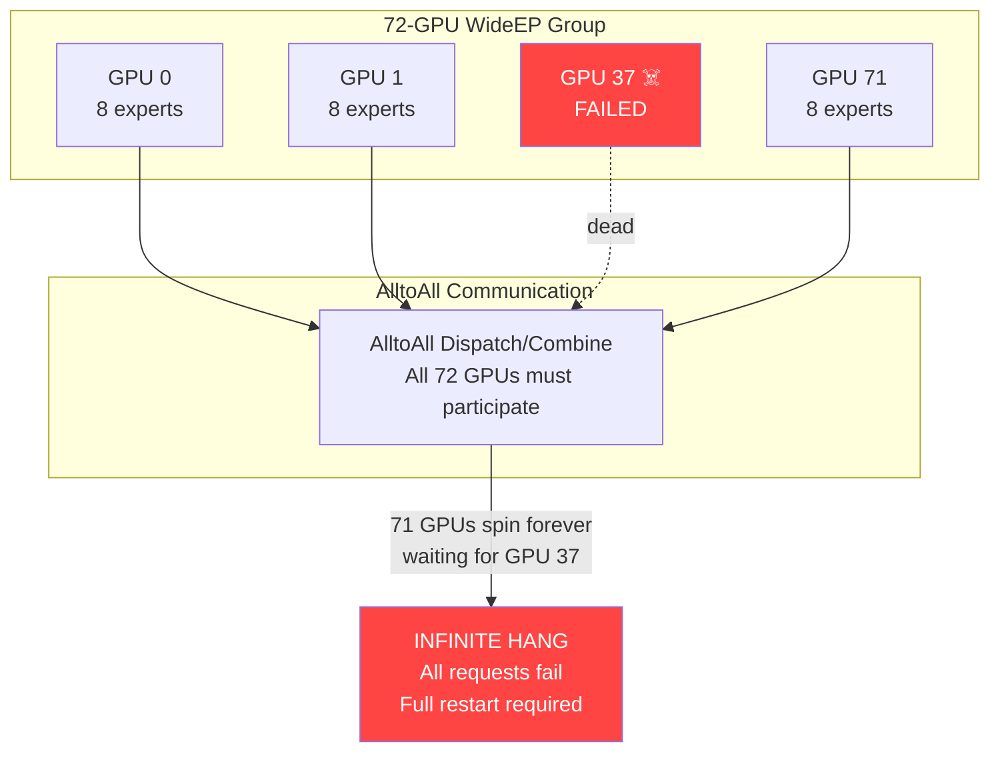

# 1. Background and Motivation

[< Back to Overview](README.md)

## The WideEP Deployment Model

Standard Expert Parallelism (EP) shards MoE experts within a single node (typically 8 GPUs). **WideEP** extends this across multiple nodes — distributing experts over 32, 64, or even 72 GPUs (a full NVL72 rack). This is necessary for models like DeepSeek-V3/R1 with 256 routed experts and 681GB of weights.

**Typical WideEP configurations:**

| Model | Experts | EP Size | GPUs | Config |
|:------|:--------|:--------|:-----|:-------|
| DeepSeek-V3 | 256 | 32 | 32 (4 nodes) | `tp=32, ep=32, enable_attention_dp=True` |
| DeepSeek-R1 | 256 | 64 | 64 (8 nodes) | `tp=64, ep=64, enable_attention_dp=True` |
| DeepSeek-V3 on NVL72 | 256 | 72 | 72 (1 rack) | `tp=72, ep=72, enable_attention_dp=True` |

With `enable_attention_dp=True`, all GPUs in the WideEP group run **data-parallel attention** (each GPU processes independent requests) but **expert-parallel MoE** (tokens are routed across all GPUs via AlltoAll). This means every MoE layer requires a global AlltoAll collective across the entire EP group.

## The Failure Problem

### Mean Time Between Failures at Scale

At WideEP scale, GPU failures become a statistical certainty:

- A single GPU has an annualized failure rate (AFR) of ~2-5% in datacenter environments
- A 72-GPU NVL72 rack has an expected MTBF of ~3-7 days for at least one GPU failure
- A 128-GPU deployment (2 racks) sees failures every ~1.5-3.5 days

### The Blast Radius Today

When a GPU fails in a WideEP group, the impact is total:

**Current behavior when one GPU dies:**

1. The dead GPU stops responding to AlltoAll dispatch/combine operations
2. NVLink AlltoAll kernels spin on `completion_flags` indefinitely — **no timeout exists**
3. DeepEP/NVSHMEM operations hang indefinitely — no timeout
4. The `HangDetector` fires after **300 seconds** (5 minutes!) and shuts down the entire executor
5. All 71 healthy GPUs are wasted during the 5-minute hang
6. All in-flight requests are lost
7. Full restart takes **2-3 minutes** (weight loading + warmup)
8. Total downtime: **7-8 minutes per GPU failure event**

**Why the hang is infinite:** The NVLink AlltoAll kernels implement synchronization via `completion_flags` — GPU threads spin-wait on flag values written by peer GPUs via symmetric memory P2P writes. Unlike host-side NCCL collectives which eventually time out, these GPU-side spin loops have no cycle counter, no watchdog, and no cooperative abort mechanism. A GPU kernel cannot be "interrupted" from the host once launched. Adding timeout or masking requires modifying the actual CUDA kernel code that coordinates multi-GPU data movement — a category of low-level systems work that very few engineers encounter, and that distinguishes this project from the API-level integration approach taken by competitors.

### The Goodput Impact

For a 72-GPU deployment serving DeepSeek-V3 at ~3500 tokens/sec:

| Failure Frequency | Downtime per Event | Daily Goodput Loss |
|:-----------------|:-------------------|:-------------------|
| 1 failure / 3 days | 8 minutes | ~0.2% |
| 1 failure / day | 8 minutes | ~0.6% |
| 3 failures / day | 8 minutes each | ~1.7% |

These numbers assume independent failures. Correlated failures (e.g., power supply, cooling, NVLink domain) are significantly worse and can cascade.

## Why Now

Three converging trends make WideEP fault tolerance urgent in 2026:

1. **DeepSeek-scale MoE models are the default.** DeepSeek-V3/R1, Qwen3, and similar architectures with 256+ experts require WideEP. Every major inference deployment needs this.

2. **GB200 NVL72 racks amplify the failure domain.** The NVL72 rack is designed for rack-wide WideEP with NVLink interconnect. But a 72-GPU failure domain means the entire rack goes down when one GPU fails.

3. **Competitors have shipped solutions.** SGLang's Elastic EP (March 2026) demonstrates ~6.5s recovery with near-zero steady-state overhead. vLLM's RFC #27774 proposes kernel-level fault tolerance. TRT-LLM's lack of any EP-level fault tolerance is a growing competitive liability.

## The Opportunity

TRT-LLM has a unique advantage that competitors lack: **EPLB (Expert-Level Load Balancing)** with runtime expert replication and host-side weight sharing. EPLB already:

- Maintains redundant expert copies across ranks (hot experts are replicated to multiple slots)
- Stores all expert weights in host shared memory (any rank can load any expert in ~0.1-0.3ms)
- Performs live weight migration between GPU slots at runtime (proven online mechanism)
- Updates routing tables dynamically (GPU-side placement info updated every iteration)

These existing capabilities provide a strong foundation for fault tolerance — the core weight redistribution machinery already exists. What's missing is failure detection, communication-layer resilience, and the orchestration to tie them together.
