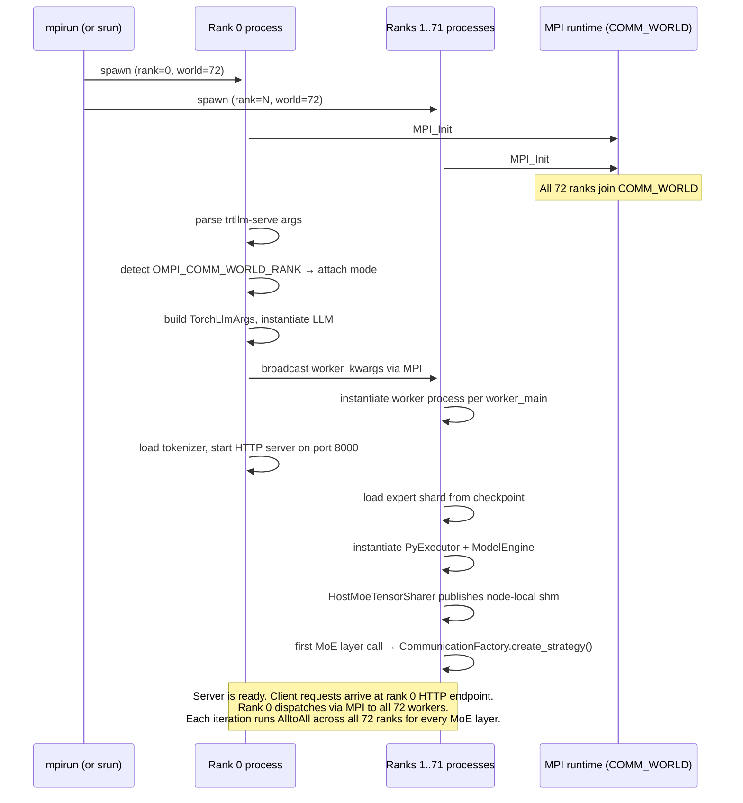
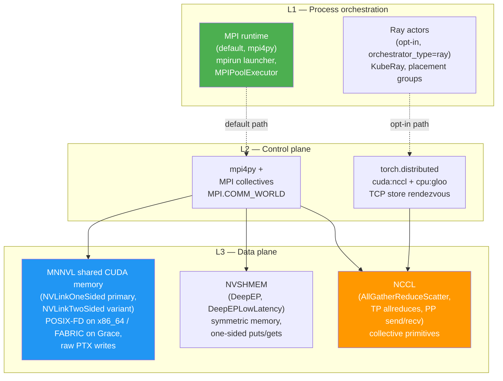

# 1. WideEP Today: User Journey, Stack & Motivation

[< Back to Overview](README.md)

## 1.1 How users run WideEP today

The canonical production scenario is **DeepSeek-V3/R1 on a single GB200 NVL72 rack** with `tp=72, ep=72, enable_attention_dp=True`. This section walks through that scenario end-to-end. Other deployment models are summarized in a table at the end.

### Launch command

```bash
mpirun -np 72 \
  trtllm-serve deepseek-ai/DeepSeek-V3 \
    --tp_size 72 \
    --ep_size 72 \
    --enable_attention_dp \
    --backend pytorch \
    --port 8000
```

Verified against current source (`tensorrt_llm/commands/serve.py`, 1463 LOC). Two launch paths exist: (a) `mpirun -np N trtllm-serve …` *attaches* to a pre-existing MPI world that `mpirun` set up — `serve.py:1211` checks `OMPI_COMM_WORLD_RANK` and uses `MPICommExecutor` (`serve.py:1244, 1292`); (b) running `trtllm-serve` from a single shell *spawns* its own workers via `MpiPoolSession` → `MPIPoolExecutor` (`mpi_session.py:178`). The `mpirun`-attach path is the production default. Both paths end up at the same `GenerationExecutorProxy` in `tensorrt_llm/executor/proxy.py`.

### What spawns and in what order



Concretely, on a 72-rank NVL72 launch:

1. **MPI runtime** initializes `MPI.COMM_WORLD` with 72 ranks. Each rank is one OS process bound to one GPU.
2. **`trtllm-serve` entry point** (`serve.py`) detects the existing MPI world and attaches via `MPICommExecutor`.
3. **Per-rank instantiation:**
   - `LLM` API constructor (`tensorrt_llm/llmapi/llm.py:225–256`) creates an `MpiCommSession` (since MPI is already up) — *not* a `MpiPoolSession`, which would re-spawn workers.
   - `GenerationExecutorProxy` (`proxy.py:38`) wraps the MPI session as the executor abstraction.
   - On each rank, `PyExecutor` and `ModelEngine` instantiate; the model loads its expert shard from the checkpoint.
4. **MoE-specific setup:**
   - `MoeLoadBalancer` per layer instantiates with a `MoeLoadBalanceMetaInfo` (`expertCount=256, topK=8, epRank=R, epSize=72, slotCountPerRank=4`).
   - `HostMoeTensorSharer` (`moe_load_balancer.py:127`) publishes node-local POSIX shm segments containing all in-node expert weights, using `global_mpi_comm.Split_type(MPI.COMM_TYPE_SHARED)` to discover node-local peers (`moe_load_balancer.py:896–897`). Every rank on a node attaches to every peer's shm segment.

   The canonical numbers are an important admission constraint: `72 ranks × 4 slots/rank = 288 slots` for 256 experts, so there are only 32 slots beyond one copy per expert. Even with ideal allocation, at least 224 experts are singleton. Therefore neither this configuration nor `num_redundant_experts=32` implies “replication ≥ 2.” Even a larger slot budget would be insufficient proof unless placement also keeps copies on distinct admitted failure domains. Item 1b.2a verifies that invariant per layer before FT serving is enabled.
5. **AlltoAll backend selection** — runs lazily on the first MoE layer call:
   - `CommunicationFactory.create_strategy()` (`tensorrt_llm/_torch/modules/fused_moe/communication/communication_factory.py`) picks based on hardware capabilities.
   - On NVL72 with full MNNVL fabric connectivity → **NVLinkOneSided** (priority 1).
   - Falls through to NVLinkTwoSided / DeepEP / DeepEPLowLatency / AllGatherReduceScatter only if NVLinkOneSided is unavailable.
6. **Symmetric workspace allocation:**
   - `MnnvlMemory` (`tensorrt_llm/_mnnvl_utils.py`) allocates fabric-visible CUDA memory via `cuMemCreate(..., CU_MEM_HANDLE_TYPE_FABRIC, ...)`.
   - Every rank exchanges fabric handles over MPI and maps every peer's region into its address space.
   - The `completion_flags[kMaxRanks][kMaxRanks]` table sits in this symmetric memory; this is the table the AlltoAll kernel will spin on.
7. **Server is ready.** Rank 0 listens on port 8000.

**Rank-0 scope.** In this launch shape rank 0 owns the only HTTP listener. Killing rank 0 therefore loses the frontend even if ranks 1–71 recover correctly. The MVP physical E2E test kills a non-rank-0 worker. Supporting rank-0 failure requires an external proxy/listener or frontend failover and must not be implied by worker-survival results; item 1d.1 makes this policy an explicit admission gate.

### What lives where on each rank, in steady state

| Resource | Owner | Lifetime |
|:---|:---|:---|
| MPI process / Python interpreter | OS | Process life |
| CUDA context | one per rank | Process life |
| Expert-shard model weights (~9.5 GB FP8 for DS-V3 / EP=72) | one rank | Process life |
| Per-request KV cache (attention-DP, so per rank) | local | Per-request |
| `MoeLoadBalancer` + `MoePlacementInfo` | one per MoE layer per rank | Process life |
| `HostMoeTensorSharer` shm segment | node-local POSIX shm | Process life (`shm_unlink` on exit) |
| MNNVL workspace + `completion_flags` | rank's symmetric heap, mapped by all peers | Process life |
| `MPI.COMM_WORLD` | shared | Process life |

### Other deployment models (summary)

| Model | Layout | Status |
|:---|:---|:---|
| **Aggregated multi-node MPI (SLURM)** | `srun -n 72 trtllm-serve …` across 2–8 nodes; same MPI-attach launch path | Production-supported, but FT follows the selected L3 transport: MNNVL uses the corrected MVP path, DeepEP-family cross-IB uses Phase 1-IB, and NCCL fallback uses 1a.7 |
| **Aggregated K8s + Ray** | `--orchestrator_type ray`; KubeRay manages cluster; `torch.distributed` over TCP store + NCCL/Gloo | Functional CI exists at TP ≤ 4 (Llama-3.1 8B); **not characterized at WideEP scale** — see [§2.1](02-stack-comparison-and-positioning.md) |
| **Disaggregated serving (MPI)** | Separate prefill / decode pools, KV cache transferred via NIXL / UCX / MPI transceiver, `trtllm-serve` proxy routes between pools | Production-supported |
| **Disaggregated + Ray (non-NIXL)** | Ray-managed pools with UCX/MPI transceiver | Supported; covered by `examples/test_ray.py::test_ray_disaggregated_serving` |
| **Disaggregated + Ray + NIXL** | Ray-managed pools with NIXL transceiver | **Not supported today** — explicit waive at `tests/integration/defs/disaggregated/test_disaggregated.py:597` |
| **Aggregated B200 NVL8 + IB** | 8-GPU B200 nodes networked by InfiniBand; AlltoAll via DeepEP family (`DeepEPLowLatency` NVFP4 is the measured-best variant) because cross-node NVLink isn't up | Perf work in flight (May 2026, Peiheng Hu); FT story = Phase 1-IB, gated on Audit 3 NIXL-EP outcome or a DeepEP-side mitigation. See [§8.2 Phase 1-IB](pr-execution/08-implementation-plan.md#phase-1-ib--cross-ib-transport-coverage-nixl-ep-track) |
| **Standard EP (≤ 8 GPUs)** | Usually single-node, `ep_size ≤ 8`; MNNVL availability depends on the platform and selected backend | Out of scope because WideEP availability is the target, not because MNNVL is necessarily absent; existing restart handling is the baseline |

### Transport selection: what TRT-LLM actually picks today

`CommunicationFactory.create_strategy()` (`tensorrt_llm/_torch/modules/fused_moe/communication/communication_factory.py:131-213`) runs a try-catch fall-through on the first MoE layer call. **The deployment doesn't pick the transport directly — the substrate does, via the MNNVL gate.**

| Priority | Backend | Gate | Selected when |
|:---:|:---|:---|:---|
| 1 | `NVLinkOneSided` | `MnnvlMemory.supports_mnnvl()` returns True (`_mnnvl_utils.py:380-387`; check is "all NVLink up") | Single 8-GPU NVL-class node *or* GB200/GB300 NVL72 rack — any topology where intra-fabric NVLink is fully up |
| 2 | `NVLinkTwoSided` | Same MNNVL gate | Same as priority 1; secondary attempt |
| 3 | `DeepEP` | `TRTLLM_CAN_USE_DEEP_EP=1` + `act_dtype == bfloat16` | Cross-IB / cross-fabric peers (no MNNVL); NVSHMEM-based |
| 4 | `DeepEPLowLatency` | Same as DeepEP | DeepEP construction failed; uses NVSHMEM + IBGDA; production choice for multi-node B200+IB per Peiheng's deck |
| 5 | `AllGatherReduceScatter` | always | Safety net; NCCL fallback when DeepEP unavailable |

**Implication: the "transport in use" determines the relevant FT mechanism, not the deployment name.** A single 8-GPU NVL-class B200 box and a 72-GPU NVL72 rack can both select `NVLinkOneSided`, so both need the #13404 next-launch mask, 1a.8 running-kernel escape, admitted EPLB placement, and atomic survivor commit. The rack additionally requires 1d.4a FABRIC/IMEX acceptance. Multi-node B200+IB can fall through to `DeepEPLowLatency` and therefore has a different Phase 1-IB story.

**Note on topology symmetry.** Even on NVL72, the fabric is not perfectly BW-symmetric: intra-tray pairs share direct NVLink, cross-tray pairs route through NVSwitch chips (multi-hop), and EPLB workload skew on top creates *effective* per-rank-pair asymmetry even when the *physical* fabric is uniform. B200 NVL8 + IB just makes the asymmetry larger and more measurable (18× peak-BW gap NVL vs IB per Peiheng's deck). Heterogeneous-topology behavior is a property of every WideEP deployment, with different magnitude across rows above. [§7.5](07-phase-3-beyond-failover.md#75-straggler-mitigation-forward-looking) and the [straggler-speculation research arm](straggler-speculation-research/README.md) frame this generally rather than NVL72-specifically.

## 1.2 The stack at each layer

WideEP execution sits on a three-layer stack. The same workload (an AlltoAll across 72 ranks) involves cooperation between all three layers, but each can fail independently and each has its own FT properties.



### L1 — Process orchestration

Who launches workers, who keeps track of liveness, who reacts when one dies.

| | MPI (default) | Ray (opt-in) |
|:---|:---|:---|
| Launcher | `mpirun -np N` / `srun` | `ray start` head + workers / KubeRay operator |
| Process abstraction | OS processes, MPI ranks | Ray actors |
| Liveness signal | None at runtime — relies on MPI signal handlers (`mpiUtils.cpp:199–210`) calling `MPI_Abort(MPI_COMM_WORLD, EXIT_FAILURE)` on signal; one variant additionally `kill(getppid(), SIGKILL)` | Ray's actor death notifications, independent per-actor |
| Python pool | `MPIPoolExecutor` (`mpi_session.py:178`) | Ray remote actors via `RayExecutor` (`tensorrt_llm/executor/ray_executor.py`) |
| Failure isolation | None — single failure aborts the world | Per-actor — surviving actors keep running |

The MPI path is the production default. The Ray path is opt-in via `orchestrator_type="ray"` (`llm_args.py:2903`); enabling it sets `TLLM_DISABLE_MPI=1` and routes through `RayExecutor` instead of `GenerationExecutorProxy`.

### L2 — Control plane

How processes coordinate before the data plane runs: rendezvous, bootstrap, barriers, NCCL unique-ID broadcast.

| | MPI default | Ray opt-in |
|:---|:---|:---|
| Wrapper | `mpi4py` over `MPI.COMM_WORLD` | `torch.distributed.init_process_group(backend="cuda:nccl,cpu:gloo")` |
| Rendezvous | MPI runtime supplies | TCP store |
| FT primitives | None wired in TRT-LLM today (zero non-test uses of `MPI_ERRORS_RETURN`, `MPI_Comm_revoke`, ULFM) | Inherits PyTorch's `destroy_process_group` + `init_process_group` abort/rebuild support |
| Failure visibility | Slow / dead peer poisons `MPI.COMM_WORLD` | `torch.distributed` collectives raise on abort |

The table hides a critical runtime detail: attention-DP/PyExecutor performs ordinary management collectives over static MPI groups, not only one-time bootstrap. The MPI path uses blocking `Allgather`/`Allgatherv`-style exchanges for rank state, new requests, batch sizes, token counts, and model inputs. A dedicated FT notification subcommunicator can report a death, but it does not make those existing collectives safe. Item 1c.3a creates a survivor-only control communicator and logical-to-physical `ActiveRankMap`; item 1c.4a moves the attention-DP/PyExecutor exchanges onto that membership before serving resumes.

### L3 — Data plane

The actual high-throughput tensor movement during inference. **Three different libraries live here**, used by different EP backends.

| Backend | Underlying library | Used by which EP strategy | FT primitive availability |
|:---|:---|:---|:---|
| **MNNVL fabric memory** | CUDA driver `cuMemCreate` (no library above) | `NVLinkOneSided` (priority 1, NVL72 primary), `NVLinkTwoSided` | Custom kernel — **TRT-LLM owns the synchronization protocol** (the `completion_flags` table). No library to provide abort/timeout. We add it ourselves in §5. |
| **NVSHMEM** | NVIDIA's GPU OpenSHMEM impl | `DeepEP`, `DeepEPLowLatency` (via DeepEP library) | No clean rebuild story on shipping versions; `Buffer.__del__` → `intranode::barrier` is a known deadlock (TRT-LLM Python wrappers acknowledge this at `deep_ep.py:86`, `deep_ep_low_latency.py:103`, `configurable_moe.py:422`). `mask_buffer_ptr` parameter referenced in vLLM RFC #27774 is not in DeepEP's public API. |
| **NCCL** | NVIDIA Collective Comm Library | `AllGatherReduceScatter` (fallback EP), TP allreduces, PP send/recv via `NcclCommunicatorOp` | Has `ncclCommAbort()` + new-comm-creation pattern. **Wired in PyTorch's `torch.distributed`; not wired in TRT-LLM's custom NCCL ops** (zero non-test uses of `ncclCommAbort` / `NCCL_ASYNC_ERROR_HANDLING` / `ncclCommFinalize` / `ncclGetLastError`). |

Critically: **NVLinkOneSided does not use NCCL or NVSHMEM.** It uses MNNVL fabric memory directly with custom CUDA kernels written in TRT-LLM. The completion-flag table that the AlltoAll kernel spins on is ours; the synchronization protocol is ours; the FT semantics are ours to add.

### What's shared, what's not

It's natural to assume MNNVL, NCCL, NVSHMEM (and **NIXL**, which TRT-LLM uses as the L3 path for disaggregated KV cache transfer; vLLM additionally uses a "NIXL-EP" variant as an EP-level data plane with incremental `connect_ranks` / `disconnect_ranks` topology mutation — see vLLM PR #35627) share more than they do. They share the **physical fabric** (NVLink + NVSwitch + MNNVL pages on NVL72, plus IB / RoCE for cross-rack) and the **CUDA driver substrate** (`cuMem*`, streams, contexts, GPU memory subsystem). NCCL on NVL72 will in fact choose MNNVL fabric pages as its transport when available — the same hardware that NVLinkOneSided uses directly. So in terms of where the bytes ultimately move, all four can hit the same fabric.

What they *don't* share:

- **API surface.** Different libraries with different programming models. You can't pass a `ncclComm_t` to NIXL, or a NIXL transfer handle to NVSHMEM.
- **Synchronization model.** MNNVL writes raw PTX against a `completion_flags` table in symmetric memory — the kernel itself is the synchronization. NCCL has internal stream-based sync. NVSHMEM has symmetric quiet/fence primitives. NIXL has a transfer state machine with explicit `PENDING / PROCESSING / DONE / ERROR` states.
- **Failure-reporting story.** NCCL exposes `ncclCommGetAsyncError` + `ncclCommAbort`. NIXL exposes `check_xfer_state` and surfaces `RuntimeError("NIXL transfer failed: …")` on error. NVSHMEM has limited error-reporting support on shipping versions. **MNNVL has no library-level error API — we own the kernel, and there's nothing above us to surface a failure.** This is the unique constraint that justifies the host-side AlltoAll watchdog ([§5.3](05-phase-1-immediate-survival.md#53-failure-detection--pr-12718-integration)).

Net: same hardware can move bytes through any of these stacks; FT engineering for each is genuinely independent work, with very different existing primitives to build on.

**Backend admission is explicit.** Enabling the feature cannot assume that `CommunicationFactory` selected the intended implementation. Item 1d.1 records and validates the selected backend and fails closed for unsupported DeepEP-family, MegaMoE, static-sharding, launcher, or fabric combinations. A fallback backend must never silently bypass the recovery contract.

### What the layers don't do

A common confusion is to expect FT at every layer. The three layers cooperate but do not substitute for one another:

- L1 alone (Ray killing one actor while keeping others alive) does not fix a Q2 live/silent AlltoAll kernel — that's an L3 problem.
- L3 alone (kernel rank masking) does not preserve survivors when a handler or launcher terminates the MPI job in Q1/Q3 — that's an L1 problem.
- A complete FT solution **must address both layers** and the peer-memory readability axis; the Q1–Q4 model in §3 keeps process evidence, kernel progress, and physical containment distinct.

[§3](03-failure-modes-and-gaps.md) makes this explicit by mapping each quadrant and mechanism to the layer where it lives.

## 1.3 Why fault tolerance now

WideEP fault tolerance is a 2026 priority because three trends converged.

### Daily-failure regime

At WideEP scale, GPU failures become a statistical certainty. With per-GPU annualized failure rates of 2–5 % in datacenter environments:

| Deployment | GPUs | Expected MTBF (≥ 1 GPU failure) |
|:---|---:|:---|
| Single NVL72 rack | 72 | 3–7 days |
| Two-rack deployment | 144 | 1.5–3.5 days |
| Multi-tenant production cluster | 500+ | Multiple failures per day |

These numbers assume independent failures. Correlated events (power, cooling, an NVLink domain) cascade and are worse.

### Today's blast radius is total

When a GPU fails in a WideEP group, the impact is full-cluster:

1. The dead GPU stops responding to AlltoAll dispatch/combine. The remaining 71 ranks' kernels spin on `completion_flags[37]` indefinitely — **the kernel has no host-visible abort hook**, only the 300-second in-kernel `check_timeout` (`moeAlltoAllKernels.cu`) that ends in `asm volatile("trap;")`, which corrupts the surviving CUDA contexts.
2. Or, depending on what killed rank 37, MPI's signal handler at `mpiUtils.cpp:199–210` calls `MPI_Abort(MPI_COMM_WORLD, EXIT_FAILURE)`, which immediately kills every other rank. One variant additionally `kill(getppid(), SIGKILL)`.
3. The `HangDetector` fires only after **300 seconds** (5 minutes) and shuts down the entire executor.
4. All 71 healthy GPUs are wasted during the hang; all in-flight requests are lost.
5. Full restart cost is deployment-dependent:
   - **~3–5 min** if the model checkpoint is already on local NVMe and caches are hot (weight reload + NCCL init + MNNVL fabric setup + warmup).
   - **~5–15 min** if shards must be fetched from cluster shared storage with cold caches.
   - **15+ min, occasionally 30+ min** if the 681 GB checkpoint has to be re-downloaded from registry or object store. Cluster network bandwidth (typically 10 Gbps ≈ 1.25 GB/s aggregate per node) is the bottleneck; retries on flaky storage push this much higher.
   - The 681 GB DS-V3 footprint dominates restart cost; smaller MoEs scale down proportionally.

**Total downtime: 8–20+ minutes per GPU failure** (the current 300 s kernel timeout plus 3–15+ min restart on the live/silent path). Worst cases can stretch past 30 minutes when checkpoint download is on the critical path or registry retries compound. [§3](03-failure-modes-and-gaps.md) classifies Q1–Q4 and then maps the handler/launcher, kernel-progress, and peer-memory mechanisms separately.

### Goodput impact at scale

For a 72-GPU deployment serving ~3500 tokens/sec, using a typical-case ~12 min per failure event (caches warm, model on cluster shared storage):

| Failure frequency | Downtime per event | Daily goodput loss (typical) | Daily goodput loss (worst case, 20+ min/event) |
|:---|:---|:---|:---|
| 1 / 3 days | ~12 min | ~0.3 % | ~0.5 % |
| 1 / day | ~12 min | ~0.8 % | ~1.4 % |
| 3 / day | ~12 min each | ~2.5 % | ~4.2 % |

Sustained even at the low-frequency end, this is a real production headwind. Customer SLAs that promise availability within a 9s budget become difficult to honor.

### Competitive pressure

| Framework | FT status (May 2026) |
|:---|:---|
| **SGLang Elastic EP** | Shipped March 2026. ~6.5s recovery, tolerates up to 50 % rank loss. Built on Mooncake EP's `activeRanks` API. A more sophisticated three-plane FT framework (data / control / decision plane) is proposed in an [RFC on a personal fork](https://github.com/gaidandawang-afk/sglang/issues/1) — not yet on the official `sgl-project/sglang`. |
| **vLLM** | Three-PR FT framework in flight (Ray + internal LB only): [#34833](https://github.com/vllm-project/vllm/pull/34833) (fault reporting via ZMQ sentinels), [#38534](https://github.com/vllm-project/vllm/pull/38534) (pause-on-error with a DeepEP-specific 100s timeout interim and separate NIXL-EP topology mutation), [#40468](https://github.com/vllm-project/vllm/pull/40468) (cleanup + retry: NCCL `commAbort`, DP cpu_group rebuild, prefix-cache-driven retry without replacement rank — operates at N-1 indefinitely). Earlier RFC [#27774](https://github.com/vllm-project/vllm/issues/27774) is the published framing; PRs above are the implementation. |
| **Ray 2.55 DP-group FT** | Shipped. Coarse — restarts whole DP groups, not per-rank. |
| **TRT-LLM** | **Nothing.** Single GPU failure → 8–20+ min downtime, no in-place recovery. |

Three observations from the May 2026 survey:

- **Convergent control shape, different data planes.** vLLM and SGLang are converging on report → pause → cleanup/retry and similar HTTP+ZMQ control surfaces, but not one backend: SGLang uses Mooncake `activeRanks`, while vLLM Elastic-EP documents `allgather_reducescatter` plus optional NIXL-EP and its FT work separately treats DeepEP timeout handling. Aligning `check_health()` (1d.2) and replacement APIs remains useful without claiming backend equivalence.
- **Both target Ray, not MPI.** vLLM #34833 explicitly: "Elastic EP currently supports only Ray + internal LB." SGLang RFC also Ray-based. Strengthens the long-term Ray-pivot argument; doesn't change our MPI-for-MVP decision (see [§3.3](03-failure-modes-and-gaps.md#33-why-not-just-pivot-to-ray)).
- **vLLM operates at N-1 indefinitely.** No Phase-2-equivalent (no replacement-rank rebuild). Our Phase 2 is differentiated work, not table stakes.
- **NIXL-EP is vLLM's FT-enabled backend choice.** PR #38534 lists DeepEP and NIXL-EP as the two FT-enabled backends, while merged PR #35627 exposes the verified NIXL-EP topology API. TRT-LLM is launching a bounded 2-week parallel evaluation track ([§9.1 Audit 3](09-risks-and-open-questions.md#audit-3--nixl-ep-evaluation-as-cross-ib-data-plane-backend)) to decide whether NIXL-EP slots into Phase 1-IB as a topology-mutable cross-IB backend using `disconnect_ranks` / `connect_ranks`. It is not on the NVL72 MVP critical path.

[§2](02-stack-comparison-and-positioning.md) compares the stacks at the layer level (not just the FT capabilities) and identifies what TRT-LLM's stack uniquely enables.

### Where this design starts

The next section establishes that TRT-LLM's stack has structural advantages competitors don't have — primarily **kernel ownership** of the primary data-plane backend — that make a particular kind of FT design natural for TRT-LLM in a way that wouldn't translate to vLLM or SGLang. After that, [§3](03-failure-modes-and-gaps.md) maps the gaps to layers, [§4](04-architecture-overview.md) introduces the three-phase architecture, and [§5–§7](05-phase-1-immediate-survival.md) detail each phase.
