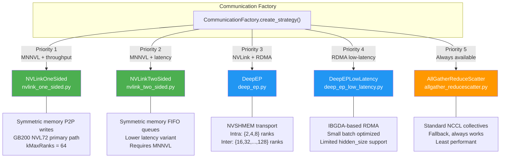
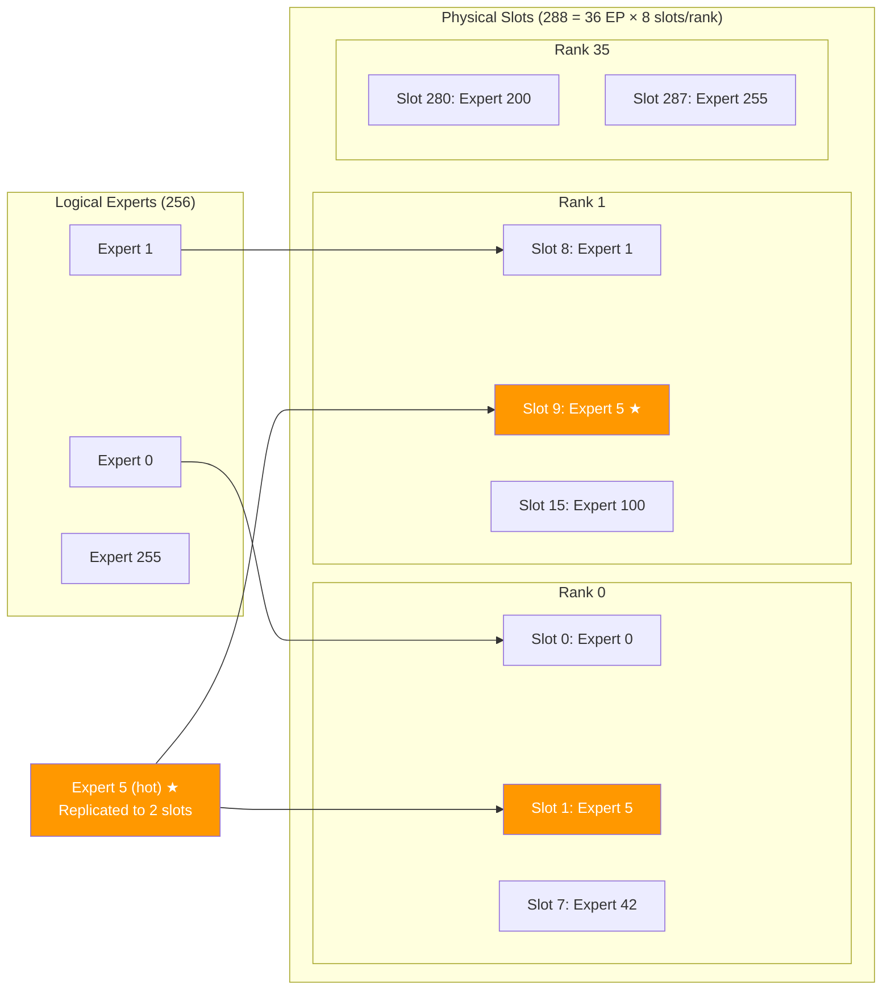
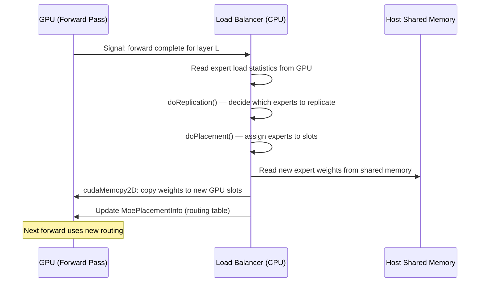

# 2. Current State Analysis

[< Back to Overview](README.md)

## WideEP Architecture in TRT-LLM

### Communication Backends

WideEP uses a pluggable communication architecture with five AlltoAll strategies, auto-selected based on hardware capabilities:

**Key files:**
- Communication factory: `tensorrt_llm/_torch/modules/fused_moe/communication/communication_factory.py`
- NVLink one-sided: `tensorrt_llm/_torch/modules/fused_moe/communication/nvlink_one_sided.py`
- NVLink two-sided: `tensorrt_llm/_torch/modules/fused_moe/communication/nvlink_two_sided.py`
- DeepEP: `tensorrt_llm/_torch/modules/fused_moe/communication/deep_ep.py`
- C++ AlltoAll kernels: `cpp/tensorrt_llm/kernels/communicationKernels/moeAlltoAllKernels.h`

### EPLB Architecture

EPLB decouples logical experts from physical GPU slots, enabling hot expert replication and live weight migration:

**Key components:**

| Component | File | Role |
|:----------|:-----|:-----|
| `MoeLoadBalancer` | `_torch/modules/fused_moe/moe_load_balancer.py:842` | Global load balancer, wraps C++ `_tbr.MoeLoadBalancer` |
| `SingleLayerMoeLoadBalancer` | `moe_load_balancer.py:374` | Per-layer routing and weight management |
| `HostMoeTensorSharer` | `moe_load_balancer.py:127` | POSIX shared memory for all expert weights on host |
| `MoeLoadBalancerConfig` | `llm_args.py:432` | Configuration: `num_slots`, `initial_global_assignments`, `layer_updates_per_iter` |
| `doReplication()` | C++ `moeLoadBalancer.cpp:57` | Greedy priority-queue algorithm for expert replication |
| `doPlacement()` | C++ `moeLoadBalancer.cpp:124` | Assigns replicated experts to physical slots across ranks |

**Online EPLB weight migration flow (per iteration):**

**Critical property for fault tolerance:** `HostMoeTensorSharer` loads ALL expert weights into POSIX shared memory at startup. Every rank on the same node can access any expert's weights. This means when a rank dies, its experts' weights are already available on host — surviving ranks can load them in ~0.1-0.3ms per expert via gdrcopy.

### Failure Modes by Backend

| Backend | Failure Behavior | Timeout? | Recovery Path |
|:--------|:----------------|:---------|:-------------|
| NVLinkOneSided | Combine kernel spins on `completion_flags[dead_rank]` | **None** — infinite spin | Requires CUDA kernel modification to add rank masking to symmetric memory completion flag protocol |
| NVLinkTwoSided | FIFO queue polling hangs waiting for dead rank | **None** — infinite spin | Same — these are custom CUDA kernels using symmetric memory P2P writes; modifying their synchronization behavior requires understanding multi-GPU memory ordering and completion flag protocols |
| DeepEP | NVSHMEM operations hang indefinitely | **None** | `mask_buffer_ptr` planned but not public |
| DeepEPLowLatency | Same as DeepEP | **None** | Same; also only supports specific rank counts |
| AllGatherReduceScatter | NCCL timeout (~30min default) | **30 min** (unusable) | Requires process group reconstruction |

### Current Fault Tolerance Infrastructure

**What exists (from [PR #12718](https://github.com/NVIDIA/TensorRT-LLM/pull/12718), currently in review).** The table below summarizes the primitives; the per-EP-rank extensions built on top of them are specified in [§07](07-failure-detection.md). Note that PR #12718's commits are not yet on the `docs-and-plans` branch HEAD — see [§07 status callout](07-failure-detection.md#overview) for the sequencing implication.

| Mechanism | What It Does | Limitation for WideEP |
|:----------|:-------------|:---------------------|
| Three-tier error classification | `immediate_fatal` / `severe` / `transient` | No EP-specific error patterns |
| Token-bucket `ErrorBudget` | Rate-limits error impact; prevents single transient from killing server | All-or-nothing: entire executor is fatal or healthy |
| `charge_budget=False` for request-scoped errors | KV transfer timeouts don't poison server health | Could extend to EP routing failures |
| `_check_mpi_futures()` | Detects individual MPI worker death | Per-worker, not per-EP-rank granularity |
| `_error_monitor_loop()` | 5s background polling for worker crashes | Detects worker death, but triggers full shutdown |
| Fatal shutdown drain | Drains `active_requests`, `waiting_queue`, `executor_request_queue` | Drains everything, not just requests affected by dead rank |

**What does not exist (each representing a distinct design challenge):**

- **Per-EP-rank health tracking** — requires extending the executor's binary health model (healthy/fatal) to a per-rank vector, with independent error budgets per rank
- **Partial failure concept** — today, fatal = shut everything down; WideEP FT needs "fatal for rank 37, but ranks 0-36 and 38-71 are fine" — a fundamentally new failure semantics
- **AlltoAll timeout or abort mechanism** — the GPU kernels spin forever; adding timeout requires either kernel modification (hard, interacts with memory ordering) or host-side watchdog (new thread monitoring GPU-side completion flags)
- **Expert redistribution on topology change** — EPLB's C++ core assumes immutable topology; enabling dynamic reconfiguration requires pausing concurrent threads, reallocating arrays, and migrating weights across 58 MoE layers without corrupting routing state
- **Process group reconstruction** — NCCL/NVSHMEM/MPI all assume collective participation from all original ranks; rebuilding with a dead rank risks deadlocks at every layer of the communication stack
- **Failure broadcast consensus** — surviving ranks must agree on the dead set without the dead rank's participation, a variant of the failure detection problem in asynchronous distributed systems
