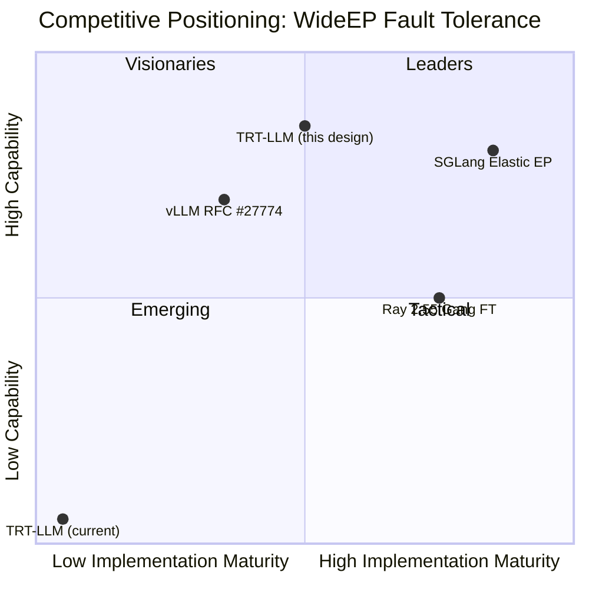

# 3. Competitive Landscape

[< Back to Overview](README.md)

## Overview

WideEP fault tolerance is an active area of development across all major LLM inference frameworks. As of April 2026, SGLang has shipped a production solution, vLLM has an RFC in progress, and Ray provides orchestration-level group management. TRT-LLM has no EP-level fault tolerance.

## SGLang: Elastic EP (Shipped, March 2026)

**Reference:** [LMSYS Blog: Elastic EP in SGLang](https://www.lmsys.org/blog/2026-03-25-eep-partial-failure-tolerance/)

SGLang's Elastic EP is the current state-of-the-art for WideEP fault tolerance in production. Key design decisions:

### Architecture

- **Two-layer approach:** Scheduler layer filters out failed ranks (no new batches routed to them); EP layer handles expert redistribution.
- **No process group reconstruction:** Uses Mooncake EP backend with `activeRanks` masking — the AlltoAll dispatch/combine simply skips dead ranks. This avoids the hardest technical problem entirely.
- **Redundant experts:** Configured via `--ep-num-redundant-experts`. DeepSeek-V3.2 benchmarked with 256 redundant experts across 32 GPUs, tolerating up to 16 simultaneous rank failures.
- **RDMA timeout-based detection:** Mooncake EP detects unresponsive ranks via GPU Direct RDMA timeouts.

### Performance

| Metric | Value |
|:-------|:------|
| Recovery time | ~6.5s (consistent regardless of # failed ranks) |
| Steady-state overhead | Near-zero (3560 vs 3626 tok/s, ~1.8% overhead) |
| Max tolerated failures | Up to 16/32 ranks (50% of cluster) |
| Process group rebuild | Not required (Mooncake masking) |

### Key PRs
- `sgl-project/sglang#10423` — Mooncake Backend for EP
- `sgl-project/sglang#10606` — Core Elastic EP + EPLB with faulty rank handling
- `sgl-project/sglang#11657` — Scheduler-layer filtering of failed ranks

### Strengths and Limitations

| Strengths | Limitations |
|:----------|:-----------|
| Production-ready, shipped | Requires Mooncake EP backend (not portable to other AlltoAll implementations) |
| Near-zero steady-state overhead | No full restoration path (permanently runs at N-k ranks) |
| Tolerates massive failures (50% cluster) | Tied to SGLang's scheduling model |
| Constant recovery time regardless of failure count | No proactive/predictive failure detection |

## vLLM: RFC #27774 — Fault-Tolerant EP (In Progress)

**Reference:** [vLLM RFC #27774](https://github.com/vllm-project/vllm/issues/27774)

vLLM takes a different philosophical approach: "Fault tolerance IS load balancing."

### Architecture

- **Three-phase recovery:**
  1. **Detection:** Monitor per-expert latency via CUDA events. Flag unhealthy when latency exceeds 3x median (configurable `health_latency_threshold`).
  2. **Penalization:** Unhealthy experts receive 10x weight penalty in EPLB routing, naturally shifting traffic to healthy replicas.
  3. **Recovery:** Elastic scale-down (remove failed rank) then scale-up (add replacement), followed by EPLB rebalancing.

- **Kernel-level masking:** Requires communication backend support for rank masking:

| Backend | Masking Support |
|:--------|:---------------|
| Mooncake EP | `activeRanks` parameter — supported |
| DeepEP | `mask_buffer_ptr` — planned, not public |
| pplx-kernels | No support — will hang |

- **Detection window:** 100-1000 forward passes (`EPLBConfig.window_size`) for statistically reliable failure detection.

### Status

| Milestone | Status |
|:----------|:-------|
| RFC | Published |
| Milestone 1 (elastic EP basic) | PR #20775 merged |
| Milestone 2 (rebalancing) | PR #26278 in progress |
| Fault-tolerant EP | Not started |

### Strengths and Limitations

| Strengths | Limitations |
|:----------|:-----------|
| Elegant: FT naturally falls out of EPLB | RFC stage — no production validation |
| Latency-based detection catches degradation before full failure | Requires kernel-level masking (limited backend support) |
| Full restoration via elastic scale-up/down | 100-1000 forward pass detection window may be too slow for sudden failures |

## Ray 2.55: DP Group Fault Tolerance (Shipped)

**Reference:** [Ray 2.55 Fault Tolerance for WideEP](https://blockchain.news/news/ray-255-fault-tolerance-vllm-wideep-deployments)

Ray 2.55 provides orchestration-level fault tolerance that complements engine-level solutions:

- **Atomic DP group management:** Treats each DP (Data Parallel) group as a single unit. If any GPU fails, the entire group is torn down and rebuilt.
- **Gang scheduling:** All GPUs in a group are co-scheduled; partial failure triggers full group recovery.
- **Transparent to inference engine:** No code changes required in vLLM/SGLang/TRT-LLM.

### Strengths and Limitations

| Strengths | Limitations |
|:----------|:-----------|
| Zero engine changes required | Coarse granularity: entire DP group restarts even for one GPU failure |
| Works with any inference framework | Does not help within a WideEP group (all GPUs in one group) |
| Production-proven (shipped default) | Full restart = minutes of downtime |

**Important limitation for WideEP:** Ray 2.55's DP group fault tolerance operates at the group level, not the rank level. In a WideEP deployment where all 32-72 GPUs form a single EP group, a single GPU failure still requires rebuilding the entire group. This is better than nothing (automated recovery vs. manual restart) but does not provide the sub-second partial-failure tolerance that SGLang's Elastic EP achieves.

## DeepSeek Production

**Reference:** [DeepSeek Open Source Week Day 6](https://github.com/deepseek-ai/open-infra-index/blob/main/202502OpenSourceWeek/day_6_one_more_thing_deepseekV3R1_inference_system_overview.md)

DeepSeek operates the largest known WideEP deployment:

- **Scale:** Peak 278 nodes (2,224 H800 GPUs), 608B input tokens/day
- **Prefill:** EP32 across 4 nodes, 32 redundant routed experts (9 experts per GPU + 1 shared)
- **Decode:** EP144 across 18 nodes, 32 redundant routed experts (2 experts per GPU + 1 shared)
- **Fault tolerance:** Details undisclosed, but the 32 redundant experts suggest a redistribution strategy similar to SGLang's approach

DeepSeek's open-source [DeepEP library](https://github.com/deepseek-ai/DeepEP) does not currently include fault-tolerance masking features in its public API. The `mask_buffer_ptr` parameter referenced in vLLM's RFC appears to be planned/unreleased functionality.

## Feature Comparison Matrix

| Feature | SGLang | vLLM (RFC) | Ray 2.55 | TRT-LLM (Current) | TRT-LLM (This Design) |
|:--------|:-------|:-----------|:---------|:-------------------|:-----------------------|
| Failure detection | RDMA timeout | CUDA event latency | Orchestrator health check | 300s HangDetector | Per-EP-rank health + AlltoAll timeout |
| Rank masking in AlltoAll | Mooncake `activeRanks` | Mooncake/DeepEP masking | N/A | None | NVLink kernel `rank_mask` + DeepEP masking |
| Expert redistribution | EPLB rerouting | EPLB penalization + rebalance | N/A | None | EPLB `reconfigure()` + host weight migration |
| Full restoration | No | Elastic scale-up/down | Full group rebuild | Full restart | Shadow EP rank activation (MX-GMS) |
| Recovery time | ~6.5s | TBD | Minutes | 7-8 min | Target: <10s (Phase 1), <1s (Phase 2 with GMS) |
| Steady-state overhead | ~1.8% | TBD | 0% | N/A | Target: <2% |
| Max tolerated failures | 50% of cluster | TBD | 0 (whole group) | 0 | Proportional to redundant experts |
| Backend dependency | Mooncake EP only | Mooncake/DeepEP | None | N/A | NVLink (primary) + DeepEP (secondary) |

## Technical Depth of Each Approach

The competitive landscape reveals a spectrum of technical depth in how each framework approaches rank masking:

| Framework | Approach | Technical Depth |
|:----------|:---------|:----------------|
| **SGLang** | Calls `activeRanks` parameter on Mooncake EP API | **Integration work** — Mooncake provides the masking primitive; SGLang wires it into its scheduler. The hard kernel-level work is in Mooncake. |
| **vLLM** | Plans to call `mask_buffer_ptr` on DeepEP API | **Integration work** — depends on DeepEP exposing the masking API (not yet public). The hard work is in DeepEP. |
| **TRT-LLM (this design)** | Modifies the actual CUDA AlltoAll kernels that spin on completion flags | **Kernel-level systems work** — we own the kernel code. This means modifying GPU synchronization primitives (completion flag protocols, symmetric memory access patterns) directly. Harder than API integration, but gives complete control on NVIDIA's primary hardware without third-party dependency. |

### Why kernel-level, and not API-level like SGLang / vLLM?

The backend primitive dictates where the mask has to live.

**TRT-LLM's NVLinkOneSided AlltoAll** (the performance-critical backend for DeepSeek-V3 on GB200/NVL72) is a custom CUDA kernel that spins in SASS code on device memory, using raw PTX `ld.relaxed.sys.u32` / `st.relaxed.sys.u32` against a `completion_flags[kMaxRanks][kMaxRanks]` table in symmetric memory (see `cpp/tensorrt_llm/kernels/communicationKernels/moeAlltoAllKernels.cu:537-584` and `:1190-1217`). There is **no host-side abort hook**. When a peer dies, the peer's flag is never set; the kernel is stuck in a busy-wait with no cooperative yield the host can reach into:

- `cudaStreamDestroy` / `cudaDeviceReset` end the process — they are not in-place recoveries.
- The kernel's own 300s `check_timeout` at `moeAlltoAllKernels.cu:156-161` calls `asm volatile("trap;")`, which corrupts the CUDA context on the surviving rank — also not an in-place recovery.
- NCCL has `NCCL_ASYNC_ERROR_HANDLING` + `ncclCommAbort` for exactly this purpose, but NVLinkOneSided is not NCCL — and a repo-wide search also found **zero uses** of `ncclCommAbort` / `NCCL_ASYNC_ERROR_HANDLING` anywhere in TRT-LLM outside tests, so even the NCCL-based `AllGatherReduceScatter` fallback needs that plumbing built before it can mask failures at the Python layer (see §05 and PR 1a.7 in §09).

**Therefore** the skip decision — "don't poll peer N because N is dead" — must be evaluated *inside* the kernel, gated on a mask buffer the host can update between iteration boundaries. This is a kernel modification, not a Python wrapper change.

**SGLang and vLLM** don't have this problem because:
- **SGLang** uses Mooncake EP, which implements masking *inside* its own kernel but exposes it as an API parameter (`activeRanks`). From SGLang's perspective it's a one-line call. The hard work lives in Mooncake.
- **vLLM**'s in-flight RFC targets DeepEP's planned `mask_buffer_ptr` — again an API parameter, with the kernel-level work hidden inside DeepEP.

In both cases, the kernel-level systems work exists — it just happens in a third-party library the application framework consumes. **TRT-LLM does not have a third-party library to consume for NVLinkOneSided.** We own the kernel, and the masking has to be added there. The upside is full control (no external dependency, no API limitation, ability to evolve completion-flag protocol for future enhancements). The downside is that this is a deeper class of work — multi-GPU memory ordering, PTX memory-consistency guarantees, and race-free mask propagation across surviving ranks — than SGLang or vLLM's equivalent PRs look like.

**The question "why not just switch to NCCL?" has a straightforward answer:** NVLinkOneSided is the *performance* backend for GB200/NVL72. Falling back to NCCL AllGatherReduceScatter sacrifices the perf that motivated WideEP in the first place, and NCCL FT still needs wiring (same tool, different layer) before it is a viable fallback. NVLinkOneSided is the primary MVP target by design.

This distinction matters: SGLang's Elastic EP is the current leader in production readiness, but its fault-tolerance capability is fundamentally bounded by what the Mooncake EP API exposes. TRT-LLM, by owning the NVLink AlltoAll kernels, can implement masking, timeout, and future enhancements (e.g., partial AlltoAll completion, adaptive timeout) at the most fundamental level.

## TRT-LLM's Differentiation Opportunity

While SGLang's Elastic EP is the current leader, TRT-LLM has several architectural advantages for a potentially superior solution:

1. **EPLB maturity:** TRT-LLM's EPLB is more mature than SGLang's, with proven online weight migration, host-side shared memory for all experts, and C++ implementation for low overhead.

2. **NVLink-native rank masking (kernel-level, not API-level):** TRT-LLM's NVLink one-sided/two-sided backends are the primary paths for GB200/NVL72 — NVIDIA's target hardware. Unlike SGLang (which depends on Mooncake) or vLLM (which depends on DeepEP's unreleased `mask_buffer_ptr`), this design modifies the actual CUDA kernels that implement AlltoAll synchronization. This gives complete control over the masking behavior — no third-party dependency, no API limitation, and the ability to implement future optimizations (partial AlltoAll completion, adaptive per-rank timeouts) that external APIs cannot provide.

3. **Full restoration path — a capability no competitor has:** SGLang permanently runs degraded after a failure; vLLM's RFC proposes elastic scale-up/down but has no implementation. This design includes Phase 2 full restoration via MX-GMS shadow EP ranks with sub-second activation. The structural reason WideEP shadow *EP* ranks are architecturally faster than general-purpose shadow workers (the KV-cache allocation bottleneck that gates other failover mechanisms doesn't apply here) is detailed in [§08 Shadow EP Ranks](08-mx-gms-integration.md#shadow-ep-ranks-sub-second-activation).

4. **Error classification foundation:** [PR #12718](https://github.com/NVIDIA/TensorRT-LLM/pull/12718) provides a sophisticated error classification and budget system that enables nuanced failure handling (transient vs. permanent, request-scoped vs. system-scoped) — a granularity that no competitor's fault tolerance system matches.

## Related Research

| Work | Key Contribution | Relevance |
|:-----|:----------------|:----------|
| [AnchorTP](https://arxiv.org/abs/2511.11617) | Resilient Expert TP with unequal-width partitioning | Alternative approach: asymmetric partitioning for graceful degradation |
| [UCCL-EP](https://uccl-project.github.io/posts/uccl-ep/) | CPU-proxy EP communication (vendor-neutral) | Hardware-agnostic EP communication with better observability |
| [MoC-System](https://dl.acm.org/doi/abs/10.1145/3669940.3707418) (ASPLOS 2025) | Efficient fault tolerance for MoE training | Expert placement + recovery strategies (training-focused) |
