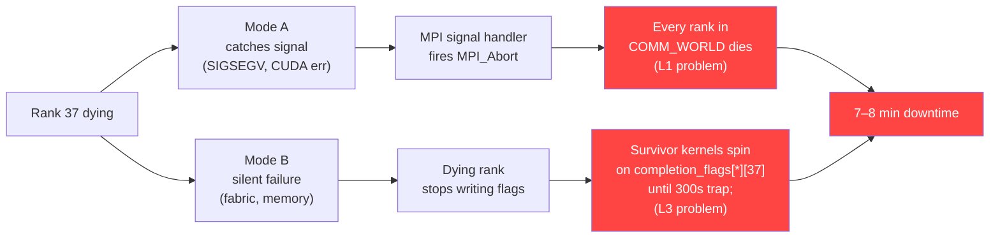

# 3. Failure Modes & FT Gaps in TRT-LLM's Stack

[< Back to Overview](README.md)

## 3.1 Two failure modes that today's stack does not survive

When a GPU fails in a WideEP group, the failure surfaces in one of two distinct ways. Both are fatal on the current stack. The FT design has to survive both; addressing only one leaves a gap that is likely to be hit in practice.

### Mode A — Signal-handler `MPI_Abort` propagation

**When it happens.** The dying rank catches a signal (CUDA error, SIGSEGV on host side, OOM kill, hardware fault that surfaces through the OS).

**What the handler does.** Verified in `cpp/tensorrt_llm/runtime/utils/mpiUtils.cpp` (~lines 195–215):

```cpp
previousHandler = std::signal(sig, [](int signal) {
    MPI_Abort(MPI_COMM_WORLD, EXIT_FAILURE);
});
```

And the `forwardAbortToParent` variant additionally:

```cpp
previousHandler = std::signal(sig, [](int signal) {
    pid_t parentProcessId = getppid();
    kill(parentProcessId, SIGKILL);
    MPI_Abort(MPI_COMM_WORLD, EXIT_FAILURE);
});
```

**The effect.** `MPI_Abort(MPI_COMM_WORLD, …)` is explicitly defined by MPI to terminate every process in the specified communicator. Because `MPI.COMM_WORLD` is the full 72-rank EP group, **every rank dies**. The `forwardAbortToParent` variant additionally sends `SIGKILL` to the launcher (e.g., the `mpirun` process), ensuring the job manager doesn't try to restart the stuck world.

**Why this defeats in-kernel FT.** This fires *before* any user-space FT logic can run. Kernel rank masking, EPLB reconfigure, failure-broadcast subcomms — none of it has a chance. The survivors are dead before they notice rank 37 died.

**Where this lives in the stack.** L1 (process orchestration). Has nothing to do with the AlltoAll kernel or the data plane; it's a consequence of the MPI orchestrator's default behavior.

### Mode B — AlltoAll kernel hangs on a dead peer's completion flag

**When it happens.** The dying rank stops responding before its signal handler fires — hardware failure that severs the NVLink port, GPU memory fault that hangs the kernel, loss of the fabric page's backing memory. The MPI world is still up; no signal handler ran; the other ranks see nothing.

**What the surviving kernel does.** Verified in `cpp/tensorrt_llm/kernels/communicationKernels/moeAlltoAllKernels.cu`. Both the dispatch (around lines 537–584) and combine (around 1190–1217) loops spin on peer completion flags via raw inline PTX:

```cpp
for (int peer_rank = lane_id; peer_rank < ep_size; peer_rank += warpSize) {
    bool flag_set = false;
    auto s = clock64();
    do {
        uint32_t* flag_ptr = &ptrs.completion_flags[rank_id][peer_rank];
        uint32_t flag_value;
        asm volatile("ld.relaxed.sys.u32 %0, [%1];" : "=r"(flag_value) : "l"(flag_ptr));
        flag_set = flag_value == expected_value;
    } while (!flag_set && !check_timeout(s));
    if (!flag_set) { asm volatile("trap;"); return; }
}
```

where `check_timeout(s)` is `(clock64() - (s)) > 300ll * 2000ll * 1000ll * 1000ll` — a **300-second** kernel-side budget. On expiry, the kernel runs `asm volatile("trap;")`, which **corrupts the CUDA context** and is unrecoverable in-place (process restart required).

**The effect.** With no signal on the dying rank, `MPI_Abort` does not fire. Surviving kernels spin on `completion_flags[R][37]` for a full 300 seconds with no abort hook, then die by context corruption. The `HangDetector` at 300s also fires. Either way, 7–8 minutes of downtime.

**Why this defeats L1 FT.** Pivoting to Ray fixes Mode A — Ray notices the dead actor and doesn't abort the others — but it does not fix Mode B. The kernel still spins with no abort hook; Ray cannot interrupt a running CUDA kernel any more than MPI can. **Mode B is a data-plane (L3) problem that L1 cannot solve.**

### The two-mode picture



**Design consequence.** Both modes must be closed. Ray fixes Mode A structurally but not Mode B. MPI-path signal-handler replacement fixes Mode A but not Mode B. Only kernel-level masking with a host-side abort path fixes Mode B. **The two fixes are complementary, not alternatives.** [§5](05-phase-1-immediate-survival.md) addresses Mode B (§5.1 kernel masking) *and* Mode A (§5.4 signal handler replacement on the MPI path).

### What causes each mode, and which is more significant

It's worth surfacing the actual failure-cause distribution for each mode, plus an inversion that affects the design ordering.

**Mode A causes.** The dying rank's process catches a signal that the OS delivers and the MPI handler intercepts. Common sources:

- CUDA illegal memory access / illegal address → SIGSEGV via the CUDA runtime's host-side stub.
- Out-of-memory kill (OOM-killer or cgroup memory limit) → SIGKILL or SIGTERM.
- Uncaught Python exception escaping `worker_main` → SIGABRT via Python's default handler.
- Severe NVIDIA XID errors that surface as fatal CUDA errors → eventually crash the process.
- Hardware faults that surface through the OS (PCIe link errors, host-side ECC).
- Explicit `MPI.COMM_WORLD.Abort(N)` from application code (rare, but does happen in some test paths).

**Mode B causes.** The dying rank's *process* is up enough that no signal-handler chain fires, but its *forward progress* on writing to peers' `completion_flags` has stopped. Three buckets:

| Bucket | Mechanism | Examples |
|:---|:---|:---|
| **Hardware / fabric** | The GPU is alive but its peer-write path is broken | NVLink lane degradation past retry threshold; NVSwitch fabric port fault on NVL72; ECC-uncorrectable in the `completion_flags` region of fabric memory; XID errors that mark a context unstable but don't kill the process; PCIe link errors intra-node; MNNVL fabric grant revocation by IMEX or fabric manager without killing the process |
| **Driver / kernel** | The CUDA driver itself stalls; process is up but the GPU isn't making progress | NVIDIA user-space driver hang (a known class of failure); kernel stuck in queue waiting on driver service; CUDA stream where a launch never completes; thermal throttling severe enough to look like a hang at the per-AlltoAll timescale |
| **Application** | The CPU-side process is alive but the forward thread isn't posting work | Python deadlock or GIL pathology; forward thread blocked on something the watchdog doesn't see (file I/O, lock contention); kernel completed but the next iteration's kernel never gets launched |

The common property of all Mode B causes: from the AlltoAll kernel's perspective — which is what spins on `completion_flags` — the difference between "process dead but holding signal" and "process alive but stalled" doesn't matter. Either way the flag never gets written.

**By raw frequency, Mode A dominates today.** Most production failures eventually surface as OS signals (CUDA errors, OOMs, uncaught exceptions, severe XIDs). The MPI signal handler at `mpiUtils.cpp:195–215` catches all of them and fires `MPI_Abort`. So "rank died, MPI propagated, cluster went down" describes the majority of incidents in current production deployments.

**By difficulty, Mode B is harder.** Mode A is loud — the dying rank actively signals its death. The fix (PR 1d.0, in flight as PR #14160; see [§5.4](05-phase-1-immediate-survival.md#54-mpi-path-ft-enabling-work)) is to *suppress* that signaling so survivors aren't dragged down. Mode B is silent — no signal, no exception, no notification. It requires the explicit kernel-level host watchdog (PR 1a.4) plus the MNNVL kernel masking (PR 1a.2, in flight as PR #13404). That's net-new infrastructure, not a fix to existing infrastructure.

**The post-1d.0 inversion.** Once PR 1d.0 (PR #14160) lands and replaces `MPI_Abort` with `_exit(N)`, **every Mode A failure looks like Mode B from the survivors' perspective**. The dying rank exits cleanly without telling anyone; survivors see exactly the same thing they'd see if a fabric port had silently failed. The detection burden shifts entirely to the watchdog.

| Phase of deployment | Most common failure shape from survivors' POV | Implication |
|:---|:---|:---|
| **Today (no FT)** | Mode A (signal handler propagates abort) → cluster down | `MPI_Abort` is "doing its job" — signaling the failure, just at the cost of the whole cluster |
| **Post-1d.0 (`_exit(N)` instead of `MPI_Abort`)** | Effectively all failures look like Mode B from survivors' POV | Watchdog (1a.4) must catch every failure, since Mode A's signal propagation has been deliberately suppressed |
| **Post-1d.0 + 1a.4 + 1c.3** | Detected as silent peer death within ~5 s; broadcast via FT subcomm; mask + `reconfigure_mask_only` | The dying rank's class of failure matters less; the survivor-side detection is uniform |

This is why the design treats Mode B work as the more architecturally important even though Mode A is more frequent in raw failure counts. Mode B's machinery is what survives the *transition* — the period between 1d.0 landing (which suppresses Mode A's propagation) and 1a.4 + 1c.3 catching the resulting silent peer.

The MVP's engineering effort distribution reflects this: 1d.0 (Mode A fix) is one S-sized PR; the Mode B machinery is three of the four MVP tracks (1a kernel + 1c detection + parts of 1d). The work-heaviness ratio is Mode B-heavy because significance is what justifies the engineering budget, not raw frequency.

## 3.2 Gap analysis by layer

For each layer of the stack (L1 / L2 / L3 / EPLB / Detection), what's missing today, mapped to which failure mode it enables or blocks. All findings anchored against current source per the research pass.

> **Framing note.** [PR #12718](https://github.com/NVIDIA/TensorRT-LLM/pull/12718)'s `classify_error()` is **downstream of failure reporting** — it regex-classifies error messages that have already surfaced as Python exceptions. If a backend doesn't surface an exception (the MNNVL kernel hangs silently; TRT-LLM's custom NCCL ops don't wire `ncclCommAbort`), PR #12718 sees nothing. Most of the gaps below are **producer-side**: backends that fail without raising an exception upstream, or paths where the abort / error-query API exists in the upstream library but isn't wired in TRT-LLM. The detection layers in [§5.3](05-phase-1-immediate-survival.md#53-failure-detection--pr-12718-integration) are what *produce* signals on the silent paths so PR #12718 can consume them.

### L1 — Process orchestration gaps

| Gap | Current state | Failure mode it enables | Reference |
|:---|:---|:---|:---|
| Signal handlers abort `MPI_COMM_WORLD` | Verified at `mpiUtils.cpp:195–215`. Two variants; one additionally `kill(getppid(), SIGKILL)` | **Mode A** | Core source |
| `MPIPoolExecutor` has no partial-failure path | Verified: `proxy.py:225–280`'s `mpi_done_callback` only enqueues exceptions; `MpiPoolSession.abort()` at `mpi_session.py:167–168` calls `comm.Abort(1)` which kills the world | Worsens Mode A (no recovery path even if the abort could be caught) | Core source |
| No per-rank liveness tracking at L1 | MPI has no built-in liveness monitor; TRT-LLM has no shim | Amplifies both Mode A (can't tell whether to ignore the abort) and Mode B (can't tell whether a silent peer is dead) | — |

### L2 — Control plane gaps

| Gap | Current state | Failure mode it enables | Reference |
|:---|:---|:---|:---|
| No fault-tolerant MPI communicator | Zero non-test uses of `MPI_ERRORS_RETURN`, `MPI_Comm_revoke`, `MPI_Comm_shrink`, `MPI_Comm_agree`, or ULFM anywhere in TRT-LLM | Amplifies Mode A — even if we replace the signal handler, the next MPI collective on `COMM_WORLD` still poisons | — |
| No out-of-band failure-broadcast channel | All control-plane traffic goes over `MPI.COMM_WORLD`; a poisoned `COMM_WORLD` takes down the broadcast too | Blocks Mode B recovery — surviving ranks can't reach consensus on which peer is dead | — |
| `torch.distributed` not initialized on MPI path | Only initialized when `orchestrator_type="ray"` | On the Ray path, `torch.distributed` provides its own abort+reinit via `destroy_process_group` + `init_process_group`. Not available on MPI default path. | `llm_args.py:2903` |

### L3 — Data plane gaps (per backend)

| Backend | Used by | Gap | Failure mode | Reference |
|:---|:---|:---|:---|:---|
| **MNNVL** (`NVLinkOneSided`, primary) | NVL72 production AlltoAll | No host-visible abort hook; no rank mask in kernel; `kMaxRanks=64` constexpr doesn't fit NVL72 rack | **Mode B** | `moeAlltoAllKernels.h`, `moeAlltoAllKernels.cu` |
| **MNNVL** (`NVLinkTwoSided`) | Intra-node variant | Same as above; FIFO-based sync with no timeout | **Mode B** | `fusedMoeCommKernels.cu` |
| **NVSHMEM** (`DeepEP`, `DeepEPLowLatency`) | Cross-node fallback | No public `mask_buffer_ptr` API; `Buffer.__del__` → `intranode::barrier` deadlocks on peer death | **Mode B** (hang); amplifies Mode A (destructor deadlock during cleanup) | `deep_ep.py:86`, `deep_ep_low_latency.py:103`, `configurable_moe.py:422` |
| **NCCL** (`AllGatherReduceScatter`, TP allreduces, `NcclCommunicatorOp`) | Fallback EP backend, TP, PP | `ncclCommAbort` / `NCCL_ASYNC_ERROR_HANDLING` not wired in TRT-LLM's custom NCCL ops (zero non-test uses) | **Mode B** (would be fixable via `ncclCommAbort` — see §5.1 PR 1a.7) | — |

### EPLB gap

The load balancer was designed as a static-topology system. `MoeLoadBalanceMetaInfo` stores `epSize` and `epRank` as `int` fields (verified at `moeLoadBalanceCommon.h:40–52`); every reader assumes these don't change; the data structures (`rankExpertIds[epSize][slotCountPerRank]`, `globalSlotIds[epSize * slotCountPerRank]`) are sized at creation and not reallocated.

**Consequence:** even after we detect a rank is dead and mask it in the AlltoAll kernel, tokens will still be routed to the dead rank unless EPLB's placement table is rewritten. §5.2 introduces `reconfigure_mask_only` for the MVP and full `reconfigure` for v1.

### Detection gap

The existing infrastructure in PR #12718 ([status verified in research pass report](redesign-research-pass-report.md)) provides executor-level error classification (`classify_error()` returns `"immediate_fatal"` / `"severe"` / `"transient"`) and a token-bucket `ErrorBudget`. This is the foundation WideEP FT extends.

What's missing:
- **Per-EP-rank health.** Today's model is binary (whole executor healthy or fatal). WideEP FT needs a per-rank state.
- **AlltoAll timeout detector.** The kernel's `check_timeout` is 300s and destructive; no sub-5s host-side detector exists.
- **MPI worker-death per-rank granularity.** `_error_monitor_loop` detects any worker crash but doesn't distinguish which rank.
- **Cross-rank consensus on the failed set.** No out-of-band channel for the surviving ranks to agree on which peer is dead.

## 3.3 Why not just pivot to Ray?

The structural argument is strong, and we've heard it from reviewers: Ray at L1 + `torch.distributed` at L2 decouples process lifecycle from communicator management in exactly the way that Mode A requires. If we pivoted to Ray as the primary orchestrator for WideEP FT, we would inherit Mode A resistance for free — the Ray substrate wouldn't call `MPI_Abort` because there's no MPI. Additionally, `torch.distributed` carries PyTorch's in-place NCCL abort + reinit support, which gives the NCCL-based collectives a clean FT story.

This section lays out the trade-off honestly and states the MVP decision.

### What Ray would buy

1. **Mode A structurally eliminated.** No MPI signal handlers, no `MPI_COMM_WORLD` poisoning, no `MPIPoolExecutor` brittleness. Ray sees actor deaths independently.
2. **NCCL abort inherited from PyTorch.** The `torch.distributed` path already calls `ncclCommAbort` correctly in `destroy_process_group`. TRT-LLM's custom NCCL op wiring gap (PR 1a.7) is still required for the pipeline-parallel path but not for core EP collectives.
3. **ULFM irrelevance.** ULFM's availability-by-MPI-build concern evaporates because ULFM is MPI-specific.
4. **Cleaner Phase 2 rebuild.** `torch.distributed.destroy_process_group()` + `init_process_group()` is the well-understood pattern; MPI's `MPI_Comm_spawn` / ULFM path is more complex.
5. **K8s + KubeRay alignment.** Production NVL72 deployments are trending toward KubeRay-managed clusters. A Ray-primary FT path aligns with where customers are going.

### What Ray would cost

1. **`HostMoeTensorSharer` is hard-baked to MPI.** Verified: `moe_load_balancer.py:896–897` calls `global_mpi_comm.Split_type(MPI.COMM_TYPE_SHARED)` with no `TLLM_DISABLE_MPI` guard anywhere in the file. On the Ray path, the current code would fail the node-local-peer discovery. This is real porting work — replace `MPI.COMM_TYPE_SHARED` with a hostname-based or Ray-placement-group-based discovery mechanism, audit every reader.
2. **Ray-path CI is not characterized at WideEP scale.** Verified: Ray-tagged tests exist (`l0_dgx_b200.yml`, `l0_dgx_h100.yml`, `l0_h100.yml`, `tests/integration/defs/accuracy/test_llm_api_pytorch_ray.py`, `unittest/_torch/ray_orchestrator/multi_gpu/`) but the largest configurations are TP ≤ 4 (Llama-3.1-8B). There are no EP ≥ 32 tests, no DeepSeek-V3 tests on the Ray path, and no Ray-vs-MPI perf comparisons in the regression suite. Adopting Ray as the default FT path means running customer-facing WideEP on a substrate we haven't benchmarked at the scale it'll be used.
3. **Disagg + Ray + NIXL is unsupported.** Verified at `tests/integration/defs/disaggregated/test_disaggregated.py:597`: explicit test-skip with the reason "Ray orchestrator is not supported with NIXL(DEFAULT) cache transceiver backend." Since NIXL is the production default for disagg, this is a hard gap that Phase 1-DS would have to close before disagg FT could ship on Ray.
4. **Ecosystem inertia.** SLURM-launched, bare-metal MPI deployments are a real part of the installed base. A Ray-only MVP would leave those users on "no FT" for the duration.
5. **Mode B is not addressed by pivoting.** The kernel hang is orthogonal to orchestrator choice. Pivoting to Ray still leaves the MNNVL kernel-level work to do.

### Decision

**MVP stays on MPI.** Ray is a future migration question, not a near-term answer. Rationale:

- **Cost #2 is the blocker.** Shipping MVP on a code path with no EP ≥ 32 perf characterization is unacceptable for a production FT feature. The regressions we haven't seen yet could be large.
- **Cost #1 is real engineering work** (HostMoeTensorSharer refactor + every-reader audit) that we would have to do before MVP could even run on Ray at WideEP scale.
- **Benefit #1 is valuable but addressable on the MPI path.** Mode A is fixable by replacing the `mpiUtils.cpp` signal handler behavior, scoped in [§5.4](05-phase-1-immediate-survival.md#54-mpi-path-ft-enabling-work). It's net-new work but bounded.
- **Benefit #5 does not favor Ray.** Mode B work has to happen regardless of orchestrator.

The MPI-path FT-enabling work (§5.4) is the compensating investment. Net effect: MVP ships on MPI with Mode A fixed via handler replacement, Mode B fixed via kernel masking; Ray becomes a future migration we revisit after:

- A Ray-path WideEP perf characterization audit (named risk in [§9](09-risks-and-open-questions.md)) confirms acceptable perf at EP ≥ 32.
- The `HostMoeTensorSharer` MPI-hard-bake has been factored out (planning dependency).
- The disagg + Ray + NIXL support gap is closed (pre-requisite for disagg FT on Ray).

We treat the pivot as a **deferred architectural question**, not an MVP decision. The design keeps the Ray path open — nothing in the proposed MPI-path work prevents a later migration, and the kernel-level changes (Mode B work) port directly to Ray.

**Industry signal (May 2026 survey):** Both vLLM and SGLang's in-flight FT work targets Ray, not MPI. vLLM PR #34833 explicitly states "Elastic EP currently supports only Ray + internal LB," deferring MPI. SGLang's [FT RFC](https://github.com/gaidandawang-afk/sglang/issues/1) is also Ray-based. Beyond the orchestrator choice, both converge on the same data-plane (Mooncake-EP / NIXL-EP with `activeRanks`-style masking), the same control-plane API surface (`/fault_tolerance/status` + `/fault_tolerance/apply`), and the same three-phase rollout (report → pause → cleanup-and-retry). This **strengthens the long-term Ray-pivot argument**: the broader inference-serving ecosystem is converging on Ray for FT, and a TRT-LLM that stays MPI-only for FT becomes increasingly out of step. **It does not change the MVP decision** — the three preconditions above still hold, particularly the Ray-path WideEP perf characterization gap. But it sharpens the question: when the audits and refactors land, the pivot conversation will face additional pressure from ecosystem alignment, not just the technical merits of either path.

## 3.4 Summary: gap × failure-mode matrix

| Gap | Layer | Mode A | Mode B | Addressed in |
|:---|:---|:---:|:---:|:---|
| Signal handlers abort COMM_WORLD | L1 | ✓ (enables) | — | §5.4 |
| `MPIPoolExecutor` no partial-failure | L1 | ✓ (worsens) | — | §5.4 |
| No MPI FT communicator | L2 | ✓ (worsens post-handler-fix) | — | §5.4 |
| No out-of-band broadcast | L2 | ✓ | ✓ (blocks consensus) | §5.3 |
| MNNVL no rank mask / no abort hook | L3 | — | ✓ (enables) | §5.1 |
| `kMaxRanks=64` doesn't fit NVL72 | L3 | — | ✓ (precondition) | §5.1 |
| NCCL abort not wired in custom ops | L3 | — | ✓ (enables on fallback path) | §5.1 (PR 1a.7) |
| DeepEP destructor deadlock | L3 | Amplifies | ✓ | §6.2 (deferred) |
| EPLB static topology | — | — | ✓ (blocks recovery) | §5.2 |
| No per-rank health / no AlltoAll watchdog | Detection | — | ✓ (no detection) | §5.3 |

Every gap in this table is addressed in Phase 1 (with one conditional path) — see the transport mapping below for which Phase 1 sub-track applies to which deployment.

### 3.5 Transport determines mechanism

The FT mechanism that applies is determined by **which L3 transport is in use**, not by deployment name. `CommunicationFactory` selects the transport via fall-through (see [§1.1 Transport selection](01-user-journey-and-stack.md#transport-selection-what-trt-llm-actually-picks-today)); the FT story follows.

| Transport in use | Selected when (gate) | FT mechanism | Where it lives in this design |
|:---|:---|:---|:---|
| `NVLinkOneSided` / `NVLinkTwoSided` | `MnnvlMemory.supports_mnnvl()` True — all NVLink up. Applies to single-node 8-GPU NVL boxes *and* GB200/GB300 NVL72 rack | **Kernel mask + EPLB slot remap.** TRT-LLM owns the kernel; in-place mask at iteration boundary; survivors continue at N-1. | §5.1 (PR 1a.2/1a.5-6); §5.2 (PR 1b.1-3); §5.3-§5.4 for detection / broadcast / MPI fix. MVP scope. |
| `DeepEP` / `DeepEPLowLatency` | Cross-IB / cross-fabric peers (no MNNVL). Production choice for multi-node B200+IB per Peiheng's deck | **NIXL-EP `disconnect_ranks` + EPLB redistribute** (preferred) *or* **DeepEP 100s kernel-timeout interim** (vLLM PR #38534 pattern) | §8.2 Phase 1-IB; gated on [Audit 3](09-risks-and-open-questions.md#audit-3--nixl-ep-evaluation-as-data-plane-backend). Phase 1 + Phase 2 collapse into one "scale-down then scale-up" path for this transport. |
| `AllGatherReduceScatter` (NCCL) | DeepEP unavailable; safety-net fallback | **`ncclCommAbort` + reinit** | §5.1 (PR 1a.7), MVP scope. Same primitive vLLM converged on (RFC #30112 / `gpu_worker.py:161`). |

**Implication.** The MVP closes the gap for the entire `NVLinkOneSided` + `AllGatherReduceScatter` footprint at once — single-node NVL boxes, multi-node SLURM/MPI NVL deployments, NVL72 rack, and the NCCL fallback. The DeepEP-family transport (multi-node B200+IB and similar) is covered separately in Phase 1-IB, with a different mechanism that doesn't require us to own a custom kernel for that substrate.

The next section introduces the three-phase architecture that translates these gaps into work.
