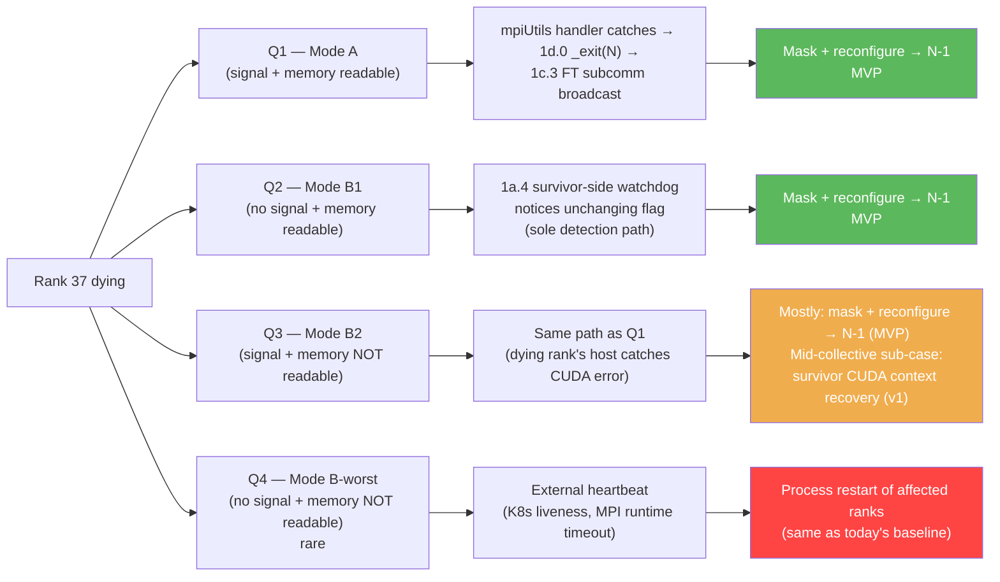

# 3. Failure Modes & FT Gaps in TRT-LLM's Stack

[< Back to Overview](README.md)

## 3.1 Failure modes: the 2x2

When a GPU fails in a WideEP group, the failure surfaces along **two orthogonal binary axes**. The 2x2 gives four quadrants; each has its own detection path and recovery story. Earlier versions of this doc collapsed everything to a "Mode A vs Mode B" framing, but reviewer feedback (Dongxu — cascading-fault concern; Luke — CUDA 13.0+ unicast-fabric-handle ref-counting) surfaced that the real structure is two axes that factor cleanly.

**The axes:**

- **Axis 1 (propagation):** Does the dying rank's *host process* eventually catch a signal/exception that triggers our FT propagation path? Governed by OS/driver signal delivery on the dying rank's CPU. "Yes" includes SIGSEGV, SIGABRT, SIGKILL, OS-delivered runtime errors, CUDA error surfaced via a synchronous CUDA call. "No" includes Python deadlock, driver hang, fabric grant revocation without process kill — anywhere the dying rank's host CPU has nothing to catch.
- **Axis 2 (peer memory):** Are the dead peer's *symmetric memory regions* still readable from survivors (remote loads succeed-with-stale-data, or do they fault)? Governed by NVSwitch fabric memory state + CUDA 13.0+ unicast-fabric-handle ref-counting + GPU physical accessibility. For unicast fabric handles, CUDA 13.0+ ref-counts memory regions, so the mapping stays valid after the *exporting* process exits *as long as the GPU is healthy*. Hardware-dead GPUs break Axis 2 regardless of Axis 1.

**The four quadrants:**

| | **Signal on dying rank (Axis 1: yes)** | **No signal on dying rank (Axis 1: no)** |
|:---|:---|:---|
| **Memory readable (Axis 2: yes)** | **Q1 — Mode A** | **Q2 — Mode B1** |
| **Memory not readable (Axis 2: no)** | **Q3 — Mode B2** | **Q4 — Mode B-worst** (rare) |

The "Mode A / Mode B" naming carries forward as a higher-level grouping (Q1 = Mode A; Q2-Q4 = the Mode B sub-flavors). The quadrant labels (Q1-Q4) are the precise coordinates when the distinction matters.

### Q1 — Mode A (signal-handler `MPI_Abort` propagation)

**When it happens.** The dying rank catches a signal (CUDA error, SIGSEGV on host side, OOM kill, software-driven CUDA error). Most common today.

**What the handler does (today).** Verified in `cpp/tensorrt_llm/runtime/utils/mpiUtils.cpp` (~lines 195–215):

```cpp
previousHandler = std::signal(sig, [](int signal) {
    MPI_Abort(MPI_COMM_WORLD, EXIT_FAILURE);
});
```

And the `forwardAbortToParent` variant additionally:

```cpp
previousHandler = std::signal(sig, [](int signal) {
    pid_t parentProcessId = getppid();
    kill(parentProcessId, SIGKILL);
    MPI_Abort(MPI_COMM_WORLD, EXIT_FAILURE);
});
```

**The effect (today).** `MPI_Abort(MPI_COMM_WORLD, …)` is explicitly defined by MPI to terminate every process in the specified communicator. Because `MPI.COMM_WORLD` is the full 72-rank EP group, **every rank dies**. The `forwardAbortToParent` variant additionally sends `SIGKILL` to the launcher (e.g., the `mpirun` process), ensuring the job manager doesn't try to restart the stuck world.

**Coverage.** PR 1d.0 (PR #14160, in flight) replaces `MPI_Abort` with `_exit(N)` so the dying rank exits cleanly. PR 1c.3 FT subcomm thread observes the exit and broadcasts the failure. Survivors mask + reconfigure. **MVP scope.**

**Where this lives in the stack.** L1 (process orchestration). Has nothing to do with the AlltoAll kernel or the data plane; it's a consequence of the MPI orchestrator's default behavior.

### Q2 — Mode B1 (silent spin)

**When it happens.** Software fault on the dying rank that *doesn't* surface as a signal — Python deadlock, GIL pathology, NVIDIA user-space driver hang, MNNVL fabric grant revocation without process kill, thermal throttling that looks like a hang at the per-AlltoAll timescale, forward thread blocked on something the watchdog doesn't see.

**What the surviving kernel does.** Verified in `cpp/tensorrt_llm/kernels/communicationKernels/moeAlltoAllKernels.cu`. Both the dispatch (around lines 537–584) and combine (around 1190–1217) loops spin on peer completion flags via raw inline PTX. The `completion_flags` table lives in *symmetric MNNVL memory*, so survivor reads of `completion_flags[*][dead_rank]` are remote loads against the dead rank's GPU:

```cpp
for (int peer_rank = lane_id; peer_rank < ep_size; peer_rank += warpSize) {
    bool flag_set = false;
    auto s = clock64();
    do {
        uint32_t* flag_ptr = &ptrs.completion_flags[rank_id][peer_rank];
        uint32_t flag_value;
        asm volatile("ld.relaxed.sys.u32 %0, [%1];" : "=r"(flag_value) : "l"(flag_ptr));
        flag_set = flag_value == expected_value;
    } while (!flag_set && !check_timeout(s));
    if (!flag_set) { asm volatile("trap;"); return; }
}
```

where `check_timeout(s)` is `(clock64() - (s)) > 300ll * 2000ll * 1000ll * 1000ll` — a **300-second** kernel-side budget. On expiry, the kernel runs `asm volatile("trap;")`, which **corrupts the CUDA context** and is unrecoverable in-place.

In Q2, the dying rank's *GPU* is still healthy. With unicast fabric handles + CUDA 13.0+ memory-region ref-counting, the dead peer's symmetric memory mapping stays valid on survivors regardless of whether the exporting process is alive. So survivor remote reads succeed with stale data; the flag never updates; kernels spin indefinitely (or until `trap;` corrupts the context at 300 s).

**Detection.** Q2 is the *only* quadrant where the dying rank has nothing to broadcast — its host CPU never caught anything. Survivor-side host watchdog (PR 1a.4) is the **sole detection mechanism**: it reads the same flag table from CPU side and notices when the dead peer's row stops updating, then calls `mark_failed` and broadcasts via PR 1c.3 to peer survivors.

**Coverage.** Mask + reconfigure at next iteration boundary cleanly recovers. **MVP scope.**

### Q3 — Mode B2 (cascading fault, in-flight kernel casualty)

**When it happens.** Severe hardware fault that takes the GPU offline at the fabric/memory level *and* surfaces as a CUDA error to the dying rank's host CPU. Most severe HW faults qualify — XID 79 "GPU fell off bus", PCIe link down, severe NVIDIA XID errors that escalate to `cudaErrorNoDevice` on the next CUDA API call from the dying rank.

**What's different from Q1/Q2.** The dying rank's GPU is *dead*, so the symmetric memory mapping on survivors is no longer backed by valid memory. When a survivor's AlltoAll kernel does its next remote load against `completion_flags[*][dead_rank]`, the load itself faults on hardware-dead memory. The survivor's kernel takes a CUDA error; the CUDA context on that survivor becomes invalid.

**Detection.** Identical to Q1's propagation path. The dying rank's host CPU catches the CUDA error, fires a signal, `_exit(N)` (post-1d.0), 1c.3 FT subcomm broadcasts. **Detection reuses MVP machinery; we don't need anything new for Q3 detection.**

**Recovery — the timing race.** Between (a) the FT subcomm broadcast arriving at survivors and (b) survivors' next remote read of the dead peer's now-unreadable memory:

- **Broadcast wins** → survivor masks before next collective launches; the in-flight collective completes or is the only casualty (one iteration's worth of requests, same cost as any failure).
- **Broadcast loses + survivor kernel between iterations** → survivor receives the broadcast, no kernel was running, mask cleanly. Equivalent to Q2 recovery.
- **Broadcast loses + survivor kernel mid-collective** → kernel was actively spinning when the GPU died; remote read faults; CUDA context corrupted on survivor. **This is the only sub-case that needs Phase-2-class context recovery** (`cudaDeviceReset` heavy, or `ncclCommAbort` + reinit if NCCL was the next thing the survivor would have called).

The race is winnable in most cases — inference iteration boundaries are typically <100 ms apart, and the FT subcomm broadcast (1c.3) targets <100 ms. So **most Q3 cases reduce to Q2-equivalent recovery** via the MVP machinery. The remaining hard case — "survivor kernel mid-collective at the moment the GPU died" — is bounded ("one in-flight collective per survivor", not "all subsequent collectives").

**Coverage.** Most of Q3 in **MVP** (rides on Q1's propagation machinery + Q2's mask machinery). Mid-collective in-flight-kernel cascade is **v1** for the NVL72 / kernel-mask transport; **sidestepped on cross-IB by Phase 1-IB NIXL-EP** (handle-based topology mutation via `disconnect_ranks` invalidates the dead peer's handle at runtime, so survivor reads return an error rather than faulting the kernel — see [§9.1 Audit 3](09-risks-and-open-questions.md#audit-3--nixl-ep-evaluation-as-cross-ib-data-plane-backend)).

### Q4 — Mode B-worst (rare; baseline-restart fallback)

**When it happens.** No signal on the dying rank *and* the dead peer's symmetric memory not readable. Requires a failure that takes the GPU offline at fabric/memory level *without* the dying rank's host CPU ever attempting a CUDA call that would catch the error. Almost always **transient** — resolves into Q3 within milliseconds-to-seconds as soon as the dying host CPU hits any CUDA API (the inference loop hits CUDA APIs constantly). Persistent Q4 would require the dying host to be simultaneously stuck on a non-CUDA blocking call, which is exotic.

**Why no FT design feature recovers Q4 in-place.** Every detection mechanism the FT design has is broken in Q4:

- 1d.0 signal path: no signal on dying rank → no propagation.
- 1c.3 FT subcomm broadcast: nothing to broadcast (dying rank doesn't know; survivor watchdogs may also fail).
- 1a.4 host-side watchdog on survivors: polls `completion_flags` from CPU via host-mapped memory. If that memory backs onto the dead peer's GPU, the CPU read may also fault (SIGBUS) or return garbage.
- Survivor kernels: dead from cascading fault on the next remote read.

**Recovery.** External orchestration heartbeat (K8s pod liveness probe, MPI runtime heartbeat, operator-detected SLO breach) detects the cluster is broken and restarts the affected ranks (or the whole job). This is the **same fallback path that handles every failure today on the pre-FT stack** — Q4 isn't a regression, it's the same baseline at a tens-of-seconds-to-minutes detection latency.

**Out of FT scope.** The FT design's "<10 s recovery" target covers Q1–Q3. Q4 inherits external-heartbeat detection plus process restart, which is the outermost safety net. This is explicit, not a gap.

### The 2x2 picture



### Frequency, difficulty, and the post-1d.0 inversion

It's worth surfacing the failure-cause distribution per quadrant plus an inversion that affects the design ordering.

**Quadrant frequency.** By raw frequency, **Q1 (Mode A) dominates today** — most production failures eventually surface as OS signals (CUDA errors, OOMs, uncaught exceptions, severe XIDs). The MPI signal handler at `mpiUtils.cpp:195–215` catches all of them and fires `MPI_Abort`. So "rank died, MPI propagated, cluster went down" describes the majority of incidents in current production deployments.

**Quadrant difficulty.** By difficulty, **Q2 (Mode B1) is the hardest** — no signal to catch; detection requires the explicit kernel-level host watchdog (PR 1a.4) plus the MNNVL launch-time kernel mask that landed as PR 1a.2 / #13404. That's net-new infrastructure, not a fix to existing infrastructure. Q3 (Mode B2) reuses Q1's propagation path so detection is "free"; only the mid-collective cascade adds work (v1). Q4 (Mode B-worst) is rare and out of FT scope.

**The post-1d.0 inversion.** Once PR 1d.0 lands and replaces `MPI_Abort` with `_exit(N)`, Mode A's *propagation* path becomes a clean broadcast rather than a cluster-kill. From survivors' POV, what used to be "MPI_Abort killed everyone before we noticed" becomes "we got a clean notification from the FT subcomm and masked the dead rank." Q1 (Mode A) and Q3 (Mode B2) share the propagation path; only Q2 (Mode B1) is the regime where survivor-side watchdog is the *sole* detection mechanism. Q4 inherits external-heartbeat detection.

| Phase of deployment | Survivor-visible failure shape | Implication |
|:---|:---|:---|
| **Today (no FT)** | Q1 (`MPI_Abort` propagates) → cluster down | `MPI_Abort` is "doing its job" — signaling the failure, just at the cost of the whole cluster |
| **Post-1d.0 (`_exit(N)` instead of `MPI_Abort`)** | Q1: clean broadcast via FT subcomm. Q2: silent spin (watchdog catches). Q3: same broadcast path as Q1; in-flight kernel may cascade-fault. Q4: external heartbeat | The dying rank's class of failure matters less for *detection* — Q1 and Q3 share the path; only Q2 needs survivor-side watchdog. The new dimension is whether the dead GPU's memory remains readable (separates Q1/Q2 from Q3/Q4) |
| **Post-1d.0 + 1a.4 + 1c.3** | Q1, Q2, most of Q3 detected within ~5 s; mid-collective Q3 sub-case still a bounded casualty | The mid-collective in-flight kernel cascade is the residual gap on the NVL72 / kernel-mask path; sidestepped on cross-IB by NIXL-EP topology mutation |
| **Post-1d.0 + Phase 1-IB (NIXL-EP)** | Cross-IB regime: Q3 sidestepped architecturally via handle-based topology mutation | `disconnect_ranks([dead])` invalidates the peer's handle before survivors attempt access; runtime returns an error instead of faulting the kernel — Q3 reduces to a clean Q1-equivalent recovery for that transport |

This is why the design treats Q2 (Mode B1) machinery as architecturally important even though Q1 is more frequent — Q2 is the only quadrant where survivor-side watchdog is the *sole* detection path, and post-1d.0 it survives the *transition window* where Mode A failures haven't yet propagated via 1c.3.

The MVP's engineering effort distribution reflects this: 1d.0 (Q1 detection-path fix) is one S-sized PR; the Q2/Q3 machinery is three of the four MVP tracks (1a kernel + 1c detection + parts of 1d). The work-heaviness ratio favors Q2/Q3 because significance is what justifies the engineering budget, not raw frequency. **MVP covers Q1 + Q2 + most of Q3; v1 closes the mid-collective Q3 sub-case; Q4 falls back to external-heartbeat restart by design.**

## 3.2 Gap analysis by layer

For each layer of the stack (L1 / L2 / L3 / EPLB / Detection), what's missing today, mapped to which failure mode it enables or blocks. All findings anchored against current source per the research pass.

> **Framing note.** [PR #12718](https://github.com/NVIDIA/TensorRT-LLM/pull/12718)'s `classify_error()` is **downstream of failure reporting** — it regex-classifies error messages that have already surfaced as Python exceptions. If a backend doesn't surface an exception (the MNNVL kernel hangs silently; TRT-LLM's custom NCCL ops don't wire `ncclCommAbort`), PR #12718 sees nothing. Most of the gaps below are **producer-side**: backends that fail without raising an exception upstream, or paths where the abort / error-query API exists in the upstream library but isn't wired in TRT-LLM. The detection layers in [§5.3](05-phase-1-immediate-survival.md#53-failure-detection--pr-12718-integration) are what *produce* signals on the silent paths so PR #12718 can consume them.

### L1 — Process orchestration gaps

| Gap | Current state | Failure mode it enables | Reference |
|:---|:---|:---|:---|
| Signal handlers abort `MPI_COMM_WORLD` | Verified at `mpiUtils.cpp:195–215`. Two variants; one additionally `kill(getppid(), SIGKILL)` | **Mode A** | Core source |
| `MPIPoolExecutor` has no partial-failure path | Verified: `proxy.py:225–280`'s `mpi_done_callback` only enqueues exceptions; `MpiPoolSession.abort()` at `mpi_session.py:167–168` calls `comm.Abort(1)` which kills the world | Worsens Mode A (no recovery path even if the abort could be caught) | Core source |
| No per-rank liveness tracking at L1 | MPI has no built-in liveness monitor; TRT-LLM has no shim | Amplifies both Mode A (can't tell whether to ignore the abort) and Mode B (can't tell whether a silent peer is dead) | — |

### L2 — Control plane gaps

| Gap | Current state | Failure mode it enables | Reference |
|:---|:---|:---|:---|
| No fault-tolerant MPI communicator | Zero non-test uses of `MPI_ERRORS_RETURN`, `MPI_Comm_revoke`, `MPI_Comm_shrink`, `MPI_Comm_agree`, or ULFM anywhere in TRT-LLM | Amplifies Mode A — even if we replace the signal handler, the next MPI collective on `COMM_WORLD` still poisons | — |
| No out-of-band failure-broadcast channel | All control-plane traffic goes over `MPI.COMM_WORLD`; a poisoned `COMM_WORLD` takes down the broadcast too | Blocks Mode B recovery — surviving ranks can't reach consensus on which peer is dead | — |
| `torch.distributed` not initialized on MPI path | Only initialized when `orchestrator_type="ray"` | On the Ray path, `torch.distributed` provides its own abort+reinit via `destroy_process_group` + `init_process_group`. Not available on MPI default path. | `llm_args.py:2903` |

### L3 — Data plane gaps (per backend)

| Backend | Used by | Gap | Failure mode | Reference |
|:---|:---|:---|:---|:---|
| **MNNVL** (`NVLinkOneSided`, primary) | NVL72 production AlltoAll | No host-visible abort hook; no rank mask in kernel; `kMaxRanks=64` constexpr doesn't fit NVL72 rack | **Mode B** | `moeAlltoAllKernels.h`, `moeAlltoAllKernels.cu` |
| **MNNVL** (`NVLinkTwoSided`) | Intra-node variant | Same as above; FIFO-based sync with no timeout | **Mode B** | `fusedMoeCommKernels.cu` |
| **NVSHMEM** (`DeepEP`, `DeepEPLowLatency`) | Cross-node fallback | No public `mask_buffer_ptr` API; `Buffer.__del__` → `intranode::barrier` deadlocks on peer death | **Mode B** (hang); amplifies Mode A (destructor deadlock during cleanup) | `deep_ep.py:86`, `deep_ep_low_latency.py:103`, `configurable_moe.py:422` |
| **NCCL** (`AllGatherReduceScatter`, TP allreduces, `NcclCommunicatorOp`) | Fallback EP backend, TP, PP | `ncclCommAbort` / `NCCL_ASYNC_ERROR_HANDLING` not wired in TRT-LLM's custom NCCL ops (zero non-test uses) | **Mode B** (would be fixable via `ncclCommAbort` — see §5.1 PR 1a.7) | — |

### EPLB gap

The load balancer was designed as a static-topology system. `MoeLoadBalanceMetaInfo` stores `epSize` and `epRank` as `int` fields (verified at `moeLoadBalanceCommon.h:40–52`); every reader assumes these don't change; the data structures (`rankExpertIds[epSize][slotCountPerRank]`, `globalSlotIds[epSize * slotCountPerRank]`) are sized at creation and not reallocated.

**Consequence:** even after we detect a rank is dead and mask it in the AlltoAll kernel, tokens will still be routed to the dead rank unless EPLB's placement table is rewritten. §5.2 introduces `reconfigure_mask_only` for the MVP and full `reconfigure` for v1.

### Detection gap

The existing infrastructure in PR #12718 ([status verified in research pass report](redesign-research-pass-report.md)) provides executor-level error classification (`classify_error()` returns `"immediate_fatal"` / `"severe"` / `"transient"`) and a token-bucket `ErrorBudget`. This is the foundation WideEP FT extends.

What's missing:
- **Per-EP-rank health.** Today's model is binary (whole executor healthy or fatal). WideEP FT needs a per-rank state.
- **AlltoAll timeout detector.** The kernel's `check_timeout` is 300s and destructive; no sub-5s host-side detector exists.
- **MPI worker-death per-rank granularity.** `_error_monitor_loop` detects any worker crash but doesn't distinguish which rank.
- **Cross-rank consensus on the failed set.** No out-of-band channel for the surviving ranks to agree on which peer is dead.

## 3.3 Why not just pivot to Ray?

The structural argument is strong, and we've heard it from reviewers: Ray at L1 + `torch.distributed` at L2 decouples process lifecycle from communicator management in exactly the way that Mode A requires. If we pivoted to Ray as the primary orchestrator for WideEP FT, we would inherit Mode A resistance for free — the Ray substrate wouldn't call `MPI_Abort` because there's no MPI. Additionally, `torch.distributed` carries PyTorch's in-place NCCL abort + reinit support, which gives the NCCL-based collectives a clean FT story.

This section lays out the trade-off honestly and states the MVP decision.

### What Ray would buy

1. **Mode A structurally eliminated.** No MPI signal handlers, no `MPI_COMM_WORLD` poisoning, no `MPIPoolExecutor` brittleness. Ray sees actor deaths independently.
2. **NCCL abort inherited from PyTorch.** The `torch.distributed` path already calls `ncclCommAbort` correctly in `destroy_process_group`. TRT-LLM's custom NCCL op wiring gap (PR 1a.7) is still required for the pipeline-parallel path but not for core EP collectives.
3. **ULFM irrelevance.** ULFM's availability-by-MPI-build concern evaporates because ULFM is MPI-specific.
4. **Cleaner Phase 2 rebuild.** `torch.distributed.destroy_process_group()` + `init_process_group()` is the well-understood pattern; MPI's `MPI_Comm_spawn` / ULFM path is more complex.
5. **K8s + KubeRay alignment.** Production NVL72 deployments are trending toward KubeRay-managed clusters. A Ray-primary FT path aligns with where customers are going.

### What Ray would cost

1. **`HostMoeTensorSharer` is hard-baked to MPI.** Verified: `moe_load_balancer.py:896–897` calls `global_mpi_comm.Split_type(MPI.COMM_TYPE_SHARED)` with no `TLLM_DISABLE_MPI` guard anywhere in the file. On the Ray path, the current code would fail the node-local-peer discovery. This is real porting work — replace `MPI.COMM_TYPE_SHARED` with a hostname-based or Ray-placement-group-based discovery mechanism, audit every reader.
2. **Ray-path CI is not characterized at WideEP scale.** Verified: Ray-tagged tests exist (`l0_dgx_b200.yml`, `l0_dgx_h100.yml`, `l0_h100.yml`, `tests/integration/defs/accuracy/test_llm_api_pytorch_ray.py`, `unittest/_torch/ray_orchestrator/multi_gpu/`) but the largest configurations are TP ≤ 4 (Llama-3.1-8B). There are no EP ≥ 32 tests, no DeepSeek-V3 tests on the Ray path, and no Ray-vs-MPI perf comparisons in the regression suite. Adopting Ray as the default FT path means running customer-facing WideEP on a substrate we haven't benchmarked at the scale it'll be used.
3. **Disagg + Ray + NIXL is unsupported.** Verified at `tests/integration/defs/disaggregated/test_disaggregated.py:597`: explicit test-skip with the reason "Ray orchestrator is not supported with NIXL(DEFAULT) cache transceiver backend." Since NIXL is the production default for disagg, this is a hard gap that Phase 1-DS would have to close before disagg FT could ship on Ray.
4. **Ecosystem inertia.** SLURM-launched, bare-metal MPI deployments are a real part of the installed base. A Ray-only MVP would leave those users on "no FT" for the duration.
5. **Mode B is not addressed by pivoting.** The kernel hang is orthogonal to orchestrator choice. Pivoting to Ray still leaves the MNNVL kernel-level work to do.

### Decision

**MVP stays on MPI.** Ray is a future migration question, not a near-term answer. Rationale:

- **Cost #2 is the blocker.** Shipping MVP on a code path with no EP ≥ 32 perf characterization is unacceptable for a production FT feature. The regressions we haven't seen yet could be large.
- **Cost #1 is real engineering work** (HostMoeTensorSharer refactor + every-reader audit) that we would have to do before MVP could even run on Ray at WideEP scale.
- **Benefit #1 is valuable but addressable on the MPI path.** Mode A is fixable by replacing the `mpiUtils.cpp` signal handler behavior, scoped in [§5.4](05-phase-1-immediate-survival.md#54-mpi-path-ft-enabling-work). It's net-new work but bounded.
- **Benefit #5 does not favor Ray.** Mode B work has to happen regardless of orchestrator.

The MPI-path FT-enabling work (§5.4) is the compensating investment. Net effect: MVP ships on MPI with Mode A fixed via handler replacement, Mode B fixed via kernel masking; Ray becomes a future migration we revisit after:

- A Ray-path WideEP perf characterization audit (named risk in [§9](09-risks-and-open-questions.md)) confirms acceptable perf at EP ≥ 32.
- The `HostMoeTensorSharer` MPI-hard-bake has been factored out (planning dependency).
- The disagg + Ray + NIXL support gap is closed (pre-requisite for disagg FT on Ray).

We treat the pivot as a **deferred architectural question**, not an MVP decision. The design keeps the Ray path open — nothing in the proposed MPI-path work prevents a later migration, and the kernel-level changes (Mode B work) port directly to Ray.

**Industry signal (May 2026 survey):** Both vLLM and SGLang's in-flight FT work targets Ray, not MPI. vLLM PR #34833 explicitly states "Elastic EP currently supports only Ray + internal LB," deferring MPI. SGLang's [FT RFC](https://github.com/gaidandawang-afk/sglang/issues/1) is also Ray-based. Beyond the orchestrator choice, both converge on the same data-plane (Mooncake-EP / NIXL-EP with `activeRanks`-style masking), the same control-plane API surface (`/fault_tolerance/status` + `/fault_tolerance/apply`), and the same three-phase rollout (report → pause → cleanup-and-retry). This **strengthens the long-term Ray-pivot argument**: the broader inference-serving ecosystem is converging on Ray for FT, and a TRT-LLM that stays MPI-only for FT becomes increasingly out of step. **It does not change the MVP decision** — the three preconditions above still hold, particularly the Ray-path WideEP perf characterization gap. But it sharpens the question: when the audits and refactors land, the pivot conversation will face additional pressure from ecosystem alignment, not just the technical merits of either path.

## 3.4 Summary: gap × failure-mode matrix

| Gap | Layer | Mode A | Mode B | Addressed in |
|:---|:---|:---:|:---:|:---|
| Signal handlers abort COMM_WORLD | L1 | ✓ (enables) | — | §5.4 |
| `MPIPoolExecutor` no partial-failure | L1 | ✓ (worsens) | — | §5.4 |
| No MPI FT communicator | L2 | ✓ (worsens post-handler-fix) | — | §5.4 |
| No out-of-band broadcast | L2 | ✓ | ✓ (blocks consensus) | §5.3 |
| MNNVL no rank mask / no abort hook | L3 | — | ✓ (enables) | §5.1 |
| `kMaxRanks=64` doesn't fit NVL72 | L3 | — | ✓ (precondition) | §5.1 |
| NCCL abort not wired in custom ops | L3 | — | ✓ (enables on fallback path) | §5.1 (PR 1a.7) |
| DeepEP destructor deadlock | L3 | Amplifies | ✓ | §6.2 (deferred) |
| EPLB static topology | — | — | ✓ (blocks recovery) | §5.2 |
| No per-rank health / no AlltoAll watchdog | Detection | — | ✓ (no detection) | §5.3 |

Every gap in this table is addressed in Phase 1 (with one conditional path) — see the transport mapping below for which Phase 1 sub-track applies to which deployment.

### 3.5 Transport determines mechanism

The FT mechanism that applies is determined by **which L3 transport is in use**, not by deployment name. `CommunicationFactory` selects the transport via fall-through (see [§1.1 Transport selection](01-user-journey-and-stack.md#transport-selection-what-trt-llm-actually-picks-today)); the FT story follows.

| Transport in use | Selected when (gate) | FT mechanism | Where it lives in this design |
|:---|:---|:---|:---|
| `NVLinkOneSided` / `NVLinkTwoSided` | `MnnvlMemory.supports_mnnvl()` True — all NVLink up. Applies to single-node 8-GPU NVL boxes *and* GB200/GB300 NVL72 rack | **Kernel mask + EPLB slot remap.** TRT-LLM owns the kernel; in-place mask at iteration boundary; survivors continue at N-1. | §5.1 (PR 1a.2/1a.5-6); §5.2 (PR 1b.1-3); §5.3-§5.4 for detection / broadcast / MPI fix. MVP scope. |
| `DeepEP` / `DeepEPLowLatency` | Cross-IB / cross-fabric peers (no MNNVL). Production choice for multi-node B200+IB per Peiheng's deck | **NIXL-EP `disconnect_ranks` + EPLB redistribute** (preferred) *or* **DeepEP 100s kernel-timeout interim** (vLLM PR #38534 pattern) | §8.2 Phase 1-IB; gated on [Audit 3](09-risks-and-open-questions.md#audit-3--nixl-ep-evaluation-as-data-plane-backend). Phase 1 + Phase 2 collapse into one "scale-down then scale-up" path for this transport. |
| `AllGatherReduceScatter` (NCCL) | DeepEP unavailable; safety-net fallback | **`ncclCommAbort` + reinit** | §5.1 (PR 1a.7), MVP scope. Same primitive vLLM converged on (RFC #30112 / `gpu_worker.py:161`). |

**Implication.** The MVP closes the gap for the entire `NVLinkOneSided` + `AllGatherReduceScatter` footprint at once — single-node NVL boxes, multi-node SLURM/MPI NVL deployments, NVL72 rack, and the NCCL fallback. The DeepEP-family transport (multi-node B200+IB and similar) is covered separately in Phase 1-IB, with a different mechanism that doesn't require us to own a custom kernel for that substrate.

The next section introduces the three-phase architecture that translates these gaps into work.
