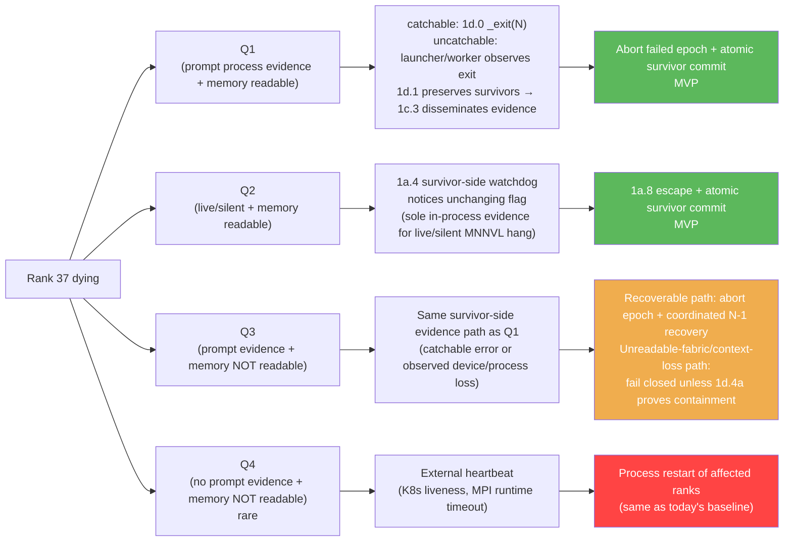

# 3. Failure Modes & FT Gaps in TRT-LLM's Stack

[< Back to Overview](README.md)

## 3.1 Failure modes: the 2x2

When a GPU fails in a WideEP group, the failure surfaces along **two orthogonal binary axes**. The 2x2 gives four quadrants; each has its own detection path and recovery story. Earlier versions of this doc collapsed everything to a two-mode framing. That terminology is retired in canonical pages because it conflated process evidence, MPI propagation, kernel progress, and peer-memory readability.

**The axes:**

- **Axis 1 (prompt host/process evidence):** Do survivors promptly observe host/process failure without relying on the MNNVL completion watchdog? "Yes" includes a catchable SIGSEGV/SIGABRT or CUDA exception followed by the 1d.0 exit path, and uncatchable SIGKILL/OOM/device loss observed through MPI futures, launcher/process monitoring, NCCL, or another survivor-side channel. "No" means the process remains alive but silent/hung and no backend error has surfaced; the MNNVL completion watchdog may be the only in-process evidence. SIGKILL is never described as caught by the dying process.
- **Axis 2 (peer memory):** Are the dead peer's *shared CUDA memory regions* still readable from survivors (remote loads succeed with stale data, or do they fault)? This is platform- and failure-specific. The Grace/aarch64 rack case uses CUDA 13.0+ unicast FABRIC handles with IMEX; the x86_64 B200/B300 intra-node path uses POSIX-FD handles. Items 1d.4 and 1d.4a validate readability and containment independently. A physically dead GPU may break Axis 2 regardless of Axis 1.

**The four quadrants:**

| | **Prompt survivor-visible host/process evidence (Axis 1: yes)** | **No prompt host/process evidence (Axis 1: no)** |
|:---|:---|:---|
| **Memory readable (Axis 2: yes)** | **Q1** | **Q2** |
| **Memory not readable (Axis 2: no)** | **Q3** | **Q4** (rare) |

Q1–Q4 are the only canonical failure-class labels. Mechanisms such as handler abort, launcher propagation, live/silent kernel spin, and peer-memory loss are described explicitly rather than used as aliases for a quadrant.

### Q1 — prompt host/process evidence, memory readable

**When it happens.** A catchable signal/exception reaches the dying process, or an uncatchable SIGKILL/OOM/process loss becomes promptly visible to surviving process/launcher monitoring, while the peer memory remains readable. This is the common process-death acceptance shape; only catchable signals execute the 1d.0 handler path.

**What the handler does (today).** Verified in `cpp/tensorrt_llm/runtime/utils/mpiUtils.cpp` (~lines 195–215):

```cpp
previousHandler = std::signal(sig, [](int signal) {
    MPI_Abort(MPI_COMM_WORLD, EXIT_FAILURE);
});
```

And the `forwardAbortToParent` variant additionally:

```cpp
previousHandler = std::signal(sig, [](int signal) {
    pid_t parentProcessId = getppid();
    kill(parentProcessId, SIGKILL);
    MPI_Abort(MPI_COMM_WORLD, EXIT_FAILURE);
});
```

**The legacy/default effect.** Without the merged 1d.0 FT-mode path, `MPI_Abort(MPI_COMM_WORLD, …)` terminates every process in the communicator. Because `MPI.COMM_WORLD` is the full 72-rank EP group, every rank dies; the `forwardAbortToParent` variant can also signal the launcher.

**Coverage.** PR 1d.0 / #14160 is merged and removes `MPI_Abort` from the catchable signal-handler path under FT mode. It does **not** by itself keep survivors alive: Audit 1a showed the tested default `mpirun` still terminates the job on abnormal exit. Item 1d.1 must admit only a launcher/runtime configuration proven to preserve survivors; 1c.3 reports evidence, 1c.3a creates survivor control membership, and 1d.0a handles poisoned-world lifecycle/finalization. **MVP scope.**

**Where this lives in the stack.** L1 (process orchestration). Has nothing to do with the AlltoAll kernel or the data plane; it's a consequence of the MPI orchestrator's default behavior.

### Q2 — live/silent, memory readable

**When it happens.** The peer process remains alive but silent/hung, no backend or process-monitor error surfaces promptly, and peer memory remains observably readable—for example, a Python deadlock, GIL pathology, user-space driver hang, thermal stall, or blocked forward thread. A fabric-grant revocation belongs in Q2 only if hardware evidence shows survivor reads remain valid; otherwise the readability axis places it in Q4.

**What the surviving kernel does.** Verified in `cpp/tensorrt_llm/kernels/communicationKernels/moeAlltoAllKernels.cu`. Both the dispatch (around lines 537–584) and combine (around 1190–1217) loops spin on peer completion flags via raw inline PTX. The `completion_flags` table lives in *symmetric MNNVL memory*, so survivor reads of `completion_flags[*][dead_rank]` are remote loads against the dead rank's GPU:

```cpp
for (int peer_rank = lane_id; peer_rank < ep_size; peer_rank += warpSize) {
    bool flag_set = false;
    auto s = clock64();
    do {
        uint32_t* flag_ptr = &ptrs.completion_flags[rank_id][peer_rank];
        uint32_t flag_value;
        asm volatile("ld.relaxed.sys.u32 %0, [%1];" : "=r"(flag_value) : "l"(flag_ptr));
        flag_set = flag_value == expected_value;
    } while (!flag_set && !check_timeout(s));
    if (!flag_set) { asm volatile("trap;"); return; }
}
```

where `check_timeout(s)` is `(clock64() - (s)) > 300ll * 2000ll * 1000ll * 1000ll` — a **300-second** kernel-side budget. On expiry, the kernel runs `asm volatile("trap;")`, which **corrupts the CUDA context** and is unrecoverable in-place.

In Q2, the dying rank's *GPU* remains healthy and the selected sharing mode still leaves the peer region readable. The rack hypothesis relies on unicast FABRIC-handle lifetime semantics; the x86_64 POSIX-FD path requires its own 1d.4 evidence. In either admitted case, survivor reads return stale data, the flag never advances, and kernels spin indefinitely (or until `trap;` corrupts the context at 300 s).

**Detection.** Q2 is the recoverable no-signal quadrant where the survivor-side host watchdog (PR 1a.4) is the **sole in-process evidence source**: it reads the same flag table from the CPU and reports a suspected peer to the recovery coordinator. (Q4 also has no dying-rank broadcast, but is an external-heartbeat/restart case.) The watchdog must not publish committed membership. PR 1c.3 distributes evidence; item 1c.4b commits one mask + immutable `ActiveRankMap` + generation only after admission, EPLB preparation, survivor communicators, and graph policy are ready.

**Coverage.** PR #13404 supplies a mask copied into each kernel launch and therefore protects only a later launch. It cannot release a kernel that was already running with the old all-active value. Promoted item 1a.8 adds a device/host-visible abort or generation primitive that the running kernel can observe and return through without `trap;` poisoning the CUDA context. Recovery also requires the atomic coordinator and survivor membership described below. **MVP scope.**

### Q3 — prompt evidence, memory unreadable

**When it happens.** Severe hardware fault that takes the GPU offline at the fabric/memory level *and* surfaces as a CUDA error to the dying rank's host CPU. Most severe HW faults qualify — XID 79 "GPU fell off bus", PCIe link down, severe NVIDIA XID errors that escalate to `cudaErrorNoDevice` on the next CUDA API call from the dying rank.

**What's different from Q1/Q2.** The dying rank's GPU is *dead*, so the symmetric memory mapping on survivors is no longer backed by valid memory. When a survivor's AlltoAll kernel does its next remote load against `completion_flags[*][dead_rank]`, the load itself faults on hardware-dead memory. The survivor's kernel takes a CUDA error; the CUDA context on that survivor becomes invalid.

**Detection.** The dying rank may catch a CUDA error and terminate through the merged 1d.0 `_exit(N)` path, but it cannot broadcast after `_exit`. A surviving worker-death, NCCL, launcher, or watchdog path records the failure; a surviving 1c.3 thread then disseminates/reconciles that evidence. Q3 reuses those MVP evidence paths, while physical peer-memory containment remains a separate acceptance question.

**Recovery — the timing race.** Between (a) the FT subcomm broadcast arriving at survivors and (b) survivors' next remote read of the dead peer's now-unreadable memory:

- **Evidence arrives before the next remote access or launch** → the coordinator still runs the complete failed-epoch abort, reconcile, admission, quiesce, EPLB preparation, survivor rebuild, graph-policy, commit, and request-disposition transaction. Evidence is not permission to mask immediately.
- **Evidence arrives while no survivor kernel is running** → the same full transaction can begin without first releasing an in-flight kernel. It is not a direct evidence-to-mask shortcut.
- **Broadcast loses + survivor kernel mid-collective** → kernel was actively spinning when the GPU died; remote read faults; CUDA context corrupted on survivor. **This is the only sub-case that needs Phase-2-class context recovery** (`cudaDeviceReset` heavy, or `ncclCommAbort` + reinit if NCCL was the next thing the survivor would have called).

Software timing alone cannot prove this race safe. A remote access to physically unreadable fabric memory may poison a survivor CUDA context before host recovery wins. Item 1a.8 covers recoverable timeout/abort paths. Item 1d.4a must add a lab-approved inaccessible-peer-memory/device-loss injection to the ordinary FABRIC/IMEX process-death run; healthy-GPU process death alone cannot prove Q3. A physical failure that invalidates survivor contexts remains fail-closed/restart unless that destructive acceptance proves containment.

### Q4 — no prompt evidence, memory unreadable

**When it happens.** No prompt survivor-visible host/process evidence exists *and* the peer's shared CUDA memory is unreadable. A live/hung host may not reach a CUDA call, while the fabric/device failure prevents watchdog reads. Q4 may later become Q3 when a launcher, backend, or CUDA API surfaces the fault; until then only external monitoring is reliable.

**Why no FT design feature recovers Q4 in-place.** Every detection mechanism the FT design has is broken in Q4:

- 1d.0 path: no catchable signal/exception reaches the dying rank, and no prompt process exit is visible to survivors.
- 1c.3 FT subcomm broadcast: nothing to broadcast (dying rank doesn't know; survivor watchdogs may also fail).
- 1a.4 host-side watchdog on survivors: polls `completion_flags` from CPU via host-mapped memory. If that memory backs onto the dead peer's GPU, the CPU read may also fault (SIGBUS) or return garbage.
- Survivor kernels: dead from cascading fault on the next remote read.

**Recovery.** External orchestration heartbeat (K8s pod liveness probe, MPI runtime heartbeat, operator-detected SLO breach) detects the cluster is broken and restarts the affected ranks (or the whole job). This is the **same fallback path that handles every failure today on the pre-FT stack** — Q4 isn't a regression, it's the same baseline at a tens-of-seconds-to-minutes detection latency.

**Out of in-place FT scope.** Q4 inherits external-heartbeat detection plus process restart. The <10 s target applies only to failure classes admitted and proven recoverable by the physical E2E matrix; it is not a blanket claim for Q1–Q3.

### The 2x2 picture



### Frequency, difficulty, and the post-1d.0 inversion

It's worth surfacing the failure-cause distribution per quadrant plus an inversion that affects the design ordering.

**Quadrant frequency.** By raw frequency, **Q1 dominates today**—most failures become prompt process/host evidence through a catchable CUDA/OS signal or an uncatchable OOM/SIGKILL/exit observed by the launcher while peer memory remains readable. Only the catchable subset executes the legacy MPI signal handler; default launcher behavior can still propagate any abnormal exit to the job. “Rank died, runtime propagated, cluster went down” describes the common outcome.

**Quadrant difficulty.** By difficulty, **Q2 and the recoverable subset of Q3 are integration problems, not just detection problems**. PR 1a.4 supplies survivor evidence and merged PR 1a.2 / #13404 supplies the next-launch mask, but promoted 1a.8 is required to escape an already-running kernel. Q3 additionally needs physical FABRIC/IMEX containment evidence. Q4 remains an external-restart case.

**The post-1d.0 inversion.** Merged PR 1d.0 removes the handler's explicit `MPI_Abort`; survivor preservation still depends on the 1d.1-admitted launcher/runtime mode. When that admission passes, Q1/Q3 evidence can begin recovery but never authorizes masking. Q2 needs survivor-watchdog evidence, and every admitted path converges through 1c.4b before topology commit. Q4 inherits external-heartbeat detection.

| Phase of deployment | Survivor-visible failure shape | Implication |
|:---|:---|:---|
| **Today (no FT)** | Q1 catchable failure may call `MPI_Abort`; any abnormal exit may also be propagated by the launcher → cluster down | Runtime-wide termination is the common outcome, whether initiated by the handler or launcher |
| **Post-1d.0 + admitted launcher mode** | Handler no longer calls `MPI_Abort`; Q1/Q3 can produce survivor-visible evidence only when the launcher/runtime preserves survivors; Q2 needs the MNNVL watchdog; Q4 needs an external heartbeat | 1d.1 launcher admission and 1d.0a lifecycle remain mandatory; evidence is not permission to mutate placement or mask |
| **Corrected MVP** | Detect; abort the failed epoch; reconcile evidence; validate placement admission; quiesce; prepare EPLB; rebuild survivor control/NCCL; apply graph policy; commit mask + `ActiveRankMap` + generation; dispose requests; resume | 1a.8, 1b.2a, 1c.3a, 1c.4a–1c.4c, 1d.0a, and 1a.11 close the integration gaps; 1d.4/1d.4a prove the supported physical envelope |
| **Post-1d.0 + Phase 1-IB (NIXL-EP, conditional)** | Cross-IB hypothesis: quiesced topology mutation may avoid a replacement-inclusive rebuild | Audit 3 must prove error signaling, mid-iteration quiescence, and `disconnect_ranks` / `connect_ranks` behavior. It is not assumed to release an already-running transfer or contain a physical peer-memory fault. |

This is why the design treats Q2 machinery as architecturally important even though Q1 is more frequent. It also explains why detection latency alone is not the recovery contract: every survivor must stop the failed epoch and move through the same ordered commit.

### Integration safety failures discovered during MVP implementation

The implementation review exposed failure modes orthogonal to Q1–Q4:

1. **Stale running kernel.** #13404 copies the active mask into launch parameters; a kernel already running cannot observe a later host mask. Promoted 1a.8 supplies the recoverable escape.
2. **Premature publication.** If a watchdog mutates the mask before EPLB placement and communicators change, tokens can be dropped or zero-filled against the old placement. Detected and committed state are separate; 1c.4b is the sole commit owner.
3. **No surviving expert.** `72 × 4 = 288` slots for 256 experts leaves only 32 extra copies. Item 1b.2a verifies the real per-layer placement and failure domains before admission.
4. **Static management membership.** Blocking MPI/attention-DP gathers still include the dead rank unless 1c.3a and 1c.4a rebuild their membership.
5. **Failed-epoch leakage.** Any partial dispatch/combine output is invalid. Item 1c.4c prevents partial or zero-filled logits from escaping and defines request disposition.
6. **Stale CUDA graphs.** Captured communicators and launch-time masks become invalid across a recovery generation. Promoted 1a.11 provides eager fallback plus invalidation/recapture.
7. **Poisoned lifecycle.** Normal `MPI_Finalize` or another world collective can hang after peer death. Item 1d.0a owns deterministic survivor shutdown.
8. **Unsupported deployment route.** Rank-0 frontend loss, MegaMoE/DeepEP selection, missing MPI thread support, or absent FABRIC/IMEX prerequisites must fail admission through 1d.1 rather than silently bypass FT.

## 3.2 Gap analysis by layer

For each layer of the stack (L1 / L2 / L3 / EPLB / Detection), what's missing today, mapped to the affected Q1–Q4 quadrants. All findings are anchored against current source per the research pass.

> **Framing note.** [PR #12718](https://github.com/NVIDIA/TensorRT-LLM/pull/12718)'s `classify_error()` is **downstream of failure reporting** — it regex-classifies error messages that have already surfaced as Python exceptions. If a backend doesn't surface an exception (the MNNVL kernel hangs silently; TRT-LLM's custom NCCL ops don't wire `ncclCommAbort`), PR #12718 sees nothing. Most of the gaps below are **producer-side**: backends that fail without raising an exception upstream, or paths where the abort / error-query API exists in the upstream library but isn't wired in TRT-LLM. The detection layers in [§5.3](05-phase-1-immediate-survival.md#53-failure-detection--pr-12718-integration) are what *produce* signals on the silent paths so PR #12718 can consume them.

### L1 — Process orchestration gaps

| Gap | Current state | Affected quadrant(s) | Reference |
|:---|:---|:---|:---|
| Legacy/non-FT signal path aborts `MPI_COMM_WORLD` | #14160 removes handler `MPI_Abort`; 1d.1 must admit a survivor-preserving launcher/runtime mode | **Q1/Q3 catchable-signal subset** | 1d.0, 1d.1 |
| `MPIPoolExecutor` has no partial-failure path | Verified: `proxy.py:225–280`'s `mpi_done_callback` only enqueues exceptions; `MpiPoolSession.abort()` at `mpi_session.py:167–168` calls `comm.Abort(1)` which kills the world | **Q1/Q3** (no survivor path after prompt process evidence) | Core source |
| No per-rank liveness tracking at L1 | MPI has no built-in liveness monitor; TRT-LLM has no shim | **Q1–Q4**; prompt evidence lacks rank granularity and silent peers lack a liveness source | — |

### L2 — Control plane gaps

| Gap | Current state | Affected quadrant(s) | Reference |
|:---|:---|:---|:---|
| No fault-tolerant MPI communicator | Zero non-test uses of `MPI_ERRORS_RETURN`, `MPI_Comm_revoke`, `MPI_Comm_shrink`, `MPI_Comm_agree`, or ULFM anywhere in TRT-LLM | **Q1/Q3** — after prompt evidence, the next `COMM_WORLD` collective can still poison recovery | — |
| No out-of-band failure-broadcast channel | All control-plane traffic goes over `MPI.COMM_WORLD`; a poisoned `COMM_WORLD` takes down the broadcast too | **Q1–Q3** — survivors cannot reconcile evidence on an affected world communicator | — |
| Static attention-DP/PyExecutor membership | Blocking rank-state, request, batch-size, token-count, and model-input gathers still contain the failed rank | Hangs degraded serving after detection | 1c.3a, 1c.4a |
| Detection and committed membership conflated | A detector can mutate the same `EPGroupHealth` mask consumed by communication before placement/communicators are ready | Split-brain or silent wrong output | 1c.4b |
| `torch.distributed` not initialized on MPI path | Only initialized when `orchestrator_type="ray"` | On the Ray path, `torch.distributed` provides its own abort+reinit via `destroy_process_group` + `init_process_group`. Not available on MPI default path. | `llm_args.py:2903` |

### L3 — Data plane gaps (per backend)

| Backend | Used by | Gap | Affected quadrant(s) | Reference |
|:---|:---|:---|:---|:---|
| **MNNVL** (`NVLinkOneSided`, primary) | NVL72 production AlltoAll | #13404 added the launch-time mask and rank-capacity plumbing, but an already-running kernel cannot see a later host mask and still reaches destructive `trap;` | **Q2** and recoverable **Q3** | #13404 + promoted 1a.8 |
| **MNNVL** (`NVLinkTwoSided`) | Intra-node variant | Same as above; FIFO-based sync with no timeout | **Q2/Q3** | `fusedMoeCommKernels.cu` |
| **NVSHMEM** (`DeepEP`, `DeepEPLowLatency`) | Cross-node fallback | No public `mask_buffer_ptr` API; `Buffer.__del__` → `intranode::barrier` deadlocks on peer death | **Q2/Q4** hang; cleanup can also deadlock after **Q1/Q3** evidence | `deep_ep.py:86`, `deep_ep_low_latency.py:103`, `configurable_moe.py:422` |
| **NCCL** (`AllGatherReduceScatter`, TP allreduces, `NcclCommunicatorOp`) | Fallback EP backend, TP, PP | `ncclCommAbort` / `NCCL_ASYNC_ERROR_HANDLING` not wired in TRT-LLM's custom NCCL ops (zero non-test uses) | **Q1–Q3** supported-error paths; 1a.7 wires abort/rebuild | — |

### EPLB gap

The load balancer was designed as a static-topology system. `MoeLoadBalanceMetaInfo` stores `epSize` and `epRank` as `int` fields (verified at `moeLoadBalanceCommon.h:40–52`); every reader assumes these don't change; the data structures (`rankExpertIds[epSize][slotCountPerRank]`, `globalSlotIds[epSize * slotCountPerRank]`) are sized at creation and not reallocated.

**Consequence:** even after failure evidence arrives, tokens can still be routed to the dead rank unless EPLB's placement table and communication membership change together. Worse, the canonical 288-slot/256-expert configuration does not guarantee a surviving copy. Item 1b.2a admits only placements with a per-layer/per-expert survivor on a distinct failure domain; 1c.4b publishes the placement and mask in one recovery generation. §5.2 introduces `reconfigure_mask_only` for admitted MVP configurations and full `reconfigure` with migration for v1.

### Detection gap

The existing infrastructure in PR #12718 ([status verified in research pass report](redesign-research-pass-report.md)) provides executor-level error classification (`classify_error()` returns `"immediate_fatal"` / `"severe"` / `"transient"`) and a token-bucket `ErrorBudget`. This is the foundation WideEP FT extends.

What's missing:
- **Per-EP-rank health.** Today's model is binary (whole executor healthy or fatal). WideEP FT needs a per-rank state.
- **AlltoAll timeout detector.** The kernel's `check_timeout` is 300s and destructive; no sub-5s host-side detector exists.
- **MPI worker-death per-rank granularity.** `_error_monitor_loop` detects any worker crash but doesn't distinguish which rank.
- **Cross-rank consensus on the failed set.** No out-of-band channel for the surviving ranks to agree on which peer is dead.
- **Detected versus committed state.** Evidence must not mutate the active data-plane mask directly.
- **Failed-epoch disposition.** No component currently guarantees that partial/zero-filled logits from the interrupted epoch are suppressed.
- **Recovery generation ownership.** No coordinator atomically orders `detect → abort failed epoch → reconcile evidence → validate admission → quiesce → prepare EPLB → rebuild survivor control/NCCL → apply graph policy → commit mask + ActiveRankMap + generation → apply request disposition → resume`.

## 3.3 Why not just pivot to Ray?

The structural argument is strong: Ray at L1 + `torch.distributed` at L2 decouples actor and communicator lifecycle. A Ray pivot would remove the MPI-specific handler, world-poisoning, and launcher-propagation risks that complicate prompt-evidence Q1/Q3 failures. It would not eliminate those failure quadrants: actors still die, survivor membership still changes, and peer-memory readability remains platform-specific. `torch.distributed` also carries PyTorch's NCCL abort + reinit support, which gives NCCL-based collectives a cleaner FT story.

This section lays out the trade-off honestly and states the MVP decision.

### What Ray would buy

1. **MPI-specific Q1/Q3 propagation risk removed.** No MPI signal handlers, no `MPI_COMM_WORLD` poisoning, and no `MPIPoolExecutor` brittleness. Ray sees actor deaths independently, but the recovery still needs survivor membership and an atomic generation commit.
2. **NCCL abort inherited from PyTorch.** The `torch.distributed` path already calls `ncclCommAbort` correctly in `destroy_process_group`. TRT-LLM's custom NCCL op wiring gap (PR 1a.7) is still required for the pipeline-parallel path but not for core EP collectives.
3. **ULFM irrelevance.** ULFM's availability-by-MPI-build concern evaporates because ULFM is MPI-specific.
4. **Cleaner Phase 2 rebuild.** `torch.distributed.destroy_process_group()` + `init_process_group()` is the well-understood pattern; MPI's `MPI_Comm_spawn` / ULFM path is more complex.
5. **K8s + KubeRay alignment.** Production NVL72 deployments are trending toward KubeRay-managed clusters. A Ray-primary FT path aligns with where customers are going.

### What Ray would cost

1. **`HostMoeTensorSharer` is hard-baked to MPI.** Verified: `moe_load_balancer.py:896–897` calls `global_mpi_comm.Split_type(MPI.COMM_TYPE_SHARED)` with no `TLLM_DISABLE_MPI` guard anywhere in the file. On the Ray path, the current code would fail the node-local-peer discovery. This is real porting work — replace `MPI.COMM_TYPE_SHARED` with a hostname-based or Ray-placement-group-based discovery mechanism, audit every reader.
2. **Ray-path CI is not characterized at WideEP scale.** Verified: Ray-tagged tests exist (`l0_dgx_b200.yml`, `l0_dgx_h100.yml`, `l0_h100.yml`, `tests/integration/defs/accuracy/test_llm_api_pytorch_ray.py`, `unittest/_torch/ray_orchestrator/multi_gpu/`) but the largest configurations are TP ≤ 4 (Llama-3.1-8B). There are no EP ≥ 32 tests, no DeepSeek-V3 tests on the Ray path, and no Ray-vs-MPI perf comparisons in the regression suite. Adopting Ray as the default FT path means running customer-facing WideEP on a substrate we haven't benchmarked at the scale it'll be used.
3. **Disagg + Ray + NIXL is unsupported.** Verified at `tests/integration/defs/disaggregated/test_disaggregated.py:597`: explicit test-skip with the reason "Ray orchestrator is not supported with NIXL(DEFAULT) cache transceiver backend." Since NIXL is the production default for disagg, this is a hard gap that Phase 1-DS would have to close before disagg FT could ship on Ray.
4. **Ecosystem inertia.** SLURM-launched, bare-metal MPI deployments are a real part of the installed base. A Ray-only MVP would leave those users on "no FT" for the duration.
5. **Q2 and peer-memory containment are not addressed by pivoting.** The live/silent MNNVL kernel hang and Q3/Q4 readability problem are orthogonal to orchestrator choice.

### Decision

**MVP stays on MPI.** Ray is a future migration question, not a near-term answer. Rationale:

- **Cost #2 is the blocker.** Shipping MVP on a code path with no EP ≥ 32 perf characterization is unacceptable for a production FT feature. The regressions we haven't seen yet could be large.
- **Cost #1 is real engineering work** (HostMoeTensorSharer refactor + every-reader audit) that we would have to do before MVP could even run on Ray at WideEP scale.
- **Benefit #1 is valuable but addressable on the MPI path.** Merged 1d.0 removes handler `MPI_Abort`; 1d.1 still must admit a survivor-preserving launcher/runtime mode, 1c.3a/1c.4a rebuild survivor membership, and 1d.0a owns poisoned lifecycle.
- **Benefit #5 does not favor Ray.** Q2 running-kernel escape and Q3/Q4 physical containment work remain regardless of orchestrator.

The MPI-path FT-enabling work (§5.4) is the compensating investment. Net effect: MVP addresses the MPI-specific propagation and poisoned-lifecycle portions of Q1/Q3, the Q2 live/silent MNNVL path through running-kernel escape, and only the subset of Q3 for which 1d.4a proves survivor-context containment. Placement admission, survivor control/NCCL membership, graph policy, atomic membership commit, and request disposition remain common to every admitted recovery. Ray becomes a future migration we revisit after:

- A Ray-path WideEP perf characterization audit (named risk in [§9](09-risks-and-open-questions.md)) confirms acceptable perf at EP ≥ 32.
- The `HostMoeTensorSharer` MPI-hard-bake has been factored out (planning dependency).
- The disagg + Ray + NIXL support gap is closed (pre-requisite for disagg FT on Ray).

We treat the pivot as a **deferred architectural question**, not an MVP decision. The design keeps the Ray path open — nothing in the proposed MPI-path work prevents a later migration, and the Q2 running-kernel work ports directly to Ray.

**Industry signal (May 2026 survey):** Both vLLM and SGLang's in-flight FT work targets Ray, not MPI. vLLM PR #34833 explicitly states "Elastic EP currently supports only Ray + internal LB," deferring MPI. SGLang's [FT RFC](https://github.com/gaidandawang-afk/sglang/issues/1) is also Ray-based. They converge on report → pause → cleanup/retry and similar control APIs, but their data planes differ: SGLang's Mooncake path exposes `activeRanks`; vLLM Elastic-EP uses `allgather_reducescatter` or NIXL-EP topology mutation, with a separate DeepEP timeout path. This strengthens the long-term Ray-pivot argument without changing the MPI-for-MVP decision.

## 3.4 Summary: gap × quadrant matrix

| Gap | Layer | Affected quadrant(s) | Effect | Addressed in |
|:---|:---|:---:|:---|:---|
| Handler/launcher propagates process failure to the whole job | L1 | Q1/Q3 | Merged 1d.0 removes handler `MPI_Abort`; 1d.1 must admit a survivor-preserving launcher; poisoned lifecycle remains | 1d.0, 1d.1, 1d.0a / §5.4 |
| `MPIPoolExecutor` has static full-world membership | L1 | Q1/Q3 | Blocks survivor operation after prompt process evidence | 1c.3a, 1c.4a / §5.4 |
| No survivor control communicator | L2 | Q1–Q3 | Blocks survivor-only coordination | 1c.3a / §5.4 |
| Failure-notification broadcast not yet merged | L2 | Q1–Q3 | Blocks evidence reconciliation | Draft 1c.3 / §5.3 |
| MNNVL launch mask and 128-rank capacity are merged, but the running-kernel escape is only a draft and is not yet validated or merged | L3 | Q2 and recoverable Q3 | Blocks bounded failed-epoch abort | Draft 1a.8 / [#15895](https://github.com/NVIDIA/TensorRT-LLM/pull/15895) / §5.1 |
| NCCL survivor abort/rebuild is not merged | L3 | Q1–Q3 | Blocks supported NCCL non-MoE/fallback paths | Draft 1a.7 / §5.1 |
| DeepEP destructor deadlock | L3 | Q1–Q4, mechanism-dependent | Can hang the conditional DeepEP path during failure or cleanup | §6.2 (deferred) |
| EPLB static topology | — | Q1–Q3 | Blocks coherent N-1 recovery | §5.2 |
| Detection-only AlltoAll watchdog is not merged | Detection | Q2 | Leaves the live/silent MNNVL path without in-process evidence | Draft 1a.4 / §5.3 |

Every gap in this table is addressed in Phase 1 (with one conditional path) — see the transport mapping below for which Phase 1 sub-track applies to which deployment.

### 3.5 Transport determines mechanism

The FT mechanism that applies is determined by **which L3 transport is in use**, not by deployment name. `CommunicationFactory` selects the transport via fall-through (see [§1.1 Transport selection](01-user-journey-and-stack.md#transport-selection-what-trt-llm-actually-picks-today)); the FT story follows.

| Transport in use | Selected when (gate) | FT mechanism | Where it lives in this design |
|:---|:---|:---|:---|
| `NVLinkOneSided` / `NVLinkTwoSided` | `MnnvlMemory.supports_mnnvl()` True — all NVLink up. Applies to single-node 8-GPU NVL boxes *and* GB200/GB300 NVL72 rack | **Recoverable kernel escape + admitted placement + atomic survivor commit.** The launch-time mask is one primitive, not the recovery transaction. | §5.1–§5.5; MVP for OneSided, v1 for TwoSided; 1d.4a gates rack FABRIC/IMEX. |
| `DeepEP` / `DeepEPLowLatency` | Cross-IB / cross-fabric peers (no MNNVL). Production choice for multi-node B200+IB per Peiheng's deck | **NIXL-EP `disconnect_ranks` + EPLB redistribute** (preferred) *or* **DeepEP 100s kernel-timeout interim** (vLLM PR #38534 pattern) | §8.2 Phase 1-IB; gated on [Audit 3](09-risks-and-open-questions.md#audit-3--nixl-ep-evaluation-as-cross-ib-data-plane-backend). Phase 1 + Phase 2 collapse into one "scale-down then scale-up" path for this transport. |
| `AllGatherReduceScatter` (NCCL) | DeepEP unavailable; safety-net fallback | **`ncclCommAbort` + reinit** | §5.1 (PR 1a.7), MVP scope. Same primitive vLLM converged on (RFC #30112 / `gpu_worker.py:161`). |

**Implication.** The MVP covers an `NVLinkOneSided` + supported-NCCL deployment only when the full admission contract passes: supported backend, recoverable kernel escape, surviving expert placement, survivor control/attention-DP membership, generation-scoped communicator rebuild, CUDA-graph policy, and frontend/rank-0 policy. Intra-node physical proof is 1d.4; NVL72 FABRIC/IMEX proof is 1d.4a. DeepEP-family transport remains a separate Phase 1-IB path.

The next section introduces the three-phase architecture that translates these gaps into work.
