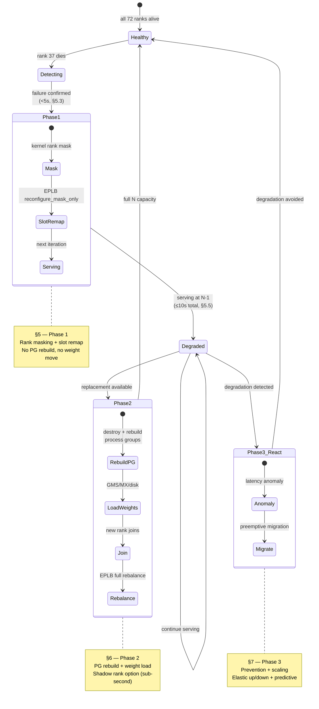
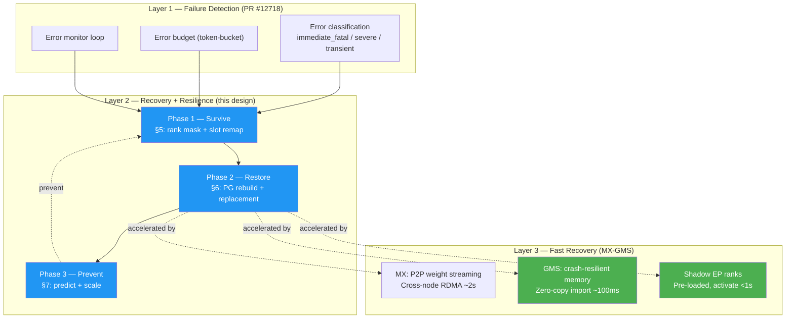

# 4. Three-Phase Recovery & Resilience Architecture

[< Back to Overview](README.md)

The design splits fault-tolerance work into three phases with different goals, time budgets, and dependency structures. Phases 1 and 2 address *recovery* from a failure that has already occurred; Phase 3 is *resilience* — preventing failures or adapting capacity before they become outages.

## Phase 1 — Survive (P0, target ≤ 10 s)

**Goal.** Keep the EP group serving through a rank failure. No replacement GPU required; surviving ranks absorb the dead rank's load via slot remap.

**Core mechanism.** Mask the dead rank in the AlltoAll kernel (Mode B fix, §5.1). Rewrite `MoePlacementInfo` so dead-rank slots are unreachable (§5.2). Detect the failure via host-side watchdog + per-rank error budget (§5.3). Survive Mode A via MPI signal handler replacement (§5.4).

**Precondition for MVP.** Replication factor ≥ 2 (the DeepSeek production default). With ≥ 2 replicas per expert, every expert already has a live copy on some surviving rank — the slot remap simply points routing there. No H2D weight copy at recovery time. MVP target: **< 10 ms** for the EPLB reconfigure step; **< 10 s** end-to-end from failure to serving at N-1 (detection dominates the budget).

**What v1 adds.** Zero-replica handling (when a dead rank held the only copy of some expert) via the existing EPLB weight-migration path; multi-failure consensus; NVLinkTwoSided + AllGatherReduceScatter backend coverage.

**What it deliberately avoids.** Process-group reconstruction. Serving continues through the existing NCCL / NVSHMEM / MPI groups with one rank masked. That's the key simplification — rank masking defers the hardest distributed-systems problem to Phase 2.

## Phase 2 — Restore (P1, target < 1 s with GMS / ~2 s with MX / minutes with disk)

**Goal.** Restore full N-rank capacity by bringing a replacement rank into the group.

**Core mechanism.** A new process joins the EP group in the dead rank's slot. Communicator layers (NCCL, MNNVL, NVSHMEM, optionally MPI) are torn down and rebuilt with the N-rank topology. EPLB does a full rebalance. See §6.2 for the per-backend rebuild semantics — they differ meaningfully (NCCL: `ncclCommAbort` + reinit works; MNNVL: needs fabric-handle re-exchange with the survivors; NVSHMEM: currently no clean story — audit needed).

**What restarts and what doesn't.** Only the dead rank's process is replaced. The N-1 surviving processes keep running throughout — their CUDA contexts, weights, KV cache, and MPI/Ray actor state all persist. They participate in the collective communicator rebuild but do not restart. This is what distinguishes the design from Ray 2.55's DP-group FT, which tears down the whole group. Detail in §6.1.

**Shadow EP ranks (sub-second path).** Pre-provisioning a standby rank with expert weights already loaded via GMS read-only import enables RO → RW lock upgrade + PG join + serve in < 1 s. Architecturally faster than general-purpose shadow workers because EP ranks don't own per-request KV cache (attention-DP means each rank's KV is local) — the KV allocation bottleneck that gates generic shadow activation doesn't apply. §6.3 details this.

**GMS / MX dependency.** Phase 2's sub-second target depends on MX-GMS Phase 2 (GMS zero-copy import). Without GMS, Phase 2 still works but at minutes-class (disk reload) or seconds-class (MX P2P RDMA) latencies. The Phase 2 design functions without GMS; GMS just accelerates it.

**Second-failure handling.** The PG rebuild is a collective; if a second rank dies mid-rebuild, the operation fails. Mitigation is to abandon the rebuild, mask the newly dead rank via Phase 1 semantics, and retry Phase 2 later. Detail in §6.4.

## Phase 3 — Prevent / Scale (P2, no fixed timeline)

**Goal.** Reduce the rate of failures that trigger Phase 1, adapt capacity to load changes, and avoid recovery cost entirely where possible.

**Core capabilities.**

1. **Latency anomaly detection** (§7.1). Per-rank AlltoAll latency tracked via CUDA events; 3×-median anomaly detector flags ranks showing degradation (thermal throttling, correctable ECC) before they fully fail.
2. **Preemptive expert migration** (§7.2). On detection, migrate experts off the degrading rank before it dies — uses the Phase 1 v1 weight-migration path.
3. **Elastic scaling (up/down)** (§7.3). Adding capacity to a healthy group (join new rank without a preceding failure) uses the Phase 2 rebuild primitives; removing capacity gracefully uses the Phase 1 masking primitives. Phase 3 glues these into a scaling API.
4. **Predictive failure detection** (§7.4). Model-based predictions from error-rate trends, thermal patterns, ECC correction counts. Further out than the above — requires historical telemetry infrastructure.

Phase 3 is the lowest-priority phase and is not staffed for MVP. The rough plan in [§8.3](pr-execution/08-implementation-plan.md#83-phase-3-rough-plan) scopes it at work-track level.

## Phase comparison

| | Phase 1 | Phase 2 | Phase 3 |
|:---|:---|:---|:---|
| **Goal** | Survive | Restore | Prevent / scale |
| **Time budget** | ≤ 10 s end-to-end | < 1 s (shadow+GMS) / ~2 s (MX P2P) / minutes (disk) | Preventive — no fixed budget |
| **Trigger** | Rank failure detected | Replacement available | Degradation signal / load change |
| **Requires new GPU?** | No | Yes | Sometimes (scale-up) |
| **Touches process groups?** | No (rank mask only) | Yes (rebuild) | Yes (scale-up/down uses Phase 2 primitives) |
| **Weight movement at recovery time?** | MVP: no; v1: only for zero-replica experts | Yes (new rank must load its shard) | Yes (preemptive migration) |
| **External dependencies** | PR #12718 for error-classification base | Orchestrator (Ray/K8s/Dynamo) for provisioning; optionally MX-GMS for fast weight load | Telemetry / anomaly infra |
| **Competitive parity** | Matches SGLang Elastic EP capability | **Exceeds** competitors (full restoration is not shipped elsewhere) | Ahead of roadmap elsewhere |

## The layered reliability stack (how the phases fit with PR #12718 and MX-GMS)

Three concurrent workstreams form the full stack:

| Workstream | Role in the stack |
|:---|:---|
| **PR #12718** (error classification) | Foundation — provides `classify_error()` + `ErrorBudget` primitives that WideEP FT extends per-rank. Must land or be rebased into the implementation base branch before §5.3 work begins. |
| **WideEP FT** (this design) | Middle — detects partial failures, survives them (§5), restores capacity (§6), prevents (§7). |
| **MX-GMS** | Top — accelerates §6 from minutes → sub-second via GMS zero-copy + shadow EP ranks. Phase 2 works without MX-GMS but is minutes-class. |

Each workstream is separately owned. Dependencies are:

- WideEP FT Phase 1 → PR #12718 (hard prerequisite for §5.3 detection work).
- WideEP FT Phase 2 → PR #12718 + Phase 1 (hard). MX-GMS is a soft dependency (accelerates, doesn't gate).
- Shadow EP rank activation (§6.3) → MX-GMS Phase 2 (GMS zero-copy).
- WideEP FT Phase 3 → Phase 2 (uses PG rebuild primitives for elastic scaling).

## What is (and isn't) in scope

**In scope.**
- Aggregated WideEP serving (single `trtllm-serve` instance, one EP group spanning 32–72+ GPUs).
- PyTorch backend (default; legacy TRT engine backend is out of scope per `AGENTS.md`).
- NVLinkOneSided (primary production backend for NVL72). NVLinkTwoSided + AllGatherReduceScatter added in v1.
- Single-GPU failure as MVP; multi-failure consensus in v1.

**Deferred track (in scope but after MVP).**
- Disaggregated serving FT. Per-pool collective-level FT from the primary track applies unchanged within each pool; the new work is cross-pool coordination at the `trtllm-serve` proxy layer. Tracked as Phase 1-DS in [§8](pr-execution/08-implementation-plan.md); starts after Phase 1 MVP, parallelizable with Phase 1 v1.

**Out of scope.**
- DeepEP / DeepEPLowLatency FT — requires public NVSHMEM `mask_buffer_ptr`, which doesn't exist. In scope as a v1 target *if* the upstream API becomes available; indefinitely deferred otherwise.
- TensorRT engine backend.
- Standard EP (≤ 8 GPUs) — not the bottleneck; process-restart handling is adequate for intra-node EP failures.
- Individual request durability across failures. If a request is mid-iteration when its rank fails, that request is lost. Recovering specific in-flight requests is an orchestration-layer concern, not a collective-layer one.

## How to read the rest of the doc

[§5](05-phase-1-immediate-survival.md) is the densest technical section — it unifies what v1 split across five documents (rank masking, EPLB, detection, MPI signal handlers, end-to-end wiring) because they all land together as Phase 1. [§6](06-phase-2-full-restoration.md) is the restoration work with explicit treatment of what restarts vs what stays alive. [§7](07-phase-3-beyond-failover.md) is discussion-level for prevention/scaling. [§8](pr-execution/08-implementation-plan.md) breaks everything into named PRs with sizes and dependencies. [§9](09-risks-and-open-questions.md) names the two audits that gate later work and tabulates every risk.
