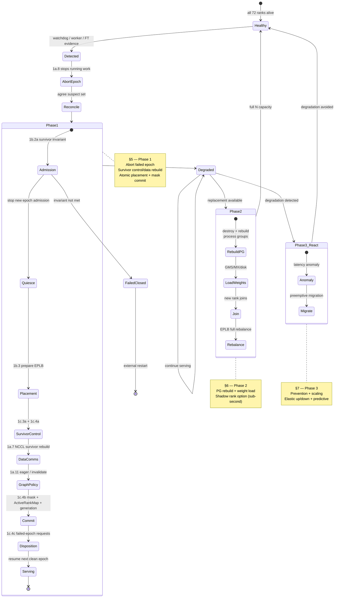
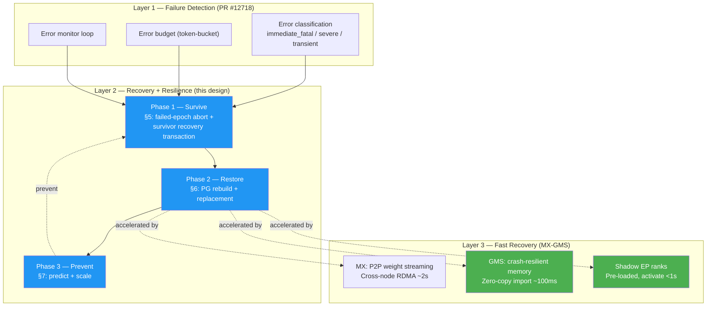

# 4. Three-Phase Recovery & Resilience Architecture

[< Back to Overview](README.md)

The design splits fault-tolerance work into three phases with different goals, time budgets, and dependency structures. Phases 1 and 2 address *recovery* from a failure that has already occurred; Phase 3 is *resilience* — preventing failures or adapting capacity before they become outages.

## Phase 1 — Survive (P0, target ≤ 10 s)

**Goal.** Keep the EP group serving through a rank failure. No replacement GPU required; surviving ranks absorb the dead rank's load via slot remap.

**Core mechanism.** Item 1d.1 first admits only a launcher/runtime mode proven to preserve survivors. Detection sources then report evidence without mutating the active mask. Promoted 1a.8 aborts the running epoch; 1b.2a validates placement; 1b.3 prepares EPLB; 1c.3a/1c.4a establish survivor control/attention-DP membership; 1a.7 rebuilds supported NCCL; 1a.11 applies pre-commit eager/invalidation policy; and 1c.4b commits placement + mask + immutable `ActiveRankMap` + generation. Item 1c.4c disposes failed-epoch requests before resume; 1d.0a prevents poisoned-world/finalization hangs.

**Precondition for MVP.** The actual placement must leave at least one copy of every expert in every layer after any admitted single-rank failure, with copies on distinct admitted failure domains. The canonical `72 × 4 = 288`-slot configuration has only 32 extra slots for 256 experts and does not imply two copies per expert. No-copy recovery is allowed only when 1b.2a proves the invariant. The **<10 ms** target applies to the EPLB sub-step; end-to-end recovery includes abort, reconciliation, communicator rebuild, and graph policy.

**What v1 adds.** Online weight migration for placements that MVP rejects, multi-failure consensus, and NVLinkTwoSided coverage. NCCL survivor recovery, running-kernel escape, and CUDA-graph recovery are MVP work, not v1 deferrals.

**Ship gates.** Item 1d.4 proves the production-component path on physical intra-node NVLink hardware. Item 1d.4a separately exercises the Grace/aarch64 NVL72 FABRIC/IMEX path under real process death and an approved inaccessible-peer-memory/device-loss injection; it either proves survivor-context containment or preserves Q3 as fail-closed. Neither mocks, healthy-GPU SIGKILL, nor evidence from one handle mode substitutes for the other.

**Boundary with Phase 2.** Phase 1 reconstructs the survivor-only control and supported data-plane communicators required to serve safely at N-1. Phase 2 performs the harder full-N topology change: provision a replacement, admit it, rebuild replacement-inclusive communicators, and restore capacity.

## Phase 2 — Restore (P1, target < 1 s with GMS / ~2 s with MX / minutes with disk)

**Goal.** Restore full N-rank capacity by bringing a replacement rank into the group.

**Core mechanism.** A new process joins the EP group in the dead rank's slot. The baseline rebuild covers required NCCL, MNNVL, and control/bootstrap state, then EPLB performs a full rebalance. DeepEP/NVSHMEM teardown and reconstruction are conditional on selecting that backend, not a prerequisite for the MNNVL path. See §6.2 for the distinct per-backend semantics.

**What restarts and what doesn't.** Only the dead rank's process is replaced. The N-1 surviving processes keep running throughout — their CUDA contexts, weights, KV cache, and MPI/Ray actor state all persist. They participate in the collective communicator rebuild but do not restart. This is what distinguishes the design from Ray 2.55's DP-group FT, which tears down the whole group. Detail in §6.1.

**Shadow EP ranks (sub-second path).** Pre-provisioning a standby rank with expert weights already loaded via GMS read-only import enables RO → RW lock upgrade + PG join + serve in < 1 s. Architecturally faster than general-purpose shadow workers because EP ranks don't own per-request KV cache (attention-DP means each rank's KV is local) — the KV allocation bottleneck that gates generic shadow activation doesn't apply. §6.3 details this.

**GMS / MX dependency.** Phase 2's sub-second target depends on MX-GMS Phase 2 (GMS zero-copy import). Without GMS, Phase 2 still works but at minutes-class (disk reload) or seconds-class (MX P2P RDMA) latencies. The Phase 2 design functions without GMS; GMS just accelerates it.

**Second-failure handling.** The PG rebuild is a collective; if a second rank dies mid-rebuild, the operation fails. Mitigation is to abandon the rebuild, mask the newly dead rank via Phase 1 semantics, and retry Phase 2 later. Detail in §6.4.

## Phase 3 — Prevent / Scale (P2, no fixed timeline)

**Goal.** Reduce the rate of failures that trigger Phase 1, adapt capacity to load changes, and avoid recovery cost entirely where possible.

**Core capabilities.**

1. **Latency anomaly detection** (§7.1). Per-rank AlltoAll latency tracked via CUDA events; 3×-median anomaly detector flags ranks showing degradation (thermal throttling, correctable ECC) before they fully fail.
2. **Preemptive expert migration** (§7.2). On detection, migrate experts off the degrading rank before it dies — uses the Phase 1 v1 weight-migration path.
3. **Elastic scaling (up/down)** (§7.3). Adding capacity to a healthy group uses the Phase 2 rebuild primitives; graceful removal reuses the coordinated placement/membership/graph commit transaction without a failed-epoch abort. Phase 3 glues these into a scaling API.
4. **Predictive failure detection** (§7.4). Model-based predictions from error-rate trends, thermal patterns, ECC correction counts. Further out than the above — requires historical telemetry infrastructure.

Phase 3 is the lowest-priority phase and is not staffed for MVP. The rough plan in [§8.3](pr-execution/08-implementation-plan.md#83-phase-3-rough-plan) scopes it at work-track level.

## Phase comparison

| | Phase 1 | Phase 2 | Phase 3 |
|:---|:---|:---|:---|
| **Goal** | Survive | Restore | Prevent / scale |
| **Time budget** | ≤ 10 s end-to-end | < 1 s (shadow+GMS) / ~2 s (MX P2P) / minutes (disk) | Preventive — no fixed budget |
| **Trigger** | Rank failure detected | Replacement available | Degradation signal / load change |
| **Requires new GPU?** | No | Yes | Sometimes (scale-up) |
| **Touches process groups?** | Yes: survivor-only MPI/attention-DP and supported NCCL membership | Yes: replacement-inclusive full-N rebuild | Yes (scale-up/down uses Phase 2 primitives) |
| **Weight movement at recovery time?** | No, but only after 1b.2a admission; otherwise fail closed | Yes (new rank must load its shard) | Yes (preemptive migration) |
| **External dependencies** | Merged PR #12718 foundation; physical intra-node GPU access; NVL72/equivalent + working IMEX for 1d.4a | Orchestrator (Ray/K8s/Dynamo) for provisioning; optionally MX-GMS for fast weight load | Telemetry / anomaly infra |
| **Competitive parity** | Matches SGLang Elastic EP capability | **Exceeds** competitors (full restoration is not shipped elsewhere) | Ahead of roadmap elsewhere |

## The layered reliability stack (how the phases fit with PR #12718 and MX-GMS)

Three concurrent workstreams form the full stack:

| Workstream | Role in the stack |
|:---|:---|
| **PR #12718** (error classification) | Merged foundation — provides `classify_error()` + `ErrorBudget` primitives that WideEP FT extends per-rank. Only semantic integration remains. |
| **WideEP FT** (this design) | Middle — detects partial failures, survives them (§5), restores capacity (§6), prevents (§7). |
| **MX-GMS** | Top — accelerates §6 from minutes → sub-second via GMS zero-copy + shadow EP ranks. Phase 2 works without MX-GMS but is minutes-class. |

Each workstream is separately owned. Dependencies are:

- WideEP FT Phase 1 consumes the already-merged PR #12718 semantic foundation.
- WideEP FT Phase 2 → completed Phase 1 (hard). MX-GMS is a soft dependency (accelerates, doesn't gate).
- Shadow EP rank activation (§6.3) → MX-GMS Phase 2 (GMS zero-copy).
- WideEP FT Phase 3 → Phase 2 (uses PG rebuild primitives for elastic scaling).

## What is (and isn't) in scope

**In scope.**
- Aggregated WideEP serving (single `trtllm-serve` instance, one EP group spanning 32–72+ GPUs).
- PyTorch backend (default; legacy TRT engine backend is out of scope per `AGENTS.md`).
- NVLinkOneSided (primary production backend for NVL72) plus supported NCCL survivor recovery in MVP. NVLinkTwoSided remains v1.
- Single-GPU failure as MVP; multi-failure consensus in v1.
- Non-rank-0 worker failure for the built-in single-listener launch. Rank-0 failure requires an external frontend/failover policy.

**Deferred track (in scope but after MVP).**
- Disaggregated serving FT. Per-pool collective-level FT from the primary track applies unchanged within each pool; the new work is cross-pool coordination at the `trtllm-serve` proxy layer. Tracked as Phase 1-DS in [§8](pr-execution/08-implementation-plan.md); starts after Phase 1 MVP, parallelizable with Phase 1 v1.

**Out of scope.**
- Direct DeepEP / DeepEPLowLatency masking and NVSHMEM survivor rebuild — requires a public upstream primitive that does not exist. Cross-IB deployments remain a separate conditional Phase 1-IB track: prefer NIXL-EP topology mutation if Audit 3 passes, otherwise evaluate only the explicitly limited DeepEP timeout interim. Neither path expands the NVL72 MVP.
- TensorRT engine backend.
- Standard EP (≤ 8 GPUs) — not the bottleneck; process-restart handling is adequate for intra-node EP failures.
- Transparent replay of already-emitted tokens. No output from the failed epoch is emitted; queued work is preserved when safe, and every in-flight request receives an explicit retry, reroute, or request-error disposition under 1c.4c.

## How to read the rest of the doc

[§5](05-phase-1-immediate-survival.md) is the densest technical section — it unifies rank masking, EPLB, detection, survivor membership, lifecycle, request disposition, and atomic recovery. [§6](06-phase-2-full-restoration.md) is replacement/full-N restoration. [§7](07-phase-3-beyond-failover.md) is discussion-level for prevention/scaling. [§8](pr-execution/08-implementation-plan.md) breaks everything into named PRs with sizes and dependencies. [§9](09-risks-and-open-questions.md) names the three audit tracks and tabulates every risk.
