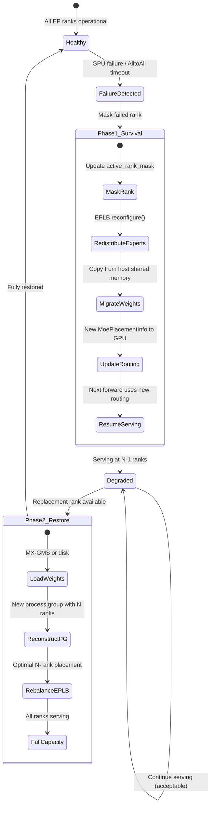
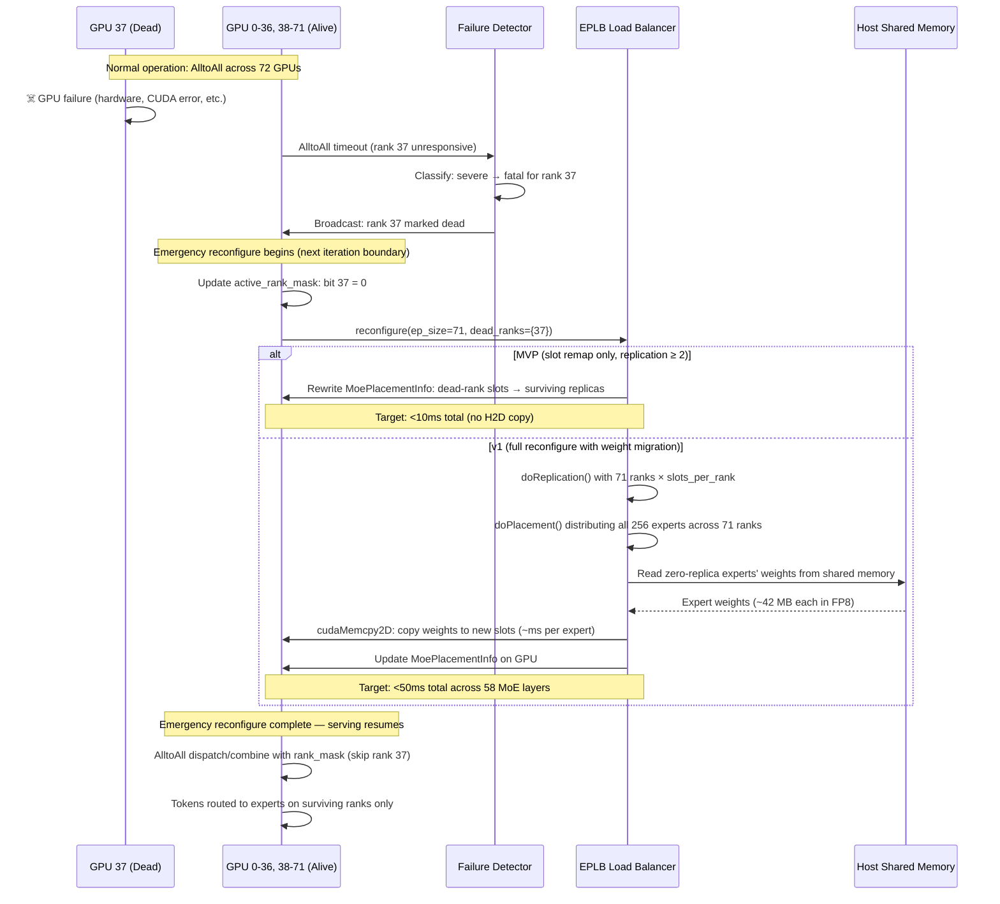
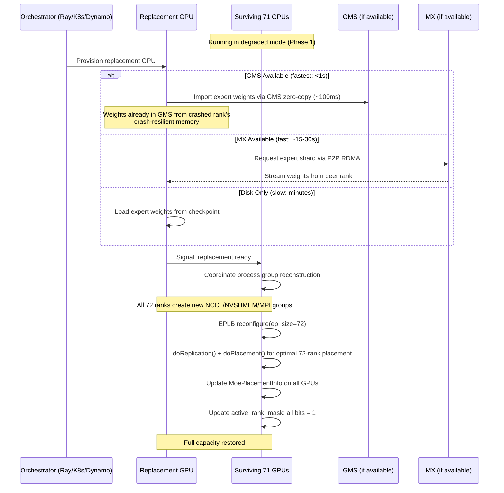

# 4. Design: Two-Phase Recovery

[< Back to Overview](README.md)

## Design Philosophy

The industry has converged on "redistribute first, restart optionally later" (SGLang, vLLM, DeepSeek all follow this pattern). This design adopts the same principle but adds a deeper architectural insight: **Phase 1 solves the easier problem (rank masking) to buy time for Phase 2 to solve the harder problem (process group reconstruction) without time pressure.** This temporal decoupling — serving in degraded mode while reconstruction happens in the background — is what makes the two-phase approach more than just "do two things sequentially." It transforms process group reconstruction from a blocking, time-critical operation into a background optimization.

> **Note on process group reconstruction:** Phase 1 deliberately avoids process group reconstruction — the hardest technical problem in distributed fault tolerance. Instead, rank masking allows AlltoAll to skip dead ranks within the existing process groups. This is not abandoning process group reconstruction; it is **deferring it to Phase 2**, where it enables full capacity restoration. The key insight is that Phase 1 buys time: the system is serving (degraded) while Phase 2 performs reconstruction in the background. Without Phase 1, reconstruction would have to happen under pressure while the system is completely down.

## Phase 1: Immediate Survival (P0, Target: <10s)

Phase 1 keeps the system serving after a GPU failure. No replacement rank is needed — the surviving N-1 ranks absorb the dead rank's workload.

### Recovery Sequence

> **The diagram below depicts Phase 1 v1 behavior** — full reconfigure including weight migration (`doReplication()` + `doPlacement()` + `cudaMemcpy2D`). **MVP recovery is simpler:** slot remap only, no H2D copy, no `doReplication`/`doPlacement` re-run. MVP skips from "update active_rank_mask" straight to "update MoePlacementInfo on GPU" — the surviving replicas of every expert are already resident, and the remapped placement table points tokens to them. See §06 "Terminology — weight migration vs slot remapping for MVP" for why this is correct under the MVP precondition (replication factor ≥ 2).

### What Each Surviving Rank Does

When rank 37 fails in a 72-rank EP group:

1. **Detect** (1-5s): AlltoAll timeout fires. The detection mechanism (see [07-failure-detection.md](07-failure-detection.md)) classifies this as a rank-level failure, not a system-level failure.

2. **Mask** (<1ms): Set `active_rank_mask[37] = 0`. All communication backends check this mask before dispatching/combining.

3. **Emergency reconfigure** — two variants:
   - **MVP (<10ms, no H2D copy):** `MoeLoadBalancer.reconfigure_mask_only()` rewrites `MoePlacementInfo` so dead-rank slots are unreachable; routing falls through to the surviving replicas that already exist. No weight movement. Requires replication ≥ 2 (the DeepSeek-V3 production default).
   - **v1 (<50ms, includes H2D copy):** Full `MoeLoadBalancer.reconfigure()` — runs `doReplication()` + `doPlacement()` with the dead rank excluded, migrates weights for experts that now have zero replicas (reads from host shared memory, writes to GPU via `cudaMemcpy2D`), updates `MoePlacementInfo`.

4. **Update Routing** (<1ms): New `MoePlacementInfo` is copied to all surviving ranks as part of step 3.

5. **Resume** (next iteration): The next forward pass uses the new routing. AlltoAll dispatch sends tokens only to active ranks. Combine only waits for active ranks.

### Memory Impact

For DeepSeek-V3 (256 experts, 58 MoE layers) losing 1 rank from EP=72:

| Metric | FP8 | BF16 |
|:-------|:----|:-----|
| Experts per rank (before) | ~3.6 (256/72) | ~3.6 |
| Experts per rank (after) | ~3.6 (256/71) | ~3.6 |
| Extra experts per rank | ~0.05 | ~0.05 |
| Extra memory per rank (all layers) | ~140 MB | ~280 MB |
| Feasibility on 80GB GPU | Comfortable | Comfortable |
| Feasibility on 192GB GB200 | Trivial | Trivial |

With EPLB replication (num_slots > num_experts), the memory impact is slightly higher because more slots need to be filled, but remains well within budget.

### Serving During Degraded Mode

During degraded operation (N-1 ranks):

- **Throughput:** Reduced proportionally. With 71/72 ranks, expect ~1.4% throughput reduction (approximately linear in expert computation capacity).
- **Latency:** Slightly increased. The surviving ranks handle marginally more expert computation, and EPLB replication quality decreases slightly (fewer slots for hot expert copies).
- **Correctness:** Fully preserved. Every expert is available on at least one surviving rank. The routing table ensures all tokens reach their target experts.

### Policy for In-Flight Requests at the Moment of Failure

**Requests that were mid-iteration when the rank died fail.** Specifically: the AlltoAll in progress at the moment of failure is abandoned (its kernel was either hung or completed partial work on the surviving ranks), and all requests whose tokens were being processed in that iteration receive an error response. PR #12718's `_handle_errors()` is invoked with `charge_budget=True` for these requests.

Requests waiting in the executor queue but not yet scheduled into the failing iteration are **not** affected — they are picked up in the next iteration with the updated mask and new routing. New requests arriving after the emergency reconfigure are served normally at the reduced capacity.

Recovering the *specific* in-flight requests that failed — for example, replaying them from the last emitted token — is an **orchestration-layer concern**, not a collective-layer one, and is out of scope for this design. In a disaggregated setup, the `trtllm-serve` router can retry a failed generation against a different pool; in an aggregated setup, the client is responsible for resubmission. See [§10 Q2](10-risks.md#q2-what-happens-to-in-flight-requests-during-phase-1-recovery) for the full discussion and alternatives.

## Phase 2: Full Restoration (P1, Target: <1s with GMS, <30s with MX, minutes with disk)

Phase 2 restores the system to full N-rank capacity by bringing up a replacement rank. This is optional — Phase 1 alone is sufficient for continued serving.

### Recovery Sequence

### Phase 2 Recovery Time by Weight Loading Method

| Method | Weight Load Time | Total Recovery | Dependency |
|:-------|:----------------|:---------------|:-----------|
| GMS zero-copy import | ~100ms | **<1s** | GMS integration (Phase 2 of MX-GMS design) |
| MX P2P RDMA | ~15-30s (for expert shard) | **~20-35s** | MX integration (Phase 1 of MX-GMS design) |
| Disk (checkpoint) | 1-3 minutes | **2-4 minutes** | No dependency (baseline) |

### Process Group Reconstruction

This is the most complex part of Phase 2. All communication backends need new groups:

1. **NCCL:** `dist.destroy_process_group()` for old EP groups, then `dist.new_group()` with all N ranks.
2. **NVSHMEM/MnnvlMemory:** Deallocate old symmetric memory, reallocate with N-rank stride.
3. **MPI:** `MPI_Comm_create()` with new group (not `MPI_Comm_split()` which requires all old ranks).
4. **DeepEP buffers:** Destroy old buffers (explicit `destroy()` call), create new ones with N-rank communicator.
5. **NVLink workspaces:** Deallocate old workspace, reallocate for N-rank AlltoAll.

This process is a coordinated operation that requires all N ranks to participate. It's inherently a "stop-the-world" operation for the EP group, but can be made fast (~100ms) if weights are already loaded.

### Shadow EP Ranks (Future Enhancement with MX-GMS)

With MX-GMS integration, Phase 2 can be pre-staged via a standby GPU that pre-loads expert weights via GMS read-only import and activates (RO → RW) in <1s on failure. The full architectural argument for why shadow *EP* ranks are fundamentally faster than general-purpose shadow workers (KV-cache allocation bottleneck does not apply with `enable_attention_dp=True`) is covered in [§08 Shadow EP Ranks](08-mx-gms-integration.md#shadow-ep-ranks-sub-second-activation). It is the capability that differentiates this design from SGLang's Elastic EP, which has no full restoration path.

## Phase Comparison

| Aspect | Phase 1 (Survive) | Phase 2 (Restore) |
|:-------|:-------------------|:-------------------|
| **Goal** | Keep serving at reduced capacity | Restore full capacity |
| **Trigger** | GPU failure detected | Replacement rank available |
| **Downtime** | <10s (target) | Transparent (Phase 1 covers while Phase 2 runs) |
| **Requires replacement GPU** | No | Yes |
| **Process group change** | No (rank masking) | Yes (reconstruction) |
| **Expert redistribution** | MVP: slot remap to surviving replicas. v1: full reconfigure + weight migration for zero-replica experts | Optimal: full EPLB rebalance for N ranks |
| **External dependency** | None | Orchestrator (Ray/K8s/Dynamo), optionally MX-GMS |
| **Competitive parity** | Matches SGLang Elastic EP | **Exceeds** all competitors (full restoration) |
