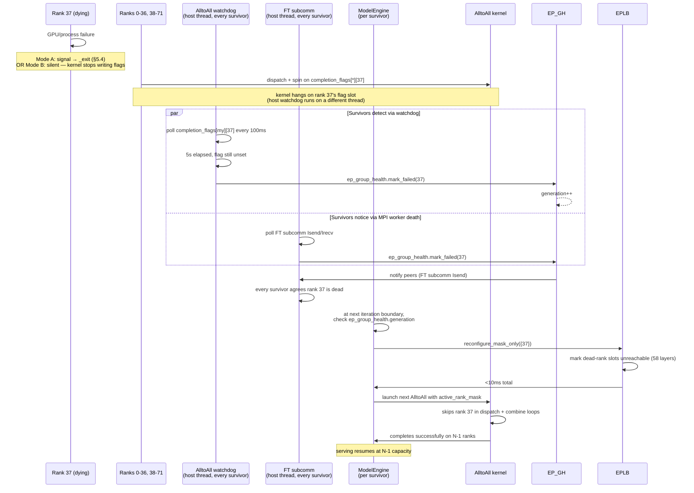

# 5. Phase 1: Immediate Survival

[< Back to Overview](README.md)

This section unifies all Phase 1 mechanics. Phase 1 keeps the EP group serving through a rank failure with no replacement GPU and no process-group reconstruction. Five subsections, in execution order: rank masking in the AlltoAll kernel (§5.1), EPLB topology adaptation (§5.2), failure detection layered on PR #12718 (§5.3), the MPI-path FT-enabling work that makes Mode A survivable (§5.4), and the end-to-end flow with timing budget (§5.5).

## 5.1 Rank masking in communication kernels

The Mode B fix. When a rank dies silently, surviving ranks' AlltoAll kernels spin forever on `completion_flags[*][dead_rank]` because the dead peer never writes its flag. Rank masking adds a host-controlled bitmap that the kernel checks before polling each peer; masked peers are skipped. The mask is the *only* data-plane FT primitive that fits TRT-LLM's MNNVL-based path because we own the kernel ([§2.2.1](02-stack-comparison-and-positioning.md#221-kernel-ownership-of-the-performance-critical-alltoall)).

**Scope of applicability — by L3 transport, not deployment name.** The kernel mask applies whenever `NVLinkOneSided` (or `NVLinkTwoSided`) is the selected transport, which `CommunicationFactory` chooses whenever `MnnvlMemory.supports_mnnvl()` returns True (`_mnnvl_utils.py:380-387` — "all NVLink up" check). That covers:

- Single 8-GPU NVL-class node (DGX/HGX B200, B300, H100) — intra-node NVLink up.
- GB200 / GB300 NVL72 single rack — full rack fabric.
- Multi-node SLURM/MPI deployments where the inter-node fabric is also NVLink (rare, but it qualifies).

It does **not** apply when the transport falls through to DeepEP / DeepEPLowLatency (selected for cross-IB / cross-non-NVLink-fabric peers — see [§3.5 Transport determines mechanism](03-failure-modes-and-gaps.md#35-transport-determines-mechanism)). That regime is covered separately in [§8.2 Phase 1-IB](08-implementation-plan.md#phase-1-ib--cross-ib-transport-coverage-nixl-ep-track) with a different mechanism (NIXL-EP `disconnect_ranks` + EPLB redistribute, gated on Audit 3). The MVP scope below addresses the NVLink-substrate footprint; Phase 1-IB addresses the cross-IB footprint.

### Per-backend approach

| Backend | Mechanism | MVP / v1 |
|:---|:---|:---|
| `NVLinkOneSided` (primary) | Add `active_rank_mask_lo, active_rank_mask_hi` (`uint64_t × 2` for up to 128 ranks) to dispatch + combine kernel pointer structs; guard both release-write and polling loops | **MVP** |
| `NVLinkTwoSided` | Same pattern; FIFO-based sync uses `mTail + kFifoDepth <= mHead` polling — same skip-poll-on-masked-peer rule applies | v1 |
| `AllGatherReduceScatter` (NCCL fallback) | Wire `ncclCommAbort` + `NCCL_ASYNC_ERROR_HANDLING=1` in TRT-LLM's NCCL wrapper; abort the comm, reinit a new one with surviving ranks via `torch.distributed` patterns | v1 |
| `DeepEP` / `DeepEPLowLatency` | Awaiting public `mask_buffer_ptr` API in NVSHMEM; deferred indefinitely | Out of scope |

### NVLinkOneSided (the MVP-critical change)

Source: `cpp/tensorrt_llm/kernels/communicationKernels/moeAlltoAllKernels.{h,cu}`. Two kernel structs and four loops change.

**Kernel pointer structs.** Add `uint64_t active_rank_mask_lo, active_rank_mask_hi` to both `DispatchKernelPointers` and `CombineKernelPointers`. The mask is written by the host before kernel launch and is read-only inside the kernel.

**Constexpr bump.** `kMaxRanks = 64` in the header (verified at `moeAlltoAllKernels.h:31`) is too small for NVL72 (72 ranks). Bump to **128**, which gives headroom and aligns with the two-uint64 mask. This is single-line but easy to miss — silent overflow if forgotten.

**Loop modifications.** Both dispatch (the release-write loop and the polling loop) and combine (matching pair) need a one-bit-test guard before per-peer work. The guard is a single `if (!(mask & (1ULL << peer))) continue;`.

```cpp
// Dispatch release-write loop, masked
for (int target_rank = lane_id; target_rank < ep_size; target_rank += warpSize) {
    if (!(active_rank_mask & (1ULL << target_rank))) continue;   // skip dead
    uint32_t* flag_addr = &ptrs.completion_flags[target_rank][rank_id];
    asm volatile("st.relaxed.sys.u32 [%0], %1;" ::"l"(flag_addr), "r"(expected_value));
}
// Dispatch polling loop, also masked
for (int peer_rank = lane_id; peer_rank < ep_size; peer_rank += warpSize) {
    if (!(active_rank_mask & (1ULL << peer_rank))) continue;     // skip dead
    /* existing spin */
}
```

**Both sides must be masked.** A common mistake is to mask the write side only. That doesn't fix the hang: the surviving peer's polling loop on `completion_flags[Y][37]` would still spin until the 300s `trap;`, because nobody wrote that slot. The mask must short-circuit the *poll*, not just the *write*. Combine has the matching loop pair (release-write + poll) at lines 1190–1217; both need the guard.

**Routing pass change.** The combine accumulator already handles `dst_idx == -1` by zero-filling that slot's contribution (`acc[k].fill(0.0f)` at the dst_idx<0 branch). The routing pass — `compute_target_rank_id` — is extended to emit `dst_idx = -1` for tokens whose top-K target lands on a masked rank. No additional kernel work needed; the existing zero-fill path absorbs them.

**Performance impact.** One bit-test per rank per launch, in an outer loop that already loops over ranks. For 72 ranks: 72 bit-tests, negligible vs the memory operations. Performance gate at integration time: < 0.1 % steady-state regression with all ranks active.

**Kernel-side `check_timeout` backstop.** The 300s `trap;` stays as a worst-case defense — if the host watchdog (§5.3) fails to fire and the mask isn't set, the kernel will eventually self-abort rather than hang the GPU forever. PR 1a.8 (v1) optionally tightens this and replaces `trap;` with a host-visible flag to avoid context corruption; for MVP the existing behavior is acceptable.

**Industry precedent for the softer-than-`trap;` direction.** vLLM's in-flight FT work ([PR #38534](https://github.com/vllm-project/vllm/pull/38534)) uses a 100s static kernel-side timeout in DeepEP / NIXL-EP that **auto-masks** the failed rank rather than aborting — surviving ranks continue without hanging, no context corruption. This is exactly the direction PR 1a.8 proposes for our MNNVL kernel: replace `trap;` with a host-visible flag so the host can recover rather than requiring process restart. vLLM's 100s timeout is on a different backend (DeepEP / NIXL-EP, not MNNVL) and is library-side rather than kernel-side custom code, but the architectural shape — soft timeout + auto-mask + host-recoverable — validates the PR 1a.8 design choice.

### NCCL FT wiring (PR 1a.7)

Verified: zero non-test uses of `ncclCommAbort`, `NCCL_ASYNC_ERROR_HANDLING`, `ncclCommFinalize`, `ncclGetLastError` in TRT-LLM. The only NCCL integration is `torch.classes.trtllm.NcclCommunicatorOp` (P2P, no error hook).

**Why this matters more than "the EP fallback."** It's tempting to frame PR 1a.7 as a safety net for the rarely-used `AllGatherReduceScatter` EP backend, but NCCL is in the WideEP data path even when **MNNVL is the chosen AlltoAll backend.** Specifically:

- TP allreduces in non-MoE projections (LM head, embedding, output-side reductions) — NCCL via `torch.distributed` or via `NcclCommunicatorOp`.
- PP send/recv when `pp > 1` — NCCL via `NcclCommunicatorOp`.
- DeepSeek-V3 with `enable_attention_dp=True` reduces but does not eliminate this volume; the per-attention-layer TP allreduces go away, but output-side and (with PP) inter-stage collectives remain.
- The `AllGatherReduceScatter` EP backend itself — only chosen when MNNVL+DeepEP are both unavailable, which is rare on production NVL72.

A dead rank hangs the next NCCL collective on any of these paths just as surely as it hangs the MNNVL AlltoAll. Without `ncclCommAbort` wiring, that hang is unrecoverable — independent of whether MNNVL masking succeeds. So **PR 1a.7 is required for production WideEP regardless of which EP backend is selected**, not just as a fallback safety net. Audit 1a Day 1 corroborates this: even on the `torch.distributed` path (where PT does wire NCCL abort), PT 2.11's recovery is broken, which is why PR 2a.1 in Phase 2 drops below `torch.distributed` for the actual rebuild.

PR 1a.7 wires `NCCL_ASYNC_ERROR_HANDLING=1` at communicator init, registers a watchdog that calls `ncclCommAbort` on timeout, and exposes a Python-callable `abort_and_reinit(active_ranks)` API. **v1 scope** because the dominant Phase 1 MVP failure mode is Mode B (MNNVL kernel hang) which 1a.7 doesn't fix — but landing 1a.7 in v1 closes the parallel NCCL hang that the same dead rank causes in TP / PP collectives. AllGatherReduceScatter-as-the-EP-backend gets the same wiring for free.

## 5.2 EPLB topology adaptation

EPLB was designed as a static-topology system. `MoeLoadBalanceMetaInfo` stores `epRank` and `epSize` as plain `int` (verified in `moeLoadBalanceCommon.h:40–52`); the data structures (`rankExpertIds[epSize][slotCountPerRank]`, `globalSlotIds[epSize * slotCountPerRank]`) are sized at creation. Phase 1 needs to react to topology changes without rebuilding these structures from scratch every iteration.

### MVP: `reconfigure_mask_only`

The MVP precondition is replication ≥ 2 (DeepSeek production default). With ≥ 2 replicas per expert, every expert already has at least one live copy on a surviving rank. We don't need to move weights, allocate new slots, or rerun `doReplication` / `doPlacement` — we just need routing to find the live copy.

**Mechanism.** New C++ entry point on `MoeLoadBalancer`:

```cpp
void reconfigure_mask_only(std::set<int> const& deadRanks);
```

**What it does:**
1. Pause EPLB worker and compute threads at the next safe point (after the in-flight layer's update completes).
2. For each layer, mark every slot belonging to `deadRanks` as unreachable in `MoePlacementInfo`. Concretely: zero the routing entry's count or set it to a sentinel that the routing kernel skips.
3. `cudaMemcpyAsync` the updated `globalSlotIds` for all 58 MoE layers (DeepSeek-V3) on the EPLB stream.
4. Resume worker + compute threads.

**Target: < 10 ms total** for all 58 layers. No H2D weight copies. No slot reallocations. No `doReplication` / `doPlacement` rerun. The placement table just stops pointing at the dead rank's slots; routing falls through to surviving replicas.

### Why this works under the MVP precondition

Each expert exists on ≥ 2 slots. The dead rank held one of them. The surviving slot's pointer is unchanged. The routing kernel (`torch.ops.trtllm.moe_load_balance_routing`) reads the placement table, sees the surviving slot is live, and dispatches the token there. No code change needed in the kernel — it already handles "this expert is on rank R, slot S" without caring whether other replicas still exist.

**Memory impact on surviving ranks.** Slots on surviving ranks see slightly more traffic (the dead rank's load is absorbed proportionally). For DS-V3 / EP=72 losing 1 rank, surviving ranks pick up ~1.4 % extra traffic per AlltoAll. Memory footprint is unchanged because no new experts arrive — surviving slots already had the weights.

### v1: full `reconfigure` with weight migration

When a dead rank held the *only* copy of some expert (replication 1, or pathological replica concentration), MVP is insufficient — the expert has zero surviving replicas and routing has nowhere to fall through. v1 adds:

1. `reconfigure(emergency_mode: bool)` C++ entry point.
2. Detect zero-replica experts (those that only existed on `deadRanks`).
3. For each, pick a surviving rank with free slot capacity, assign the expert there.
4. Copy the expert's weights from the node-local POSIX shm segment (which `HostMoeTensorSharer` already populates) to the new GPU slot via `cudaMemcpy2D` + gdrcopy.
5. Update `MoePlacementInfo` to point routing at the new slot.

Per-expert weight copy: ~0.1–0.3 ms. With ≤ 2 zero-replica experts per layer in pathological cases, total v1 budget: **< 50 ms** for all 58 layers.

**Why the host shm makes this cheap.** `HostMoeTensorSharer` (`moe_load_balancer.py:127–340`, with the node-local discovery at `:896–897`) maps every node's experts into POSIX shm at startup. Every rank on the same node can read every expert's weights without a network transfer. The "weight migration" is really a host-shm-to-GPU copy, not a remote fetch.

**Cross-node consideration.** A whole-node loss with replication=1 on that node loses experts that are not in any other node's shm. This is explicitly out of MVP and v1 scope; it's a node-level failure that needs Phase 2's MX P2P streaming (cross-node weight transfer) to recover. [§9](09-risks-and-open-questions.md) tracks this.

### Threading and atomicity

The EPLB worker thread runs continuously, rotating through layers and updating placement statistics. The compute thread runs `doReplication` + `doPlacement` periodically. `reconfigure_mask_only` must coordinate with both:

- **Worker thread:** poll for a "reconfigure pending" flag at layer boundaries; release the layer's signal token before checking.
- **Compute thread:** poll for the same flag at the start of each `doReplication` cycle; if pending, wait until reconfigure completes.

The `MoeLoadBalanceSingleLayerSignal::stepAndOwner` 64-bit step+owner word (`moeLoadBalanceCommon.h:25–37`) is the existing primitive for ownership coordination. We don't add a new primitive — we add a "reconfigure-pending" flag in `MoeLoadBalanceMetaInfo` that the existing threads check at their existing safe points.

## 5.3 Failure detection & PR #12718 integration

Detection is the entry point for everything in §5.1 and §5.2. The design extends [PR #12718](https://github.com/NVIDIA/TensorRT-LLM/pull/12718)'s error classification from binary executor health (healthy / fatal) to per-EP-rank health (each rank tracks its own health independently).

### Three-layer detection

| Layer | Mechanism | Latency | Covers which mode | Deployment caveat |
|:---|:---|:---|:---|:---|
| **Layer 1 — AlltoAll watchdog** (primary) | Host thread polling host-visible `completion_flags` table; flags ranks that haven't signaled within timeout | 1–5 s | Mode B (kernel hang) | Always available |
| **Layer 2 — Worker death notification** | PR #12718's `_error_monitor_loop` + per-rank `_check_mpi_futures` | ~5 s (poll interval) | Mode A (signal handler) — once §5.4 lands, this notices the dead rank's process exit | **Inert when `mpi_session = RemoteMpiCommSessionClient`** (workers in separate `mgmn_leader_node` process; `submit()` returns `[]`); see [§5.3 lessons](#lessons-from-pr-12718-implementation) below |
| **Layer 3 — Latency anomaly** (Phase 3) | Per-rank AlltoAll latency via CUDA events; 3×-median anomaly detector | 10–30 s | Pre-failure degradation (Phase 3, deferred) | Always available |

**Implication for `trtllm-llmapi-launch` deployments.** The `mgmn_leader_node`-based launcher path (used by `trtllm-bench`, `trtllm-serve` with `TLLM_SPAWN_PROXY_PROCESS=1`, and the layer-wise benchmark CI test) instantiates `RemoteMpiCommSessionClient`, whose `submit()` returns `[]`. PR #12718's `_check_mpi_futures()` therefore has no futures to inspect for those deployments and Layer 2 is silent. Layer 1 (the AlltoAll watchdog) is the **only** detection mechanism that fires there — it must not be treated as optional. Layer 1 is also strictly faster (1–5 s vs 5 s poll), so prefer it as the primary path everywhere, with Layer 2 as a redundant signal where available.

### Where errors come from: producers vs consumers

The detection layers above produce signals; PR #12718's `classify_error()` is the consumer of those signals. The matrix below shows, for each backend in the WideEP data path, **whether failures surface naturally today** (PR #12718 picks them up automatically) versus **which producer-side work this design adds** to surface signals on the silent paths.

| Backend | Used for in WideEP | Surfaces failure today? | What this design adds |
|:---|:---|:---|:---|
| NCCL via `torch.distributed` | TP allreduces, output-side collectives, attention DP coords | **Yes** — PT watchdog raises Python exception | Classified by PR #12718 patterns (`"nccl error"`, `"nccl timeout"`); Audit 1a Day 1 found PT 2.11's recovery path itself broken — PR 2a.1 (Phase 2) drops below `torch.distributed` |
| NCCL via TRT-LLM custom op | PP send/recv (`NcclCommunicatorOp`), `AllGatherReduceScatter` EP fallback | **No** — `ncclCommAbort`/`getAsyncError` not wired (zero non-test uses) | Closed by **PR 1a.7** (NCCL FT wrapper). Note that NCCL is in the WideEP data path even when MNNVL is the chosen EP backend (TP / PP collectives), so 1a.7 matters more than the "EP fallback" framing implies |
| NIXL | Disagg KV cache transfer (production default for §1-DS) | **Yes** — `check_xfer_state == ERROR` raises `RuntimeError("NIXL transfer failed: …")` (`_agent_py.py:125`) | Already classifiable; **PR 1c.1 adds NIXL-specific regex patterns** (`"nixl transfer failed"`, `"nixl transfer entered error state"`) so the classifier reaches `severe` instead of falling through to `transient` |
| MNNVL / NVLinkOneSided | WideEP MoE AlltoAll (NVL72 primary) | **No** — kernel spins on `completion_flags[*][peer]` silently; eventual 300s in-kernel `trap;` corrupts CUDA context | The **host-side AlltoAll watchdog (PR 1a.4)** *synthesizes* the exception — polls the host-visible flags table, raises `AlltoAllTimeoutError` at the configured deadline. Without 1a.4, MNNVL failures don't reach PR #12718 in any usable form |
| NVSHMEM / DeepEP | Cross-node EP fallback | **Limited** — `Buffer.__del__` deadlocks on peer death; no public `mask_buffer_ptr` | Out of MVP scope; deferred indefinitely pending upstream NVSHMEM API |

So **PR 1a.7 (NCCL wiring), PR 1a.4 (host watchdog), and PR 1c.1's NIXL patterns are the producer-side work** that makes PR #12718's classifier useful for WideEP. Without these, PR #12718 simply doesn't see the failures — even though it correctly classifies errors that *do* surface (CUDA, MPI worker death, signal-driven exceptions).

### Layer 1 — AlltoAll watchdog (the host-side abort hook)

The kernel's existing `completion_flags[kMaxRanks][kMaxRanks]` table sits in host-visible MNNVL fabric memory. The host can read it without entering the kernel. New component:

```python
class AlltoAllWatchdog:
    def __init__(self, completion_flags, ep_group_health, timeout_sec=5.0):
        self.completion_flags = completion_flags
        self.ep_group_health = ep_group_health
        self.timeout_sec = timeout_sec

    def watch(self, expected_flag_val):
        deadline = time.monotonic() + self.timeout_sec
        while time.monotonic() < deadline:
            pending = {
                r for r in range(self.ep_group_health.ep_size)
                if self.ep_group_health.is_active(r)
                and self.completion_flags[my_rank][r] != expected_flag_val
            }
            if not pending:
                return set()
            time.sleep(0.1)
        return pending  # ranks that timed out
```

**Timeout tuning.** Default 5 s. Configurable via env var (`TRTLLM_EP_FT_TIMEOUT_SEC`) or `MoeConfig` field:

| Deployment | Recommended timeout | Rationale |
|:---|:---|:---|
| NVL72 single rack | 2–3 s | NVLink latency is microseconds; >1s means a real failure |
| Multi-node + RDMA | 5–10 s | RDMA tail latencies are real; need to avoid false positives |
| Dev / CI | 1 s | Iterate fast |

The kernel's 300s `check_timeout` is a backstop — the watchdog should fire long before. If the watchdog fails (e.g., the host process is GIL-blocked), the kernel still self-aborts via `trap;` rather than hanging the GPU forever.

### Layer 2 — Per-rank worker death

PR #12718 introduces `GenerationExecutorProxy._check_mpi_futures()` and `_drain_error_queue()` helpers shared between `check_health()` and the daemon `_error_monitor_loop`. `mpi_done_callback` registered on each future enqueues exceptions to a shared `_error_queue` — there's no per-rank attribution. WideEP FT extends this to track which rank's future raised. Per-request errors (`RequestError` / `str`) are filtered out by PR #12718 in both paths so a single bad request can't promote into a per-rank failure; the per-rank tracker inherits that filter for free.

```python
class EPRankHealthTracker:
    def __init__(self, ep_size, ep_group_health):
        self.rank_budgets = {r: ErrorBudget() for r in range(ep_size)}
        self.ep_group_health = ep_group_health

    def on_mpi_worker_death(self, rank, error):
        cls = classify_error(str(error))     # PR #12718 primitive
        if cls == "immediate_fatal":
            self.ep_group_health.mark_failed(rank)
        elif cls == "severe":
            if self.rank_budgets[rank].consume(cost=0.5):
                self.ep_group_health.mark_failed(rank)
```

### EP-specific error patterns

PR #12718's classifier is regex-driven over lowercased error messages, returning string literals (`"immediate_fatal"`, `"severe"`, `"transient"`). WideEP FT adds patterns to the existing lists in `error_classification.py`:

```python
EP_IMMEDIATE_FATAL_EXTRA = [
    "nccl communicator abort", "nvshmem peer unreachable",
    "mpi rank terminated", "cuda context destroyed",
]
EP_SEVERE_EXTRA = [
    "alltoall timeout", "nccl timeout", "deep_ep buffer barrier hang",
    "symmetric memory access violation", "rdma timeout",
    # NIXL — disagg KV transceiver (production default). Strings drawn from
    # tensorrt_llm/_torch/disaggregation/nixl/_agent_py.py:40,43,125
    "nixl transfer failed",
    "nixl transfer entered error state",
    "nixl transfer wait timed out",
]
EP_TRANSIENT_EXTRA = ["alltoall slow", "nccl retry", "ecc correctable error"]
```

The classifier still returns the same three string literals; we add patterns, not classes. The NIXL additions ensure that KV-transfer failures on the disaggregated path classify as `severe` (consume per-rank budget; potential FT trigger) rather than falling through to `transient` (logged only). Producer-side, NIXL already raises these messages cleanly; the only design work is the regex patterns themselves.

### `EPGroupHealth` — the shared in-process primitive

Both detection layers + masking + EPLB reconfigure consume a shared rank-health view. `EPGroupHealth` is a thread-safe bitmask with a generation counter (idempotent mutators, defensive `frozenset` snapshots). Already in flight as PR #13302 (PR 1a.1).

API:
```python
class EPGroupHealth:
    def __init__(self, ep_size: int): ...
    def mark_failed(self, rank: int) -> bool: ...    # returns True iff state changed
    def mark_active(self, rank: int) -> bool: ...    # for Phase 2 restoration
    def is_active(self, rank: int) -> bool: ...
    def get_mask(self) -> int: ...                    # arbitrary-precision Python int
    def get_mask_words(self, n=2) -> tuple[int, ...]: # uint64 words for kernel ABI
    @property
    def generation(self) -> int: ...                 # bumps on effective change
    def get_failed_ranks(self) -> frozenset[int]: ...
```

`generation` is the cheap detection primitive: model engine caches the last-seen generation, compares on every iteration boundary, and triggers `reconfigure_mask_only` only when changed. This is O(1), not O(ep_size).

### Failure broadcast and cross-rank consensus

When rank 0 detects rank 37 hung via the watchdog, every surviving rank must agree before the next AlltoAll runs. Otherwise rank 0 masks 37 but rank 50 still tries to write to `completion_flags[37][50]` — split-brain.

The dominant Mode B failure (kernel spinning on dead-peer flag) is what makes this hard: the forward thread is stuck inside the kernel and can't participate in consensus. The broadcast must run on a host thread that is independent of GPU state.

**Approach (MPI path).** A dedicated MPI sub-communicator created at startup via `MPI_Comm_split` from `MPI.COMM_WORLD`, used only for FT signaling. The subcomm has `MPI_Errhandler_set(MPI_ERRORS_RETURN)` so a dead peer surfaces as an error rather than aborting the process. A dedicated CPU thread (separate from PyExecutor's forward thread) polls the subcomm via non-blocking `Isend` / `Irecv` + `Test`. This gives us a control-plane channel that doesn't go through the poisoned `MPI.COMM_WORLD` and isn't blocked by the stuck forward thread.

**Why blocking collectives don't work on the FT subcomm.** A blocking `MPI_Allreduce` on a poisoned communicator deadlocks even with `MPI_ERRORS_RETURN` set. Hence non-blocking + polling.

**ULFM if available.** `MPI_Comm_revoke` from ULFM is the cleanest primitive for "this comm is poisoned, give me a working one." But ULFM availability depends on the MPI build — opt-in in OpenMPI, patchy in MVAPICH, missing in Intel MPI. The MVP design uses ULFM if present and falls back to single-failure-only without it (acceptable for MVP).

**Approach (Ray path, future).** When/if we pivot, `torch.distributed.destroy_process_group()` + `init_process_group()` is the equivalent. No FT subcomm needed; PyTorch's machinery handles the abort.

### Single-failure consensus is trivial

For MVP single-failure: any surviving rank's report is authoritative. Multi-failure consensus ([§8.2 PR 1c.6](08-implementation-plan.md#82-phase-2-pr-breakdown), v1) implements two-phase suspect → confirm to avoid masking a slow-but-alive rank.

### Lessons from PR #12718 implementation

PR #12718 went through several iterations and one production-affecting regression before merging. Three of those experiences directly inform this design:

**1. Empty-collection predicates need explicit branches.** PR #12718's `pre_shutdown()` originally gated the quit-sentinel send on `all(not f.done() for f in self.mpi_futures)`, which is *vacuously True* for an empty list and therefore covered the `RemoteMpiCommSessionClient` case (no local futures) by accident. A later refactor to `any(...)` regressed that case — `any([]) == False` — and silently dropped the sentinel, hanging `dispatch_result_thread.join()` indefinitely. This manifested as a 2400 s `test_performance_alignment[1]` timeout. The fix is `if not self.mpi_futures or any(...)`. **Implication for WideEP FT:** every predicate over `self.ep_group_health.active_ranks()`, `pending` rank sets, etc. must explicitly handle the empty case. The Layer 1 `AlltoAllWatchdog.watch()` body already does this (`if not pending: return set()`); confirm the same for the failure-broadcast and suspect-set logic in §5.3.

**2. PR #12718's `pre_shutdown()` is non-blocking by design — the FT broadcast must be too.** PR #12718 split shutdown into `pre_shutdown()` (instant: set flag, send sentinel) and `shutdown()` (blocks on `f.result()`, joins threads). The non-blocking half is exactly the right primitive for "rank N just died — tell everyone immediately and let recovery proceed without waiting for the dead rank's process to actually exit." The WideEP FT broadcast (§5.3 *Failure broadcast and cross-rank consensus* below) reuses this split: a non-blocking `pre_failover()` that updates `EPGroupHealth` and posts `Isend`s, followed by an asynchronous reconcile.

**3. Per-request errors must never promote to per-rank failures.** PR #12718's `_drain_error_queue` filters `RequestError` and bare `str` errors before promoting anything to fatal. The same filter must apply when `EPRankHealthTracker.on_mpi_worker_death` examines the error queue — a malformed prompt that surfaces via the worker's `_error_queue` should not mark the rank failed. The current §5.3 `EPRankHealthTracker` sketch only inspects errors that come through `mpi_done_callback` (i.e., future-level exceptions, which can't be `RequestError`), so the filter is implicit — but if a future revision adds queue-based input it must apply the same `isinstance(e, (str, RequestError))` skip.

**4. Detection from the bench-shutdown investigation: instrumentation, not watchdogs.** Four CI cycles of "test hangs at 2400 s" produced zero useful diagnostic output because pytest captured the inner subprocess and the SIGKILL on timeout destroyed the captures. What localized the bug in 5 minutes was per-step `time.monotonic()` markers around the proxy lifecycle (`pre_shutdown ENTER/EXIT`, `f.result() loop elapsed=`, `monitor join elapsed=`, `mpi_session.shutdown elapsed=`). The Layer 1 watchdog already follows this pattern — its host-thread polling loop is exactly the recipe Audit 1a recommended for detecting MPI/NCCL hangs that don't surface to user code. **Implication:** when Phase 1 PRs land, retain timing markers on every `EPGroupHealth.mark_failed()` / broadcast / reconfigure_mask_only call site. The next regression in this code path will look like the bench-shutdown one (silent hang, no exception) and only timing markers will localize it.

See also: [`docs/investigations/nvbug-6043291-zombie-worker-pods/bench-shutdown-hang.md`](../../investigations/nvbug-6043291-zombie-worker-pods/bench-shutdown-hang.md) for the full investigation diary.

## 5.4 MPI-path FT-enabling work

The Mode A fix. The reviewer correctly observed that today's MPI signal handlers call `MPI_Abort(MPI_COMM_WORLD)`, which kills the whole world before any user-space FT logic can run. This subsection scopes the work to make MPI behave well under partial failure.

### Signal handler replacement

In flight as PR #14160 (PR 1d.0). Source: `cpp/tensorrt_llm/runtime/utils/mpiUtils.cpp:195–215`. Replace the two existing handlers with a non-propagating variant when `enable_wide_ep_fault_tolerance=True` (the MVP gate is the `TLLM_FAULT_TOLERANCE_MODE` env var; the user-facing `LLMArgs` field lands in PR 1d.1):

```cpp
// New: non-propagating handler (FT-mode)
previousHandler = std::signal(sig, [](int signal) {
    // Do not call MPI_Abort. Do not send SIGKILL upward.
    // Just exit cleanly; surviving ranks will detect the silent peer
    // via the AlltoAll watchdog (§5.3 Layer 1) within ~5s and via
    // MPI worker-death notification (Layer 2) shortly after.
    _exit(EXIT_FAILURE);
});
```

**Async-signal-safety.** The handler must only call async-signal-safe functions. `_exit(2)` is async-signal-safe (POSIX); `MPI_Abort` is not in MPI's async-signal-safe set, but its use is forgivable because it terminates anyway. `printf` / logging in the handler is unsafe; we omit it. Errors are logged from the survivors after detection.

**Why `_exit` rather than `exit`.** `exit` runs `atexit` handlers (Python finalizers, MPI cleanup) which can deadlock on a poisoned state. `_exit` skips them and just terminates the process.

**Why not just signal peers directly from the handler.** `MPI_Isend` is not async-signal-safe in most MPI implementations. The host watchdog on surviving ranks is the right detection layer; we don't need the handler to actively notify.

### `MPIPoolExecutor` audit

`MpiPoolSession.abort()` at `mpi_session.py:167–168` calls `comm.Abort(1)` which kills the world — even if our handler doesn't. We change this path under the FT flag:

```python
class MpiPoolSession(MpiSession):
    def abort_for_ft(self, dead_ranks):
        # Don't comm.Abort. Drain and reroute via the FT subcomm.
        self.ft_subcomm.broadcast_dead_ranks(dead_ranks)
        # Surviving futures continue.
```

The proxy's `mpi_done_callback` (`proxy.py:229–234`) currently routes any future failure to `_error_queue` as a fatal error. Under FT mode, callback consults `EPRankHealthTracker.on_mpi_worker_death(rank, error)`; if classification is `severe` and rank's budget allows, the failure is per-rank instead of global.

### FT subcomm

Detailed in §5.3 above. Built once at startup; persists for the life of the process; used only for signaling. Implementation lives in a new file `tensorrt_llm/_torch/pyexecutor/ep_failure_broadcast.py`.

### Optional: ULFM

If the MPI build supports ULFM (detected at startup via probing `MPI_Comm_revoke`), we use it for the FT subcomm. Otherwise we live with the subcomm becoming unusable after first failure (acceptable for single-failure MVP). The choice is made at runtime, not compile time.

## 5.5 End-to-end flow & timing

Putting §5.1 through §5.4 together: what happens, in what order, when rank 37 dies in a 72-rank EP group.



### Timing budget

The MVP target is **≤ 10 s end-to-end** from failure to serving at N-1. Breakdown:

| Step | Time | Dominant component |
|:---|:---|:---|
| Detection (watchdog timeout) | 1–5 s | **Dominant**. Configurable per deployment ([§5.3](#layer-1--alltoall-watchdog-the-host-side-abort-hook)) |
| FT subcomm broadcast | < 100 ms | non-blocking Isend/Irecv on dedicated thread |
| Wait for next iteration boundary | variable (typically < 100 ms) | depends where the forward pass was when failure hit |
| `EPGroupHealth.generation` check | O(1) | atomic int read |
| EPLB `reconfigure_mask_only` | **< 10 ms** | 58 layers × in-place `cudaMemcpyAsync` |
| Kernel relaunch with new mask | normal iteration | nothing extra |

Detection dominates the budget. The < 10 ms internal target for `reconfigure_mask_only` is internal scheduling, not user-visible — the user sees the 5 s detection plus the rest.

**Two distinct numbers.** The doc and the codebase will refer to both:
- **< 10 s** — total Phase 1 recovery (failure → serving at N-1).
- **< 10 ms** — just the EPLB reconfigure step.

These are not in tension; they're at different scopes. The detection budget is configurable, the reconfigure budget is an internal performance gate.

### What happens to in-flight requests

Requests mid-iteration when rank 37 died are lost. The AlltoAll in progress is abandoned (its kernel was either spinning on the dead peer or completed partial work on survivors before the host trapped it). Every request whose tokens were dispatched in that iteration receives an error response; PR #12718's `_handle_errors()` is invoked with `charge_budget=True` for these.

Requests **queued but not yet scheduled** into the failing iteration are unaffected — they're picked up in the next iteration with the new mask and new routing. New requests arriving after the reconfigure are served normally at the reduced capacity.

Recovering specific in-flight requests (replay from last emitted token) is an orchestration-layer concern, not a collective-layer one, and is out of scope.

### Serving in degraded mode

| Metric | Effect |
|:---|:---|
| **Throughput** | Reduced by approximately N⁻¹/N. With 71/72 ranks: ~1.4 % reduction. |
| **Latency** | Marginally increased; surviving ranks pick up slightly more expert computation. EPLB replication quality unchanged for MVP (slot remap only, no replica restructuring). |
| **Correctness** | Fully preserved — every expert is reachable on at least one surviving rank under the MVP precondition. |

### MVP de-risking — end-to-end prototype

The 14 MVP PRs ship as four parallel tracks; their integration *seams* (who calls `mark_failed`, when the kernel re-reads the mask, how the iteration-boundary hook drives `reconfigure_mask_only`, how the watchdog interacts with the survivors' next NCCL collective) only become visible end-to-end. A bounded **3–5 day end-to-end prototype** on a 4 or 8-GPU node validates those seams ahead of the production PRs, using stubbed-down versions of every track except 1a.1 (`EPGroupHealth`, reused from PR #13302 as-is) and 1d.0 (signal-handler replacement, also reused as-is).

See [MVP prototype plan](mvp-prototype-plan.md) for the full plan: vertical-slice component table, hardware options (DGX/HGX B200/B300/H100 vs. GB200/GB300 NVL72 tray; IMEX setup steps for the latter), kill-and-survive test recipe (`os.kill(rank_pid, SIGKILL)` + per-event timeline + assertions), what the prototype validates (MVP integration seams, Mode A fix, detection latency) vs. what it doesn't (rack-fabric-specific behavior — Audit 1b's domain), and exit criteria.

The prototype is throwaway scaffolding; the production PRs still need to land with full test coverage. The prototype's value is integration-risk reduction and a per-event timing baseline that PR 1d.4 reuses.

## 5.6 Phase 1 v1 — what's added

For completeness, items deferred from MVP to v1:

- **NVLinkTwoSided + AllGatherReduceScatter masking** ([§5.1](#per-backend-approach)).
- **Full `reconfigure` with weight migration** for zero-replica experts ([§5.2 v1](#v1-full-reconfigure-with-weight-migration)).
- **Multi-failure consensus** with two-phase suspect → confirm protocol.
- **NCCL FT wiring** in the custom NCCL ops (PR 1a.7 in [§8](08-implementation-plan.md)).
- **Kernel-side `check_timeout` tightening + `trap;` replacement** with a host-visible flag (PR 1a.8).

§8 sizes each as named PRs.
