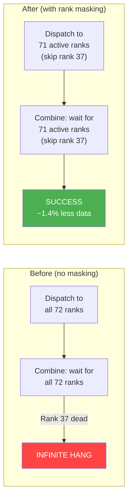

# 5. Design: Rank Masking in Communication

[< Back to Overview](README.md)

## Overview

Rank masking is the mechanism that allows AlltoAll communication to skip dead ranks without reconstructing process groups. It is the **key enabler for Phase 1 survival** — the difference between "infinite hang" and "continue serving."

*Why this has to happen inside the kernel rather than at the Python/API level (as in SGLang's Mooncake `activeRanks` or vLLM's DeepEP `mask_buffer_ptr`) is covered in [§03 "Why kernel-level, and not API-level"](03-competitive-landscape.md#why-kernel-level-and-not-api-level-like-sglang--vllm).* This chapter focuses on **what** the mask does and **how** it is wired into each backend's synchronization primitives.

The design adds an `active_rank_mask` (a 64-bit bitmask or equivalent) to each communication backend. Dispatch skips sending tokens to masked ranks; combine skips waiting for responses from masked ranks.

## Active Rank Mask Data Structure

```python
class EPGroupHealth:
    """Tracks health of EP group ranks. Shared across all communication backends."""

    def __init__(self, ep_size: int):
        # Bitmask: bit i = 1 means rank i is active
        # uint64 supports up to 64 ranks; use uint64[2] for NVL72+
        self.active_mask: int = (1 << ep_size) - 1  # all ranks active
        self.ep_size: int = ep_size
        self.active_count: int = ep_size
        self.failed_ranks: set[int] = set()
        self._lock = threading.Lock()  # for thread-safe mask updates

    def mark_failed(self, rank: int) -> None:
        with self._lock:
            self.active_mask &= ~(1 << rank)
            self.active_count -= 1
            self.failed_ranks.add(rank)

    def mark_active(self, rank: int) -> None:
        """Used during Phase 2 restoration."""
        with self._lock:
            self.active_mask |= (1 << rank)
            self.active_count += 1
            self.failed_ranks.discard(rank)

    def is_active(self, rank: int) -> bool:
        return bool(self.active_mask & (1 << rank))
```

This `EPGroupHealth` object is owned by the model engine and passed to all communication backends.

## Per-Backend Rank Masking Design

### NVLink One-Sided (Primary Target)

**Kernel (CUDA):** `cpp/tensorrt_llm/kernels/communicationKernels/moeAlltoAllKernels.cu` and `.h`
**Host wrapper / TorchOp:** `cpp/tensorrt_llm/thop/moeAlltoAllOp.cpp`
**Python backend:** `tensorrt_llm/_torch/modules/fused_moe/communication/nvlink_one_sided.py`
**Symmetric memory allocator:** `tensorrt_llm/_mnnvl_utils.py` (`MnnvlMemory`, MNNVL fabric pages via `cuMemCreate(... CU_MEM_HANDLE_TYPE_FABRIC ...)`)

The NVLink one-sided backend uses symmetric memory for direct peer GPU writes. The dispatch kernel writes tokens into peer ranks' pre-allocated workspace; the combine kernel reads results from peer ranks' workspace by polling `completion_flags`.

**Current kernel behavior** (verified against actual source — dispatch `moeAlltoAllKernels.cu:537-584`, combine `:1190-1217`):

```cpp
// Dispatch release + wait — write to ALL ranks (including self)
asm volatile("fence.release.sys;");
for (int target_rank = lane_id; target_rank < ep_size; target_rank += warpSize) {
    uint32_t* flag_addr = &ptrs.completion_flags[target_rank][rank_id];
    asm volatile("st.relaxed.sys.u32 [%0], %1;" ::"l"(flag_addr), "r"(expected_value));
}
for (int peer_rank = lane_id; peer_rank < ep_size; peer_rank += warpSize) {
    auto s = clock64();
    do {
        uint32_t* flag_ptr = &ptrs.completion_flags[rank_id][peer_rank];
        uint32_t flag_value;
        asm volatile("ld.relaxed.sys.u32 %0, [%1];" : "=r"(flag_value) : "l"(flag_ptr));
        flag_set = flag_value == expected_value;
    } while (!flag_set && !check_timeout(s));   // 300s panic-trap; see below
    if (!flag_set) { asm volatile("trap;"); return; }
}
```

**Key facts established by source review:**
- Synchronization uses raw inline PTX `ld.relaxed.sys.u32` / `st.relaxed.sys.u32` bracketed by `fence.release.sys` / `fence.acquire.sys` — *not* `volatile`, *not* `cuda::atomic`.
- The completion-flag table is `uint32_t completion_flags[kMaxRanks][kMaxRanks]`, indexed by `(owner_rank, peer_rank)`. **`kMaxRanks = 64` is a `constexpr`** in `moeAlltoAllKernels.h:31`. **For NVL72 (72 GPUs) this MUST be bumped to 80 or 128 (compile-time).** Forgetting this is a silent overflow.
- A 300-second in-kernel timeout already exists (`moeAlltoAllKernels.cu:156-161`): `((clock64() - s) > 300ll * 2000ll * 1000ll * 1000ll)`. On expiry the kernel runs `asm volatile("trap;")`, which **aborts the kernel and corrupts the CUDA context** — process restart required, NOT recoverable in-place. PR #12718's `"immediate_fatal"` classification (regex match on `cudaErrorIllegalAddress` / `cudaErrorLaunchFailure`) is what surfaces upstream.
- Combine has matching loops at `:1190-1217`. The combine accumulator already handles a `dst_idx = -1` per-k-slot skip (`:725-729`, `acc[k].fill(0.0f)` at `:727`). **This is the natural template for masking — the routing pass can produce `dst_idx = -1` for masked ranks and combine handles it for free.**
- No "skip self" or any per-peer skip exists in the current loops — the routing logic (`compute_target_rank_id`) does flat modular partitioning without any rank-alive check.

**Proposed modification:**

Add `uint64_t active_rank_mask_lo, active_rank_mask_hi` to both `DispatchKernelPointers` and `CombineKernelPointers` (sized for up to 128 ranks). Guard **both** the release-write loop *and* the polling loop in dispatch (`:546-555` and `:558-584`) and the matching combine loops (`:1190-1217`):

```cpp
// Dispatch release: write only to ACTIVE peer flag slots
for (int target_rank = lane_id; target_rank < ep_size; target_rank += warpSize) {
    if (!(active_rank_mask & (1ULL << target_rank))) continue;   // skip dead
    uint32_t* flag_addr = &ptrs.completion_flags[target_rank][rank_id];
    asm volatile("st.relaxed.sys.u32 [%0], %1;" ::"l"(flag_addr), "r"(expected_value));
}
// Dispatch wait: poll only ACTIVE peer flag slots
for (int peer_rank = lane_id; peer_rank < ep_size; peer_rank += warpSize) {
    if (!(active_rank_mask & (1ULL << peer_rank))) continue;     // skip dead
    /* existing spin */
}
```

**Why both sides of the loop must be masked:** A dead peer's `completion_flags[Y][X]` slot will never be re-written. Surviving rank Y polling that slot with `ld.relaxed.sys.u32` will spin until the kernel-side 300s `trap;` fires — the same failure mode we are trying to avoid. The mask must short-circuit the *poll*, not just the *write*.

**Implementation notes:**
- `active_rank_mask` is passed as kernel struct fields (`uint64_t lo, hi`) sized for up to 128 ranks (covers NVL72 + headroom).
- The mask is set on the host side before kernel launch. It does not change mid-kernel.
- Symmetric memory for the dead rank's workspace remains allocated but unused. It can be reclaimed in Phase 2.
- `completion_flags` for the dead rank are never written/read, avoiding any race condition.
- Routing pass: extend `compute_target_rank_id` to emit `dst_idx = -1` for tokens that would land on a masked rank — combine's existing `acc[k].fill(0.0f)` (`:727`) skips them with no kernel change.

**Performance impact:** The conditional branch is a single bit-test per rank, executed in the outer loop. For 72 ranks, this adds 72 bit-test instructions — negligible compared to the memory operations.



### NVLink Two-Sided

**Kernel:** `cpp/tensorrt_llm/kernels/fusedMoeCommKernels.cu` (1525 lines)
**Host op:** `cpp/tensorrt_llm/thop/moeCommOp.cpp`
**Python:** `tensorrt_llm/_torch/modules/fused_moe/communication/nvlink_two_sided.py` (+ `nvlink_two_sided_flashinfer.py` variant that shells out to `flashinfer.comm.trtllm_alltoall.MnnvlMoe`)

**Sync primitive difference (relevant for masking):** Two-sided uses a FIFO handshake with `head` / `tail` fields in peer symmetric memory rather than per-peer completion flags. From `fusedMoeCommKernels.cu:769-792`, `waitEntryWritable()` spins on `mTail + kFifoDepth <= mHead`, with sender writing `head` and receiver writing `tail` back through `mSenderSideFifoInfo->tail`. Also unbounded — no `check_timeout` in this kernel today. A masked rank's FIFO never advances, so the same poll-side-must-skip rule applies.

Add `active_rank_mask` to each C++ op (`mnnvl_moe_alltoallv_prepare_without_allgather`, `mnnvl_moe_alltoallv`, `mnnvl_moe_alltoallv_combine`):

- `prepare`: Exclude dead ranks from metadata exchange and EPLB statistics gathering.
- `dispatch`: Skip FIFO queue writes to dead ranks.
- `combine`: Skip FIFO queue reads from dead ranks (the spin on `mSenderSideFifoInfo->tail` is the dangerous one).

### DeepEP

**File:** `tensorrt_llm/_torch/modules/fused_moe/communication/deep_ep.py`

DeepEP is a third-party library from DeepSeek. Two approaches:

1. **Preferred:** Use `mask_buffer_ptr` when available in the public DeepEP API. vLLM's RFC #27774 references this parameter, indicating it's planned. Monitor DeepEP releases and enable rank masking via this API when available.

2. **Fallback:** If `mask_buffer_ptr` is not available, detect DeepEP timeout (if added) and fall back to the AllGatherReduceScatter backend with a reconstructed process group.

**Important constraint:** DeepEP only supports specific rank counts ({2,4,8} intranode, {16,32,...,128} internode). After losing a rank, EP=31 from EP=32 is not supported. Options:
- Fall back to NVLink backend (if available on the hardware)
- Fall back to AllGatherReduceScatter
- Treat the dead rank's slot as "permanently empty" in DeepEP (tokens destined for it are dropped, then handled by EPLB rerouting)

### DeepEP Low-Latency

**File:** `tensorrt_llm/_torch/modules/fused_moe/communication/deep_ep_low_latency.py`

Same constraints and approach as DeepEP. Additionally restricted to specific hidden_size values. The low-latency path is most likely to require fallback to a different backend on rank failure.

### AllGatherReduceScatter (Fallback)

**File:** `tensorrt_llm/_torch/modules/fused_moe/communication/allgather_reducescatter.py` — pure wrapper over `tensorrt_llm._torch.distributed.allgather` / `reducescatter`.

This backend uses standard NCCL collectives. NCCL does not support rank masking — all ranks in the process group must participate. Two options:

1. **Process group reconstruction:** Create a new NCCL group with N-1 ranks. This is the "hard path" but is unavoidable for this backend.
2. **Backend switch:** On rank failure, switch from AllGatherReduceScatter to a NVLink backend (if available) that supports rank masking. The `CommunicationFactory` already supports runtime backend selection.

Since AllGatherReduceScatter is the lowest-priority fallback backend, option 2 is preferred where possible.

> **Caveat — NCCL abort/timeout is NOT wired in TRT-LLM today.** A repo-wide search found **zero** uses of `ncclCommAbort`, `NCCL_ASYNC_ERROR_HANDLING`, `ncclCommFinalize`, or `ncclGetLastError` outside test files. The only NCCL integration is via `torch.classes.trtllm.NcclCommunicatorOp` (P2P send/recv with no error hook). A dead NCCL collective on this fallback path will hang on torch's default behavior — not on a TRT-LLM-configured timeout. **Implication:** before claiming "AllGatherReduceScatter has timeout protection", we must explicitly wire `NCCL_ASYNC_ERROR_HANDLING=1` + watchdog + `ncclCommAbort` in the TRT-LLM NCCL wrapper. This is a v1 prerequisite for backend-switch fallback (PR 1a.7 in [§09](09-implementation-plan.md)).

## Communication Factory Changes

The `CommunicationFactory` needs a new capability: **runtime backend degradation.**

```python
class CommunicationFactory:
    @staticmethod
    def create_strategy(..., ep_group_health: EPGroupHealth) -> Communication:
        """Extended to accept EP group health for rank masking."""
        # Existing priority-based selection, but now also checks masking support
        ...

    @staticmethod
    def handle_rank_failure(
        current_strategy: Communication,
        ep_group_health: EPGroupHealth,
        failed_rank: int,
    ) -> Communication:
        """Called when a rank failure is detected.

        Returns either the same strategy (if it supports rank masking)
        or a fallback strategy that can operate with N-1 ranks.
        """
        if current_strategy.supports_rank_masking():
            current_strategy.update_rank_mask(ep_group_health)
            return current_strategy
        else:
            # Fall back to a strategy that supports masking
            return CommunicationFactory.create_fallback_strategy(
                ep_group_health, exclude_ranks={failed_rank}
            )
```

## Timeout / Detection Interaction with the Mask

Rank masking alone is not sufficient — we also need a way to **detect** that a rank has failed and then propagate the mask update. The detection mechanism (host-side watchdog over host-visible completion flags, per-rank latency monitoring, MPI worker-death notification) lives entirely in [§07 Failure Detection](07-failure-detection.md). This chapter only needs to state the contract the kernel requires.

**What the kernel requires from the detection layer:**

- The mask must be **set on the host before kernel launch**; it does not change mid-kernel. This is consistent with the NVLinkOneSided dispatch/combine ops being launched once per iteration, which gives the host a natural point to refresh the mask.
- When the host concludes a rank is dead, the mask update must be visible to *all* surviving ranks before any of them enters the next AlltoAll. That consistency requirement is discussed in the "Consistency Guarantees" section at the end of this chapter and resolved by the mask-propagation protocol in [§07](07-failure-detection.md#failure-broadcast-protocol).

**What the kernel contributes back:**

- The existing `completion_flags` array is already allocated in host-visible symmetric memory, which means the host-side watchdog in §07 can poll it directly to detect which peers have or have not signaled. No additional kernel-side plumbing is required for Layer 1 detection.
- The kernel's existing 300s `check_timeout` → `asm volatile("trap;")` behavior at `moeAlltoAllKernels.cu:156-161` acts as a backstop. It **corrupts the CUDA context** on expiry and is not recovery — it is the outer failsafe that prevents an undetected hang from running indefinitely. PR 1a.8 in [§09](09-implementation-plan.md) optionally tightens this value AND switches its action from `trap;` to writing a host-visible flag — a v1 enhancement that makes the kernel cooperate with the host watchdog instead of relying on process death.

The design goal is that in steady state the host watchdog fires long before the 300s `check_timeout`, so `trap;` is never reached under normal failure handling.

## Consistency Guarantees

When a rank is masked mid-serving, we must ensure consistency:

1. **All surviving ranks see the same mask at the same time.** The mask update is a coordinated operation: the failure detector broadcasts the mask update, and all ranks apply it before the next forward pass. This is enforced by the model engine's iteration barrier (all ranks synchronize between forward passes).

2. **In-flight AlltoAll is abandoned.** If a rank dies mid-AlltoAll, the current AlltoAll is lost. All requests in the current batch are failed (using PR #12718's `_handle_errors()` with `charge_budget=True`). The next iteration starts with the updated mask.

3. **No partial results.** A token either successfully completes its full dispatch-compute-combine cycle, or it fails entirely. There is no "partial expert computation" state.

4. **EPLB routing table and rank mask are updated atomically.** The EPLB reconfiguration and mask update happen together between iterations, so the routing table never references a masked rank.
