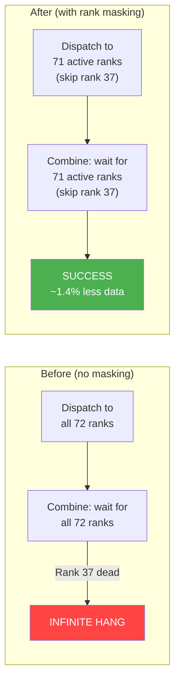
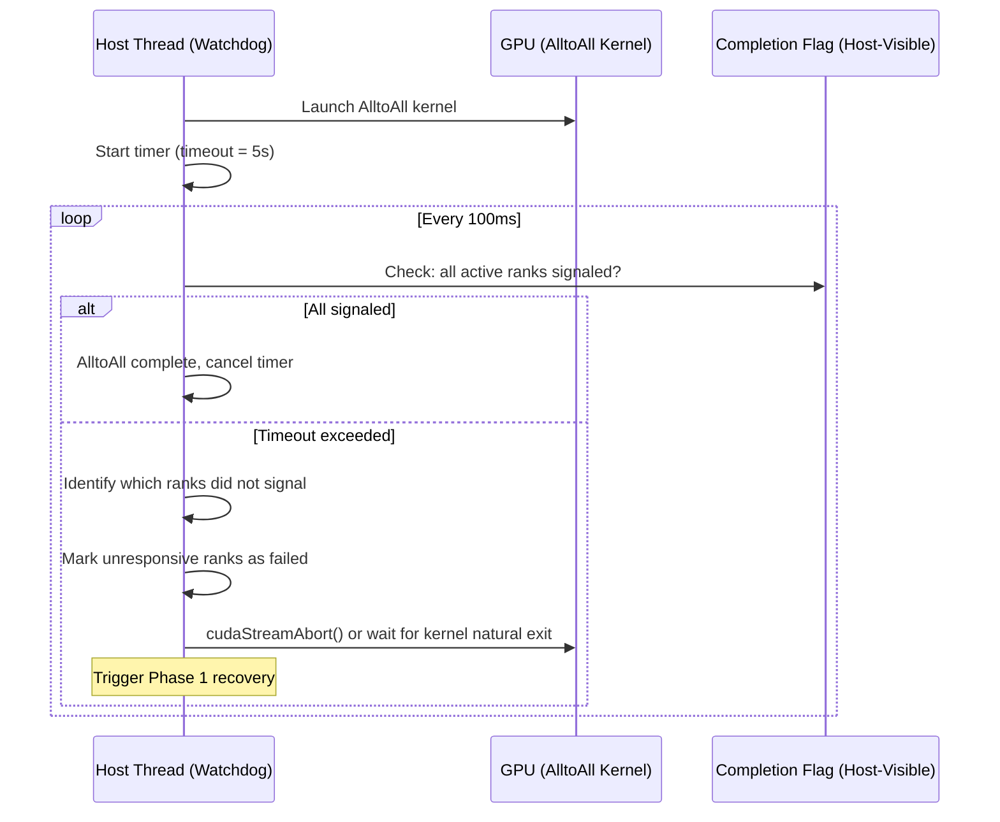

# 5. Design: Rank Masking in Communication

[< Back to Overview](README.md)

## Overview

Rank masking is the mechanism that allows AlltoAll communication to skip dead ranks without reconstructing process groups. It is the **key enabler for Phase 1 survival** — the difference between "infinite hang" and "continue serving."

The NVLink AlltoAll kernels are high-performance CUDA code that coordinates data movement across multiple GPUs using symmetric memory and completion flags. Modifying their synchronization behavior — adding conditional skipping of dead ranks without introducing races, violating memory ordering, or degrading performance — is a non-trivial kernel engineering task. This is fundamentally different from the API-level masking approach used by SGLang (Mooncake `activeRanks`) or proposed by vLLM (DeepEP `mask_buffer_ptr`), where masking is provided by an external library. Here, we modify the kernel itself — giving us complete control but requiring deep understanding of multi-GPU memory ordering and completion flag protocols.

The design adds an `active_rank_mask` (a 64-bit bitmask or equivalent) to each communication backend. Dispatch skips sending tokens to masked ranks; combine skips waiting for responses from masked ranks.

## Active Rank Mask Data Structure

```python
class EPGroupHealth:
    """Tracks health of EP group ranks. Shared across all communication backends."""

    def __init__(self, ep_size: int):
        # Bitmask: bit i = 1 means rank i is active
        # uint64 supports up to 64 ranks; use uint64[2] for NVL72+
        self.active_mask: int = (1 << ep_size) - 1  # all ranks active
        self.ep_size: int = ep_size
        self.active_count: int = ep_size
        self.failed_ranks: set[int] = set()
        self._lock = threading.Lock()  # for thread-safe mask updates

    def mark_failed(self, rank: int) -> None:
        with self._lock:
            self.active_mask &= ~(1 << rank)
            self.active_count -= 1
            self.failed_ranks.add(rank)

    def mark_active(self, rank: int) -> None:
        """Used during Phase 2 restoration."""
        with self._lock:
            self.active_mask |= (1 << rank)
            self.active_count += 1
            self.failed_ranks.discard(rank)

    def is_active(self, rank: int) -> bool:
        return bool(self.active_mask & (1 << rank))
```

This `EPGroupHealth` object is owned by the model engine and passed to all communication backends.

## Per-Backend Rank Masking Design

### NVLink One-Sided (Primary Target)

**File:** `tensorrt_llm/_torch/modules/fused_moe/communication/nvlink_one_sided.py`
**Kernel:** `cpp/tensorrt_llm/kernels/communicationKernels/moeAlltoAllKernels.h`

The NVLink one-sided backend uses symmetric memory for direct peer GPU writes. The dispatch kernel writes tokens into peer ranks' pre-allocated workspace; the combine kernel reads results from peer ranks' workspace by polling `completion_flags`.

**Current kernel behavior:**

```
// Dispatch: writes to ALL ranks
for (int target_rank = 0; target_rank < ep_size; target_rank++) {
    // write tokens destined for target_rank to its workspace
    peer_workspace[target_rank][offset] = tokens;
    // signal completion
    completion_flags[target_rank][my_rank] = flag_val;
}

// Combine: waits for ALL ranks
for (int source_rank = 0; source_rank < ep_size; source_rank++) {
    // SPIN until source_rank signals completion
    while (completion_flags[my_rank][source_rank] != expected_flag) { /* spin */ }
    // read results from source_rank
    results += peer_workspace[source_rank][offset];
}
```

**Proposed modification:**

```
// Dispatch: writes only to ACTIVE ranks
for (int target_rank = 0; target_rank < ep_size; target_rank++) {
    if (!(active_rank_mask & (1ULL << target_rank))) continue;  // skip dead
    peer_workspace[target_rank][offset] = tokens;
    completion_flags[target_rank][my_rank] = flag_val;
}

// Combine: waits only for ACTIVE ranks
for (int source_rank = 0; source_rank < ep_size; source_rank++) {
    if (!(active_rank_mask & (1ULL << source_rank))) continue;  // skip dead
    while (completion_flags[my_rank][source_rank] != expected_flag) { /* spin */ }
    results += peer_workspace[source_rank][offset];
}
```

**Implementation notes:**
- `active_rank_mask` is passed as a kernel parameter (uint64_t). Since `kMaxRanks = 64`, a single uint64 suffices for up to 64 ranks. For NVL72+, use uint64[2].
- The mask is set on the host side before kernel launch. It does not change mid-kernel.
- Symmetric memory for the dead rank's workspace remains allocated but unused. It can be reclaimed in Phase 2.
- `completion_flags` for the dead rank are never written/read, avoiding any race condition.

**Performance impact:** The conditional branch is a single bit-test per rank, executed in the outer loop. For 72 ranks, this adds 72 bit-test instructions — negligible compared to the memory operations.



### NVLink Two-Sided

**File:** `tensorrt_llm/_torch/modules/fused_moe/communication/nvlink_two_sided.py`

Similar approach. The C++ ops (`mnnvl_moe_alltoallv_prepare_without_allgather`, `mnnvl_moe_alltoallv`, `mnnvl_moe_alltoallv_combine`) accept rank-related parameters. Add `active_rank_mask` parameter to each:

- `prepare`: Exclude dead ranks from metadata exchange and EPLB statistics gathering.
- `dispatch`: Skip FIFO queue writes to dead ranks.
- `combine`: Skip FIFO queue reads from dead ranks.

### DeepEP

**File:** `tensorrt_llm/_torch/modules/fused_moe/communication/deep_ep.py`

DeepEP is a third-party library from DeepSeek. Two approaches:

1. **Preferred:** Use `mask_buffer_ptr` when available in the public DeepEP API. vLLM's RFC #27774 references this parameter, indicating it's planned. Monitor DeepEP releases and enable rank masking via this API when available.

2. **Fallback:** If `mask_buffer_ptr` is not available, detect DeepEP timeout (if added) and fall back to the AllGatherReduceScatter backend with a reconstructed process group.

**Important constraint:** DeepEP only supports specific rank counts ({2,4,8} intranode, {16,32,...,128} internode). After losing a rank, EP=31 from EP=32 is not supported. Options:
- Fall back to NVLink backend (if available on the hardware)
- Fall back to AllGatherReduceScatter
- Treat the dead rank's slot as "permanently empty" in DeepEP (tokens destined for it are dropped, then handled by EPLB rerouting)

### DeepEP Low-Latency

**File:** `tensorrt_llm/_torch/modules/fused_moe/communication/deep_ep_low_latency.py`

Same constraints and approach as DeepEP. Additionally restricted to specific hidden_size values. The low-latency path is most likely to require fallback to a different backend on rank failure.

### AllGatherReduceScatter (Fallback)

**File:** `tensorrt_llm/_torch/modules/fused_moe/communication/allgather_reducescatter.py`

This backend uses standard NCCL collectives. NCCL does not support rank masking — all ranks in the process group must participate. Two options:

1. **Process group reconstruction:** Create a new NCCL group with N-1 ranks. This is the "hard path" but is unavoidable for this backend.
2. **Backend switch:** On rank failure, switch from AllGatherReduceScatter to a NVLink backend (if available) that supports rank masking. The `CommunicationFactory` already supports runtime backend selection.

Since AllGatherReduceScatter is the lowest-priority fallback backend, option 2 is preferred where possible.

## Communication Factory Changes

The `CommunicationFactory` needs a new capability: **runtime backend degradation.**

```python
class CommunicationFactory:
    @staticmethod
    def create_strategy(..., ep_group_health: EPGroupHealth) -> Communication:
        """Extended to accept EP group health for rank masking."""
        # Existing priority-based selection, but now also checks masking support
        ...

    @staticmethod
    def handle_rank_failure(
        current_strategy: Communication,
        ep_group_health: EPGroupHealth,
        failed_rank: int,
    ) -> Communication:
        """Called when a rank failure is detected.

        Returns either the same strategy (if it supports rank masking)
        or a fallback strategy that can operate with N-1 ranks.
        """
        if current_strategy.supports_rank_masking():
            current_strategy.update_rank_mask(ep_group_health)
            return current_strategy
        else:
            # Fall back to a strategy that supports masking
            return CommunicationFactory.create_fallback_strategy(
                ep_group_health, exclude_ranks={failed_rank}
            )
```

## Timeout Mechanism for Failure Detection

Rank masking alone is not sufficient — we also need a way to **detect** that a rank has failed. The NVLink kernels currently spin forever; we need a timeout.

### Host-Side Watchdog Approach

Rather than adding a timeout to the GPU kernel itself (which would require cooperative multitasking or kernel preemption), use a host-side watchdog:



**Implementation:** The `completion_flags` array in NVLink AlltoAll is allocated in host-visible memory (for the host to monitor). The watchdog thread polls these flags. If specific ranks have not signaled within the timeout, those ranks are marked as failed.

**Alternative: Kernel-side timeout.** Add a cycle counter to the combine kernel's spin loop:

```c
uint64_t start = clock64();
while (completion_flags[my_rank][source_rank] != expected_flag) {
    if (clock64() - start > timeout_cycles) {
        // Write failure indicator to host-visible memory
        rank_failure_flags[source_rank] = 1;
        break;  // Skip this rank
    }
}
```

This is simpler but less flexible. The host-side watchdog is preferred for the initial implementation because it doesn't require kernel changes and can be validated independently.

## Consistency Guarantees

When a rank is masked mid-serving, we must ensure consistency:

1. **All surviving ranks see the same mask at the same time.** The mask update is a coordinated operation: the failure detector broadcasts the mask update, and all ranks apply it before the next forward pass. This is enforced by the model engine's iteration barrier (all ranks synchronize between forward passes).

2. **In-flight AlltoAll is abandoned.** If a rank dies mid-AlltoAll, the current AlltoAll is lost. All requests in the current batch are failed (using PR #12718's `_handle_errors()` with `charge_budget=True`). The next iteration starts with the updated mask.

3. **No partial results.** A token either successfully completes its full dispatch-compute-combine cycle, or it fails entirely. There is no "partial expert computation" state.

4. **EPLB routing table and rank mask are updated atomically.** The EPLB reconfiguration and mask update happen together between iterations, so the routing table never references a masked rank.
