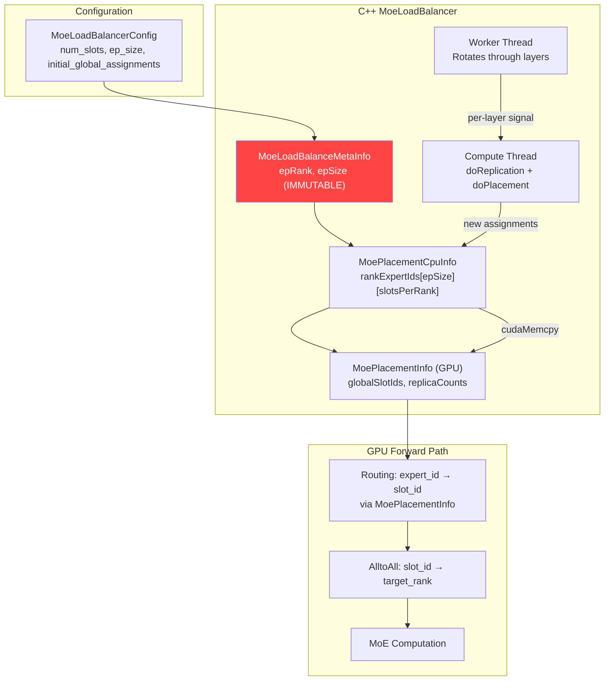
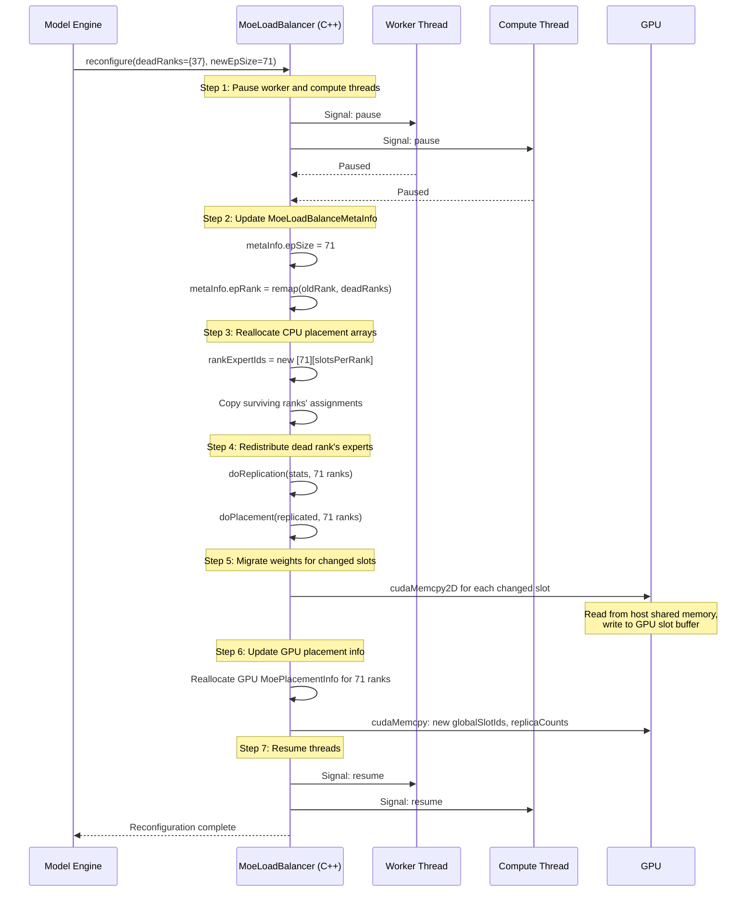
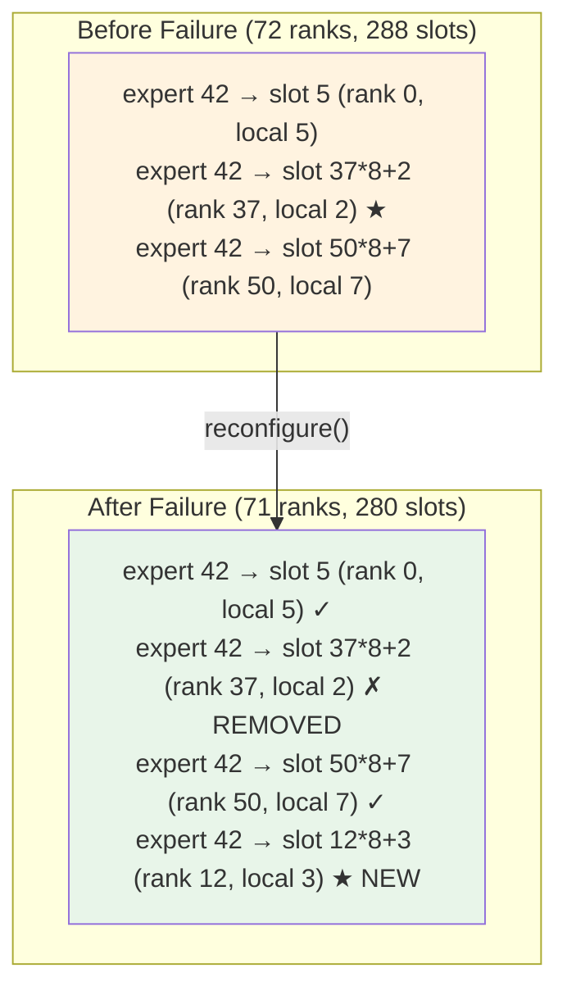

# 6. Design: EPLB Topology Adaptation

[< Back to Overview](README.md)

## Overview

When a rank fails, EPLB must redistribute that rank's experts across the surviving ranks. This chapter describes the changes needed in the C++ `MoeLoadBalancer` and the Python `MoeLoadBalancer` wrapper to support dynamic topology changes.

The good news: EPLB already performs live expert weight migration at runtime (online EPLB). The new capability is handling a **topology change** (rank count changes) rather than a **load balance change** (expert assignment changes within fixed topology). This distinction matters: EPLB was designed as a static-topology system — `MoeLoadBalanceMetaInfo` stores `epSize` and `epRank` as immutable constructor arguments, and the entire data structure hierarchy (CPU placement arrays, GPU routing tables, shared memory layout, per-layer state machines) assumes the rank count never changes. Extending it for dynamic topology changes while the system is actively serving — with concurrent worker and compute threads performing weight migrations, per-layer statistics collection, and routing table updates — is a qualitatively different design problem from what EPLB was built for.

## Current EPLB Data Flow



**The problem:** `MoeLoadBalanceMetaInfo` stores `epRank` and `epSize` as immutable constructor arguments. `MoePlacementCpuInfo.rankExpertIds` is sized `[epSize][slotsPerRank]` at creation. When a rank dies, these data structures cannot represent the new topology.

## Proposed: `MoeLoadBalancer.reconfigure()`

### New C++ API

```cpp
class MoeLoadBalancer {
public:
    // Existing constructor
    MoeLoadBalancer(MoeLoadBalanceMetaInfo const& metaInfo, ...);

    // NEW: Reconfigure for topology change
    void reconfigure(ReconfigureParams const& params);

    struct ReconfigureParams {
        int newEpSize;                    // N-1 after rank failure
        int newEpRank;                    // may change if dead rank < my rank
        std::set<int> deadRanks;          // ranks to exclude
        int newSlotsPerRank;              // may increase to absorb dead rank's slots
        bool emergencyMode;               // true = minimal redistribution, false = full optimize
    };
};
```

### Reconfiguration Flow



### Emergency vs. Full Reconfiguration

| Mode | When Used | Behavior |
|:-----|:----------|:---------|
| **Emergency** (`emergencyMode=true`) | Phase 1: immediate survival | Minimal redistribution: only reassign experts that were exclusively on the dead rank. Keep all other assignments unchanged. Fastest possible recovery. |
| **Full** (`emergencyMode=false`) | Phase 2: restoration or periodic rebalance | Full `doReplication()` + `doPlacement()` for optimal distribution across all ranks. May move experts between surviving ranks for better balance. |

Emergency mode is critical for minimizing Phase 1 recovery time. Only experts that have **zero remaining replicas** after the rank failure need immediate placement. Experts with at least one surviving replica continue to work — tokens are routed to the surviving replica.

### Expert Redistribution Logic

When rank R dies with `slotsPerRank` slots:

```
For each layer L:
    dead_experts = set of expert IDs assigned to rank R's slots in layer L
    For each expert E in dead_experts:
        surviving_replicas = count of E's replicas on ranks != R
        if surviving_replicas == 0:
            # CRITICAL: E has no surviving replica — must place immediately
            target_rank = rank with most free slots (or least loaded)
            Assign E to a slot on target_rank
            Copy E's weights from host shared memory to target_rank's GPU
        else:
            # E still has replicas elsewhere — routing will find them
            # In emergency mode: do nothing (rely on existing replicas)
            # In full mode: may re-replicate for better balance
```

### Slot Count Adjustment

When a rank dies, its `slotsPerRank` slots are lost. The total slot count decreases from `ep_size * slotsPerRank` to `(ep_size - 1) * slotsPerRank`. Options:

1. **Keep per-rank slot count unchanged (recommended for Phase 1):** Each surviving rank keeps its original `slotsPerRank`. Total slots decrease. Some experts may lose replicas but all experts remain reachable via at least one slot.

2. **Increase per-rank slot count (for Phase 2 full rebalance):** Allocate additional GPU memory for extra slots on surviving ranks to maintain the same total slot count. Requires dynamic GPU memory allocation.

Option 1 is simpler and sufficient for Phase 1. The slight reduction in replication capacity is acceptable for degraded-mode operation.

## GPU-Side Routing Table Update

The routing table (`MoePlacementInfo`) maps `(expert_id, replica_index)` → `global_slot_id` → `(rank, local_slot)`. After reconfiguration:



The routing kernel (`torch.ops.trtllm.moe_load_balance_routing`) uses the `globalSlotIds` array from `MoePlacementInfo`. After reconfiguration, this array is updated to exclude any slots on the dead rank and include newly assigned slots on surviving ranks. The kernel itself needs no modification — it simply reads the updated table.

## Host Shared Memory Interaction

`HostMoeTensorSharer` stores all expert weights in POSIX shared memory (`/dev/shm/moe_shared_*`). After a rank failure:

- **If dead rank was on the same node:** Its shared memory segments survive (POSIX shared memory persists until explicitly unlinked). Other ranks on the same node can still read from them.
- **If dead rank was on a different node:** Irrelevant — each node has its own `HostMoeTensorSharer` with all expert weights.
- **Weight migration source:** When a surviving rank needs to load a new expert, it reads from its local `HostMoeTensorSharer` (which already contains all expert weights). No cross-node transfer needed.

This is a key advantage of TRT-LLM's EPLB design: **all expert weights are always available locally on every node**, enabling millisecond-scale weight migration without any network transfer.

## Multi-Layer Coordination

DeepSeek-V3 has 58 MoE layers. Reconfiguration must update all layers:

- **Emergency mode:** Reconfigure all 58 layers in a single pass. The worker thread and compute thread are paused; reconfiguration happens on the main thread. With ~0.1-0.3ms per expert weight copy and ~1-2 experts to migrate per layer, total: ~10-35ms for all layers.

- **Full mode:** Can be spread across iterations like normal online EPLB, with `layer_updates_per_iter` layers updated per forward pass. This avoids a latency spike.

## Changes Summary

| Component | Change | Complexity |
|:----------|:-------|:-----------|
| `MoeLoadBalanceMetaInfo` (C++) | Make `epSize`, `epRank` mutable; add `reconfigure()` | Medium |
| `MoePlacementCpuInfo` (C++) | Dynamic reallocation of `rankExpertIds` | Medium |
| `MoePlacementInfo` (GPU) | Reallocate `globalSlotIds` for new ep_size | Low |
| `doReplication()` / `doPlacement()` (C++) | Already parameterized by `metaInfo` — no change needed | None |
| `MoeLoadBalancer.reconfigure()` (C++) | New method: pause threads, update meta, redistribute, resume | High |
| `MoeLoadBalancer` (Python) | New `reconfigure()` wrapper; coordinate with model engine | Medium |
| `HostMoeTensorSharer` | No change — already has all expert weights | None |
| Weight migration | Reuse existing `updateWeights()` path | None |
