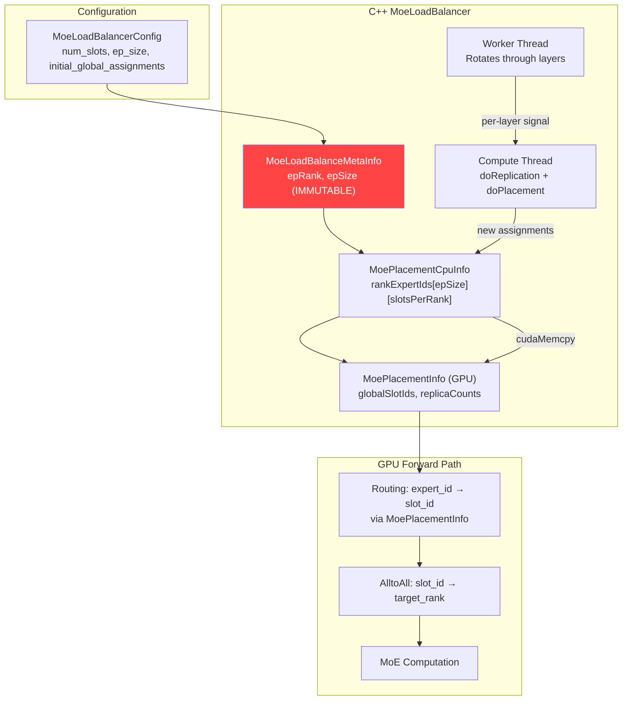
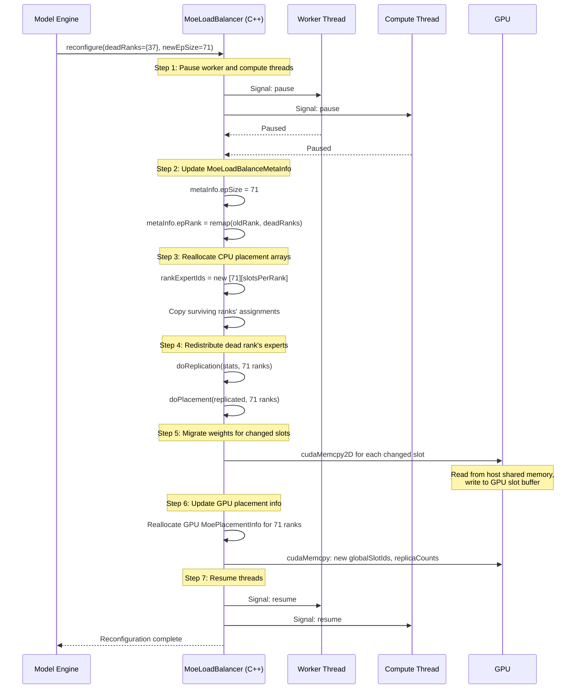
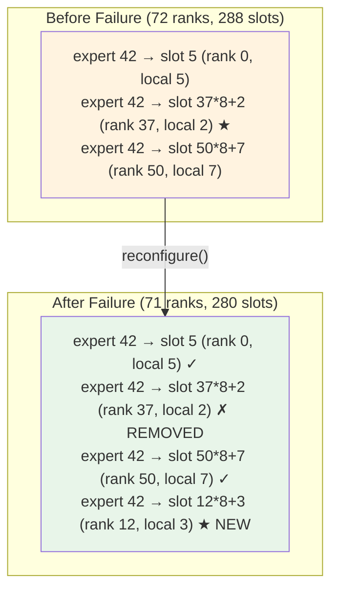

# 6. Design: EPLB Topology Adaptation

[< Back to Overview](README.md)

## Overview

When a rank fails, EPLB must redistribute that rank's experts across the surviving ranks. This chapter describes the changes needed in the C++ `MoeLoadBalancer` and the Python `MoeLoadBalancer` wrapper to support dynamic topology changes.

The good news: EPLB already performs live expert weight migration at runtime (online EPLB). The new capability is handling a **topology change** (rank count changes) rather than a **load balance change** (expert assignment changes within fixed topology). This distinction matters: EPLB was designed as a static-topology system — `MoeLoadBalanceMetaInfo` stores `epSize` and `epRank` as **immutable by convention** (plain `int` members in `cpp/tensorrt_llm/runtime/moeLoadBalancer/moeLoadBalancer.h:331-332`; not `const`, not enforced — but every reader assumes they don't change), and the entire data structure hierarchy (CPU placement arrays, GPU routing tables, shared memory layout, per-layer state machines) assumes the rank count never changes. Extending it for dynamic topology changes while the system is actively serving — with concurrent worker and compute threads performing weight migrations, per-layer statistics collection, and routing table updates — is a qualitatively different design problem from what EPLB was built for.

> **Source-verified facts shaping this design:**
>
> - `MoeLoadBalanceMetaInfo` (`cpp/tensorrt_llm/kernels/moeLoadBalance/moeLoadBalanceCommon.h:40-52`) has fields `expertCount, topK, epRank, epSize, slotCountPerRank` — no enable/disable bit, no rank-mask field. Mask plumbing is net-new.
> - CPU placement: `MoePlacementCpuInfo` (`moeLoadBalancer.h:56-70`) stores `rankExpertIds` as `std::vector<std::vector<int>>` (`[epSize][slotCountPerRank]`) plus `oldRankExpertIds` for single-step rollback (no longer history).
> - GPU placement (`moeLoadBalanceCommon.h:76-90`): three flat int arrays — `expertReplicaCount[expertCount]`, `expertReplicaStartOffset[expertCount]`, `globalSlotIds[epSize * slotCountPerRank]`.
> - Propagation CPU→GPU (`moeLoadBalancer.cpp:523-542`): in-place `cudaMemcpyAsync` on a background stream — **no double buffer**, no epoch counter. Per-layer synchronization uses `MoeLoadBalanceSingleLayerSignal::stepAndOwner` (a 64-bit step+owner word at `moeLoadBalanceCommon.h:25-37`), but that's a producer/consumer ownership token, not a placement version.
>
> Implication for `reconfigure_mask_only`: there's no built-in "stage and atomically swap" primitive. Either the mask change must be small enough to land within one in-place memcpy at iteration boundary (MVP plan), or we add an explicit double-buffer (deferred to v1, PR 1b.4–1b.5).

## Current EPLB Data Flow



**The problem:** `MoeLoadBalanceMetaInfo` stores `epRank` and `epSize` as immutable constructor arguments. `MoePlacementCpuInfo.rankExpertIds` is sized `[epSize][slotsPerRank]` at creation. When a rank dies, these data structures cannot represent the new topology.

## Proposed: `MoeLoadBalancer.reconfigure()`

### New C++ API

```cpp
class MoeLoadBalancer {
public:
    // Existing constructor
    MoeLoadBalancer(MoeLoadBalanceMetaInfo const& metaInfo, ...);

    // NEW: Reconfigure for topology change
    void reconfigure(ReconfigureParams const& params);

    struct ReconfigureParams {
        int newEpSize;                    // N-1 after rank failure
        int newEpRank;                    // may change if dead rank < my rank
        std::set<int> deadRanks;          // ranks to exclude
        int newSlotsPerRank;              // may increase to absorb dead rank's slots
        bool emergencyMode;               // true = minimal redistribution, false = full optimize
    };
};
```

### Reconfiguration Flow



### Emergency vs. Full Reconfiguration

| Mode | When Used | Behavior |
|:-----|:----------|:---------|
| **Emergency** (`emergencyMode=true`) | Phase 1: immediate survival | Minimal redistribution: only reassign experts that were exclusively on the dead rank. Keep all other assignments unchanged. Fastest possible recovery. |
| **Full** (`emergencyMode=false`) | Phase 2: restoration or periodic rebalance | Full `doReplication()` + `doPlacement()` for optimal distribution across all ranks. May move experts between surviving ranks for better balance. |

Emergency mode is critical for minimizing Phase 1 recovery time. Only experts that have **zero remaining replicas** after the rank failure need immediate placement. Experts with at least one surviving replica continue to work — tokens are routed to the surviving replica.

### Expert Redistribution Logic

When rank R dies with `slotsPerRank` slots:

```
For each layer L:
    dead_experts = set of expert IDs assigned to rank R's slots in layer L
    For each expert E in dead_experts:
        surviving_replicas = count of E's replicas on ranks != R
        if surviving_replicas == 0:
            # CRITICAL: E has no surviving replica — must place immediately
            target_rank = rank with most free slots (or least loaded)
            Assign E to a slot on target_rank
            Copy E's weights from host shared memory to target_rank's GPU
        else:
            # E still has replicas elsewhere — routing will find them
            # In emergency mode: do nothing (rely on existing replicas)
            # In full mode: may re-replicate for better balance
```

### Slot Count Adjustment

When a rank dies, its `slotsPerRank` slots are lost. The total slot count decreases from `ep_size * slotsPerRank` to `(ep_size - 1) * slotsPerRank`. Options:

1. **Keep per-rank slot count unchanged (recommended for Phase 1):** Each surviving rank keeps its original `slotsPerRank`. Total slots decrease. Some experts may lose replicas but all experts remain reachable via at least one slot.

2. **Increase per-rank slot count (for Phase 2 full rebalance):** Allocate additional GPU memory for extra slots on surviving ranks to maintain the same total slot count. Requires dynamic GPU memory allocation.

Option 1 is simpler and sufficient for Phase 1. The slight reduction in replication capacity is acceptable for degraded-mode operation.

## GPU-Side Routing Table Update

The routing table (`MoePlacementInfo`) maps `(expert_id, replica_index)` → `global_slot_id` → `(rank, local_slot)`. After reconfiguration:



The routing kernel (`torch.ops.trtllm.moe_load_balance_routing`) uses the `globalSlotIds` array from `MoePlacementInfo`. After reconfiguration, this array is updated to exclude any slots on the dead rank and include newly assigned slots on surviving ranks. The kernel itself needs no modification — it simply reads the updated table.

## Host Shared Memory Interaction

`HostMoeTensorSharer` (`tensorrt_llm/_torch/modules/fused_moe/moe_load_balancer.py:127-340`) stores expert weights in POSIX shared memory. The relevant detail for FT is **how** it is shared: each local rank publishes one shm segment named `f"{base}_l{layer_id}_lr{local_rank}_all"` containing **all of its assigned experts' weights**, packed sequentially per weight name. All ranks on the **same node** then attach to all peer segments via `multiprocessing.shared_memory.SharedMemory(name=...)`. The shared subcomm is built via `global_mpi_comm.Split_type(MPI.COMM_TYPE_SHARED)` (`moe_load_balancer.py:894-902`), so the sharing scope is **node-local only**.

After a rank failure:

- **Same node, dead rank:** Its `_lr{local_rank}_all` segment survives (POSIX shm persists until explicit unlink). Other local-node ranks already have it attached and can keep reading.
- **Different node, dead rank:** Irrelevant — each node has a full replica of all 256 experts' weights distributed across its local ranks. No cross-node transfer is needed for a within-node reassignment.
- **Cross-node concern:** A failure that takes down a *whole node* loses all its unique expert replicas. With replication factor ≥ 2 (DeepSeek production), every other node still has the full set, so degraded-mode survival is unaffected. With replication factor = 1, a node-loss event is unrecoverable in Phase 1.

**Terminology — "weight migration" vs "slot remapping" for MVP:** When a single rank dies and replication factor ≥ 2, MVP recovery is **not** weight migration in the classic sense. There is no H2D copy required at the moment of failure: every surviving rank already has every expert's weights mapped on host. The MVP `reconfigure_mask_only` operation is **expert-slot remapping** — mark the dead rank's slots as unreachable in `MoePlacementInfo` and let routing pick the surviving replica's slot. The next H2D `cudaMemcpyAsync` only happens on the routine EPLB cycle when load actually rebalances. This is why MVP can target <10ms reconfigure: it's a placement-pointer rewrite, not a weight move. Full-blown weight migration across 58 layers (PR 1b.6 in [§09](09-implementation-plan.md)) is the v1 path that handles the "zero surviving replica" case.

## Multi-Layer Coordination

DeepSeek-V3 has 58 MoE layers. Reconfiguration must update all layers:

- **MVP slot remap (`reconfigure_mask_only`, no weight migration):** Rewrite `MoePlacementInfo` for all 58 layers in a single pass. The worker thread and compute thread are paused; the main thread issues in-place `cudaMemcpyAsync` of the updated `globalSlotIds` array per layer. Target: **<10ms end-to-end** for all 58 layers.

- **v1 full reconfigure (zero-replica case, with weight migration):** Runs `doReplication` + `doPlacement` + `cudaMemcpy2D` for experts that now have zero surviving replicas. With ~0.1-0.3ms per expert weight copy and at most ~1-2 experts per layer that need new placement, total: **<50ms end-to-end** for all 58 layers.

- **Background periodic rebalance (existing online EPLB):** Can be spread across iterations with `layer_updates_per_iter` layers updated per forward pass. This avoids a latency spike and is unrelated to failure recovery.

## Changes Summary

| Component | Change | Complexity |
|:----------|:-------|:-----------|
| `MoeLoadBalanceMetaInfo` (C++) | Add `rankMask` field for MVP (no epSize/epRank change). Make `epSize`/`epRank` mutable for v1; full audit of every reader. | MVP: Low / v1: Medium |
| `MoePlacementCpuInfo` (C++) | MVP: mark dead-rank slots as unreachable. v1: dynamic reallocation of `rankExpertIds`. | MVP: Low / v1: Medium |
| `MoePlacementInfo` (GPU) | MVP: in-place memcpy of updated `globalSlotIds`. v1: reallocate for new ep_size. | MVP: Low / v1: Low |
| `doReplication()` / `doPlacement()` (C++) | MVP: skipped (use existing assignments minus dead-rank slots). v1: already parameterized by `metaInfo` — no change needed. | None |
| `MoeLoadBalancer.reconfigure_mask_only()` (C++) | **NEW (MVP)**: pause threads, mask dead-rank slots in GPU placement, resume. Target <10ms. | Medium |
| `MoeLoadBalancer.reconfigure()` (C++) | **NEW (v1)**: full topology change, pause threads, redistribute, resume. | High |
| `MoeLoadBalancer` (Python) | New mask-only + full reconfigure wrappers; coordinate with model engine | Medium |
| `HostMoeTensorSharer` | No change — node-local POSIX shm already has all in-node experts' weights | None |
| Weight migration (H2D) | MVP: not needed for masked-rank survival (slot remap suffices when replication ≥ 2). v1: reuse existing `HostMemoryMoeWeightUpdater::updateWeights` path for zero-replica experts. | MVP: None / v1: Medium |
