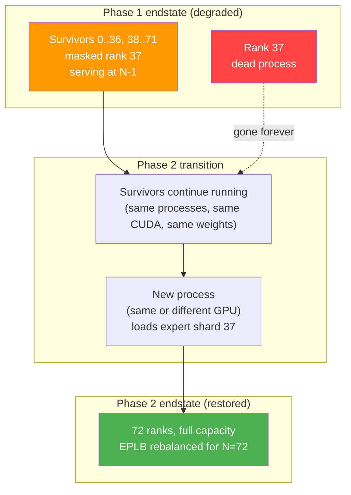

# 6. Phase 2: Full Restoration

[< Back to Overview](README.md)

Phase 2 restores the EP group to full N-rank capacity by bringing in a replacement process. This is the part of the design that touches process groups — Phase 1 deliberately avoided that ([§4](04-architecture-overview.md)) so that Phase 2 could happen in the background, on a serving system, instead of under recovery pressure on a downed system.

This section is structured around the question "what actually restarts and what doesn't" because that's what the reviewer feedback we received hinged on. §6.1 settles the conceptual question. §6.2 details the per-backend reconstruction semantics, including which backends have a clean rebuild story today and which need an audit. §6.3 covers the shadow rank + GMS roles (acceleration, not magic). §6.4 addresses the second-failure-during-rebuild edge case.

## 6.1 What restarts and what stays alive

This is the highest-leverage clarification in Phase 2. A common mental model — the one Ray 2.55's DP-group FT enforces — is that the entire EP group restarts: 72 fresh processes, weights reloaded, KV cache discarded, full warmup. That's not what this design does.

| Component | Phase 2 restart behavior |
|:---|:---|
| Dead rank's process | **Replaced.** A new process is spawned (on the same GPU if hardware survived, on a new GPU otherwise). |
| Surviving N-1 ranks' processes | **Stay alive throughout.** No restart. |
| Surviving ranks' CUDA contexts | **Preserved.** No `cudaDeviceReset`. |
| Surviving ranks' model weights | **Preserved.** Already loaded; no reload. |
| Surviving ranks' KV cache | **Preserved.** Attention-DP means each rank owns its own; survivors keep theirs. |
| Surviving ranks' MNNVL workspace | **Torn down + rebuilt.** See §6.2. |
| Surviving ranks' EPLB tables | **Updated for new topology.** §5.2 v1 `reconfigure` runs at the end. |
| EP-group process group (NCCL/MNNVL/NVSHMEM/MPI) | **Rebuilt.** All survivors + replacement participate. |
| `MPI.COMM_WORLD` | **Cannot be rebuilt with a dead member without ULFM.** See §6.2 MPI row. |

The replacement is *one process*, not a group. Whether it lands on the same physical GPU as the dead rank (if the hardware survived — software crash, OOM, recoverable error) or a different GPU (hardware failure) is an orchestration decision driven by what actually broke. From the EP-group's perspective the rank ID is reused; the rank is "replaced" rather than the surviving members "failing over."



The collective rebuild is *participation, not failover*. Surviving ranks call the same teardown + init APIs they would for any communicator-lifecycle event; they don't restart anything they own.

## 6.2 PG reconstruction per backend

Process-group reconstruction is the hardest distributed-systems problem in this design, and it varies meaningfully across the four communicator/memory layers WideEP touches. Each has its own teardown semantics, its own deadlock hazards, and its own maturity. We address them per-layer.

### NCCL — feasible with modern primitives

**Status: well-understood; the custom-shim approach is natural for MPI path and future-proof for Ray path.**

NCCL has `ncclCommAbort(comm)` — call it on a hung communicator and the surviving ranks can build a fresh one with a new `ncclUniqueId`. Surviving CUDA contexts and GPU memory are preserved; only the comm object is replaced.

**Why we build directly on NCCL primitives, not on `torch.distributed.shrink_group`.** TRT-LLM's NCCL is reached through three different code paths in production — `NcclCommunicatorOp` for PP, the `AllGatherReduceScatter` EP fallback, and TP collective ops — **none of which go through `torch.distributed`** on the MPI default path. They each manage their own `ncclComm_t` directly. So PR 2a.1 builds on `ncclCommAbort` + `ncclCommInitRank` because that's the layer where the comm objects actually live; "drop below `torch.distributed`" isn't quite the right framing because we were never above `torch.distributed` to begin with on the MPI MVP path.

**The same shim is the right answer on a future Ray path too.** Audit 1a Day 1 verified that PT 2.11's `dist.shrink_group(ranks_to_exclude=…, shrink_flags=SHRINK_ABORT)` hangs > 60 s after peer death (with `ASYNC=0`) or causes survivors to SIGABRT (with `ASYNC=1`). The "obvious" upstream recovery primitive doesn't work in our shipping PyTorch version. So even on a Ray-based future deployment where collectives go through `torch.distributed`, we'd still need the same custom NCCL-primitive shim — `dist.shrink_group(SHRINK_ABORT)` isn't a viable alternative. PR 2a.1 is therefore not a workaround for upstream brokenness but the natural design either way.

**TRT-LLM-specific gap:** zero non-test uses of `ncclCommAbort` / `NCCL_ASYNC_ERROR_HANDLING` in TRT-LLM's custom NCCL ops. The primitives are available in NCCL ≥ 2.13; we just don't call them today. PR 1a.7 closes this for MVP (since NCCL is in the data path for TP/PP regardless of EP backend); PR 2a.1 builds on top for the full rebuild.

**Phase 2 mechanism:** survivors + replacement call `ncclCommAbort` on the old comm, exchange a new `ncclUniqueId` over the FT subcomm, every participant calls `ncclCommInitRank` into the new comm. Target: ~100 ms in normal cases.

**Caveat:** historical NCCL versions had bugs (memory leaks, zombie threads) on repeated abort+reinit. Modern (NCCL 2.20+) is stable enough for production, but we should set up regression coverage that exercises the abort path.

### MNNVL — needs an audit before sizing

**Status: empirical answer not yet confirmed; named risk in [§9](09-risks-and-open-questions.md).**

`NVLinkOneSided` and `NVLinkTwoSided` allocate fabric memory via `cuMemCreate(..., CU_MEM_HANDLE_TYPE_FABRIC, ...)`, exchange handles among peers, and map peer regions into local address space. There is no library on top — no `nvshmemCommAbort` equivalent, no `ncclCommAbort` equivalent. We own the lifecycle.

**Open questions that gate the design:**

1. What does `cuMemUnmap` do when the source process is dead? Is the region's mapping silently invalidated, or do reads from it fault?
2. What does `cuMemRelease` cost, and is it safe to call from the survivors after one peer is gone?
3. After teardown, can we re-allocate fabric memory in a smaller-N (or same-N with replacement) topology and re-exchange handles? What's the latency?
4. Does any of the in-flight kernel state interact poorly with mid-flight unmap?

**The audit (§9 named risk).** A 1–2 week prototyping pass: 4-GPU rig, allocate `MnnvlMemory`, kill one rank mid-AlltoAll, run survivors through teardown + reallocate + new-handle-exchange, measure latency, verify correctness. The audit's output sizes the Phase 2 MNNVL work; until it lands, every estimate involving NVLinkOneSided rebuild is provisional.

**Best guess (subject to audit):** ~100 ms for teardown + reallocate is plausible based on `cuMemRelease`/`cuMemMap` cost in healthy paths. Cross-process unmap of a dead-process region is the unknown.

### NVSHMEM — no clean rebuild on shipping versions

**Status: deferred indefinitely; tied to DeepEP scope.**

NVSHMEM symmetric memory rebuild after peer death is not well-supported on shipping versions. NVSHMEM 3.x has begun adding fault-tolerance hooks, but the coverage falls far short of NCCL's. DeepEP additionally has a known deadlock — `Buffer.__del__` calls `intranode::barrier`, which hangs if peers are dead. The TRT-LLM Python wrappers acknowledge this explicitly:

- `tensorrt_llm/_torch/modules/fused_moe/communication/deep_ep.py:86`
- `tensorrt_llm/_torch/modules/fused_moe/communication/deep_ep_low_latency.py:103`
- `tensorrt_llm/_torch/modules/fused_moe/configurable_moe.py:422`

**Mitigation (existing):** the Python wrappers structure cleanup so the destructor doesn't run during the failure window. This is fragile but works for Phase 1 (no PG rebuild) — DeepEP buffers are masked rather than destroyed.

**Phase 2:** since DeepEP is deferred indefinitely, Phase 2 does not need to rebuild NVSHMEM symmetric memory. If DeepEP support comes in (post-`mask_buffer_ptr`), the NVSHMEM rebuild design becomes its own work track; today it's out of scope.

### MPI — blocked without ULFM

**Status: structural problem; mitigation via FT subcomm + ULFM where available.**

Restarting `MPI.COMM_WORLD` with a dead participant is not feasible on stock MPI. `MPI_Comm_split` is collective over the parent comm (including the dead member); `MPI_Comm_create` has the same issue.

**Two paths forward:**

1. **ULFM if available.** `MPI_Comm_revoke` + `MPI_Comm_shrink` + `MPI_Comm_agree` is the clean answer. OpenMPI ships ULFM as opt-in; coverage on other MPI builds is patchy. Detected at runtime ([§5.3](05-phase-1-immediate-survival.md#failure-broadcast-and-cross-rank-consensus)).

2. **FT subcomm without ULFM.** A pre-allocated subcomm with `MPI_ERRORS_RETURN` plus non-blocking Isend/Irecv keeps the FT signaling channel alive even when `MPI.COMM_WORLD` is poisoned. This is what Phase 1 uses for failure broadcast (§5.3). Phase 2 can reuse it for replacement-rank handshake but cannot rebuild `MPI.COMM_WORLD` itself without ULFM.

**Implication:** in the absence of ULFM, Phase 2 on the MPI path is single-failure-only — once `MPI.COMM_WORLD` is poisoned by the first death, you can't safely add a replacement member to it. The replacement joins via the FT subcomm + a new sub-communicator that excludes the dead rank, and operates over that sub-comm thereafter.

**This is the cleanest argument for the long-term Ray pivot** ([§3.3](03-failure-modes-and-gaps.md#33-why-not-just-pivot-to-ray)): on the Ray path with `torch.distributed`, Phase 2 communicator rebuild is a documented + tested PyTorch operation. On the MPI path, we're working around `MPI.COMM_WORLD`'s structural limitation. The MPI workaround is sufficient for MVP single-failure; multi-failure on MPI is harder and likely needs ULFM or an architectural change.

### Per-backend summary

| Backend | Rebuild story | Phase 2 readiness |
|:---|:---|:---|
| NCCL (custom ops) | `ncclCommAbort` + `ncclCommInitRank` | Wiring needed (PR 1a.7) — MVP-adjacent |
| NCCL (`torch.distributed`) | `destroy_process_group` + `init_process_group` | Inherited from PyTorch — works on Ray path |
| MNNVL (NVLinkOneSided/TwoSided) | Teardown + reallocate + handle re-exchange | **Audit needed** — sizes Phase 2 work |
| NVSHMEM (DeepEP) | No clean story; destructor deadlock | Deferred indefinitely with DeepEP |
| MPI `COMM_WORLD` | ULFM if available; FT-subcomm workaround otherwise | Single-failure on MPI path; Ray path is cleaner long-term |

## 6.3 Shadow rank + GMS roles

The MX-GMS workstream contributes Phase 2 acceleration. This subsection clarifies what those contributions actually do — they reduce *weight load time*, not the rest of the rebuild cost. Mistaking the shadow approach for a magic bullet leads to under-scoping; mistaking it for irrelevant misses the sub-second target it enables.

### Shadow EP rank — pre-staged, per-rank coverage

A **shadow EP rank** is a process pre-provisioned with the dead rank's expert shard already loaded read-only via GMS. On detection of the failure, the shadow:

1. Upgrades its GMS lock from RO → RW (fast — GMS observes the dead process's FD close, releases the old RW lock).
2. Joins the new process group (the rebuild from §6.2).
3. Begins serving.

**Per-rank coverage, not whole-group.** A shadow is bound to one specific rank's shard — it covers rank K, not "any rank." Tolerating K simultaneous failures with sub-second recovery requires K shadows, one per protected rank. Or fewer shadows + MX P2P RDMA as the fallback for the unprotected-rank case.

**Why shadow EP ranks can hit < 1 s.** From [§4](04-architecture-overview.md#phase-2--restore-p1-target--1-s-with-gms--2-s-with-mx--minutes-with-disk):

- Weight load: ~100 ms (GMS zero-copy import).
- PG rebuild: targeted ~100 ms (NCCL abort + reinit + MNNVL re-handle if audit confirms feasibility).
- EPLB rebalance: ~10 ms.
- Other coordination: < 100 ms.

Total budget: < 1 s if the stack is fully wired and the audit confirms MNNVL feasibility. **This is a target, not a guarantee.** Real measurement gates the claim.

### What the shadow doesn't do

Three things the shadow approach does *not* solve, that we should be precise about:

1. **It doesn't reduce PG rebuild cost.** The collective teardown + rebuild semantics from §6.2 still apply. Shadow just means the new participant is faster to come online for its part of the rebuild.
2. **It doesn't avoid the MPI/COMM_WORLD problem.** On MPI without ULFM, shadow's join still needs to go through the FT subcomm + new sub-comm path, not a `MPI.COMM_WORLD` rebuild.
3. **It doesn't solve cross-node failures.** Shadow uses GMS's intra-node CUDA VMM FD-handle sharing; for cross-node replacement, the shadow has to be on the surviving node, or MX P2P RDMA is used.

### GMS — fast weight load specifically

GMS provides crash-resilient memory: a process crash doesn't free its GPU memory. A new process on the same GPU can attach to the old memory via FD-handle inheritance and import weights in ~100 ms (vs minutes for disk reload, vs ~1 s for MX P2P RDMA across nodes).

**Where GMS matters:** the replacement rank's weight load is the dominant Phase 2 cost when the rank is freshly provisioned. GMS makes this ~100 ms instead of minutes.

**Where GMS doesn't matter:** if a shadow EP rank is already pre-staged and weights are already in GPU memory, GMS isn't on the critical path — the RO → RW lock upgrade is cheap, and weights aren't moving. Shadow + GMS are complementary: shadow makes the *participant* fast to come online; GMS would matter if we're cold-provisioning.

### Three Phase 2 modes

| Mode | Trigger | Weight load | Total Phase 2 |
|:---|:---|:---|:---|
| **Shadow + GMS** (best case) | Pre-provisioned shadow exists for the dead rank | ~100 ms (GMS RW upgrade, no copy) | **< 1 s** |
| **Cold + MX P2P** | No shadow; replacement provisioned, peer streams expert shard via RDMA | ~1–2 s (~9.5 GB at 20+ GB/s for DS-V3 expert shard) | **~2 s** (provision-dominated if cold-start matters) |
| **Cold + disk** | No shadow, no MX-GMS infrastructure | 1–3 minutes (reload from checkpoint) | **2–4 minutes** |

The MVP target for Phase 2 is "Phase 2 works correctly," not "Phase 2 hits < 1 s." Sub-second is the MX-GMS-accelerated path; minutes-class is the floor that always works. Both ship; the MX-GMS dependency is soft.

## 6.4 Second-failure-during-rebuild

The PG rebuild is collective. Every survivor + the replacement participates. If a *second* rank dies mid-rebuild, the rebuild operation hangs (or errors, depending on the layer's failure semantics).

**This is a real risk** because the Phase 2 rebuild window — even at the < 1 s target — is non-zero, and at WideEP scale the failure rate is non-negligible (§1.3).

**Mitigation:**

1. **Detect the second failure** via the same Layer 1 watchdog ([§5.3](05-phase-1-immediate-survival.md#layer-1--alltoall-watchdog-the-host-side-abort-hook)) running on the survivors during the rebuild window.
2. **Abandon the rebuild.** The collective is broken; the rebuild can't complete.
3. **Apply Phase 1 to the newly dead rank.** Re-mask + re-EPLB-reconfigure; serving continues at N-2 capacity.
4. **Retry Phase 2 later** with a new replacement (or a different shadow, if multi-shadow coverage exists).

The state machine for Phase 2 explicitly accommodates this:

```
Phase2.Begin → Phase2.Rebuilding → Phase2.Complete (success)
                                 → Phase2.Aborted → Phase1.Mask(new_dead) → degraded N-2
                                                  → Phase2.Begin (retry, when ready)
```

**What this means for the design:** the rebuild critical section must be *interruptible* — a second-failure detection during rebuild must reach the rebuild coordinator. The same FT subcomm carries this signal. Implementation work belongs in the Phase 2 PR breakdown ([§8.2](08-implementation-plan.md#82-phase-2-pr-breakdown)) and is one of the items the audit needs to validate empirically.

**Open question:** can the survivors' processes recover from a half-completed rebuild? If teardown ran on the old comm but init didn't complete on the new one, are the survivors in a recoverable state, or do they need to fall back to Phase 1's existing-comm masking? The audit covers this for MNNVL; NCCL's behavior is documented (yes, recoverable); MPI without ULFM is the worst case.

## 6.5 Phase 2 readiness

To summarize what's needed before Phase 2 work can begin:

1. **Phase 1 v1 complete** — Phase 2 builds on the rank masking, EPLB reconfigure, and FT subcomm primitives.
2. **MNNVL/NVSHMEM teardown audit** ([§9](09-risks-and-open-questions.md) named risk) — sizes the MNNVL rebuild PR realistically.
3. **PR 1a.7 (NCCL FT wiring)** merged — Phase 2's NCCL rebuild path depends on it.
4. **MX-GMS Phase 2 (GMS zero-copy)** — soft dependency for the < 1 s shadow path; not required for minutes-class baseline.
5. **Orchestrator integration** — for cold-provisioning a replacement (either via Ray actor spawn or via an MPI-side spawn protocol); detail in [§8.2](08-implementation-plan.md#82-phase-2-pr-breakdown).

Phase 2 work begins after Phase 1 v1 ships and audits complete.
