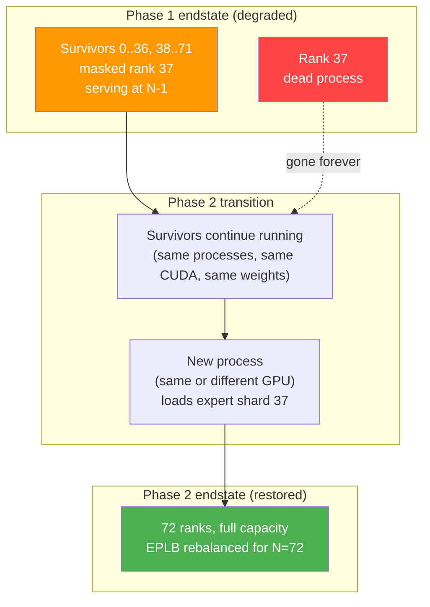

# 6. Phase 2: Full Restoration

[< Back to Overview](README.md)

Phase 2 restores the EP group to full N-rank capacity by bringing in a replacement process. The corrected Phase 1 MVP rebuilds **survivor-only** raw NCCL and control communicators so the N-1 ranks can resume; Phase 2 is the first phase that adds a replacement participant and restores the full topology. Keeping that distinction explicit avoids the now-stale claim that Phase 1 performs no communicator reconstruction at all.

This section is structured around the question "what actually restarts and what doesn't" because that's what the reviewer feedback we received hinged on. §6.1 settles the conceptual question. §6.2 details the per-backend reconstruction semantics, including which backends have a clean rebuild story today and which need an audit. §6.3 covers the shadow rank + GMS roles (acceleration, not magic). §6.4 addresses the second-failure-during-rebuild edge case.

## 6.1 What restarts and what stays alive

This is the highest-leverage clarification in Phase 2. A common mental model — the one Ray 2.55's DP-group FT enforces — is that the entire EP group restarts: 72 fresh processes, weights reloaded, KV cache discarded, full warmup. That's not what this design does.

| Component | Phase 2 restart behavior |
|:---|:---|
| Dead rank's process | **Replaced.** A new process is spawned (on the same GPU if hardware survived, on a new GPU otherwise). |
| Surviving N-1 ranks' processes | **Stay alive throughout.** No restart. |
| Surviving ranks' CUDA contexts | **Preserved.** No `cudaDeviceReset`. |
| Surviving ranks' model weights | **Preserved.** Already loaded; no reload. |
| Surviving ranks' KV cache | **Preserved.** Attention-DP means each rank owns its own; survivors keep theirs. |
| Surviving ranks' MNNVL workspace | **Torn down + rebuilt.** See §6.2. |
| Surviving ranks' EPLB tables | **Updated for new topology.** §5.2 v1 `reconfigure` runs at the end. |
| EP-group communication state | **Rebuilt.** Baseline NCCL/MNNVL/MPI state includes all survivors + replacement; NVSHMEM rebuild is conditional on selecting a DeepEP-family backend. |
| `MPI.COMM_WORLD` | **Cannot be rebuilt with a dead member without ULFM.** See §6.2 MPI row. |

The replacement is *one process*, not a group. Whether it lands on the same physical GPU as the dead rank (if the hardware survived — software crash, OOM, recoverable error) or a different GPU (hardware failure) is an orchestration decision driven by what actually broke. From the EP-group's perspective the rank ID is reused; the rank is "replaced" rather than the surviving members "failing over."



The collective rebuild is *participation, not failover*. Surviving ranks call the same teardown + init APIs they would for any communicator-lifecycle event; they don't restart anything they own.

## 6.2 PG reconstruction

Process-group reconstruction is the hardest distributed-systems problem in this design. Two distinct concerns sit under this header and the design has to address both:

- **Data-plane rebuild per EP backend** ([§6.2.1](#621-data-plane-rebuild-per-ep-backend)) — the actual L3 communicator that carries MoE AlltoAll bytes. Three different libraries (NCCL, MNNVL, NVSHMEM) with three different rebuild stories.
- **Control-plane prerequisites for any rebuild** ([§6.2.2](#622-control-plane-prerequisites-for-any-rebuild)) — the L1/L2 channel (MPI by default; `torch.distributed` on Ray) that *coordinates* the rebuild. Survivors agree on the new topology, exchange a new `ncclUniqueId`, signal "rebuild ready" to the replacement, and resume serving — all over this channel. If it's poisoned by the dead member, the data-plane rebuild can't proceed even when the data-plane libraries cooperate.

Both have to work for Phase 2 to succeed. The first three sub-sections below are L3 data-plane backends; the fourth is L1/L2 control-plane survival. They're not interchangeable.

### 6.2.1 Data-plane rebuild per EP backend

Three L3 backends, each with different rebuild semantics. None of these is interchangeable with the others — each has to be addressed in its own sub-PR within Phase 2.

#### NCCL — feasible with modern primitives

**Status: well-understood; the custom-shim approach is natural for MPI path and future-proof for Ray path.**

NCCL has `ncclCommAbort(comm)` — call it on a hung communicator and the surviving ranks can build a fresh one with a new `ncclUniqueId`. Surviving CUDA contexts and GPU memory are preserved; only the comm object is replaced.

**Why we build directly on NCCL primitives, not on `torch.distributed.shrink_group`.** TRT-LLM's NCCL is reached through three different code paths in production — `NcclCommunicatorOp` for PP, the `AllGatherReduceScatter` EP fallback, and TP collective ops — **none of which go through `torch.distributed`** on the MPI default path. They each manage their own `ncclComm_t` directly. So PR 2a.1 builds on `ncclCommAbort` + `ncclCommInitRank` because that's the layer where the comm objects actually live; "drop below `torch.distributed`" isn't quite the right framing because we were never above `torch.distributed` to begin with on the MPI MVP path.

**The same shim is the right answer on a future Ray path too.** Audit 1a Day 1 verified that PT 2.11's `dist.shrink_group(ranks_to_exclude=…, shrink_flags=SHRINK_ABORT)` hangs > 60 s after peer death (with `ASYNC=0`) or causes survivors to SIGABRT (with `ASYNC=1`). The "obvious" upstream recovery primitive doesn't work in our shipping PyTorch version. So even on a Ray-based future deployment where collectives go through `torch.distributed`, we'd still need the same custom NCCL-primitive shim — `dist.shrink_group(SHRINK_ABORT)` isn't a viable alternative. PR 2a.1 is therefore not a workaround for upstream brokenness but the natural design either way.

**TRT-LLM-specific gap and current direction:** the original audit found zero non-test uses of `ncclCommAbort` in the then-current tree. MVP item 1a.7 now adds survivor-only abort/reinitialization for the raw NCCL paths (NCCL is in the TP/PP and fallback data paths regardless of the selected EP backend). PR 2a.1 builds on that primitive to admit a replacement and restore the full group; it is not the first communicator rebuild in the recovery sequence.

**Phase 2 mechanism:** survivors abort the old communicator, the Phase 2 join/bootstrap protocol admits the replacement, a control channel that includes every new participant exchanges a new `ncclUniqueId`, and each participant calls `ncclCommInitRank` into the full communicator. The pre-failure 1c.3 signaling communicator cannot by itself include a process that was not already a member. The exact replacement bootstrap is an open 2c.2 design choice; the historical ~100 ms target remains a hypothesis pending Audit 1b rather than a guaranteed normal-case number.

**Caveat:** historical NCCL versions had bugs (memory leaks, zombie threads) on repeated abort+reinit. Modern (NCCL 2.20+) is stable enough for production, but we should set up regression coverage that exercises the abort path.

#### MNNVL — needs an audit before sizing

**Status: empirical answer not yet confirmed; named risk in [§9](09-risks-and-open-questions.md).**

`NVLinkOneSided` and `NVLinkTwoSided` allocate shareable CUDA memory with the platform-selected handle mode: current x86_64 B200/B300 uses `CU_MEM_HANDLE_TYPE_POSIX_FILE_DESCRIPTOR`, while Grace/aarch64 GB200/GB300 NVL72 uses `CU_MEM_HANDLE_TYPE_FABRIC` with IMEX. Peers exchange handles and map every region into local address space. There is no library-level abort API on top; TRT-LLM owns this lifecycle, and evidence from one handle mode is not treated as proof for the other.

**Open questions that gate the design:**

1. What does `cuMemUnmap` do when the source process is dead? Is the region's mapping silently invalidated, or do reads from it fault?
2. What does `cuMemRelease` cost, and is it safe to call from the survivors after one peer is gone?
3. After teardown, can we re-allocate fabric memory in a smaller-N (or same-N with replacement) topology and re-exchange handles? What's the latency?
4. Does any of the in-flight kernel state interact poorly with mid-flight unmap?

**The audit (§9 named risk).** A 1–2 week prototyping pass: 4-GPU rig, allocate `MnnvlMemory`, kill one rank mid-AlltoAll, run survivors through teardown + reallocate + new-handle-exchange, measure latency, verify correctness. The audit's output sizes the Phase 2 MNNVL work; until it lands, every estimate involving NVLinkOneSided rebuild is provisional.

**Best guess (subject to audit):** ~100 ms for teardown + reallocate is plausible based on `cuMemRelease`/`cuMemMap` cost in healthy paths. Cross-process unmap of a dead-process region is the unknown.

#### NVSHMEM — no clean rebuild on shipping versions

**Status: direct DeepEP/NVSHMEM rebuild is deferred pending an upstream primitive; the separate Phase 1-IB NIXL-EP topology path does not require this rebuild. Verified by a May 2026 API survey.**

The current shipping NVSHMEM (3.6.5, docs updated 2026-03-20) exposes only collective `nvshmem_finalize` and a job-wide `nvshmem_global_exit` abort; all team-construction calls (`nvshmem_team_destroy`, `nvshmem_team_split_strided`, `nvshmem_team_split_2d`, `nvshmemx_team_init`) are collective over the parent team. **No API admits a surviving subset of PEs to tear down and rebuild the symmetric heap and teams without participation from the dead PEs.** No FT-tagged release notes across the 3.x line (3.0 through 3.6.5); no FT-tagged GitHub issues; no NVIDIA roadmap statements about peer-death recovery in any visible thread. The OpenSHMEM 1.6 parent spec (Nov 2024) is similarly silent on FT primitives — so even if NVIDIA wanted to add them, there's no upstream standard to align with.

DeepEP additionally has a known deadlock — `Buffer.__del__` calls `intranode::barrier`, which hangs if peers are dead. The TRT-LLM Python wrappers acknowledge this explicitly:

- `tensorrt_llm/_torch/modules/fused_moe/communication/deep_ep.py:86`
- `tensorrt_llm/_torch/modules/fused_moe/communication/deep_ep_low_latency.py:103`
- `tensorrt_llm/_torch/modules/fused_moe/configurable_moe.py:422`

**Current boundary:** the wrapper comments identify the destructor hazard but do not provide survivor masking or a safe rebuild. Direct DeepEP is therefore not admitted by the corrected MVP. Phase 1-IB either selects NIXL-EP's separate topology lifecycle after Audit 3 or treats the DeepEP static-timeout option as a limited interim, not full survivor recovery.

**Phase 2:** the MNNVL baseline does not rebuild NVSHMEM symmetric memory. If direct DeepEP support becomes a selected product path after an upstream primitive lands, the NVSHMEM rebuild design becomes its own conditional work track. The Phase 1-IB NIXL-EP path instead uses its own disconnect/reconnect topology lifecycle.

### 6.2.2 Control-plane prerequisites for any rebuild

Even when the data-plane libraries (NCCL, MNNVL, NVSHMEM) cooperate, the rebuild has to be *coordinated* — survivors must agree on the dead-rank set, exchange a new `ncclUniqueId`, signal "rebuild ready" to the replacement, and synchronize "rebuild complete, resume serving." On the MPI default path that coordination runs over MPI; on a future Ray deployment it would run over `torch.distributed`. Either way, **if the control-plane communicator is poisoned by the dead member, the data-plane rebuild stalls waiting on broken control-plane primitives.** This subsection covers that survival concern.

#### MPI — blocked without ULFM

**Status: structural problem; mitigation via FT subcomm + ULFM where available.**

Restarting `MPI.COMM_WORLD` with a dead participant is not feasible on stock MPI. `MPI_Comm_split` is collective over the parent comm (including the dead member); `MPI_Comm_create` has the same issue.

**Two paths forward:**

1. **ULFM if available.** `MPI_Comm_revoke` + `MPI_Comm_shrink` + `MPI_Comm_agree` is the clean answer. OpenMPI ships ULFM as opt-in; coverage on other MPI builds is patchy. Detected at runtime ([§5.3](05-phase-1-immediate-survival.md#failure-broadcast-and-cross-rank-consensus)).

2. **FT signaling plus a survivor control plane without ULFM.** Item 1c.3 provides failure notification/reconciliation. Item 1c.3a must then create or select a survivor-only control communicator and publish an `ActiveRankMap` for post-failure management collectives. Neither primitive can rebuild `MPI.COMM_WORLD` itself without ULFM. Phase 2 additionally needs an explicit join/bootstrap protocol for a replacement; a pre-failure signaling communicator alone cannot admit a process that was not one of its members.

**Implication:** in the absence of ULFM, the original `MPI.COMM_WORLD` cannot be treated as the replacement-membership mechanism after the first death. PR 2c.2 must choose and prove how a replacement is bootstrapped—such as `MPI_Comm_spawn`, a pre-staged participant, or an external non-MPI control channel—and which post-join operations bypass the poisoned world. The existing 1c.3/1c.3a survivor channels are necessary for degraded service but do not solve rank admission.

**This is the cleanest argument for the long-term Ray pivot** ([§3.3](03-failure-modes-and-gaps.md#33-why-not-just-pivot-to-ray)): on the Ray path with `torch.distributed`, Phase 2 communicator rebuild is a documented + tested PyTorch operation. On the MPI path, we're working around `MPI.COMM_WORLD`'s structural limitation. The MPI workaround is sufficient for MVP single-failure; multi-failure on MPI is harder and likely needs ULFM or an architectural change.

### 6.2.3 Combined summary (data plane + control plane)

| Layer | Component | Rebuild / survival story | Phase 2 readiness |
|:---|:---|:---|:---|
| **L3 data plane** | NCCL (custom ops) | `ncclCommAbort` + `ncclCommInitRank` | Wiring needed (PR 1a.7 in MVP); rebuild shim is PR 2a.1 |
| **L3 data plane** | NCCL (`torch.distributed`) | `destroy_process_group` + `init_process_group` | Inherited from PyTorch — works on Ray path; PT 2.11 `shrink_group(SHRINK_ABORT)` itself broken (Audit 1a Day 1) |
| **L3 data plane** | MNNVL (NVLinkOneSided/TwoSided) | Teardown + reallocate + handle re-exchange | **Audit needed** — sizes Phase 2 work |
| **L3 data plane** | NVSHMEM (direct DeepEP path) | No clean story on shipping versions; destructor deadlock | Conditional on direct DeepEP support; NIXL-EP topology path is separate |
| **L1/L2 control plane** | MPI `COMM_WORLD` | ULFM if available; 1c.3 notification + 1c.3a survivor communicator/`ActiveRankMap` otherwise | Single-failure degraded service is MVP scope; replacement join remains Phase 2 work |

### 6.2.4 CUDA graph recapture cost in Phase 2

Phase 2's full-topology reconstruction invalidates rebuilt communicator/workspace handles (baseline NCCL + MNNVL; NVSHMEM only conditionally), which invalidates graphs captured against them. The coordinator must select eager mode and invalidate old-generation graphs before membership commit; recapture starts only after the new generation is committed. Estimated full recapture cost per surviving rank remains ~300 ms–1.5 s across configured batch sizes, pending measurement in [Audit 1a Day 6](audit-1a-findings.md).

[MVP item 1a.11](pr-execution/08-implementation-plan.md#1a--rank-masking-in-communication-kernels) owns the eager-mode ship gate plus graph invalidation/recapture policy and **applies unchanged in Phase 2**. After reconstruction completes, invalidate the full graph cache before the new membership generation commits; serve eagerly after commit, and recapture generation-bound graphs in the background. The user-visible recovery time becomes rebuild-plus-eager-resume, not rebuild-plus-full-recapture.

## 6.3 Shadow rank + GMS roles

The MX-GMS workstream contributes Phase 2 acceleration. This subsection clarifies what those contributions actually do — they reduce *weight load time*, not the rest of the rebuild cost. Mistaking the shadow approach for a magic bullet leads to under-scoping; mistaking it for irrelevant misses the sub-second target it enables.

### Shadow EP rank — pre-staged, per-rank coverage

A **shadow EP rank** is a process pre-provisioned with the dead rank's expert shard already loaded read-only via GMS. On detection of the failure, the shadow:

1. Upgrades its GMS lock from RO → RW (fast — GMS observes the dead process's FD close, releases the old RW lock).
2. Joins the new process group (the rebuild from §6.2).
3. Begins serving.

**Per-rank coverage, not whole-group.** A shadow is bound to one specific rank's shard — it covers rank K, not "any rank." Tolerating K simultaneous failures with sub-second recovery requires K shadows, one per protected rank. Or fewer shadows + MX P2P RDMA as the fallback for the unprotected-rank case.

**Why shadow EP ranks can hit < 1 s.** From [§4](04-architecture-overview.md#phase-2--restore-p1-target--1-s-with-gms--2-s-with-mx--minutes-with-disk):

- Weight load: ~100 ms (GMS zero-copy import).
- PG rebuild: targeted ~100 ms (NCCL abort + reinit + MNNVL re-handle if audit confirms feasibility).
- EPLB rebalance: ~10 ms.
- Other coordination: < 100 ms.

Total budget: < 1 s if the stack is fully wired and the audit confirms MNNVL feasibility. **This is a target, not a guarantee.** Real measurement gates the claim.

### What the shadow doesn't do

Three things the shadow approach does *not* solve, that we should be precise about:

1. **It doesn't reduce PG rebuild cost.** The collective teardown + rebuild semantics from §6.2 still apply. Shadow just means the new participant is faster to come online for its part of the rebuild.
2. **It doesn't avoid the MPI/COMM_WORLD problem.** On MPI without ULFM, a shadow must either be a deliberately pre-staged member of a suitable bootstrap channel or join through the external mechanism selected by 2c.2. It cannot be assumed to appear in the pre-failure FT/survivor communicator, and the poisoned `MPI.COMM_WORLD` is not rebuilt in place.
3. **It doesn't solve cross-node failures.** Shadow uses GMS's intra-node CUDA VMM FD-handle sharing; for cross-node replacement, the shadow has to be on the surviving node, or MX P2P RDMA is used.

### GMS — fast weight load specifically

GMS provides crash-resilient memory: a process crash doesn't free its GPU memory. A new process on the same GPU can attach to the old memory via FD-handle inheritance and import weights in ~100 ms (vs minutes for disk reload, vs ~1 s for MX P2P RDMA across nodes).

**Where GMS matters:** the replacement rank's weight load is the dominant Phase 2 cost when the rank is freshly provisioned. GMS makes this ~100 ms instead of minutes.

**Where GMS doesn't matter:** if a shadow EP rank is already pre-staged and weights are already in GPU memory, GMS isn't on the critical path — the RO → RW lock upgrade is cheap, and weights aren't moving. Shadow + GMS are complementary: shadow makes the *participant* fast to come online; GMS would matter if we're cold-provisioning.

### Three Phase 2 modes

| Mode | Trigger | Weight load | Total Phase 2 |
|:---|:---|:---|:---|
| **Shadow + GMS** (best case) | Pre-provisioned shadow exists for the dead rank | ~100 ms (GMS RW upgrade, no copy) | **< 1 s** |
| **Cold + MX P2P** | No shadow; replacement provisioned, peer streams expert shard via RDMA | ~1–2 s (~9.5 GB at 20+ GB/s for DS-V3 expert shard) | **~2 s** (provision-dominated if cold-start matters) |
| **Cold + disk** | No shadow, no MX-GMS infrastructure | 1–3 minutes (reload from checkpoint) | **2–4 minutes** |

The MVP target for Phase 2 is "Phase 2 works correctly," not "Phase 2 hits < 1 s." Sub-second is the MX-GMS-accelerated path; minutes-class is the floor that always works. Both ship; the MX-GMS dependency is soft.

## 6.4 Second-failure-during-rebuild

The PG rebuild is collective. Every survivor + the replacement participates. If a *second* rank dies mid-rebuild, the rebuild operation hangs (or errors, depending on the layer's failure semantics).

**This is a real risk** because the Phase 2 rebuild window — even at the < 1 s target — is non-zero, and at WideEP scale the failure rate is non-negligible (§1.3).

**Mitigation:**

1. **Detect the second failure through the currently valid backend/control path.** Item 2a.8 must cover NCCL, MNNVL, bootstrap, and control-communicator failures during rebuild; an MNNVL completion-flag watchdog is relevant only when that kernel is actually progressing.
2. **Abandon the rebuild.** Abort the broken attempt without publishing its partial topology.
3. **Enter the complete Phase 1 survivor transaction for the expanded failed set.** Reconcile evidence, validate admission, quiesce, prepare EPLB, rebuild the last viable survivor control/data paths, apply graph policy, atomically commit membership, and dispose affected requests. If no valid control path or admitted placement remains, fail closed to external restart.
4. **Retry Phase 2 later** with a new replacement (or a different shadow, if multi-shadow coverage exists).

The state machine for Phase 2 explicitly accommodates this:

```
Phase2.Begin → Phase2.Rebuilding → Phase2.Complete (success)
                                 → Phase2.Aborted → Phase1.SurvivorTransaction(new_failed_set)
                                                  → degraded N-2 or fail-closed restart
                                                  → Phase2.Begin (retry, when ready)
```

**What this means for the design:** the rebuild critical section must be *interruptible*—a second-failure event must reach the rebuild coordinator over the currently valid survivor control path. Do not assume that path is the original FT subcomm after membership changes. Implementation work belongs in the Phase 2 PR breakdown ([§8.2](pr-execution/08-implementation-plan.md#82-phase-2-pr-breakdown)) and is one of the items the audit needs to validate empirically.

**Open question:** can survivors recover from a half-completed rebuild? If teardown ran on the old communicator but initialization did not complete, they must abort and re-enter the Phase 1 survivor transaction on the last valid control path—not merely reuse an old mask. If no such path remains, recovery fails closed. The audit covers this for MNNVL; NCCL's abort behavior is documented; MPI without ULFM is the worst case.

## 6.5 Phase 2 readiness

To summarize what's needed before Phase 2 work can begin:

1. **Corrected Phase 1 MVP complete** — Phase 2 builds on launch masking and runtime kernel escape (1a.8), the graph gate (1a.11), FT placement admission (1b.2a), failure notification (1c.3), survivor control membership (1c.3a/1c.4a), atomic recovery coordination (1c.4b), failed-epoch/request disposition (1c.4c), poisoned-MPI lifecycle handling (1d.0a), and the physical 1d.4/1d.4a acceptance gates.
2. **MNNVL teardown audit** ([§9](09-risks-and-open-questions.md) named risk) — sizes the baseline MNNVL rebuild PR realistically. A separate DeepEP/NVSHMEM teardown audit is required only when that conditional backend is selected.
3. **PR 1a.7 (NCCL FT wiring)** merged — Phase 2's full-group NCCL rebuild path depends on its survivor-only primitive.
4. **MX-GMS Phase 2 (GMS zero-copy)** — soft dependency for the < 1 s shadow path; not required for minutes-class baseline.
5. **Orchestrator integration** — for cold-provisioning a replacement (either via Ray actor spawn or via an MPI-side spawn protocol); detail in [§8.2](pr-execution/08-implementation-plan.md#82-phase-2-pr-breakdown).

Phase 2 work begins after Phase 1 v1 ships and audits complete.
